# Sentaurus™ Structure Editor User Guide

Version N-2017.09, September 2017

synopsys 

### Copyright and Proprietary Information Notice

©2017 Synopsys, Inc. This Synopsys software and all associated documentation are proprietary to Synopsys, Inc. and may only be used pursuant to the terms and conditions of a written license agreement with Synopsys, Inc. All other use, reproduction, modification, or distribution of the Synopsys software or the associated documentation is strictly prohibited.

##### Destination Control Statement

All technical data contained in this publication is subject to the export control laws of the United States of America. Disclosure to nationals of other countries contrary to United States law is prohibited. It is the reader's responsibility to determine the applicable regulations and to comply with them.

##### Disclaimer

SYNOPSYS, INC., AND ITS LICENSORS MAKE NO WARRANTY OF ANY KIND, EXPRESS OR IMPLIED, WITH REGARD TO THIS MATERIAL, INCLUDING, BUT NOT LIMITED TO, THE IMPLIED WARRANTIES OF MERCHANTABILITY AND FITNESS FOR A PARTICULAR PURPOSE.

##### Trademarks

Synopsys and certain Synopsys product names are trademarks of Synopsys, as set forth at https://www.synopsys.com/company/legal/trademarks-brands.html. All other product or company names may be trademarks of their respective owners.

##### Third-Party Links

Any links to third-party websites included in this document are for your convenience only. Synopsys does not endorse and is not responsible for such websites and their practices, including privacy practices, availability, and content.

Synopsys, Inc.

690 E. Middlefield Road

Mountain View, CA 94043

www.synopsys.com

## Contents

About This Guide xxvii    
Related Publications xxvii    
Conventions xxvii    
Customer Support xxviii    
Accessing SolvNet xxviii    
Contacting Synopsys Support xxviii    
Contacting Your Local TCAD Support Team Directly xxviii    
Acknowledgments xxix    
    
Chapter 1 Overview 1    
Introduction to Sentaurus Structure Editor 1    
ACIS Geometry Kernel 3    
    
Chapter 2 Launching Sentaurus Structure Editor 5    
Starting Sentaurus Structure Editor 5    
Command-Line Options 5    
Batch Mode 6    
Heap Size 7    
Scheme Script Syntax-Checking 7    
Literal Evaluation of Scheme Script 8    
Interactive Mode 8    
Loading a Boundary and Mesh Command File at Startup 8    
Loading an ACIS File at Startup 9    
Exiting Sentaurus Structure Editor 9    
Saving and Loading Files From Graphical User Interface 9    
Opening Models 9    
Saving Models 10    
Saving Boundaries 10    
Importing Files 10    
Recording Actions to a File 11    
    
Chapter 3 Graphical User Interface 13    
Introduction to Graphical User Interface 13    
GUI Modes 14    
Menu Bar 14

Toolbars ..... 15    
Restoring GUI Settings From Previous Session ..... 18    
Manipulating the View ..... 18    
Lists ..... 19    
View Window ..... 19    
Command-Line Window ..... 20    
Undoing and Redoing Actions ..... 21    
Customizing Graphical User Interface ..... 22    
Configuring Command-Line Window ..... 22    
Changing Attributes of Graphical User Interface ..... 23    
Background Color ..... 23    
GUI Style ..... 24    
Font Size of Menu Bar of Main Window ..... 24    
Size of Main Window ..... 24    
Position of Main Window ..... 24    
Restoring Settings of Graphical User Interface ..... 25    
Selecting Entities ..... 25    
Snapping Modes ..... 26    
Printing ..... 26    
Defining Parameters From the Graphical User Interface ..... 27    
Parameterizing Dialog Boxes ..... 28    
    
Chapter 4 Controlling Views ..... 29    
Zooming, Panning, and Orbiting With Mouse Operations ..... 29    
Interactive Cutting Plane Viewer ..... 30    
Perspective and Orthographic Views in Three Dimensions ..... 31    
Selecting the DATEX Color Scheme ..... 32    
Selecting the Rendering Mode ..... 32    
View Orientation ..... 34    
Showing and Hiding Coordinate Axes ..... 35    
Displaying Grid Lines ..... 35    
Displaying Rulers ..... 35    
Scaling View ..... 36    
Visualizing Selected Geometric Objects ..... 36    
Quick Access to Placements, Refinements, and Doping Profiles ..... 37    
Visualizing the Internal Entity Representation ..... 38

Chapter 5 Generating Geometric Structures 41    
Modeling Unit and Modeling Range 41    
Creating a New Structure 42

Reinitializing Sentaurus Structure Editor ..... 42    
Setting Interactive Work Preferences ..... 42    
Exact Coordinates ..... 42    
Snapping ..... 43    
Active Material ..... 43    
Naming Regions ..... 44    
Overlap Behavior ..... 44    
Basic 2D Shapes ..... 46    
Rectangles ..... 46    
Regular Polygons ..... 46    
Polygons ..... 47    
Circles ..... 47    
Ellipses ..... 47    
Ruled Regions ..... 48    
Other Basic 2D Shapes ..... 49    
Editing Shapes in Two Dimensions ..... 50    
Adding a Vertex ..... 50    
Moving a Vertex ..... 50    
Moving Region Edges ..... 52    
Moving Regions ..... 52    
Deleting Vertices ..... 53    
Rounding ..... 54    
Chamfering ..... 55    
Cutting ..... 56    
Creating a Convex Hull ..... 56    
Splitting Structures ..... 57    
Simplifying 2D Structures ..... 58    
Aligning Vertices ..... 58    
Merging Collinear Edges ..... 61    
Breaking Nearly Axis-Aligned Edges ..... 65    
Two-Dimensional Boundary Smoothing ..... 67    
Edge Length Queries ..... 68    
Basic 3D Shapes ..... 69    
Cuboids ..... 69    
Cylinders ..... 70    
Spheres ..... 71    
Ellipsoids ..... 71    
Other Basic 3D Shapes ..... 72    
Import Capability of User-Defined Data ..... 72    
Creating a Layered Lens Structure ..... 73    
Creating a Solid Body From Faces ..... 74

Editing Shapes in Three Dimensions ..... 75    
Chamfering Edges ..... 75    
Rounding Edges ..... 76    
Tapering ..... 77    
Creating 3D Objects From 1D and 2D Objects ..... 83    
Wires ..... 83    
Extruding ..... 84    
Sweeping a 2D Object ..... 86    
Sweep Distance ..... 87    
Sweep Along a Vector ..... 89    
Sweep Around an Axis (Regular and Corner Sweeps) ..... 91    
Sweep Along a Wire ..... 94    
Sweep Options ..... 96    
Sweeping Examples ..... 98    
Skinning ..... 101    
Default Skinning ..... 101    
Skinning With Normals ..... 103    
Skinning With Vectors ..... 104    
Skinning With Guides ..... 104    
Skinning Example ..... 105    
Editing 2D and 3D Structures ..... 106    
Explicit Boolean Operations ..... 106    
Changing the Material of a Region ..... 108    
Changing the Name of a Region ..... 109    
Deleting Regions ..... 109    
Separating Lumps ..... 110    
Two-Dimensional Cuts From a 3D Structure ..... 111    
Split-Insert Stretching of a Device ..... 112    
Extending a 2D Device ..... 114    
Trimming a 3D Structure ..... 115    
Coordinate Systems and Transformations ..... 116    
Work Planes ..... 117    
Local Coordinate Systems ..... 119    
Device Scaling ..... 120    
Entity Transformations: Scaling, Translation, Rotation, and Reflection ..... 121    
Local Scaling of Entities ..... 122    
Difference Between sdegeo:scale and sdegeo:scale-selected ..... 123    
Translation ..... 124    
Rotation ..... 126    
Reflection ..... 127    
Scheme Functions for Transformations ..... 129

Chapter 6 Structure Generation Using Etching and Deposition 131    
Overview ..... 131    
Base Coordinate System ..... 132    
Unified Coordinate System ..... 132    
DF–ISE Coordinate System ..... 133    
Selecting the Coordinate System ..... 133    
Mask Layout Input and Mask Generation ..... 133    
Mask Generation ..... 135    
Offsetting (Biasing) Mask ..... 135    
TCAD Layout Reader of Sentaurus Structure Editor ..... 136    
Loading TCAD Layouts ..... 137    
Finding Layer Names and Layer IDs ..... 137    
Applying a Stretch ..... 138    
Selecting the Simulation Domain ..... 138    
Finding Coordinates of Bounding Box ..... 138    
Creating and Using Masks ..... 139    
Coordinate System Support ..... 140    
Layout-Driven Contact Assignment ..... 141    
Layout-Driven Meshing ..... 142    
Process Emulation Commands ..... 145    
Syntax and Keywords ..... 145    
Process Emulation Algorithms ..... 152    
The lop-move Algorithm ..... 153    
The lopx Algorithm ..... 153    
The PT Algorithm ..... 153    
The sweep Algorithm ..... 154    
Restrictions on Handling Mixed Models ..... 155    
Process Emulation Steps ..... 155    
Defining Domain ..... 155    
Generating Substrate ..... 156    
Patterning ..... 156    
Patterning Keywords and Keyword Combinations ..... 156    
Anisotropic Patterning ..... 157    
Isotropic Patterning ..... 157    
Photo Operation ..... 158    
Photo Keywords and Keyword Combinations ..... 158    
Example ..... 158    
Deposition ..... 159    
Deposition Keywords and Keyword Combinations ..... 159    
Anisotropic Deposition ..... 162

Isotropic Deposition ..... 163    
Selective Deposition ..... 164    
Directional Deposition ..... 166    
Shadowing ..... 168    
Rounding and Advanced Rounding ..... 169    
Etching ..... 170    
Etching Keywords and Keyword Combinations ..... 170    
Example: Etching Operation Using Different Etch Options ..... 170    
Example: Multimaterial Etching ..... 171    
Some Notes About Multimaterial Etching ..... 172    
Some Notes About Shadowing ..... 174    
Fill ..... 174    
Polishing ..... 175    
Interconnect Layer Generation ..... 175    
Example: Generating an Interconnect Structure ..... 176    
Shape Library ..... 177    
Removing Material ..... 177    
Doping and Implantation ..... 178    
Process Emulation Example ..... 179    
    
Chapter 7 Electrical and Thermal Contacts ..... 183    
Overview ..... 183    
Defining and Activating a Contact ..... 184    
Deleting a Contact ..... 185    
Assigning Edges or Faces to a Contact ..... 185    
Assigning a Region Boundary to a Contact ..... 186    
Removing Edges or Faces From a Contact ..... 187    
Creating Edges or Faces for Use in Contacts ..... 188    
Protecting Contacts ..... 190    
Examples of Contact Assignments ..... 191    
Creating Different 2D Contacts ..... 191    
Creating Different 3D Contacts ..... 192    
    
Chapter 8 Generating Mesh and Doping Profiles ..... 195    
Overview ..... 195    
Defining Areas for Mesh Refinement or Doping ..... 196    
Line-Segment Ref/Eval Windows ..... 196    
Rectangular and Polygonal Ref/Eval Windows ..... 196    
Cuboidal Ref/Eval Windows ..... 198    
Extracting Ref/Eval Window From Face ..... 198

Extracting Ref/Eval Window From Body Interface ..... 199    
Extracting Ref/Eval Window From 3D Solid Body ..... 199    
Extracting Ref/Eval Windows From 3D Solid Body Interfaces ..... 200    
Deleting Ref/Eval Windows ..... 202    
Mesh Refinement Definitions ..... 202    
Regular Refinement Boxes ..... 202    
Multibox Refinements ..... 206    
Sentaurus Mesh Axis Aligned Section ..... 209    
Delaunizer Section ..... 211    
Offsetting Refinements ..... 212    
Tensor Mesh Refinements ..... 215    
Tools Section ..... 215    
Defining Doping Profiles ..... 216    
Constant Doping Profiles ..... 216    
Analytic Doping Profiles ..... 218    
External 2D and 3D Doping Profiles ..... 223    
Particle Doping Profiles ..... 230    
Controlling the Boundary Tessellation ..... 232    
Global Tessellation Settings ..... 232    
Tessellating Spherical Faces ..... 236    
Facewise Tessellation Settings ..... 237    
Automatically Assigning Local Refinements to Optimize Quality of Tessellated Boundary Output ..... 238    
Scheme Functions for Controlling Tessellation ..... 239    
Boundary Tessellation in Three Dimensions ..... 239    
Alternative Faceter ..... 240    
IO Controls Section and Interpolate Section ..... 242    
Quality Report Section ..... 243    
Building the Mesh ..... 244    
Chapter 9 Creating Planar Layer Stacks ..... 247    
Using the sdeepi:create-layerstack Scheme Extension ..... 247    
Command File ..... 248    
Global Section ..... 249    
Size and Position of Structure ..... 251    
Global Refinement Strategy ..... 253    
User-Defined Extension Columns ..... 253    
Layers Section ..... 253    
Region Column ..... 255    
Material Column ..... 255    
SourceParFile Column ..... 256

Thickness Column ..... 256    
Doping Column ..... 256    
MoleFraction Column ..... 259    
Refinement Column ..... 261    
Extension Columns ..... 263    
Processing the Layer Stack ..... 264    
References ..... 265    
    
Chapter 10 Working With Scheme and Scheme Extensions ..... 267    
Scheme Data Types ..... 267    
Basic Scheme Programming for Users of Sentaurus Structure Editor ..... 268    
Basic Scheme Syntax ..... 269    
Defining Simple Variables and Data Types ..... 269    
Printing Text to Standard Output ..... 270    
String Operations ..... 270    
Lists ..... 271    
Arithmetic Expressions ..... 273    
Boolean Operations ..... 274    
If Blocks ..... 274    
Simple Do Loops ..... 276    
For Each Loops ..... 276    
Procedures ..... 277    
System Calls ..... 278    
Error Signaling to Sentaurus Workbench ..... 278    
    
Chapter 11 Geometric Query Functions ..... 279    
Entity IDs and Attributes ..... 279    
Topological Entity Types ..... 280    
Selecting Geometric Objects ..... 282    
Graphic-Supported Object Selection ..... 282    
Script-Based Object Selection ..... 282    
Finding Region Names and Material Properties ..... 285    
Automatic Region-Naming ..... 285    
List of Supported Materials ..... 286    
Finding Vertex Positions ..... 287    
Vertex-Vertex Distance ..... 287    
Debugging Topological Entities ..... 288    
Finding Edges, Faces, and Other Elements of a Body ..... 288    
Bounding Box Query ..... 290    
Scheme Functions for Entity Queries ..... 291

Chapter 12 Miscellaneous Utilities 293    
Background Image Loader ..... 293    
User-Defined Dialog Boxes ..... 294    
Example: Defining a Dialog Box ..... 295    
Step 1: Define a Scheme Function That the Dialog Box Will Execute ..... 295    
Step 2: Define and Configure the Dialog Box ..... 296    
Step 3: Launch the Dialog Box ..... 296    
Starting Sentaurus Structure Editor With User-Defined Variables ..... 297    
User-Defined GUI Interactions ..... 297    
Dialog Boxes for Obtaining Values ..... 297    
GUI Actions for Obtaining Positions ..... 298    
Message Boxes ..... 298    
Appendix A Commands ..... 299    
Presentation of Commands ..... 299    
afm-smooth-layers ..... 300    
bbox ..... 302    
bbox-exact ..... 303    
body? ..... 304    
build-csv-lens ..... 305    
color:rgb ..... 306    
complete-edge-list ..... 307    
convert-to-degree ..... 308    
convert-to-radian ..... 308    
edge? ..... 309    
edge:circular ..... 310    
edge:circular? ..... 311    
edge:elliptical? ..... 311    
edge:end ..... 312    
edge:length ..... 312    
edge:linear ..... 313    
edge:linear? ..... 314    
edge:mid-point ..... 315    
edge:start ..... 315    
edge:type ..... 316    
entity:box ..... 317    
entity:copy ..... 318    
entity:debug ..... 319    
entity:deep-copy ..... 320    
entity:delete ..... 321

entity:dist .....322    
entity:edges .....323    
entity:erase .....324    
entity:faces .....324    
entity:loops .....325    
entity:lumps .....326    
entity:set-color .....327    
entity:shells .....329    
entity:vertices .....330    
env:set-tolerance .....331    
env:tolerance .....332    
erf .....332    
erfc .....333    
exists-empty-mask-name .....333    
exists-mask-name .....334    
extract-interface-normal-offset-refwindow .....335    
extract-interface-offset-refwindow .....336    
extract-refpolyhedron .....337    
extract-refwindow .....338    
face:area .....339    
face:conical? .....340    
face:cylindrical? .....340    
face:planar? .....341    
face:plane-normal .....341    
face:spherical? .....342    
face:spline? .....342    
face:toroidal? .....343    
filter:type .....344    
find-body-id .....345    
find-body-id-drs .....345    
find-drs-id .....346    
find-edge-id .....347    
find-edge-id-drs .....348    
find-face-id .....349    
find-face-id-drs .....350    
find-material-id .....351    
find-region .....352    
find-region-id .....353    
find-vertex-id .....354    
find-vertex-id-drs .....354    
get-body-list .....355

get-drs-list .....355    
get-empty-mask-list .....356    
get-mask-list .....356    
gvector.. .....357    
gvector?. .....358    
gvector:+ .....359    
gvector:- .....360    
gvector:copy .....361    
gvector:cross .....361    
gvector:dot .....362    
gvector:from-to .....362    
gvector:length .....363    
gvector:parallel? .....363    
gvector:perpendicular? .....364    
gvector:reverse .....364    
gvector:scale .....365    
gvector:set! .....366    
gvector:set-x! .....367    
gvector:set-y! .....368    
gvector:set-z! .....369    
gvector:transform .....370    
gvector:unitize .....370    
gvector:x .....371    
gvector:y .....371    
gvector:z .....372    
journal:abort .....372    
journal:append .....373    
journal:clean .....374    
journal:load .....375    
journal:off .....376    
journal:on .....377    
journal:pause .....378    
journal:resume .....378    
journal:save .....379    
journal:step .....380    
loop? .....381    
loop:external? .....381    
lump? .....382    
mask-refevalwin-extract-2d .....383    
mask-refevalwin-extract-3d .....384    
merge-collinear-edges-2d .....385

part:entities .....386    
part:load .....387    
part:save .....388    
part:save-selection .....389    
part:set-name .....390    
position .....391    
position? .....392    
position:+ .....392    
position:- .....393    
position:distance .....393    
position:set! .....394    
position:set-x! .....395    
position:set-y! .....396    
position:set-z! .....397    
position:x .....398    
position:y .....398    
position:z .....399    
protect-all-contacts .....400    
random-sd .....401    
refinement:props .....402    
refinement:set-prop .....403    
remove-body-ABA .....405    
remove-body-BAB .....406    
render:rebuild .....407    
roll .....408    
sde:add-material .....409    
sde:attach-refinement .....410    
sde:back-coord .....411    
sde:bg-image-transparency .....412    
sde:bool-regularise .....412    
sde:bottom-coord .....413    
sde:build-mesh .....414    
sde:change-datex-color-scheme .....415    
sde:check-3d-license-status .....415    
sde:check-model .....416    
sde:checkout-3d-license .....417    
sde:clear .....417    
sde:create-bg-image .....418    
sde:create-dialog .....419    
sde:define-global-facet-options .....420    
sde:define-parameter .....421

sde:define-refinement .....422    
sde:delay-graphics-update .....423    
sde:delay-graphics-update? .....423    
sde:delete-bg-image .....424    
sde:delete-materials .....424    
sde:delete-parameter .....425    
sde:delete-refinement .....426    
sde:dialog-add-input .....427    
sde:dialog-add-pixmap .....428    
sde:dialog-delete .....429    
sde:dialog-ok-command .....430    
sde:dialog-show .....431    
sde:disable-facet-options-usage .....432    
sde:display .....433    
sde:display-err .....434    
sde:display-std .....435    
sde:draw-ruler .....436    
sde:dump-non-default-options .....438    
sde:enable-facet-options-usage .....439    
sde:exact-coords? .....439    
sde:extract-tdr-boundary .....440    
sde:fix-imprint .....441    
sde:fix-orientation .....441    
sde:front-coord .....442    
sde:ft_scalar .....443    
sde:get-backwards-compatibility .....444    
sde:get-default-material .....444    
sde:get-view-params .....445    
sde:gui-get-integer .....446    
sde:gui-get-real .....447    
sde:gui-get-string .....448    
sde:hide .....449    
sde:hide-bg-image .....450    
sde:hide-contact .....450    
sde:hide-interface .....451    
sde:hide-mask .....452    
sde:hide-material .....453    
sde:hide-refinement .....454    
sde:hide-region .....455    
sde:hide-ruler .....456    
sde:info .....456

sde:left-coord .....457    
sde:load-sat .....458    
sde:material-type .....459    
sde:max-x .....459    
sde:max-y .....460    
sde:max-z .....460    
sde:merge-materials .....461    
sde:min-x .....462    
sde:min-y .....462    
sde:min-z .....463    
sde:modify-facet-options .....464    
sde:new-region-name .....465    
sde:off-lights .....466    
sde:offset-mask .....466    
sde:on-lights .....467    
sde:open-model .....468    
sde:part-load .....469    
sde:pick-point-on-wp .....470    
sde:pick-two-points-on-wp .....470    
sde:post-message .....471    
sde:project-name .....472    
sde:refresh .....473    
sde:remove-refinement .....474    
sde:rename-regions .....475    
sde:restore-cursor .....476    
sde:right-coord .....476    
sde:save-model .....477    
sde:save-parameters .....478    
sde:scale-scene .....479    
sde:scmwin-get-font-families .....480    
sde:scmwin-get-font-family .....480    
sde:scmwin-get-font-size .....481    
sde:scmwin-get-font-style .....481    
sde:scmwin-select-font .....482    
sde:scmwin-set-font-family .....482    
sde:scmwin-set-font-size .....483    
sde:scmwin-set-prefs .....484    
sde:scmwin-set-window-height .....485    
sde:scmwin-suppress-output .....485    
sde:selected-entities .....486    
sde:selected-refeval-windows .....486

sde:separate-lumps .....487    
sde:set-background-color .....489    
sde:set-backwards-compatibility .....490    
sde:set-default-material .....491    
sde:set-menubar-font-size .....492    
sde:set-process-up-direction .....493    
sde:set-project-name .....494    
sde:set-refinement .....495    
sde:set-rendering-mode .....496    
sde:set-selection-level .....497    
sde:set-translucency .....498    
sde:set-view-mode .....499    
sde:set-view-operator .....500    
sde:set-view-params .....501    
sde:set-window-position .....502    
sde:set-window-size .....503    
sde:set-window-style .....503    
sde:setrefprops .....504    
sde:setup-grid .....505    
sde:show .....506    
sde:showattribs .....507    
sde:show-bg-image .....507    
sde:show-contact .....508    
sde:show-grid .....508    
sde:show-interface .....509    
sde:show-mask .....510    
sde:show-material .....511    
sde:show-pcurves .....512    
sde:show-refinement .....513    
sde:show-region .....514    
sde:split-solid .....515    
sde:stripextension .....516    
sde:substring .....517    
sde:test-entity .....518    
sde:toggle-lights .....519    
sde:top-coord .....519    
sde:tr-get .....520    
sde:view-filter-reset .....520    
sde:view-set-light-intensity .....521    
sde:view-set-visible-area .....522    
sde:wait-cursor .....522

sde:window-select-2d .....523    
sde:window-select-3d .....525    
sde:xshow .....526    
sde:xshow-contact .....527    
sde:xshow-interface .....528    
sde:xshow-mask .....529    
sde:xshow-material .....530    
sde:xshow-region .....531    
sde:zoom-all .....532    
sdedr:append-cmd-file .....533    
sdedr:clear .....533    
sdedr:clear-multibox-definitions .....534    
sdedr:clear-multibox-placements .....534    
sdedr:clear-profile-definitions .....535    
sdedr:clear-profile-placements .....535    
sdedr:clear-ref-windows .....536    
sdedr:clear-refinement-definitions .....536    
sdedr:clear-refinement-placements .....537    
sdedr:clear-submesh-placement-transform .....538    
sdedr:convert-mask-to-drs-body .....539    
sdedr:define-1d-external-profile .....540    
sdedr:define-analytical-profile .....542    
sdedr:define-analytical-profile-placement .....543    
sdedr:define-body-interface-refwin .....544    
sdedr:define-constant-profile .....545    
sdedr:define-constant-profile-material .....546    
sdedr:define-constant-profile-placement .....547    
sdedr:define-constant-profile-region .....548    
sdedr:define-erf-profile .....549    
sdedr:define-gaussian-profile .....551    
sdedr:define-multibox-placement .....553    
sdedr:define-multibox-size .....554    
sdedr:define-particle-profile .....555    
sdedr:define-particle-profile-placement .....556    
sdedr:define-refeval-window .....557    
sdedr:define-refinement-function .....560    
sdedr:define-refinement-material .....561    
sdedr:define-refinement-placement .....562    
sdedr:define-refinement-region .....563    
sdedr:define-refinement-size .....564    
sdedr:define-submesh .....565

sdedr:define-submesh-placement .....566    
sdedr:del-selected-drentity .....567    
sdedr:delete-multibox-placement .....568    
sdedr:delete-profile-placement .....569    
sdedr:delete-refeval-window .....570    
sdedr:delete-refinement-placement .....571    
sdedr:delete-submesh-placement .....572    
sdedr:get-cmdprecision .....572    
sdedr:get-definition-list .....573    
sdedr:get-placement-list .....573    
sdedr:hide-mbox .....574    
sdedr:hide-profile .....574    
sdedr:hide-refinement .....575    
sdedr:hide-rewin .....576    
sdedr:offset-block .....577    
sdedr:offset-global .....578    
sdedr:offset-interface .....579    
sdedr:read-cmd-file .....580    
sdedr:redefine-refeval-window .....581    
sdedr:refine-box .....582    
sdedr:refine-doping .....583    
sdedr:refine-interface .....584    
sdedr:set-cmdprecision .....586    
sdedr:set-title .....587    
sdedr:show-mbox .....587    
sdedr:show-profile .....588    
sdedr:show-refinement .....589    
sdedr:show-rewin .....590    
sdedr:transform-submesh-placement .....591    
sdedr:write-cmd-file .....592    
sdedr:write-scaled-cmd-file .....593    
sdeepi:create-layerstack .....594    
sdeepi:publish-global-vars .....595    
sdeepi:scm .....596    
sdeepi:tcl .....597    
sdegeo:2d-cut .....598    
sdegeo:3d-cut .....599    
sdegeo:align-horizontal .....602    
sdegeo:align-horizontal-aut .....603    
sdegeo:align-to-line .....604    
sdegeo:align-vertical .....605

sdegeo:align-vertical-aut .....606    
sdegeo:average-edge-length .....607    
sdegeo:body-trim .....608    
sdegeo:bool-intersect .....609    
sdegeo:bool-subtract .....610    
sdegeo:bool-unite .....611    
sdegeo:break-nearly-axis-aligned-edges .....612    
sdegeo:chamfer .....613    
sdegeo:chamfer-2d .....615    
sdegeo:check-overlap .....616    
sdegeo:chop-domain .....617    
sdegeo:chull2d .....618    
sdegeo:contact-sets .....619    
sdegeo:create-circle .....620    
sdegeo:create-cone .....621    
sdegeo:create-cuboid .....623    
sdegeo:create-cylinder .....624    
sdegeo:create-ellipse .....626    
sdegeo:create-ellipsoid .....627    
sdegeo:create-linear-edge .....628    
sdegeo:create-ot-ellipsoid .....629    
sdegeo:create-ot-sphere .....631    
sdegeo:create-polygon .....633    
sdegeo:create-polyline-wire .....634    
sdegeo:create-prism .....635    
sdegeo:create-pyramid .....636    
sdegeo:create-rectangle .....637    
sdegeo:create-reg-polygon .....638    
sdegeo:create-ruled-region .....639    
sdegeo:create-sphere .....640    
sdegeo:create-spline-wire .....641    
sdegeo:create-torus .....642    
sdegeo:create-triangle .....644    
sdegeo:curve-intersect .....645    
sdegeo:define-3d-contact-by-polygon .....646    
sdegeo:define-contact-set .....647    
sdegeo:define-coord-sys .....648    
sdegeo:define-work-plane .....649    
sdegeo:del-short-edges .....650    
sdegeo:delete-collinear-edges .....651    
sdegeo:delete-contact-boundary-edges .....652

sdegeo:delete-contact-boundary-faces .....653    
sdegeo:delete-contact-edges .....654    
sdegeo:delete-contact-faces .....655    
sdegeo:delete-contact-set .....655    
sdegeo:delete-coord-sys .....656    
sdegeo:delete-edges .....657    
sdegeo:delete-nearly-collinear-edges .....658    
sdegeo:delete-region .....659    
sdegeo:delete-short-edges .....660    
sdegeo:delete-vertices .....661    
sdegeo:delete-work-plane .....662    
sdegeo:distance .....662    
sdegeo:dnce .....663    
sdegeo:extend-device .....664    
sdegeo:extrude .....666    
sdegeo:face-find-interior-point .....668    
sdegeo:fillet .....669    
sdegeo:fillet-2d .....671    
sdegeo:find-closest-edge .....672    
sdegeo:find-closest-face .....672    
sdegeo:find-closest-vertex .....673    
sdegeo:find-touching-faces .....674    
sdegeo:find-touching-faces-global .....675    
sdegeo:get-active-work-plane .....676    
sdegeo:get-auto-region-naming .....676    
sdegeo:get-contact-edgelist .....677    
sdegeo:get-contact-facelist .....677    
sdegeo:get-current-contact-set .....678    
sdegeo:get-default-boolean .....678    
sdegeo:get-region-counter .....679    
sdegeo:imprint-circular-wire .....680    
sdegeo:imprint-contact .....681    
sdegeo:imprint-polygonal-wire .....682    
sdegeo:imprint-rectangular-wire .....683    
sdegeo:imprint-triangular-wire .....684    
sdegeo:insert-vertex .....685    
sdegeo:max-edge-length .....686    
sdegeo:min-edge-length .....687    
sdegeo:mirror-selected .....688    
sdegeo:move-2d-regions .....689    
sdegeo:move-edge .....690

sdegeo:move-vertex .....691    
sdegeo:point-entity-relationship .....692    
sdegeo:polygonal-split .....693    
sdegeo:prune-vertices .....694    
sdegeo:ray-test .....695    
sdegeo:reflect .....696    
sdegeo:rename-contact .....697    
sdegeo:revolve .....698    
sdegeo:rotate-selected .....700    
sdegeo:scale .....702    
sdegeo:scale-selected .....703    
sdegeo:set-active-coord-sys .....704    
sdegeo:set-active-work-plane .....705    
sdegeo:set-auto-region-naming .....706    
sdegeo:set-contact .....707    
sdegeo:set-contact-boundary-edges .....708    
sdegeo:set-contact-boundary-faces .....709    
sdegeo:set-contact-edges .....710    
sdegeo:set-contact-faces .....711    
sdegeo:set-contact-faces-by-polygon .....712    
sdegeo:set-current-contact-set .....713    
sdegeo:set-default-boolean .....714    
sdegeo:set-region-counter .....716    
sdegeo:set-region-counter-aut .....716    
sdegeo:skin-wires .....717    
sdegeo:skin-wires-guides .....718    
sdegeo:skin-wires-normal .....719    
sdegeo:skin-wires-vectors .....720    
sdegeo:solid-randomize .....721    
sdegeo:split-insert-device .....722    
sdegeo:sweep .....723    
sdegeo:taper-faces .....725    
sdegeo:translate .....726    
sdegeo:translate-selected .....727    
sdegeo:vsmooth .....728    
sdeicwb:clear .....729    
sdeicwb:contact .....730    
sdeicwb:create-boxes-from-layer .....732    
sdeicwb:define-refinement-from-layer .....733    
sdeicwb:down .....736    
sdeicwb:gds2mac .....737

sdeicwb:generate-mask-by-layer-name .....740    
sdeicwb:get-back .....741    
sdeicwb:get-dimension .....742    
sdeicwb:get-domains .....742    
sdeicwb:get-front .....743    
sdeicwb:get-global-bot .....744    
sdeicwb:get-global-top .....745    
sdeicwb:get-label .....746    
sdeicwb:get-label-for-layer .....746    
sdeicwb:get-labels .....747    
sdeicwb:get-layer-ids .....747    
sdeicwb:get-layer-names .....748    
sdeicwb:get-layer-polygon-midpoints .....749    
sdeicwb:get-left .....750    
sdeicwb:get-polygon-bounding-boxes-by-layer-name .....751    
sdeicwb:get-polygon-by-name .....752    
sdeicwb:get-polygon-names-by-layer-name .....752    
sdeicwb:get-region-bot .....753    
sdeicwb:get-region-top .....754    
sdeicwb:get-right .....755    
sdeicwb:get-xmax .....755    
sdeicwb:get-xmin .....756    
sdeicwb:get-ymax .....756    
sdeicwb:get-ymin .....757    
sdeicwb:load-file .....758    
sdeicwb:mapreader .....759    
sdeicwb:set-domain .....760    
sdeicwb:stretch .....761    
sdeicwb:up .....762    
sdeio:assign-local-refs .....763    
sdeio:find-refinement-tolerances .....764    
sdeio:read-dfise-mask .....765    
sdeio:read-tdr .....766    
sdeio:read-tdr-bnd .....767    
sdeio:save-1d-tdr-bnd .....768    
sdeio:save-2d-tdr-bnd .....770    
sdeio:save-3d-tdr-bnd .....771    
sdeio:save-tdr-bnd .....772    
sdepe:add-substrate .....775    
sdepe:clean .....776    
sdepe:define-pe-domain .....777

sdepe:depo.....779      
sdepe:doping-constant-placement.....781      
sdepe:etch-material.....782      
sdepe:extend-masks.....783      
sdepe:fill-device.....784      
sdepe:generate-domainboundary.....785      
sdepe:generate-empty-mask.....786      
sdepe:generate-mask.....787      
sdepe:icon_layer.....789      
sdepe:implant.....791      
sdepe:pattern.....793      
sdepe:photo.....794      
sdepe:polish-device.....795      
sdepe:remove.....796      
sdepe:trim-masks.....797      
sdesnmesh:axisaligned.....798      
sdesnmesh:delaunizer.....801      
sdesnmesh:delaunizer-tolerance.....803      
sdesnmesh:interpolate.....804      
sdesnmesh:iocontrols.....805      
sdesnmesh:qualityreport.....806      
sdesnmesh:tensor.....808      
sdesnmesh:tools.....809      
sdesp:begin.....810      
sdesp:define-step.....811      
sdesp:finalize.....812      
sdesp:restore-state.....813      
set-interface-contact.....814      
shell?.....815      
skin:options.....816      
solid?.....819      
solid:area.....820      
solid:massprop.....821      
sort.....823      
string:head.....824      
string:tail.....825      
sweep:law.....826      
sweep:options.....829      
system:command.....830      
system:getenv.....831      
timer:end.....831

timer:get-time ..... 832    
timer:show-time ..... 833    
timer:start ..... 833    
transform:reflection ..... 834    
transform:rotation ..... 835    
transform:scaling ..... 836    
transform:translation ..... 837    
util:make-bot-contact ..... 838    
util:make-top-contact ..... 840    
vertex? ..... 841    
view:set-point-size ..... 841    
wire? ..... 842    
wire-body? ..... 842    
wire:planar? ..... 843

The Synopsys Sentaurus™ Structure Editor tool is a two-dimensional (2D) and three-dimensional (3D) device structure editor, and a 3D process emulator. The three operational modes – 2D structure editing, 3D structure editing, and 3D process emulation – share a common data representation. Geometric and process emulation operations can be mixed freely, adding more flexibility to the generation of 3D structures.

Two-dimensional models can be used to create 3D structures or 3D structures can be defined directly. When a 3D model is created, three-dimensional device editing operations and process emulation operations can be applied interchangeably to the same model. The 2D and 3D structure editing modes include geometric model generation, doping and refinement definition, and submesh inclusion (to generate the mesh command file).

### Related Publications

For additional information, see:

The TCAD Sentaurus release notes, available on the Synopsys SolvNet® support site (see Accessing SolvNet on page xxviii).

■ Documentation available on SolvNet at https://solvnet.synopsys.com/DocsOnWeb.

### Conventions

The following conventions are used in Synopsys documentation.

<table border=1 style='margin: auto; word-wrap: break-word;'><tr><td style='text-align: center; word-wrap: break-word;'>Convention</td><td style='text-align: center; word-wrap: break-word;'>Description</td></tr><tr><td style='text-align: center; word-wrap: break-word;'>Blue text</td><td style='text-align: center; word-wrap: break-word;'>Identifies a cross-reference (only on the screen).</td></tr><tr><td style='text-align: center; word-wrap: break-word;'>Bold text</td><td style='text-align: center; word-wrap: break-word;'>Identifies a selectable icon, button, menu, or tab. It also indicates the name of a field or an option.</td></tr><tr><td style='text-align: center; word-wrap: break-word;'>Courier font</td><td style='text-align: center; word-wrap: break-word;'>Identifies text that is displayed on the screen or that the user must type. It identifies the names of files, directories, paths, parameters, keywords, and variables.</td></tr><tr><td style='text-align: center; word-wrap: break-word;'>Italicized text</td><td style='text-align: center; word-wrap: break-word;'>Used for emphasis, the titles of books and journals, and non-English words. It also identifies components of an equation or a formula, a placeholder, or an identifier.</td></tr><tr><td style='text-align: center; word-wrap: break-word;'>Key+Key</td><td style='text-align: center; word-wrap: break-word;'>Indicates keyboard actions, for example, Ctrl+I (press the I key while pressing the Control key).</td></tr><tr><td style='text-align: center; word-wrap: break-word;'>Menu &gt; Command</td><td style='text-align: center; word-wrap: break-word;'>Indicates a menu command, for example,  $ \text{File} &gt; \text{New} $ (from the  $ \text{File} $ menu, select  $ \text{New} $).</td></tr></table>

### Customer Support

Customer support is available through the Synopsys SolvNet customer support website and by contacting the Synopsys support center.

### Accessing SolvNet

The SolvNet support site includes an electronic knowledge base of technical articles and answers to frequently asked questions about Synopsys tools. The site also gives you access to a wide range of Synopsys online services, which include downloading software, viewing documentation, and entering a call to the Support Center.

To access the SolvNet site:

1. Go to the web page at https://solvnet.synopsys.com.

2. If prompted, enter your user name and password. (If you do not have a Synopsys user name and password, follow the instructions to register.)

If you need help using the site, click  $ \underline{\text{Help}} $ on the menu bar.

### Contacting Synopsys Support

If you have problems, questions, or suggestions, you can contact Synopsys support in the following ways:

■ Go to the Synopsys Global Support Centers site on synopsys.com. There you can find e-mail addresses and telephone numbers for Synopsys support centers throughout the world.

■ Go to either the Synopsys SolvNet site or the Synopsys Global Support Centers site and open a case online (Synopsys user name and password required).

### Contacting Your Local TCAD Support Team Directly

Send an e-mail message to:

support-tcad-us@synopsys.com from within North America and South America.

support-tcad-eu@synopsys.com from within Europe.

support-tcad-ap@synopsys.com from within Asia Pacific (China, Taiwan, Singapore, Malaysia, India, Australia).

■ support-tcad-kr@synopsys.com from Korea.

support-tcad-jp@synopsys.com from Japan.

## Acknowledgments

Portions of this software are owned by Spatial Corp. © 1986–2017. All rights reserved.

About This Guide

Acknowledgments

This chapter introduces Sentaurus Structure Editor.

### Introduction to Sentaurus Structure Editor

Sentaurus Structure Editor can be used as a two-dimensional (2D) or three-dimensional (3D) structure editor, and a 3D process emulator to create TCAD devices.

In Sentaurus Structure Editor, structures are generated or edited interactively using the graphical user interface (GUI). Doping profiles and meshing strategies can also be defined interactively. Sentaurus Structure Editor features an interface to configure and call the Synopsys meshing engines. In addition, it generates the necessary input files (the TDR boundary file and mesh command file) for the meshing engines, which generate the TDR grid and data file for the device structure.

Alternatively, devices can be generated in batch mode using scripts. Scripting is based on the Scheme scripting language. This option is useful, for example, for creating parameterized device structures. Sentaurus Structure Editor records interactive actions in the form of script commands (journaling). Therefore, it is easy to generate a script from recorded interactive operations. These scripts can be parameterized afterwards.

Command-Line Window on page 20 provides information regarding the Scheme scripting language. When a GUI action is performed, Sentaurus Structure Editor prints the corresponding Scheme command in the command-line window. This facilitates another convenient way to generate and work with scripts. Open a text editor and use cut-and-paste operations to transfer the Scheme commands, which Sentaurus Structure Editor prints in the command-line window, to a script file. In the text editor, the commands can be edited as needed and pasted back into the command window for execution.

In addition, Scheme resources are listed in Basic Scheme Programming for Users of Sentaurus Structure Editor on page 268.

Device structures are defined by using geometric operations such as:

■ Generation of 2D and 3D primitives (rectangles, circles, cuboids, cylinders)

Filleting, chamfering, 3D vertex and edge blending, face-tapering operations

■ Boolean operations between bodies

■ General extrusion, sweep, and skinning and lofting operations

In addition, device structures can be defined using emulated process steps such as:

■ Import or define mask layouts

■ Substrate generation

■ Patterning

■ Isotropic and anisotropic etching and deposition, with or without shadowing and directional effects

■ Polishing and fill operations

☐ Implantation

Sentaurus Structure Editor can be used in three different ways or modes:

■ Two-dimensional device editor

Three-dimensional device editor

■ Three-dimensional process emulator (Procem)

The common characteristics of these modes are:

The use of a state-of-the-art geometry modeling kernel (ACIS, from Dassault Systèmes S.A.) that provides a robust and reliable base for model generation.

■ A high-quality rendering engine and GUI.

■ A scripting interface, which is based on the Scheme scripting language.

■ All modes share a common kernel that provides TDR file input and output, conformal model tessellation for the 2D and 3D Synopsys meshing engines, a link to the meshing engines (with an appropriate user interface to the selected engine), refinement control for tessellated curved boundaries, and other support functionalities.

The 2D and 3D device editors provide a GUI and scripting support to:

■ Generate the model geometry.

■ Define contact regions.

■ Add constant, analytic, and externally generated doping profiles to the model.

■ Define local refinements.

■ Include external submeshes.

■ Interface to the Synopsys meshing engines.

The process emulator provides additional scripting functions to emulate TCAD process steps.

All three modes share the same software infrastructure and internal data representation, and can be combined freely. A 2D model can be extruded or swept along a curve to generate a 3D model. Afterwards, process steps (for example, a deposition step) can be performed on the generated 3D model. Similarly, a 2D slice can be generated from a 3D model and can be saved in a 2D boundary file.

### ACIS Geometry Kernel

The geometry operations in Sentaurus Structure Editor are based on the ACIS geometry kernel. The ACIS 3D geometric modeler (ACIS) is an object-oriented 3D geometric modeling engine from Spatial Corp.

ACIS is based on boundary representation. An ACIS boundary representation (B-rep) of a model is a hierarchical decomposition of the topology of the model into lower-level topological objects. A typical body contains lumps, shells, faces, loops, wires, coedges, edges, and vertices.

The Topology Browser in Sentaurus Structure Editor can be used to explore the relationship between these objects. When Sentaurus Structure Editor generates a new body or performs a Boolean operation or any other action that affects the geometry, the ACIS data representation always provides a valid model.

Since the geometry representation is always three dimensional, there is a seamless transition from 2D models to 3D models (using extrusion, sweep operations, and so on). When only 2D objects are present, the TDR output will be two dimensional. For 3D objects, the TDR file is three dimensional.

NOTE For more information about the TDR format, refer to the Sentaurus™ Data Explorer User Guide.

An entity is the most basic ACIS object. The selection tool and (sde:selected-entities) always return the ACIS entity IDs for the selected entities. These entity IDs are used to refer to specific entities.

Apart from the Sentaurus Structure Editor documentation, a useful resource to learn the basics of ACIS and Scheme is:

J. Corney and T. Lim, 3D Modeling with ACIS, Stirling, UK: Saxe-Coburg Publications, 2001.

1: Overview

ACIS Geometry Kernel

## CHAPTER 2 Launching Sentaurus Structure Editor

This chapter describes how to start Sentaurus Structure Editor and its basic operations.

### Starting Sentaurus Structure Editor

### Command-Line Options

Sentaurus Structure Editor can be started by typing at the command prompt:

sde [options]

where [options] are the following command-line options:

-2D Starts the graphical user interface (GUI) in a simplified 2D mode (see GUI Modes on page 14). Choose View > GUI Mode > 3D Mode to switch to the default 3D mode. In 2D mode, the menu bar is simplified and only 2D-related operations and commands are available. In 3D mode, the menu bar is extended and all features are available.

-action Sets the default GUI action to the specified operation. The set operation can be any of the following: draw-polygon, draw-rectangle, orbit, pan, select, zoom. (The default action is orbit.)

-defaultGUI Resets GUI parameters to their defaults, including toolbar positions, as well as the command-line window height, font size, font style, and font family. Does not restore the GUI settings from previous session.

-e Runs in batch mode (see Batch Mode on page 6), that is, without the GUI. Use with -1 to run a script in batch mode.

-h heapsize Heap size in kilobytes (default value is 800000, ~800 MB).

-help    Prints the help message.

<table border=1 style='margin: auto; word-wrap: break-word;'><tr><td style='text-align: center; word-wrap: break-word;'>-1 scriptname</td><td style='text-align: center; word-wrap: break-word;'>Loads and executes the script file called scriptname.</td></tr><tr><td style='text-align: center; word-wrap: break-word;'>-noloadCmd</td><td style='text-align: center; word-wrap: break-word;'>When loading a boundary file, this option suppresses the loading of the corresponding mesh command file (see Loading a Boundary and Mesh Command File at Startup on page 8).</td></tr><tr><td style='text-align: center; word-wrap: break-word;'>-noLogfile</td><td style='text-align: center; word-wrap: break-word;'>Do not create a .log file during the execution of a Scheme script.</td></tr><tr><td style='text-align: center; word-wrap: break-word;'>-noopenGL</td><td style='text-align: center; word-wrap: break-word;'>Explicitly suppresses the use of OpenGL. Note that Sentaurus Structure Editor automatically switches to the noopenGL mode if OpenGL is not available.</td></tr><tr><td style='text-align: center; word-wrap: break-word;'>-noSyntaxCheck</td><td style='text-align: center; word-wrap: break-word;'>Do not run the Scheme syntax checker.</td></tr><tr><td style='text-align: center; word-wrap: break-word;'>-r</td><td style='text-align: center; word-wrap: break-word;'>Loads and executes script commands from standard input. Use Ctrl+D to revert to the default GUI mode, or Ctrl+\ to quit Sentaurus Structure Editor.</td></tr><tr><td style='text-align: center; word-wrap: break-word;'>-Scriptname</td><td style='text-align: center; word-wrap: break-word;'>Tests the Scheme syntax only; it implies -e, that is, no GUI.</td></tr><tr><td style='text-align: center; word-wrap: break-word;'>-Scriptname</td><td style='text-align: center; word-wrap: break-word;'>Tests the Scheme syntax, and then executes as -l if it passes the syntax check.</td></tr><tr><td style='text-align: center; word-wrap: break-word;'>-v</td><td style='text-align: center; word-wrap: break-word;'>Prints information about the tool version.</td></tr><tr><td style='text-align: center; word-wrap: break-word;'>-var var=value</td><td style='text-align: center; word-wrap: break-word;'>Defines and loads additional Scheme variables. These variables can be used to parameterize a Scheme script.</td></tr></table>

### Batch Mode

To run a Scheme script file, for example MyScript.scm, in batch mode, start Sentaurus Structure Editor with the -e option (this disables the graphical display), and use the -l option to give the script to be run:

sde -e -l MyScript.scm

If the -e option is not used, the GUI is launched after the specified script -l MyScript.scm is executed.

### Heap Size

By default, Sentaurus Structure Editor uses 800 MB of heap space. For most applications, the allocated heap space should be sufficient. If Sentaurus Structure Editor does not have enough heap space during script execution, the Scheme error file will contain the following error message: Out of heap space.

In this case, Sentaurus Structure Editor will exit, and the script must be executed again with increased heap space.

(sde -h 1200000 -e -l myscript.scm)

To increase the heap space, use the -h argument (the default value is 800000, which is approximately 800 MB), for example:

### Scheme Script Syntax-Checking

The -S scriptname and -Sl scriptname options invoke the Scheme syntax-checking feature.

The -S option runs the syntax-checker on the Scheme script scriptname and reports on the results without executing the script.

In contrast, after first running the syntax-checker on the Scheme script scriptname, the -S1 option will subsequently run the script if it passes the syntax check; otherwise, it will not run the script.

NOTE Due to the complex nature of the Scheme scripting language, it is possible, in some cases, for the syntax-checker to report a false positive. This means a syntax error may be flagged in complex code even though no syntax error exists. In the case of the  $ -s1 $ option, the script is not run if there is an inaccurate flagging of a nonexistent syntax error. The option -1 can be used instead to bypass the syntax check and to run the script if it is indeed free of syntax errors. Users are encouraged to report such cases, so that the number of false positives will be reduced in future versions (contact the TCAD Support Team).

### Literal Evaluation of Scheme Script

When a Scheme script is executed in batch mode, a log file is created that contains the executed Scheme commands. The log file does not contain the literal evaluation and substitution of the Scheme variables. Therefore, for example, the log file will contain (position xp yp zp), not the actual numeric values of the xp, yp, and zp variables that were used during the script evaluation.

In some cases, you may want to see the actual numeric values that were used during command execution. To facilitate this, an .eval file also can be created during script evaluation. The global Scheme variable evaluate-log-file can be used to trigger the logging of the evaluated Scheme commands. By default, the log file evaluation is disabled and the value of the evaluate-log-file global Scheme variable is set to #f. If you want to create the evaluated Scheme file, the (set! evaluate-log-file #t) command must be added to the Scheme script.

If the input Scheme script is called test.scm, the log file is saved as test.log and the evaluated log file will be saved as test.log.eval. If a script fails for some reason, the evaluated log file can be used to check the failing command, where all user-defined variables will contain the actual values that were used during command execution.

The evaluated log file shortens and simplifies debugging and bug reporting, since the variables do not need to be evaluated separately.

### Interactive Mode

Sentaurus Structure Editor can be used interactively by either using the GUI menu bar and toolbars, or entering the Scheme commands in the command-line window.

To run Sentaurus Structure Editor in interactive mode, type in a command prompt:

sde

### Loading a Boundary and Mesh Command File at Startup

To load a boundary (*.tdr) file and a mesh command (*.cmd) file when starting Sentaurus Structure Editor, supply the common file name stem as a command-line option. For example:

sde MyDevice

starts Sentaurus Structure Editor and loads the MyDevice.cmd file.

Loading an ACIS File at Startup
To load a file in the native ACIS format (*.sat) when starting Sentaurus Structure Editor, type the file name as a command-line option, for example:
sde MyDevice.sat
This command starts Sentaurus Structure Editor and loads the MyDevice.sat file.

### Exiting Sentaurus Structure Editor

To exit Sentaurus Structure Editor:
- Choose File > Exit or press Ctrl+Q.
The corresponding Scheme command is:
(exit)
NOTE If the model was changed since the last save operation, Sentaurus Structure Editor displays a warning in the interactive mode.
NOTE Press Ctrl+\ to terminate Sentaurus Structure Editor from the UNIX command prompt as Ctrl+C is not recognized.

### Saving and Loading Files From Graphical User Interface

### Opening Models

A model consists of a structure saved in the native ACIS format (filename.sat), as well as an auxiliary Scheme script file (filename.scm), which contain parameter settings, contact definitions, refinement/evaluation (Ref/Eval) windows, surface refinement settings, as well as work plane and view settings (some of these definitions are also part of the .sat file). Refinement-related and doping-related information is stored in a third file (filename.cmd).

To open a model:

■ Choose File > Open Model or press Ctrl+O.

The corresponding Scheme command is:

(sde:open-model "filename")

### Saving Models

To save a model:

■ Choose File > Save Model or press Ctrl+S.

or:

■ Choose File > Save Model As.

The corresponding Scheme command is:

(sde:save-model "filename")

This command saves:

■ The model geometry and the Ref/Eval windows in native ACIS format (filename.sat).

■ The Scheme file filename.scm with various parameter settings.

■ The filename_msh.cmd (mesh command file) with refinement-related and doping-related information.

■ The boundary file in TDR format (filename_bnd.tdr).

### Saving Boundaries

To save only the boundary (and not the entire model) in TDR format:

☐ Choose File > Save Boundary.

or:

Choose File > Save Boundary As.

### Importing Files

To import a file:

☐ Choose File > Import.

Table 1 Supported file formats for loading into Sentaurus Structure Editor and corresponding Scheme commands
 

<table border=1 style='margin: auto; word-wrap: break-word;'><tr><td style='text-align: center; word-wrap: break-word;'>File format</td><td style='text-align: center; word-wrap: break-word;'>Scheme command</td><td style='text-align: center; word-wrap: break-word;'>Description</td></tr><tr><td style='text-align: center; word-wrap: break-word;'>ACIS SAB file (*.sab)</td><td style='text-align: center; word-wrap: break-word;'>(part:load &quot;filename.sab&quot; #f)</td><td style='text-align: center; word-wrap: break-word;'>Native ACIS format (binary) to store the complete model.</td></tr><tr><td style='text-align: center; word-wrap: break-word;'>ACIS SAT file (*.sat)</td><td style='text-align: center; word-wrap: break-word;'>(part:load &quot;filename.sat&quot; #t)</td><td style='text-align: center; word-wrap: break-word;'>Native ACIS format (ASCII) to store the complete model.</td></tr><tr><td style='text-align: center; word-wrap: break-word;'>Mesh doping and refinement file (*.cmd)</td><td style='text-align: center; word-wrap: break-word;'>(sdedr:read-cmd-file &quot;filename.cmd&quot;)</td><td style='text-align: center; word-wrap: break-word;'>Command file for the Synopsys mesh generator.</td></tr><tr><td style='text-align: center; word-wrap: break-word;'>Layout file (*.lyt)</td><td style='text-align: center; word-wrap: break-word;'>(sdeio:read-dfise-mask &quot;filename.lyt&quot;)</td><td style='text-align: center; word-wrap: break-word;'>Layout file in deprecated DF-ISE format.</td></tr><tr><td style='text-align: center; word-wrap: break-word;'>Scheme script file (*.scm, *.cmd)</td><td style='text-align: center; word-wrap: break-word;'>(load &quot;filename.scm&quot;)</td><td style='text-align: center; word-wrap: break-word;'>Scheme command file that is loaded and executed.</td></tr><tr><td style='text-align: center; word-wrap: break-word;'>TDR file (*.tdr)</td><td style='text-align: center; word-wrap: break-word;'>(sdeio:read-tdr-bnd &quot;filename.tdr&quot;)</td><td style='text-align: center; word-wrap: break-word;'>Boundary file in TDR format.</td></tr></table>

NOTE When importing a.sat file from the user interface, the Scheme command part:load is used. This command works well when importing a structure into an empty database (no geometric objects defined). In this case, the saved structure is restored correctly.

When importing a structure to a non-empty database (with preexisting geometric objects), overlapping regions might be generated since part:load does not respect the active Boolean settings for overlap handling.

The sde:load-sat function (not accessible from the user interface) can be used to load a native .sat file with correct overlap handling. The function is the same as part :load, except that it will observe the active Boolean setting for overlap control (that is, overlapping regions will not be present in the model and the overlaps will be removed based on the active Boolean setting).

### Recording Actions to a File

Operations performed using the GUI or command-line window can be recorded in a journal file for replaying or editing later.

To activate, suspend, and deactivate the journal feature:

1. Choose File > Journal > On.

2. Enter the name of the journal file in which all further actions should be recorded.

3. Choose File > Journal > Pause to suspend the recording of actions.

4. Choose File > Journal > Resume to resume recording actions.

5. Choose File > Journal > Off to end recording actions.

To replay a journal file:

1. Choose File > Journal > Load.

2. Enter the name of the journal file.

To execute the journal file step-by-step, open the journal file in a text editor and enter the Scheme command (journal:step #t) at the point in the script where the stepping mode should start.

NOTE In stepping mode, the Enter key must be pressed twice for each single line of the Scheme script, including blank lines and comments. To revert to continuous execution, enter the command (journal:step #f).

To save the current journal to a file:

1. Choose File > Journal > Save.

2. In the dialog box, save the file as required.

Table 2 lists the corresponding Scheme journal commands.

Table 2 Journal commands
 

<table border=1 style='margin: auto; word-wrap: break-word;'><tr><td style='text-align: center; word-wrap: break-word;'>Scheme command</td><td style='text-align: center; word-wrap: break-word;'>Description</td></tr><tr><td style='text-align: center; word-wrap: break-word;'>(journal:clean &quot;filename.jrl&quot;)</td><td style='text-align: center; word-wrap: break-word;'>Cleans the specified journal file. (Removes all nonexecutable content from the file to simplify debugging and parameterization.)</td></tr><tr><td style='text-align: center; word-wrap: break-word;'>(journal:load &quot;filename.jrl&quot;)</td><td style='text-align: center; word-wrap: break-word;'>Loads an existing journal file and runs each command contained in that file. Each line is journaled if journaling is switched on.</td></tr><tr><td style='text-align: center; word-wrap: break-word;'>(journal:off)</td><td style='text-align: center; word-wrap: break-word;'>Closes the current journal file and switches off journaling.</td></tr><tr><td style='text-align: center; word-wrap: break-word;'>(journal:on &quot;filename.jrl&quot;)</td><td style='text-align: center; word-wrap: break-word;'>Switches on journal recording. All future commands are journaled to the file.</td></tr><tr><td style='text-align: center; word-wrap: break-word;'>(journal:pause)</td><td style='text-align: center; word-wrap: break-word;'>Pauses recording.</td></tr><tr><td style='text-align: center; word-wrap: break-word;'>(journal:resume)</td><td style='text-align: center; word-wrap: break-word;'>Resumes recording.</td></tr><tr><td style='text-align: center; word-wrap: break-word;'>(journal:save &quot;filename.jrl&quot;)</td><td style='text-align: center; word-wrap: break-word;'>Saves the current journal to a file, but leaves the journal session open.</td></tr></table>

### CHAPTER 3 Graphical User Interface

This chapter describes the graphical user interface of Sentaurus Structure Editor.

### Introduction to Graphical User Interface

The graphical user interface (GUI) of Sentaurus Structure Editor has three main areas (see Figure 1). The menu bar, toolbars, and list boxes are located in the upper part of the main window, the view window is in the center, and the command-line window is in the lower part.

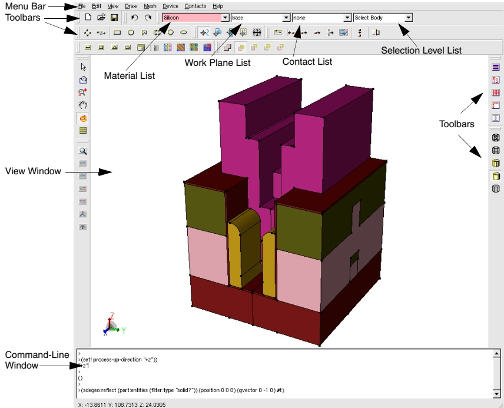

Figure 1 Main window of Sentaurus Structure Editor
 

### GUI Modes

Sentaurus Structure Editor offers different GUI modes: 3D (default mode) and 2D. To set the GUI mode:

■ Choose View > GUI Mode > 2D Mode.

■ Choose View > GUI Mode > 3D Mode.

The only difference between the 3D GUI mode and the 2D GUI mode is that in the 2D GUI mode, some toolbars and GUI operations are unavailable. In this way, a more streamlined and simplified GUI is provided for 2D applications.

The dialog boxes related to doping, refinement, and external submeshes are the same in both the 2D GUI mode and 3D GUI mode. However, when defining refinement/evaluation (Ref/Eval) windows directly from these dialog boxes, in 2D GUI mode, rectangular Ref/Eval windows are created and, in 3D GUI mode, cuboidal Ref/Eval windows are created.

### Menu Bar

Table 3 lists the menus that are available from the GUI of Sentaurus Structure Editor.

Table 3 Menus
 

<table border=1 style='margin: auto; word-wrap: break-word;'><tr><td style='text-align: center; word-wrap: break-word;'>Menu</td><td style='text-align: center; word-wrap: break-word;'>Description</td></tr><tr><td style='text-align: center; word-wrap: break-word;'>File</td><td style='text-align: center; word-wrap: break-word;'>Load, save, and print functions</td></tr><tr><td style='text-align: center; word-wrap: break-word;'>Edit</td><td style='text-align: center; word-wrap: break-word;'>Change existing geometric objects</td></tr><tr><td style='text-align: center; word-wrap: break-word;'>View</td><td style='text-align: center; word-wrap: break-word;'>Visualization preferences and auxiliary views</td></tr><tr><td style='text-align: center; word-wrap: break-word;'>Draw</td><td style='text-align: center; word-wrap: break-word;'>Drawing and basic object creation, preferences</td></tr><tr><td style='text-align: center; word-wrap: break-word;'>Mesh</td><td style='text-align: center; word-wrap: break-word;'>Define a meshing strategy, call the meshing engine, visualize the generated mesh and data fields</td></tr><tr><td style='text-align: center; word-wrap: break-word;'>Device</td><td style='text-align: center; word-wrap: break-word;'>Define doping profiles</td></tr><tr><td style='text-align: center; word-wrap: break-word;'>Contacts</td><td style='text-align: center; word-wrap: break-word;'>Define and edit contacts and contact sets</td></tr><tr><td style='text-align: center; word-wrap: break-word;'>Help</td><td style='text-align: center; word-wrap: break-word;'>Version information</td></tr></table>

#### Toolbars

Each toolbar contains a set of predefined shortcuts and icons, which are shown in the following tables.

Table 4 File toolbar buttons
 

<table border=1 style='margin: auto; word-wrap: break-word;'><tr><td style='text-align: center; word-wrap: break-word;'>Button</td><td style='text-align: center; word-wrap: break-word;'>Shortcut keys</td><td style='text-align: center; word-wrap: break-word;'>Description</td><td style='text-align: center; word-wrap: break-word;'>Button</td><td style='text-align: center; word-wrap: break-word;'>Shortcut keys</td><td style='text-align: center; word-wrap: break-word;'>Description</td></tr><tr><td style='text-align: center; word-wrap: break-word;'></td><td style='text-align: center; word-wrap: break-word;'>Ctrl+N</td><td style='text-align: center; word-wrap: break-word;'>Create new file</td><td style='text-align: center; word-wrap: break-word;'>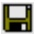</td><td style='text-align: center; word-wrap: break-word;'>Ctrl+S</td><td style='text-align: center; word-wrap: break-word;'>Save model</td></tr><tr><td style='text-align: center; word-wrap: break-word;'>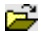</td><td style='text-align: center; word-wrap: break-word;'>Ctrl+O</td><td style='text-align: center; word-wrap: break-word;'>Open model</td><td style='text-align: center; word-wrap: break-word;'></td><td style='text-align: center; word-wrap: break-word;'>Ctrl+P</td><td style='text-align: center; word-wrap: break-word;'>Print</td></tr></table>

Table 5 Edit toolbar buttons
 

<table border=1 style='margin: auto; word-wrap: break-word;'><tr><td style='text-align: center; word-wrap: break-word;'>Button</td><td style='text-align: center; word-wrap: break-word;'>Shortcut keys</td><td style='text-align: center; word-wrap: break-word;'>Description</td></tr><tr><td style='text-align: center; word-wrap: break-word;'>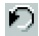</td><td style='text-align: center; word-wrap: break-word;'>Ctrl+Z</td><td style='text-align: center; word-wrap: break-word;'>Undo last operation</td></tr><tr><td style='text-align: center; word-wrap: break-word;'>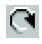</td><td style='text-align: center; word-wrap: break-word;'>Ctrl+Y</td><td style='text-align: center; word-wrap: break-word;'>Redo last operation</td></tr></table>

Table 6 Rendering mode toolbar buttons (for 3D)
 

<table border=1 style='margin: auto; word-wrap: break-word;'><tr><td style='text-align: center; word-wrap: break-word;'>Button</td><td style='text-align: center; word-wrap: break-word;'>Description</td><td style='text-align: center; word-wrap: break-word;'>Button</td><td style='text-align: center; word-wrap: break-word;'>Description</td></tr><tr><td style='text-align: center; word-wrap: break-word;'>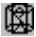</td><td style='text-align: center; word-wrap: break-word;'>Facets</td><td style='text-align: center; word-wrap: break-word;'>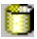</td><td style='text-align: center; word-wrap: break-word;'>Gouraud Shaded</td></tr><tr><td style='text-align: center; word-wrap: break-word;'>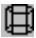</td><td style='text-align: center; word-wrap: break-word;'>Wireframe</td><td style='text-align: center; word-wrap: break-word;'>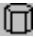</td><td style='text-align: center; word-wrap: break-word;'>Hidden Line</td></tr><tr><td style='text-align: center; word-wrap: break-word;'>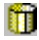</td><td style='text-align: center; word-wrap: break-word;'>Flat Shaded</td><td style='text-align: center; word-wrap: break-word;'></td><td style='text-align: center; word-wrap: break-word;'></td></tr></table>

Table 7 Standard views toolbar buttons
 

<table border=1 style='margin: auto; word-wrap: break-word;'><tr><td style='text-align: center; word-wrap: break-word;'>Button</td><td style='text-align: center; word-wrap: break-word;'>Description</td><td style='text-align: center; word-wrap: break-word;'>Button</td><td style='text-align: center; word-wrap: break-word;'>Description</td></tr><tr><td style='text-align: center; word-wrap: break-word;'>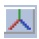</td><td style='text-align: center; word-wrap: break-word;'>Isometric View</td><td style='text-align: center; word-wrap: break-word;'>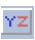</td><td style='text-align: center; word-wrap: break-word;'>YZ Plane</td></tr><tr><td style='text-align: center; word-wrap: break-word;'>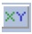</td><td style='text-align: center; word-wrap: break-word;'>XY Plane</td><td style='text-align: center; word-wrap: break-word;'>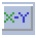</td><td style='text-align: center; word-wrap: break-word;'>X-Y Plane (y-axis pointing downwards)</td></tr><tr><td style='text-align: center; word-wrap: break-word;'>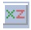</td><td style='text-align: center; word-wrap: break-word;'>XZ Plane</td><td style='text-align: center; word-wrap: break-word;'>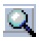</td><td style='text-align: center; word-wrap: break-word;'>Zoom to Extents (reset zoom)</td></tr><tr><td style='text-align: center; word-wrap: break-word;'>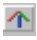</td><td style='text-align: center; word-wrap: break-word;'>Isometric View (Sentaurus Process up direction)</td><td style='text-align: center; word-wrap: break-word;'></td><td style='text-align: center; word-wrap: break-word;'></td></tr></table>

Table 8 GUI actions toolbar buttons (zoom and move)
 

<table border=1 style='margin: auto; word-wrap: break-word;'><tr><td style='text-align: center; word-wrap: break-word;'>Button</td><td style='text-align: center; word-wrap: break-word;'>Description</td><td style='text-align: center; word-wrap: break-word;'>Button</td><td style='text-align: center; word-wrap: break-word;'>Description</td></tr><tr><td style='text-align: center; word-wrap: break-word;'>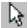</td><td style='text-align: center; word-wrap: break-word;'>Select (selects a single object or objects in a window drawn with mouse)</td><td style='text-align: center; word-wrap: break-word;'>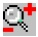</td><td style='text-align: center; word-wrap: break-word;'>Zoom (zooming controlled by mouse)</td></tr><tr><td style='text-align: center; word-wrap: break-word;'></td><td style='text-align: center; word-wrap: break-word;'>Zoom to Window (zooms to window drawn with mouse)</td><td style='text-align: center; word-wrap: break-word;'>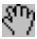</td><td style='text-align: center; word-wrap: break-word;'>Pan (move device with mouse)</td></tr><tr><td style='text-align: center; word-wrap: break-word;'>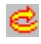</td><td style='text-align: center; word-wrap: break-word;'>Orbit (3D rotation)</td><td style='text-align: center; word-wrap: break-word;'>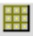</td><td style='text-align: center; word-wrap: break-word;'>Cut Plane (shows a cross section of the structure)</td></tr></table>

Table 9 GUI actions toolbar buttons (2D edit tools)
 

<table border=1 style='margin: auto; word-wrap: break-word;'><tr><td style='text-align: center; word-wrap: break-word;'>Button</td><td style='text-align: center; word-wrap: break-word;'>Description</td><td style='text-align: center; word-wrap: break-word;'>Button</td><td style='text-align: center; word-wrap: break-word;'>Description</td></tr><tr><td style='text-align: center; word-wrap: break-word;'>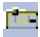</td><td style='text-align: center; word-wrap: break-word;'>Polygonal Region Split</td><td style='text-align: center; word-wrap: break-word;'></td><td style='text-align: center; word-wrap: break-word;'>Move Region</td></tr><tr><td style='text-align: center; word-wrap: break-word;'>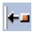</td><td style='text-align: center; word-wrap: break-word;'>Add Vertex</td><td style='text-align: center; word-wrap: break-word;'>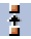</td><td style='text-align: center; word-wrap: break-word;'>Vertex-Vertex Distance</td></tr><tr><td style='text-align: center; word-wrap: break-word;'>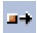</td><td style='text-align: center; word-wrap: break-word;'>Move Vertex or Move Vertices</td><td style='text-align: center; word-wrap: break-word;'>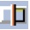</td><td style='text-align: center; word-wrap: break-word;'>2D Cut</td></tr><tr><td style='text-align: center; word-wrap: break-word;'>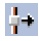</td><td style='text-align: center; word-wrap: break-word;'>Move Edge</td><td style='text-align: center; word-wrap: break-word;'></td><td style='text-align: center; word-wrap: break-word;'></td></tr></table>

Table 10 GUI actions toolbar buttons (2D create tools)
 

<table border=1 style='margin: auto; word-wrap: break-word;'><tr><td style='text-align: center; word-wrap: break-word;'>Button</td><td style='text-align: center; word-wrap: break-word;'>Description</td><td style='text-align: center; word-wrap: break-word;'>Button</td><td style='text-align: center; word-wrap: break-word;'>Description</td></tr><tr><td style='text-align: center; word-wrap: break-word;'>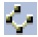</td><td style='text-align: center; word-wrap: break-word;'>Create Polyline Wire</td><td style='text-align: center; word-wrap: break-word;'>$ 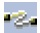 $</td><td style='text-align: center; word-wrap: break-word;'>Create Spline Wire</td></tr><tr><td style='text-align: center; word-wrap: break-word;'>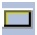</td><td style='text-align: center; word-wrap: break-word;'>Create Rectangle</td><td style='text-align: center; word-wrap: break-word;'>$  $</td><td style='text-align: center; word-wrap: break-word;'>Create Regular Polygon (needs Exact Coordinates mode to set parameters)</td></tr><tr><td style='text-align: center; word-wrap: break-word;'>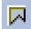</td><td style='text-align: center; word-wrap: break-word;'>Create Polygon (end polygon with middle mouse button)</td><td style='text-align: center; word-wrap: break-word;'>$ 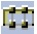 $</td><td style='text-align: center; word-wrap: break-word;'>Create Ruled Region</td></tr><tr><td style='text-align: center; word-wrap: break-word;'>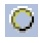</td><td style='text-align: center; word-wrap: break-word;'>Create Circular Region</td><td style='text-align: center; word-wrap: break-word;'>$ 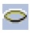 $</td><td style='text-align: center; word-wrap: break-word;'>Create Elliptical Region</td></tr></table>

Table 11 Snapping actions toolbar buttons
 

<table border=1 style='margin: auto; word-wrap: break-word;'><tr><td style='text-align: center; word-wrap: break-word;'>Button</td><td style='text-align: center; word-wrap: break-word;'>Description</td><td style='text-align: center; word-wrap: break-word;'>Button</td><td style='text-align: center; word-wrap: break-word;'>Description</td></tr><tr><td style='text-align: center; word-wrap: break-word;'>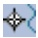</td><td style='text-align: center; word-wrap: break-word;'>No Snapping</td><td style='text-align: center; word-wrap: break-word;'>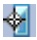</td><td style='text-align: center; word-wrap: break-word;'>Snap to Edge</td></tr><tr><td style='text-align: center; word-wrap: break-word;'>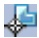</td><td style='text-align: center; word-wrap: break-word;'>Snap to Vertex</td><td style='text-align: center; word-wrap: break-word;'>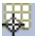</td><td style='text-align: center; word-wrap: break-word;'>Snap to Grid</td></tr><tr><td style='text-align: center; word-wrap: break-word;'>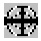</td><td style='text-align: center; word-wrap: break-word;'>Toggle gravity snapping</td><td style='text-align: center; word-wrap: break-word;'></td><td style='text-align: center; word-wrap: break-word;'></td></tr></table>

Table 12 GUI actions toolbar buttons (3D create tools)
 

<table border=1 style='margin: auto; word-wrap: break-word;'><tr><td style='text-align: center; word-wrap: break-word;'>Button</td><td style='text-align: center; word-wrap: break-word;'>Description</td><td style='text-align: center; word-wrap: break-word;'>Button</td><td style='text-align: center; word-wrap: break-word;'>Description</td></tr><tr><td style='text-align: center; word-wrap: break-word;'>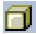</td><td style='text-align: center; word-wrap: break-word;'>Create Cuboid</td><td style='text-align: center; word-wrap: break-word;'>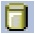</td><td style='text-align: center; word-wrap: break-word;'>Create Cylinder</td></tr><tr><td style='text-align: center; word-wrap: break-word;'></td><td style='text-align: center; word-wrap: break-word;'>Create Sphere</td><td style='text-align: center; word-wrap: break-word;'>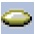</td><td style='text-align: center; word-wrap: break-word;'>Create Ellipsoid</td></tr><tr><td style='text-align: center; word-wrap: break-word;'>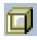</td><td style='text-align: center; word-wrap: break-word;'>Create Cross Section</td><td style='text-align: center; word-wrap: break-word;'></td><td style='text-align: center; word-wrap: break-word;'></td></tr></table>

Table 13 Default Boolean toolbar buttons
 

<table border=1 style='margin: auto; word-wrap: break-word;'><tr><td style='text-align: center; word-wrap: break-word;'>Button</td><td style='text-align: center; word-wrap: break-word;'>Description</td><td style='text-align: center; word-wrap: break-word;'>Button</td><td style='text-align: center; word-wrap: break-word;'>Description</td></tr><tr><td style='text-align: center; word-wrap: break-word;'>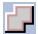</td><td style='text-align: center; word-wrap: break-word;'>Merge (new and existing objects are merged; new material and region names are assigned)</td><td style='text-align: center; word-wrap: break-word;'>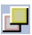</td><td style='text-align: center; word-wrap: break-word;'>New object replaces old in overlapping regions, but the overlap becomes a separate region</td></tr><tr><td style='text-align: center; word-wrap: break-word;'>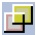</td><td style='text-align: center; word-wrap: break-word;'>New object replaces old in overlapping regions</td><td style='text-align: center; word-wrap: break-word;'>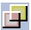</td><td style='text-align: center; word-wrap: break-word;'>Old object replaces new in overlapping regions, but the overlap becomes a separate region</td></tr><tr><td style='text-align: center; word-wrap: break-word;'>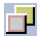</td><td style='text-align: center; word-wrap: break-word;'>Old object replaces new in overlapping regions</td><td style='text-align: center; word-wrap: break-word;'></td><td style='text-align: center; word-wrap: break-word;'></td></tr></table>

Table 14 Shortcut toolbar buttons
 

<table border=1 style='margin: auto; word-wrap: break-word;'><tr><td style='text-align: center; word-wrap: break-word;'>Button</td><td style='text-align: center; word-wrap: break-word;'>Description</td><td style='text-align: center; word-wrap: break-word;'>Button</td><td style='text-align: center; word-wrap: break-word;'>Description</td></tr><tr><td style='text-align: center; word-wrap: break-word;'>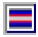</td><td style='text-align: center; word-wrap: break-word;'>Switch between geometry editor and grid and data viewer</td><td style='text-align: center; word-wrap: break-word;'></td><td style='text-align: center; word-wrap: break-word;'>Switch on or off exact coordinates</td></tr><tr><td style='text-align: center; word-wrap: break-word;'></td><td style='text-align: center; word-wrap: break-word;'>Grid visualization switch</td><td style='text-align: center; word-wrap: break-word;'></td><td style='text-align: center; word-wrap: break-word;'>Ruler visualization switch</td></tr><tr><td style='text-align: center; word-wrap: break-word;'></td><td style='text-align: center; word-wrap: break-word;'>Auto stretch scene</td><td style='text-align: center; word-wrap: break-word;'></td><td style='text-align: center; word-wrap: break-word;'></td></tr></table>

Table 15 DRS (doping, refinement, submesh) toolbar buttons
 

<table border=1 style='margin: auto; word-wrap: break-word;'><tr><td style='text-align: center; word-wrap: break-word;'>Button</td><td style='text-align: center; word-wrap: break-word;'>Description</td><td style='text-align: center; word-wrap: break-word;'>Button</td><td style='text-align: center; word-wrap: break-word;'>Description</td></tr><tr><td style='text-align: center; word-wrap: break-word;'></td><td style='text-align: center; word-wrap: break-word;'>Reference line (Ref/Eval window)</td><td style='text-align: center; word-wrap: break-word;'>☐</td><td style='text-align: center; word-wrap: break-word;'>Reference rectangle (Ref/Eval window)</td></tr><tr><td style='text-align: center; word-wrap: break-word;'></td><td style='text-align: center; word-wrap: break-word;'>Reference polygon (Ref/Eval window)</td><td style='text-align: center; word-wrap: break-word;'></td><td style='text-align: center; word-wrap: break-word;'>Reference element extracted from a geometric face (Ref/Eval window)</td></tr><tr><td style='text-align: center; word-wrap: break-word;'></td><td style='text-align: center; word-wrap: break-word;'>Refinement placement</td><td style='text-align: center; word-wrap: break-word;'>☐</td><td style='text-align: center; word-wrap: break-word;'>Multibox placement</td></tr></table>

Table 15 DRS (doping, refinement, submesh) toolbar buttons
 

<table border=1 style='margin: auto; word-wrap: break-word;'><tr><td style='text-align: center; word-wrap: break-word;'>Button</td><td style='text-align: center; word-wrap: break-word;'>Description</td><td style='text-align: center; word-wrap: break-word;'>Button</td><td style='text-align: center; word-wrap: break-word;'>Description</td></tr><tr><td style='text-align: center; word-wrap: break-word;'></td><td style='text-align: center; word-wrap: break-word;'>Constant profile placement</td><td style='text-align: center; word-wrap: break-word;'></td><td style='text-align: center; word-wrap: break-word;'>Analytic profile placement</td></tr><tr><td style='text-align: center; word-wrap: break-word;'></td><td style='text-align: center; word-wrap: break-word;'>External profile placement</td><td style='text-align: center; word-wrap: break-word;'></td><td style='text-align: center; word-wrap: break-word;'>Particle profile placement</td></tr></table>

#### Restoring GUI Settings From Previous Session

Some GUI information is saved automatically in the local home directory of the user. On the UNIX operating system, this information is stored in ~/.config/Synopsys/Sentaurus Structure Editor.conf.

The parameters that are stored are the toolbar positions as well as the height, the font size, the font style, and the font family used in the command-line window.

To reset these GUI parameters to their defaults, begin an interactive session using the command-line option -defaultGUI. This starts the session with the default GUI parameters and replaces any personalized parameters with these defaults when exiting.

#### Manipulating the View

Additional shortcut key combinations are available to manipulate the view.

Table 16 Shortcut keys for manipulating the view
 

<table border=1 style='margin: auto; word-wrap: break-word;'><tr><td style='text-align: center; word-wrap: break-word;'>Shortcut keys</td><td style='text-align: center; word-wrap: break-word;'>Action</td></tr><tr><td style='text-align: center; word-wrap: break-word;'>Up Arrow</td><td style='text-align: center; word-wrap: break-word;'>View window: Zoom outCommand-line window: Scroll up command history</td></tr><tr><td style='text-align: center; word-wrap: break-word;'>Down Arrow</td><td style='text-align: center; word-wrap: break-word;'>View window: Zoom inCommand-line window: Scroll down command history</td></tr><tr><td style='text-align: center; word-wrap: break-word;'>Left Arrow</td><td style='text-align: center; word-wrap: break-word;'>View window: Pan to the leftCommand-line window: Position curser for editing echoed Scheme command</td></tr><tr><td style='text-align: center; word-wrap: break-word;'>Right Arrow</td><td style='text-align: center; word-wrap: break-word;'>View window: Pan to the rightCommand-line window: Position curser for editing echoed Scheme command</td></tr><tr><td style='text-align: center; word-wrap: break-word;'>Ctrl+Left Arrow</td><td style='text-align: center; word-wrap: break-word;'>View window: Pan downwards</td></tr><tr><td style='text-align: center; word-wrap: break-word;'>Ctrl+Right Arrow</td><td style='text-align: center; word-wrap: break-word;'>View window: Pan upwards</td></tr><tr><td style='text-align: center; word-wrap: break-word;'>Ctrl+Z</td><td style='text-align: center; word-wrap: break-word;'>(roll)</td></tr><tr><td style='text-align: center; word-wrap: break-word;'>Ctrl+Y</td><td style='text-align: center; word-wrap: break-word;'>(roll 1)</td></tr></table>

Table 16 Shortcut keys for manipulating the view
 

<table border=1 style='margin: auto; word-wrap: break-word;'><tr><td style='text-align: center; word-wrap: break-word;'>Shortcut keys</td><td style='text-align: center; word-wrap: break-word;'>Action</td></tr><tr><td style='text-align: center; word-wrap: break-word;'>Shift+Orbit</td><td style='text-align: center; word-wrap: break-word;'>Rotate about x-axis (horizontal view) or Pan (when (sde:use-camera-manipulator #t) is used)</td></tr><tr><td style='text-align: center; word-wrap: break-word;'>Ctrl+Orbit</td><td style='text-align: center; word-wrap: break-word;'>Rotate about y-axis (vertical view) or Zoom in and out (when (sde:use-camera-manipulator #t) is used)</td></tr><tr><td style='text-align: center; word-wrap: break-word;'>Ctrl+Shift+Orbit</td><td style='text-align: center; word-wrap: break-word;'>Rotate about z-axis (perpendicular to view)</td></tr><tr><td style='text-align: center; word-wrap: break-word;'>Ctrl+N</td><td style='text-align: center; word-wrap: break-word;'>Create new file</td></tr><tr><td style='text-align: center; word-wrap: break-word;'>Ctrl+O</td><td style='text-align: center; word-wrap: break-word;'>Open model</td></tr><tr><td style='text-align: center; word-wrap: break-word;'>Ctrl+S</td><td style='text-align: center; word-wrap: break-word;'>Save model</td></tr><tr><td style='text-align: center; word-wrap: break-word;'>Ctrl+P</td><td style='text-align: center; word-wrap: break-word;'>Print</td></tr><tr><td style='text-align: center; word-wrap: break-word;'>Ctrl+Q</td><td style='text-align: center; word-wrap: break-word;'>Exit</td></tr></table>

#### Lists

The main window of Sentaurus Structure Editor contains four lists:

■ Material list – Selects the material to be assigned to new objects.

Work Plane list – Sets the work plane for 3D editing.

■ Contact list – Selects the contact name to be used in the next set contact region, or face, or edge operations.

■ Selection Level list – Selects which type of object can be selected.

### View Window

The current device is displayed in the view window. The result of all interactive operations is reflected immediately in the view window.

##### Selection Level

Right-click in this area to open the following shortcut menus:

Controls which type of object can be selected by clicking (Select mode). Options are Auto Select, Body, Face, Edge, Vertex, and Ref/Eval Window.

#### Toggle Visibility

Activates or deactivates a light source for shading 3D objects.

Placing the cross-hair cursor over an object and right-clicking has the effect of selecting the object corresponding to the current selection level, and opening the above shortcut menus and the following additional menus and options where it is appropriate in the context of the selection made:

##### Contacts

If the selection level is set to Edge or Face, contacts are assigned to the selected objects. It also allows for the creation of new contact sets.

##### Delete

In many contexts, the object can be deleted by selected this option.

#### Properties

Displays a window with information about the selected object. In some contexts, for example, Ref/Eval windows, properties of the object are editable.

For Ref/Eval windows, the bounding vertex coordinates are displayed for rectangular and cuboidal Ref/Eval windows. For these types, the vertex coordinates are editable and can be changed. In this case, all doping/refinement/submesh (DRS) objects that use the given Ref/Eval window are redefined using the new vertex coordinates.

##### Hide

If the selection level is set to Body or Ref/Eval Window, the selected entities are hidden.

##### Show All

All the previously hidden bodies and Ref/Eval windows are displayed again.

### Command-Line Window

Most GUI operations have an associated Scheme command. After a GUI operation, the corresponding Scheme command is echoed in the command-line window.

Use the Up Arrow and Down Arrow keys to scroll through echoed Scheme commands. Echoed commands can be edited (use the Left Arrow and Right Arrow keys to position the cursor, and the Delete key or Backspace key to delete parts of the command, type in new parts of the command) and re-executed by pressing the Enter key.

Use cut-and-paste operations to save echoed Scheme commands into a text editor to interactively build a Scheme script. Individual Scheme commands or groups of Scheme commands can be pasted back into the command-line window as needed, for example, to test

a section of a Scheme script. Scheme commands can also be entered directly at the command-line prompt.

Activate journaling (see Recording Actions to a File on page 11) to automatically save the echoed Scheme command to a journal file, for later editing and replaying.

Some basic rules of the Scheme scripting language are (see Chapter 10 on page 267 for more details):

■ Comment lines start with a semicolon. In each line, a comment proceeds from the first inserted semicolon.

New variables are defined using the keyword define. Defined variables can be reassigned a value using the keyword set!, for example:

(define width 5) ; defines the variable width and sets its value to 5

(define height 10)

(set! width 3) ; now width is 3

■ Scheme has all the conventional data types such as character, string, list, array, Boolean, number, function, and symbol.

■ All data types are equal. Any variable can hold any type of data. Data initialization, memory allocation, and memory cleanup (garbage collection) are performed automatically.

NOTE A few keywords (such as length) are reserved keywords used by Scheme and they define a Scheme function or operator. These keywords must not be redefined by a user-initiated define command.

### Undoing and Redoing Actions

To undo an action:

Choose Edit > Undo or press Ctrl+Z.

The corresponding Scheme command is:

(roll)

To redo an action:

Choose Edit > Redo or press Ctrl+Y.

The corresponding Scheme command is:

(roll+1)

NOTE The undo and redo operations work in multiple steps as well. (roll -n) rolls back the modeler by n steps, while (roll n) rolls forward the history stream of the modeler by n steps. (roll) is a shortcut to (roll -1).

The undo and redo operations work with actions supported directly by the ACIS modeling engine, including operations that create and change Ref/Eval windows. Operations that involve creating or changing placements cannot be undone by using the (roll) feature. However, placements can be edited, deleted, and recreated.

### Customizing Graphical User Interface

The certain parts of the GUI can be customized.

### Configuring Command-Line Window

You can configure the command-line window from the menu bar (choose View > Script Win Prefs to display the Script Window Preferences dialog box) or directly using sde:scmwin Scheme commands (see Table 17 on page 23).

In the Script Window Preferences dialog box, you can select the height, font style, and size of the command-line window.

Figure 2 Script Window Preferences dialog box
 

Table 17 Scheme functions for configuring the command-line window
 

<table border=1 style='margin: auto; word-wrap: break-word;'><tr><td style='text-align: center; word-wrap: break-word;'>Scheme function</td><td style='text-align: center; word-wrap: break-word;'>Description</td></tr><tr><td style='text-align: center; word-wrap: break-word;'>(sde:scmwin-get-font-families)</td><td style='text-align: center; word-wrap: break-word;'>Returns all available font families.</td></tr><tr><td style='text-align: center; word-wrap: break-word;'>(sde:scmwin-get-font-family)</td><td style='text-align: center; word-wrap: break-word;'>Returns the currently selected font family.</td></tr><tr><td style='text-align: center; word-wrap: break-word;'>(sde:scmwin-get-font-size)</td><td style='text-align: center; word-wrap: break-word;'>Returns the active font size.</td></tr><tr><td style='text-align: center; word-wrap: break-word;'>(sde:scmwin-get-font-style)</td><td style='text-align: center; word-wrap: break-word;'>Returns the font style.</td></tr><tr><td style='text-align: center; word-wrap: break-word;'>(sde:scmwin-select-font)</td><td style='text-align: center; word-wrap: break-word;'>Displays the Select Font dialog box.</td></tr><tr><td style='text-align: center; word-wrap: break-word;'>(sde:scmwin-set-font-family font-type)</td><td style='text-align: center; word-wrap: break-word;'>Sets the font family.</td></tr><tr><td style='text-align: center; word-wrap: break-word;'>(sde:scmwin-set-font-size integer)</td><td style='text-align: center; word-wrap: break-word;'>Sets the font size.</td></tr><tr><td style='text-align: center; word-wrap: break-word;'>(sde:scmwin-set-prefs)</td><td style='text-align: center; word-wrap: break-word;'>Can be used to configure the command-line window, using one single function.</td></tr><tr><td style='text-align: center; word-wrap: break-word;'>(sde:scmwin-get-window-height)</td><td style='text-align: center; word-wrap: break-word;'>Returns the height of the command-line window.</td></tr><tr><td style='text-align: center; word-wrap: break-word;'>(sde:scmwin-set-window-height number-of-lines)</td><td style='text-align: center; word-wrap: break-word;'>Sets the height of the command-line window.</td></tr></table>

NOTE The height, font family, font size, and font style of the command-line window are stored in the local home directory of the user when exiting Sentaurus Structure Editor, making these parameters and toolbar positions persistent from session to session. For more details on this persistence mechanism and how to restore default values, see Restoring GUI Settings From Previous Session on page 18.

### Changing Attributes of Graphical User Interface

### Background Color

To change the background color of the view window:

■ Choose View > Background Color.

The corresponding Scheme command is:

(sde:set-background-color r_top g_top b_top r_bot g_bot b_bot)

The RGB colors for the top and bottom of the view window must be specified as integers in the range 0–255. For example, to create a graded background with red on top and blue at the bottom:

(sde:set-background-color 255 0 0 0 0 255)

### GUI Style

To change the GUI style:

Choose View > GUI Style.

The available GUI styles are Windows, Motif, Cleanlooks, Plastique, and CDE.

See sde:set-window-style on page 503.

### Font Size of Menu Bar of Main Window

The font size of the menu bar of the main window can be changed using:

(sde:set-menubar-font-size font-size)

For example:

(sde:set-menubar-font-size 10)

#### Size of Main Window

The main window can be resized at any time using the mouse, or it can be resized using:

(sde:set-window-size x-size y-size)

For example:

(sde:set-window-size 640 480)

#### Position of Main Window

The main window can be positioned on the screen by moving it using the mouse, or using:

(sde:set-window-position x y)

For example, to place the main window in the upper-left corner of the screen:

(sde:set-window-position 0 0)

NOTE These GUI attributes are saved by the command sde: save-model and restored by the command sde: open-model.

### Restoring Settings of Graphical User Interface

To capture figures for presentations or to compare models visually, the state of the GUI graphical view (translation, zoom, rotation) can be recorded and restored using Scheme functions. The sde:get-view-params function is used to return the actual view parameters. The view parameters are restored using the sde:set-view-params function.

For example:

(define myview (sde:get-view-params))
; The myview object stores the GUI settings, which can be restored later.
(sde:set-view-params myview)

### Selecting Entities

To select an entity:

1. Click the Select button (see Table 8 on page 16).

2. Select the required entity type from the Selection Level list.

3. Select an entity and hold the Shift or Ctrl key to select additional entities, or drag a box around a set of entities.

4. Click the (blank) background to clear the selected entity list.

Entity types are Body, Face, Edge, Vertex, or Ref/Eval Window.

Figure 3 Set entity selection type: (left) shortcut menu and (right) Selection Level list
 

### Snapping Modes

The default drawing mode is freehand for creating 2D regions (rectangles, circles, ellipses, and so on). Optional features such as snap-to-grid, exact coordinates, and snap-to-existing vertices can also be used. These features can also be accessed interactively during model generation.

Table 18 Keyboard keys for 2D drawing operations
 

<table border=1 style='margin: auto; word-wrap: break-word;'><tr><td style='text-align: center; word-wrap: break-word;'>Key</td><td style='text-align: center; word-wrap: break-word;'>Action</td></tr><tr><td style='text-align: center; word-wrap: break-word;'>Esc</td><td style='text-align: center; word-wrap: break-word;'>Resets operator</td></tr><tr><td style='text-align: center; word-wrap: break-word;'>V</td><td style='text-align: center; word-wrap: break-word;'>Snap-to-vertex</td></tr><tr><td style='text-align: center; word-wrap: break-word;'>E</td><td style='text-align: center; word-wrap: break-word;'>Snap-to-edge (closest point on edge)</td></tr><tr><td style='text-align: center; word-wrap: break-word;'>G</td><td style='text-align: center; word-wrap: break-word;'>Snap-to-grid</td></tr><tr><td style='text-align: center; word-wrap: break-word;'>N</td><td style='text-align: center; word-wrap: break-word;'>Disables snapping</td></tr></table>

For example, during a 2D polygonal region generation when the E key is pressed, the pointer will snap to the closest existing edge. When the pointer is moved, it slides along the closest edge. When the V key is pressed, the pointer snaps automatically to the closest vertex. To move back to freehand drawing, press the N key.

### Printing

To print the current view of the structure:

1. Choose File > Print or press Ctrl+P.

2. Select the printer and set print options such as page orientation, and color or black-and-white mode if available.

3. Select the Print to file option, and enter a file name to export the view to a portable document format (PDF) file.

4. Click Print.

### Defining Parameters From the Graphical User Interface

To define parameters:

1. Choose Edit > Parameters.

2. Enter the parameter names and values.

3. Click Set.

The corresponding Scheme command is:
(sde:define-parameter parameter_name parameter_value [min_value max_value])

(sde:define-parameter "myvar1" "banana")
(sde:define-parameter "myvar2" 10)
(sde:define-parameter "myvar3" 10 0 20)

The parameters can be deleted using either the Delete button of the Parameters dialog box or the function sde:delete-parameter:

(sde:delete-parameter parameter_name)

NOTE The parameter names must be enclosed in double quotation marks when either (sde:define-parameter) or (sde:delete-parameter) is used.

Figure 4 Parameters dialog box
 

Scheme variables function as parameters for various operations, such as extrusion and chamfering, and can be used for device parameterization. These variables can be assigned not

only a value by choosing Edit > Parameters, but also minimum and maximum values. For example, when myvar1 is defined with Value 10, Min. Value 0, and Max. Value 20, you can enter myvar1 in the command-line window that will evaluate myvar1 as 10. The minimum value is stored in a variable called myvar1_min, and the maximum value is stored in a variable called myvar1_max.

NOTE The defined parameters can be used in all subsequent Scheme commands as well as in the fields of the dialog box that expect numeric values.

Parameters can also be defined by the basic Scheme command (define parameter-name value).

### Parameterizing Dialog Boxes

The GUI contains several dialog boxes that can be parameterized. The dialog boxes can accept not only numeric inputs, but also Scheme variables and Scheme expressions. The Scheme variables must be defined and initialized before they can be used in a Sentaurus Structure Editor dialog box. For example, in Exact Coordinates mode, the Exact Coordinates dialog box is displayed after a rectangle is drawn. As input data, in addition to numeric values, Scheme variables and Scheme expressions can be used to define the vertex coordinates.

For example, after the two Scheme variables width and height are defined in the command-line window, using:

(define width 10)
(define height 5)

and the Exact Coordinates mode is switched on and a rectangle is drawn, the Exact Coordinates dialog box is displayed where you can use Scheme variables and expressions as input data.

Figure 5 Exact Coordinates dialog box using Scheme variables and expressions
 

This operation generates the following Scheme command:

(sdegeo:create-rectangle (position 0 0 0.0))
(position width (* 0.25 height) 0.0) "Silicon" "region_1")

This chapter describes the various options to control views available in Sentaurus Structure Editor.

### Zooming, Panning, and Orbiting With Mouse Operations

To access the different modes of mouse operations:

- Choose View > Interactive Mode, or click the corresponding toolbar button (see Figure 6).

Figure 6 Toolbar buttons for zooming, panning, and orbiting with mouse operations
 

The options are:

##### Zoom to Extents

Resets the zoom factor so that the entire structure is displayed.

##### Zoom to Window

Drag to define a zoom window. The view is updated such that the defined zoom window is displayed as large as possible. (If the aspect ratio of the selected zoom window differs from the current view window aspect ratio, the zooming may appear to be less than expected.)

##### Orbit

In this mode, dragging adjusts the camera position in a way that simulates orbiting around the drawn structure. Both the position and path of the pointer during the dragging operation provide an intuitive mechanism for rotation about different axes. Dragging left or right along the middle of the view window rotates the structure about the vertical axis. Similarly, dragging up or down along the center of the view window rotates the structure about the horizontal axis. Dragging up, down, left, or right near any edge of the view window rotates

the structure about the axis perpendicular to the view window. Combinations of the movements are designed to give you control over the viewing angle of the drawn structure.

While the Orbit mode is active, different shortcut keys can be used to rotate the model about the imaginary coordinate axes of the screen (in the view window). Hold the key or keys when in Orbit mode:

Rotate about x-axis (horizontal view) Shift+Orbit

Rotate about y-axis (vertical view)

Rotate about z-axis (perpendicular to view) Ctrl+Shift+Orbit

The (sde:use-camera-manipulator #t) function can be used to change these key functionalities to another type of behavior. (The (sde:use-camera-manipulator #f) command can be used to change it back.)

After the (sde:use-camera-manipulator #t) command is executed when in Orbit mode, the Ctrl key can be used to zoom and the Shift key can be used to pan (while pressing the left mouse button).

##### Zoom

In this mode, dragging upwards zooms in on the structure, and dragging downwards zooms out.

##### Pan

In this mode, dragging moves the structure around the view window.

### Interactive Cutting Plane Viewer

To access the interactive cutting plane viewer:

1. Choose View > Interactive Mode > Cutting Plane, or click the corresponding toolbar button.

2. Select either Rotate X, Drag Y, or Rotate Z to control the location of the cut plane. Enter the rotation or drag amount in the respective field or operate the dials with the mouse.

Alternatively, the cut plane can be manipulated directly in the view window by clicking the respective handles for rotating and dragging.

3. To suppress the display of the cut plane, either select the Remove Cut Plane on Close option and click Close, or toggle the Cutting Plane toolbar button.

Figure 7 Interactive cutting plane viewer: structure with cut plane (left) and Cut Plane Controller dialog box (right)
 

### Perspective and Orthographic Views in Three Dimensions

Three-dimensional objects are displayed using either orthographic projection (more distant objects are drawn with their true height and width as closer objects) or perspective (the height and width of more distant objects are reduced according to their distance from the viewer).

To switch between the perspective and orthographic views when displaying 3D objects:

☐ Choose View > Perspective.

NOTE Some GUI-supported operations such as 3D object creation (cube, cylinder, sphere) will change the view automatically to orthographic view.

Figure 8 (Left) Perspective view and (right) orthographic view
 

### Selecting the DATEX Color Scheme

The datexcodes.txt file contains two color definitions for each DATEX material. By default, Sentaurus Structure Editor uses the first color definition from the datexcodes.txt file to assign the color for each DATEX material for rendering. The View > Primary Datex Color command selects the first color definition (default).

Deselecting the View > Primary Datex Color command changes the color scheme to the second color definition, which is typically a brighter version of the first color definition.

In addition, the sde:change-datex-color-scheme Scheme extension can be used to select the DATEX color scheme.

### Selecting the Rendering Mode

To access the different rendering modes:

1. Choose View > Render.

2. Select a rendering mode, or click the corresponding toolbar button (see Table 6 on page 15).

The available rendering modes are illustrated here using the following example structure:

(sdegeo:create-cuboid (position 0.0 0.0 0.0) (position 1.0 0.8 1.0)
"Silicon" "R.Substrate")
(sdegeo:set-default-boolean "ABA")
(sdegeo:create-cuboid (position 0.0 0.0 1.0) (position 0.5 0.8 1.02)
"Oxide" "R.Gox")
(sdegeo:create-cuboid (position 0.0 0.0 1.02) (position 0.3 0.8 1.5)
"PolySilicon" "R.Poly")
(sdegeo:set-default-boolean "BAB")
(sdegeo:create-cuboid (position 0.0 0.0 1.02) (position 0.5 0.8 1.4)
"Nitride" "R.Spacer")
(sdegeo:fillet (find-edge-id (position 0.5 0.4 1.4)) 0.18)
(sde:setrefprops 0 30 0 0)

##### Facets

The faceted model shows a triangulated view in two dimensions and a triangulated surface tessellation in three dimensions. When exporting the boundary file, the 2D faceting algorithm extracts the boundary edges from the tessellated view. In three dimensions, the triangular elements become part of the polyhedral boundary representation. When

changing the surface refinement properties, the faceted view always reflects the triangulation that will be used when exporting a boundary file.

##### Wireframe

This rendering mode shows the boundary wires only.

##### Flat Shaded

A simple shaded mode where the surface normals are taken from the tessellated (triangulated) mode. Each surface element has a uniform color.

##### Gouraud Shaded

In this shading method, the surface normals are interpolated (using a simple linear interpolation) between the neighboring surface triangles. In this way, a continuously shaded view is generated.

Figure 9 Rendering modes: (left) flat shaded and (right) Gouraud shaded
 

##### Hidden Line

This mode generates a 3D view in which nonvisible edges are hidden. Additional silhouette edges are added to the view for the correct visualization.

##### Wireframe or Hidden Line with Face Parameter Lines

To better visualize faces in Wireframe mode or Hidden Line mode, additional face parameter lines can be displayed as well. In this mode, each face is ‘decorated’ with a given number of parametric lines for each orthogonal direction. The default number is 3.

The Scheme commands for displaying face parameter lines are:

(view:display-param-lines #t)

    ; Turns on/off parameter lines for visualization

(option:set "u_param" 5) ; Number of parameter lines in the u direction

(option:set "v_param" 5) ; Number of parameter lines in the v direction (render:rebuild)

This option is not available from the GUI.

(a)
 

(b)
 

(c)
 

(d)
 

Figure 10 Rendering modes: (a) facets, (b) wirefame, (c) hidden lines, and (d) hidden lines with face parameter lines
 

NOTE Apart from these rendering modes, other Scheme commands for changing the rendering are available:

(view:set-point-size 0) ; Switches on/off the vertex markers.

(render:rebuild) ; Rebuilds the graphics scene.

### View Orientation

The camera position and orientation can be selected interactively. The resulting orientation of the coordinate axes displayed are given as follows:

Iso 3D isometric view

XY X to the right, Y up

XZ X to the right, Z up

YZ          Z to the left, Y up

X(-Y) X to the right, Y down

To select the camera view:

Choose View > Camera Views, or click the corresponding toolbar button.

### Showing and Hiding Coordinate Axes

To switch between the display of the coordinates axes in the lower-right corner of the main window:

☐ Choose View > Show Axes.

### Displaying Grid Lines

1. Choose View > Grid, or click the corresponding toolbar button.

To display the grid lines:

2. Enter the grid line spacing along the x axis (Grid Width) and along the y axis (Grid Height). Optionally, the width of the grid line and the line pattern can be selected.

3. Click Apply to activate the changed settings.

4. Click Show to display the grid lines, or click  $ \underline{\text{Hide}} $ to suppress the display of the grid lines.

NOTE The grid lines are always shown in the current work plane. Grid lines along the z-axis are not supported.

### Displaying Rulers

To switch between the display of rulers in the xy coordinate directions:

Choose View > Show Ruler, or click the corresponding toolbar button.

NOTE The rulers displayed in the GUI follow the dimensionality of the model. If only 2D bodies are defined, the rulers are drawn in the xy coordinate directions. For 3D models, a ruler is also drawn in the z-axis coordinate direction. In addition to these rulers, you can create rulers using the sde:draw-ruler Scheme extension (see sde:draw-ruler on page 436). These user-defined rulers are displayed in the GUI automatically. You can hide user-defined rulers using the sde:hide-ruler Scheme extension (see sde:hide-ruler on page 456).

In two dimensions, the rulers in the xy coordinate directions are placed such that they cross in the upper-left corner when using the XY view orientation. Using other view orientations may make it difficult to read the tick labels of the rulers (see View Orientation on page 34).

### Scaling View

You can scale the view (uniform or nonuniform). Scaling the view does not change the model coordinates; it is applied only to the graphical scene.

To scale the view:

1. Choose View > View Scaling.

2. Enter a view scaling factor for each of the coordinate axis.

The corresponding Scheme command is:

(sde:scale-scene x-factor y-factor z-factor)

For example, to scale the view by 2 in the y-direction, use (sde:scale-scene 1 2 1). The command (sde:scale-scene 1 1 1) restores the original uniform unscaled model view.

### Visualizing Selected Geometric Objects

To view geometric entities associated with a selected material, or selected regions, masks, contacts:

Choose View > Entity Viewer.

The Entity Viewer is used to switch on and off the display of all different entity types (body, face, edge, vertex, and other), masks, contacts, regions, and materials. Each can be shown or hidden, individually or in groups, using the Show and Hide buttons. To restrict the display to only the selected entities, click the Exclusive button.

Figure 11 Entity Viewer
 

To see through the selected entities, click the Translucent button. To switch off translucency for the selected entities, click Opaque.

Any additions, changes, and deletions to entities made through GUI actions in the view window or through Scheme commands are reflected immediately in the Entity Viewer.

Two-dimensional or three-dimensional contacts can be visualized as separate objects. To see only a given contact, highlight the contact name in the Entity Viewer and click Exclusive.

Related Scheme commands to display, hide, or show exclusively a given contact, respectively, are:

(sde:show-contact contactname)

(sde:hide-contact contactname)

(sde:xshow-contact contactname)

## Quick Access to Placements, Refinements, and Doping Profiles

To list and access all currently defined Ref/Eval windows, refinements, and doping profiles:

1. Choose View > Placements Viewer.

2. Double-clicking any option opens the corresponding dialog box to view and edit its properties. Additions, changes, and deletions to placements made through GUI actions in the view window or through Scheme commands are reflected immediately in the Placements Viewer.

3. To visualize Ref/Eval windows, select one or more Ref/Eval window and click Show.

Click  $ \underline{Exclusive} $ to display the item while suppressing the display of all other items.

Click Hide to suppress the display of the selected item. (These two buttons only apply to Ref/Eval windows.)

Figure 12 Placements Viewer
 

### Visualizing the Internal Entity Representation

To view the internal representation of entities:

Choose View > Topology Browser.

Sentaurus Structure Editor represents the topology of a structure as a hierarchy of entities. On the top of the hierarchy are the bodies, which consist of lumps, shells, faces, loops, coedges, edges, and finally vertices. When working with Sentaurus Structure Editor, mainly bodies, faces, edges, and vertices are important.

The Topology Browser displays a tree of entities and their relationships, as used internally by Sentaurus Structure Editor. Use this tool to determine entity numbers and relationships. The graphical selection of entities in the main window of Sentaurus Structure Editor results in the highlighting of the corresponding entity in the Topology Browser. Similarly, the selection of an entity in the Topology Browser results in the highlighting of the entity in the main window.

The Topology Browser also displays the doping/refinement/submesh (DRS)–related Ref/Eval windows as geometric objects.

Figure 13 Topology Browser
 

## 4: Controlling Views

Visualizing the Internal Entity Representation

### CHAPTER 5 Generating Geometric Structures

This chapter provides details about creating a variety of structures and presents examples that illustrate various commands.

### Modeling Unit and Modeling Range

The geometry operations in Sentaurus Structure Editor are based on the ACIS geometry kernel. Most geometric calculations are performed using finite-precision arithmetic and tolerances. You must be aware of two tolerance values – resabs and resnor – because they determine the suggested modeling unit:

resabs (default value 1e-6) is the tolerance used when comparing two positions in the 3D model space. If two positions are within resabs of each other, they may be considered in the same position.

resnor (default value 1e-10) is the tolerance used when comparing the directions of two vectors. If the directions of two vectors are within resnor of each other, the vectors may be considered to be parallel.

Basically, the modeling range is the ratio of these two values (resabs/resnor).

Geometry modeling in Sentaurus Structure Editor is unitless. This means that you can choose any unit for model representation. However, the modeling range and the smallest representable feature will depend on the selected modeling unit.

For example, if you want to use micrometer as the modeling unit and a modeling range that is 100 μm, the smallest representable feature will be resnor x 100 = 10⁻⁸ μm, which is 10⁻⁵ nm. If the modeling unit and the modeling range are selected to be 1 m, the smallest representable feature will be 10⁻¹⁰ m, which is 10 nm. From this example, it is clear that it would not be practical to select meter as the modeling unit, since the TCAD devices could not be represented in Sentaurus Structure Editor based on the tolerance values that are used for the geometric calculations. Selecting micrometer as the modeling unit would be a better choice for TCAD devices. This means that, in this case, the smallest representable geometric feature is approximately 10⁻⁵ nm.

Based on experience in nanodevice modeling, it is suggested that you use nanometer as the modeling unit when such devices are being modeled. This will result in a smaller modeling range but a larger precision, which may be preferable. It is the best to select the modeling unit in such a way that it will provide the largest precision within the necessary modeling range.

If there is a modeling unit mismatch between the different TCAD tools, an additional scaling can be applied to the tessellated boundary file created by Sentaurus Structure Editor and to the mesh command file. This operation will not introduce any modeling error, since scaling is performed directly on the files, and no additional geometric operations are applied to the model.

### Creating a New Structure

### Reinitializing Sentaurus Structure Editor

To reset Sentaurus Structure Editor:

Choose File > New or press Ctrl+N.

The corresponding Scheme command is:

(sde:clear)

NOTE This command restores the default settings of the graphical user interface (GUI), clears and reinitializes the geometry database, and clears all doping-related and refinement-related data. It is recommended as good practice to start each Scheme script with this command.

### Setting Interactive Work Preferences

### Exact Coordinates

In Sentaurus Structure Editor, geometric objects can be drawn free hand. However, for most applications, it is convenient (and sometimes necessary) to specify explicitly the coordinates of the object, for example, to allow for precise alignment of different regions.

To activate exact coordinates:

Choose Draw > Exact Coordinates, or click the corresponding toolbar button (see Table 8 on page 16).

In Exact Coordinates mode, after drawing any 2D shape, or after adding or moving vertices, a dialog box is displayed that shows the vertex coordinates of the new shape. The dialog box allows you to edit these values.

### Snapping

Snapping can be used as an alternative or a convenient augmentation of the Exact Coordinates mode for creating 2D regions (rectangles circles, ellipses, and so on). The different snapping modes are activated interactively when drawing shapes by pressing the following keys (or click the corresponding toolbar buttons):

Grid Snapping: To activate grid snapping, press the G key or click the corresponding toolbar button (see Table 11 on page 16). The pointer jumps from grid point to grid point. (To visualize the grid, choose View > Grid.)

■ Vertex Snapping: To snap the pointer to the nearest vertex of an existing shape, press the V key or click the corresponding toolbar button (see Table 11). When the pointer is moved, it jumps from vertex to vertex. A click will insert the new vertex to be exactly on a vertex.

Edge Snapping: To snap the pointer to the nearest edge of an existing shape (it will slide along this edge), press the E key or click the corresponding toolbar button (see Table 11). A click will insert the new vertex to be exactly on the edge.

■ Free Drawing: To return to the default free-drawing mode, press the F key or click the corresponding toolbar button (see Table 11).

NOTE The Exact Coordinates mode can be used concurrently with all snapping options.

### Active Material

To select the active material to be used for subsequent actions, use the Material list.

Figure 14 Material list: select active material for all subsequent actions
 

NOTE The datexcodes.txt file controls the material list. The default location is $STROOT/tcad/$STRELEASE/lib/datexcodes.txt. New materials can be defined by creating a local version of this file in the current working directory.

### Naming Regions

When creating a new region, Sentaurus Structure Editor automatically assigns a default region name. The default region names follow the sequence region_1, region_2, region_3, and so on. To be prompted for a custom region name after creating a new region interactively, deactivate the automatic region-naming feature.

To switch automatic region-naming on or off, choose Draw > Auto Region Naming.

Region names can be changed later (see Changing the Name of a Region on page 109). Within Sentaurus Structure Editor, multiple geometric objects can share the same region name. However, when saving the final boundary, disjoint regions must have different region names. If the region-naming does not satisfy this criterion, Sentaurus Structure Editor automatically modifies the region names by adding the suffix _1ump%N to each disjoint region (where N is a lump counter). Choose Edit > Separate Lumps to explicitly force this region-renaming step.

### Overlap Behavior

In most applications, a device consists of multiple regions. When creating a device with multiple regions in Sentaurus Structure Editor, later-added regions may intersect existing regions. If this occurs, a predefined scheme is used to resolve the overlapping of regions.

To select the overlap resolution behavior, choose Draw > Overlap Behavior, or click the corresponding toolbar button (see Table 13 on page 17).

The types of overlap resolution behavior available in Sentaurus Structure Editor are:

#### Merge

The old and new structures merge, and all boundary lines between them are dissolved. The resulting merged structure takes on the region name and material of the last-drawn structure. The corresponding Scheme command is:

(sdegeo:set-default-boolean "AB")

#### New Replaces Old

The new structure is created as drawn, and the old structure is adapted. The part of the old structure that overlaps with the new one is deleted, and its boundary is replaced by the boundary of the new structure. Two separate regions remain. The corresponding Scheme command is:

(sdegeo:set-default-boolean "ABA")

##### Old Replaces New

The new structure is created, but it is adapted so that the old one remains unchanged. The part of the new structure that overlaps with the old one is deleted, and its boundary is replaced by the boundary of the old structure. Two separate regions remain. The corresponding Scheme command is:

(sdegeo:set-default-boolean "BAB")

#### New Overlaps Old

The new structure is created as drawn, and the old structure is adapted. The part of the old structure that overlaps with the new structure is deleted. However, the boundary edges of the old structure do not dissolve. Three regions result: original, new, and overlap, where the overlap region is named region_1region_2, that is, the concatenation of the original and new region names. The corresponding Scheme command is:

(sdegeo:set-default-boolean "ABiA")

#### Old Overlaps New

The new structure is created, but it is adapted so that the old one remains unchanged. The part of the new structure that overlaps the old one is deleted. However, the boundary edges of the new structure do not dissolve. Three regions result: original, new, and overlap, where the overlap region is named region1region2, that is, the concatenation of the original and new region names. The corresponding Scheme command is:

(sdegeo:set-default-boolean "ABiB")

#### Unresolved Overlaps

An additional option "XX" is available. The (sdegeo:set-default-boolean "XX") command switches off the automatic overlap region handling, thereby allowing the creation of overlapping regions. This option should be used only by experienced users. The overlaps must be resolved manually later; otherwise, the exported final boundary will contain an invalid topology. This option is not available from the GUI.

##### Current Overlap Behavior

The Scheme command (sdegeo:get-default-boolean) returns information about the currently active overlap resolution behavior.

#### Removing Overlaps

If the model contains overlapping regions, the overlaps can be removed by using either explicit Boolean operations (sdegeo:bool-intersect, sdegeo:bool-subtract, sdegeo:bool-unite), or the remove-body-ABA or remove-body-BAB command.

NOTE Some geometric operations may create overlaps, which can be difficult to detect, especially for larger 3D models. The overlaps must be removed from the model before the tessellated boundary file is saved for meshing. The sdegeo:check-overlap function can be used to find the possible overlaps automatically.

### Basic 2D Shapes

### Rectangles

To draw a rectangle:

1. Choose Draw > 2D Create Tools > Rectangular Region, or click the corresponding toolbar button (see Table 10 on page 16).

2. Drag to draw the diagonal of the rectangle in the view window.

3. In Exact Coordinates mode, a dialog box is displayed where you enter the coordinates of the first vertex and second vertex of the diagonal.

The corresponding Scheme command is sdegeo:create-rectangle on page 637, for example:

(sdegeo:create-rectangle (position 0 0 0) (position 2 1 0) "Silicon" "R.Substrate")

### Regular Polygons

To draw a regular polygon:

1. Choose Draw > 2D Create Tools > Regular Polygonal Region, or click the corresponding toolbar button (see Table 10 on page 16).

2. Drag to draw the radius of the regular polygon in the view window. By default, a ten-sided polygon is created.

3. In Exact Coordinates mode, a dialog box is displayed where you enter the coordinates of the center point, the radius, the number of sides, as well as the starting angle.

The corresponding Scheme command is sdegeo:create-reg-polygon on page 638, for example:

(sdegeo:create-reg-polygon (position 0 0 0) 1.0 3 30 "Nitride" "R.TriangleSpacer")

### Polygons

To draw a general polygon:

1. Choose Draw > 2D Create Tools > Polygonal Region, or click the corresponding toolbar button (see Table 10 on page 16).

2. Click at each vertex of the polygon in the view window. To finish drawing the polygon, click the middle mouse button. (Press both buttons when using a two-button mouse.) The polygon closes automatically.

3. In Exact Coordinates mode, a dialog box is displayed where you enter the coordinates for each vertex.

The corresponding Scheme command is sdegeo:create-polygon on page 633, for example:

(sdegeo:create-polygon (list (position 0 0 0) (position 0.5 -1 0) (position 1 -1 0) (position 1.5 0 0) (position 0 0 0))
"PolySilicon" "R.TaperedPoly")

### Circles

To draw a circle:

1. Choose Draw > 2D Create Tools > Circular Region, or click the corresponding toolbar button (see Table 10 on page 16).

2. Drag to draw the radius of the circle in the view window.

3. In Exact Coordinates mode, a dialog box is displayed where you enter the coordinates of the center point and the radius.

The corresponding Scheme command is sdegeo:create-circle on page 620, for example:

(sdegeo:create-circle (position 0 0 0) 0.01 "Silicon" "R.Nanowire")

### Ellipses

To draw an ellipse:

1. Choose Draw > 2D Create Tools > Elliptical Region, or click the corresponding toolbar button (see Table 10 on page 16).

2. Drag to draw the major axis in the view window. Then, release the mouse button and move the pointer to select the width of the ellipse.

3. In Exact Coordinates mode, a dialog box is displayed where you enter the coordinates of the center point, the endpoint of the major axis, as well as the ratio between the major and the minor axes.

The corresponding Scheme command is sdegeo:create-ellipse on page 626, for example:

(sdegeo:create-ellipse (position 0 0 0) (position 1 0 0) 0.5 "Silicon" "R.Ellipse")

NOTE The ratio can be greater than 1, in which case, the minor axis will actually be larger than the other axis (which was referred to above as the major axis).

### Ruled Regions

A ruled region is a shape that is defined by two edges. The region is created by connecting the endpoints of the two edges.

To create a ruled region:

1. From the Selection Level list, choose Select Edge.

2. Choose Draw > 2D Create Tools > Ruled Region.

3. Select the edge and hold the Shift key to select the second edge.

The corresponding Scheme command is sdegeo:create-ruled-region on page 639, for example:

(sdegeo:create-rectangle (position -1.0 0.0 0) (position 1.0 1.0 0) "Silicon"
"R.Substrate")
(sdegeo:create-rectangle (position -0.5 0.0 0) (position 0.5 -0.05 0) "Oxide"
"R.Gox")
(sdegeo:create-rectangle (position -0.1 -0.5 0) (position 0.1 -0.7 0)
"Aluminum" "R.GateCont")
(sdegeo:insert-vertex (position -0.2 -0.05 0))
(sdegeo:insert-vertex (position 0.2 -0.05 0))
(sdegeo:create-ruled-region (list
(car (find-edge-id (position 0.0 -0.5 0)))
(car (find-edge-id (position 0.0 -0.05 0)))) "PolySilicon" "R.PolyGate")
(sdegeo:create-ruled-region (list
(car (find-edge-id (position -0.15 -0.275 0)))
(car (find-edge-id (position -0.35 -0.05 0)))) "Nitride" "R.SpacerL")
(sdegeo:create-ruled-region (list
(car (find-edge-id (position 0.15 -0.275 0)))
(car (find-edge-id (position 0.35 -0.05 0)))) "Nitride" "R.SpacerR")

Figure 15 Generating ruled regions using linear edges: (left) original structure, (middle) after adding the first ruled region, and (right) after adding the remaining two ruled regions
 

Ruled regions can be created only for 2D models. The edges that are used for creating the ruled region do not have to be linear. Figure 16 shows such a case. The inserted ruled region (ruled region I) was created between two circular edges, which were created by a filleting operation.

Figure 16 Generating a ruled region using curved edges
 

### Other Basic 2D Shapes

Other basic 2D shapes are available using Scheme commands such as:

sdegeo:create-triangle

See Index of Scheme Extensions on page 845 for details.

### Editing Shapes in Two Dimensions

### Adding a Vertex

To add a vertex:

1. Choose Edit > 2D Edit Tools > Add Vertex, or click the corresponding toolbar button (see Table 9 on page 16).

2. Click a position on an edge where the vertex is to be placed.

The corresponding Scheme command is:

(sdegeo:insert-vertex position)

For example:

(sdegeo:create-rectangle (position 0 0 0) (position 1 1 0)
"Silicon" "region_1")
(sdegeo:insert-vertex (position 0.5 1.0 0.0))

Vertices are added to existing 2D regions in such a way that model conformity is maintained. For regions sharing a common edge or an edge segment, the vertex is inserted onto both edges, splitting the edges. Added vertices always are inserted onto the closest edge, by projecting the inserted vertex to the nearest edge.

NOTE This operation is available only for 2D regions. Use the Wireframe mode to visualize the new vertex (see Table 6 on page 15). The Exact Coordinates mode can be used to precisely control the new location; however, snapping is not supported.

### Moving a Vertex

To move a vertex:

1. Choose Edit > 2D Edit Tools > Move Vertex, or click the corresponding toolbar button (see Table 9 on page 16).

2. Drag the vertex to the required position.

The corresponding Scheme command is:

(sdegeo:move-vertex vertex position)

For example:

(sdegeo:create-rectangle (position 0 0 0) (position 1 1 0) "Silicon"
    "region_1")
(sdegeo:move-vertex (car (find-vertex-id (position 0 0 0)))
    (position 0.25 0.25 0))

To move several vertices:

1. Choose Edit > 2D Edit Tools > Move Vertices, or click the corresponding toolbar button (see Table 9 on page 16).

2. Select the vertices.

3. When finished, drag any of the selected vertices to move all of them to the required position.

The corresponding Scheme command is:

(sdegeo:move-vertex vertex-list gvector)

#### For example:

(define BODY (sdegeo:create-reg-polygon (position 0 0 0) 1 10 0 "Silicon" "region_1"))
(sdegeo:move-vertex (sde:window-select-2d 0 -1.1 1.1 1.1 BODY "vertex")
(gvector 1 0 0))

NOTE This operation is available only for 2D regions. Only vertices that connect linear line segments can be moved. Vertices on curved edges cannot be moved. The Exact Coordinates mode can be used to precisely control the new location; however, snapping is not supported.

The function can be used to move the vertices of some 2D DRS Ref/Eval windows (line, rectangle, polygon).

Moving a vertex is allowed only to such an extent that the expected operation results in a topologically correct 2D region, that is, crossing edges are not allowed. If a vertex belongs to multiple regions, all regions are modified accordingly.

### Moving Region Edges

To move a region edge in two dimensions:

1. Choose Edit > 2D Edit Tools > Move Edge, or click the corresponding toolbar button (see Table 9 on page 16).

2. Select a linear edge, and drag the edge to the required position.

The corresponding Scheme command is:

(sdegeo:move-edge edgeid gvector)

For example:

(sdegeo:create-rectangle (position 0 0 0) (position 1 1 0) "Silicon"
    "region_1")
(sdegeo:move-edge (car (find-edge-id (position 1 0.5 0))) (gvector 0.5 0.5 0))

NOTE This operation is available only for 2D regions. Only linear edges can be moved and only when all connecting edges are linear as well. The edges are moved like rigid bodies (that is, all connecting edges are moved as well). The Exact Coordinates mode can be used to precisely control the new location.

If the new location of the moved region is such that it overlaps other regions, the overlaps are removed automatically following the active Boolean overlap control rule.

### Moving Regions

To move one or more regions in two dimensions:

1. Choose Edit > 2D Edit Tools > Move Region, or click the corresponding toolbar button (see Table 9 on page 16).

2. Select one region (or more regions by holding the Ctrl key). Release the Ctrl key, and drag the regions to the required position.

The corresponding Scheme command is:

(sdegeo:move-2d-regions body | body-list gvector)

For example:

(define mb1 (sdegeo:create-rectangle (position 0 0 0) (position 1 1 0)
    "Silicon" "region_1"))
(sdegeo:move-2d-regions mb1 (gvector 1 1 0))

NOTE This operation is available only for 2D regions. The Exact Coordinates mode can be used to precisely control the new location.

If the new locations of the moved regions are such that they overlap other regions, the overlaps are removed automatically following the active Boolean overlap control rule.

### Deleting Vertices

To delete one or more vertices:

1. Click the Select button (see Table 8 on page 16).

2. From the Selection Level list, choose Select Vertex.

3. Select the vertex and hold the Shift key to select additional vertices, or drag a box around a set of vertices.

4. Choose Edit > 2D Edit Tools > Delete Vertex, or press the Delete key.

The corresponding Scheme command is:

(sdegeo:delete-vertices vertex-list)

Example 1 with an explicit vertex selection:

(sdegeo:create-reg-polygon (position 0 0 0) 1 6 0 "Silicon" "region_1")
(sdegeo:delete-vertices (list
(car (find-vertex-id (position -1.0 0 0)))
(car (find-vertex-id (position 1.0 0 0))))

##### Example 2 with a window vertex selection:

(sdegeo:create-polygon (list
(position 0.0 0.0 0) (position 1.0 0.0 0) (position 1.0 1.0 0)
(position 0.8 1.1 0) (position 0.6 0.9 0) (position 0.4 1.1 0)
(position 0.2 0.9 0) (position 0.0 1.0 0) (position 0.0 0.0 0))
"Silicon" "region_1")
(define VERTICES (sde:window-select-2d 0.1 0.8 0.9 1.2 "all" "vertex"))
(sdegeo:delete-vertices VERTICES)

NOTE This operation is available only for 2D regions.

### Rounding

To round one or more corners of a 2D region:

1. Click the Select button (see Table 8 on page 16).

2. From the Selection Level list, choose Select Vertex.

3. Select the vertex and hold the Shift key to select additional vertices, or drag a box around a set of vertices.

4. Choose Edit > 2D Edit Tools > Fillet.

5. Enter a fillet radius in the dialog box.

If the parameter fillet-radius was set before performing this operation (choosing Edit > Parameters), this dialog box is suppressed, and the given value of fillet-radius is used instead.

The corresponding Scheme command is:

(sdegeo:fillet-2d vertex-list radius)

For example:

(sdegeo:create-rectangle (position 0 0 0.0) (position 1 1 0.0) "Silicon"

    "region_1")

(sdegeo:fillet-2d (list

    (car (find-vertex-id (position 1 0 0)))

    (car (find-vertex-id (position 0 0 0)))) 0.4)

NOTE If fillet-radius is too large such that two adjacent fillets overlap, the operation will fail.

Figure 17 Two-dimensional vertex rounding: (left) rectangle (1 x 1) and (right) rounded rectangle
 

### Chamfering

To chamfer one or more corners of a 2D region:

1. Click the Select button (see Table 8 on page 16).

2. From the Selection Level list, choose Select Vertex.

3. Select the vertex and hold the Shift key to select additional vertices, or drag a box around a set of vertices.

4. Choose Edit > 2D Edit Tools > Chamfer.

5. Enter a chamfer distance in the dialog box.

If the parameter chamfer-dist was set before performing this operation (choosing Edit > Parameters), this dialog box is suppressed, and the given value of chamfer-dist is used instead.

The corresponding Scheme command is:

(sdegeo:chamfer-2d vertex-list chamfer-dist)

For example:

Figure 18 Two-dimensional vertex chamfering: (left) rectangle (1 x 1) and (right) chamfered rectangle
 

NOTE The chamfer-dist cannot be larger than the smallest edge length of the adjacent edges of the selected vertices. For multiple vertices sharing the same edge, the distance must be smaller than half the length of the smallest such edge. Otherwise, the operation will fail.

### Cutting

To cut out a rectangular part from a 2D structure:

1. Choose Edit > 2D Edit Tools > 2D Cut.

2. Drag to draw the diagonal of the rectangle in the view window.

3. In Exact Coordinates mode, a dialog box is displayed where you enter the coordinates of the first vertex and second vertex of the diagonal.

The corresponding Scheme command is:

(sdegeo:2d-cut position position)

The argument list contains the two corner positions of the rectangular area. All regions outside of this rectangle are removed from the model.

For example:

(sdegeo:create-circle (position 0 0 0) 1 "Silicon" "region_1")

(sdegeo:2D-cut (position 0 -1.1 0.0) (position 0.8 1.1 0.0))

### Creating a Convex Hull

The Scheme extension sdegeo:chull2d can be used to compute the 2D convex hull of the specified position list. The position list of the computed convex hull is returned.

Figure 19 Creating a 2D convex hull: (left) original point set and (right) created convex hull
 

### Splitting Structures

To split one or more 2D regions by a polygonal line:

1. Choose Edit > 2D Edit Tools > Polygonal Region Split, or click the corresponding toolbar button (see Table 9 on page 16).

2. Click at each vertex of the polygonal line. To finish drawing the polygonal line, click the middle mouse button. (Press both buttons when using a two-button mouse.)

3. In Exact Coordinates mode, a dialog box is displayed where you enter the coordinates for each vertex.

The first vertex and last vertex of the defined polygonal line snap to the closest edge or vertex of the existing model. Unique region names are given to the split-off parts of the original bodies.

The corresponding Scheme command is:

(sdegeo:polygonal-split position-list)

For example:

(sdegeo:create-rectangle (position -1.0 0.0 0.0) (position 1.0 1.0 0.0)
"Silicon" "region_1")
(sdegeo:create-rectangle (position -1.0 -0.1 0.0) (position 1.0 0.0 0.0)
"SiO2" "region_2")
(sdegeo:create-rectangle (position -1.0 -0.1 0.0) (position 1.0 -0.7 0.0)
"PolySi" "region_3")
(sdegeo:polygonal-split (list
(position -0.25 -1 0) (position -0.25 0.1 0) (position 0 0.2 0)
(position 0.25 0.1 0) (position 0.25 -1 0)))

Figure 20 Splitting a device using a polygonal line segment: (left) original structure and (right) after the split operation
 

### Simplifying 2D Structures

Sentaurus Structure Editor has a set of functions to simplify 2D structures. Such boundary simplification is sometimes advantageous for structures generated by other tools such as Sentaurus Process. Examples of such simplifications are aligning vertices, removing collinear edges, and breaking nonaxis-aligned edges into axis-aligned ‘staircases.’ In general, the subsequent meshing tool will generate grids with fewer nodes if the boundary has fewer points and if most edges are axis aligned.

### Aligning Vertices

To align vertices to an axis horizontally (or vertically):

1. Click the Select button (see Table 8 on page 16).

2. From the Selection Level list, choose Select Vertex.

3. Select the vertex and hold the Shift key to select additional vertices, or drag a box around a set of vertices.

4. Choose Edit > 2D Edit Tools > Align Vertices to Horizontal (or Align Vertices to Vertical).

5. Click to select the horizontal (or vertical) alignment level.

The corresponding Scheme commands are:

(sdegeo:align-horizontal vertex-list yalign)
(sdegeo:align-vertical vertex-list xalign)

For example:

(sdegeo:create-polygon (list
(position 0.0 1.0 0) (position 1.0 1.0 0) (position 1.0 0.0 0)
(position 0.8 0.1 0) (position 0.6 -0.1 0) (position 0.4 0.1 0)
(position 0.2 -0.1 0) (position 0.0 0.0 0) (position 0.0 1.0 0))
"Silicon" "region_1")
(define VERTICES (sde:window-select-2d -0.1 -0.2 1.1 0.2 "all" "vertex"))
(sdegeo:align-horizontal VERTICES 0.0)

Figure 21 Aligning vertices horizontally: (left) original structure and (right) after alignment. For better viewing, the structure is shown as a wireframe.
 

To automatically align the selected vertices to the average y-position (or x-position):

Choose Edit > 2D Edit Tools > Aut. Align Vertices to Horizontal (or Aut. Align Vertices to Vertical).

The corresponding Scheme commands are:

(sdegeo:align-horizontal-aut vertex-list)
(sdegeo:align-vertical-aut vertex-list)

To align the selected vertices to an arbitrary line:

Choose Edit > 2D Edit Tools > Align Vertices to a Line.

To define the line, click at the starting point and drag to the endpoint.

The corresponding Scheme command is:

(sdegeo:align-to-line vertex-list starting-position end-position)

For example:

(sdegeo:create-polygon (list
(position 0.0 0.0 0) (position 1.0 0.0 0) (position 1.0 1.0 0)
(position 0.8 1.1 0) (position 0.6 0.9 0) (position 0.4 1.1 0)
(position 0.2 0.9 0) (position 0.0 1.0 0) (position 0.0 0.0 0))
"Silicon" "region_1")
(define VERTICES (sde:window-select-2d -0.1 0.8 1.1 1.2 "all" "vertex"))
(sdegeo:align-to-line VERTICES (position 0.0 0.7 0) (position 1.0 1.3 0))

NOTE The command moves the vertices along the normal to the specified line. Therefore, both the x-coordinates and y-coordinates can be altered by this operation.

When the vertices have been aligned, the now redundant vertices can be removed by using either vertex deletion (see Deleting Vertices on page 53) or edge removal (see Merging Collinear Edges on page 61).

Figure 22 Two-dimensional boundary simplification, vertical alignment of vertices, and removal of short edges
 

Figure 23 Two-dimensional boundary simplification, align to line, and vertex removal
 

### Merging Collinear Edges

To merge collinear edges:

1. Click the Select button (see Table 8 on page 16).

2. From the Selection Level list, choose Select Edge.

3. Select the edge and hold the Shift key to select additional edges, or drag a box around a set of edges.

## 4. Choose Edit > 2D Edit Tools > Delete Collinear Edges.

The corresponding Scheme command is:

(sdegeo:delete-collinear-edges edge-list)
For example:
(sdegeo:create-rectangle (position 0.0 0.0 0) (position 1.0 1.0 0) "Silicon"
    "region_1")
(sdegeo:insert-vertex (position 0.3 0.0 0))
(sdegeo:insert-vertex (position 0.0 0.3 0))
(sdegeo:insert-vertex (position 0.0 0.6 0))
(define EDGES (sde:window-select-2d -0.1 -0.1 1.1 0.8 "all" "edge"))
(sdegeo:delete-collinear-edges EDGES)

This command removes edges only if they are exactly collinear. For ‘noisy’ boundaries:

## 1. Choose Edit > 2D Edit Tools > Delete Nearly Collinear Edges.

2. In the dialog box, enter a threshold distance.

Two edges (Edge 1 and Edge 2) are considered to be collinear if the distance D, defined as shown in Figure 24, is less than the specified distance.

Figure 24 Distance definition for nearly collinear edges
 

The corresponding Scheme command is:

(sdegeo:delete-nearly-collinear-edges edge-list distance)

(sdegeo:create-rectangle (position 0.0 0.0 0) (position 1.0 1.0 0) "Silicon"
    "region_1")
(sdegeo:insert-vertex (position 0.25 0.0 0))
(sdegeo:insert-vertex (position 0.50 0.0 0))
(sdegeo:insert-vertex (position 0.75 0.0 0))
(sdegeo:move-vertex (find-vertex-id (position 0.5 0.0 0))
    (position 0.5 0.1 0))
(define EDGES (sde:window-select-2d -0.1 -0.1 1.1 0.2 "all" "edge"))
(sdegeo:delete-nearly-collinear-edges EDGES 0.2)

To remove all edges shorter than a given length by merging them with adjacent edges:

1. Click the Select button (see Table 8 on page 16).

2. From the Selection Level list, choose Select Edge.

3. Select the edge and hold the Shift key to select additional edges, or drag a box around a set of edges.

4. Choose Edit > 2D Edit Tools > Delete Short Linear Edges.

5. Enter the minimal-allowed edge length in the dialog box.

The corresponding Scheme command is:

(sdegeo:delete-short-edges edge-list minimal-edge-length)

For example:

(sdegeo:create-rectangle (position 0.0 0.0 0) (position 1.0 1.0 0) "Silicon"
    "region_1")
(sdegeo:insert-vertex (position 0.1 0.0 0))
(sdegeo:insert-vertex (position 0.0 0.1 0))
(sdegeo:insert-vertex (position 0.0 0.2 0))
(define EDGES (sde:window-select-2d -0.1 -0.1 1.1 0.3 "all" "edge"))
(sdegeo:delete-short-edges EDGES 0.2)

NOTE This command preserves vertices at which the angle between two edges is  $ 90^{\circ} $ or more (ridges). At rounded corners, this command may result in the unintended removal of the entire corner.

To remove edges based on an angular cut-off:

1. Choose Edit > 2D Edit Tools > Delete Linear Edges.

2. Enter the cut-off angle (angular tolerance) in the dialog box.

If the angle between two edges at a vertex is larger than the cut-off angle, the edges are removed.

NOTE The angle between collinear edges is  $ 180^{\circ} $. To protect corners, use an angle greater than  $ 90^{\circ} $.

The corresponding Scheme command is:

(sdegeo:delete-short-edges edge-list [edge-angular-cut-off])

The default value for edge-angular-cut-off is  $ 90^{\circ} $.

For example:

(sdegeo:create-polygon (list
(position 0.0 0.0 0) (position 1.0 0.0 0) (position 1.0 1.0 0)
(position 0.8 1.02 0) (position 0.6 0.98 0) (position 0.4 1.02 0)
(position 0.2 0.98 0) (position 0.0 1.0 0) (position 0.0 0.0 0))
"Silicon" "region_1")
(define EDGES (sde:window-select-2d -0.1 0.9 1.1 1.1 "all" "edge"))
(sdegeo:delete-short-edges EDGES 150)

##### The alternative command:

(merge-collinear-edges-2d body-list [normal-angular-cut-off])

works similarly to sdegeo:delete-short-edges, but it automatically selects all edges from all bodies selected, and it uses a different definition for the cut-off angle. Here, the edge is removed if the angle between the face normals is smaller than the given cut-off angle. For example, an edge-angular-cut-off of 120° corresponds to a normal-angular-cut-off of 30°.

An additional variance:

(sdegeo:prune-vertices body-list normal-angular-cut-off)

works with vertices instead of edges, but it uses the same algorithm for the selected edges to be removed. The command:

(sdegeo:dnce normal-angular-cut-off)

automatically calls sdegeo:prune-vertices for all bodies.

A further variant of the edge removal command allows you to specify an edge length as well as a cut-off angle. This command operates on a list of bodies, instead of an edge list, and is not available from the GUI.

The Scheme command is:

(sdegeo:del-short-edges body-list edge-list minimal-edge-length normal-angular-cut-off)

For example:

(define BODY (sdegeo:create-rectangle (position 0.0 0.0 0) (position 1.0 1.0 0;
           "Silicon" "R.Substrate"))
(sdegeo:insert-vertex (position 0.1 0.0 0))
(sdegeo:insert-vertex (position 0.0 0.1 0))
(sdegeo:insert-vertex (position 0.0 0.2 0))
(sdegeo:move-vertex (find-vertex-id (position 0 0 0)) (position 0.03 0.03 0))
(sdegeo:del-short-edges BODY 0.2 10)

Original Model

(length (entity: vertices (get-body-list)))

; --> 355 vertices

(merge-collinear-edges-2d "all")

; --> 244 vertices

; --> 57 vertices

; --> 39 vertices

Figure 25 Merging collinear edges: (upper left) original model and examples of different merges of collinear edges
 

Figure 26 Mask layout: (left) before deleting nearly collinear edges and (right) after by deleting nearly collinear edges
 

### Breaking Nearly Axis-Aligned Edges

To break up nearly axis-aligned edges into a staircase of axis-aligned edges:

1. Click the Select button (see Table 8 on page 16).

2. From the Selection Level list, choose Select Edge.

3. Select the edge and hold the Shift key to select additional edges, or drag a box around a set of edges.

4. Choose Edit > 2D Edit Tools > Break Nearly Axis-Aligned Edges.

5. Enter a cut-off angle in the dialog box.

All edges that form an angle smaller than the cut-off angle with either the x-axis or y-axis are converted to a staircase-like set of edges.

The corresponding Scheme command is:

(sdegeo:break-nearly-axis-aligned-edges edge-list angular-cut-off)

For example:

(sdegeo:create-polygon (list
(position 0 0 0) (position 0.7 0.1 -0) (position 0.8 0.6 -0)
(position 0.1 0.7 -0) (position -0.2 0.4 -0) (position 0 0 0))
"Silicon" "region_1")

Figure 27 Breaking nearly axis-aligned edges into staircases: (left) original structure and (right) after the edge-breaking operation
 

NOTE Previously, slightly off-axis edges resulted in very small and unwanted mesh elements near interfaces. This is no longer the case for Sentaurus Mesh, which now has much improved support for nonaxis-aligned boundaries. This reduces the need for this kind of boundary simplification.

Figure 28 Breaking nearly axis-aligned edges to axis-aligned edges
 

#### Two-Dimensional Boundary Smoothing

The sdegeo:vsmooth Scheme extension can be used for 2D boundary smoothing. It uses a least squares fit of a small set of consecutive data points (vertices) to a polynomial and takes the calculated central point of the fitted polynomial curve as the new smoothed data point (vertex). The fitted polynomial can be either quadratic or cubic. The polynomial order (2 or 3) is the first argument of the function. The second argument is the vertex list that will be smoothed.

The sdegeo:vsmooth Scheme extension can be called multiple times to perform the boundary-smoothing operation successively.

You can specify all the vertices of the model as input by using the command (entity:vertices (get-body-list)). The global Scheme variable bsmooth-ac specifies an angular criterion (in degrees) for shape preservation (preserving ridges). The default value is 100. The following figures show different boundaries before and after vertex smoothing.

Figure 29 Vertex smoothing using sdegeo:vsmooth: (left) before and (right) after
 

Figure 30 Multiple vertex-smoothing steps using sdegeo:vsmooth, showing ridge preservation
 

Figure 31 Vertex smoothing, using sdegeo:vsmooth: (left) before and (right) after
 

### Edge Length Queries

Edge length query functions help to determine which edges can be considered as too short and, therefore, can be removed. The Scheme commands for edge length queries are:

(sdegeo:max-edge-length edge-list)
(sdegeo:min-edge-length edge-list)
(sdegeo:average-edge-length edge-list)

or example:
(sdegeo:create-polygon (list
  (position 0.0 0.0 0) (position 1.0 0.0 0) (position 1.0 1.0 0)
  (position 0.8 1.02 0) (position 0.6 0.98 0) (position 0.4 1.02 0)
  (position 0.2 0.98 0) (position 0.0 1.0 0) (position 0.0 0.0 0))
  "Silicon" "region_1")
(define EDGES (sde:window-select-2d -0.1 -0.1 1.1 1.1 "all" "edge"))
(sdegeo:max-edge-length EDGES)

--> 1
(sdegeo:min-edge-length EDGES)

--> 0.200997512422418
(sdegeo:average-edge-length EDGES)

--> 0.501734670809496

Table 19 lists the boundary-simplifying Scheme functions that are also available from the GUI.

Table 19 Scheme functions for 2D boundary simplification
 

<table border=1 style='margin: auto; word-wrap: break-word;'><tr><td style='text-align: center; word-wrap: break-word;'>Scheme function</td><td style='text-align: center; word-wrap: break-word;'>Description</td></tr><tr><td style='text-align: center; word-wrap: break-word;'>merge-collinear-edges-2d</td><td style='text-align: center; word-wrap: break-word;'>Merges the collinear edges of the specified bodies.</td></tr><tr><td style='text-align: center; word-wrap: break-word;'>sde:window-select-2d</td><td style='text-align: center; word-wrap: break-word;'>Selects different entity types in a 2D window.</td></tr><tr><td style='text-align: center; word-wrap: break-word;'>sdegeo:align-horizontal</td><td style='text-align: center; word-wrap: break-word;'>Aligns points horizontally to a specified position.</td></tr><tr><td style='text-align: center; word-wrap: break-word;'>sdegeo:align-horizontal-aut</td><td style='text-align: center; word-wrap: break-word;'>Aligns points horizontally to the average position.</td></tr></table>

Table 19 Scheme functions for 2D boundary simplification
 

<table border=1 style='margin: auto; word-wrap: break-word;'><tr><td style='text-align: center; word-wrap: break-word;'>Scheme function</td><td style='text-align: center; word-wrap: break-word;'>Description</td></tr><tr><td style='text-align: center; word-wrap: break-word;'>sdegeo:align-to-line</td><td style='text-align: center; word-wrap: break-word;'>Snaps the specified points to a predefined straight line.</td></tr><tr><td style='text-align: center; word-wrap: break-word;'>sdegeo:align-vertical</td><td style='text-align: center; word-wrap: break-word;'>Aligns points vertically to a specified position.</td></tr><tr><td style='text-align: center; word-wrap: break-word;'>sdegeo:align-vertical-aut</td><td style='text-align: center; word-wrap: break-word;'>Aligns points vertically to the average position.</td></tr><tr><td style='text-align: center; word-wrap: break-word;'>sdegeo:average-edge-length</td><td style='text-align: center; word-wrap: break-word;'>Computes the average edge length (for an edge list).</td></tr><tr><td style='text-align: center; word-wrap: break-word;'>sdegeo:break-nearly-axis-aligned-edges</td><td style='text-align: center; word-wrap: break-word;'>Breaks nearly axis-aligned edges into horizontal or vertical components.</td></tr><tr><td style='text-align: center; word-wrap: break-word;'>sdegeo:delete-collinear-edges</td><td style='text-align: center; word-wrap: break-word;'>Deletes collinear edges.</td></tr><tr><td style='text-align: center; word-wrap: break-word;'>sdegeo:delete-edges</td><td style='text-align: center; word-wrap: break-word;'>Deletes specified edges.</td></tr><tr><td style='text-align: center; word-wrap: break-word;'>sdegeo:delete-nearly-collinear-edges</td><td style='text-align: center; word-wrap: break-word;'>Deletes nearly collinear edges.</td></tr><tr><td style='text-align: center; word-wrap: break-word;'>sdegeo:delete-short-edges</td><td style='text-align: center; word-wrap: break-word;'>Deletes all edges from an edge list that are shorter than the specified value.</td></tr><tr><td style='text-align: center; word-wrap: break-word;'>sdegeo:delete-vertices</td><td style='text-align: center; word-wrap: break-word;'>Deletes specified list of vertices.</td></tr><tr><td style='text-align: center; word-wrap: break-word;'>sdegeo:del-short-edges</td><td style='text-align: center; word-wrap: break-word;'>Deletes short edges.</td></tr><tr><td style='text-align: center; word-wrap: break-word;'>sdegeo:max-edge-length</td><td style='text-align: center; word-wrap: break-word;'>Computes the longest edge length (for an edge list).</td></tr><tr><td style='text-align: center; word-wrap: break-word;'>sdegeo:min-edge-length</td><td style='text-align: center; word-wrap: break-word;'>Computes the shortest edge length (for an edge list).</td></tr><tr><td style='text-align: center; word-wrap: break-word;'>sdegeo:prune-vertices, sdegeo:dnce</td><td style='text-align: center; word-wrap: break-word;'>Deletes nearly collinear points.</td></tr><tr><td style='text-align: center; word-wrap: break-word;'>sdegeo:vsmooth</td><td style='text-align: center; word-wrap: break-word;'>Vertex smoothing in two dimensions.</td></tr></table>

NOTE The sdegeo:del-short-edges and sdegeo:prune-vertices functions are very fast and robust. They are recommended for cleaning up 2D boundaries.

### Basic 3D Shapes

### Cuboids

To draw a cuboid:

1. Choose Draw > 3D Create Tools > Create Cuboid, or click the corresponding toolbar button (see Table 12 on page 17).

2. Drag to draw the diagonal of the xy rectangle in the view window.

3. Release the mouse button and move the pointer to the top z-coordinate of the cuboid and click.

4. In Exact Coordinates mode, a dialog box is displayed where you enter the coordinates of the first vertex and second vertex of the space diagonal.

The corresponding Scheme command is:

(sdegeo:create-cuboid position material-name region-name)

For example:

(sdegeo:create-cuboid (position 0 0 0) (position 1 2 3) "Silicon" "R.Substrate")

NOTE In interactive mode, the base rectangle is always drawn in the z = 0 xy plane. To start on a different plane, change the work plane as discussed in Work Planes on page 117. Use the isometric view to visualize all GUI operations (see Table 7 on page 15). Snapping is not supported in three dimensions.

### Cylinders

To draw a cylinder:

1. Choose Draw > 3D Create Tools > Create Cylinder, or click the corresponding toolbar button (see Table 12 on page 17).

2. Drag to draw the radius of the base xy circle in the view window.

3. Release the mouse button and move the pointer to the top z-coordinate of the cylinder and click.

4. In Exact Coordinates mode, a dialog box is displayed where you enter the coordinates of the first vertex and second vertex of the center axis as well as the radius.

The corresponding Scheme command is sdegeo:create-cylinder on page 624, for example:

(sdegeo:create-cylinder (position 0 0 0) (position 0 0 1) 2 "Silicon" "region_1")

NOTE In interactive mode, the base circle is always drawn in the z=0 xy plane. To start on a different plane, change the work plane as discussed in Work Planes on page 117. Use the isometric view to visualize all GUI operations (see Table 7 on page 15).

### Spheres

To draw a sphere:

1. Choose Draw > 3D Create Tools > Create Sphere, or click the corresponding toolbar button (see Table 12 on page 17).

2. Drag to draw the radius of the base xy circle in the view window.

3. In Exact Coordinates mode, a dialog box is displayed where you enter the coordinates of the center of the sphere as well as the radius.

The corresponding Scheme command is sdegeo:create-sphere on page 640, for example:

(sdegeo:create-sphere (position 0 0 2) 2 "Silicon" "region_1")

NOTE In interactive mode, the base circle is always drawn in the XY plane at Z = 0. To start on a different plane, change the work plane as discussed in Work Planes on page 117.

### Ellipsoids

To draw an ellipsoid:

1. Choose Draw > 3D Create Tools > Create Ellipsoid, or click the corresponding toolbar button (see Table 12 on page 17).

2. Drag to draw the main axis of the ellipsoid in the xy plane in the view window.

3. Release the mouse button and move the pointer to define the secondary axis of the ellipsoid and click.

4. In Exact Coordinates mode, a dialog box is displayed where you enter the coordinates of the center of the ellipsoid, the endpoint of the major axis, as well as the ratio between the major and the minor axes. (The two minor axes are degenerate.)

The corresponding Scheme command is sdegeo:create-ellipsoid on page 627, for example:

(sdegeo:create-ellipsoid (position 1 2 3) (position 1 2 5) 2 "Silicon" "region_1")

NOTE In interactive mode, the major axis is always drawn in the Z = 0 XY plane. To start on a different plane, change the work plane as discussed in Work Planes on page 117. Use the isometric view to visualize all GUI operations (see Table 7 on page 15).

### Other Basic 3D Shapes

Other basic 3D shapes are available through the following Scheme commands:

■ sdegeo:create-cone

■ sdegeo:create-prism

■ sdegeo:create-pyramid

■ sdegeo:create-torus

See Appendix A on page 299 for details.

### Import Capability of User-Defined Data

The build-csv-lens Scheme extension can be used to create a solid body from user-defined data. The input data file is a comma-separated value (CSV) file, which defines the user data over a tensor grid. The solid body is created from the parsed CSV data by stitching the faces together into a water-tight solid body. Figure 32 shows a solid body created using the extension build-csv-lens.

Figure 32 Solid body created using build-csv-lens, using the  $ \sin(x) \times \cos(y) $ analytic function defining the CSV data points on a 20x20 tensor grid
 

### Creating a Layered Lens Structure

The afm-smooth-layers Scheme extension can create a layered lens structure with a texture map. The texture map is defined in a comma-separated value (CSV) file. Figure 33 shows an example, created using afm-smooth-layers and the Scheme code that follows.

Figure 33 Example of a layered structure created using the afm-smooth-layers command
 

Scheme example for the usage of afm-smooth-layers:

(define n 10)
(define a (* 2 PI))
(define oport (open-output-file "xx.csv"))
(display ", " oport)
(do ((i 0 (+ i 1))) ((> i n))
(display (/ (* i a) n) oport)
(display ", " oport)
)
(display "\n" oport)
(do ((i 0 (+ i 1))) ((> i n))
(display (/ (* i a) n) oport)
(display ", " oport)
(do ((j 0 (+ j 1))) ((> j n))
(define yp (* (sin (* j (/ a n))) (cos (* i (/ a n))))
(display yp oport)
(if (not (equal? j n))
(display ", " oport))
)
(display "\n" oport)
)
(close-output-port oport)
(sde:clear)

5: Generating Geometric Structures
Basic 3D Shapes
(define layermaterial (list "TCO" "Copper" "PolySi"))
(define layerregion (list "tco" "copper" "polysi"))
(define layerthickness (list 2 2 2))
(sdegeo:create-cuboid (position 0 0 0) (position (* 2 PI) (* 2 PI) 4)
"Silicon" "xx")
(afm-smooth-layers "xx.csv" 0 4 layerregion layermaterial layerthickness)

### Creating a Solid Body From Faces

User-defined data (vertex points and a face list) also can be used to define 3D solid bodies. The faces must enclose a watertight volume (no gaps or overlaps are allowed between the faces). The entity:stitch Scheme extension can be used to build a solid body from the sheet bodies, which must be created first for each face.

The following script creates a tetrahedron with vertices  $ (0,0,0) $,  $ (1,0,0) $,  $ (0,1,0) $ and  $ (0,0,1) $:

(sde:clear)

;; Define the vertex points
(define p0 (position 0 0 0))
(define p1 (position 1 0 0))
(define p2 (position 0 1 0))
(define p3 (position 0 0 1))

;; Create sheet (2d polygonal) bodies for each face
;; (face orientation does not matter)
(define f0 (sheet:2d (sheet:planar-wire (wire-body:points (list p0 p1 p2 p0))))
(define f1 (sheet:2d (sheet:planar-wire (wire-body:points (list p0 p1 p3 p0))))
(define f2 (sheet:2d (sheet:planar-wire (wire-body:points (list p1 p2 p3 p1))))
(define f3 (sheet:2d (sheet:planar-wire (wire-body:points (list p0 p2 p3 p0))))

;; Stitch the faces together to create a solid body
(define mb (car (entity:stitch (list f0 f1 f2 f3))))
(sde:add-material mb "Copper" "mytetrahedron")

;; If the sheet bodies define a watertight enclosure,
;; the solid body will pass the entity:checker and
;; can be used for additional operations (Booleans and so on)

### Editing Shapes in Three Dimensions

### Chamfering Edges

To chamfer (flatten) the edges of a 3D structure:

1. Click the Select button (see Table 8 on page 16).

2. From the Selection Level list, choose Select Edge (or Select Vertex).

3. Select the edge (or vertex) and hold the Shift key to select additional edges (or vertices), or drag a box around a set of edges (or vertices).

4. Choose Edit > 3D Edit Tools > Chamfer.

5. Enter a chamfer distance in the dialog box.

If the parameter chamfer-dist was set before performing this operation (choosing Edit > Parameters), this dialog box is suppressed, and the given value of chamfer-dist is used instead.

The optional adaptive-chamfering Boolean argument can be used to perform adaptive chamfering. If this option is used and the argument is set to #t, then if the chamfering operation fails using the original chamfer-dist value, the operation is repeated with a sequence of chamfering operations, using an adaptive approach, to set the chamfer distance to smaller values until the operation succeeds.

The corresponding Scheme command is:

(sdegeo:chamfer edge | vertex-list chamfer-dist [adaptive-chamfering])

For example:

(sdegeo:create-cuboid (position 0 0 0) (position 1 1 1) "Silicon" "region_1")
(sdegeo:chamfer (list
(car (find-vertex-id (position 0 0 1)))
(car (find-vertex-id (position 0 1 1)))
(car (find-vertex-id (position 1 0 1)))
(car (find-vertex-id (position 1 1 1))) 0.2)

NOTE If chamfer-dist is too large such that two adjacent chamfers would overlap, the operation will fail.

5: Generating Geometric Structures

Editing Shapes in Three Dimensions

Figure 34 Three-dimensional chamfering operation: (left) original cuboid (1 x 1 x 1) and (right) chamfer-dist=0.2
 

### Rounding Edges

To round the edges of a 3D structure:

1. Click the Select button (see Table 8 on page 16).

2. From the Selection Level list, choose Select Edge (or Select Vertex).

3. Select the edge (or vertex) and hold the Shift key to select additional edges (or vertices), or drag a box around a set of edges (or vertices).

4. Choose Edit > 3D Edit Tools > Fillet.

5. Enter a fillet radius in the dialog box.

If the parameter fillet-radius was set before performing this operation (choosing Edit > Parameters), this dialog box is suppressed, and the given value of fillet-radius is used instead.

The optional adaptive-filleting Boolean argument can be used to perform adaptive filleting. If this option is used and the argument is set to #t, then if the filleting operation fails using the original fillet-radius value, the operation is repeated with a sequence of filleting operations, using an adaptive approach, to set the fillet radius to smaller values until the operation succeeds.

The corresponding Scheme command is:

(sdegeo:fillet edge | vertex-list fillet-radius [adaptive-filleting])

#### For example:

or example:
(sdegeo:create-cuboid (position 0 0 0) (position 1 1 1) "Silicon" "region_1")
(sdegeo:fillet (list
(car (find-vertex-id (position 0 0 1)))
(car (find-vertex-id (position 0 1 1)))
(car (find-vertex-id (position 1 0 1)))
(car (find-vertex-id (position 1 1 1))) 0.2)

##### and:

(sdegeo:create-cuboid (position 0 0 0) (position 1 1 1) "Silicon" "region_1")

(sdegeo:fillet (list (car (find-edge-id (position 0 0 0.5)))) 0.2)

### NOTE If fillet-radius is too large such that two adjacent fillets overlap, the operation will fail.

Figure 35 Three-dimensional edge filleting: (left) original cuboid  $ (1 \times 1 \times 1) $, (middle) rounded corner, and (right) rounded edge with fillet-radius=0.2
 

### Tapering

To taper one or more faces of a 3D structure:

1. Click the Select button (see Table 8 on page 16).

2. From the Selection Level list, choose Select Face.

3. Select the face and hold the Shift key to select additional faces, or drag a box around a set of faces.

4. Choose Edit > 3D Edit Tools > Taper.

5. Enter the draft plane center, the draft plane normal, and the draft angle in the Taper Faces dialog box (see Figure 36 on page 78).

The Taper Faces dialog box is initialized with the following default values: If only one face is selected, the draft plane center is initialized, using the barycentric coordinates of the selected face.

Figure 36 Taper Faces dialog box
 

If more than one face is selected:

■ The draft plane center point is initialized as 0,0,0.

■ The draft plane normal is initialized as 0,0,1.

■ The draft angle is initialized to  $ 5^{\circ} $.

The corresponding Script command is:

(sdegeo:taper-faces face-list point normal angle)

The tapering algorithms are discussed using simple examples.

Figure 37 on page 79 (a) shows a cuboid where the side face to be tapered is blue. For reference, the normal vector of this face is also shown.

The tapering is performed with respect to an auxiliary plane, the so-called draft plane. This plane is defined by the draft plane center point and the draft plane normal vector. Figure 37 (b) shows the draft plane in green together with the draft plane normal vector originating from the draft plane center point. In addition, the rotation axis, which is defined as the intersection between the face plane (blue) and the draft plane (green), is shown.

With respect to these planes and axes, now two distinct rotations are performed. Figure 37 (c) shows the new face location after the first rotation (equivalent to tapering with an angle of  $ 0^{\circ} $). The face is rotated around the axis such that the new face is orthogonal to the draft plane.

Figure 37 (d) shows the face after the second rotation, with an angle of  $ 45^{\circ} $. The rotation direction is given by the right-hand rule: To determine the direction of the axis, align the thumb of your right hand with the face plane normal and the index finger with the draft plane normal.

Then extend your middle finger orthogonally to both. This finger points now in the direction of the axis vector. Now, point the thumb of your right hand into the axis direction and form a fist with all other fingers. These fingers now curl like a rotation with a positive angle.

(a)
 

(b)
 

Figure 37 Tapering example
 

The following Scheme commands produced the graphics in Figure 37:

(sdegeo:create-cuboid (position 0.0 0.0 -0.5) (position 1.0 2.0 0.5) "Silicon"
    "region_1")
(define FACE (find-face-id (position 0.0 0.5 0.0)))
(entity:set-color FACE BLUE)
(define FACE_CENTER (cdr (list-ref (face:prop (car FACE)) 2)))
(define FACE_NORMAL (face:plane-normal (car FACE)))
(wire-body:points
    (list FACE_CENTER (position:offset FACE_CENTER FACE_NORMAL)))
; Figure (a)
(define DRAFT_CENTER (position -1.0 0.0 0.0))
(define DRAFT_NORMAL (gvector -1.0 2.0 0.0))
(wire-body:points
    (list DRAFT_CENTER (position:offset DRAFT_CENTER DRAFT_NORMAL)))
(face:planar-disk DRAFT_CENTER DRAFT_NORMAL 2)
(wire-body:points (list (position 0.0 0.5 -2.0) (position 0.0 0.5 2.0)))
; Figure (b)
(sdegeo:taper-faces FACE DRAFT_CENTER DRAFT_NORMAL 0)

; Figure (c)
(sdegeo:taper-faces FACE DRAFT_CENTER DRAFT_NORMAL 45)
; Figure (d)

The tapering process, based on two independent rotations, allows you to perform two distinct types of taper operation. The first type of tapering results in truncated pyramid–type shapes, where, for example, all faces are bent inwards. For this kind of tapering, the draft normal vector is orthogonal to the face normal vectors and the rotation angle is nonzero.

##### For example:

(sdegeo:create-cuboid (position 0.0 0.0 0.0) (position 1.0 1.0 1.0) "Silicon"
"region_1")
(sdegeo:taper-faces (list
(car (find-face-id (position 0.5 0.0 0.5)))
(car (find-face-id (position 1.0 0.5 0.5)))
(car (find-face-id (position 0.5 1.0 0.5)))
(car (find-face-id (position 0.0 0.5 0.5)))
(position 0.5 0.5 0.5) (gvector 0 0 1) 30)

Figure 38 shows a unit cube after applying truncated pyramid–type tapering.
 

Figure 38 Truncated pyramid–type tapering: (left) original cuboid and (right) after truncation
 

Figure 39 illustrates the effect of the use of different draft plane centers. For the operations, the same draft plane normal and draft angle were used.

Figure 39 Draft plane center
 

The second type of tapering is similar to applying a sheer force to the body. For this kind of tapering, the draft normal vector is not orthogonal to the face normal vectors, but the rotation angle is zero.

For example:

(sdegeo:create-cuboid (position 0.0 0.0 0.0) (position 1.0 1.0 1.0) "Silicon" "region_1")
(sdegeo:taper-faces (list
(car (find-face-id (position 0.5 0.0 0.5)))
(car (find-face-id (position 1.0 0.5 0.5)))
(car (find-face-id (position 0.5 1.0 0.5)))
(car (find-face-id (position 0.0 0.5 0.5)))
(position 0.5 0.5 0.5) (gvector 0.5 0.5 1) 0)

Figure 40 shows a unit cube after applying sheer-type tapering.
 

Figure 40 Sheer-type tapering: (left) original cuboid and (right) after tapering
 

Even more general tapering can be obtained by mixing both fundamental types.
 

NOTE The taper operation can result in a geometric shape that is no longer closed. In this case, so-called vent faces are added automatically such that the resulting shape is closed.

Vent faces can only be added if there is a face on the original model that shares a vertex with the 'mergeable' edge, that does not have the mergeable edge in its boundary, and that will be adjacent to the vent faces after the taper. Vent faces can also be added at tangent edges when one of the two faces that share the edge is being tapered. However, a vent face will only be added if there is no intersection between the surface of the face that is being tapered and the surface of the face that is not being tapered.

Figure 41 Topology change during face tapering
 

#### Figure 42 shows a structure generated by the following script:

(sdegeo:set-default-boolean "ABA")
(define r1 (sdegeo:create-cuboid (position 0 0 0) (position 10 10 10) "Silicon"
           "region_1"))
(define r2 (sdegeo:create-cuboid (position 2 2 8) (position 8 8 12)
           "PolySilicon" "region_2"))
(sdegeo:delete-region (find-body-id (position 5 5 11)))
(define facelist (list (car (find-face-id (position 2 5 9)))
           (car (find-face-id (position 8 5 9)))
           (car (find-face-id (position 5 2 9)))
           (car (find-face-id (position 5 8 9))))
(sdegeo:taper-faces facelist (position 5 5 9) (gvector 0 0 1) 30)

Figure 42 Face tapering
 

#### Figure 43 on page 83 shows the structure generated by the following script:

; Initial model
(sdegeo:set-default-boolean "ABA")
(define r1 (sdegeo:create-cuboid (position 0 0 0) (position 10 10 10) "Silicon"
           "region_1"))
(define r2 (sdegeo:create-cuboid (position 0 0 10) (position 10 10 20)
           "PolySilicon" "region_2"))
; Step 1

(define facelist (list (car (find-face-id (position 0 5 5))))
(car (find-face-id (position 10 5 5))))
(sdegeo:taper-faces facelist (position 5 5 5) (gvector 0 0 1) 30)
; Step 2
(define facelist (list (car (find-face-id (position 5 0 5))))
(car (find-face-id (position 5 10 5))))
(sdegeo:taper-faces facelist (position 5 5 5) (gvector 0 0 1) 30)
; Step 3
(define facelist (list (car (find-face-id (position 0 5 15))))
(car (find-face-id (position 10 5 15))))
(sdegeo:taper-faces facelist (position 5 5 15) (gvector 0 0 1) -30)
; Step 4
(define facelist (list (car (find-face-id (position 5 0 15))))
(car (find-face-id (position 5 10 15))))
(sdegeo:taper-faces facelist (position 5 5 15) (gvector 0 0 1) -30)

Figure 43 Face tapering
 

### Creating 3D Objects From 1D and 2D Objects

### Wires

A wire is a 1D object that is used to define a sweep path or a wire body for skinning.

To draw a piecewise linear wire (polyline):

1. Choose Draw > 2D Create Tools > Polyline, or click the corresponding toolbar button (see Table 10 on page 16).

2. Click at each vertex of the polyline. To finish drawing the polyline, click the middle mouse button. (Press both buttons when using a two-button mouse.)

3. In Exact Coordinates mode, a dialog box is displayed where you enter the coordinates for each vertex.

The corresponding Scheme command is:

_onding Scheme command is:
(sdegeo:create-polyline-wire vertex-list)
For example:
(sdegeo:create-polyline-wire (list
(position 0.0 0.0 0.0) (position 1.0 0.0 0.0) (position 1.0 1.0 0.0)
(position 1.0 1.0 1.0) (position 0.0 1.0 1.0) (position 0.0 1.0 0.0)))

To draw a spline interpolated wire, choose Draw > 2D Create Tools > Spline, or click the corresponding toolbar button (see Table 10 on page 16).

The corresponding Scheme command is:

(sdegeo:create-spline-wire vertex-list)
For example:
(sdegeo:create-spline-wire (list
(position 0.0 0.0 0.0) (position 1.0 0.0 0.0) (position 1.0 1.0 0.0)
(position 1.0 1.0 1.0) (position 0.0 1.0 1.0) (position 0.0 1.0 0.0)))

### Extruding

To extrude a 2D object or a face of a 3D object:

1. Click the Select button (see Table 8 on page 16).

2. From the Selection Level list, choose Select Face.

3. Select the face and hold the Shift key to select additional faces, or drag a box around a set of faces.

4. Choose Edit > 3D Edit Tools > Extrude.

5. Enter an extrusion distance in the dialog box.

If the parameter  $ \text{hext} $ was set before performing this operation (choosing  $ \text{Edit} > $ Parameters), this dialog box is suppressed, and the given value of  $ \text{hext} $ is used instead.

Figure 44 (Left) Menu for extrusion and (right) Extrusion dialog box
 

The corresponding Scheme command is:

(sdegeo:extrude entity-list hext)

(sdegeo:create-rectangle (position 0.0 0.0 0) (position 1.2 1.0 0)
    "Silicon" "region_1")
(sdegeo:create-rectangle (position 0.4 1.0 0) (position 0.8 1.1 0)
    "Oxide" "region_2")
(sdegeo:create-rectangle (position 0.4 1.1 0) (position 0.8 1.5 0)
    "PolySilicon" "region_3")
(sdegeo:extrude (list (car (find-face-id (position 0.6 0.5 0)))) 0.8)
(sdegeo:extrude (list
    (car (find-face-id (position 0.6 1.05 0)))
    (car (find-face-id (position 0.6 1.2 0)))) 0.4)

Different extrusion distances may be used for different regions.

In general, the extrusion direction is given by the face normal. For 2D objects, which are created in the xy plane by default, the face normal is defined to point along the z-axis.

NOTE Negative extrusion values, applied to 3D faces, generate an invalid geometry.

Figure 45 illustrates the extrusion operation for 2D devices.
 

Figure 45 Creating an extruded 3D model from a 2D device; the extrusion length can different
 

Figure 46 Example of face extrusion in a 3D object
 

### Sweeping a 2D Object

A 3D object can be created by sweeping a 2D object along a path. A 3D object can also be modified by sweeping a set of faces of the 3D object. The sweep path can be defined in several different ways. In the simplest case, only the sweep distance is given and the sweep direction will be normal to the face. The sweep distance and sweep direction can also be defined using a sweep vector. In addition, the sweep path can be defined by a rotation around an axis or explicitly by a wire body.

Sweeping and extruding can also be applied to Ref/Eval windows. If a swept Ref/Eval window is used to place a submesh doping profile, information about the sweep creation is stored in the .cmd file, so that the mesh generator can evaluate the swept 2D doping profile in three dimensions. In the case of other doping profile types, the resulting swept Ref/Eval window (without sweep information) is stored in the .cmd file, requiring that these elements must be

valid reference elements (doping baseline elements) or evaluation windows. The sweep operation transforms the 2D edge contacts to 3D face contacts.

The sweep options allow additional control over the sweeping behavior and enable drafting, twisting, and other advanced behaviors.

Sweeping is a complex operation involving several different types. In the following sections, the supported sweep types are introduced.

#### Sweep Distance

The sweep distance operation is similar to extrusion. Faces of 2D bodies or 3D bodies can be swept by a distance. The sweep distance option can be used with various sweep options.

To sweep a 2D object or a face of a 3D object using distance sweeping:

1. Click the Select button (see Table 8 on page 16).

2. From the Selection Level list, choose Select Face.

3. Select the face and hold the Shift key to select additional faces, or drag a box around a set of faces.

4. Choose Edit > 3D Edit Tools > Sweep.

The Sweep Operations dialog box is displayed.

5. Click Select Profiles. The entity IDs of the selected profiles are displayed in the Sweep Profiles field.

6. Click the Sweep Distance tab.

7. Select the Selected Sweep Method option.

8. Enter a sweep distance.

9. Select sweep options as needed (see Sweep Options on page 96).

10. Click OK.

Figure 47 on page 88 shows the Sweep Operations dialog box with the Selected Sweep Method option selected. Figure 48 on page 89 shows the effect of a sweep distance operation, together with the use of the draft angle option. When a draft angle is used during a sweep operation, additional faces must be added to the model if the gap_type sweep option is ‘extended’ or ‘rounded.’

Figure 47 Sweep Operations dialog box showing Sweep Distance tab
 

The corresponding Scheme command is:

 $  \mu S  $

The examples in Figure 48 on page 89 are generated using the following Scheme commands:

(define FACE (sdegeo:create-reg-polygon (position 0 0 0) 1 6 0 "Oxide"
    "region_1"))
(sdegeo:translate-selected FACE (transform:translation (gvector 3 2 0)) #t 3)
(sdegeo:sweep (sde:find-reg-region "region_1_t1_r1") 0.6
    (sweep:options "solid" #t "rigid" #f "miter_type" "default"
    "draft_angle" 40.0 "gap_type" "extended"))
(sdegeo:sweep (sde:find-reg-region "region_1_t1_r2") 0.6
    (sweep:options "solid" #t "rigid" #f "miter_type" "default"
    "draft_angle" 40.0 "gap_type" "rounded"))
(sdegeo:sweep (sde:find-reg-region "region_1_t1_r3") 0.6
    (sweep:options "solid" #t "rigid" #f "miter_type" "default"
    "draft_angle" 40.0 "gap_type" "natural"))

Figure 48 Sweep distance with a draft angle (40°) using different gap-type options
 

### Sweep Along a Vector

The sweep along a vector option is similar to the sweep distance option, except that a vector is specified to define the sweep path.

To sweep a 2D object or a face of a 3D object using vector sweeping:

1. Click the Select button (see Table 8 on page 16).

2. From the Selection Level list, choose Select Face.

4. Choose Edit > 3D Edit Tools > Sweep.

3. Select the face and hold the Shift key to select additional faces, or drag a box around a set of faces.

The Sweep Operations dialog box is displayed.

5. Click Select Profiles. The entity IDs of the selected profiles are displayed in the Sweep Profiles field.

6. Click the Sweep Along Vector tab.

7. Select the Selected Sweep Method option.

8. Enter the x-, y-, and z-coordinates of the sweep vector.

9. Select sweep options as needed (see Sweep Options on page 96).

10. Click OK.

Figure 49 Sweep Operations dialog box showing Sweep Along Vector tab
 

The corresponding Scheme command is:

(sdegeo:sweep face|face-list gvector [sweep-options])

The examples in Figure 50 are generated using the following Scheme commands:

Figure 50 Sweep along a vector
 

### Sweep Around an Axis (Regular and Corner Sweeps)

The sweep around an axis option can be used to sweep a face (2D or 3D) around an axis. The sweep can be regular or such that only the inside edge is swept, while the outside edge forms an axis-aligned corner.

#### Regular Sweep

To sweep a 2D object or a face of a 3D object using regular sweeping around an axis:

1. Click the Select button (see Table 8 on page 16).

2. From the Selection Level list, choose Select Face.

3. Select the face and hold the Shift key to select additional faces, or drag a box around a set of faces.

4. Choose Edit > 3D Edit Tools > Sweep.

The Sweep Operations dialog box is displayed.

5. Click Select Profiles. The entity IDs of the selected profiles are displayed in the Sweep Profiles field.

6. Click the Sweep Around Axis tab.

7. Select the Selected Sweep Method option.

8. Define the axis of rotation by entering a point on the axis and a direction vector, or click Pick Position and click a point in the view window. In this case, the rotation axis will point into the current view plane.

9. Enter the sweep angle. (Do not select the Sweep Corner option.)

10. Select sweep options as needed (see Sweep Options on page 96).

11. Click OK.

Figure 51 Sweep Operations dialog box showing Sweep Around Axis tab
 

The corresponding Scheme command is:

(sdegeo:sweep face|face-list position gvector
(sweep:options "sweep_angle" angle [other-sweep-options]))

The examples in Figure 52 on page 93 are generated using the following Scheme commands:

(sdegeo:create-rectangle (position 0 0 0.0) (position 1 2 0.0) "Silver"
    "region_1")
(define NEWVERT (sdegeo:insert-vertex (position 0.5 2 0)))
(sdegeo:move-vertex NEWVERT (position 0.5 2.3 0))
(sdegeo:fillet-2d (sde:window-select-2d -0.1 1.9 1.1 2.4 "all" "vertex") 0.2)
(sdegeo:translate-selected (find-body-id (position 0.5 0.5 0))
    (transform:translation (gvector 2 0 0)) #t 2)
(sdegeo:sweep (find-face-id (position 2.5 0.5 0)) (position 2 0 0)
    (gvector 0 1 0)
    (sweep:options "solid" #t "sweep_angle" 60 "rigid" #f "miter_type"
    "default"))
(sdegeo:sweep (find-face-id (position 4.5 0.5 0)) (position 3 0 0)
    (gvector 0 1 0)
    (sweep:options "solid" #t "sweep_angle" 40 "rigid" #f "miter_type"
    "default"))

Figure 52 Sweeping around an axis using different options
 

#### Corner Sweep

Use this option to design crown moldings, corbels, and so on.

To perform a corner sweep:

1. Follow the procedure in Regular Sweep on page 91.

2. In Step 9, select the Sweep Corner option.

3. Enter or pick a point on the sweep axis.

The axis direction is determined automatically, and the sweep angle for corner sweeps is always  $ 90^{\circ} $.

The sweep is performed in such a way that the resulting shape contains a solid angle.

NOTE If the selection of the sweep axis does not allow for the creation of a solid angle, the sweep operation is suppressed.

The corresponding Scheme command is:

(sdegeo:sweep-corner face|face-list position gvector)

The example in Figure 53 on page 94 is generated using the following Scheme commands:

(sdegeo:create-rectangle (position 0 0 0.0) (position 1 2 0.0) "silver"
    "region_1")
(define NEWVERT (sdegeo:insert-vertex (position 0.5 2 0)))
(sdegeo:move-vertex NEWVERT (position 0.5 2.3 0))
(sdegeo:fillet-2d (sde:window-select-2d -0.1 1.9 1.1 2.4 "all" "vertex") 0.2)
(sdegeo:sweep-corner (find-face-id (position 0.5 0.5 0))
    (position -0 4 0) (gvector 1 0 0))

Figure 53 Corner sweeping around an axis; the initial profile is the same as in Figure 52
 

### Sweep Along a Wire

To sweep a profile along a wire, first, the wire body must be generated either manually by using Scheme functions or by using the GUI. To create a wire, see Wires on page 83.

To sweep a 2D object button (see Table 8 on page 16).

1. Click the Select button (see Table 8 on page 16).

2. From the Selection Level list, choose Select Face.

4. Choose Edit > 3D Edit Tools > Sweep.

3. Select the face and hold the Shift key to select additional faces, or drag a box around a set of faces.

The Sweep Operations dialog box is displayed.

5. Click Select Profiles. The entity IDs of the selected profiles are displayed in the Sweep Profiles field.

6. Click the Sweep Along Wire tab.

7. Select the Selected Sweep Method option.

8. From the Selection Level list, choose Select Edge, and select the wire in the view window.

9. Click Select Path. The entity IDs of the selected wires are displayed in the Sweep Path field.

10. Select sweep options as needed (see Sweep Options on page 96).

11. Click OK.

Figure 54 Sweep Operations dialog box showing Sweep Along Wire tab
 

The corresponding Scheme command is:

(sdegeo:sweep face|face-list position gvector
(sweep:options "sweep_angle" angle [other-sweep-options])

The example in Figure 55 on page 96 is generated using the following Scheme commands:

(define FACE (sdegeo:create-circle (position 0.0 0.0 0.0) 1.0
    "Silicon" "region_1"))
(define WIRE (sdegeo:create-spline-wire (list (position 0.0 0.0 0.0)
    (position 0.0 0.0 5.0) (position 0.0 5.0 5.0) (position 5.0 5.0 5.0))))
(sdegeo:sweep FACE WIRE (sweep:options "solid" #t "rigid" #f "miter_type"
    "default"))
(entity:delete WIRE)

Figure 55 Wire sweep: (left) initial profile with sweep wire and (right) final swept body
 

### Sweep Options

The sweep operation can be performed with different options that affect the outcome of the operation. These options are controlled by the sweep: options command. For example, when a profile is swept along a path, the profile can remain parallel to the original profile (rigid sweep) or can follow the path in a more natural way, following the curvature of the path, remaining perpendicular to the path during sweeping. The following sections give an overview of the available sweep options.

#### Rigid Sweep

A rigid sweep is one in which the profile that is swept is translated, but not rotated, along the sweep path. It accomplishes a rigid extrusion of a profile along a path. The rigid option specifies whether to make the cross sections of a sweep parallel to each other. The default is FALSE, which means the cross sections are perpendicular to the sweep path. No checks are made when a rigid sweep is performed; consequently, the resulting surface is self-intersecting if the given path is closed or if the direction of the path changes by more than  $ 180^{\circ} $.

#### Mitering

The miter option determines how a corner miter is created during a sweep operation. The available mitering options are:

new Reflects the profile to the other side of the corner up to the discontinuous point. The two sides are then extended and intersected, and new edges are formed as necessary. The ‘ending’ profile is the same as the starting profile. The new option is the default mitering.

old Intersects the plane that is perpendicular to the path at the half angle of the corner. The resulting profile on the plane is then swept continuously along the path.

crimp Reflects the profile to the other side of the corner up to the discontinuous point. The portions of the two sides that do not intersect are connected using a smooth rotation about the discontinuous point.

bend Bend mitering requires the specification of a minimum radius to fillet the path. The result is a smooth, curved junction. The minimum radius must be positive.

The new setting makes the sweep operation create miters by sweeping each G1 part of the path with a copy of the profile and then filling in the gaps with linear-extended parts that are sliced at the miter planes.

The crimp setting creates miters between profiles swept along G1-continuous path segments, filling in gaps by revolving the profile.

GI continuity refers to geometric continuity of the first degree (that is, the direction of the tangent vector is continuous). Two curves are G1-continuous at a given point if the directions of the tangent vectors at their joining point are the same, even though the vector magnitudes may differ (in the case of C1 continuity, the magnitudes are also the same). G1 continuity means that the tangent lines are smoothly connected.

Figure 56 Mitering a corner with different options: (left) ‘new’ and ‘old’ give the same results for the given example, (middle) ‘crimp,’ and (right) ‘bend’
 

The examples in Figure 56 are created by the following Scheme commands:

(define REC (sdegeo:create-rectangle
(position -1.0 0.0 0.0) (position 1.0 1.0 0.0) "Silicon" "region_1"))
(define WIRE (sdegeo:create-polyline-wire (list (position 0.0 0.5 0.0)
(position 0.0 0.5 3.0) (position 2.0 2.5 5.0))))

; (a): "new"
(sdegeo:sweep REC WIRE
(sweep:options "solid" #t "rigid" #f "miter_type" "new"))

; (a): "old"
(roll)
(sdegeo:sweep REC WIRE

(sweep:options "solid" #t "rigid" #f "miter_type" "old"))
; (b) : "crimp"
(roll)
(sdegeo:sweep REC WIRE
(sweep:options "solid" #t "rigid" #f "miter_type" "crimp"))
; (c) "bend"
(roll)
(sdegeo:sweep REC WIRE
(sweep:options "solid" #t "rigid" #f "miter_type" "bend" 3.5))

### Sweeping Examples

The following example illustrates the creation of a simple MOSFET with a nonaxis-aligned gate stack using different sweep methods.

#### Sweep Distance

The substrate with two shallow trench isolations is created by sweeping the 2D cross section a given distance:

(define SUB (sdegeo:create-rectangle
(position -2.0 0.0 0.0) (position 2.0 0.0 -1.0) "Silicon" "R.Sub"))
(sdegeo:set-default-boolean "ABA")
(define STI_L (sdegeo:create-rectangle
(position -2.0 0.0 0.0) (position -1.6 0.0 -0.5) "Oxide" "R.STI_L"))
(define STI_R (sdegeo:create-rectangle
(position 1.6 0.0 0.0) (position 2.0 0.0 -0.5) "Oxide" "R.STI_R"))
(sdegeo:sweep (list SUB STI_L STI_R) -4.0
(sweep:options "solid" #t "rigid" #f "miter_type" "default"))

Figure 57 Distance sweeping creates 3D substrate with shallow trench isolations
 

#### Sweep Along a Vector

In a first version, the 2D gate-stack cross section is swept along a vector:

(define GOX (sdegeo:create-rectangle
(position -2.0 0.4 0.0) (position -2.0 1.2 0.1) "Oxide" "R.Gox"))
(define POL (sdegeo:create-rectangle
(position -2.0 0.6 0.1) (position -2.0 1.0 0.5) "PolySilicon" "R.Pol"))
(sdegeo:sweep (list GOX POL) (gvector 4.0 2.4 0.0)
(sweep:options "solid" #t "rigid" #f "miter_type" "default"))

Figure 58 Vector sweeping creates a nonaxis-aligned gate stack: gate stack profiles (left) before vector sweeping and (right) after vector sweeping
 

#### Sweep Along a Wire

In a second version, the 2D gate-stack cross section is swept along a wire:

(roll)
(define WIRE (sdegeo:create-polyline-wire (list
(position -2.0 0.8 0.5) (position -0.8 0.8 0.5)
(position 0.8 3.2 0.5) (position 2.0 3.2 0.5))))
(sdegeo:sweep (list GOX POL) WIRE
(sweep:options "solid" #t "rigid" #f "miter_type" "default"))

In a third version, the 2D gate-stack cross section is swept along a wire rigidly:

(roll)
(sdegeo:sweep (list GOX POL) WIRE
(sweep:options "solid" #t "rigid" #t "miter_type" "default"))

In a final version, crimping is used to round the edges that are created along the sweep path:

(roll)
(sdegeo:sweep (list GOX POL) WIRE
(sweep:options "solid" #t "rigid" #f "miter_type" "crimp"))
(entity:delete WIRE)

Figure 59 Wire sweeping creates a meandering gate stack: (left) default, (middle) rigid sweep, and (right) crimping
 

#### Sweep Around an Axis

The next example discusses the creation of a simple racetrack LDMOS structure using sweeping along a wire for the curved part and distance sweeping to add the straight parts:

(define LOCOS (sdegeo:create-polygon (list
(position -0.6 0 0.0) (position -0.4 0 -0.2) (position 0.1 0 -0.2)
(position 0.3 0 0.0) (position 0.6 0 0.0) (position 0.6 0 0.1)
(position 0.3 0 0.1) (position 0.1 0 0.3) (position -0.4 0 0.3)
(position -0.6 0 0.0)) "Oxide" "R.LOCOS")
(define POLY (sdegeo:create-polygon (list
(position -0.2 0 0.3) (position 0.1 0 0.3) (position 0.3 0 0.1)
(position 0.6 0 0.1) (position 0.6 0 0.3) (position 0.4 0 0.3)
(position 0.2 0 0.5) (position -0.2 0 0.5) (position -0.2 0 0.3))
"PolySilicon" "R.Poly")
(sdegeo:sweep (list LOCOS POLY) (position -1 0 0) (gvector 0 0 1)
(sweep:options "solid" #t "sweep_angle" 90 "rigid" #f "miter_type"
"default"))

(sdegeo:set-default-boolean "BAB")
(define SUB (sdegeo:create-cuboid
(position -1.0 0.0 0.0) (position 1.0 2.0 -1.0) "Silicon" "R.SUB"))

(sdegeo:sweep (list
(car (find-face-id (position 0.0 0 -0.9)))
(car (find-face-id (position 0.0 0 0.0)))
(car (find-face-id (position 0.0 0 0.4)))) 2.0
(sweep:options "solid" #t "rigid" #f "miter_type" "default"))

Figure 60 Creating a racetrack LDMOS using sweep around an axis
 

### Skinning

A skinning operation can be used to create a 3D body that interpolates a series of wires or faces. The given wires or faces define the cross sections to be interpolated by the resulting 3D body. There must be at least two wire bodies or faces to be selected. The wires can be open or closed. The wires are copies, that is, the originals remain. The wires can share endpoints and do not have to be C1 continuous.

### Default Skinning

To skin a set of wire bodies or 2D faces using the default options:

1. Click the Select button (see Table 8 on page 16).

2. From the Selection Level list, choose Select Face.

3. Choose Edit > 3D Edit Tools > Skin.

The Skinning Operations dialog box is displayed.

4. Select the first face or wire in the view window, and click Get Wires/Faces. The selected profile appears in the Wires list.

5. Repeat for all other wires and faces.

6. Enter additional skinning options as needed (go to https://doc.spatial.com/ for a list of options).

7. Select the Delete Inputs option if the initial profiles are to be deleted.

8. Click OK.

Figure 61 Skinning Operations dialog box
 

The corresponding Scheme command is:

(sdegeo:skin-wire face-list [skin-options])

The example in Figure 62 on page 103 (b) is generated using the following Scheme commands:

(define FACE_1 (sdegeo:create-ellipse (position 0 2 0) (position 1 2 0)
          0.5 "Silicon" "region_1"))
(sdegeo:set-active-work-plane "wp_yz")
(define FACE_2 (sdegeo:create-circle (position 2 1 2) 0.5
          "Silicon" "region_2"))
(sdegeo:set-active-work-plane "base")
(define FACES (list (car (entity:faces FACE_1)) (car (entity:faces FACE_2))))
(sdegeo:skin-wires FACES)

 $ x $  (a)
 

(b)
 

(c)
 

(e)
 

Figure 62 Skinning option overview: (a) initial faces, with guide used in (e); (b) default skinning; (c) skinning with first normal; (d) skinning with vectors, low magnitude; (e) skinning with vectors, high magnitude; and (f) skinning with guide
 

### Skinning With Normals

The default options automatically select the sweep tangent vectors at each of the profiles. To select the face normal as the sweep tangent vectors:

1. Select the Skin with Normals option in the Skinning Operations dialog box.

2. Select the face normals to be used as constraints from the list. The options are First_Normal, Last_Normal, Ends_Normal, or All_Normal.

The corresponding Scheme command is:

 $$ (s\mathbf{\partial}e g e o:\mathbf{s}\mathbf{k}\mathbf{i}\mathbf{n}\mathbf{-w i r e s}\mathbf{-n o r m a l}\mathbf{\partial}f a c e\mathbf{-l i s t}\mathbf{n o r m a l}\mathbf{-s e l e c t o r}\mathbf{\partial}[\mathbf{s}\mathbf{k}\mathbf{i}\mathbf{-n}\mathbf{o p t i o n s}]) $$ 

The example in Figure 62 (c) is generated using the following Scheme commands:

(define FACE_1 (sdegeo:create-ellipse (position 0 2 0) (position 1 2 0)
          0.5 "Silicon" "region_1"))
(sdegeo:set-active-work-plane "wp_yz")
(define FACE_2 (sdegeo:create-circle (position 2 1 2) 0.5
          "Silicon" "region_2"))
(sdegeo:set-active-work-plane "base")
(define FACES (list (car (entity:faces FACE_1)) (car (entity:faces FACE_2))))
(sdegeo:skin-wires-normal FACES "first_normal")

#### Skinning With Vectors

Use the Skin with Vectors option to explicitly control sweep tangent vectors. For each vector, a magnitude is given, which controls how quickly the sweep direction can deviate from the given tangent vector away from the profile. For larger values, the sweep direction follows the tangent vector longer than for small values (see Figure 62 on page 103 (d) and (e)).

The corresponding Scheme command is:

(sdegeo:skin-wires-vectors faces-list gvector-list magnitude-list [skin-options])

The example in Figure 62 (d) is generated using the following Scheme commands:

(define FACE_1 (sdegeo:create-ellipse (position 0 2 0) (position 1 2 0)
0.5 "Silicon" "region_1"))
(sdegeo:set-active-work-plane "wp_yz")
(define FACE_2 (sdegeo:create-circle (position 2 1 2) 0.5
"Silicon" "region_2"))
(sdegeo:set-active-work-plane "base")
(define FACES (list (car (entity:faces FACE_1)) (car (entity:faces FACE_2))))
(sdegeo:skin-wires-vectors FACES
(list (gvector -0.5 0 1) (gvector 1 0 -0.5))
(list 2.0000 2.0000))

The example in Figure 62 (e) is generated with the same Scheme commands, but uses magnitudes of 10.0 instead of 2.0.

### Skinning With Guides

Similar to sweeping along a wire, a set of profiles can be skinned using a wire as a guide. To use this option:

1. Select the Skin with Guides option in the Skinning Operations dialog box.

2. Select the wire in the view window.

## 3. Click Get Guide.

The corresponding Scheme command is:

(sdegeo:skin-wire-guide face-list wire [skin-options])

The example in Figure 62 (f) is generated using the following Scheme commands:

(define FACE_1 (sdegeo:create-ellipse (position 0 2 0) (position 1 2 0)
          0.5 "Silicon" "region_1"))
(sdegeo:set-active-work-plane "wp_yz")

(define FACE_2 (sdegeo:create-circle (position 2 1 2) 0.5 "Silicon"
           "region_2"))
(sdegeo:set-active-work-plane "base")
(define FACES (list (car (entity:faces FACE_1)) (car (entity:faces FACE_2))))
(define WIRE (sdegeo:create-spline-wire (list
           (position -1.0 2.0 0.0) (position -1.0 2.0 1.0) (position 0.0 1.0 2.0)
           (position 1.0 1.0 2.0) (position 2.0 1.5 1.0))))
           (position 0.8 3.2 0.5) (position 2.0 3.2 0.5))))
(sdegeo:skin-wires-guides FACES WIRE)

### Skinning Example

The following example illustrates how to use skinning to emulate line-edge roughness effects in a MOSFET gate stack. First, a set of perturbed wires for the polygate and the gate-oxide cross sections are created (see Figure 63 on page 106). Second, these wires are skinned and the substrate is added.

The example is generated using the following Scheme commands:

(define index 0) (define PolWires (list)) (define OxiWires (list))
(define MakeWires (lambda (Xl Xr Yo))
(define PWname (string-append "PolWire_ " (number->string index)))
(define OWname (string-append "OxiWire_ " (number->string index)))
(define PWname (sdegeo:create-polyline-wire (list
(position Xl Yo 0.1) (position Xr Yo 0.1)
(position (- Xr 0.1) Yo 0.5) (position (+ Xl 0.1) Yo 0.5)
(position Xl Yo 0.1))
(define OWname (sdegeo:create-polyline-wire (list
(position Xl Yo 0.0) (position Xr Yo 0.0) (position Xr Yo 0.1)
(position Xl Yo 0.1) (position Xl Yo 0.0)))
(set! index (+ index 1))
(set! PolWires (append PolWires (list PWname)))
(set! OxiWires (append OxiWires (list OWname)))
))

(MakeWires -0.20 0.20 0.0)
(MakeWires -0.23 0.18 0.2)
(MakeWires -0.19 0.22 0.4)
(MakeWires -0.16 0.16 0.6)
(MakeWires -0.20 0.20 0.8)

(define POL (sdegeo:skin-wires PolWires))
(sde:add-material POL "PolySilicon" "R.Pol")
(define OXI (sdegeo:skin-wires OxiWires))
(sde:add-material OXI "Oxide" "R.oxi")
(entity:delete PolWires)
(entity:delete OxiWires)

Figure 63 Skinning example of MOSFET with line-edge roughness: (left) wire bodies and (right) final structure
 

### Editing 2D and 3D Structures

### Explicit Boolean Operations

To perform Boolean operations on 3D (or 2D) regions:

1. Click the Select button (see Table 8 on page 16).

2. From the Selection Level list, choose Select Body.

3. Select the body and hold the Shift key to select additional bodies, or drag a box around a set of bodies.

4. Choose Edit > 3D Edit Tools (or 2D Edit Tools).

5. Select Unite, Intersect, or Subtract.

The following multiregion operations can be performed:

##### Unite

Dissolves any internal boundaries that exist in touching or overlapping regions and results in one single region with the name of the first region selected before the unite operation was applied.

The corresponding Scheme command is:

(sdegeo:bool-unite body-list)

For example:
(define A (sdegeo:create-cuboid (position 0.0 0.0 0.0) (position 2.0 1.0 1.0))
    "Silicon" "region_1")
(define B (sdegeo:create-cuboid (position 2.0 0.0 0.0) (position 3.0 3.0 1.0))
    "Silicon" "region_2")
(sdegeo:bool-unite (list A B))

##### Intersect

This operation is used if the direct ACIS Scheme functions are used to generate parts of the structure or if the automatic overlap resolution is disabled.

The corresponding Scheme command is:

(sdegeo:bool-intersect body-list)
For example:
(sdegeo:set-default-boolean "XX")
(define A (sdegeo:create-rectangle (position 0.0 0.0 0) (position 3.0 2.0 0)
    "Silicon" "region_1"))
(define B (sdegeo:create-circle (position 2.5 1.5 0) 1 "Silicon" "region_2"))
(sdegeo:bool-intersect (list A B))

Figure 64 Explicit Boolean intersection: (left) original structure and (right) after intersection
 

##### Subtract

The first region in the body list is selected as the main region, then subsequent regions are subtracted from the main region.

The corresponding Scheme command is:

(sdegeo:bool-subtract body-list)

For example:

(sdegeo:set-default-boolean "XX")
(define A (sdegeo:create-rectangle (position 0.0 0.0 0) (position 2.0 1.0 0)
           "Silicon" "region_1"))
(define B (sdegeo:create-circle (position 0.5 0.8 0) 0.4

"Silicon" "region_2")
(define C (sdegeo:create-circle (position 1.5 0.2 0) 0.4
"Silicon" "region_2")
(sdegeo:bool-subtract (list A B C))

Figure 65 Explicit Boolean subtraction: (left) original structure and (right) after subtraction
 

### Changing the Material of a Region

To change the material associated with a region or regions:

1. Click the Select button (see Table 8 on page 16).

2. From the Selection Level list, choose Select Body.

3. Select the body and hold the Shift key to select additional bodies, or drag a box around a set of bodies.

4. Select the required material from the Material list.

5. Choose Edit > Change Material.

The corresponding Scheme command is:

(sde:add-material [body | body-list] new-material-name region-name)

NOTE If a list with more than one body is used, all bodies will be assigned the same region name. Upon saving the boundary, the region will be made unique.

For example, to change the material but preserve the region name:

(define A (sdegeo:create-rectangle (position 0.0 0.0 0) (position 3.0 2.0 0)
    "Silicon" "region_1"))
(sde:add-material A "PolySilicon" (generic:get A "region"))

### Changing the Name of a Region

To change the name of a region or regions:
1. Click the Select button (see Table 8 on page 16).
2. From the Selection Level list, choose Select Body.
3. Select a single body.
4. Choose Edit > Change Region Name.
5. Type the new name in the dialog box.

The corresponding Scheme command is:

(sde:add-material body material-name new-region_name)

For example, to change the region name but to preserve the material:

(define A (sdegeo:create-rectangle (position 0.0 0.0 0) (position 3.0 2.0 0)
    "Silicon" "region_1"))
(sde:add-material A (generic:get A "material") "region_new")

NOTE If multiple bodies are selected, only the region name of the first selected body is changed.

NOTE No check is performed to ensure that a newly chosen region name is not already in use. If a body is assigned a region name through this method and the region name is also used for another body, the results of region-oriented operations are undefined.

### Deleting Regions

To delete one or more regions:

1. Click the Select button (see Table 8 on page 16).

2. From the Selection Level list, choose Select Body.

3. Select the body and hold the Shift key to select additional bodies, or drag a box around a set of bodies.

4. Choose Edit > 2D Edit Tools > Delete Region, or press the Delete key or Backspace key, or right-click and select Delete.

The corresponding Scheme command is:
(sdegeo:delete-region body-list)
For example:
(define BODY (sdegeo:create-cuboid (position 0.0 0.0 0.0)
(position 1.0 1.0 1.0) "Silicon" "region_1"))
(sdegeo:delete-region BODY)
NOTE Ref/Eval windows can be deleted in a similar way. The set must be set to Ref/Eval windows to select the Ref/Eval window.

### Separating Lumps

During model generation, Sentaurus Structure Editor never allows the generation of overlapping regions (unless (sdegeo:set-default-boolean "XX") is used). When the automatic region-naming feature is switched on, a region name is attached automatically to each generated body. As a result of this, bodies with multiple lumps (disjoint 2D or 3D parts) can be created. These disjoint lumps have the same region-name attribute.

Since this could cause a problem during meshing, these lumps must be separated and a unique region name must be assigned to each lump. This is performed automatically when a boundary file is exported.

To call the lump separation explicitly, for example, to refer to individual lumps of a multiple-lump regions in a Scheme script, choose Edit > Separate Lumps. The same action can be performed by using the Scheme function (sde:separate-lumps).

The following script illustrates how to generate multiple lumps:

(sdegeo:set-default-boolean "ABA")
(sdegeo:create-rectangle (position 0 0 0) (position 10 5 0) "Silicon"
    "region_1")
(sdegeo:create-rectangle (position 4 -2 0) (position 6 7 0) "PolySilicon"
    "region_2")

As a result, two regions are created (region_1 and region_2). However, region_1 is composed of two disjoint lumps. After (sde:separate-lumps), the region_1 regionname attribute is removed from the silicon region, and region_1_lump_1 is assigned as the region name to the left lump of the silicon body, and region_1_lump_2 is assigned to the right lump. The exported boundary file will have three regions with unique region names.

### Two-Dimensional Cuts From a 3D Structure

To generate a 2D cross section from a 3D structure:

■ Choose Edit > 3D Edit Tools > Slice.

The Cut Plane Controller is displayed.

The corresponding Scheme command is:

(sdegeo:3d-cut base-position normal-vector [flag])

The function needs two arguments: a position argument, to place the cut plane, and a gvector argument, to specify the cut plane normal. For example, the command:

(sdegeo:3d-cut (position 0.0 0.0 0.0) (gvector 1.0 1.0 0.0))

generates a 2D cut in such a way that the cut plane goes through 0.0 0.0 0.0, and the cut plane is perpendicular to the 1.0 1.0 0.0 vector.

A third optional Boolean argument determines the placement of the newly created 2D structure. When this argument is set to  $ \#f $ (default), the slice remains at its original location. If the argument is set to  $ \#t $, the slice will be moved to the xy plane at z = 0. In this way, a 2D slice can be saved to a boundary file, without the need for additional explicit transformations.

For example:

(sdegeo:create-cuboid (position 0.0 0.0 0.0) (position 1.2 0.8 1.0) "Silicon"
"R.Substrate")
(sdegeo:set-default-boolean "ABA")
(sdegeo:create-cuboid (position 0.0 0.5 0.5) (position 1.2 0.8 1.0) "Oxide"
"R.STI")
(sdegeo:create-cuboid (position 0.4 0.0 1.0) (position 0.8 0.6 1.1) "Oxide"
"R.Gox")
(sdegeo:create-cuboid (position 0.4 0.0 1.1) (position 0.8 0.6 1.5)
"PolySilicon" "R.Poly")
(sdegeo:3d-cut (position 0.6 0.0 1.0) (gvector 1.0 0.0 0.0) #t)

Figure 66 (Left) Three-dimensional structure and (right) 2D structure generated after slicing
 

### Split-Insert Stretching of a Device

For certain applications, such as the computation of the threshold voltage roll-off behavior of a CMOS technology node, it is necessary to create a family of device structures, which are identical in certain regions (here, the source and drain areas) while other regions are stretched (here, the gate area). The split-insert stretching feature conveniently supports this application.

It allows you to split a device at a specified spatial location and to insert a linear segment (with a specified extension length) between the split parts of the original device. The split–insert direction can be specified as well. An optional merge argument can be used to merge the split bodies and inserted bodies.

To use the split-insert stretching feature:

1. Choose Edit > Device Operations > Split-Insert Device.

The Split-Insert Device dialog box is displayed.

2. Enter the split position, insert direction, and insert length.

3. Select the Merge Planes option if the inserted regions should be merged with the existing ones.

4. Click OK.

Figure 67 Split-Insert Device dialog box
 

The corresponding Scheme command is:

(sdegeo:split-insert-device position gvector insert-length [merge-flag])

For example:

(sdegeo:create-cuboid (position -1.0 0.0 0.0) (position 1.0 1.0 -1.0)
"Silicon" "region_1")
(sdegeo:create-cuboid (position -0.4 0.0 0.0) (position 0.4 1.0 0.1)
"SiO2" "region_2")
(sdegeo:create-cuboid (position -0.4 0.0 0.1) (position 0.4 1.0 0.5)
"PolySi" "region_3")
(sdegeo:split-insert-device (position 0 0 0) (gvector 1 0 0) 1 #t)

These split-insert operations can be used for both 2D and 3D models.

(sdegeo:split-insert-device (position 2 0 0) (gvector 1 0 0) 4 #t)
 

Figure 68 Split-insert operations in (left) two dimensions and (right) three dimensions
 

### Extending a 2D Device

For certain applications, it is necessary to extend the device at one or more boundaries. For example, the default reflecting boundary conditions may be inappropriate for a given application. In such cases, it can be advantageous to simply push out one or more boundaries. This can be achieved conveniently with the extend device feature.

To use the extend device feature:

1. Choose Edit > Device Operations > Extend Device.

The Extend Device dialog box is displayed.

2. Select the boundary to be extended, and enter the extension length.

3. Click OK.

Figure 69 Extend Device dialog box
 

The corresponding Scheme command is:

(sdegeo:extend-device side amount [side amount [side amount [side amount]]])

For example:

(sdegeo:create-rectangle (position 0.0 0.0 0.0) (position 1.0 1.0 0.0)
"Silicon" "region_1")
(sdegeo:set-default-boolean "ABA")
(sdegeo:create-rectangle (position 0.0 0.0 0.0) (position 0.5 0.5 0.0)
"SiO2" "region_2")
(sdegeo:create-rectangle (position 0.0 -0.2 0.0) (position 0.7 0.0 0.0)
"Aluminum" "region_3")
(sdegeo:extend-device "left" 0.5 "bottom" 0.5)

The left, right, top, and bottom parts of the device can be extended sequentially or in combination. If the combination contains a corner, the corner area will be filled as well. Individual region names will be assigned to the extended parts, and the material property is inherited from the original regions.

Figure 70 (Left) Original 2D device and (right) extended device using the (sdegeo:extend-device "right" 4 "bottom" 2) command
 

NOTE This operation is available for 2D only. Only the axis-aligned (horizontal or vertical) parts of the model will be extended.

### Trimming a 3D Structure

A 3D structure can be trimmed such that all parts lying outside of a polygonal base plane are removed. The base plane is restricted to the xy plane. The command is not available from the GUI.

The Scheme command is:

(sdegeo:chop-domain coordinate-list)

The coordinate-list argument is a list of x, y point pairs.

For example:

(sdegeo:create-cuboid (position 0.0 0.0 0.0) (position 1.2 0.8 1.0)
"Silicon" "R.Substrate")
(sdegeo:set-default-boolean "ABA")
(sdegeo:create-cuboid (position 0.0 0.5 0.5) (position 1.2 0.8 1.0)
"Oxide" "R.STI")
(sdegeo:create-cuboid (position 0.4 0.0 1.0) (position 0.8 0.6 1.1)
"Oxide" "R.Gox")

(sdegeo:create-cuboid (position 0.4 0.0 1.1) (position 0.8 0.6 1.5))

"PolySilicon" "R.Poly"

(sdegeo:chop-domain (list 0.0 0.0 1.2 0.4 1.2 0.6 0.6 0.6 0.6 0.4 0.0 0.4))

Figure 71 Trimming a 3D structure: (left) initial structure and (right) trimmed structure
 

### Coordinate Systems and Transformations

Sentaurus Structure Editor uses the concept of work planes to define a coordinate system. The name of the work plane refers to the fact that any 2D geometric object is created in the xy plane of the currently used coordinate system. In addition, certain 3D GUI-based geometric operations use the work plane as the plane of reference.

Changing the work plane only affects newly created objects (existing objects can be moved, rotated, and reflected using transformations).

Sentaurus Structure Editor itself makes no assumptions about the unit of length used to define a geometric object. Other TCAD Sentaurus tools, such as Sentaurus Device, however, will assume that the unit of length is 1  $ \mu $m. In this indirect sense, the effective default unit of length in Sentaurus Structure Editor is 1  $ \mu $m.

Sentaurus Structure Editor internally performs geometric operations with finite precision. Therefore, it is recommended to use a length scale in which the typical device dimensions are of the order of 1. For example, it is recommended to use nanometer rather than micrometer for a hypothetical device that measures only a few nanometers in length. In this case, it becomes necessary to scale the device structure upon saving the final boundary and the mesh input file. Sentaurus Structure Editor provides functions for scaling a device structure as well as meshing information before exporting the final boundary and mesh command file.

### Work Planes

To define and activate a new work plane:

1. Choose Draw > Work Planes.

The Work Planes dialog box is displayed.

2. Enter a name for the new work plane, the coordinates of the new origin, as well as the direction vectors for the x- and y-axis.

3. Click Set to define the new work plane.

4. Select the newly created entry from the Defined Work Planes list, and click  $ \underline{\text{Activate}} $ to activate the new work plane.

Figure 72 Work Planes dialog box
 

The corresponding Scheme commands are:

(sdegeo:define-work-plane wp-name origin-position x-position y-position)

(sdegeo:set-active-work-plane wp-name)

By default, Sentaurus Structure Editor uses the ‘base’ work plane, which is associated with a global coordinate system. The base work plane is defined as the xy plane at z = 0.

There are also two other predefined work planes. The ‘wp_xz’ work plane is defined as the xz plane at y = 0, and the ‘wp_yz’ work plane is defined as the yz plane at x = 0, both with respect to the global coordinate system. When you define and activate a different ‘work plane’, then for all subsequent geometric operations, all coordinates are interpreted with respect to this new coordinate system.

To activate any work plane that has already been defined, select the required work plane from the Defined Work Planes list (see Figure 72).

The Work Planes dialog box and the Scheme command use different ways to define the new coordinate system. The dialog box asks for the direction vectors for the x- and y-axis. While the Scheme command uses three positions to define the work plane.

The two definitions are related using the expression:

 $$ \begin{aligned}p_{x}&=p_{o}+e_{x}\\p_{y}&=p_{o}+e_{y}\end{aligned} $$ 

where  $ p_{o} $,  $ p_{x} $, and  $ p_{y} $ are the positions origin-position, x-position, and y-position used by the Scheme command, respectively, and  $ e_{x} $ and  $ e_{y} $ are the direction vectors for the x-axis and y-axis used by the dialog box.

If direction vectors do not have unit length, they are normalized. If the y-axis is not orthogonal to the x-axis, only the orthogonal component is considered. The z-axis is defined by the right-hand rule.

The following example shows how to create the six faces of a unit cube by drawing the same unit rectangles in different work planes:

(sdegeo:set-active-work-plane "base")
(sdegeo:create-rectangle (position 0 0 0) (position 1 1 0) "Silicon" "WP.BASE")
(sdegeo:set-active-work-plane "wp_xz")
(sdegeo:create-rectangle (position 0 0 0) (position 1 1 0) "Oxide" "WP.XZ")
(sdegeo:set-active-work-plane "wp_yz")
(sdegeo:create-rectangle (position 0 0 0) (position 1 1 0) "PolySi" "WP.YZ")
(sdegeo:define-work-plane "base_1" (position 0 0 1) (position 1 0 1)
(position 0 1 1))
(sdegeo:set-active-work-plane "base_1")
(sdegeo:create-rectangle (position 0 0 0) (position 1 1 0) "Silicon"
"WP.BASE_1")
(sdegeo:define-work-plane "wp_xz_1" (position 0 1 0) (position 1 1 0)
(position 0 1 1))
(sdegeo:set-active-work-plane "wp_xz_1")
(sdegeo:create-rectangle (position 0 0 0) (position 1 1 0) "Oxide" "WP.XZ_1")
(sdegeo:define-work-plane "wp_yz_1" (position 1 0 0) (position 1 1 0)
(position 1 0 1))
(sdegeo:set-active-work-plane "wp_yz_1")
(sdegeo:create-rectangle (position 0 0 0) (position 1 1 0) "PolySi" "WP.YZ_1")

Work planes do not have to be axis aligned. The following script creates a shifted and tilted work plane:

(sdegeo:set-active-work-plane "base")
(sdegeo:create-rectangle (position 0 0 0) (position 1 1 0) "Silicon" "WP.BASE")
(sdegeo:define-work-plane "wp_shiftandtilt" (position 0.5 0.5 0)
(position 0.5 1.5 0) (position 1.5 0.5 1))
(sdegeo:set-active-work-plane "wp_shiftandtilt")
(sdegeo:create-rectangle (position 0 0 0) (position 1 1 0) "Nitride"
"WP.shiftandtilt")

Existing work planes can be deleted using the Work Planes dialog box or the Scheme command:

(sdegeo:delete-work-plane wp-name)

When interactive drawing tools are used, the operations are always performed in the active work plane. Even when the view is rotated, the pointer always moves in the xy plane of the active work plane.

If a planar face of an existing 3D body is selected, before choosing Draw > Work Planes, the data that is needed for the work plane definition will be extracted automatically from the selected face, and most fields in the Work Plane dialog box will be already filled. The origin is set to the center of the selected face. The x-axis and y-axis are selected as the principal axes of the selected face. A work plane defined in this way will be the plane in which the selected face lies.

### Local Coordinate Systems

In Sentaurus Structure Editor, the coordinate systems feature offers an alternative way to define work planes. The differences are that:

■ The coordinate systems method defines the new work plane with respect to the currently active work plane, instead of the global coordinate system.

■ This method uses the rotation angle around the current z-axis to define the coordinate system, instead of defining the coordinate axis directly.

To define the local coordinate system:

1. Choose Draw > Coordinate Systems.

The Coordinate Systems dialog box is displayed.

2. Enter a name for the local coordinate system, the origin in the current xy plane, and a rotation angle.

3. Click Set to define the new work plane.

4. Select the newly created entry from the Defined Coord. Systems list, and click Activate to activate the new work plane.

5. To delete a local coordinate system, select it from the Defined Coord. Systems list, and click Delete.

The corresponding Scheme commands are:

Figure 73 Coordinate Systems dialog box
 

### Device Scaling

The Scheme command sdegeo:scale is used to scale all of the geometric bodies and Ref/Eval windows. The Scheme command sdedr:write-scaled-cmd-file is used to scale all refinement settings while writing the mesh command file.

The corresponding Scheme commands are:

(sdegeo:scale entity-list scale-factor-x scale-factor-y [scale-factor-z])
(sdedr:write-scaled-cmd-file file-name scale-factor)

For example, if the device structure and meshing strategy were defined using nanometer as the unit of length, use Scheme commands such as the ones given here to export the device boundary and the mesh command file in micrometers:

(define scale-factor 1000)
(sdegeo:scale (part:entities) scale-factor scale-factor)
(sdeio:save-tdr-bnd (get-body-list) "Scaled-to-um_bnd.tdr")
(sdedr:write-scaled-cmd-file "Scaled-to-um_msh.cmd" scale-factor)
(system:command "snmesh Scale-to-um_msh")

These commands are not available from the GUI.

NOTE In previous versions of Sentaurus Structure Editor, the command sdedr:write-scaled-cmd-file scaled Ref/Eval windows. Now, Ref/Eval windows can be scaled together with the geometric regions, using the sdegeo:scale command. Therefore, sdegeo:scale must be called first, before the command sdedr:write-scaled-cmd-file is called.

After setting the Scheme variable global-scaling to a value other than 1.0 in the command-line window with:

(set! global-scaling 2.0)

scaled device structures and mesh command files can be saved by choosing Mesh > Build Mesh, with Scheme commands such as:

(set! global-scaling 1000.0)

(sde:build-mesh "Scaled-to-um_msh")

## Entity Transformations: Scaling, Translation, Rotation, and Reflection

Several different Scheme functions and GUI operations can be used to perform basic geometry transformation operations on some or all top-level entities of the device as well as on Ref/Eval windows.

A top-level entity is at the highest level in the entity hierarchy list (that is, no other entity refers to that entity). For example, a face of a solid body (s_b) is not a top-level entity, since the solid body contains the face. (The (entity:faces s_b) command returns the particular face.) Similarly, a linear edge of a sheet body is not a top-level entity. However, if the edge was generated separately using the edge:linear command, for example, then it is a top-level entity.

The Transform Operations dialog box is used to perform basic transformations. It is displayed by choosing Edit > Transform. It has different tabs for scaling, translation, rotation, and reflection operations.

Each transform mode has a Target Entities list, which lists all objects (2D and 3D bodies) to which the transformation can be applied. The target entities can be selected from this list. The selected entities are highlighted. Selection from the GUI is also possible. In that case, the target entities must be selected from the GUI, and the corresponding entity IDs will be highlighted in the Target Entities list.

The translation, rotation, and reflection operations create new bodies if the Transform Copy option is selected. The newly created bodies will inherit the material property from the parent

body. Region names are also inherited, but an additional string will be attached to the region names to provide unique region names.

A counter is associated with each type of transformation. In each transformation, the repeat number is also counted. For example, if the name of the parent entity is region_1 and the fifth transformation is being performed, the newly created entity will be called region_1_t5. If a number is entered in the Repeat Operation field and, for example, it is set to 3, the new regions will be called region_1_t5_r1, region_1_t5_r2, and region_1_t5_r3.

#### Local Scaling of Entities

To scale one or more entities:

1. Choose Edit > Transform.

2. Select one or more entities in the Target Entities list.

3. Click the Scale tab.

4. Select the Selected Method option.

5. Enter a scaling factor for the x-, y-, and z-axis.

6. Click OK.

Figure 74 Transform Operations dialog box showing Scale tab
 

The scaling operation can be applied to top-level entities (bodies) only (these are either geometric bodies, which are part of the model geometry, or Ref/Eval windows). Nonuniform scaling is also supported. The scaling factors cannot be zero. To suppress scaling in a given direction, enter a scaling factor of 1.

The corresponding Scheme command is:

(sdegeo:scale-selected entity|entity-list
(transform:scaling x-scale y-scale z-scale))

For example, the following Scheme commands scale a sphere to become a flat ellipsoid:

(define SPHERE (sdegeo:create-sphere (position 0 0 0) 1 "Silicon" "region_1"))
(sdegeo:scale-selected SPHERE (transform:scaling 0.5 2 4))

NOTE Scaling is performed about the geometry center of each entity. This means entities that were touching before the scaling will either overlap or be disjoint after the scaling. Therefore, this operation is not intended to scale entire device structures. Use the operations discussed in Device Scaling on page 120 for this purpose.

### Difference Between sdegeo:scale and sdegeo:scale-selected

Different scaling operations are available in Sentaurus Structure Editor as follows:

■ The sdegeo: scale function multiplies all vertex coordinates with the specified scaling factors. The scaled model will be similar to the original model (therefore, no overlap removal is necessary).

■ The sdegeo: scale-selected function scales each body about its own geometric center (independently from other bodies). In this case, overlaps might be created, which are removed automatically, based on the selected Boolean overlap refinement rule.

#### For example:

(sde:clear)
(define mb1 (sdegeo:create-rectangle (position 0 0 0) (position 10 5 0)
          "Silicon" "mb1"))
(define mb2 (sdegeo:create-rectangle (position 8 5 0) (position 12 9 0)
          "PolySilicon" "mb2"))
(bbox mb1)
;; (#[ position 0 0 0] . #[ position 10 5 0])
(bbox mb2)
;; (#[ position 8 5 0] . #[ position 12 9 0])
(sdegeo:scale (list mb1 mb2) 2 2 1)
(bbox mb1)
;; (#[ position 0 0 0] . #[ position 20 10 0])
(bbox mb2)
;; (#[ position 16 10 0] . #[ position 24 18 0])
(roll)
(sdegeo:set-default-boolean "ABA")
(sdegeo:scale-selected (list mb1 mb2) (transform:scaling 2 2 1))

(roll)

(sdegeo:set-default-boolean "BAB")

(sdegeo:scale-selected (list mb1 mb2) (transform:scaling 2 2 1))

; the sdegeo:scale-selected function scales each body (independently from each other) about the geometric center of the given body.

Original model

Scaled model, using sdegeo:scale

Before automatic overlap removal is applied to the scaled bodies

With the “New Replaces Old” overlap removal rule

With the “Old Replaces New” overlap removal rule

Figure 75 Difference between sdegeo:scale and sdegeo:scale-selected: (top) scaling using sdegeo:scale and (bottom) scaled models using sdegeo:scaled-selected
 

#### Translation

To translate one or more entities:

1. Choose Edit > Transform.

2. Select one or more entities from the Target Entities list.

3. Click the Translate tab.

4. Select the Selected Method option.

5. Enter the coordinates of the translation vector, or click  $ \underline{\text{Pick Vector}} $ and click the starting point and endpoint of the translation vector in the view window.

6. Select the Transform Copy option if a copy of the original entities should remain at the initial location.

7. If a nonzero Repeat Operation value is entered, the translation operation is performed multiple times for the selected entities.

8. Click OK.

The translation operation is always performed with respect to the currently active coordinate system.

Figure 76 Transform Operations dialog box showing Translate tab
 

The corresponding Scheme command is:

(sdegeo:scale-selected entity|entity-list (transform:translation gvector) copy-flag repeat-counter)

For example, the following Scheme commands creates a string of four simple 3D MOSFET structures:

(sdegeo:create-cuboid (position 0.0 0.0 0.0) (position 1.2 0.8 1.0)
"Silicon" "R.Substrate"
(sdegeo:set-default-boolean "ABA")
(sdegeo:create-cuboid (position 0.0 0.5 0.5) (position 1.2 0.8 1.0)
"Oxide" "R.STI"
(sdegeo:create-cuboid (position 0.4 0.0 1.0) (position 0.8 0.6 1.1)
"Oxide" "R.Gox"
(sdegeo:create-cuboid (position 0.4 0.0 1.1) (position 0.8 0.6 1.5)
"PolySilicon" "R.Poly"
(sdegeo:translate-selected (get-body-list)
(transform:translation (gvector 1.2 0 0)) #t 3)

Figure 77 A string of 3D MOSFETs is created using the Transform Copy option and by entering a repeat number value
 

#### Rotation

To rotate one or more entities:

1. Choose Edit > Transform.

2. Select one or more entities from the Target Entities list.

3. Click the Rotate tab.

4. Select the Selected Method option.

5. Define the axis of rotation by entering a point on the axis and a direction vector, or click Pick Point/Axis and click a point in the view window.

In this case, the rotation axis will point into the current view plane. Enter also the rotation angle.

6. Select the Transform Copy option if a copy of the original entities should remain at the initial location.

7. If a nonzero Repeat Operation value is entered, the rotation operation is performed multiple times for the selected entities.

8. Click OK.

The rotation operation is always performed with respect to the currently active coordinate system.

Figure 78 Transform Operations dialog box showing Rotate tab
 

The corresponding Scheme command is:

(sdegeo:rotate-selected entity|entity-list
(transform:rotation position gvector angle) copy-flag repeat-counter)

For example, the following Scheme commands create a moon sickle:

(define CIRCLE (sdegeo:create-circle (position 0 0 0) 1
    "Silicon" "region_1"))
(sdegeo:set-default-boolean "BAB")
(sdegeo:rotate-selected CIRCLE (transform:rotation (position 1 0 0)
    (gvector 0 0 1) -30) #t 0)
(sdegeo:delete-region CIRCLE)

#### Reflection

To reflect one or more entities:

1. Choose Edit > Transform.

2. Select one or more entities from the Target Entities list.

3. Click the Reflect tab.

4. Select the Selected Method option.

5. Define the reflection plane by entering a point on the plane and a normal vector, or click Pick Point/Norm and click a point in the view window.

In this case, the normal vector will point to the right of the current view plane.

6. Select the Transform Copy option if a copy of the original entities should remain at the initial location.

7. Click OK.

Figure 79 Transform Operations dialog box showing Reflect tab
 

The corresponding Scheme command is:

(sdegeo:mirror-selected entity|entity-list
(transform:reflection position gvector) copy-flag)

For example, the following Scheme commands reflect the half-MOSFET structure to form a full device:

(sdegeo:create-cuboid (position 0.0 0.0 0.0) (position 1.2 0.8 1.0)
"Silicon" "R.Substrate")
(sdegeo:set-default-boolean "ABA")
(sdegeo:create-cuboid (position 0.0 0.5 0.5) (position 1.2 0.8 1.0)
"Oxide" "R.STI")
(sdegeo:create-cuboid (position 0.4 0.0 1.0) (position 0.8 0.6 1.1)
"Oxide" "R.Gox")
(sdegeo:create-cuboid (position 0.4 0.0 1.1) (position 0.8 0.6 1.5)
"PolySilicon" "R.Poly")
(sdegeo:mirror-selected (get-body-list)
(transform:reflection (position 0 0 0) (gvector 0 -1 0)) #t)

### Scheme Functions for Transformations

Scheme functions are available to perform transformation operations.

Table 20 Scheme functions for transformations
 

<table border=1 style='margin: auto; word-wrap: break-word;'><tr><td style='text-align: center; word-wrap: break-word;'>Scheme function</td><td style='text-align: center; word-wrap: break-word;'>Description</td></tr><tr><td style='text-align: center; word-wrap: break-word;'>sdegeo:mirror-selected</td><td style='text-align: center; word-wrap: break-word;'>Reflects the specified entities.</td></tr><tr><td style='text-align: center; word-wrap: break-word;'>sdegeo:rotate-selected</td><td style='text-align: center; word-wrap: break-word;'>Rotates the specified entities.</td></tr><tr><td style='text-align: center; word-wrap: break-word;'>sdegeo:scale-selected</td><td style='text-align: center; word-wrap: break-word;'>Scales the specified entities.</td></tr><tr><td style='text-align: center; word-wrap: break-word;'>sdegeo:translate-selected</td><td style='text-align: center; word-wrap: break-word;'>Translates the specified entities.</td></tr><tr><td style='text-align: center; word-wrap: break-word;'>transform:reflection</td><td style='text-align: center; word-wrap: break-word;'>Creates a transform to mirror an object through an axis.</td></tr><tr><td style='text-align: center; word-wrap: break-word;'>transform:rotation</td><td style='text-align: center; word-wrap: break-word;'>Creates a transform to rotate an object about an axis.</td></tr><tr><td style='text-align: center; word-wrap: break-word;'>transform:scaling</td><td style='text-align: center; word-wrap: break-word;'>Creates a scaling transform.</td></tr><tr><td style='text-align: center; word-wrap: break-word;'>transform:translation</td><td style='text-align: center; word-wrap: break-word;'>Creates a translation transform.</td></tr></table>

5: Generating Geometric Structures

Coordinate Systems and Transformations

# CHAPTER 6 Structure Generation Using Etching and Deposition

This chapter describes how to generate process-oriented structures in Sentaurus Structure Editor using the process emulation mode.

### Overview

The three-dimensional process emulation (Procem) module of Sentaurus Structure Editor offers a set of Scheme functions to emulate TCAD process steps such as deposition, etching, and implantation. The Procem Scheme extensions can be accessed either from the commandline window or by running Sentaurus Structure Editor in batch mode.

### NOTE The Procem functions are not available from the graphical user interface.

A basic knowledge of the Scheme language is required to use Procem. A thorough knowledge of the Scheme programming language is not required in order to work only with single process steps, without using variables, flow controls, or conditionals. The examples in this chapter provide sufficient background for users to write simple process emulation scripts in Scheme.

In Procem, the process steps are emulated with pure geometric operations. Each process step is translated to a sequence of geometric operations including:

☐ Boolean operations

■ Local operations on the boundary (for example, face offsettings)

■ Boundary repair and healing (to perform delooping and to resolve topology changes during process emulation)

Different process emulation commands are available in Sentaurus Structure Editor. These commands usually start with the sdepe string.

Procem provides functions to:

■ Generate mask layouts

■ Import mask layouts

■ Generate substrate layers

■ Perform different patterning operations

■ Perform anisotropic and isotropic deposition

■ Perform etching operations with or without a protect region (patterned masks)

■ Perform a fill operation

☐ Polish a device

■ Generate boundary output for meshing

■ Implant doping species

■ Create complex interconnect devices

Procem has a well-defined scripting language, which provides high-level functions for TDR input and output, mask layout definition and input, and geometry generation.

Procem has several high-level procedures to perform process emulation steps. These functions can be embedded in a Scheme script to generate models. The Procem functions can be freely mixed with other sdegeo functions to generate 3D devices.

The generated models and the flow steps are visible in the GUI. Other GUI operations and Scheme functions can be applied to the generated model between process steps. The model will always remain conformal and ready for a tessellated boundary file generation.

Typically, a process emulation flow contains several commands to generate or load masks, to create the substrate layer, and to perform patterning operations, deposition, etching, and implantation steps.

### Base Coordinate System

Two different coordinate systems can be used during process emulation.

### Unified Coordinate System

In the unified coordinate system (UCS), the base of the 3D model is placed in the yz plane (at x = 0 by default), and the open top surface of the model is in the -x-direction (so a ray from -1,0,0 would hit the top exposed surface). When this coordinate system convention is followed,

process emulation operations (such as deposition and etching) are performed in the -x-direction.

### DF-ISE Coordinate System

NOTE Using the DF–ISE coordinate system is not recommended. Use the UCS instead.

The external boundary of the simulation domain is defined with respect to the global coordinate system. The external domain boundary is placed in the xy plane. All process steps are performed over the domain boundary in the positive z-direction (up direction). The default base is at z = 0.

If process steps are to be performed on an existing model, the model may need to be transformed in such a way that the top of the device faces the positive z-direction. This can be accomplished by a simple entity transformation using sdegeo:rotate-selected.

### Selecting the Coordinate System

In the DF–ISE coordinate system for process emulation, the xy plane is the base plane and +z is the up direction. The Scheme command sde:set-process-up-direction is used to specify which coordinate system is used during process emulation. This function needs one input argument: If the argument is 0, the up direction is +z (default). If the argument is 1, the up direction changes to -x.

If the Sentaurus Process–Sentaurus Structure Editor interface is used to perform process emulation, the Scheme script generated by Sentaurus Process will contain instructions to select the correct coordinate system (UCS) automatically.

NOTE The cross section of the model at the base location in the selected base plane (the external boundary of the simulation domain) must be rectangular.

### Mask Layout Input and Mask Generation

Procem supports mask layout file input. There are several ways to define and initialize mask layouts:

■ Use the sdeicwb:generate-mask-by-layer-name command to generate the mask from an imported .mac (ICWB) mask.

■ Read in a GDSII file using the sdeicwb:gds2mac command.

■ Use DF-ISE layout (.1yt) files directly.

■ Define mask layouts directly in Procem using the sdepe:generate-mask command.

Table 21 lists the Procem functions that support mask layout input and output, and generation operations.

Table 21 Procem mask layout–related operations
 

<table border=1 style='margin: auto; word-wrap: break-word;'><tr><td style='text-align: center; word-wrap: break-word;'>Scheme function name</td><td style='text-align: center; word-wrap: break-word;'>Description</td></tr><tr><td style='text-align: center; word-wrap: break-word;'>exists-empty-mask-name</td><td style='text-align: center; word-wrap: break-word;'>Checks whether the empty mask exists.</td></tr><tr><td style='text-align: center; word-wrap: break-word;'>exists-mask-name</td><td style='text-align: center; word-wrap: break-word;'>Checks whether the mask exists.</td></tr><tr><td style='text-align: center; word-wrap: break-word;'>find-mask</td><td style='text-align: center; word-wrap: break-word;'>Returns the entity ID of a mask.</td></tr><tr><td style='text-align: center; word-wrap: break-word;'>get-empty-mask-list</td><td style='text-align: center; word-wrap: break-word;'>Returns the defined empty masks in a list.</td></tr><tr><td style='text-align: center; word-wrap: break-word;'>get-mask-list</td><td style='text-align: center; word-wrap: break-word;'>Returns the defined masks in a list.</td></tr><tr><td style='text-align: center; word-wrap: break-word;'>mask-refevalwin-extract-2d</td><td style='text-align: center; word-wrap: break-word;'>Converts a mask to a 2D Ref/Eval window.</td></tr><tr><td style='text-align: center; word-wrap: break-word;'>mask-refevalwin-extract-3d</td><td style='text-align: center; word-wrap: break-word;'>Converts a mask to a 3D Ref/Eval window.</td></tr><tr><td style='text-align: center; word-wrap: break-word;'>sde:hide-mask</td><td style='text-align: center; word-wrap: break-word;'>Removes the mask from the view window.</td></tr><tr><td style='text-align: center; word-wrap: break-word;'>sde:offset-mask</td><td style='text-align: center; word-wrap: break-word;'>Offsets (biases) the specified mask.</td></tr><tr><td style='text-align: center; word-wrap: break-word;'>sde:show-mask</td><td style='text-align: center; word-wrap: break-word;'>Shows the mask in the view window.</td></tr><tr><td style='text-align: center; word-wrap: break-word;'>sde:xshow-mask</td><td style='text-align: center; word-wrap: break-word;'>Exclusively shows the mask in the view window.</td></tr><tr><td style='text-align: center; word-wrap: break-word;'>sdeicwb:contact</td><td style='text-align: center; word-wrap: break-word;'>Creates contacts in a mask-driven manner.</td></tr><tr><td style='text-align: center; word-wrap: break-word;'>sdeicwb:gds2mac</td><td style='text-align: center; word-wrap: break-word;'>Converts an existing general mask layout file (GDSII) to an ICWB .mac layout. The converted .mac layout file is loaded automatically.</td></tr><tr><td style='text-align: center; word-wrap: break-word;'>sdeicwb:generate-mask-by-layer-name</td><td style='text-align: center; word-wrap: break-word;'>Generates the mask from an imported .mac (ICWB) mask.</td></tr><tr><td style='text-align: center; word-wrap: break-word;'>sdeio:read-dfise-mask</td><td style='text-align: center; word-wrap: break-word;'>Loads a layout (.lyt) file to the modeler.</td></tr><tr><td style='text-align: center; word-wrap: break-word;'>sdepe:extend-masks</td><td style='text-align: center; word-wrap: break-word;'>Extends all masks about the given minimum and maximum values.</td></tr><tr><td style='text-align: center; word-wrap: break-word;'>sdepe:generate-empty-mask</td><td style='text-align: center; word-wrap: break-word;'>Creates an empty mask.</td></tr><tr><td style='text-align: center; word-wrap: break-word;'>sdepe:generate-mask</td><td style='text-align: center; word-wrap: break-word;'>Creates a mask.</td></tr><tr><td style='text-align: center; word-wrap: break-word;'>sdepe:trim-masks</td><td style='text-align: center; word-wrap: break-word;'>Trims all masks with the defined domain boundary.</td></tr></table>

### Mask Generation

Examples of mask layout generation are:

(sde:clear)
(sdepe:generate-mask "DEMO-MASK-1" (list (list 2 2 5 2 5 3 2 3)
(list 5 6 9 6 7 9)))
(sdepe:generate-mask "DEMO-MASK-2" (list (list 14 7 13.73 8 13 8.73 12 9 11
8.73 10.27 8 10 7 10.27 6 11 5.27 12 5 13 5.23 13.73 6)))
(sdepe:generate-mask "DEMO-MASK-3" (list (list 11 3 10.73 4 10 4.73 9 5 8 4.73
7.27 4 7 3 7.27 2 8 1.27 9 1 10 1.23 10.73 2)))
(sde:clear)
(sdepe:generate-mask "MASK1" (list (list 1 1 3 3) (list 7 7 9 9)))
(sdepe:generate-mask "MASK2" (list (list 7 1 9 3 3 9 1 7)))
(sdepe:generate-mask "MASK3" (list (list 2 1 3 2 2 3 1 2)
(list 8 1 9 2 8 3 7 2) (list 8 7 9 8 8 9 7 8) (list 2 7 3 8 2 9 1 8)))
(sdepe:generate-mask "MASK4" (list (list 3 3 7 7)))
(sdepe:generate-mask "MASK5" (list (list 3 0 8 2) (list 8 3 10 7)
(list 3 8 7 10) (list 0 3 2 7)))

Figure 80 Example of a mask layout
 

### Offsetting (Biasing) Mask

The Scheme extension sde:offset-mask can be used to offset (bias) a mask.

Figure 81 Mask offsetting: (left) original mask, (middle) mask after one offset step, and (right) mask after an additional offset step (using the same offset value)
 

### TCAD Layout Reader of Sentaurus Structure Editor

The TCAD layout reader of Sentaurus Structure Editor provides a file-based interface between IC WorkBench Edit/View Plus (ICWBEV Plus) and Sentaurus Structure Editor.

The ICWBEV Plus–Sentaurus Structure Editor interface can be used to perform layout-driven structure and mesh generation. This interface supports 3D structures exclusively and its key features are:

☐ Loading the TCAD layout (optional rescaling)

Layout query functions

■ Selecting a simulation domain

■ Applying stretches

■ Creating masks

Mask-driven meshing

Mask-driven contact assignment

See Sentaurus™ Process User Guide, Chapter 13 on page 835 for more information about the ICWBEV Plus–TCAD Sentaurus interface.

Figure 82 shows an SRAM cell layout as well as the 3D structure generated using this layout.

Figure 82 (Left) Layout of SRAM cell and (right) corresponding 3D structure generated using process emulation mode of Sentaurus Structure Editor
 

### Loading TCAD Layouts

Before the TCAD layout can be used in Sentaurus Structure Editor, it must be loaded.

To load a TCAD layout, use:

(sdeicwb:load-file layout-filename scaling-factor)

The scaling factor allows you to change the layout units to those used in Sentaurus Structure Editor. Use a scaling factor of 1 if no scaling is needed.

For example, to load the TCAD layout file SRAM_lyt.mac (which is written in nanometer) into Sentaurus Structure Editor, which here uses micrometer as the unit of length, use the command:

(sdeicwb:load-file "SRAM_lyt.mac" 0.001)

### Finding Layer Names and Layer IDs

Each layer in the TCAD layout file has a unique ID of the form <int>: <int>, for example, 3:0. A layer can also have an optional explicit layer name such as NWELL. If no explicit layer name has been set in ICWBEV Plus, the TCAD layout reader uses the layer ID as the default layer name. The TCAD layout reader refers to layers always by the layer name.

To list the layer names defined in the TCAD layout file:

(sdeicwb:get-layer-names)

For example:

(define LNames (sdeicwb:get-layer-names))
; -> icwb: LNames: (Active NWELL SRAM mesh Acc mesh 51:0)

To list the layer IDs defined in the TCAD layout file:

(sdeicwb:get-layer-ids)

For example:

(define LIDs (sdeicwb:get-layer-ids))
; -> icwb: LIDs: (1:0 2:0 43:0 44:0 51:0)

### Applying a Stretch

The stretch utility provides a convenient way to parameterize a layout by inserting a uniformly stretched segment into the layout. This feature can be used, for example, to generate a set of transistors that have different gate lengths but are otherwise identical.

Figure 83 (Left) Snapshot of a simple ICWBEV Plus layout with a stretch utility line and (right) effective layout seen by Sentaurus Structure Editor when the layout is loaded with a positive stretch amount
 

A stretch line must be first defined in ICWBEV Plus. The stretch amount is set after loading the TCAD layout with the Scheme command:

(sdeicwb:stretch stretch-name stretch-amount)

For example:

(sdeicwb:stretch "Lgate" 0.2)

### Selecting the Simulation Domain

The active simulation domain is selected with the Scheme command:

(sdeicwb:set-domain domain-name | list-of-domain-names)

### Finding Coordinates of Bounding Box

To find the coordinates of the bounding box that is defined with regard to the global layout coordinates, use the commands:

(sdeicwb:get-xmin)
(sdeicwb:get-xmax)

(sdeicwb:get-ymin)
(sdeicwb:get-ymax)

To find the coordinates of the bounding box that automatically re-centers the simulation domain to start at the origin, use the commands:

(sdeicwb:get-left)
(sdeicwb:get-right)
(sdeicwb:get-front)
(sdeicwb:get-back)

Use these commands, for example, to define the process emulation domain:

(define L (sdeicwb:get-left))          (define B (sdeicwb:get-back))
(define R (sdeicwb:get-right))          (define F (sdeicwb:get-front))
(sdepe:define-pe-domain (list L B R F))

### Creating and Using Masks

To create a mask, use:

(sdeicwb:generate-mask-by-layer-name maskname layername)

For example:

(sdeicwb:generate-mask-by-layer-name "Active" "2:0")

The created mask can be used, for example, in the sdepe:pattern command:

(sdepe:pattern "mask" "Active" "polarity" "light" "material" "Resist" "thickness" 1 "type" "iso")

### Coordinate System Support

Sentaurus Structure Editor supports both the UCS and the DF–ISE coordinate system (see Base Coordinate System on page 132). Figure 84 shows the conventions for both coordinate systems.

Figure 84 Orientation of axes for (left) UCS where the x-axis points downwards and (right) DF-ISE coordinate system where the z-axis points upwards
 

To allow for the creation of Sentaurus Structure Editor input files that support the UCS as well as the DF–ISE simulation domains, a set of utilities has been implemented.

The concepts of top and bottom are introduced, which apply to the UCS as well as DF–ISE coordinate system:

■ Global or region top coordinate:

(sdeicwb:get-global-top)

(sdeicwb:get-region-top RegionID)

Returns xmin (UCS) or zmax (DF-ISE).

Global or region bottom coordinate:
(sdeicwb:get-global-bot)
(sdeicwb:get-region-bot RegionID)
Returns xmax (UCS) or zmin (DF-ISE).
Translate a coordinate up:
(sdeicwb:up A B)
Returns A – B (UCS) or A + B (DF-ISE).
Translate a coordinate down:
(sdeicwb:down A B)
Returns A – B (UCS) or A + B (DF-ISE).

### Layout-Driven Contact Assignment

The sdeicwb:contact command creates contacts, for subsequent device simulations, that are tied to a mask or a text label in the TCAD layout file (see sdeicwb:contact on page 730).

The sdeicwb:contact command supports both box-type and point-type contacts:

- A box-type contact consists of elements at the surface of one region or material inside the box. The lateral extent of the box is determined automatically from the layer polygons, while the vertical extent is taken from the 10 and hi arguments. If the 10 argument is not explicitly given, the vertical extent is determined automatically, based on the topmost interface with the material mentioned in the command call. The vertical extent of the box is controlled by boxheight. If a text label name is given, the layer associated with that text label is used.

■ A point-type contact contains all the boundary elements of one region. The lateral position of the point is determined automatically as a point inside the polygon, while the vertical position is taken from the height argument. If the height argument is not explicitly given, the vertical position is determined automatically, based on the interfaces with the material given in the command call. If a text label name is given, the anchor point of the text label is used.

NOTE It may be advantageous to create auxiliary layers or text labels in ICWBEV Plus for the placement of contacts.

NOTE  Invoke sde:separate-lumps before calling sdeicwb:contact to avoid that a point-type contact is assigned erroneously to other lumps in the requested material, which are not connected to the lump marked with the text label.

### Layout-Driven Meshing

Layers can also be used for layout-driven meshing. The command sdeicwb:define-refinement-from-layer serves as an interface between the ICWBEV Plus TCAD layout and the Sentaurus Structure Editor commands sdedr:define-refeval-window, sdedr:define-refinement-size, and sdedr:define-refinement-placement by automatically obtaining the lateral dimension of the refinement box from the specified ICWBEV Plus layers, taking the vertical refinement box dimensions from the argument list. It also generates 2D and 3D refinement size settings with dimension-independent syntax.

The syntax for this command is:

(sdeicwb:define-refinement-from-layer "lname" lname ["rname" rname]
["oversize" oversize] "top" top "bot" bot "dlrmin" dlrmin "dlrmax" dlrmax
"dbtmin" dbtmin "dbtmax" dbtmax ["dbfmin" dbfmin] ["dbfmax" dbfmax]
["material" material] ["region" region] ["use-bbox" use-bbox]

If no explicit refinement name (rname) is given, the layer name (lname) is used to create a unique refinement name.

For a 3D IC WorkBench simulation domain, a refinement window is created for each polygon found in the specified layers. The lateral extent of respective refinement windows is given by the bounding box of the polygon. The extent of the refinement window along the height direction (UCS: negative x-axis, DF–ISE: z-axis) is given by the values of the top and bottom parameters.

The arguments dlrmin and dlrmax define the minimum and maximum refinement in the left–right dimension, respectively. The parameters dbtmin and dbtmax define the refinement in the bottom–top dimension, and dbfmin and dbfmax define the refinement in the back–front dimension.

The name of the refinement window has the form RPlace.<rname>___<counter>. The name of the refinement size setting is RSize.<rname>.

You can use the "material" and "region" arguments to restrict the refinement to the specified bodies within the refinement box. The "material" argument is followed by either a DATEX material name or a list of materials, for example:

"material" "Silicon"
"material" (list "Silicon" "PolySilicon" ...)

The "region" argument is followed by either a region name or a list of region names, for example:

"region" "region_1"
"region" (list "region_1" "region_2" ...)

The argument oversize allows you to increase the area of refinement beyond the extent of the actual segments or polygon bounding boxes. A nonzero oversize value is subtracted from or added to the minimum and maximum segment or the polygon bounding box coordinates, respectively.

NOTE To use oversize for a non-rectangular mask while continuing to avoid unnecessary refinement, use ICWBEV Plus to break, for example, an L-shaped polygon into two rectangular polygons such that the union of the polygon bounding boxes coincides with the shape itself.

The argument use-bbox (default value #t or true) specifies that when creating 3D refinement volumes from 2D polygons, the bounding box of the polygon must be used as the basis for a cuboid volume. If set to #f or false, the polygon shape itself is used to create a 3D prism using the polygon as the top and bottom faces, with rectangular sides. This argument is used only for 2D polygons in 3D structures. When use-bbox is set to #f or false, oversize is ignored.

You can make explicit calls to sdedr:define-refinement-function to activate other meshing-specific options such as refinement on doping gradients or interface refinements.

NOTE Layout-driven refinement is available only for the area under the given layer itself, not for the inverse of the layer. If refinement is needed in an area not covered by the layer, it is necessary to create the inverse of the layer as an auxiliary layer explicitly in ICWBEV Plus.

The following example shows how to use an auxiliary layer SRAM\_mesh for refinement (this layer is highlighted in red in Figure 85 on page 144):

(sdeicwb:define-refinement-from-layer
    "lname" "SRAM mesh" "rname" "sram_ch"
    "oversize" 0.0 "top" SiTop "bot" (sdeicwb:down SiTop 0.05)
    "dlrmax" 0.03 "dlrmin" 0.0035
    "dbtmax" 0.015 "dbtmin" 0.0035
    "dbfmax" 0.03 "dbfmin" 0.0035
(sdedr:define-refinement-function "RSize.sram_ch" "MaxLenInt "Silicon"
    "Oxide" 0.005 2.0)
(define BBoxes (sdeicwb:get-polygon-bounding-boxes-by-layer-name LNAME))

Figure 85 SRAM cell layout with SRAM_mesh auxiliary layer in red
 

Figure 86 shows a 3D mesh of an SRAM cell (only silicon regions are shown). The areas in which the layout-driven mesh refinement is applied are indicated by red circles.
 

Figure 86 Three-dimensional structure of SRAM cell showing position of SRAM_mesh layer
 

### Process Emulation Commands

Scheme functions (with the prefix sdepe) are available to perform process emulation operations.

Table 22 Scheme functions for process emulation operations
 

<table border=1 style='margin: auto; word-wrap: break-word;'><tr><td style='text-align: center; word-wrap: break-word;'>Scheme function</td><td style='text-align: center; word-wrap: break-word;'>Description</td></tr><tr><td style='text-align: center; word-wrap: break-word;'>sdepe:add-substrate</td><td style='text-align: center; word-wrap: break-word;'>Generates the first device layer (substrate).</td></tr><tr><td style='text-align: center; word-wrap: break-word;'>sdepe:define-pe-domain</td><td style='text-align: center; word-wrap: break-word;'>Defines the simulation domain.</td></tr><tr><td style='text-align: center; word-wrap: break-word;'>sdepe:depo</td><td style='text-align: center; word-wrap: break-word;'>Performs a deposition step.</td></tr><tr><td style='text-align: center; word-wrap: break-word;'>sdepe:etch-material</td><td style='text-align: center; word-wrap: break-word;'>Performs an etching step.</td></tr><tr><td style='text-align: center; word-wrap: break-word;'>sdepe:fill-device</td><td style='text-align: center; word-wrap: break-word;'>Performs a fill operation. (Fills the device with material up to the specified height.)</td></tr><tr><td style='text-align: center; word-wrap: break-word;'>sdepe:icon_layer</td><td style='text-align: center; word-wrap: break-word;'>Generates a deposited, patterned, filled planar layer. (The initial structure must be planar.)</td></tr><tr><td style='text-align: center; word-wrap: break-word;'>sdepe:pattern</td><td style='text-align: center; word-wrap: break-word;'>Performs a pattern step. The used mask must be defined beforehand.</td></tr><tr><td style='text-align: center; word-wrap: break-word;'>sdepe:photo</td><td style='text-align: center; word-wrap: break-word;'>Performs a pattern step with a flat patterned top. The used mask must be defined beforehand.</td></tr><tr><td style='text-align: center; word-wrap: break-word;'>sdepe:polish-device</td><td style='text-align: center; word-wrap: break-word;'>Performs a polish step. (Removes the top part of a device.)</td></tr><tr><td style='text-align: center; word-wrap: break-word;'>sdepe:remove</td><td style='text-align: center; word-wrap: break-word;'>Removes the specified region or material.</td></tr><tr><td colspan="2">Implantation</td></tr><tr><td style='text-align: center; word-wrap: break-word;'>sdepe:doping-constant-placement</td><td style='text-align: center; word-wrap: break-word;'>Defines and implants a constant doping profile.</td></tr><tr><td style='text-align: center; word-wrap: break-word;'>sdepe:implant</td><td style='text-align: center; word-wrap: break-word;'>Implants an already defined analytic doping profile.</td></tr></table>

See Appendix A on page 299 for detailed descriptions of these Scheme functions.

### Syntax and Keywords

All process emulation commands (sdepe) use the same conventions for argument specification. In the Procem commands, each variable is preceded by a keyword such as "material", "region", "thickness", and "step". The keywords are followed by the actual value, forming a keyword—value argument pair.

The argument pairs can be specified in an arbitrary order in the argument list. For example:

"material" "Silicon" "thickness" H

is equal to:

"thickness" H "material" "Silicon"

Several argument pairs have default values. When the default value is to be used, the argument pair can be omitted. For example, the default step size is 1. The keyword "step" can be used to specify a step size; however, if it is 1, it can be omitted. A "step" 10 will perform the particular operation (deposition, etch, and so on) in 10 steps.

Some argument list items must be specified together. For example, when a rounding is required, the rounding radius must always be specified using the keyword "radius" and a numeric value.

Table 23 Process emulation keywords
 

<table border=1 style='margin: auto; word-wrap: break-word;'><tr><td style='text-align: center; word-wrap: break-word;'>Keyword</td><td style='text-align: center; word-wrap: break-word;'>Type</td><td style='text-align: center; word-wrap: break-word;'>Default value</td><td style='text-align: center; word-wrap: break-word;'>Description</td></tr><tr><td style='text-align: center; word-wrap: break-word;'>&quot;adaptive&quot;</td><td style='text-align: center; word-wrap: break-word;'>BOOLEAN</td><td style='text-align: center; word-wrap: break-word;'>#f if &quot;rounding&quot; option is not set to #t. #t if &quot;rounding&quot; option is set to #t.</td><td style='text-align: center; word-wrap: break-word;'>This keyword is used to perform the offset in more than one step (if the geometry requires this for robustness). The offset size in each step is calculated automatically, based on some geometric considerations. The offsetting continues in steps until the total deposit thickness is reached. If &quot;adaptive&quot; is used, in some cases, the number of steps may be large and the operation will take considerably longer than without this keyword. It is recommended to use &quot;adaptive&quot; only if the process step fails otherwise. Function: sdepe:deposdepe:etch-materialsdepe:pattern</td></tr><tr><td style='text-align: center; word-wrap: break-word;'>&quot;advanced-rounding&quot;</td><td style='text-align: center; word-wrap: break-word;'>BOOLEAN</td><td style='text-align: center; word-wrap: break-word;'>#f</td><td style='text-align: center; word-wrap: break-word;'>If the &quot;rounding&quot; option is used during deposition before the rounding operation is performed on the deposited layer, the minimal edge length is checked and the rounding radius is adjusted not to be greater than the minimal edge length. This automatic adjustment of the rounding radius provides more robustness for the rounding algorithm. In some special cases, this restriction is not needed and rounding with a larger radius than the minimal edge length may be possible. This keyword allows you to bypass the automatic radius control. Function: sdepe:depos</td></tr></table>

Table 23 Process emulation keywords
 

<table border=1 style='margin: auto; word-wrap: break-word;'><tr><td style='text-align: center; word-wrap: break-word;'>Keyword</td><td style='text-align: center; word-wrap: break-word;'>Type</td><td style='text-align: center; word-wrap: break-word;'>Default value</td><td style='text-align: center; word-wrap: break-word;'>Description</td></tr><tr><td style='text-align: center; word-wrap: break-word;'>&quot;algorithm&quot;</td><td style='text-align: center; word-wrap: break-word;'>STRING</td><td style='text-align: center; word-wrap: break-word;'>If &quot;type&quot; &quot;iso&quot;, then &quot;lopx&quot;. If &quot;type&quot; &quot;aniso&quot;, then &quot;sweep&quot;.</td><td style='text-align: center; word-wrap: break-word;'>Different face-offsetting algorithms are available, which can be activated by the keyword &quot;algorithm&quot;. They are &quot;lopx&quot;, &quot;lop-move&quot;, &quot;sweep&quot;, and &quot;PT&quot;. Function: sdepe:depo sdepe:etch-material sdepe:pattern</td></tr><tr><td style='text-align: center; word-wrap: break-word;'>&quot;base&quot;</td><td style='text-align: center; word-wrap: break-word;'>REAL</td><td style='text-align: center; word-wrap: break-word;'>0</td><td style='text-align: center; word-wrap: break-word;'>Base (bottom) z-position of the substrate layer. Function: sdepe:add-substrate</td></tr><tr><td style='text-align: center; word-wrap: break-word;'>&quot;BC&quot;</td><td style='text-align: center; word-wrap: break-word;'>STRING (&quot;none&quot;, &quot;Extend&quot;, &quot;Periodic&quot;, &quot;Reflect&quot;)</td><td style='text-align: center; word-wrap: break-word;'>&quot;Extend&quot; for &quot;type&quot; &quot;aniso&quot; (&quot;algorithm&quot; &quot;sweep&quot;) and &quot;none&quot; for &quot;type&quot; &quot;iso&quot; (&quot;algorithm&quot; &quot;lopx&quot;)</td><td style='text-align: center; word-wrap: break-word;'>During directional operations, &quot;BC&quot; can be used to avoid some side effects around the domain boundary. Function: sdepe:depo sdepe:etch-material</td></tr><tr><td style='text-align: center; word-wrap: break-word;'>&quot;chamfer&quot;</td><td style='text-align: center; word-wrap: break-word;'>REAL</td><td style='text-align: center; word-wrap: break-word;'>0</td><td style='text-align: center; word-wrap: break-word;'>Chamfer distance for chamfered deposition and etching. NOTE The &quot;chamfer&quot; keyword is completely analogous to &quot;radius&quot;, and the chamfer cutback is interpreted similarly to the rounding radius. The &quot;vexity&quot; keyword is used in the same way as for rounding. The keywords &quot;chamfer&quot; and &quot;radius&quot; cannot be used in the same command. The edges are either chamfered or rounded. Function: sdepe:depo sdepe:etch-material</td></tr><tr><td style='text-align: center; word-wrap: break-word;'>&quot;depth&quot;</td><td style='text-align: center; word-wrap: break-word;'>REAL</td><td style='text-align: center; word-wrap: break-word;'>0</td><td style='text-align: center; word-wrap: break-word;'>Etch depth. Function: sdepe:etch-material</td></tr></table>

Table 23 Process emulation keywords
 

<table border=1 style='margin: auto; word-wrap: break-word;'><tr><td style='text-align: center; word-wrap: break-word;'>Keyword</td><td style='text-align: center; word-wrap: break-word;'>Type</td><td style='text-align: center; word-wrap: break-word;'>Default value</td><td style='text-align: center; word-wrap: break-word;'>Description</td></tr><tr><td rowspan="2">&quot;ebl&quot;</td><td rowspan="2">STRING{&quot;all&quot;, &quot;top&quot;}</td><td rowspan="2">&quot;all&quot;</td><td style='text-align: center; word-wrap: break-word;'>If the value is &quot;top&quot;, only the top initially exposed bodies, which are made of the etch material, are etched even if the complete &quot;depth&quot; value is not etched away. If the value is &quot;all&quot;, the thickness of the top layer is estimated and the etch process continues until the complete &quot;depth&quot; value is etched.</td></tr><tr><td style='text-align: center; word-wrap: break-word;'>Function:sdepe:etch-material</td></tr><tr><td style='text-align: center; word-wrap: break-word;'>&quot;ext-dist&quot;</td><td style='text-align: center; word-wrap: break-word;'>REAL</td><td style='text-align: center; word-wrap: break-word;'>0 if &quot;BC&quot; is &quot;none&quot;.For &quot;BC&quot; &quot;Extend&quot;, it is calculated automatically from the ray direction and from the thickness.</td><td style='text-align: center; word-wrap: break-word;'>The applied extension distance when &quot;BC&quot; &quot;Extend&quot; is used during a directional operation.Function:sdepe:deposdepe:etch-material</td></tr><tr><td style='text-align: center; word-wrap: break-word;'>&quot;height&quot;</td><td style='text-align: center; word-wrap: break-word;'>REAL</td><td style='text-align: center; word-wrap: break-word;'>Maximum z-coordinate</td><td style='text-align: center; word-wrap: break-word;'>If it is not specified in sdepe:fill-device, the device is filled up to the maximum z-coordinate.In sdepe:polish-device, if &quot;height&quot; is given, the device is polished up to the specified value. Alternatively, &quot;thickness&quot; can be specified in sdepe:polish-device, in which case, the specified value is removed from the top z-position.Function:sdepe:fill-devicesdepe:polish-device</td></tr><tr><td rowspan="2">&quot;initial-thickness&quot;</td><td rowspan="2">REAL</td><td rowspan="2">By default, this parameter is not used.</td><td style='text-align: center; word-wrap: break-word;'>When selective deposition is performed, the deposition can be performed automatically in two steps using this keyword. In the first step, initial thickness * thickness is offset; in the second step, (1-initial thickness) * thickness. The initial thickness is a real value between 0 and 1.</td></tr><tr><td style='text-align: center; word-wrap: break-word;'>Function:sdepe:depos</td></tr><tr><td style='text-align: center; word-wrap: break-word;'>&quot;mask&quot;</td><td style='text-align: center; word-wrap: break-word;'>STRING</td><td style='text-align: center; word-wrap: break-word;'>None</td><td style='text-align: center; word-wrap: break-word;'>Name of the mask that is used for pattern.Function:sdepe:pattern</td></tr></table>

Table 23 Process emulation keywords
 

<table border=1 style='margin: auto; word-wrap: break-word;'><tr><td style='text-align: center; word-wrap: break-word;'>Keyword</td><td style='text-align: center; word-wrap: break-word;'>Type</td><td style='text-align: center; word-wrap: break-word;'>Default value</td><td style='text-align: center; word-wrap: break-word;'>Description</td></tr><tr><td rowspan="5">&quot;material&quot;</td><td rowspan="5">STRING(DATEX material)</td><td rowspan="2">&quot;Silicon&quot; for sdepe:depo and sdepe:add-substrate.</td><td style='text-align: center; word-wrap: break-word;'>Specifies the material type that will be used for the operation.</td></tr><tr><td style='text-align: center; word-wrap: break-word;'>Function:sdepe:add-substrate</td></tr><tr><td style='text-align: center; word-wrap: break-word;'>&quot;&quot; for sdepe:etch-material.</td><td style='text-align: center; word-wrap: break-word;'>sdepe:depo sdepe:etch-material sdepe:fill-device sdepe:pattern</td></tr><tr><td style='text-align: center; word-wrap: break-word;'>&quot;Resist&quot; for sdepe:pattern.</td><td style='text-align: center; word-wrap: break-word;'>sdepe:remove</td></tr><tr><td style='text-align: center; word-wrap: break-word;'>&quot;Gas&quot; for sdepe:fill-device.</td><td style='text-align: center; word-wrap: break-word;'></td></tr><tr><td rowspan="2">&quot;overetch&quot;</td><td rowspan="2">REAL</td><td rowspan="2">0</td><td style='text-align: center; word-wrap: break-word;'>An optional overetch distance for etching.</td></tr><tr><td style='text-align: center; word-wrap: break-word;'>Function:sdepe:etch-material</td></tr><tr><td rowspan="2">&quot;polarity&quot;</td><td rowspan="2">STRING{&quot;light&quot;,&quot;dark&quot;}</td><td rowspan="2">&quot;light&quot;</td><td style='text-align: center; word-wrap: break-word;'>Mask polarity for pattern.</td></tr><tr><td style='text-align: center; word-wrap: break-word;'>Function:sdepe:pattern</td></tr><tr><td rowspan="2">&quot;radius&quot;</td><td rowspan="2">REAL</td><td rowspan="2">0</td><td style='text-align: center; word-wrap: break-word;'>Rounding radius for rounded deposition and etch.</td></tr><tr><td style='text-align: center; word-wrap: break-word;'>Function:sdepe:depo sdepe:etch-material</td></tr><tr><td rowspan="2">&quot;ray-vector&quot;</td><td rowspan="2">GVECTOR</td><td rowspan="2">(gvector 0 0 -1)</td><td style='text-align: center; word-wrap: break-word;'>The direction vector of the ray for directional deposition and etch.</td></tr><tr><td style='text-align: center; word-wrap: break-word;'>Function:sdepe:depo sdepe:etch-material</td></tr></table>

Table 23 Process emulation keywords
 

<table border=1 style='margin: auto; word-wrap: break-word;'><tr><td style='text-align: center; word-wrap: break-word;'>Keyword</td><td style='text-align: center; word-wrap: break-word;'>Type</td><td style='text-align: center; word-wrap: break-word;'>Default value</td><td style='text-align: center; word-wrap: break-word;'>Description</td></tr><tr><td rowspan="2">&quot;region&quot;</td><td rowspan="2">STRING</td><td rowspan="2">Automatically generated as region_N</td><td style='text-align: center; word-wrap: break-word;'>This keyword is used to specify a region name for the Procem-generated new region. If it is not used, the region name is generated automatically in sequential order. The region name is generated as region_N, where N is a region counter that starts at 1 and increases sequentially.</td></tr><tr><td style='text-align: center; word-wrap: break-word;'>Function: sdepe:add-substrate sdepe:deposdepe:fill-device sdepe:pattern sdepe:remove</td></tr><tr><td rowspan="2">&quot;rounding&quot;</td><td rowspan="2">BOOLEAN</td><td rowspan="2">#f</td><td style='text-align: center; word-wrap: break-word;'>If used, the single &quot;rounding&quot; keyword replaces all other rounding-related keywords. The rounding radius (&quot;radius&quot;) is computed automatically, and &quot;vexity&quot; is set to &quot;convex&quot;.</td></tr><tr><td style='text-align: center; word-wrap: break-word;'>Function: sdepe:deposdepe:etch-material</td></tr><tr><td rowspan="2">&quot;selective-material&quot;</td><td rowspan="2">STRING (DATEX material)</td><td rowspan="2">None</td><td style='text-align: center; word-wrap: break-word;'>During regular deposition (when this keyword is not used), all the exposed surface is covered with the deposited layer. When this keyword is used, deposition is performed only on that part of the exposed top surface where the selective material is the exposed material.</td></tr><tr><td style='text-align: center; word-wrap: break-word;'>Function: sdepe:deposdepe:etch-material</td></tr><tr><td rowspan="2">&quot;selective-taper&quot;</td><td rowspan="2">BOOLEAN</td><td rowspan="2">#f</td><td style='text-align: center; word-wrap: break-word;'>This keyword can be used with &quot;selective-material&quot; when &quot;taper-angle&quot; is also used. In this case, the vertical faces of the newly deposited layer are tapered. (Otherwise, the newly deposited layers are first united with the complete model, and the vertical side faces of that body are tapered, and then the original bodies are subtracted from this body.)</td></tr><tr><td style='text-align: center; word-wrap: break-word;'>Function: sdepe:deposdepe:etch-material</td></tr></table>

Table 23 Process emulation keywords
 

<table border=1 style='margin: auto; word-wrap: break-word;'><tr><td style='text-align: center; word-wrap: break-word;'>Keyword</td><td style='text-align: center; word-wrap: break-word;'>Type</td><td style='text-align: center; word-wrap: break-word;'>Default value</td><td style='text-align: center; word-wrap: break-word;'>Description</td></tr><tr><td style='text-align: center; word-wrap: break-word;'>&quot;shadowing&quot;</td><td style='text-align: center; word-wrap: break-word;'>BOOLEAN</td><td style='text-align: center; word-wrap: break-word;'>#f</td><td style='text-align: center; word-wrap: break-word;'>If it is set to #t, the shadowing effect is taken into consideration.Function:sdepe:deposdepe:etch-material</td></tr><tr><td style='text-align: center; word-wrap: break-word;'>&quot;steps&quot;</td><td style='text-align: center; word-wrap: break-word;'>INTEGER</td><td style='text-align: center; word-wrap: break-word;'>1</td><td style='text-align: center; word-wrap: break-word;'>Number of steps for the given operation.Function:sdepe:deposdepe:etch-materialsdepe:pattern</td></tr><tr><td style='text-align: center; word-wrap: break-word;'>&quot;taper-angle&quot;</td><td style='text-align: center; word-wrap: break-word;'>REAL</td><td style='text-align: center; word-wrap: break-word;'>0</td><td style='text-align: center; word-wrap: break-word;'>Vertical deposited and etched faces are tapered automatically if the keyword is used with an angle value (in degrees).Function:sdepe:deposdepe:etch-materialsdepe:pattern</td></tr><tr><td style='text-align: center; word-wrap: break-word;'>&quot;taper-direction&quot;</td><td style='text-align: center; word-wrap: break-word;'>LIST (STRING) (&quot;x&quot; | &quot;-x&quot; | &quot;y&quot; | &quot;-y&quot; or any combination of these)</td><td style='text-align: center; word-wrap: break-word;'>None</td><td style='text-align: center; word-wrap: break-word;'>Specifies the face normals for those axis-aligned planar faces that will be tapered. The &quot;taper-angle&quot; keyword must be used with this keyword.Function:sdepe:deposdepe:etch-material</td></tr><tr><td style='text-align: center; word-wrap: break-word;'>&quot;taper-position&quot;</td><td style='text-align: center; word-wrap: break-word;'>&quot;top&quot; | &quot;bottom&quot;</td><td style='text-align: center; word-wrap: break-word;'>&quot;bottom&quot;</td><td style='text-align: center; word-wrap: break-word;'>Specifies the base point location for tapered faces.</td></tr><tr><td style='text-align: center; word-wrap: break-word;'>&quot;thickness&quot;</td><td style='text-align: center; word-wrap: break-word;'>REAL</td><td style='text-align: center; word-wrap: break-word;'>None</td><td style='text-align: center; word-wrap: break-word;'>Thickness value (for deposition and pattern).Function:sdepe:add-substratesdepe:deposdepe:patternsdepe:polish-device</td></tr><tr><td style='text-align: center; word-wrap: break-word;'>&quot;time&quot;</td><td style='text-align: center; word-wrap: break-word;'>REAL</td><td style='text-align: center; word-wrap: break-word;'>None</td><td style='text-align: center; word-wrap: break-word;'>During etching, &quot;time&quot; is used instead of a &quot;depth&quot; value. In this case, the global list called etchrates must be set as well before the etch command is used.Function:sdepe:etch-material</td></tr></table>

Table 23 Process emulation keywords
 

<table border=1 style='margin: auto; word-wrap: break-word;'><tr><td style='text-align: center; word-wrap: break-word;'>Keyword</td><td style='text-align: center; word-wrap: break-word;'>Type</td><td style='text-align: center; word-wrap: break-word;'>Default value</td><td style='text-align: center; word-wrap: break-word;'>Description</td></tr><tr><td rowspan="2">&quot;type&quot;</td><td rowspan="2">STRING</td><td rowspan="2">&quot;iso&quot; (deposition) &quot;aniso&quot; (etching)</td><td style='text-align: center; word-wrap: break-word;'>Deposition and etching can be &quot;iso&quot; (isotropic) or &quot;aniso&quot; (anisotropic).</td></tr><tr><td style='text-align: center; word-wrap: break-word;'>Function: sdepe:depo sdepe:etch-material sdepe:pattern</td></tr><tr><td rowspan="2">&quot;vexity&quot;</td><td rowspan="2">STRING</td><td rowspan="2">&quot;convex&quot; (deposition) &quot;concave&quot; (etching)</td><td style='text-align: center; word-wrap: break-word;'>Rounding type for rounded deposition. Possible values are &quot;convex&quot;, &quot;concave&quot;, or &quot;all&quot;. The default vexity is &quot;convex&quot; for deposition and &quot;concave&quot; for etching.</td></tr><tr><td style='text-align: center; word-wrap: break-word;'>Function: sdepe:depo sdepe:etch-material</td></tr></table>

NOTE When a keyword is used in the argument list, the corresponding value pair must be given. Otherwise, the argument list parser fails. For example, if the keyword "material" is used, a DATEX material string must follow.

### Process Emulation Algorithms

Different algorithms can be used during process emulation. In each sdepe function, the algorithm can be specified using the keyword algorithm and the name of the actual algorithm that will be used during the operation. Table 24 provides some information about how to select the algorithm, depending on the model and the type of the operation. General models are the 'native' CAD-type models that are generated in Sentaurus Structure Editor. The polyhedral models are typically generated in a process simulator and are loaded into Sentaurus Structure Editor for further processing.

Table 24 Process emulation algorithms and their application areas
 

<table border=1 style='margin: auto; word-wrap: break-word;'><tr><td style='text-align: center; word-wrap: break-word;'>Algorithm</td><td style='text-align: center; word-wrap: break-word;'>Model</td><td style='text-align: center; word-wrap: break-word;'>Process emulation type</td></tr><tr><td style='text-align: center; word-wrap: break-word;'>&quot;lop-move&quot;</td><td style='text-align: center; word-wrap: break-word;'>General</td><td style='text-align: center; word-wrap: break-word;'>Isotropic</td></tr><tr><td style='text-align: center; word-wrap: break-word;'>&quot;lopx&quot;</td><td style='text-align: center; word-wrap: break-word;'>General</td><td style='text-align: center; word-wrap: break-word;'>Isotropic</td></tr><tr><td style='text-align: center; word-wrap: break-word;'>&quot;PT&quot;</td><td style='text-align: center; word-wrap: break-word;'>Polyhedral</td><td style='text-align: center; word-wrap: break-word;'>Isotropic</td></tr><tr><td style='text-align: center; word-wrap: break-word;'>&quot;sweep&quot;</td><td style='text-align: center; word-wrap: break-word;'>General, polyhedral</td><td style='text-align: center; word-wrap: break-word;'>Anisotropic</td></tr></table>

### The lop-move Algorithm

The "lop-move" algorithm is a simple algorithm where the exposed body is translated simply by an offset vector, and Boolean operations are used to find the offset body. This algorithm is very robust and, in some cases (for example, trench formation), it generates an acceptable result.

### The Iopx Algorithm

The "lopx" algorithm is a string algorithm that moves the individual faces of the exposed top surface, calculates the necessary face–face intersections, and reconstructs the topologically correct offset surface.

The "lopx" algorithm is used for isotropic operations where the topology may change during offsetting. It is a complex algorithm that works best when the face connectivity (the number of faces at a given vertex) is relatively low. The "lopx" algorithm is the default algorithm for isotropic operations.

### The PT Algorithm

The "PT" algorithm is a special algorithm that has been designed to be a fast and robust algorithm to handle large polyhedral models. Typically, polyhedral models have many planar faces, with possibly high face connectivity.

The "PT" algorithm is called using "algorithm" "PT". It cannot be applied to models that contain nonplanar faces. When the "PT" algorithm is used, normal rounding and edge blending cannot be used. A similar effect to rounding can be achieved with the algorithm by using the max-chamfer-angle argument.

The "PT" algorithm cannot be combined with any other keywords that would result in a nonpolyhedral (curved) model. There is some user control that can be applied to the "PT" algorithm. Table 25 on page 154 lists these control parameters.

The following parameters must be used with "PT":

material

This parameter specifies the DATEX material that will be assigned to the deposited layer.

thickness

This parameter specifies the isotropic offset value that will determine the thickness of the deposited layer.

Table 25 Procem keywords for PT algorithm
 

<table border=1 style='margin: auto; word-wrap: break-word;'><tr><td style='text-align: center; word-wrap: break-word;'>Keyword</td><td style='text-align: center; word-wrap: break-word;'>Type</td><td style='text-align: center; word-wrap: break-word;'>Default value</td><td style='text-align: center; word-wrap: break-word;'>Description</td></tr><tr><td style='text-align: center; word-wrap: break-word;'>&quot;max-chamfer-angle&quot;</td><td style='text-align: center; word-wrap: break-word;'>REAL</td><td style='text-align: center; word-wrap: break-word;'>30</td><td style='text-align: center; word-wrap: break-word;'>If the angle between two adjacent face-normals is greater than the specified angle, chamfer faces are inserted. A nonpositive value indicates that no chamfer faces are to be inserted between the offset faces; a value in the range [30., 90.] is usually reasonable for the chamfer face insertion criteria.</td></tr><tr><td rowspan="4">&quot;min-feature-angle&quot;</td><td rowspan="4">REAL</td><td rowspan="4">45</td><td style='text-align: center; word-wrap: break-word;'>Function:sdepe:deposdepe:etch-materialsdepe:pattern</td></tr><tr><td style='text-align: center; word-wrap: break-word;'>The PT algorithm sorts the exposed faces into face groups. Each face group is offset separately, creating offset bodies with a uniform offset. The offset bodies are then connected with chamfer bodies. The &quot;max-chamfer-angle&quot; parameter determines how many chamfer faces are inserted. The default value of 45 for &quot;min-feature-angle&quot; generates good results in most cases.</td></tr><tr><td style='text-align: center; word-wrap: break-word;'>If the angle between two adjacent face-normals is greater than the specified angle, the edge between the two faces will be considered a feature edge.</td></tr><tr><td style='text-align: center; word-wrap: break-word;'>Function:sdepe:deposdepe:etch-materialsdepe:pattern</td></tr></table>

### The sweep Algorithm

The "sweep" algorithm is a very robust offsetting algorithm, which can be used for anisotropic and directional operations where the topology does not change. When the "sweep" algorithm is used, exposed faces are swept individually and the generated swept bodies are united using Boolean operations.

When it is applied for directional operations with shadowing, first the silhouette edges are computed and the faces are grouped by visibility. Only the visible faces are swept so no topology change occurs. Since there is no topology change, the "sweep" algorithm works very robustly. It is the default algorithm for anisotropic operations; therefore, anisotropic operations can be performed robustly using Procem.

### Restrictions on Handling Mixed Models

If a 3D model is already present, there are some restrictions regarding the model geometry, when additional Procem steps are to be performed on the model:

The existing device must be placed in such a way that the base of the device lies in the xy plane. All process emulation functions are to be performed on the top of the device (in the +z-direction). If some rear-side processing is required, the model can be transformed before any Procem functions are called. After the process emulation steps, the model can be transformed back to the original coordinate system.

The domain boundary in the base xy plane must be a convex, simply connected boundary (a rectangular domain boundary is preferred).

■ If the domain boundary is not yet defined, the domain boundary is calculated automatically based on the existing 3D regions on the device. The global variable  $ \text{domainboundary} $ stores the domain boundary (wire body).

■ All subsequent Procem steps are performed over the domain boundary.

The Procem operations check the domain boundary against the bounding box of the model in each process step and, if there is a mismatch, the domain boundary will be recomputed. If the model undergoes a rigid body transformation (for example, reflection or translation) between any Procem steps, the domain boundary will be updated automatically. The domainboundary global Scheme variable (which holds the wire body that represents the domain boundary) also is changed to define the new domain boundary.

The domain boundary also can be created manually using the Scheme function (entity:delete domainboundary).

### Process Emulation Steps

### Defining Domain

If a device is created from the beginning, the domain boundary must be specified first, using the sdepe:define-pe-domain Scheme extension. All subsequent Procem steps are performed over this domain boundary. If Procem steps are to be performed on an existing 3D structure, the domain boundary need not be defined. The domain boundary is extracted automatically from the device geometry. The global variable domainboundary stores the domain boundary. If the simulation domain changes between process steps (for example, the device is reflected or mirrored), the original domain boundary must be deleted using (entity:delete domainboundary). A subsequent process step recalculates the correct domain boundary.

##### NOTE

The process emulation commands operate on the entire device and cannot be restricted to operate only on a certain part (defined by a rectangular domain). However, if you want to modify the process emulation domain, use the sdegeo:chop-domain command to remove the unwanted part of the model. After the unwanted part is removed, the previously computed domain boundary must be deleted using the (entity:delete domainboundary) command.

### Generating Substrate

The sdepe : add-substrate Scheme extension is used to generate an initial substrate layer.

### Patterning

The sdepe:pattern Scheme extension is used to perform a pattern process-emulation step.

### Patterning Keywords and Keyword Combinations

Table 26 lists all the keywords that the sdepe:pattern command accepts in addition to the keywords that are defined in Table 27 on page 159 for deposition.

All the keywords that can be used for deposition can also be used during a patterning step, so those keywords are not explained here; they are explained in Deposition on page 159.

Table 26 Patterning keywords and keyword combinations
 

<table border=1 style='margin: auto; word-wrap: break-word;'><tr><td style='text-align: center; word-wrap: break-word;'>Type</td><td style='text-align: center; word-wrap: break-word;'>Keyword</td><td style='text-align: center; word-wrap: break-word;'>Functionality</td></tr><tr><td colspan="3">All keywords listed in Table 27 on page 159 plus:</td></tr><tr><td style='text-align: center; word-wrap: break-word;'>Basic parameter</td><td style='text-align: center; word-wrap: break-word;'>&quot;mask&quot;</td><td style='text-align: center; word-wrap: break-word;'>The keyword &quot;mask&quot; identifies the mask that is used for patterning. The first step during a pattern operation is a deposition step (without using the specified mask). In the second step, the mask (or the complementary mask, depending on the specified polarity) is extruded and is combined with the deposited layer (using some Boolean operations) to form the patterned layer.</td></tr><tr><td style='text-align: center; word-wrap: break-word;'>Basic control</td><td style='text-align: center; word-wrap: break-word;'>&quot;polarity&quot;</td><td style='text-align: center; word-wrap: break-word;'>This keyword can be &quot;light&quot; (default value) or &quot;dark&quot;. It is used to specify whether the used mask or the complementary mask (with respect to the domain boundary) should be used during the pattern operation.</td></tr></table>

### Anisotropic Patterning

Figure 87 was generated using Procem and the following script:

(sde:clear)
;# Mask definition #
(sdepe:generate-mask "MASK1" (list (list 0 0 5 4)))
(sdepe:generate-mask "MASK2" (list (list 4 1 7 3)))
;# Process Flow #
(sdepe:define-pe-domain 0 0 10 4)
(sdepe:add-substrate "material" "Silicon" "thickness" 2)
(sdepe:pattern "mask" "MASK1" "polarity" "light" "material" "Nitride"
"thickness" 1 "type" "aniso")
(sdepe:pattern "mask" "MASK2" "polarity" "light" "material" "PolySilicon"
"thickness" 1 "type" "aniso")
(sdepe:pattern "mask" "MASK2" "polarity" "light" "material" "Oxide"
"thickness" 0.2 "type" "aniso")

Figure 87 Examples of anisotropic patterning
 

### Isotropic Patterning

Figure 88 was generated with Procem using the script for the anisotropic patterning operation, except that, in this case, instead of "type" "aniso", the argument "type" "iso" was used.

Figure 88 Examples of isotropic pattern operations
 

### Photo Operation

The sdepe:photo Scheme extension is used to perform a flat pattern process-emulation step. The operation uses an existing mask to perform a pattern operation. The difference between a pattern step (sdepe:pattern) and a photo step (sdepe:photo) is that, in the case of a photo step, the top of the device will be flat. This provides more robust behavior if the sdepe:photo command is used.

### Photo Keywords and Keyword Combinations

See the description of sdepe:photo on page 794 for all available keywords and arguments.

#### Example

Figure 89 on page 159 was generated with Procem using the following script:

(sde:clear)
(sdegeo:create-cuboid (position 0 0 0) (position 10 10 4) "Silicon" "x1")
(sdegeo:create-cuboid (position 0 3 4) (position 4 7 6) "PolySilicon" "x2")
(define f1 (car (find-face-id (position 1 1 4))))
(define f2 (car (find-face-id (position 2 5 6))))
(sdegeo:taper-faces (list f1) (position 5 5 4) (gvector 1 0 0) 10)
(sdegeo:taper-faces (list f2) (position 2 5 6) (gvector 1 0 0) -10)
(sdepe:generate-mask "M1" (list (list 0 0 10 5)))

(sdepe:photo "mask" "M1" "material" "Copper" "polarity" "light" "height" 7)

Figure 89 (right) was created using:

(sdepe:pattern "mask" "M1" "material" "Copper" "polarity" "light" "thickness" 1)

#### instead of:

(sdepe:photo "mask" "M1" "material" "Copper" "polarity" "light" "height" 7)

If "height" is used, the flat top of the created body is placed at the "height" position. Instead of "height", you can use the "thickness" parameter. In this case, the top z-coordinate of the created body is placed at zmax + thickness, where zmax is the top z-coordinate of the initial device.

Figure 89 Example of a photo (flat pattern) operation: (left) initial structure with slanted top faces, (middle) sdepe:photo-created layer with flat top surface, and (right) sdepe:pattern-created layer, which follows the underlying geometry
 

### Deposition

The sdepe:depo Scheme extension is used to perform a deposition process-emulation step.

### Deposition Keywords and Keyword Combinations

Table 27 lists all of the keywords that the sdepe : depo command accepts. It is organized into functional groups:

The basic parameter group contains the minimal set of keywords that can be used to create a deposited layer (only the deposit material and thickness belong here).

■ The basic control group contains all the keywords that can be used in addition to the basic parameters to control the deposition type.

■ The advanced control groups list all the keywords that can be used to achieve a certain goal (such as rounding and tapering). These groups can be used alone or in combination with each other.

■ The last group (technical parameters) can be used to improve the robustness of the sdepe:depo operation. In some cases (especially when global topology changes occur) with some step control, the operation can behave more robustly.

Table 27 Deposition keywords and keyword combinations
 

<table border=1 style='margin: auto; word-wrap: break-word;'><tr><td style='text-align: center; word-wrap: break-word;'>Type</td><td style='text-align: center; word-wrap: break-word;'>Keyword</td><td style='text-align: center; word-wrap: break-word;'>Functionality</td></tr><tr><td style='text-align: center; word-wrap: break-word;'>Basic parameters</td><td style='text-align: center; word-wrap: break-word;'>&quot;thickness&quot; &quot;material&quot;</td><td style='text-align: center; word-wrap: break-word;'>Default Manhattan-type deposition with isotropic offsetting. The &quot;thickness&quot; keyword controls the offset distance and &quot;material&quot; controls the assigned material for the deposited layer.</td></tr></table>

Table 27 Deposition keywords and keyword combinations
 

<table border=1 style='margin: auto; word-wrap: break-word;'><tr><td style='text-align: center; word-wrap: break-word;'>Type</td><td style='text-align: center; word-wrap: break-word;'>Keyword</td><td style='text-align: center; word-wrap: break-word;'>Functionality</td><td style='text-align: center; word-wrap: break-word;'></td></tr><tr><td rowspan="2">Basic control</td><td style='text-align: center; word-wrap: break-word;'>&quot;region&quot;</td><td style='text-align: center; word-wrap: break-word;'>Region name control. The specified region name is assigned to the created deposited layer. If &quot;region&quot; is not used, the region name is assigned automatically to the deposited layer.</td><td style='text-align: center; word-wrap: break-word;'></td></tr><tr><td style='text-align: center; word-wrap: break-word;'>&quot;type&quot;</td><td style='text-align: center; word-wrap: break-word;'>Controls the isotropic or anisotropic offset type. The keyword-value pair &quot;type&quot; &quot;iso&quot; creates a uniformly offset deposit layer and &quot;type&quot; &quot;aniso&quot; creates an anisotropic offset layer. (The actual thickness at each point (in the vertical direction) depends on the face normal. Vertical faces are not offset.)</td><td style='text-align: center; word-wrap: break-word;'></td></tr><tr><td colspan="3">Advanced controls (these groups can be combined)</td><td style='text-align: center; word-wrap: break-word;'></td></tr><tr><td style='text-align: center; word-wrap: break-word;'>Rounding</td><td style='text-align: center; word-wrap: break-word;'>&quot;rounding&quot;</td><td style='text-align: center; word-wrap: break-word;'>Rounding and control parameters for rounding. Either &quot;rounding&quot; or &quot;radius&quot; is used. If &quot;vexity&quot;</td><td style='text-align: center; word-wrap: break-word;'>Rounding&quot; is used, the rounding radius is determined automatically. If &quot;radius&quot; is used, the specified radius is used during the rounding phase. If &quot;radius&quot; is greater than the minimum edge length of the exposed surface, the radius is readjusted. (This automatic feature is switched off using the &quot;advanced-rounding&quot; keyword. In this case, the rounding may not be as robust as with the readjusted rounding radius but, for simpler geometries (for example, extruded models), this option can be used.) The &quot;vexity&quot; keyword controls which edges are rounded. The possibilities are &quot;convex&quot;, &quot;concave&quot;, or &quot;all&quot;.</td></tr><tr><td style='text-align: center; word-wrap: break-word;'>Tapering</td><td style='text-align: center; word-wrap: break-word;'>&quot;taper-angle&quot;</td><td style='text-align: center; word-wrap: break-word;'>Tapering and taper face selection control. The &quot;taper-angle&quot; keyword controls the angle that is used to taper the vertical planar side faces of the deposited layer. In addition, &quot;taper-direction&quot; can be specified for additional filtering of the vertical planar side faces, by selecting only the x- or y-axis-aligned faces or both.</td><td style='text-align: center; word-wrap: break-word;'></td></tr><tr><td style='text-align: center; word-wrap: break-word;'>Selective deposition</td><td style='text-align: center; word-wrap: break-word;'>&quot;initial-thickness&quot;</td><td style='text-align: center; word-wrap: break-word;'>Selective deposition and control parameters for selective deposition. If &quot;selective-material&quot; is used, the deposited layer is created only on those parts of the exposed top surface that were originally assigned the defined selective material. Further control can be applied using &quot;selective-material&quot; and &quot;selective-taper&quot;. See Selective Deposition on page 164 for a detailed explanation of these keywords.</td><td style='text-align: center; word-wrap: break-word;'></td></tr></table>

Table 27 Deposition keywords and keyword combinations
 

<table border=1 style='margin: auto; word-wrap: break-word;'><tr><td style='text-align: center; word-wrap: break-word;'>Type</td><td style='text-align: center; word-wrap: break-word;'>Keyword</td><td style='text-align: center; word-wrap: break-word;'>Functionality</td></tr><tr><td style='text-align: center; word-wrap: break-word;'>Directional deposition with or without shadowing</td><td style='text-align: center; word-wrap: break-word;'>&quot;ray-vector&quot; &quot;BC&quot; &quot;ext-dist&quot; &quot;shadowing&quot;</td><td style='text-align: center; word-wrap: break-word;'>Directional deposition with control parameters for boundary conditions and shadowing. By default, the deposition is performed on the top (+z-direction) exposed faces assuming a vertical direction. This can be changed by using a ray vector different from (gvector 0 0 -1). The &quot;ray-vector&quot; keyword is used to specify the ray direction. If directional deposition is used, the domain boundary can be extended automatically using &quot;BC&quot;, which can be set to &quot;none&quot;, &quot;Extend&quot;, &quot;Reflect&quot;, or &quot;Periodic&quot;. If the &quot;Reflect&quot; option is used, the model is reflected automatically to those sides of the domain boundary that are in the ray direction. When the &quot;Periodic&quot; option is used, a copy of the model is added along those sides of the domain boundary that are in the ray direction. The &quot;Extend&quot; option (default) can be used to extend the model. If the extension distance is not specified, the size of the extension (based on the ray direction and the offset distance) is calculated automatically. The extension distance can be specified using &quot;ext-dist&quot;. The &quot;shadowing&quot; keyword is used to activate shadowing. In this case, deposition will not occur on those parts of the device that are shadowed in the ray direction. After deposition, the domain boundary is trimmed back to the original domain boundary.</td></tr><tr><td style='text-align: center; word-wrap: break-word;'>Technical parameters</td><td style='text-align: center; word-wrap: break-word;'>&quot;adaptive&quot;</td><td style='text-align: center; word-wrap: break-word;'>These parameters control some of the technical aspects of the operation. The &quot;adaptive&quot; option is used to perform the offset in more than one step (if the geometry requires that for robustness). The offset size in each step is calculated automatically, based on some geometric considerations. The offsetting continues in steps until the total deposit thickness is reached. If &quot;adaptive&quot; is used, in some cases, the number of steps may be too large and the operation takes considerably longer than without this option. It is recommended to use this option only if the deposition step fails without this option.</td></tr></table>

Table 27 Deposition keywords and keyword combinations
 

<table border=1 style='margin: auto; word-wrap: break-word;'><tr><td style='text-align: center; word-wrap: break-word;'>Type</td><td style='text-align: center; word-wrap: break-word;'>Keyword</td><td style='text-align: center; word-wrap: break-word;'>Functionality</td></tr><tr><td rowspan="2">Technical parameters</td><td style='text-align: center; word-wrap: break-word;'>&quot;algorithm&quot;</td><td style='text-align: center; word-wrap: break-word;'>Controls the selection of the offset algorithm. If &quot;type&quot; &quot;iso&quot; is used, the default algorithm is set to &quot;lopx&quot;. In some cases, this algorithm may fail, but the simpler &quot;lop-move&quot; algorithm can work and may result in acceptable deposited layer. If &quot;type&quot; &quot;aniso&quot; is used, the default algorithm is set to &quot;sweep&quot;. This is the only available algorithm for anisotropic deposition and should be sufficiently robust to handle even large (tessellated) models. For large tessellated (polyhedral) models, in the case of isotropic deposition, the &quot;PT&quot; algorithm is recommended. NOTE None of the other advanced option arguments can be used if the &quot;PT&quot; algorithm is used.</td></tr><tr><td style='text-align: center; word-wrap: break-word;'>&quot;steps&quot;</td><td style='text-align: center; word-wrap: break-word;'>This optional parameter controls the number of steps used during deposition. The default value is 1. If a different step number is used, the total deposit thickness is divided by the number of steps, and the operation is performed in steps.</td></tr></table>

#### Anisotropic Deposition

(sde:clear)
(sdepe:generate-mask "MASK1" (list (list 2 2 5 3)))
(sdepe:generate-mask "MASK2" (list (list 14 7 13.73 8 13 8.73 12 9 11 8.7 10.27 8 10 7 10.27 6 11 5.27 12 5 13 5.23 13.73 6)))
(sdepe:define-pe-domain (list 0 0 15 10))
(sdepe:add-substrate "material" "Silicon" "thickness" 2)
(sdepe:pattern "mask" "MASK1" "polarity" "light" "material" "Resist" "thickness" 1)
(sdepe:pattern "mask" "MASK2" "polarity" "light" "material" "Resist" "thickness" 2)
(sdepe:depo "material" "Oxide" "thickness" 0.25 "type" "aniso")

Figure 90 Anisotropic deposition, mask layout, and deposited layers
 

#### Isotropic Deposition

#### Example: Isotropic Deposition With blend-vexity = "none"

In this example, this is the same code as used to illustrate anisotropic deposition. The only difference is that the anisotropic step is replaced with:

(sdepe:depo "material" "Oxide" "thickness" 0.25 "type" "iso")

Figure 91 Manhattan-type isotropic deposition
 

The default "type" is "iso" for deposition. Therefore, if the "type" is not specified in the argument list, an isotropic operation is performed. The isotropic deposition step can also be performed by using the optional arguments and applying different types of rounding.

#### Example: Isotropic Deposition With blend-vexity = "convex"

(sdepe:depo "material" "Oxide" "thickness" 0.25 "vexity" "convex" "radius" 0.25)

Figure 92 Isotropic deposition with “vexity” “convex”
 

#### Example: Isotropic Deposition With blend-vexity = "concave"

(sdepe:depo "material" "Oxide" "thickness" 0.25 "vexity" "concave" "radius" 0.25)

Figure 93 Isotropic deposition with “vexity” “concave”
 

Example: Isotropic Deposition With blend-vexity = "all"
 

(sdepe:depo "material" "Oxide" "thickness" 0.25 "vexity" "all" "radius" 0.25)

Figure 94 Isotropic deposition with “vexity” “all”
 

#### Selective Deposition

By default, deposition is performed on the entire exposed top surface, unless the argument "selective-material" is used, in which case, the deposition is performed only on those selected faces that originally belonged to the specified material.

Figure 95 on page 165 was generated with Procem using the following script:

(sde:clear)
(sdegeo:create-cuboid (position 0 0 0) (position 10 10 4) "Silicon" "x1")
(sdegeo:create-cuboid (position 0 3 4) (position 4 7 6) "PolySilicon" "x2")
(sdegeo:create-cuboid (position 0 0 3) (position 10 3 4) "Silicide" "x3")
(sdegeo:create-cuboid (position 0 7 3) (position 10 10 4) "Silicide" "x4")
(sdepe:depo "material" "Copper" "light" "thickness" 1 "selective-material" "Silicide")

Figure 95 Selective deposition using the "selective-material" argument: (left) before deposition and (right) after deposition
 

An additional parameter "initial-thickness" can be used to control how much anisotropy or isotropy is applied during selective deposition. The "initial-thickness" parameter is a real number between 0 and 1.

If "initial-thickness" is used, during the first phase, initial-thickness * thickness is deposited on the selective material by inserting vent faces between the selective material and the other materials. In the second phase, the selective material is offset by (1 - initial-thickness) * thickness.

When the deposition type is isotropic, the vent faces that were inserted during the first phase of the selective deposition are also offset. (Therefore, the deposited body will overstretch the selective material.) Figure 96 shows the effect of different values of "initial-thickness".

Figure 96 Selective deposition with "initial-thickness" values of (left) 0.2 and (right) 0.8
 

In addition, tapering can be combined with selective deposition. If the "selective-taper" argument is used with the #t value, the selectively deposited body is separated, and the vertical walls of the offset body are tapered. If this parameter is not used, tapering is performed globally on the united body, where the selectively deposited body is combined first with all other bodies, and the vertical walls of the united body are tapered.

Figure 97 shows the deposited layer with tapered vertical walls in the case where the "selective-taper" #t argument pair is used.
 

Figure 97 Selective deposition using the "selective-taper" #t argument pair
 

### Directional Deposition

By default, the Procem operations are performed in the global z-direction, assuming a vertical ray direction. The device is placed in the global xy plane and the exposed top surface of the device points in the +z-direction.

If directional effects are taken into consideration, it is possible to define a ray vector other than  $ (0\ 0\ -1) $. The ray vector can be specified using the "ray-vector" argument and the ray direction (GVECTOR). For example, "ray-vector" (gvector 1 0 -1).

NOTE The "ray-vector" must be defined in such a way that the ray hits the top surface. Therefore, for example, (gvector 1 0 0) or (gvector 1 0 1) is not permitted.

Directional effects are associated with anisotropy; therefore, use "type" "aniso" for directional operations.

For anisotropic operations, the suggested algorithm is the "sweep" algorithm, which can be called, by using the keywords "algorithm" "sweep".

As a result of the directional operation, an unwanted side-rim artifact is usually generated around the domain boundary. This side effect can be eliminated by applying an additional boundary condition during the Procem operation. The keyword "BC" is used to specify an additional boundary condition. The keyword "BC" has the following options:

■ "none", in which case, no boundary condition is applied.

■ "Extend" extends the device around the domain boundary before the directional operation and trims the device to the original domain afterwards. The extension length is calculated

automatically based on the ray direction, or it can be specified explicitly by using the "ext-dist" keyword and an extension length.

■ "Periodic" applies a periodic boundary condition about the device (the actual ray direction is taken into consideration), so the periodicity is usually not applied to all sides. After the operation, the device is trimmed to the original domain.

■ "Reflect" applies a reflective boundary condition about the device (the actual ray direction is taken into consideration), so the periodicity is usually not applied to all sides. After the operation, the device is trimmed to the original domain.

The following example illustrates directional deposition:

(sde:clear)
(sdegeo:set-default-boolean "AB")
(sdegeo:create-cuboid (position 0 0 0) (position 10 10 4) "Silicon" "x1")
(sdegeo:create-cuboid (position 3 3 4) (position 7 7 8) "Silicon" "x1")

Figure 98 (left) was created using:

(sdepe:depo "thickness" 1 "material" "Copper" "ray-vector" (gvector 1 1 -1) "algorithm" "sweep")

#### Figure 98 (right) was created using:

(sdepe:depo "thickness" 1 "material" "Copper" "shadowing" #t "ray-vector" (gvector 1 1 -1) "algorithm" "sweep")

Figure 98    Directional deposition with different options: (left) using the "ray-vector" parameter only without the "shadowing" option and (right) the same operation with "shadowing" #t
 

#### Shadowing

In addition, the shadowing effect can be taken into consideration by adding "shadowing" #t to the Procem argument list. When the shadowing option is used, the following additional steps are performed during process emulation:

■ Based on the ray direction, the silhouette edges of the device are imprinted to the top exposed surface of the device.

Raytracing is applied to determine face visibility. (After the silhouette edges are imprinted, exposed faces can be classified as visible or nonvisible.)

■ Based on the visibility result, the face displacement map, which was calculated based on the "type" keyword, is modified. A zero displacement is assigned to all nonvisible faces.

The "shadowing" option can be used to compute face visibility and to omit the nonvisible faces from being offset. If it is needed, faces will be split along the contour lines, which will be imprinted to the faces during the visibility calculation. The following example illustrates the effect of the "shadowing" option:

(sde:clear)
(sdegeo:set-default-boolean "AB")
(sdegeo:create-cuboid (position 0 0 0) (position 10 10 4) "Silicon" "x1")
(sdegeo:create-cuboid (position 0 0 4) (position 10 5 8) "Silicon" "x1")
(sdegeo:set-default-boolean "ABA")
(define mb (sdegeo:create-cylinder (position 0 5 4) (position 10 5 4) 2 "Silicon" "x1"))
(entity:delete mb)

Figure 99 (left) was created using:
 

(sdepe:depo "material" "Copper" "thickness" 0.5)
 

Figure 99 Effect of "shadowing" option during deposition: (left) without shadowing and (right) with shadowing
 

Figure 99 on page 168 (right) was created using:
(sdepe:depo "material" "Copper" "thickness" 0.5 "shadowing" #t)

### Rounding and Advanced Rounding

If rounding is used, the rounding radius must be specified. To add more robustness to the rounding operation, the rounding radius is corrected automatically when a small edge is detected on the top exposed surface. If "vexity" is "convex" (default) or "concave", the rounding radius is set to 0.9 * minimal edge length if this value is smaller than the actual rounding radius. If "vexity" is "all", the multiplication factor is 0.45 not 0.9.

For some cases (for example, extruded models), the rounding can be performed with a larger radius. In these cases, the automatic reassignment of the rounding radius can be overruled by using the "advanced-rounding" parameter. The following example shows the effect of the parameter:

(sde:clear)
(sdegeo:set-default-boolean "AB")
(sdegeo:create-cuboid (position 0 0 0) (position 10 10 4) "Silicon" "xx")
(sdegeo:create-cuboid (position 0 3 4) (position 10 7 6) "Silicon" "xx")

Figure 100 (left) was created using:

(sdepe:depo "thickness" 1 "material" "Copper" "radius" 2)

(In this case, the rounding radius is corrected automatically due to the small edge on the top exposed surface. Sentaurus Structure Editor displays the warning message “APPLIED DEPO BLEND RADIUS 1”).)

Figure 100 (right) was created using:

(sdepe:depo "thickness" 1 "material" "Copper" "radius" 2 "advanced-rounding" #t)

Figure 100 Deposition (left) without "advanced-rounding" and (right) with "advanced-rounding"
 

### Etching

The sdepe:etch-material Scheme extension can be used to perform an etching process emulation step.

### Etching Keywords and Keyword Combinations

Table 28 lists all the keywords that the sdepe: etch-material command accepts in addition to the keywords that are defined in Table 27 on page 159 for deposition. It is organized around functional groups.

The basic parameter group contains the minimal set of keywords that can be used to perform an etching step in Procem (only the depth parameter belongs here).

Table 28 Etching keywords and keyword combinations
 

<table border=1 style='margin: auto; word-wrap: break-word;'><tr><td style='text-align: center; word-wrap: break-word;'>Type</td><td style='text-align: center; word-wrap: break-word;'>Keyword</td><td style='text-align: center; word-wrap: break-word;'>Functionality</td></tr><tr><td style='text-align: center; word-wrap: break-word;'>Basic parameter</td><td style='text-align: center; word-wrap: break-word;'>&quot;depth&quot;</td><td style='text-align: center; word-wrap: break-word;'>Etch offset distance. (Instead of &quot;thickness&quot;, &quot;depth&quot; must be used in etching.)</td></tr><tr><td colspan="3">Advanced controls (these groups can be combined)</td></tr><tr><td colspan="3">The keywords and keyword combinations that can be used for deposition can also be used for etching. See the rounding, tapering, directional deposition, and technical parameters, keywords, and keyword combinations in Table 27. In addition to these functional groups, the following controls can be used:</td></tr><tr><td style='text-align: center; word-wrap: break-word;'>Overetch</td><td style='text-align: center; word-wrap: break-word;'>&quot;overetch&quot;</td><td style='text-align: center; word-wrap: break-word;'>Controls the amount of overetch that is applied during etching.</td></tr><tr><td style='text-align: center; word-wrap: break-word;'>Selective etching</td><td style='text-align: center; word-wrap: break-word;'>&quot;time&quot;</td><td style='text-align: center; word-wrap: break-word;'>If the global etchrates list is defined, when you use &quot;time&quot;, selective etching can be achieved.</td></tr></table>

### Example: Etching Operation Using Different Etch Options

(sde:clear)
(sdepe:generate-mask "MASK1" (list (list 2 2 8 8) (list 12 2 18 8)))
(sdepe:define-pe-domain (list 0 0 20 10))
(sdepe:add-substrate "material" "Silicon" "thickness" 2)
(sdepe:pattern "mask" "MASK1" "polarity" "light" "material" "Resist"
"thickness" 0.5)
; Use one of the following operations to perform the etch step
(sdepe:etch-material "material" "Silicon" "depth" 1 "type" "iso" "algorithm"
"lopx")
(sdepe:etch-material "material" "Silicon" "depth" 1 "type" "iso" "algorithm"
"lopx" "overetch" 1)
(sdepe:etch-material "material" "Silicon" "depth" 1 "type" "iso" "algorithm"
"lopx" "overetch" 1 "vexity" "all" "radius" 0.6)

Figure 101 Etch operation: (upper left) original model, (upper right) etching without overetch, (lower left) etching with overetch, and (lower right) etching with overetch and rounding
 

### Example: Multimaterial Etching

If the "time" parameter is used instead of "depth" and the global variable etchrates is set, multimaterial etching can be performed. The following example illustrates multimaterial etching:

(sde:clear)
(sdegeo:create-cuboid (position 0.0 0.0 0.0) (position 1.2 0.8 1.0) "Silicon"
"R.Substrate")
(sdegeo:set-default-boolean "ABA")
(sdegeo:create-cuboid (position 0.0 0.5 0.5) (position 1.2 0.8 1.0) "Oxide"
"R.STI")
(sdegeo:create-cuboid (position 0.0 0.2 0.8) (position 0.4 0.5 1.0) "Silicide"
"R.Source")
(sdegeo:create-cuboid (position 0.8 0.2 0.8) (position 1.2 0.5 1.0) "Silicide"
"R.Drain")
(sdegeo:create-cuboid (position 0.4 0.0 1.0) (position 0.8 0.6 1.3)
"PolySilicon" "R.Poly")
(sdegeo:create-cuboid (position 0.5 0.0 1.3) (position 0.7 0.5 1.4) "Silicide"
"R.Gate")
; Multimaterial etch, using an etch rate table
(define etchrates (list (list "Oxide" 0.15) (list "PolySilicon" 0.05)
(list "Silicon" 0.20) (list "Silicide" 0.00)))
(sdepe:etch-material "time" 1.0)

Figure 102 shows the initial model and multimaterial etching using the command (sdepe:etch-material "time" 1.0).
 

Figure 102 Multimaterial etching: (left) initial model and (right) multimaterial etching
 

#### Some Notes About Multimaterial Etching

The multimaterial etching code removes material (according to the etch table rates) only from the initially exposed bodies. If a given material layer is not exposed initially, it will not be etched if the etching is performed in one step. When etching is performed in multiple steps, the buried layers are exposed gradually, and the multimaterial etching can remove initially nonexposed layers as well.

In the following example, the multimaterial etching works well in one step, since all materials, with specified nonzero etch rates, are exposed initially (Figure 103 on page 173 shows the initial structure and the etched model):

(sde:clear)
(sdegeo:create-cuboid (position 0 0 0) (position 5 5 4) "Silicon" "x1")
(sdegeo:create-cuboid (position 5 0 0) (position 10 5 4) "Copper" "x2")
(sdegeo:create-cuboid (position 0 5 0) (position 5 10 4) "Nitride" "x3")
(sdegeo:create-cuboid (position 5 5 0) (position 10 10 4) "Oxide" "x4")
(define etchrates (list (list "Silicon" 1) (list "Copper" 0.5)
(list "Nitride" 0.25) (list "Oxide" 0.125))
(sdepe:etch-material "time" 1 "type" "aniso" "algorithm" "sweep")

Figure 103 Multimaterial etch example (all bodies are exposed initially): (left) initial structure and (right) etched model
 

In the following example, only the silicon layer is exposed initially. The thickness of the silicon layer is 5, and the etch rate for the silicon is 1. This means that, if the time parameter is  $ \geq 5 $, the complete silicon layer will be removed by the etch operation. If the etch operation would be performed in two steps, the first step would remove the silicon layer completely and the copper layer would be exposed and, in the second step,  $ 5 \times 0.5 = 2.5 $ thickness would be removed from the copper layer as well:

(sde:clear)
(sdegeo:create-cuboid (position 0 0 0) (position 5 5 5) "Oxide" "x1")
(sdegeo:create-cuboid (position 0 0 5) (position 5 5 10) "Nitride" "x2")
(sdegeo:create-cuboid (position 0 0 10) (position 5 5 15) "Copper" "x3")
(sdegeo:create-cuboid (position 0 0 15) (position 5 5 20) "Silicon" "x4")
(define etchrates (list (list "Silicon" 1) (list "Copper" 0.5)
(list "Nitride" 0.25) (list "Oxide" 0.125))
(sdepe:etch-material "time" 10 "type" "aniso" "algorithm" "sweep" "steps" 10)

Figure 104 shows the initial structure and the etched model.
 

Figure 104 Multimaterial etch example (only one layer is exposed initially): (left) initial structure and (right) etched model
 

If the thickness of each layer is known, an optimal step size can be selected. If the layer thicknesses are not known, a reasonably large step size is needed to etch all initially nonexposed material, with a nonzero etch rate.

#### Some Notes About Shadowing

In the case of anisotropic etching, the internal buried materials (other than the etch material) will protect the underlying shadowed part. In the case of isotropic etching, the above described shadow protection is disabled, so the etch operation will remove etch material under the protected layers if these areas are connected to the exposed surface (that is, the initial exposed etch material touches these etch material layers). If there are buried (initially nonexposed) etch material layers, which are completely isolated by some other materials, these materials will be protected as well.

### Fill

The command sdepe:fill-device can be used to perform a fill process-emulation step. The command (sdepe:fill-device "material" "Gas" "height" 6) was used to demonstrate the fill operation in Figure 105. The optional "region" parameter can be used to specify the region name of the filled region.

Figure 105 Fill operation
 

### Polishing

The sdepe:polish-device Scheme extension can be used to perform a polishing process-emulation step. To perform selective polishing, the optional "material" parameter can be used to specify the bodies to be polished.

Figure 106 Polishing steps starting from the upper-left corner and performing polish steps (left to right)
 

### Interconnect Layer Generation

Complex interconnect structures can be created easily with the sdepe:icon_layer command. The basic assumption is that the initial structure is flat.

The sdepe : icon_layer command always creates a flat layer on top of the existing structure. The z-coordinates of the bottom and top of each layer are constant. Each layer consists of two materials: the interconnect material and the surrounding material. The interconnect body is created using the specified mask and mask polarity. The mask is swept from the top of the previous layer, and the sidewalls of the swept body can be tapered by specifying a taper angle in the arguments list.

Table 29 lists the keywords for interconnect layer generation and keyword combinations.
 

Table 29 Keywords for interconnect layer generation and keyword combinations
 

<table border=1 style='margin: auto; word-wrap: break-word;'><tr><td style='text-align: center; word-wrap: break-word;'>Type</td><td style='text-align: center; word-wrap: break-word;'>Keyword</td><td style='text-align: center; word-wrap: break-word;'>Functionality</td></tr><tr><td rowspan="5">Basic parameters</td><td style='text-align: center; word-wrap: break-word;'>&quot;mask&quot;</td><td style='text-align: center; word-wrap: break-word;'>Name of the mask.</td></tr><tr><td style='text-align: center; word-wrap: break-word;'>&quot;thickness&quot;</td><td style='text-align: center; word-wrap: break-word;'>Layer thickness</td></tr><tr><td style='text-align: center; word-wrap: break-word;'>&quot;polarity&quot;</td><td style='text-align: center; word-wrap: break-word;'>Mask polarity (default is &quot;light&quot;).</td></tr><tr><td style='text-align: center; word-wrap: break-word;'>&quot;ic-material&quot;</td><td style='text-align: center; word-wrap: break-word;'>Interconnect material (default is &quot;Metal&quot;).</td></tr><tr><td style='text-align: center; word-wrap: break-word;'>&quot;env-material&quot;</td><td style='text-align: center; word-wrap: break-word;'>Fill material (default is &quot;Gas&quot;).</td></tr><tr><td style='text-align: center; word-wrap: break-word;'>Basic control</td><td style='text-align: center; word-wrap: break-word;'>&quot;taper-angle&quot;</td><td style='text-align: center; word-wrap: break-word;'>Taper angle (default is 0).</td></tr></table>

### Example: Generating an Interconnect Structure

The following script demonstrates the use of sdepe:icon_layer and Figure 107 shows the generated structure:

.sde:clear)
(sdepe:define-pe-domain (list 1 1 9 9))
'<depe:add-substrate "Silicon" 1.0)
;# Mask definition #
(sdepe:generate-mask "Vial" (list (list 2 6 3 7) (list 7 6 8 7)))
(sdepe:generate-mask "Metal1" (list (list 2 0 3 10) (list 7 0 8 10)))
(sdepe:generate-mask "Via2" (list (list 2 3 3 4) (list 7 3 8 4)))
(sdepe:generate-mask "Metal2" (list (list 0 2.5 10 4.5)))
(sdepe:icon_layer "mask" "Via1" "polarity" "light" "thickness" 0.4
  "ic-material" "Aluminum" "env-material" "Oxide" "taper-angle" 20)
(sdepe:icon_layer "mask" "Metal1" "polarity" "light" "thickness" 0.6
  "ic-material" "Aluminum" "env-material" "Oxide" "taper-angle" 10)
(sdepe:icon_layer "mask" "Via2" "polarity" "light" "thickness" 0.8
  "ic-material" "Aluminum" "env-material" "Oxide" "taper-angle" 20)
(sdepe:icon_layer "mask" "Metal2" "polarity" "light" "thickness" 1.2
  "ic-material" "Aluminum" "env-material" "Oxide" "taper-angle" 10)

Figure 107 Interconnect structure: (left) mask layout, (middle) final interconnect structure with oxide hidden, and (right) with oxide shown
 

Figure 108 (Left) Example of an interconnect structure created using an external layout file and (right) 2D cut of interconnect structure showing tapered sidewalls
 

### Shape Library

Sentaurus Structure Editor defines a set of commands to create special shapes (2D and 3D solid regions) that can be inserted into a 3D model. The following commands are available as part of the shape library:

■ PolyHedronSTI creates a shallow trench isolation (STI) shape (3D).

■ PolyHedronSTIaccc creates an STI shape for a concave active corner (3D).

■ PolyHedronSTIaccv creates an STI shape for a convex active corner (3D).

■ PolyHedronCylinder creates a (tessellated) cylinder shape (3D).

■ PolyHedronEllipticCylinder creates a (tessellated) elliptic cylinder shape (3D).

■ PolyHedronEpiDiamond creates an epi diamond shape (3D).

■ PolygonSTI creates a shallow trench isolation (STI) shape (2D).

■ PolygonWaferMask creates a wafer shape (2D).

See Sentaurus™ Process User Guide, Shape Library on page 794 for detailed descriptions of the commands.

### Removing Material

The command sdepe:remove can be used to remove a top layer (with a given "material" or "region" attribute). If there are multiple exposed bodies with the given material or region name, all these bodies are removed.

### Doping and Implantation

For constant doping, see sdepe:doping-constant-placement on page 781.

For a Gaussian doping profile, see sdepe:etch-material on page 782.

An example of using the doping and implantation commands is:

(sde:clear)
(sdegeo:create-cuboid (position 0.0 0.0 0.0) (position 1.0 1.0 1.0)
    "Silicon" "region_1")
(sdegeo:create-cuboid (position 0.0 0.0 1.0) (position 0.3 0.3 1.2)
    "PolySilicon" "region_2")
(sdegeo:create-cuboid (position 1.0 1.0 1.0) (position 0.7 0.4 1.2)
    "Resist" "region_3")
(sdepe:doping-constant-placement "Background" "BoronActiveConcentration" 1e16
    "region_1")
(sdepe:implant "Implant_As")
(sdedr:define-refeval-window "RefEvalWin.Channel" "Rectangle"
    (position -0.025 0.00 0) (position 0.025 0.01 0))
(sdedr:define-refinement-size "RefDef.BG" 0.1 0.1 0.1 0.0125 0.0125 0.0125)
(sdedr:define-refinement-function "RefDef.BG" "DopingConcentration"
    "MaxTransDiff" 1)
(sdedr:define-refinement-region "RefPlace.Si" "RefDef.BG" "region_1")
(sdedr:define-refinement-region "RefPlace.Po" "RefDef.BG" "region_2")
(sde:build-mesh "Implant_example")

Figure 109 Gaussian implantation on a silicon example with a rectangle of resist on the surface; the lateral penetration of the higher doping is red underneath the resist
 

By default, the sdepe: implant command places the doping profile at all surfaces exposed to gas, including the vertical sidewalls. If the implantation should be performed only on the inclined (nonvertical) faces, the "flat" keyword must be added to the sdepe: implant argument list.

### Process Emulation Example

This example illustrates some process emulation commands introduced in this chapter. The example is a complete Scheme script with variable definitions and process emulation commands. It contains commands for mask generation, domain definition, and substrate generation. Isotropic depositions, patterning steps, and etching operations are used to illustrate process emulation steps with Procem.

The example shows a backend (interconnect) structure generation using a dual-damascene process emulation. First, two oxide layers (separated by a nitride layer) are deposited on the silicon substrate. Second, vias are etched in the bottom oxide layer followed by etching of lines in the top oxide layer. A thin barrier layer is deposited in the etched vias and lines. Subsequently, they are filled with copper, which is finally polished to form the metal lines.

The Scheme code for generating an interconnect structure is:

; Clear the database
(sde:clear)

(define W 2.2) ; Total width of the simulation domain.
(define H 2.8) ; Total length of the simulation domain.
(define HD 3.0) ; Total domain length.

; Metal line mask creation
(sdepe:generate-mask "MASK0" (list
    (list 0.2 2.8 0.2 -0.6 2 -0.6 2 -0.3 0.5 -0.3 0.5 2.8)
    (list 0.7 0 1 2.8)
    (list 1.2 0 1.5 2.8)
    (list 1.7 0 2 2.8)))

; Via mask creation
(sdepe:generate-mask "MASK1" (list
    (list 0.25 1.2 0.45 1.4)
    (list 0.75 0.8 0.95 1)
    (list 1.25 0.4 1.45 0.6)))

; Process Emulation Steps:
; Define domain
(sdepe:define-pe-domain (list 0.0 -1.0 W HD))

; Create substrate
(sdepe:add-substrate "material" "Silicon" "thickness" 0.5)
; First layer of dielectric deposition for vias/contacts
(sdepe:depo "material" "Oxide" "thickness" 0.3)
; Nitride deposition
(sdepe:depo "material" "Nitride" "thickness" 0.05)
; Second layer of dielectric deposition for metal lines
(sdepe:depo "material" "Oxide" "thickness" 0.3)
; Vias pattern and etching
(sdepe:pattern "mask" "MASK1" "polarity" "dark" "material" "Resist"
"thickness" 0.1 "type" "iso")
(sdepe:etch-material "material" "Oxide" "depth" 0.65 "type" "aniso")
(sdepe:etch-material "material" "Nitride" "depth" 0.05 "type" "aniso")
(sdepe:remove "material" "Resist")
; Metal lines pattern and etching
(sdepe:pattern "mask" "MASK0" "polarity" "dark" "material" "Resist"
"thickness" 0.1)
(sdepe:etch-material "material" "Oxide" "depth" 1.0 "type" "aniso")
(sdepe:remove "material" "Resist")
; Barrier layer deposition
(sdepe:depo "material" "Gold" "thickness" 0.02)
; Metal (copper) deposition
(sdepe:depo "Copper" 0.2)
; Metal CMP
(sdepe:polish-device "thickness" 0.2)
; Fill with copper
(sdepe:fill-device "material" "Copper")

The following figures illustrate the process steps that were performed by the script.

Figure 110 Generated masks and domain boundary; the external rectangle wire shows the simulation domain
 

Figure 111 State of process emulation after the first pattern step (MASK1 as a 'dark' mask was used); the patterned resist layer is translucent
 

t
 

Figure 112 A 2D cross section of the device after the first two etching steps (the vias mask is removed)
 

Figure 113 State of process emulation after metal lines are patterned (MASK1 with 'dark' polarity)
 

Figure 114 Deposited barrier layer is shown separately from two different angles
 

Figure 115 Final structure after final metal layer (copper) deposition and after last polish step is performed
 

# CHAPTER 7 Electrical and Thermal Contacts

This chapter describes how to define contacts in Sentaurus Structure Editor.

### Overview

Contacts are interfacial regions where subsequent TCAD tools, such as Sentaurus Device, apply electrical, thermal, or other boundary conditions. They correspond to physical contacts in the real device. Contacts are edges in two dimensions and faces in three dimensions. The contact edges and faces are part of the geometry.

Before an edge or a face can be assigned to a contact, the contact itself must be declared and activated first.

There are distinct methods to assign edges or faces to contacts. You can either use an explicit edge or face list, or select a region. In the latter case, all boundary edges or boundary faces will be assigned to the contact.

Contacts are respected by all geometry-modifying operations, for example:

■ Contacts are maintained or updated as needed in transformations (scaling, translation, rotation, and reflection).

■ Two-dimensional contact edges are transformed to 3D contact faces in operations such as extrusion and sweeping.

Three-dimensional contact faces are reduced to 2D contact edges in operations such as slicing.

A contact can consist of several disjoint edges or faces.

### Defining and Activating a Contact

To define and activate a contact:

1. Choose Contacts > Contact Sets.

The Contact Sets dialog box is displayed.

2. Enter a contact name.

3. Edit the color and line thickness for drawing the 2D contact edges if required.

4. Select the pattern to mark 3D contact faces if required.

5. Click Set to complete the contact declaration.

The new contact name is displayed the Defined Contact Sets list.

6. Select the newly defined contact from the Defined Contact Sets list, and click Activate.

The active contact is now displayed in the Contact list in the main window of Sentaurus Structure Editor.

An already defined contact can be activated directly by selecting it from the Contact list of the main window.

The corresponding Scheme command is:

(sdegeo:define-contact-set contact-name edge-thickness (color:rgb red green blue) pattern)

For example:

(sdegeo:define-contact-set "substrate" 4 (color:rgb 1 0 0) "##")

(sdegeo:set-current-contact-set "substrate")

The contact edge color is defined using three values, each ranging from 0 to 1. These values give the relative intensity of the three basic colors: red, green, and blue. For example:

■ red=(color:rgb 1 0 0)

green=(color:rgb 0 1 0)

blue=(color:rgb 0 0 1)

yellow=(color:rgb 1 1 0)

■ cyan=(color:rgb 0 1 1)

■ purple=(color:rgb 1 0 1)

■ gray=(color:rgb 0.5 0.5 0.5)

### Deleting a Contact

To delete a contact definition:

1. Choose Contacts > Contact Sets.

2. Click the respective contact in the Defined Contact Sets list.

3. Click Delete.

The corresponding Scheme command is:

(sdegeo:delete-contact-set contact-name)

### Assigning Edges or Faces to a Contact

To assign edges (2D) or faces (3D) to the currently active contact:

1. Click the Select button (see Table 8 on page 16).

2. From the Selection Level list, choose Select Edge (for 2D) or Select Face (for 3D).

3. Select an edge (or a face) and hold the Shift key to select additional edges (or faces), or drag a box around a set of edges (or faces).

4. Choose Contacts > Set Contact.

This command checks the type of the selected entities. If only edges are selected, it assigns a 2D contact to the selected entities (same as choosing Contacts > Set Edges). If only faces are selected (and the faces belong to 3D bodies), it assigns a 3D contact to the selected entities (same as choosing Contacts > Set Faces).

Alternatively, right-click anywhere and select  $ \underline{\text{Contacts}} $. From the submenu, select an already defined contact to assign all selected edges or faces to this contact, or select  $ \underline{\text{Contact Sets}} $ to assign the edges or faces to a new contact. Define and activate this contact as described in  $ \underline{\text{Defining and Activating a Contact on page 184.}} $

5. Choose Contacts > Set Edges (for 2D) or Contacts > Set Faces (for 3D).

After closing the Contact Sets dialog box, all selected edges or faces are assigned to the newly defined contact.

For example, for 2D structures, the corresponding Scheme commands are:

(sdegeo:create-rectangle (position 0.0 0.0 0) (position 1.0 1.0 0)
"Silicon" "region_1")
(sdegeo:set-contact (find-edge-id (position 0.5 0.0 0)) "cont")

For example, for 3D structures, the corresponding Scheme commands are:

(sdegeo:create-cuboid (position 0.0 0.0 0.0) (position 1.0 1.0 1.0)
"Silicon" "region_1")
(sdegeo:set-contact (find-face-id (position 0.5 0.5 1.0)) "cont")

### Assigning a Region Boundary to a Contact

To assign all region boundary edges (2D) or all region boundary faces (3D) to the currently active contact:

1. Click the Select button (see Table 8 on page 16).

2. From the Selection Level list, choose Select Body.

3. Select a body and hold the Shift key to select additional bodies, or drag a box around a set of bodies.

4. Choose Contacts > Set Region Boundary Edges (for 2D). Choose Contacts > Set Region Boundary Faces (for 3D).

The corresponding Scheme command is:

(sdegeo:set-contact entity | entity-list [contact-name ["remove"]])

Specifying the "remove" option deletes the region and converts its boundaries into a contact.

For example, for 2D structures, the corresponding Scheme commands are:

(sde:clear)
(sdegeo:create-rectangle (position 0.0 0.0 0) (position 1.0 1.0 0)
"Silicon" "region_1")

(sdegeo:set-default-boolean "ABA")
(define VIA (sdegeo:create-rectangle
(position 0.25 0.75 0) (position 0.75 1.5 0) "Metal" "region_2"))
(sdegeo:set-contact VIA "cont" "remove")

For example, for 3D structures, the corresponding Scheme commands are:

(sde:clear)
(sdegeo:create-cuboid (position 0.0 0.0 0.0) (position 1.0 1.0 1.0)
"Silicon" "region_1")
(sdegeo:set-default-boolean "ABA")
(define VIA (sdegeo:create-cuboid
(position 0.25 0.25 0.75) (position 0.75 0.75 1.5) "Metal" "region_2"))
(sdegeo:set-contact VIA "cont" "remove")

You can use the sdegeo:set-contact function to assign contacts to geometric edges or faces depending on model dimensionality. In three dimensions, this function attaches the "3d-contact" attributes and the no merge attributes to the specified faces.

The face contacts are attached only to the specified faces if the sdegeo:set-contact function is used.

If there are neighbor faces and you also want to define them as contacts, you can either:

■ List also the neighbor faces in the face list when sdegeo:set-contact is called (if they are known).

■ Use the sdegeo:imprint-contact function, which automatically finds the neighbor faces.

### Removing Edges or Faces From a Contact

The procedures to remove edges or faces from a contact are similar to the procedures to assign edges or faces to a contact (see Assigning Edges or Faces to a Contact on page 185 and Assigning a Region Boundary to a Contact on page 186). After selecting the edges, faces, or bodies, select the respective option by choosing Contacts > Unset.

The corresponding Scheme commands are:

(sdegeo:delete-contact-boundary-edges [body | body-list])
(sdegeo:delete-contact-boundary-faces [body | body-list])
(sdegeo:delete-contact-edges [edge | edge-list])
(sdegeo:delete-contact-faces [face | face-list])

As an alternative to the above procedures:

1. Click the Select button (see Table 8 on page 16).

2. From the Selection Level list, choose Select Edge (2D) or Select Face (3D).

3. Select an edge (or a face) and hold the Shift key to select additional edges (or faces), or drag a box around a set of edges (or faces).

4. Right-click anywhere and select  $ \underline{\text{Contacts}} $. From the submenu, view the list of contact sets. A check mark shows which contact sets have already been placed at the selected entity or entities.

5. Deselect the required contact to unset the selected edges or faces as that contact set.

### Creating Edges or Faces for Use in Contacts

Only an entire edge or face can be assigned to a contact. If the contact should cover only part of an edge or a face, the edge or face must be split explicitly.

In two dimensions, a convenient way to accomplish this task is to add vertices (see Adding a Vertex on page 50).

For example, the following Scheme commands create a rectangle, split one of its edges into three segments by inserting two new vertices, and assign the contact "cont1" to the side edge segments (see Figure 116 on page 189):

(sdegeo:create-rectangle (position 0 0 0) (position 1 1 0) "Silicon"
    "region_1")
(sdegeo:insert-vertex (position 0.3 0.0 0.0))
(sdegeo:insert-vertex (position 0.7 0.0 0.0))
(sdegeo:set-contact (find-edge-id (position 0.15 0 0)) "cont1")
(sdegeo:set-contact (find-edge-id (position 0.85 0 0)) "cont2")

Figure 116 Adding contacts to 2D edge segments
 

In three dimensions, Sentaurus Structure Editor provides dedicated functions to imprint a shape on a surface to split existing faces.

To split faces in three dimensions by imprinting a rectangle:

1. Choose Contacts > Imprint Rectangle.

2. Drag to draw the diagonal of the rectangle in the view window.

To split faces in three dimensions by imprinting a polygon:

1. Choose Contacts > Imprint Polygon.

2. Click at each vertex of the polygon in the view window. To finish drawing the polygon, click the middle mouse button. (Press both buttons when using a two-button mouse.)

The polygon is closed automatically.

To split faces in three dimensions by imprinting a circle:

1. Choose Contacts > Imprint Circle.

2. Drag to draw the radius of the circle in the view window.

The corresponding Scheme commands are:

(sdegeo:imprint-rectangular-wire position position)

(sdegeo:imprint-polygonal-wire position-list)

(sdegeo:imprint-circular-wire position radius)

(sdegeo:create-cuboid (position 0.0 0.0 -1.0) (position 3.0 1.0 0.0)
"Silicon" "region_1")
(define RECT (sdegeo:imprint-rectangular-wire
(position 0.2 0.2 0) (position 0.8 0.8 0)))
(define POLY (sdegeo:imprint-polygonal-wire (list (position 1.2 0.2 0)
(position 1.8 0.2 0) (position 1.8 0.8 0) (position 1.5 0.8 0)
(position 1.5 0.5 0) (position 1.2 0.5 0) (position 1.2 0.2 0)))
(define CIRC (sdegeo:imprint-circular-wire (position 2.5 0.5 0) 0.3))

The imprint commands return a list containing the newly generated faces. This list can be used in sdegeo:set-contact. After the new faces are created, the contact generation procedure is the same as that discussed in Assigning Edges or Faces to a Contact on page 185.

When used from the GUI, the imprint commands place the rectangle, polygon, or circle, in the current work plane. Change the work plane as discussed in Work Planes on page 117 to place imprint shapes on a general face.

### Protecting Contacts

If contacts are assigned to edges and faces using any of the sdegeo contact assignment commands, these contacts are protected.

The 2D boundary simplification commands do not remove or merge contact edges, and also the 3D boundary regularization command sde:bool-regularise does not merge coplanar contact faces with adjoining faces.

If an application defines the edge or face contacts directly, by attaching the "2d-contact" or "3d-contact" attributes to the contact edges or faces, these contacts are not protected. In this case, the (protect-all-contacts) command can be used to add the necessary no merge attribute to the contact edges or faces.

### Examples of Contact Assignments

These examples illustrate how to create different 2D and 3D contacts.

### Creating Different 2D Contacts

Create the device geometry:

(sdegeo:create-rectangle (position -1.0 0.0 0) (position 1.0 1.0 0)
    "Silicon" "R.Substrate")
(sdegeo:create-rectangle (position -0.4 0.0 0) (position 0.4 -0.05 0)
    "Oxide" "R.Gox")
(sdegeo:create-rectangle (position -0.4 -0.05 0) (position 0.4 -0.5 0)
    "Nitride" "R.Spacer")
(sdegeo:set-default-boolean "ABA")
(sdegeo:create-rectangle (position -0.2 -0.05 0) (position 0.2 -0.5 0)
    "PolySi" "R.Poly")
(define TMP (sdegeo:create-ellipse (position -1.0 0.0 0) (position -0.5 0.00 0)
    0.2 "Silicide" "R.Silicide")
(sdegeo:delete-region TMP)

Assign an existing edge to the "substrate" contact:

(sdegeo:set-contact (find-edge-id (position 0.0 1.0 0)) "substrate")

Split an edge and assign part of the original edge to the "drain" contact:

(sdegeo:insert-vertex (position 0.5 0.0 0))
(sdegeo:set-contact (find-edge-id (position 0.75 0.0 0)) "drain")

Assign all region boundary edges to the "gate" contact and remove the region:

(sdegeo:set-contact (find-body-id (position 0 -0.275 0)) "gate" "remove")

Assign edges along a complex topology to the "source" contact as follows.

In the Old Replaces New (BAB) overlap resolution mode (see Overlap Behavior on page 44), a dummy body is created that includes all boundary edges, which should be assigned to the "source" contact. Then, the region boundary edges of this dummy body are assigned to the "source" contact, and the dummy body itself is removed:

(sdegeo:set-default-boolean "BAB")
(define DUMMY (sdegeo:create-rectangle (position -1.0 -0.3 0)
(position -0.45 0.2 0) "Aluminum" "R.Dummy"))
(sdegeo:set-contact DUMMY "source" "remove")

Figure 117 Two-dimensional contact creation example: (left) initial device geometry structure with “substrate” (red), “drain” (green), “gate” (blue), and “source” (purple) contacts; and (right) immediately before deleting the dummy body used to create the “source” contact
 

### Creating Different 3D Contacts

Create the device geometry:

(sdegeo:create-cuboid (position -1.0 0.0 0.0) (position 1.0 1.0 -1.0)
    "Silicon" "R.Substrate")
(sdegeo:create-cuboid (position -0.4 0.0 0.0) (position 0.4 1.0 0.05)
    "Oxide" "R.Gox")
(sdegeo:create-cuboid (position -0.4 0.0 0.05) (position 0.4 1.0 0.5)
    "Nitride" "R.Spacer")
(sdegeo:set-default-boolean "ABA")
(sdegeo:create-cuboid (position -0.2 0.0 0.05) (position 0.2 1.0 0.5)
    "PolySi" "R.Poly")
(sdegeo:create-cuboid (position -1.0 0.5 0.0) (position 1.0 1.0 -0.5)
    "Oxide" "R.STI")
(sdegeo:set-default-boolean "ABA")
(define TMP (sdegeo:create-sphere (position -0.75 0.25 0.0) 0.2
    "Silicide" "R.Silicide")
(sdegeo:delete-region TMP)

Assign an existing face to the "substrate" contact:

(sdegeo:set-contact (find-face-id (position 0.0 0.5 -1.0)) "substrate")

Imprint a rectangle on a face in the base work plane, and assign the new face to the "drain" contact:

(define DRAINFACE (sdegeo:imprint-rectangular-wire (position 0.5 0.45 0) (position 0.95 0.05 0)))
(sdegeo:set-contact DRAINFACE "drain")

Imprint a rectangle on a face in a custom work plane ("Sidewall"), and assign the new face to the "thermode" contact:

(sdegeo:define-work-plane "Sidewall" (position -1 1 -1) (position -1 0 -1)
(position -1 1 0))
(sdegeo:set-active-work-plane "Sidewall")
(define THERMFACE (sdegeo:imprint-rectangular-wire
(position 0.05 0.05 0) (position 0.95 0.45 0)))
(sdegeo:set-active-work-plane "base")
(sdegeo:set-contact THERMFACE "thermode")

Imprint a polygon on a general face using exploited 3D coordinates, and add the new face to the "thermode" contact:

(define THERMFACE_2 (sdegeo:imprint-polygonal-wire (list (position 1.0 0.05 -0.95) (position 1.0 0.95 -0.95) (position 1.0 0.95 -0.55) (position 1.0 0.45 -0.55) (position 1.0 0.45 -0.05) (position 1.0 0.05 -0.05) (position 1.0 0.05 -0.95)))
(sdegeo:set-contact THERMFACE_2 "thermode")

Assign all region boundary faces to the "gate" contact and remove the region:

(sdegeo:set-contact (find-body-id (position 0.0 0.5 0.3)) "gate" "remove")

Assign faces along a complex topology to the "source" contact as follows.

In the Old Replaces New (BAB) overlap resolution mode (see Overlap Behavior on page 44), a dummy body is created that includes all boundary faces, which should be assigned to the "source" contact.

Then, the region boundary faces of this dummy body are assigned to the "source" contact, and the dummy body itself is removed:

(sdegeo:set-default-boolean "BAB")
(define DUMMY (sdegeo:create-cuboid (position -1.0 0.05 -0.3)
(position -0.45 0.45 0.1) "Aluminum" "R.Dummy"))
(sdegeo:set-contact DUMMY "source" "remove")

Figure 118 Three-dimensional contact creation example: (left) initial device geometry, (middle) structure top view with “drain”, “gate”, and “source” contacts, and (right) structure bottom view with “thermode” and “substrate” contacts
 

# CHAPTER 8 Generating Mesh and Doping Profiles

This chapter presents the mesh operations available in Sentaurus Structure Editor.

### Overview

In addition to defining the geometry of a structure, doping profiles and refinement parameters can be defined for different parts of the structure. The placement of these profiles and refinements as well as the areas to which the use of these profiles and refinements are restricted can be specified by user-defined refinement/evaluation (Ref/Eval) windows.

Ref/Eval windows are implemented as geometric objects and can be manipulated in a similar manner as other geometric objects. The difference between a regular geometric body and a Ref/Eval window is that material and region properties are attached to a regular geometric body, while a Ref/Eval window name is attached to a Ref/Eval window. Certain operations affect only regular geometric bodies. For example, only regular geometric bodies can be written to a tessellated boundary file. Some query functions, such as (get-body-list), handle only regular geometric bodies. On the other hand, only Ref/Eval windows can be used, for example, in refinement and doping specifications as evaluation windows. The Ref/Eval windows have their own query functions, such as (get-drs-list), which returns the entity IDs of all defined Ref/Eval windows.

In some cases, doping profiles and refinements can also be restricted to a specific region or material (materialwise and regionwise refinements and dopings).

Unlike regular geometric objects, Ref/Eval windows can overlap. For example, the refinement in a given area of the device may be determined by the tightest requirements among several refinement placements active in that area. For overlapping doping placements, the resulting profile is the sum of all profiles.

Sentaurus Structure Editor allows the full flexibility of definitions and placements available in the input syntax of Sentaurus Mesh. Profiles and refinements are first defined by specifying all the necessary parameters, but their use is not restricted to a specific location or an area. In a second step, the profiles and refinements are placed. The placement step links a given profile or refinement definition with an area of validity, which can be a Ref/Eval window, a region name, or a material.

Both profile and refinement definitions as well as Ref/Eval windows can be reused in various placements for maximum flexibility.

### Defining Areas for Mesh Refinement or Doping

Ref/Eval windows are areas in which a certain mesh refinement or doping profile is to be applied. These reference areas can take the form of a line segment, a rectangle, a polygon, a cuboid, or a polygon automatically extracted from a face.

### Line-Segment Ref/Eval Windows

Line-segment Ref/Eval windows are used as reference edges for placing implant-like doping profiles in two dimensions.

To define a line-segment Ref/Eval window:

1. Choose Mesh > Define Ref/Eval Window > Line, or click the corresponding toolbar button (see Table 15 on page 17).

2. Click at the starting point and the endpoint of the line segment in the view window.

The corresponding Scheme command is:

(sdedr:define-refeval-window RefEval-name "Line" position position)

For example:

(sdedr:define-refeval-window "RefEvalWin_1" "Line" (position 0.0 0.0 0) (position 1.0 0.0 0))

### Rectangular and Polygonal Ref/Eval Windows

Rectangular and polygonal Ref/Eval windows are used for placing mesh refinement or constant profiles in two dimensions, as well as reference faces for placing implant-like doping profiles in three dimensions.

To define a rectangular (or polygonal) Ref/Eval window:

1. Choose Mesh > Define Ref/Eval Window > Rectangle (or Polygon), or click the corresponding toolbar button (see Table 15 on page 17).

2. For a rectangle, drag to draw the diagonal of the rectangle in the view window.

For a polygon, click at each vertex of the polygon in the view window. To finish drawing the polygon, click the middle mouse button. (Press both buttons when using a two-button mouse.) The polygon is closed automatically.

NOTE Ref/Eval windows are oriented. The face normals of rectangular Ref/Eval windows point in the positive third-axis direction (right-hand rule). For polygonal Ref/Eval windows, if the vertex position list is counterclockwise, the normals point in the positive third-axis direction. The orientation is important when Ref/Eval windows are used in sdedr:define-analytical-profile-placement for reference. The "Positive" and "Negative" arguments of this Scheme extension must be adjusted to the Ref/Eval window normal direction.

The corresponding Scheme commands are:

(sdedr:define-refeval-window RefEval-name "Rectangle" position position)
(sdedr:define-refeval-window RefEval-name "Polygon" position-list)

For example:

(sdedr:define-refeval-window "RefEvalWin_2" "Rectangle"
(position 0.0 0.5 0) (position 1.0 1.5 0))
(sdedr:define-refeval-window "RefEvalWin_3" "Polygon"
(list (position 0 0 0) (position 0.5 -1 0))
(position 1 -1 0) (position 1.5 0 0) (position 0 0 0))

Rectangles and polygons defined from the graphical user interface (GUI) are placed in the current work plane.

To create Ref/Eval windows in areas outside the current work plane, change the work plane first as discussed in Work Planes on page 117.

In the 2D GUI mode, a rectangular Ref/Eval window can also be defined from certain dialog boxes by choosing, for example:

Mesh > Refinement Placement.

Mesh > Multibox Placement.

■ Device > Constant Profile Placement.

■ Device > Analytical Profile Placement.

■ Device > External Profile Placement.

NOTE When defining Ref/Eval windows from the GUI, the name of the Ref/Eval window is assigned automatically and cannot be changed later.

### Cuboidal Ref/Eval Windows

Cuboidal Ref/Eval windows are used for placing mesh refinement or constant profiles in three dimensions.

To define a cuboidal Ref/Eval window:

1. Choose Mesh > Define Ref/Eval Window > Cuboid.

2. Enter the coordinates of the start corner and end corner in the Cuboid Definition dialog box.

NOTE The face normals of cuboidal Ref/Eval windows point outwards.

The corresponding Scheme command is:

(sdedr:define-refeval-window RefEval-name "Cuboid" position position)

For example:

(sdedr:define-refeval-window "RefEvalWin_4" "Cuboid" (position 0 0 0) (position 1 1 1))

In the 3D GUI mode, a cuboidal Ref/Eval window can also be defined from certain dialog boxes by choosing, for example:

Mesh > Refinement Placement.

Mesh > Multibox Placement.

■ Device > Constant Profile Placement.

■ Device > Analytical Profile Placement.

■ Device > External Profile Placement.

NOTE When defining Ref/Eval windows from the GUI, the name of the Ref/Eval window is assigned automatically and cannot be changed later.

### Extracting Ref/Eval Window From Face

To create a Ref/Eval window that coincides with one or more faces of a 2D body for placing mesh refinement or constant profiles, or faces of a 3D body for placing implant-like doping profiles in three dimensions:

1. Click the Select button (see Table 8 on page 16).

2. From the Selection Level list, choose Select Face.

3. Select a face and hold the Shift key to select additional faces, or drag a box around a set of faces.

4. Choose Mesh > Define Ref/Eval Window > From Face, or click the corresponding toolbar button (see Table 15 on page 17).

The corresponding Scheme command is:

(extract-refwindow face | face-list RefEval-name)

(extract-refwindow face | face-list RefEval-name)

For example:
(sdegeo:create-cuboid (position 0 0 0) (position 1 1 1) "Silicon" "region_1")
(extract-refwindow (find-face-id (position 0.5 0.5 1.0)) "RefEval TopFace")

### Extracting Ref/Eval Window From Body Interface

The Scheme extension sdedr:define-body-interface-refwin can be used to define a refinement window between the interfaces of the specified geometric bodies.

The corresponding Scheme command is:

(sdedr:define-body-interface-refwin body-list ref-eval-window)

For example:

(sde:clear)
(define mb1 (sdegeo:create-cuboid (position 0 0 0) (position 10 10 4)
"Silicon" "x1"))
(define mb2 (sdegeo:create-cuboid (position 2 2 3) (position 8 8 5)
"PolySilicon" "x2"))
(sdedr:define-body-interface-refwin (list mb1 mb2) "RW")
(sdedr:define-refinement-size "RDef_1" 1 1 1 0.1 0.1 0.1)
(sdedr:define-refinement-placement "RPl_1" "RDef_1" "RW")
(sdedr:write-cmd-file "rwext.cmd")

### Extracting Ref/Eval Window From 3D Solid Body

The Scheme extension extract-refpolyhedron can be used to convert a 3D geometric body to a polyhedral refinement window. The mesh manager of Sentaurus Structure Editor, which saves the tessellated polyhedral boundary for meshing, converts the 3D geometric body (possibly with nonplanar faces) to a polyhedral refinement window.

For example:
(sde:clear)
(define mb (sdegeo:create-cuboid (position 0 0 0) (position 1 1 1)
           "Silicon" "x1"))
(extract-refpolyhedron mb "ref1")

or:
(sde:clear)
(define mb (sdegeo:create-cylinder (position 0 0 0) (position 0 0 1)
           0.1 "Silicon" "x1"))
(extract-refpolyhedron mb "ref1")
(sdedr:define-refinement-size "RD_1" .2 .2 .1 .1)
(sdedr:define-refinement-placement "RP_1" "RD_1" "ref1")
(sdedr:write-cmd-file "xx.cmd")

## Extracting Ref/Eval Windows From 3D Solid Body Interfaces

The Scheme extensions extract-interface-offset-refwindow and extract-interface-normal-offset-refwindow are used to extract the non-regularized intersection between two solid bodies, and to create a 3D offset body from the non-regularized intersection and to assign it as a doping/refinement/submesh (DRS) body. The extract-interface-normal-offset-refwindow extension offsets the faces of the interface body in the normal direction.

The following example can be used to create the extracted DRS body shown in Figure 119 on page 201:

(sde:clear)
(define mb1 (sdegeo:create-cuboid (position 0 0 0) (position 10 10 4)
"Silicon" "x1"))
(define mb2 (sdegeo:create-cylinder (position 5 5 4) (position 5 5 8)
2 "PolySilicon" "x2"))
(extract-interface-offset-refwindow mb1 mb2 1 "rw1")

Figure 119 Extraction of interface offset body using extract-interface-offset-refwindow: (left) initial model and (right) extracted DRS body
 

The following example can be used to create the extracted DRS body shown in Figure 120:

(define mb2 (sdegeo:create-cylinder (position 5 5 4) (position 5 5 8)

2 "PolySilicon" "x2"))

(extract-interface-normal-offset-refwindow mb1 mb2 1 "rw1")

Figure 120 Extraction of interface offset body using extract-interface-normal-offset-refwindow: (left) initial model and (right) extracted DRS body
 

### Deleting Ref/Eval Windows

To delete a Ref/Eval window:

1. Click the Select button (see Table 8 on page 16).

2. From the Selection Level list, choose Ref/Eval Window. Alternatively, right-click in the view window and select Ref/Eval Window.

3. Click inside the Ref/Eval window to be deleted or drag a box around it.

4. Choose Mesh > Delete Ref/Eval Window.

The corresponding Scheme command is:

(sdedr:delete-refeval-window RefEval-name)
For example:
(sdedr:define-refeval-window "RefEvalWin_1" "Line"
(position 0.0 0.0 0) (position 1.0 0.0 0))
(sdedr:delete-refeval-window "RefEvalWin_1")

### Mesh Refinement Definitions

### Regular Refinement Boxes

A mesh refinement box allows you to request from the meshing tool that in the specified area the mesh spacing should not exceed a given value and that mesh refinement should stop if the mesh size becomes smaller than a given value. Further, the mesher can be instructed to refine the mesh in areas of steep doping gradients or near interfaces. The mesher can create mesh spacings that are smaller than the requested minimum if needed to satisfy other constraints such as the resolution at an interface or to fulfill the Delaunay mesh quality criterion.

Regular mesh refinement boxes are used by Sentaurus Mesh.

To create a mesh refinement box:

1. Choose Mesh > Refinement Placement, or click the corresponding toolbar button (see Table 15 on page 17).

2. Edit the Placement Name field as needed (the default name is RefinementPlacement_<index>), or select the name of a previously defined refinement specification for editing.

## 3. Select the Placement Type:

a) To place the mesh refinement into a previously defined Ref/Eval window, select the required Ref/Eval window from the Ref/Eval Window list.

b) To place the mesh refinement into a given region, select the required region name from the Regions list.

c) To place the mesh refinement into all regions with a given material, select the required material name from the Materials list.

d) Select the Define Ref/Eval Window option if a required Ref/Eval window has not yet been defined. Enter the coordinates of the start and end corners of the Ref/Eval window and click Create.

The name of the new Ref/Eval window is assigned automatically, and the new Ref/Eval window is selected automatically in the Ref/Eval Window field. (A cuboidal Ref/Eval window is created if the GUI mode is set to 3D (choose View > GUI Mode > 3D Mode). In 2D GUI mode, a rectangular Ref/Eval window is created. For more details, see GUI Modes on page 14.)

e) To edit a previously defined Ref/Eval window, select the Ref/Eval Window option, and select the required Ref/Eval window from the corresponding list. Select the Define Ref/Eval Window option and edit the window coordinates as needed. Click Modify. (Only Ref/Eval windows consistent with the current GUI mode can be edited from this dialog box.)

4. In the Refinement Definition group box, edit the Name field as needed (the default name is RefinementDefinition\_<index>). A previously defined refinement definition can be linked to the current refinement placement by selecting it from the corresponding list.

5. Enter values for the required maximum and minimum element sizes in each of the axis directions. (Omit this step when reusing a predefined refinement definition.)

6. Optionally, add one or more refinement function to the refinement definition:

a) To add automatic doping refinement based on the value difference or gradient of a doping profile, select either the Value Difference or Gradient option, and select the required doping profile from the corresponding list.

Change the Value field to control the sensitivity of the automatic refinement if needed. Click Add to append the new refinement function to the current list of refinement functions associated with the current refinement definition.

b) To add automatic refinement at selected interfaces, select the Interface Length option and select the material in which the refinement should be applied from the first material list. Enter the material on the other side of the interface in the second material list.

Enter the first requested mesh spacing at the interface in the Value field and the ratio between the second and the first requested mesh spacing in the Factor field. Select the DoubleSide option to apply the interface refinement to both sides of the interface.

Click Add to append the new refinement function to the current list of refinement functions associated with the current refinement definition.

c) To add automatic refinement based on profile values with a certain interval, select the Interval option, and then select the profile from the list. Select the values of Cmin, Cmax, Scaling, TargetLength, and, optionally, Rolloff for the interval refinement of Sentaurus Mesh.

### NOTE You can add vector and tensor values for Cmin and Cmax in the dialog box by entering a space-separated list of the component values.

d) To remove a refinement function, select it and click Delete.

7. Complete the definition of the refinement specification by clicking Create Refinement for a new refinement specification.

After a refinement is created, the Create Refinement button changes to the Change Refinement button. The Delete Refinement button removes the selected refinement.

Figure 121 Refinement Specification dialog box
 

See Sentaurus™ Mesh User Guide, Defining Refinement Regions on page 9 as well as Sentaurus™ Mesh User Guide, Placing Refinement Regions on page 22 for more details on refinement functions.

The related Scheme commands for creating Ref/Eval windows are:

(sdedr:define-refeval-window RefEval-name "Line" | "Rectangle" | "Cuboid" position position)
(sdedr:define-refeval-window RefEval-name "Polygon" position-list)

The corresponding Scheme command for creating a refinement definition is:

(sdedr:define-refinement-size RefDef-name dxmax dymax [dzmax] dxmin dymin [dzmin])

where dxmax, dymax, and dzmax are the maximum required mesh spacings, and dxmin, dymin, and dzmin are the minimum required mesh spacings.

The corresponding Scheme commands for adding adaptive refinement functions are:

(sdedr:define-refinement-function RefDef-name dopant-name
"MaxTransDiff" | "MaxGradient" value)
(sdedr:define-refinement-function "RefDef-name"
"MaxLenInt" material-1 material-2 first-step ratio)
(sdedr:define-refinement-function "RefDef-name"
"MaxInterval" "Variable" dopant-name "Cmin" cmin "Cmax" cmax
"Scaling" scaling "TargetLength" targetLength "Rolloff")

The corresponding Scheme commands for linking a refinement definition to a Ref/Eval window, a region, or a material are:

(sdedr:define-refinement-placement RefPlace-name RefDef-name RefEval-name)
(sdedr:define-refinement-region RefPlace-name RefDef-name region-name)
(sdedr:define-refinement-material RefPlace-name RefDef-name material-name)

##### For example:

(sdegeo:create-rectangle (position -0.5 0.0 0) (position 0.5 0.5 0)
    "Silicon" "region_1")
(sdedr:define-refeval-window "RefEvalWin.Channel" "Rectangle"
    (position -0.025 0.00 0) (position 0.025 0.01 0))
(sdedr:define-refinement-size "RefDef.Channel" 5e-3 2e-3 2e-3 1e-3)
(sdedr:define-refinement-function "RefDef.Channel" "MaxLenInt"
    "Silicon" "Oxide" 1e-4 1.2)
(sdedr:define-refinement-function "RefDef.Channel" "MaxInterval"
    "Variable" "DopingConcentration" "Cmin" 1e-4 "Cmax" 1.2 "Scaling" 2
    "TargetLength" 1e-3 "Rolloff")
(sdedr:define-refinement-function "RefDef.Channel" "DopingConcentration"
    "MaxTransDiff" 1)
(sdedr:define-refinement-placement "RefPlace.Channel" "RefDef.Channel"
    "RefEvalWin.Channel")

NOTE When using interface refinement from a Scheme command, you can set the materials to "All", or to an empty string to refer to all materials, or to the ambient. This option is not available from the GUI.

Interface refinement is specified in a similar way to the refinement on analytic functions. To perform interface refinement, define a RefineFunction of type MaxLengthInterface and specify the pair of materials defining the interface, the initial thickness, and a factor used to define how this thickness should grow into the material.

The following examples illustrate the use of this function:

■ This function refines silicon at the oxide interface, starting with a layer of 0.02  $ \mu $m and gradually increasing the thickness by 1.4 times:

(sdedr:define-refinement-function "RefinementDefinition_1" "MaxLenInt" "Silicon" "Oxide" 0.02 1.4)

■ This function refines all interfaces, creating a single layer of  $ 0.01 \mu m $:

(sdedr:define-refinement-function "RefinementDefinition_1" "MaxLenInt" "All" "All" 0.01)

■ This function refines all contacts in the mesh:

(sdedr:define-refinement-function "RefinementDefinition_1" "MaxLenInt" "All" "Contact" 0.01)

■ This function refines around a single contact:

(sdedr:define-refinement-function "RefinementDefinition_1" "MaxLenInt" "All" "Gate" 0.01 "UseRegionNames")

By default, the interface refinement is performed only on the first material of the specified pair of materials describing the interface. To refine on both sides of the interface, use the DoubleSide keyword:

(sdedr:define-refinement-function "RefinementDefinition_1" "MaxLenInt" "Silicon" "Oxide" 0.02 1.4 "DoubleSide")

### Multibox Refinements

Multibox refinements are similar to regular refinement boxes, but here, the requested minimum mesh spacing can be graded. It starts with the minimum value given at a specified side of the refinement window and is expanded by a given factor from one mesh line to the next until the given maximum is reached.

Multibox refinement boxes are used by Sentaurus Mesh.

NOTE Consider using interface refinement in Sentaurus Mesh as a more flexible alternative to multibox refinement.

To create a multibox refinement:

1. Choose Mesh > Multibox Placement, or click the corresponding toolbar button (see Table 15 on page 17).

2. Edit the Placement Name field as needed (the default name is MultiboxPlacement_<index>) or select the name of a previously defined multibox refinement specification for editing.

3. Select a Ref/Eval window in the Placement Type group box. To define a new or edit a previously defined Ref/Eval window, proceed as discussed in Regular Refinement Boxes on page 202 in Steps 3d and 3e.

4. In the Multibox Definition group box, edit the Name field as needed (the default name is MultiboxDefinition\_<index>). A previously defined refinement definition can be linked to the current multibox placement by selecting it from the corresponding list.

5. Enter values for the required maximum and minimum element sizes in each of the axis directions as well as for the expansion ratio:

a) Use a positive expansion ratio for applying the minimum element size at the respective boundary with the lower coordinate value, that is, the left, front, or bottom side.

b) Use a negative expansion ratio for applying the minimum element size at the respective boundary with the higher coordinate value, that is, the right, back, or top side.

c) With a ratio of 1, the minimum element size is used throughout the multibox. A ratio of 0 disables refinement along the corresponding axis.

(Omit this step when reusing a previously defined refinement definition.)

6. Complete the definition of the multibox specification by clicking Add Placement for a new refinement specification, or click Change Placement to save the edits of an existing one.

The related Scheme commands for creating a multibox refinement are:

(sdedr:define-refeval-window RefEval-name "Rectangle"| "Cuboid" position position)
(sdedr:define-multibox-size MboxDef-name
dxmax dymax dzmax
dxmin dymin dzmin
x-ratio y-ratio z-ratio)

For example:

example:
(sdegeo:create-cuboid (position 1 3 5) (position 2 4 6) "Silicon" "region_1")
(sdedr:define-refeval-window "RefEvalWin_1" "Cuboid"
(position 1 3 5) (position 2 4 6))
(sdedr:define-multibox-size "MultiboxDefinition_1"
0.25 0.25 0.25
0.05 0.05 0.05
-2 0 1)
(sdedr:define-multibox-placement "MultiboxPlacement_1" "MultiboxDefinition_1"
"RefEvalWin_1")

Figure 122 Multibox Specification dialog box
 

See Sentaurus™ Mesh User Guide, Defining Multibox Regions on page 11 and Sentaurus™ Mesh User Guide, Placing Multibox Regions on page 23 for more details on refinement functions.

##### NOTE

Multibox refinement can only be applied to rectangular (2D) and cuboidal (3D) Ref/Eval windows. Polygonal Ref/Eval windows, as well as regionwise or materialwise placements, are not supported. In addition, refinement functions cannot be added to multibox refinements. Use additional, regular, refinement boxes to obtain, for example, refinement at doping gradients in addition to multibox refinement.

### Sentaurus Mesh AxisAligned Section

By default, the bisectional refinement algorithm of Sentaurus Mesh starts from the bounding box of the entire device structure. After all volume refinement criteria have been satisfied, the interfaces are introduced. This can result in mesh spacing near the interface that is less than the requested mesh spacing.

The axis-aligned algorithm used in Sentaurus Mesh can partition the global bounding box into an array of subboxes. The bisectional refinement algorithm will then operate independently in each partitioned boxes.

This feature can reduce mesh-induced numeric noise in parametric structures. For example, for the simulation of the threshold voltage roll-off characteristics of a given technology, you need to simulate the electrical characteristics of a set of transistors with different gate lengths, but identical source and drain areas.

Changing the gate length obviously changes the mesh in the channel area. However, by placing partitioning lines between the gate and the source as well as drain areas, you ensure the mesh in the source and drain areas remains the same for all devices.

These partitioning lines (2D) or planes (3D) are defined using the xCuts, yCuts, and zCuts options in the AxisAligned section.

To define an AxisAligned section:

Choose Mesh > Axis-Aligned Parameters.

The Axis-Aligned Parameters dialog box is displayed (see Figure 123 on page 210).

The corresponding Scheme command is sdesnmesh:axisaligned on page 798, for example:

(sdesnmesh:axisaligned "yCuts" (list 0.1 0.5 2.0))

See Sentaurus™ Mesh User Guide, AxisAligned Section on page 30 for detailed descriptions of parameters.

Figure 123 Axis-Aligned Parameters dialog box
 

### Delaunizer Section

The Delaunizer section contains parameters that control the behavior of the delaunization algorithms found in Sentaurus Mesh.

To define a Delaunizer section:

1. Choose Mesh > Delaunizer Parameters.

The Delaunizer Parameters dialog box is displayed (see Figure 124 (left)).

2. Type the values for the parameters as required.

3. Click the New button to display the Delaunay Tolerance dialog box (see Figure 124 (right)).

4. Click Save.

Figure 124 (Left) Delaunizer Parameters dialog box and (right) Delaunay Tolerance dialog box
 

The corresponding Scheme commands are sdesnmesh:delaunizer on page 801 and sdesnmesh:delaunizer-tolerance on page 803, for example:

(sdesnmesh:delaunizer-tolerance 1 "boundary" "global")
(sdesnmesh:delaunizer-tolerance 0.0001 "boundary" "material" "Oxide" "Silicon")
(sdesnmesh:delaunizer-tolerance 1 "interior" "region" "R.Poly")

(sdesnmesh:delaunizer "type" "boxmethod" "maxPoints" 100000
"coplanarityDistance" 1e-05 "edgeProximity" 0.05 "faceProximity" 0.05
"sliverAngle" 175 "sliverDistance" 0.01 "maxSolidAngle" 360
"maxNeighborRatio" 1e+30 "coplanarityAngle" 175 "minEdgeLength" 1e-09
"delaunayTolerance" 0.0001 "storeDelaunayWeight" #t)

See Sentaurus™ Mesh User Guide, Delaunizer Section on page 39 for detailed descriptions of parameters.

### Offsetting Refinements

The main algorithm in Sentaurus Mesh produces meshes that are mostly axis aligned. Even when refining curved interfaces, an adapted axis-aligned mesh is used by default. Sentaurus Mesh also provides an offsetting algorithm that resolves interfaces by introducing mesh layers truly parallel to the curved surfaces.

For devices where the main surfaces are nonaxis-aligned or curved (for example, a MOS-type structure where the channel is nonplanar), the offsetting algorithm can be an attractive alternative to purely axis-aligned meshing.

To define offsetting refinements globally or for a region, a material, or an interface:

## 1. Choose Mesh > Offsetting Parameters.

The Offsetting Parameters dialog box is displayed.

<table border=1 style='margin: auto; word-wrap: break-word;'><tr><td colspan="4">Offsetting Parameters</td><td style='text-align: center; word-wrap: break-word;'>✗</td></tr><tr><td style='text-align: center; word-wrap: break-word;'>Type</td><td style='text-align: center; word-wrap: break-word;'>Global/Block/Interface</td><td style='text-align: center; word-wrap: break-word;'>Options</td><td style='text-align: center; word-wrap: break-word;'>New</td><td style='text-align: center; word-wrap: break-word;'></td></tr><tr><td style='text-align: center; word-wrap: break-word;'></td><td style='text-align: center; word-wrap: break-word;'></td><td style='text-align: center; word-wrap: break-word;'></td><td style='text-align: center; word-wrap: break-word;'>Edit</td><td style='text-align: center; word-wrap: break-word;'></td></tr><tr><td style='text-align: center; word-wrap: break-word;'></td><td style='text-align: center; word-wrap: break-word;'></td><td style='text-align: center; word-wrap: break-word;'></td><td style='text-align: center; word-wrap: break-word;'>Delete</td><td style='text-align: center; word-wrap: break-word;'></td></tr><tr><td style='text-align: center; word-wrap: break-word;'></td><td style='text-align: center; word-wrap: break-word;'></td><td style='text-align: center; word-wrap: break-word;'></td><td style='text-align: center; word-wrap: break-word;'></td><td style='text-align: center; word-wrap: break-word;'></td></tr><tr><td style='text-align: center; word-wrap: break-word;'></td><td style='text-align: center; word-wrap: break-word;'></td><td style='text-align: center; word-wrap: break-word;'></td><td style='text-align: center; word-wrap: break-word;'></td><td style='text-align: center; word-wrap: break-word;'>Close</td></tr></table>

2. Click New to add a new offsetting refinement parameter, or select a previously defined parameter and click Edit.

The Offsetting Parameter dialog box is displayed with different tabs (see Figure 125 on page 214).

3. Specify the fields on the required tabs, and click Save.

The corresponding Scheme commands are:

(sdedr:offset-global "factor" factor "hlocal" hlocal
    "maxlevel" maxlevel "minAngle" minAngle
    "collisionDistance" collisionDistance)

(sdedr:offset-block {"region" region | "material" material}
    "maxlevel" maxlevel)

(sdedr:offset-interface
    {"region" region1 region2 | "material" material1 material2}
    "hlocal" hlocal "factor" factor "window" x1 y1 z1 x2 y2 z2)

##### For example:

(sdedr:offset-global "factor" 1.3 "hlocal" 0.0 "maxlevel" 20)
(sdedr:offset-block "region" "R.SiEpi" "maxlevel" 10)
(sdedr:offset-interface "region" "R.SiEpi" "R.Oxide"
"hlocal" 2e-4 "factor" 1.5 "window" 0.0 0.0 0.0 0.1 0.2 0.5)

Figure 125 Offsetting Parameter dialog box showing (upper left) Global tab, (upper right) Interface tab, and (lower left) Block tab
 

### Tensor Mesh Refinements

To define tensor mesh refinements:

1. Choose Mesh > Tensor Parameters.

2. Directly edit the contents of the Tensor section of the mesh command file as defined in Sentaurus™ Mesh User Guide, Tensor Section on page 43.

3. Click Save.

The corresponding Scheme command is:

(sdesnmesh:tensor "tensor-block-contents")

where "tensor-block-contents" is a string surrounded by double quotation marks that represents the required contents of the Tensor section of the mesh command file.

Note that the double quotation marks within "tensor-block-contents" must be escaped with the backslash as in this example:

(sdesnmesh:tensor "Box {
    name = \"TensorBox1\"
    material = \"Silicon\"
    startPoint = (0 0 0)
    endPoint = (1.0 1.5 1.5)
    tolerance = 0.25
})

NOTE The previous Tensor section Scheme commands are deprecated. They cannot be used with the sdesnmesh:tensor command at the same time.

### Tools Section

To define parameters in the Tools section of the mesh command (.cmd) file:

1. Choose Mesh > Tools Parameters.

2. Directly edit the contents of the Tools section of the mesh command file as defined in Sentaurus™ Mesh User Guide, Tools Section on page 53.

3. Click Save.

The corresponding Scheme command is:

(sdesnmesh:tools "tools-block-contents")

where "tools-block-contents" is a string surrounded by double quotation marks that represents the required contents of the Tools section of the mesh command file.

Note that the double quotation marks used with tools-block-contents must be escaped with the backslash as in this example:

{sdesnmesh:tools "RandomizeDoping { \
    DopingAssignment = \"Sano\" \
    NumberOfRandomizedProfiles = 1 \
    FileIndex = 1 \
    Material \"Silicon\" { \
        Species \"BoronActiveConcentration\" { \
            ScreeningFactor = 2.5e6 \
            AutoScreeningFactor \
        } \
        Species \"ArsenicActiveConcentration\" { \
            ScreeningFactor = 1.3e7 \
            AutoScreeningFactor \
        } \
    } \
}

{
    }
}

### Defining Doping Profiles

### Constant Doping Profiles

To define a constant doping profile:

1. Choose Device > Constant Profile Placement, or click the corresponding toolbar button (see Table 15 on page 17).

2. Edit the Placement Name field as needed (the default name is ConstantProfilePlacement_<index>), or select the name of a previously defined constant profile specification for editing.

3. In the Placement Type group box, select a Ref/Eval window as discussed in Step 3 of Regular Refinement Boxes on page 202.

4. In the Constant Profile Definition group box, edit the Name field as needed (the default name is ConstantProfileDefinition\_<index>). A previously defined constant

profile definition can be linked to the current constant profile placement by selecting it from the corresponding list.

5. Select a species from the list, which contains the most common dopant species. Select Other to access the complete list of DATEX variables. Enter a value for the concentration of the dopant.

6. To activate smoothing of the otherwise abrupt doping profile at the Ref/Eval boundaries, enter a nonzero decay length in the Decay Length field and select the On option.

In this case, the doping profiles are smoothed using an error function with an inflection length given by the specified decay length. Note that, in this case, the doping value at the Ref/Eval boundaries is half of the specified concentration.

For more details, see Sentaurus™ Mesh User Guide, Placing Constant Profiles on page 24 and Sentaurus™ Mesh User Guide, Lateral Error Function on page 120.

7. Select Replace if this doping profile should replace all other, previously defined profiles. Select LocalReplace to replace only the doping species being defined. If you select NoReplace, the new profile will be added to all previously defined profiles.

(Omit this step when reusing a previously defined refinement definition.)

8. Complete the definition of the constant profile specification by clicking Add Placement for a new refinement specification, or click Change Placement to save the edits of an existing one.

The related Scheme commands for creating constant doping profile windows are:

(sdedr:define-refeval-window RefEval-name "Rectangle"| "Cuboid" position position)
(sdedr:define-constant-profile ConstProfDef-name species concentration)
(sdedr:define-constant-profile-placement ConstProfPlace-name ConstProfDef-name RefEval-name [decay-length] ["Replace" | "LocalReplace"])
(sdedr:define-constant-profile-region ConstProfPlace-name ConstProfDef-name region-name [decay-length] ["Replace" | "LocalReplace"])
(sdedr:define-constant-profile-material ConstProfPlace-name ConstProfDef-name material-name [decay-length] ["Replace" | "LocalReplace"])

##### For example:

(sdedr:define-constant-profile "Const.BG" "BoronActiveConcentration" 1e7)
(sdedr:define-constant-profile-material "PlaceCD.BG" "Const.BG" "GaAs")
(sdedr:define-constant-profile "Const.GaAsCap"
"ArsenicActiveConcentration" 3e18)

(sdedr:define-constant-profile-region "PlaceCD.GaAsCap" "Const.GaAsCap" "R.GaAsCap" 2 "Replace")

Figure 126 Constant Profile Placement dialog box
 

### Analytic Doping Profiles

To define an analytic doping profile:

1. Choose Device > Analytic Profile Placement, or click the corresponding toolbar button (see Table 15 on page 17).

2. Edit the Placement Name field as needed (the default name is AnalyticProfilePlacement_<index>), or select the name of a previously defined analytic profile specification for editing.

3. Select a previously defined Ref/Eval windows from the Ref/Eval Window list.

4. In the Profile Definition group box, edit the Name field as needed (the default name is AnalyticProfileDefinition_<index>). A previously defined analytic profile definition can be linked to the current analytic profile placement by selecting it from the corresponding list.

5. Select a species from the list, which contains the most common dopant species. Select Other to access the complete list of DATEX variables.

6. Select the profile type along the primary direction (orthogonal to the baseline, that is, a Ref/Eval window) to be Gaussian, Error Function, 1D Profile, or Analytic Function.

### a) For Gaussian:

Select either Peak Concentration or Dose, and enter the value of the peak concentration in units of  $ cm^{-3} $ or the dose in units of  $ cm^{-2} $.

Enter the distance of the peak position to the baseline (Ref/Eval window) in  $ \mu $m.

Define the broadening of the profile by selecting either Standard Deviation or Diffusion Length from the list, and entering the corresponding distance in units of  $ \mu m $.

Alternatively, the broadening can be defined by selecting Junction and entering the concentration at the junctions in units of  $ cm^{-3} $ and the requested distance from the peak position to the junction in units of  $ \mu m $. In this case, the standard deviation of the Gaussian profile is computed automatically.

### b) For Error Function:

Select either Max Concentration or Dose, and enter the value of the maximum concentration in units of  $ cm^{-3} $ or the dose in units of  $ cm^{-2} $.

Enter the distance of the inflection point to the baseline (Ref/Eval window) in  $ \mu m $.

Define the broadening of the profile by selecting either Standard Deviation or Diffusion Length from the list, and entering the corresponding distance in units of  $ \mu m $.

Alternatively, the broadening can be defined by selecting Junction and entering the concentration at the junctions in units of  $ cm^{-3} $ and the requested distance from the peak position to the junction in units of  $ \mu m $. In this case, the broadening parameter of the error function profile is computed automatically.

### c) For 1D Profile:

Enter the relative path and file name of an external 1D profile in .plx format. Click the Browser button to open a file browser.

The external 1D profile can be restricted to a certain range. Enter the starting 1D coordinate of the external 1D profile in the From field and the ending 1D coordinate in the To field. In the Units field, declare the unit of length in which the external 1D profile coordinates are given. (For example, if the coordinate range in the external 1D profile is -300 nm to 10000 nm, and the baseline should be aligned with a coordinate of 500 nm and the noisy tails beyond 3000 nm should be ignored, enter 500 in the From field and 3000 in the To field, and select Nanometer in the Units field.) In the Data Scale field, enter the data scaling factor.

For a 1D profile, the species is read from the .plx data file and the selection in the Species field is ignored.

### d) For Analytic Function:

Enter a formula in the Function field, for example: a*sin(x) * cos(y).

Enter the initialization definition of any constants used in the formula in the Initialization field, for example:  $ a=2*10^7 $18.

Select the coordinate system to be used for evaluating the analytic formula. Select the General option if the x-, y-, and z-coordinates of the formula are to be interpreted in the coordinate system of the device. Select the Eval option if x refers to the primary direction, and y and z refer to the lateral directions.

7. In the Lateral Diffusion group box, select the profile type along the lateral direction (parallel to the baseline, that is, the Ref/Eval window) to be either Gaussian or Error Function.

Select from the list how the lateral-broadening parameter is defined. Select Factor to compute the lateral-broadening parameter by multiplying the primary-broadening parameter with a given factor. Select Standard Deviation or Diffusion Length to define the broadening parameter explicitly. Enter the respective value in the corresponding field.

8. To restrict the evaluation of the analytic profile to only one side of the baseline, select the Positive or Negative option in the Eval Direction group box.

In 2D for a positive evaluation direction, the profile is evaluated only to the right side of the baseline vector. In three dimensions, the profile is evaluated only along the positive direction of the baseline face normal. Select the Both option to evaluate the profile on both sides.

9. If needed, select the EvalWindow option to restrict the evaluation of the analytic profile further to a certain area. The profiles can be restricted to another Ref/Eval window by selecting Ref/Win and then the name of the respective Ref/Eval window, or to a region or a material, by selecting the Region or Material option, and selecting the respective region name or material.

10. To activate smoothing at the Ref/Eval window boundaries, enter a nonzero decay length in the Decay Length field. In this case, the doping profiles are smoothed using an error function with an inflection length given by the specified decay length.

Note that, in this case, the doping value at the Ref/Eval window boundaries is half of the specified concentration.

For more details, see Sentaurus™ Mesh User Guide, Placing Constant Profiles on page 24 and Sentaurus™ Mesh User Guide, Lateral Error Function on page 120.

11. Select Replace if this doping profile should replace all other, previously defined profiles. Select LocalReplace to replace only the doping species being defined. If you select NoReplace, the new profile will be added to all previously defined profiles.

12. Select the Not Eval option to suppress the evaluation of the analytic profile at the baseline itself. Use this option, for example, to avoid double-counting at region interfaces, where two different analytic profiles of the same species meet.

13. Complete the definition of the analytic profile specification by clicking Add Placement for a new refinement specification, or click Change Placement to save the edits of an existing one.

Figure 127 Analytical Profiles dialog box
 

The related Scheme commands for creating analytic doping profiles are as follows.

Gaussian profile definition:

(sdedr:define-gaussian-profile definition-name species "PeakPos" peak-position { "PeakVal" peak-concentration | "Dose" dose }
{ "ValueAtDepth" concentration-at-depth "Depth" depth |
    "Length" diffusion-length | "StdDev" standard-deviation }
[ "Gauss" | "Erf" "Factor" factor] | [ "Eval" "init-string" "function-string" ]

Error function profile definition:
(sdedr:define-erf-profile definition-name species
"SymPos" inflection-point
{ "MaxVal" max-concentration | "Dose" dose }
{ "ValueAtDepth" concentration-at-depth "Depth" depth |
    "Length" diffusion-length | "StdDev" standard-deviation }
[ "Gauss" | "Erf" "Factor" factor] | [ "Eval" "init-string" "function-string" ]

External 1D profile definition:
(sdedr:define-1d-external-profile definition-name plx-file-name
"Scale" coordinate-scaling-factor-to-um
"DataScale" data-file-scaling-factor "Range" range-start range-end
[ "Gauss" | "Erf" "Factor" factor] | [ "Eval" "init-string" "function-string" ]

Analytic formula definition:
(sdedr:define-analytical-profile definition-name species init formula
default-value ["general"]

Placement of the analytic profile:
(sdedr:define-analytical-profile-placement placement-name definition-name
RefEval-name
{ "Both" | "Positive" | "Negative" }
{ "Replace" | "NoReplace" | "LocalReplace" }
{ "Eval" | "NoEval" }
[RefEval-name decay-length "evalwin" | region-name decay-length "region" |
    material-name decay-length "material"]

For example, to place a Gaussian profile:
; - Halo implantation
; -- baseline definitions
(sdedr:define-refeval-window "BaseLine.Halo" "Line"
    (position 0.02 0.0 0) (position 0.40 0.0 0))
; -- implant definition
(sdedr:define-gaussian-profile "Impl.Haloprof" "BoronActiveConcentration"
    "PeakPos" 0 "PeakVal" 1 5e18

"ValueAtDepth" 1.5e17 "Depth" 0.07
"Gauss" "Factor" 1.0)
; -- implant placement
(sdedr:define-analytical-profile-placement "Impl.Halo" "Impl.Haloprof"
"BaseLine.Halo" "Positive" "NoReplace" "Eval")

For example, to place a profile given by an analytic formula:

; Linear mole fraction profile 0.16 at base-col to 0 at base-emitter
(sdedr:define-refeval-window "BaseLine.Mole" "Line"
(position -0.45 0.5 0.0) (position 1.25 0.5 0.0))
(sdedr:define-analytical-profile "Prof.Mole" "xMoleFraction"
"a=0.16/0.075" "0.1*a*x" 0.1)
(sdedr:define-analytical-profile-placement "Place.Mole" "Prof.Mole"
"BaseLine.Mole" "Positive" "NoReplace" "Eval" "RWindow.BC" 0 "evalwin")

### External 2D and 3D Doping Profiles

External 2D or 3D doping profiles can be included in a device structure. Such profiles are generated typically by a process simulator, such as Sentaurus Process. Often the extent of the external doping profile matches the device geometry. This is the case, for example, when Sentaurus Structure Editor is used to simplify and mesh a structure generated by Sentaurus Process before it is passed to Sentaurus Device.

However, external doping profiles do not have to match the device geometry. The mesh generation tool extends automatically the doping profile to fill the evaluation window or cuts out the part that lies outside of the evaluation window. The alignment of the external doping profile with the evaluation window can also be specified. Furthermore, the profiles can be reflected or rotated.

In addition, if a 2D profile is included in a 3D device structure, the profile is extended automatically. If the global coordinates of the 2D profile itself lie already in the correct cross section of the 3D device structure, no user intervention is needed for the profile extension. Otherwise, an appropriate transformation must be applied.

To place an external 2D or 3D doping profile:

1. Choose Device > External Profile Placement, or click the corresponding toolbar button (see Table 15 on page 17).

2. Edit the Placement Name field as needed (the default name is ExternalProfilePlacement_<index>) or select the name of a previously defined external profile specification for editing.

3. Select a placement type by selecting Ref Win, Region, or Material as discussed in Step 3 of Regular Refinement Boxes on page 202.

To place the external profile in the entire device, select Ref Win and leave the field empty.

4. In the External Profile Definition group box, edit the Name field as needed (the default name is ExternalProfileDefinition_<index>). A previously defined external profile definition can be linked to the current external profile placement by selecting it from the corresponding list.

5. Enter the file name of the TDR file that contains the required external profile in the Geometry File field. Click the Browser button to open a file browser.

6. An evaluation window can be defined by selecting the Define Evaluation Window option. Provide the coordinates for the opposite vertices of the evaluation window and click Define.

7. To activate smoothing at the Ref/Eval window boundaries, define a nonzero decay length in the field provided in the Lateral Decay area, and choose between Decay Length to use an error function or Gauss Decay Length to use a Gaussian function.

8. Select Replace if the doping profile should replace all other, previously defined profiles. Select LocalReplace to replace only the doping species being defined. If you select NoReplace, the new profile will be added to all previously defined profiles.

9. The geometric transformations of translation, reflection, and rotation can be defined in the Shift/Reflect/Rotate group box:

a) Click New to create a new transformation operation.

b) Select Shift, Reflect, or Rotation and fill in the corresponding numerical values to characterize the transformation, and then click Create. The new transformation operation appears in the listing.

c) To add more operations once at least one has been defined, click Prepend or Append. To place the new operation within the list instead of at the beginning or end of the list, select one of the previously defined transformation operations in the listing and choose Prepend or Append.

d) To change a transformation operation, select one of the transformation operations in the list and choose Edit.

e) To delete a previously defined transformation operation, select the transformation operation in the list and choose Delete.

f) To reorder the transformation operations in the list, select one operation and drag it to a new location in the list.

NOTE Sentaurus Structure Editor respects the order of the transformation operations. The operations are passed to Sentaurus Mesh in the order they appear in the Shift/Reflect/Rotate list.

Figure 128 External Profile Placement dialog box
 

The related Scheme commands for defining and placing external profiles are:

(sdedr:define-submesh ExtProfDef-name TDR-file-name)

(sdedr:define-submesh-placement ExtProfPlace-name ExtProfDef-name RefEval-name
    ["PlacementType" { "region" | "material" | "evalwin"}]
    { ["DecayLength" decay-length] | ["GaussDecayLength" gauss-decay-length]}
    ["Replace" | "NoReplace" | "LocalReplace"] ["IgnoreMat"]
    ["MatchMaterialType"]

In addition, for the transformation operations, the following Scheme command appends transformations to the named submesh placement. Any number of transformations can be appended in one call of this Scheme command, which can be called as many times as necessary.

Transforms are appended and are applied in the order defined:

(sdedr:transform-submesh-placement "SubmeshPlacementName"
<transform1> <transform2> ... <transformN>])

where <transformX> is any one of these transforms:

☑ "Reflect" "<axis>"

☑ "ShiftVector" (gvector <coord> <coord> <coord>)

☑ "Rotation" <angle> "<axis>"

where  $ \langle axis\rangle $ is  $ [X \mid Y \mid Z] $ and  $ \langle angle\rangle $,  $ \langle coord\rangle $ are floating-point numbers for the angle and for the x-, y-, and z-coordinates.

The following Scheme command clears all the transformations defined for the named submesh placement:

(sdedr:clear-submesh-placement-transform "SubmeshPlacementName")

The following 2D examples use a common set of Scheme commands to create a simplified device structure and to define a meshing strategy:

(sde:clear)
(sdego:create-rectangle (position -0.445 0.0 0) (position 0.0 0.5 0)
"Silicon" "region_L")
(sdego:create-rectangle (position 0.0 0.0 0) (position 0.445 0.5 0)
"Silicon" "region_R")
(sdedr:define-refinement-size "RefinementDefinition_1" 0.25 0.5 0.001 0.001)
(sdedr:define-refinement-material "RefinementPlacement_1"
"RefinementDefinition_1" "Silicon")
(sdedr:define-refinement-function "RefinementDefinition_1"
"DopingConcentration" "MaxTransDiff" 1)

See Sentaurus™ Mesh User Guide, Defining Submeshes on page 17 for details.

Starting with the above Scheme script, different variations of including an external doping profile are discussed:

To include an external doping profile, called n34_fps.tdr, in the entire device structure:

(sdedr:define-submesh "ExternalProfileDefinition_1" "n34_fps.tdr")
(sdedr:define-submesh-placement "ExternalProfilePlacement_1"
"ExternalProfileDefinition_1" "" "NoReplace")

NOTE The empty string before the NoReplace option indicates that the profile will be included in the entire device structure. The profile is extended to regions of the device structure that are not covered by the external profile.

■ To restrict the inclusion of the external doping profile to an Evaluation window and to reflect the external profile using a mirror plane that goes through the bounding box center of the external profile and is orthogonal to the x-axis:

(sdedr:define-submesh "ExternalProfileDefinition_1" "n34_fps.tdr")
(sdedr:define-refeval-window "RefEvalWin_1" "Rectangle"
(position 0.0 0.0 0) (position 0.445 0.4 0))
(sdedr:define-submesh-placement "ExternalProfilePlacement_1"
"ExternalProfileDefinition_1" "RefEvalWin_1" "NoReplace")
(sdedr:transform-submesh-placement "ExternalProfilePlacement_1" "Reflect" "X")

■ To shift the external profile by 0.445  $ \mu $m to the left and to include it in all silicon regions:

(sdedr:define-submesh "ExternalProfileDefinition_1" "n34_fps.tdr")
(sdedr:define-submesh-placement "ExternalProfilePlacement_1"
"ExternalProfileDefinition_1" "Silicon" "PlacementType" "Material"
"NoReplace")
(sdedr:transform-submesh-placement "ExternalProfileDefinition_1"
"ShiftVector" (gvector -0.445 0.0 0.0))

■ To reflect and shift the external profile by 0.445  $ \mu $m to the left and to include it only in a given region:

(sdedr:define-submesh "ExternalProfileDefinition_1" "n34_fps.tdr")
(sdedr:define-submesh-placement "ExternalProfilePlacement_1"
"ExternalProfileDefinition_1" "region_L" "PlacementType" "Region"
"NoReplace")
(sdedr:transform-submesh-placement "ExternalProfileDefinition_1"
"ShiftVector" (gvector 0.445 0 0) "Reflect" "X")

■ To include the same profile twice, once at its original location, and once reflected and shifted:

(sdedr:define-submesh "ExternalProfileDefinition_1" "n34_fps.tdr")
(sdedr:define-submesh-placement "ExternalProfilePlacement_1"
    "ExternalProfileDefinition_1" "region_R" "PlacementType" "Region")
(sdedr:define-submesh-placement "ExternalProfilePlacement_2"
    "ExternalProfileDefinition_1" "region_L" "PlacementType" "Region"
    "NoReplace")
(sdedr:transform-submesh-placement "ExternalProfilePlacement_2"
    "ShiftVector" (gvector 0.445 0 0) "Reflect" "X")

Figure 129 Including external doping profiles using different options: (a) simple inclusion; (b) reflections and Ref/Eval window; (c) shift; (d) reflect, shift, and region restriction; and (e) using the same profile twice
 

The following example illustrates how to include a 2D external doping profile into a simple 3D structure. Both examples use a common set of Scheme commands to create a simplified device structure and to define a meshing strategy:

(sde:clear)
(sdegeo:create-cuboid (position 0.0 0.0 0.0) (position 0.445 0.445 0.445)
"Silicon" "region_p1")
(sdedr:define-refinement-size "RefinementDefinition_1"
0.2 0.2 0.2
0.004 0.004 0.004)
(sdedr:define-refinement-material "RefinementPlacement_1"
"RefinementDefinition_1" "Silicon")
(sdedr:define-refinement-function "RefinementDefinition_1"
"DopingConcentration" "MaxTransDiff" 1)

☐ To include the profile without any alignment:

(sdedr:define-submesh "ExternalProfileDefinition_1" "n34_fps.tdr")
(sdedr:define-submesh-placement "ExternalProfilePlacement_1"
"ExternalProfileDefinition_1" "Silicon" "PlacementType" "Material"
"NoReplace")

NOTE The 2D profile lies in the xy plane. The simple inclusion results in an extrusion of the profile along the z-axis.

■ To rotate the profile into the xz plane before inclusion:

(sdedr:define-submesh "ExternalProfileDefinition_1" "n34_fps.tdr")

(sdedr:define-submesh-placement "ExternalProfilePlacement_1"

"ExternalProfileDefinition_1" "Silicon" "PlacementType" "Material"

"NoReplace")

(sdedr:transform-submesh-placement "ExternalProfilePlacement_1"

"Rotation" -90 "X" "ShiftVector" (gvector 0 0 0.445))

Figure 130 Including an 2D external doping profile into a 3D structure: (left) by default the profile lies in the xy plane and (right) using shifts and rotations to place the profile in the xz plane
 

### Particle Doping Profiles

To define a particle doping profile:

1. Choose Device > Particle Profile Placement, or click the corresponding toolbar button (see Table 15 on page 17).

2. Edit the Placement Name field as needed (the default name is ParticleProfilePlacement_<index>), or select the name of a previously defined particle profile specification for editing.

3. In the Evaluate Window group box, select a Ref/Eval window as discussed in Step 3 of Regular Refinement Boxes on page 202.

4. In the Particle Profile Definition group box, edit the Name field as needed (the default name is ParticleProfileDefinition_<index>). A previously defined particle profile definition can be linked to the current particle profile placement by selecting it from the corresponding list.

5. Edit the ParticleFile field, or click the Browse button to select the file.

6. Optionally, select a species from the list, which contains the most common dopant species:

a) Select Other to access the complete list of DATEX variables.

b) Select blank at the end of the list so as not to use the Species option. The blank species is the default.

7. Optionally, enter values for ScreeningFactor, ScreeningScalingFactor, BoundaryExtension, and Divisions, and if required, select the Normalization option and AutoScreeningFactor option.

For more details, see Sentaurus™ Mesh User Guide, Placing Constant Profiles on page 24 and Sentaurus™ Mesh User Guide, Defining Particle Profiles on page 17.

8. Select Replace if this doping profile should replace all other, previously defined profiles. Select LocalReplace to replace only the doping species being defined. If you select NoReplace, the new profile will be added to all previously defined profiles.

(Omit this step when reusing a previously defined refinement definition.)

9. Complete the definition of the particle profile specification by clicking Add Placement for a new refinement specification, or click Change Placement to save the edits of an existing one.

Figure 131 Particle Profiles dialog box
 

The related Scheme commands for creating particle doping profiles are sdedr:define-particle-profile on page 555, sdedr:define-particle-profile-placement on page 556, and sdedr:define-refeval-window on page 557, for example:

(sdedr:define-refeval-window "RefEvalWin_1" "Rectangle" (position -1 -0.5 0)
(position -0.5 0 0))
(sdedr:define-particle-profile "ParticleProfileDefinition_1" "particlefile"
"Species" "BoronActiveConcentration" "ScreeningFactor" 1
"BoundaryExtension" 5 "Divisions" 10 "AutoScreeningFactor" #t
"Normalization" #t "NumberOfThreads" 4 "DopingAssignment" "CIC")
(sdedr:define-particle-profile-placement "ParticleProfilePlacement_1"
"ParticleProfileDefinition_1" "EvalWindow" "RefEvalWin_1" "evalwin"
"Replace" #t)

### Controlling the Boundary Tessellation

### Global Tessellation Settings

Internally, Sentaurus Structure Editor uses a representation of the geometric bodies that can include curved boundaries, for example, regions with circular or spline boundary edges in two dimensions, and regions with cylindrical or spherical boundary faces. In addition, certain sweep and revolve operations lead to curved boundaries.

Other TCAD Sentaurus tools, however, work exclusively with polyhedral boundaries. Upon exporting a device boundary, Sentaurus Structure Editor approximates all boundaries by a sequence of straight line segments (2D) or by patches of flat triangles (3D). This process is called tessellation.

The conversion of the curved boundary to a polyhedral patch is not unique, and you can control a number of parameters that govern the tessellation process. The default faceter can be controlled using the following parameters:

■ Surface tolerance refers to the allowable maximum deviation (distance, in global coordinates) between the internal curved representation and the tessellated output.

■ Normal tolerance is the maximum difference (in degrees) that is allowed between the surface normals of the internal curved representation and the face normals of the tessellated output.

■ Aspect ratio is the preferred aspect ratio of the boundary tessellation triangles.

■ Maximum edge length is the maximal edge length allowed in the tessellated output.

If the exported boundary contains an excessive number of elements and meshing takes a long time, the values of the surface and normal tolerances may need to be relaxed. However, if important geometric features of the structure are not resolved in the exported boundary, the surface and normal tolerance values may need to be decreased.

To set the surface tolerance length, normal tolerance, aspect ratio, and maximum edge length:

Choose Mesh > Global Refinement.

Figure 132 Refinement Control dialog box controls refinement of boundary file
 

The corresponding Scheme command is:
(sde:setrefprops surface-tolerance normal-tolerance [aspect-ratio max-edge-length])
To query the currently active global tessellation settings, use the Scheme command:
(refinement:props sde-ref)

To follow the examples given below, activate the facets rendering mode by choosing View > Render > Facets (see Table 6 on page 15).

The following example illustrates the effect of the surface tolerance length:

(sde:clear)
(sdegeo:create-sphere (position 0.0 0.0 0.0) 1.0 "Silicon" "region_1")
; (a) Default settings:
(sde:setrefprops -1 15 0 0)
; (b) Relax all settings:
(sde:setrefprops 0 90 0 0)
; (c) Tight surface tolerance
(sde:setrefprops 0.001 90 0 0)

Figure 133 Controlling surface tessellation: (left) default settings, (middle) relaxed settings, and (right) tight surface tolerance only

This example illustrates the effect of the normal tolerance:

(sde:clear)
(sdego:create-cylinder (position 0.0 0.0 -1.0) (position 0.0 0.0 1.0) 1.0
  "Silicon" "region_2")
; (a) Default settings:
(sde:setrefprops -1 15 0 0)
; (b) Relax all settings:
(sde:setrefprops 0 90 0 0)
; (c) Tight normal tolerance
(sde:setrefprops 0 5 0 0)

Figure 134 Controlling surface tessellation: (left) default settings, (middle) relaxed settings, and (right) tight normal tolerance only
 

Tighter surface and normal tolerances result in the creation of more facets. Both parameters work effectively in a similar way, but use a slightly different criterion.

The following example illustrates the effect of the aspect ratio:

Figure 135 Controlling surface tessellation: (top) default settings, (middle) relaxed settings, and (bottom) tight aspect ratio only
 

The aspect ratio setting does not result in the creation of new nodes (2D) or faces (3D). Instead, an aspect ratio setting of 1 favors a tessellation for which the surface triangles are closer to equilateral by flipping of internal edges.

This example illustrates the effect of the maximum edge length:

(sde:clear)
(sdegeo:create-cuboid (position -1.0 -1.0 -1.0) (position 1.0 1.0 1.0)
    "Silicon" "region_3")
; (a) Default settings:
(sde:setrefprops -1 15 0 0)
; (b) Tight normal tolerance
(sde:setrefprops 0 90 0 0.5)

Figure 136 Controlling surface tessellation: (left) default settings and (right) maximum edge length only
 

For the specification of the surface tolerance, certain values have a predefined meaning. For example, a value of zero deactivates this refinement criterion. While positive values such as 0.01 refer to an absolute distance in the current units (for example, 0.01  $ \mu $m), certain negative values define the tolerance distance as a fraction of the bounding box. A negative surface tolerance means that the tolerance is dependent on the size of the diagonal of the bounding box; the absolute value of the negative number is multiplied by a fraction (1/500) of the diagonal of the bounding box.

Table 30 Predefined values available to specify the required surface tolerance
 

<table border=1 style='margin: auto; word-wrap: break-word;'><tr><td style='text-align: center; word-wrap: break-word;'>Surface tolerance value</td><td style='text-align: center; word-wrap: break-word;'>Definition</td></tr><tr><td style='text-align: center; word-wrap: break-word;'>0</td><td style='text-align: center; word-wrap: break-word;'>Switches off or ignores the surface tolerance refinement criteria</td></tr><tr><td style='text-align: center; word-wrap: break-word;'>-0.1</td><td style='text-align: center; word-wrap: break-word;'>1/5000th of the box</td></tr><tr><td style='text-align: center; word-wrap: break-word;'>-1</td><td style='text-align: center; word-wrap: break-word;'>1/500th</td></tr><tr><td style='text-align: center; word-wrap: break-word;'>-10</td><td style='text-align: center; word-wrap: break-word;'>1/50th</td></tr><tr><td style='text-align: center; word-wrap: break-word;'>...</td><td style='text-align: center; word-wrap: break-word;'>...</td></tr></table>

### Tessellating Spherical Faces

The default faceter triangulates spherical faces in such a way that a pole will be visible in the tessellated surface. This can result in a vertex at the pole with a much larger connectivity number than other vertices. The large connectivity vertices can, in turn, force the meshing engines to create a large number of unnecessary of grid elements.

To avoid such problems, activate an alternative faceting algorithm with the Scheme command:

(refinement:set-prop sde-ref "grid mode" "AF_GRID_ONE_DIR")

For example:

(sde:clear)
(sdegeo:create-cuboid (position -1.0 -1.0 -1.0) (position 1.0 1.0 1.0)
    "Silicon" "region_1")
(sdegeo:fillet (list
    (car (find-edge-id (position 0 1 1)))
    (car (find-edge-id (position 1 1 0)))
    (car (find-edge-id (position 1 0 1)))) 0.4)
(refinement:set-prop sde-ref "grid mode" "AF_GRID_ONE_DIR")
(render:rebuild)

Figure 137 illustrates the effect of the tessellation algorithm.
 

Figure 137 Tessellating spherical faces: (left) default faceter settings and (right) faceter with AF_GRID_ONE_DIR option
 

### Facewise Tessellation Settings

Besides the global tessellation settings, specific settings can be defined for given faces using the default faceter.

For complex geometries, especially when thin curved faces or faces with large curvatures are present in the model, it may become necessary to control how those faces are tessellated.

To define facewise tessellation settings:

Declare a new surface refinement object with the Scheme command:
(sde:refinement-init-scm-binding)
(sde:define-refinement "surf-ref-name")

2. Initialize the surface refinement object with tessellation settings:

(sde:set-refinement surf-ref-name surface-tolerance normal-tolerance aspect-ratio max-edge-length)

3. Attach the surface refinement object to a list of faces:

(sde:attach-refinement face-list surf-ref-name)

NOTE The name of the surface refinement object in Step 1, "surf-ref-name", is a string and, therefore, requires double quotation marks around it. The sde:define-refinement command takes this name and creates an object handle with the same name. In Step 2 and Step 3, the Scheme command references this object handle surf-ref-name and, therefore, cannot have double quotation marks.

#### For example:

; define local refinements and attach them to the spherical faces
; select the spherical faces for local refinement
; and attach the surface refinement to the faces
(sde:refinement-init-scm-binding)
(sde:define-refinement "surf-ref-1")
(sde:set-refinement surf-ref-1 0.6 40 2 5)
(define sp1-spherical-face (list-ref (entity:faces sp1) 1))
(sde:attach-refinement sp1-spherical-face surf-ref-1)

(sde:refinement-init-scm-binding)
(sde:define-refinement "surf-ref-2")
(sde:set-refinement surf-ref-2 0.02 5 1 2)
(define sp3-spherical-face (list-ref (entity:faces sp3) 1))
(sde:attach-refinement sp3-spherical-face surf-ref-2)

Figure 138 Facewise surface refinement: (left) basic structure, (middle) global default tessellation, and (right) tessellation with facewise parameter settings
 

## Automatically Assigning Local Refinements to Optimize Quality of Tessellated Boundary Output

As previously described, local face refinements can be attached to individual faces manually. The sdeio:assign-local-refs function can be used to attach local refinements automatically to the faces of a 3D model. This function can help to optimize the quality of the tessellated boundary output generation for meshing.

When the TDR tessellated boundary output is generated, these local refinements will be taken into consideration and the faces will be tessellated such that the local refinement criteria are satisfied. In some cases, this can help to create better quality boundary output that will help the meshing engines to create a better quality 3D grid.

The sdeio:assign-local-refs function needs only one number as an argument. The range is  $ (0,1) $; numbers closer to 0 mean less refinement, and numbers closer to 1 mean more local refinement. A reasonable range is 0.2–0.8.

The attached local refinement for each face is determined solely based on the local face geometry (curvature, and other geometric properties).

### Scheme Functions for Controlling Tessellation

Table 31 lists the Scheme functions for the default faceter that can be used to define and set global and facewise refinements.

Table 31 Scheme functions used to define and set global and facewise refinements
 

<table border=1 style='margin: auto; word-wrap: break-word;'><tr><td style='text-align: center; word-wrap: break-word;'>Scheme function</td><td style='text-align: center; word-wrap: break-word;'>Description</td></tr><tr><td style='text-align: center; word-wrap: break-word;'>(refinement:props surf-ref-name)</td><td style='text-align: center; word-wrap: break-word;'>Lists the actual settings of the given surface refinement object.</td></tr><tr><td style='text-align: center; word-wrap: break-word;'>(sde:attach-refinement face-list surf-ref-name)</td><td style='text-align: center; word-wrap: break-word;'>Attaches the given surface refinement object to the specified faces.</td></tr><tr><td style='text-align: center; word-wrap: break-word;'>(sde:define-refinement &quot;surf-ref-name&quot;)</td><td style='text-align: center; word-wrap: break-word;'>Declares a facewise surface refinement object.</td></tr><tr><td style='text-align: center; word-wrap: break-word;'>(sde:delete-refinement surf-ref-name)</td><td style='text-align: center; word-wrap: break-word;'>Deletes a surface refinement object.</td></tr><tr><td style='text-align: center; word-wrap: break-word;'>(sde:hide-refinement surf-ref-name)</td><td style='text-align: center; word-wrap: break-word;'>Suppresses the highlighting of faces associated with the given surface refinement object.</td></tr><tr><td style='text-align: center; word-wrap: break-word;'>(sde:remove-refinement face-list)</td><td style='text-align: center; word-wrap: break-word;'>Removes the surface refinement from the specified faces.</td></tr><tr><td style='text-align: center; word-wrap: break-word;'>(sde:set-refinement surf-ref-name surf-tol norm-tol aspect max-length)</td><td style='text-align: center; word-wrap: break-word;'>Sets the surface refinement properties of a surface refinement object.</td></tr><tr><td style='text-align: center; word-wrap: break-word;'>(sde:setrefprops surf-tol norm-tol [aspect-ratio max-length])</td><td style='text-align: center; word-wrap: break-word;'>Sets the surface refinement properties of the global surface refinement object.</td></tr><tr><td style='text-align: center; word-wrap: break-word;'>(sde:show-refinement surf-ref-name)</td><td style='text-align: center; word-wrap: break-word;'>Highlights all faces where the specified surface refinement object is attached.</td></tr><tr><td style='text-align: center; word-wrap: break-word;'>(sdeio:assign-local-refs lref)</td><td style='text-align: center; word-wrap: break-word;'>Automatically assigns local refinement to optimize the quality of the tessellated boundary output.</td></tr></table>

### Boundary Tessellation in Three Dimensions

The TDR boundary output is created in Sentaurus Structure Editor using the so-called faceter component. During model generation, Sentaurus Structure Editor creates a native model with solid bodies that can have nonplanar faces (for example, procedural faces such as spherical, cylindrical, toroidal, or spline faces). The default faceter component can tessellate these faces (generating a polyhedral approximation of the native model) that is written to the TDR boundary output.

The quality of the tessellation is very important, since the meshing engines use the tessellated boundary to create a volume mesh. If the tessellation quality is not good (sliver faces for example), the meshing engines may be unable to create a volume mesh.

The default faceter of Sentaurus Structure Editor uses a global refinement to define the tessellation properties. The sde-ref global refinement variable controls the quality of this refinement. The command (refinement:props sde-ref) can be used to show the actual settings of sde-ref. The sde:setrefprops command can be used to change the surface and normal tolerance, aspect ratio, and maximum edge length parameters of the refinement.

### Alternative Faceter

In addition to the default faceter, an alternative faceter is available. It offers an improved tessellation quality for spline surfaces, but the "grid mode" "AF_GRID_ONE_DIR" option is not available in the alternative faceter (spherical faces are tessellated with a pole).

The alternative faceter is switched on using (sde:enable-facet-options-usage) and is switched off using (sde:disable-facet-options-usage).

The sde-ref global refinement object cannot be used to set the refinement properties of the alternative faceter, which is controlled by the (sde:define-global-facet-options) Scheme extension that defines a faceter object called sde-facet-opts. The properties of the alternative faceter can be changed using the (sde:modify-facet-options) Scheme extension, for example:

(sde:modify-facet-options sde-facet-opts "surface_tolerance" 0.2 "normal_tolerance" 25)

NOTE If the (option:set "hoops_direct_render" #t) command is used, the GUI shows the faceted model that will be written to the TDR boundary output. The command (render:rebuild) (or right-click and select Show All) can be used to refresh the screen and to show the current faceting.

For example:

(sde:clear)
(set! aut-adjust-refinement-tolerance #f)
(sde:disable-facet-options-usage)
(define mb (sheet:2d (sheet:face (face:law "vec(u,v, 1/((u+v)^2 + 1)^3) " -2 2 -2 2)))
(sde:add-material mb "Gas" "xx")
(sdegeo:sweep (entity:faces mb) (gvector 0 0 1)
(sweep:options "solid" #t "rigid" #t))
(sde:setrefprops 0.2 25 0 0)
(sdeio:save-tdr-bnd (get-body-list) "x1.tdr")
(sde:enable-facet-options-usage)
(sde:define-global-facet-options)
(sde:modify-facet-options sde-facet-opts "surface_tolerance" 0.2

"normal_tolerance" 25)
(sdeio:save-tdr-bnd (get-body-list) "x2.tdr")

Figure 139 shows the tessellated output x1.tdr, and Figure 140 shows the tessellated output x2.tdr.
 

Figure 139 Tessellating a model with a spline face using the default faceter
 

Figure 140 Tessellating the same model as shown in Figure 139 using the alternative faceter
 

### IOControls Section and Interpolate Section

The inputFile and outputFile parameters in the IOControls section can be defined using the IOControls Parameters dialog box or the sdesnmesh:iocontrols Scheme extension (see sdesnmesh:iocontrols on page 805).

Figure 141 IOControls Parameters dialog box
 

To define the IOControls parameters:

1. Choose Mesh > IOControls and Interpolate Parameters.

The IOControls Parameters dialog box is displayed.

2. Enter values for inputFile, or outputFile, or both in the corresponding fields. See Sentaurus™ Mesh User Guide, IOControls Section on page 6.

NOTE If the parameter inputFile in the IOControls section is defined, it overrides the base name of the saved boundary file when you create the mesh by either choosing Mesh > Build Mesh (see Building the Mesh on page 244) or using the sde:build-mesh Scheme extension (see sde:build-mesh on page 414).

3. Under Interpolate Parameters, select the options as required.

4. Click Save.

NOTE The EnableSections option is selected by default. Therefore, the parameter EnableSections is added to the IOControls section of the mesh command file by default.

### QualityReport Section

You can define the QualityReport section of the Sentaurus Mesh command file. This section can have one global block and multiple material and region blocks.

To define the QualityReport section:

1. Choose Mesh > Quality Report.

The Mesh Quality Report dialog box is displayed (see Figure 142 on page 244).

2. Select the domain from either the Global, Material, or Region option.

3. Select the required items from the Materials/Regions list:

a) For a Material domain, this list contains the DATEX materials of the model.

b) For a Region domain, the list contains all region names of the model.

4. When the parameters are specified, click the Add button.

The defined block is listed in the lower pane.

5. (Optional) Select a list item and click the Edit button to edit the parameters and redefine the block.

6. (Optional) Select a list item and click the Delete button to remove it.

7. (Optional) Click the Clear button to delete all defined blocks of the QualityReport section.

8. Click the Close button to exit the dialog box.

The corresponding Scheme extension is sdesnmesh:qualityreport on page 806.

Figure 142 Mesh Quality Report dialog box
 

### Building the Mesh

After all refinement and doping specifications have been created, you can mesh the structure using Sentaurus Mesh.

To build the mesh:

1. Choose Mesh > Build Mesh.

The Build Mesh dialog box is displayed (see Figure 143 on page 245).

2. In the Save Grid to File field, enter the name of the file where the mesh will be saved, or click the Browser button to navigate to the required file.

Extensions such as .cmd, .Z, and .gz are removed from the file name to form the base name for the mesh file.

NOTE If you specified inputFile in the IOControls section, it overrides the base name of the saved boundary file.

Under Mesh Viewer, the SVisual option is selected by default to use Sentaurus Visual to view the created mesh.

3. In the Other options field, enter command-line options as required.

See Sentaurus™ Mesh User Guide, Command-Line Options on page 3.

4. Click Save Values to save the global parameters without executing Sentaurus Mesh.

5. Click Build Mesh to create the mesh.

Figure 143 Build Mesh dialog box
 

8: Generating Mesh and Doping Profiles Building the Mesh

### CHAPTER 9 Creating Planar Layer Stacks

This chapter discusses how to create planar layer stacks efficiently including doping profiles, mole fraction profiles, and refinements.

### Using the sdeepi:create-layerstack Scheme Extension

The sdeepi:create-layerstack Scheme extension is useful for simulating compound semiconductor devices based on epitaxial layer stacks. Such structures are typically grown using epitaxial growth techniques such as metal-organic chemical vapor deposition or molecular beam epitaxy. This Scheme extension facilitates structure generation for epitaxial layer stacks.

A typical epitaxial structure consists of a stack of planar layers. The straightforward approach to generate such a structure in Sentaurus Structure Editor requires approximately 10 to 15 commands to set up the geometry, doping, mole-fraction profiles, and refinements for each layer. This makes structure generation unnecessarily complex. Using sdeepi:create-layerstack, the layer stack description can be greatly simplified by using a single line to define all layer properties for each layer.

To facilitate working with and organizing material parameters, the MatPar utility is available from SolvNet $ ^{\circledR} $ (for details, see [1]).

The sdeepi:create-layerstack Scheme extension has the following features:

■ All settings and layer properties of the layer stack are specified in a comma-separated value (CSV) file that can be edited easily in a text editor or a spreadsheet application.

■ All layer properties are defined efficiently with a single line in the CSV file.

■ Based on the CSV file, sdeepi:create-layerstack generates the geometric representation of the layer stack itself as well as doping, mole profile definitions, and refinements.

■ Automatic creation of top and bottom contacts.

Both two-dimensional and three-dimensional layer stacks can be created.

■ Both the unified coordinate system (UCS) and the DF–ISE coordinate system are supported.

■ The epitaxial layers can have constant or graded doping and mole-fraction profiles.

■ The layerwise mesh refinement strategy can be specified in the CSV file.

The sdeepi:create-layerstack Scheme extension creates a planar layer stack from the user-defined description specified in the command file sde_epi.csv, which consists of the following major sections:

■ The global section where any global settings such as the lateral stack dimensions, global refinement, and the top and bottom contact names can be defined.

The layers section that defines for each layer its properties such as region name, material, thickness, mole fraction, and refinement in a single row.

■ An additional parameter file section where the generation of parameter files performed with MatPar can be controlled in more detail [1].

The command file sde_epi.csv can be edited easily by right-clicking the Sentaurus Structure Editor icon in the tool row and choosing Edit Input > CSV Data File.

### Command File

The command file sde_epi.csv contains all the information needed to create the layer stack. The file is preprocessed before execution as usual; therefore, it can include any common preprocessing and Tcl preprocessing statements.

The entire file is structured as a comma-separated value (CSV) file. Therefore, it consists of fields (columns) separated by commas. Each column is handled as a separate entity, for example, the name of the layer or the thickness of the layer. Any trailing commas are ignored.

Any line starting with a hash (\#) as the first nonspace character is interpreted as a comment and is ignored.

The following example is a CSV file generating a simple 2D p-n GaAs diode:

$global coordinateSystem=UCS
$global Ymin=0.0, Ymax=2.0
$global dXmax=0.2
$global topContact=anode, bottomContact=cathode
#Region, Material, ParFile, Thickness, Doping, MoleFrac, Refinement
cap, GaAs, 0.2, -1E+019, (xref 0.02)
fsf, AlGaAs, AlGaAs.par, 0.04, -2E+018, 0.8, (xref 0.01)
emitter, GaAs, 0.8, -9E+017, (mbox 0.05 1.1 both)
base, GaAs, 3.2, 1E+017, (mbox 0.01 1.1 both)
bsf, AlGaAs, AlGaAs.par, 0.2, 5E+018, 0.2, (mbox 0.01 1.2 both)
buffer, GaAs, 0.35, 2E+018, (mbox 0.01 1.2 up)

### Global Section

The global section of the command file defines variables called global variables, which define the properties of the complete layer stack such as stack width, global refinement, and top and bottom contact names. The value of a particular global variable is the same for all layers in the stack.

A line starting with $global is used to modify a global variable in the following way:

$global variable1=<value>, variable2=<value>, ...

NOTE The variable names are case sensitive.

##### An example of a typical global section is:

Simple solar cell structure
$global coordinateSystem=DFISE
$global Xmax=@wtot@
$global dXmin=5, dXmax=5, dYmin=0.5, dYmax=0.5
$global topContact=anode, bottomContact=cathode

where:

- coordinateSystem sets the coordinate system used when saving the TDR file. More precisely, it defines the up direction of the structure:

<table border=1 style='margin: auto; word-wrap: break-word;'><tr><td style='text-align: center; word-wrap: break-word;'>Coordinate system</td><td style='text-align: center; word-wrap: break-word;'>Dimension</td><td style='text-align: center; word-wrap: break-word;'>Up direction</td></tr><tr><td style='text-align: center; word-wrap: break-word;'>UCS</td><td style='text-align: center; word-wrap: break-word;'>2D</td><td style='text-align: center; word-wrap: break-word;'>-x</td></tr><tr><td style='text-align: center; word-wrap: break-word;'>UCS</td><td style='text-align: center; word-wrap: break-word;'>3D</td><td style='text-align: center; word-wrap: break-word;'>-x</td></tr><tr><td style='text-align: center; word-wrap: break-word;'>DF-ISE</td><td style='text-align: center; word-wrap: break-word;'>2D</td><td style='text-align: center; word-wrap: break-word;'>-y</td></tr><tr><td style='text-align: center; word-wrap: break-word;'>DF-ISE</td><td style='text-align: center; word-wrap: break-word;'>3D</td><td style='text-align: center; word-wrap: break-word;'>+z</td></tr></table>

Xmax sets the width of the layer stack to the Sentaurus Workbench parameter @wtot@.

dXmin, dXmax, dYmin, and dYmax define some global refinement.

topContact and bottomContact define the electrode names at the top and bottom of the structure, respectively.

For a complete list of global variables, see Table 32 on page 250. Details about the variables are described in the following sections.

All global variables can be written to the layer information file nX_epi.tcl using the command:

(sdeepi:tcl "nX_epi.csv" "nX_epi.tcl")

Therefore, all global variables are available as Tcl variables in Tcl preprocessing blocks of any subsequent tools by sourcing this file. For example, to print the minimum y-coordinate of the stack inside a subsequent command file, insert the following:

! (
    source "nX_epi.tcl"
    puts min
) !

NOTE In Sentaurus Workbench, the preprocessed CSV file nX_epi.csv can be accessed by @epicsv@. Similarly, the layer information file nX_epi.tcl can be accessed through @epitcl@.

Table 32 Structure information in global section of CSV file, listing predefined global variables
 

<table border=1 style='margin: auto; word-wrap: break-word;'><tr><td style='text-align: center; word-wrap: break-word;'>Predefined global variables</td><td style='text-align: center; word-wrap: break-word;'>Description</td><td style='text-align: center; word-wrap: break-word;'>Settable?</td><td style='text-align: center; word-wrap: break-word;'>Default value</td><td style='text-align: center; word-wrap: break-word;'>Unit</td></tr><tr><td colspan="5">Geometric properties of complete layer stack in all three directions</td></tr><tr><td style='text-align: center; word-wrap: break-word;'>Xmin</td><td style='text-align: center; word-wrap: break-word;'>Minimum extent of the layer stack in the x-direction.</td><td style='text-align: center; word-wrap: break-word;'>Yes</td><td style='text-align: center; word-wrap: break-word;'>0</td><td style='text-align: center; word-wrap: break-word;'>$ \mu $m</td></tr><tr><td style='text-align: center; word-wrap: break-word;'>Xmax</td><td style='text-align: center; word-wrap: break-word;'>Maximum extent of the layer stack in the x-direction. Ignored if set for the UCS.</td><td style='text-align: center; word-wrap: break-word;'>(Yes)</td><td style='text-align: center; word-wrap: break-word;'>1</td><td style='text-align: center; word-wrap: break-word;'>$ \mu $m</td></tr><tr><td style='text-align: center; word-wrap: break-word;'>Ymin</td><td style='text-align: center; word-wrap: break-word;'>Minimum extent of the layer stack in the y-direction.</td><td style='text-align: center; word-wrap: break-word;'>Yes</td><td style='text-align: center; word-wrap: break-word;'>0</td><td style='text-align: center; word-wrap: break-word;'>$ \mu $m</td></tr><tr><td style='text-align: center; word-wrap: break-word;'>Ymax</td><td style='text-align: center; word-wrap: break-word;'>Maximum extent of the layer stack in the y-direction. Ignored if set for the DF-ISE coordinate system (two dimensions).</td><td style='text-align: center; word-wrap: break-word;'>(Yes)</td><td style='text-align: center; word-wrap: break-word;'>1</td><td style='text-align: center; word-wrap: break-word;'>$ \mu $m</td></tr><tr><td style='text-align: center; word-wrap: break-word;'>Zmin</td><td style='text-align: center; word-wrap: break-word;'>Minimum extent of the layer stack in the z-direction. It can be set only for UCS (three dimensions); otherwise, it is ignored.</td><td style='text-align: center; word-wrap: break-word;'>(Yes)</td><td style='text-align: center; word-wrap: break-word;'>0</td><td style='text-align: center; word-wrap: break-word;'>$ \mu $m</td></tr><tr><td style='text-align: center; word-wrap: break-word;'>Zmax</td><td style='text-align: center; word-wrap: break-word;'>Maximum extent of the layer stack in the z-direction. Ignored if set in two dimensions.</td><td style='text-align: center; word-wrap: break-word;'>(Yes)</td><td style='text-align: center; word-wrap: break-word;'>1</td><td style='text-align: center; word-wrap: break-word;'>$ \mu $m</td></tr><tr><td style='text-align: center; word-wrap: break-word;'>coordinateSystem</td><td style='text-align: center; word-wrap: break-word;'>Either UCS (unified coordinate system) or DFISE (DF-ISE coordinate system).</td><td style='text-align: center; word-wrap: break-word;'>Yes</td><td style='text-align: center; word-wrap: break-word;'>UCS</td><td style='text-align: center; word-wrap: break-word;'>-</td></tr><tr><td style='text-align: center; word-wrap: break-word;'>dimension</td><td style='text-align: center; word-wrap: break-word;'>For 2D structures, dimension=2. For 3D structures, dimension=3.</td><td style='text-align: center; word-wrap: break-word;'>Yes</td><td style='text-align: center; word-wrap: break-word;'>2</td><td style='text-align: center; word-wrap: break-word;'>-</td></tr></table>

Table 32 Structure information in global section of CSV file, listing predefined global variables
 

<table border=1 style='margin: auto; word-wrap: break-word;'><tr><td style='text-align: center; word-wrap: break-word;'>Predefined global variables</td><td style='text-align: center; word-wrap: break-word;'>Description</td><td style='text-align: center; word-wrap: break-word;'>Settable?</td><td style='text-align: center; word-wrap: break-word;'>Default value</td><td style='text-align: center; word-wrap: break-word;'>Unit</td></tr><tr><td colspan="5">Global mesh refinement strategy for entire structure</td></tr><tr><td style='text-align: center; word-wrap: break-word;'>dXmin, dYmin, dZmin</td><td style='text-align: center; word-wrap: break-word;'>Minimum element size in the xyz directions.</td><td style='text-align: center; word-wrap: break-word;'>Yes</td><td style='text-align: center; word-wrap: break-word;'>9999.0</td><td style='text-align: center; word-wrap: break-word;'>\mu m</td></tr><tr><td style='text-align: center; word-wrap: break-word;'>dXmax, dYmax, dZmax</td><td style='text-align: center; word-wrap: break-word;'>Maximum element size in the xyz directions.</td><td style='text-align: center; word-wrap: break-word;'>Yes</td><td style='text-align: center; word-wrap: break-word;'>9999.0</td><td style='text-align: center; word-wrap: break-word;'>\mu m</td></tr><tr><td colspan="5">Electrode information</td></tr><tr><td style='text-align: center; word-wrap: break-word;'>topContact</td><td style='text-align: center; word-wrap: break-word;'>If defined, contains the name of the contact to be created on the top of the layer stack.</td><td style='text-align: center; word-wrap: break-word;'>Yes</td><td style='text-align: center; word-wrap: break-word;'>-</td><td style='text-align: center; word-wrap: break-word;'>-</td></tr><tr><td style='text-align: center; word-wrap: break-word;'>bottomContact</td><td style='text-align: center; word-wrap: break-word;'>If defined, contains the name of the contact to be created at the bottom of the layer stack.</td><td style='text-align: center; word-wrap: break-word;'>Yes</td><td style='text-align: center; word-wrap: break-word;'>-</td><td style='text-align: center; word-wrap: break-word;'>-</td></tr><tr><td colspan="5">Meshing tool information</td></tr><tr><td style='text-align: center; word-wrap: break-word;'>columnNames</td><td style='text-align: center; word-wrap: break-word;'>Contains a list of column names. To add user-defined columns, use the following syntax: $global append columnNames &lt;column1&gt; &lt;column2&gt; ...</td><td style='text-align: center; word-wrap: break-word;'>Yes</td><td style='text-align: center; word-wrap: break-word;'>-</td><td style='text-align: center; word-wrap: break-word;'>-</td></tr><tr><td style='text-align: center; word-wrap: break-word;'>bottomRegionName</td><td style='text-align: center; word-wrap: break-word;'>Region name of the bottommost layer.</td><td style='text-align: center; word-wrap: break-word;'>No</td><td style='text-align: center; word-wrap: break-word;'>-</td><td style='text-align: center; word-wrap: break-word;'>-</td></tr><tr><td style='text-align: center; word-wrap: break-word;'>topRegionName</td><td style='text-align: center; word-wrap: break-word;'>Region name of the topmost layer.</td><td style='text-align: center; word-wrap: break-word;'>No</td><td style='text-align: center; word-wrap: break-word;'>-</td><td style='text-align: center; word-wrap: break-word;'>-</td></tr></table>

#### Size and Position of Structure

The variables Xmin, Xmax, Ymin, Ymax, Zmin, and Zmax describe the extent of the layer stack in all three directions.

Figure 144 on page 252 shows a 2D layer stack created by sdeepi:create-layerstack and illustrates both the UCS and the DF–ISE coordinate system. The coordinate system is chosen with the global variable coordinateSystem, for example, the default is coordinateSystem=UCS. In this case, the top of the layer stack is in the x-direction. The topmost layer in the command file will be created with its top edge at Xmin.

Set coordinateSystem=DFISE to activate the DF–ISE coordinate system. In this case, for a 2D structure, the top of the layer stack is in the -y-direction and the topmost layer is at Ymin.

Each subsequent layer line will be created in the order it appears in the command file, until the last layer is created. The bottom edge of the last layer defines Xmax for the UCS (or Ymax for the DF–ISE coordinate system for a 2D structure).

Figure 144 Generated layer stack with: (left) UCS and (right) DF–ISE coordinate system
 

By default,  $ X_{\min} = Y_{\min} = 0 $. In addition, as shown in Figure 144, it is required that  $ X_{\min} < X_{\max} $. All layers have the same width, which can be defined using  $ Y_{\min} $ and  $ Y_{\max} $ for the UCS, or  $ X_{\min} $ and  $ X_{\max} $ for the DF–ISE coordinate system (see Table 32 on page 250).

If the global variable dimension=3 is specified, a corresponding 3D structure is created as illustrated in Figure 145. The top of the layer stack is in the -x-direction for the UCS and in the +z-direction for the DF-ISE coordinate system. The extent of the layer stack in the third dimension is controlled with the Zmin and Zmax variables for the UCS, and the Ymin and Ymax variables for the DF-ISE coordinate system.

The next sections describe the usage of sdeepi in the UCS.

Figure 145 Three-dimensional layer stack with (left) UCS and updirection=-x, Ymax=15, and Zmax=10, and (right) DF-ISE coordinate system and updirection=+z, Xmax=10, and Ymax=15
 

### Global Refinement Strategy

In addition to layerwise refinements (see Refinement Column on page 261), sdeepi:create-layerstack allows you to define a global refinement that is defined as a refinement window covering the entire layer stack.

dXmin and dXmax are minimum and maximum element sizes, respectively, for global mesh refinement in the x-direction for the entire structure. dYmin, dYmax, dZmin, and dZmax have similar meaning.

If you define  $ dX_{\min}=0 $, or  $ dY_{\min}=0 $, or  $ dZ_{\min}=0 $, sdeepi:create-layerstack resets this minimum element size to be equal to the corresponding maximum element size. The global refinement window is positioned to cover the entire layer stack.

NOTE The sdeepi:create-layerstack Scheme extension generates global refinement commands only if the value of at least one of these variables is modified by users.

#### User-Defined Extension Columns

In addition to the predefined layer properties, sdeepi::create-layerstack allows you to add user-defined layer properties. This can be useful in cases where some tools need additional layer-specific data. For example, to switch on radiative recombination in Sentaurus Device for particular layers, an additional layer column Rrad could be defined with:

$global append columnNames Rrad

This user-defined column can be filled with values as described in Extension Columns on page 263. The column values are saved with all other properties in the Tcl file nx_epi.tcl and can be incorporated in any subsequent Tcl preprocessing block.

NOTE To create multiple extension columns, use the following syntax:

$global append columnNames <extensionColumnName1>

<extensionColumnName2> ...

### Layers Section

All layers of the layer stack are defined in the layers section, which consists of one line for each layer to be created. Basically, any line not starting with a hash (\#) or a dollar sign (\$) is a layer line. Stack generation starts with the first layer line as the topmost layer of the stack and continues from top to bottom until the last layer line is reached.

Each layer line consists of several comma-separated columns, which sdeepi:create-layerstack uses to create the layer stack:

<Region>, <Material>, <SourceParFile>, <Thickness>, <Doping>, <MoleFraction>, <Refinement>, [<Extension1>, <Extension2>, ...]

Lines starting with an empty region name are used to create materialwise parameter file definitions for MatPar [1].

Table 33 summarizes the columns used to describe each layer.

Table 33 Columns in layers section of CSV file
 

<table border=1 style='margin: auto; word-wrap: break-word;'><tr><td style='text-align: center; word-wrap: break-word;'>Column</td><td style='text-align: center; word-wrap: break-word;'>Description</td><td style='text-align: center; word-wrap: break-word;'>Unit</td></tr><tr><td style='text-align: center; word-wrap: break-word;'>Region</td><td style='text-align: center; word-wrap: break-word;'>Region name.</td><td style='text-align: center; word-wrap: break-word;'>-</td></tr><tr><td style='text-align: center; word-wrap: break-word;'>Material</td><td style='text-align: center; word-wrap: break-word;'>Material name.</td><td style='text-align: center; word-wrap: break-word;'>-</td></tr><tr><td style='text-align: center; word-wrap: break-word;'>SourceParFile</td><td style='text-align: center; word-wrap: break-word;'>Name of the source parameter file. Only used if MatPar is used to generate parameter files.</td><td style='text-align: center; word-wrap: break-word;'>-</td></tr><tr><td style='text-align: center; word-wrap: break-word;'>Thickness</td><td style='text-align: center; word-wrap: break-word;'>Layer thickness.</td><td style='text-align: center; word-wrap: break-word;'>$ \mu m $</td></tr><tr><td style='text-align: center; word-wrap: break-word;'>Doping</td><td style='text-align: center; word-wrap: break-word;'>Doping of each layer. A negative sign indicates p-type doping; a positive sign indicates n-type doping.</td><td style='text-align: center; word-wrap: break-word;'>cm $ ^{-3} $</td></tr><tr><td style='text-align: center; word-wrap: break-word;'>MoleFraction</td><td style='text-align: center; word-wrap: break-word;'>Mole fraction for ternary or quaternary materials.</td><td style='text-align: center; word-wrap: break-word;'>[1]</td></tr><tr><td style='text-align: center; word-wrap: break-word;'>Refinement</td><td style='text-align: center; word-wrap: break-word;'>Regionwise mesh refinement strategy for each layer.</td><td style='text-align: center; word-wrap: break-word;'>$ \mu m $</td></tr><tr><td style='text-align: center; word-wrap: break-word;'></td><td style='text-align: center; word-wrap: break-word;'>Additional user-defined extension columns can be added for various purposes.</td><td style='text-align: center; word-wrap: break-word;'>-</td></tr></table>

The following is an example of the layers section of the command file of a GaAs single-junction solar cell:

Layers section

Region, Material, SourceParFile, Thickness, Doping, MoleFraction,

cap, GaAs, 0.5, -5e19, (xref 0.1)

fsf, AlGaAs, AlGaAs.par, 0.03, -4e18, 0.8, (xref 0.01)

emitter, GaAs, 0.5, -5e17, (mbox 0.05 1.1 both)

base, GaAs, 2.5, 1e17, (mbox 0.05 1.1 both)

substrate, Germanium, Ge.par, 5.0, 1e18., (mbox 0.05 1.1 both)

Table 34 shows how the same listing in a spreadsheet format, underlining the well-arranged representation, compares to the source file listing.

Table 34 Example of layers section and material and interface section of epi_epi.csv
 

<table border=1 style='margin: auto; word-wrap: break-word;'><tr><td style='text-align: center; word-wrap: break-word;'>Line number</td><td style='text-align: center; word-wrap: break-word;'>Region</td><td style='text-align: center; word-wrap: break-word;'>Material</td><td style='text-align: center; word-wrap: break-word;'>SourceParFile</td><td style='text-align: center; word-wrap: break-word;'>Thickness</td><td style='text-align: center; word-wrap: break-word;'>Doping</td><td style='text-align: center; word-wrap: break-word;'>MoleFraction</td><td style='text-align: center; word-wrap: break-word;'>Refinement</td></tr><tr><td style='text-align: center; word-wrap: break-word;'></td><td colspan="7"># Layers section:</td></tr><tr><td style='text-align: center; word-wrap: break-word;'>1</td><td style='text-align: center; word-wrap: break-word;'>cap</td><td style='text-align: center; word-wrap: break-word;'>GaAs</td><td style='text-align: center; word-wrap: break-word;'></td><td style='text-align: center; word-wrap: break-word;'>0.5</td><td style='text-align: center; word-wrap: break-word;'>-5.00e19</td><td style='text-align: center; word-wrap: break-word;'></td><td style='text-align: center; word-wrap: break-word;'>(xref 0.1)</td></tr><tr><td style='text-align: center; word-wrap: break-word;'>2</td><td style='text-align: center; word-wrap: break-word;'>fsf</td><td style='text-align: center; word-wrap: break-word;'>AlGaAs</td><td style='text-align: center; word-wrap: break-word;'>AlGaAs.par</td><td style='text-align: center; word-wrap: break-word;'>0.03</td><td style='text-align: center; word-wrap: break-word;'>-4.00e18</td><td style='text-align: center; word-wrap: break-word;'>0.8</td><td style='text-align: center; word-wrap: break-word;'>(xref 0.01)</td></tr><tr><td style='text-align: center; word-wrap: break-word;'>3</td><td style='text-align: center; word-wrap: break-word;'>emitter</td><td style='text-align: center; word-wrap: break-word;'>GaAs</td><td style='text-align: center; word-wrap: break-word;'></td><td style='text-align: center; word-wrap: break-word;'>0.5</td><td style='text-align: center; word-wrap: break-word;'>-5.00e17</td><td style='text-align: center; word-wrap: break-word;'></td><td style='text-align: center; word-wrap: break-word;'>(mbox 0.05 1.1 both)</td></tr><tr><td style='text-align: center; word-wrap: break-word;'>4</td><td style='text-align: center; word-wrap: break-word;'>base</td><td style='text-align: center; word-wrap: break-word;'>GaAs</td><td style='text-align: center; word-wrap: break-word;'></td><td style='text-align: center; word-wrap: break-word;'>2.5</td><td style='text-align: center; word-wrap: break-word;'>1.00e17</td><td style='text-align: center; word-wrap: break-word;'></td><td style='text-align: center; word-wrap: break-word;'>(mbox 0.05 1.1 both)</td></tr><tr><td style='text-align: center; word-wrap: break-word;'>5</td><td style='text-align: center; word-wrap: break-word;'>substrate</td><td style='text-align: center; word-wrap: break-word;'>Germanium</td><td style='text-align: center; word-wrap: break-word;'>Ge.par</td><td style='text-align: center; word-wrap: break-word;'>5.0</td><td style='text-align: center; word-wrap: break-word;'>1.00e18</td><td style='text-align: center; word-wrap: break-word;'></td><td style='text-align: center; word-wrap: break-word;'>(mbox 0.05 1.1 both)</td></tr></table>

NOTE If all columns following a particular column are empty in a layer definition, any trailing commas are ignored. Therefore, the following two layer definitions are identical:

cap, GaAs, GaAs.par, 0.5, -5e19, , ,

cap, GaAs, GaAs.par, 0.5, -5e19

NOTE Leading and intermediate commas are important.

### Region Column

The sdeepi:create-layerstack Scheme extension creates a region for each layer. The name of the region is specified in the Region column.

#### Material Column

For each layer, the names of materials that Sentaurus Device recognizes are specified in the Material column. For example, for a germanium layer, Germanium is specified in the Material column.

To generate a list of all materials that Sentaurus Device recognizes, use:

sdevice -L:materials

If a particular material is not in the list, it can be made available to all TCAD Sentaurus tools by creating a local datexcodes.txt file. For details on how to create new materials, refer to the Sentaurus™ Device User Guide.

#### SourceParFile Column

If MatPar is not used for parameter file generation, the SourceParFile column is ignored and can remain empty.

Otherwise, this column contains the source parameter file to be used for this layer [1].

#### Thickness Column

The thickness of each layer in micrometers is specified in the Thickness column. If the Thickness column is empty, or is less than or equal to zero, sdeepi:create-layerstack does not create the layer.

### Doping Column

The doping information for each layer is specified in the Doping column. Doping values greater than zero create n-type doping using the dataset ArsenicActiveConcentration. Doping values less than zero create p-type doping using the dataset BoronActiveConcentration.

One or several constant or analytic doping profiles can be specified using the commands in Table 35 on page 257. These commands create region-based doping profiles for the layer in the y-direction. The following types of doping profile can be defined in the y-direction:

☐ Constant

☐ Linear

■ Error function

☐ Gaussian function

■ General analytic function  $ f(x, y, z) $

If multiple doping profiles must be created, the bracket form must be used for profile definition. For example, to specify a constant doping of  $ n=1e15 $ and  $ p=2e15 $ in the same layer, use  $ (1e15)(-2e15) $.

Table 35 Commands for Doping column
 

<table border=1 style='margin: auto; word-wrap: break-word;'><tr><td style='text-align: center; word-wrap: break-word;'>Command</td><td style='text-align: center; word-wrap: break-word;'>Description</td><td style='text-align: center; word-wrap: break-word;'>Unit</td></tr><tr><td colspan="3">Constant doping profile</td></tr><tr><td style='text-align: center; word-wrap: break-word;'>&lt;doping&gt; or: (&lt;doping&gt; [&lt;options:rnp&gt;])</td><td style='text-align: center; word-wrap: break-word;'>Constant doping concentration.</td><td style='text-align: center; word-wrap: break-word;'>$ cm^{-3} $</td></tr><tr><td colspan="3">Linear doping profile</td></tr><tr><td style='text-align: center; word-wrap: break-word;'>(lin &lt;Ntop&gt; &lt;Nbot&gt; [&lt;options:rsnp&gt;])</td><td style='text-align: center; word-wrap: break-word;'>Linear doping profile using analytic profile.</td><td style='text-align: center; word-wrap: break-word;'></td></tr><tr><td style='text-align: center; word-wrap: break-word;'>&lt;Ntop&gt;</td><td style='text-align: center; word-wrap: break-word;'>Value of doping concentration at the top edge of the layer.</td><td style='text-align: center; word-wrap: break-word;'>$ cm^{-3} $</td></tr><tr><td style='text-align: center; word-wrap: break-word;'>&lt;Nbot&gt;</td><td style='text-align: center; word-wrap: break-word;'>Value of doping concentration at the bottom edge of the layer.</td><td style='text-align: center; word-wrap: break-word;'>$ cm^{-3} $</td></tr><tr><td colspan="3">Error function or Gaussian function doping profile</td></tr><tr><td style='text-align: center; word-wrap: break-word;'>(erf|gauss &lt;Nmax&gt; &lt;ymax&gt; &lt;length&gt; [&lt;options:udrsnp&gt;])</td><td style='text-align: center; word-wrap: break-word;'>Error function or Gaussian function doping profile.</td><td style='text-align: center; word-wrap: break-word;'></td></tr><tr><td style='text-align: center; word-wrap: break-word;'>&lt;Nmax&gt;</td><td style='text-align: center; word-wrap: break-word;'>Maximum concentration/peak concentration.</td><td style='text-align: center; word-wrap: break-word;'>$ cm^{-3} $</td></tr><tr><td style='text-align: center; word-wrap: break-word;'>&lt;ymax&gt;</td><td style='text-align: center; word-wrap: break-word;'>For erf, this is the symmetry position. For gauss, this is the peak position.</td><td style='text-align: center; word-wrap: break-word;'>\mu m</td></tr><tr><td style='text-align: center; word-wrap: break-word;'>&lt;length&gt;</td><td style='text-align: center; word-wrap: break-word;'>For gauss, &lt;length&gt; represents the distance between the peak position and a place where the profile value decays by a factor of  $ \exp(-1) $. For erf, &lt;length&gt; represents the distance between the symmetry position and a place where the profile value decays by a factor of  $ 1/2 \times (1 + \text{erf}(1)) $.</td><td style='text-align: center; word-wrap: break-word;'>\mu m</td></tr><tr><td colspan="3">General analytic function doping profile</td></tr><tr><td style='text-align: center; word-wrap: break-word;'>(func &lt;func&gt; [&lt;options:rsgnp&gt;])</td><td style='text-align: center; word-wrap: break-word;'>Contains the general function expression, where the coordinates x,y,z are local to the layer assuming (xmin,ymin,zmin) of the layer as origin. The layer coordinates xmin,ymin,zmin,xmax,ymax,zmax and the layer extents dx, dy, dz also can be used in &lt;func&gt;.</td><td style='text-align: center; word-wrap: break-word;'></td></tr><tr><td style='text-align: center; word-wrap: break-word;'>&lt;func&gt;</td><td style='text-align: center; word-wrap: break-word;'>Contains the general function expression, where the xyz coordinates are local to the layer assuming (xmin,ymin,zmin) of the layer as origin.</td><td style='text-align: center; word-wrap: break-word;'>$ cm^{-3} $</td></tr><tr><td colspan="3">Options</td></tr><tr><td style='text-align: center; word-wrap: break-word;'>u|d</td><td style='text-align: center; word-wrap: break-word;'>Controls the edge or face of the layer at which the baseline of the profile is placed: u = Baseline is placed at the top edge or face (default). d = Baseline is placed at the bottom edge or face.</td><td style='text-align: center; word-wrap: break-word;'></td></tr><tr><td style='text-align: center; word-wrap: break-word;'>r</td><td style='text-align: center; word-wrap: break-word;'>If specified, the option Replace is used in the Analytical Profile section of the Placement section of the mesh command file. Otherwise, NoReplace is used.</td><td style='text-align: center; word-wrap: break-word;'></td></tr></table>

Table 35 Commands for Doping column
 

<table border=1 style='margin: auto; word-wrap: break-word;'><tr><td style='text-align: center; word-wrap: break-word;'>Command</td><td style='text-align: center; word-wrap: break-word;'>Description</td><td style='text-align: center; word-wrap: break-word;'>Unit</td></tr><tr><td style='text-align: center; word-wrap: break-word;'>s</td><td style='text-align: center; word-wrap: break-word;'>If specified, EvaluateWindow is not defined in the AnalyticalProfile section of the Placement section of the mesh command file.</td><td style='text-align: center; word-wrap: break-word;'></td></tr><tr><td style='text-align: center; word-wrap: break-word;'>g</td><td style='text-align: center; word-wrap: break-word;'>Uses the global instead of the local layer-specific coordinate system for x,y,z of the general function.</td><td style='text-align: center; word-wrap: break-word;'></td></tr><tr><td style='text-align: center; word-wrap: break-word;'>n|p</td><td style='text-align: center; word-wrap: break-word;'>Ignores the sign of the doping concentration and uses the specified doping type.</td><td style='text-align: center; word-wrap: break-word;'></td></tr><tr><td colspan="3">Default constant value for profiles</td></tr><tr><td style='text-align: center; word-wrap: break-word;'>(default &lt;doping&gt;)</td><td style='text-align: center; word-wrap: break-word;'>Only used if MatPar is used for parameter file generation. Used in cases where material parameter calculation requires a constant doping value. &lt;doping&gt; defines the constant doping value to be used if required in the material parameter calculation.</td><td style='text-align: center; word-wrap: break-word;'>cm^{-3}</td></tr></table>

For each layer, the doping profiles are created with the following parameters:

■ The AnalyticalProfile section of the Definition section:

• Species = ArsenicActiveConcentration | BoronActiveConcentration (for n-type or p-type doping, respectively)

• Function = General | Error | Gauss (for linear or general functions, error, or Gaussian function doping profile, respectively)

• LateralFunction = Erf(Factor=0) (for error and Gaussian profiles)

■ The AnalyticalProfile section of the Placements section:

- The baseline for each layer is the bottom or top edge (2D) or face (3D), depending on the specification of the option u | d in the Doping column (see Table 35 on page 257).

- By default, the option NoReplace is used. However, if the option r is specified in the Doping column (see Table 35), Replace is used instead.

- The variable Direction is not specified in the ReferenceElement section since the function values are computed on both sides of the baseline.

- By default, all analytic doping profiles are placed using the EvaluateWindow section. For each layer, the domain for the evaluation of the profile is the layer region and DecayLength=0. The EvaluateWindow is not defined if the option s is specified in the Doping column (see Table 35).

For more details, write out the mesh command file with sdedr:write-cmd-file, and refer to the Sentaurus™ Mesh User Guide.

Examples of specifying constant doping profiles are given in Table 34 on page 255. Lines 1–3 are defined as p-type doped layers, and lines 4 and 5 are defined as n-type doped layers.

An example of an n-type doped layer with a Gaussian doping profile, with a peak concentration of  $ 1 \times 10^{15} $ cm $ ^{-3} $, a relative peak position from the top of the layer of  $ 0.2 \mu $m, and a decay length of  $ 0.3 \mu $m is defined with the following line:

4dopgauss, GaAs, 1, (gauss 1e15 0.2 0.3)

A constant p-type background doping of  $ 2e16\ cm^{-3} $ plus an n-type sine-modulated doping using a default value of  $ 1e16\ cm^{-3} $ for the material parameter calculation can be defined as follows:

6dopfunc, GaAs, 1, (2e16 p) (func 1e15*sin(2*3.1415*x/dx) n) (default -1e16)

If MatPar is used, a default value for the reference doping concentration can be defined for layers with doping profiles with the command default. A constant doping value could be necessary in some cases, if during material parameter calculation, the specified model cannot handle the doping profile and requires a constant value instead.

#### MoleFraction Column

The mole-fraction information of layers consisting of ternary or quaternary compound semiconductor materials is described in the MoleFraction column. The column is empty for elemental or binary semiconductors. A constant mole fraction or a mole-fraction profile very similar to doping profiles can be specified using the commands in Table 36. These commands create region-based mole-fraction profiles for the layer in the y-direction.

A default reference mole-fraction value can be defined for layers with mole-fraction profiles with the command default.

A constant mole-fraction value may be necessary in some cases, if during material parameter calculation, the specified model cannot handle the mole-fraction profile and requires a constant mole-fraction value instead.

Table 36 Commands for MoleFraction column
 

<table border=1 style='margin: auto; word-wrap: break-word;'><tr><td style='text-align: center; word-wrap: break-word;'>Command</td><td style='text-align: center; word-wrap: break-word;'>Description</td><td style='text-align: center; word-wrap: break-word;'>Unit</td></tr><tr><td colspan="3">Constant mole fraction</td></tr><tr><td style='text-align: center; word-wrap: break-word;'>&lt;xMole&gt;or:(&lt;xMole&gt; [&lt;options:rxy&gt;])</td><td style='text-align: center; word-wrap: break-word;'>Defines a constant x-mole fraction for ternary compound semiconductors.</td><td style='text-align: center; word-wrap: break-word;'>1</td></tr><tr><td colspan="3">Linear mole-fraction profile</td></tr><tr><td style='text-align: center; word-wrap: break-word;'>(lin &lt;xMoleTop&gt; &lt;xMoleBot&gt; [options:rsxy&gt;])</td><td style='text-align: center; word-wrap: break-word;'>Linear x-mole fraction profile using analytic profile.</td><td style='text-align: center; word-wrap: break-word;'></td></tr><tr><td style='text-align: center; word-wrap: break-word;'>&lt;xMoleTop&gt;</td><td style='text-align: center; word-wrap: break-word;'>Mole-fraction value at the top edge of the layer.</td><td style='text-align: center; word-wrap: break-word;'>1</td></tr><tr><td style='text-align: center; word-wrap: break-word;'>&lt;xMoleBot&gt;</td><td style='text-align: center; word-wrap: break-word;'>Mole-fraction value at the bottom edge of the layer.</td><td style='text-align: center; word-wrap: break-word;'>1</td></tr></table>

Table 36 Commands for MoleFraction column
 

<table border=1 style='margin: auto; word-wrap: break-word;'><tr><td style='text-align: center; word-wrap: break-word;'>Command</td><td style='text-align: center; word-wrap: break-word;'>Description</td><td style='text-align: center; word-wrap: break-word;'>Unit</td></tr><tr><td colspan="3">Error function or Gaussian function mole-fraction profile</td></tr><tr><td style='text-align: center; word-wrap: break-word;'>(erf|gauss &lt;xMoleMax&gt; &lt;ymax&gt; &lt;length&gt; [&lt;options:udrsxy&gt;] )</td><td style='text-align: center; word-wrap: break-word;'>Error function or Gaussian function mole-fraction profile.</td><td style='text-align: center; word-wrap: break-word;'></td></tr><tr><td style='text-align: center; word-wrap: break-word;'>&lt;xMoleMax&gt;</td><td style='text-align: center; word-wrap: break-word;'>Maximum value/peak value.</td><td style='text-align: center; word-wrap: break-word;'>1</td></tr><tr><td style='text-align: center; word-wrap: break-word;'>&lt;ymax&gt;</td><td style='text-align: center; word-wrap: break-word;'>Symmetry position/peak position.</td><td style='text-align: center; word-wrap: break-word;'>\mu m</td></tr><tr><td style='text-align: center; word-wrap: break-word;'>&lt;length&gt;</td><td style='text-align: center; word-wrap: break-word;'>For gauss, &lt;length&gt; represents the distance between the peak position and a place where the profile value decays by a factor of  $ \exp(-1) $. For erf, &lt;length&gt; represents the distance between the symmetry position and a place where the profile value decays by a factor of  $ 1/2 \times (1 + \text{erf}(1)) $.</td><td style='text-align: center; word-wrap: break-word;'>\mu m</td></tr><tr><td colspan="3">General analytic function doping profile</td></tr><tr><td style='text-align: center; word-wrap: break-word;'>(func &lt;func&gt; [&lt;options:rsgxy&gt;] )</td><td style='text-align: center; word-wrap: break-word;'>Generates an arbitrary analytic mole-fraction profile using the general function evaluator of Sentaurus Mesh.</td><td style='text-align: center; word-wrap: break-word;'></td></tr><tr><td style='text-align: center; word-wrap: break-word;'>&lt;func&gt;</td><td style='text-align: center; word-wrap: break-word;'>Contains the general function expression, where the coordinates x, y, z are local to the layer assuming (xmin, ymin, zmin) of the layer as origin. The layer coordinates xmin, ymin, zmin, xmax, ymax, zmax and the layer extents dx, dy, dz also can be used in &lt;func&gt;.</td><td style='text-align: center; word-wrap: break-word;'></td></tr><tr><td colspan="3">Options</td></tr><tr><td style='text-align: center; word-wrap: break-word;'>u|d</td><td style='text-align: center; word-wrap: break-word;'>Controls the edge or face of the layer at which the baseline of the profile is placed: u = Baseline is placed at the top edge or face (default). d = Baseline is placed at the bottom edge or face.</td><td style='text-align: center; word-wrap: break-word;'></td></tr><tr><td style='text-align: center; word-wrap: break-word;'>r</td><td style='text-align: center; word-wrap: break-word;'>If specified, the option Replace is used in the AnalyticalProfile section of the Placement section of the mesh command file. Otherwise, NoReplace is used.</td><td style='text-align: center; word-wrap: break-word;'></td></tr><tr><td style='text-align: center; word-wrap: break-word;'>s</td><td style='text-align: center; word-wrap: break-word;'>If specified, EvaluateWindow is not defined in the AnalyticalProfile section of the Placement section of the mesh command file.</td><td style='text-align: center; word-wrap: break-word;'></td></tr><tr><td style='text-align: center; word-wrap: break-word;'>g</td><td style='text-align: center; word-wrap: break-word;'>Uses the global instead of the local layer-specific coordinate system for x, y, z of the general function.</td><td style='text-align: center; word-wrap: break-word;'></td></tr><tr><td style='text-align: center; word-wrap: break-word;'>x|y</td><td style='text-align: center; word-wrap: break-word;'>Sets the mole-fraction type explicitly. Default is x.</td><td style='text-align: center; word-wrap: break-word;'></td></tr><tr><td colspan="3">Default constant value for profiles</td></tr><tr><td style='text-align: center; word-wrap: break-word;'>(default &lt;xMole&gt; [&lt;yMole&gt;] )</td><td style='text-align: center; word-wrap: break-word;'>Only used if MatPar is used for parameter file generation. Used in cases where material parameter calculation requires a constant x- or y-mole fraction value.</td><td style='text-align: center; word-wrap: break-word;'></td></tr><tr><td style='text-align: center; word-wrap: break-word;'>&lt;xMole&gt;, &lt;yMole&gt;</td><td style='text-align: center; word-wrap: break-word;'>Defines the constant x- and y-mole fraction value to be used if required in the material parameter calculation.</td><td style='text-align: center; word-wrap: break-word;'>1</td></tr></table>

Table 36 Commands for MoleFraction column
 

<table border=1 style='margin: auto; word-wrap: break-word;'><tr><td style='text-align: center; word-wrap: break-word;'>Command</td><td style='text-align: center; word-wrap: break-word;'>Description</td><td style='text-align: center; word-wrap: break-word;'>Unit</td></tr><tr><td colspan="3">Mole-fraction profiles for quaternary materials</td></tr><tr><td style='text-align: center; word-wrap: break-word;'>(y &lt;yMole&gt; | lin |erf | func | gauss ... )</td><td style='text-align: center; word-wrap: break-word;'>Creates a y-mole fraction profile very similar to the above definitions for x-mole fraction profiles.</td><td style='text-align: center; word-wrap: break-word;'></td></tr><tr><td style='text-align: center; word-wrap: break-word;'>(&lt;xMole&gt; &lt;yMole&gt;)</td><td style='text-align: center; word-wrap: break-word;'>Defines a constant x- and y-mole fraction for quaternary compound semiconductors.</td><td style='text-align: center; word-wrap: break-word;'>1</td></tr><tr><td style='text-align: center; word-wrap: break-word;'>(... x) (... y)</td><td style='text-align: center; word-wrap: break-word;'>In general, x- and y-mole fraction profiles can be defined separately using the x and y options, for example: (lin 0.1 0.2 x) (lin 0.9 0.8 y)</td><td style='text-align: center; word-wrap: break-word;'></td></tr></table>

For example, to create a layer with a constant x-mole fraction profile with a value of 0.1, the following lines are identical:

1molconst,AlGaAs,,1,1e15,0.1
2molconst,AlGaAs,,1,1e15,(0.1)
3molconst,AlGaAs,,1,1e15,(0.1 x)

The following line creates a linear x-mole fraction profile with a value of 0.3 at the top and 0.4 at the bottom:

3mollin,AlGaAs,1,1e15,(lin 0.3 0.4)

To create a constant mole-fraction profile of x=0.2 y=0.3, all of the following expressions are identical:

 $ (0.2\ 0.3) $,  $ (0.2)\ (y\ 0.3) $,  $ (0.2)\ (0.3\ y) $,  $ (0.3\ y)\ (0.2\ x) $

#### Refinement Column

The Refinement column in the command file offers two different meshing strategies:

■ Constant refinement in the xyz directions with the commands xref, yref, and zref.

■ Graded refinement, dense at an interface, relaxing towards the bulk, using the command mbox (which stands for multibox).

Mesh refinement for a particular layer is performed using the commands xref and mbox (see Table 37 on page 262). The terminology related to mesh refinement is discussed in the Sentaurus™ Mesh User Guide.

Table 37 Commands for Refinement column
 

<table border=1 style='margin: auto; word-wrap: break-word;'><tr><td style='text-align: center; word-wrap: break-word;'>Command</td><td style='text-align: center; word-wrap: break-word;'>Description</td></tr><tr><td colspan="2">Uniform regionwise refinement</td></tr><tr><td style='text-align: center; word-wrap: break-word;'>(xref|yref|zref&lt;minelsize&gt;</td><td style='text-align: center; word-wrap: break-word;'>Uniform regionwise refinement in the xyz directions.</td></tr><tr><td style='text-align: center; word-wrap: break-word;'>[&lt;maxelsize&gt;]</td><td style='text-align: center; word-wrap: break-word;'></td></tr><tr><td style='text-align: center; word-wrap: break-word;'>&lt;minelsize&gt;</td><td style='text-align: center; word-wrap: break-word;'>Specifies the minimum element size (mesh spacing) in the corresponding direction. Default is the layer extent in the corresponding direction.</td></tr><tr><td style='text-align: center; word-wrap: break-word;'>&lt;maxelsize&gt;</td><td style='text-align: center; word-wrap: break-word;'>Specifies the maximum element size (mesh spacing) in the corresponding direction. By default, it is set equal to the minimum element size.</td></tr><tr><td colspan="2">Multibox regionwise refinement</td></tr><tr><td style='text-align: center; word-wrap: break-word;'>(mbox &lt;minelsize&gt;&lt;ratio&gt; &lt;side:udlrfb&gt;)</td><td style='text-align: center; word-wrap: break-word;'>Defines a multibox refinement for a layer for the specified sides.</td></tr><tr><td style='text-align: center; word-wrap: break-word;'>&lt;minelsize&gt;</td><td style='text-align: center; word-wrap: break-word;'>Specifies the minimum element size at the interface.</td></tr><tr><td style='text-align: center; word-wrap: break-word;'>&lt;ratio&gt;</td><td style='text-align: center; word-wrap: break-word;'>Controls how fast the mesh spacing increases from the minimum value to the maximum value, which is the layer thickness. ratio=1 is equal to a constant meshing with &lt;minelsize&gt;. With ratio=2, the element size is doubled at each step.</td></tr><tr><td style='text-align: center; word-wrap: break-word;'>&lt;side:udlrfb&gt;</td><td style='text-align: center; word-wrap: break-word;'>Controls the edge (2D) or the face (3D) of the multibox from which the graded mesh will start. Default is ud. Options (described for the UCS case; see Figure 145 on page 252) are:• u(up): Grading starts from the top (xmin) of the layer.• d(down): Grading starts from the bottom (xmax) of the layer.• l(left): Grading starts from the left (ymin) of the layer.• r(right): Grading starts from the right (ymax) of the layer.• f(front): For 3D structures, grading starts from the front (zmax) of the layer.• b(back): For 3D structures, grading starts from the back (zmin) of the layer.</td></tr><tr><td colspan="2">The keywords written in parentheses after each option can be used as synonyms. In addition, the keyword both can be used as a synonym for ud.</td></tr></table>

In addition to the layerwise refinements described here, refinements can be specified either using the global variables dXmin, dXmax, and so on, or using the standard Sentaurus Structure Editor refinement commands.

Looking at Table 34 on page 255, the refinement statement for the region cap in line 1 (xref 0.1) generates an equidistant refinement in the x-direction with a spacing of 0.1 µm. Very similar refinement is generated with the expression (xref 0.01) for the region fsf in line 2 but using a spacing of 0.01 µm. For lines 3–5, each layer is refined in the x-direction with a multibox refinement statement (mbox 0.05 1.1 both), starting with a spacing of 0.05 at both interfaces and gradually increasing the element size by a factor of 1.1 towards the bulk.

#### Extension Columns

In addition to the predefined layer properties, sdeepi:create-layerstack allows you to add multiple user-defined layer properties that are appended to the layer line as additional columns.

The Extension column can have arbitrary content and can be used by any subsequent Tcl preprocessing blocks. For example, you could introduce an additional layer property or column Rrad to switch on the radiative recombination model in the Sentaurus Device command file for certain layers.

The following lines in the CSV file would define such an additional column, with the value no for the fsf region, and the value yes for the emitter region:

$global append columnNames Rrad
fsf, AlGaAs, AlGaAs.par, 0.03, -4.00e18, 0.8, (xref 0.01), no emitter, GaAs, 0.5, -5.00e17, (mbox 0.05 1.1 both), yes

With the Scheme command sdeepi:tcl, all the layer information including the Extension columns can be written to a Tcl file @epitcl@ (for example, n1_epi.tcl):

(sdeepi:tcl史上“@epicsv@”“@epitcl@”)

The following is an excerpt from the Tcl file:

set epi(region, fsf, region) "fsf"
set epi(region, fsf, Rrad) "no"
set epi(region, emitter, region) "emitter"
set epi(region, emitter, Rrad) "yes"

The values of the Rrad column then can be accessed and used in the Sentaurus Device command file to decide whether radiative recombination should be switched on or off for a certain layer:

! (
    source @epitcl@
    foreach {key region} [array get epi "region,*,region"] {
        if {"$epi(region,$region,Rrad)" == "yes"} {
            puts "Physics (region=" "$region") {Recombination(Radiative)" }
        }
    }
)!

The first line sources all Tcl variables of the layer information file into the Tcl interpreter of the preprocessor. The foreach statement loops through all Tcl variables that have the form epi(region,*,region), that is, all layers of the layer stack. The variable $region contains the region name of the current layer. Any other column value can be accessed by

$epi (region, $region, <column>) where <column> is replaced by the column name of interest. In this case, you want to access the Extension column Rrad, therefore, you use $epi (region, $region, Rrad) and, if its content is "yes", a regionwise Physics entry is printed to the command file.

The result of the preprocessed block for this example is:

Physics (region="emitter") {Recombination(Radiative)}

NOTE By default, there is no Extension column.

### Processing the Layer Stack

The sdeepi:create-layerstack Scheme extension creates a layer stack as it is produced during any nonstructuring deposition process, for example, molecular beam epitaxy (MBE) or metal organic vapor phase epitaxy (MOVPE). Subsequent commands can be used to reflect any further processing steps of the wafer such as lateral patterning steps.

Figure 146 illustrates this by a layered GaAs solar cell structure. On the left, the structure created using sdeepi:create-layerstack is shown; on the right, the processed solar cell structure is illustrated with a partially removed cap layer on the top, a partially deposited ARC, and contacts.

Figure 146 (Left) Layer stack as created by sdeepi:create-layerstack and (right) device structure with additional processing steps
 

For convenience, all global variables as well as geometric variables can be made available to Sentaurus Structure Editor as Scheme variables using:

(sdeepi:publish-global-vars #t)

By default, to avoid overwriting existing Scheme variables, none of the layer stack variables is retained after the stack creation.

Various device-processing steps such as etching and additional layer deposition require the top and bottom coordinates of a layer. These are available as the Scheme variables X0_<region> and X1_<region>:

X0 <region> is the x-coordinate of the top edge of the region.

X1\_<region> is the x-coordinate of the bottom edge of the region.

To investigate the layer stack creation in more detail and to evaluate the Scheme file step by step in Sentaurus Structure Editor, you can save the used Scheme commands to a file, for example:

(sdeepi:scm "@epicsv@@"；②@episcm@")

## References

[1] Simulation of 2D Single-Junction GaAs Solar Cell, available from TCAD Sentaurus Version N-2017.09 installation, go to Applications_Library/Solar/SolarCell SingleJunct GaAs.

9: Creating Planar Layer Stacks References

# CHAPTER 10 Working With Scheme and Scheme Extensions

This chapter discusses working with Scheme and Scheme extensions in Sentaurus Structure Editor.

### Scheme Data Types

The Scheme scripting language is used in Sentaurus Structure Editor and the process emulation module of Sentaurus Structure Editor (Procem).

Table 38 lists the data types that can be used as arguments when calling the Scheme functions in Sentaurus Structure Editor.

Table 38 Data types for the Scheme functions related to Sentaurus Structure Editor
 

<table border=1 style='margin: auto; word-wrap: break-word;'><tr><td style='text-align: center; word-wrap: break-word;'>Data type</td><td style='text-align: center; word-wrap: break-word;'>Description</td></tr><tr><td style='text-align: center; word-wrap: break-word;'>BOOLEAN</td><td style='text-align: center; word-wrap: break-word;'>A native Scheme data type having either the value #t (true) or #f (false). It represents a logical or Boolean value.</td></tr><tr><td style='text-align: center; word-wrap: break-word;'>DATEXMAT</td><td style='text-align: center; word-wrap: break-word;'>A STRING type variable, containing a valid material name, as defined in the datexcodes.txt file. &quot;Silicon&quot; and &quot;Oxide&quot; are valid DATEXMAT variables.</td></tr><tr><td style='text-align: center; word-wrap: break-word;'>ELIST</td><td style='text-align: center; word-wrap: break-word;'>An ACIS entity list.</td></tr><tr><td style='text-align: center; word-wrap: break-word;'>ENTITY</td><td style='text-align: center; word-wrap: break-word;'>An ACIS entity.</td></tr><tr><td style='text-align: center; word-wrap: break-word;'>GVECTOR</td><td style='text-align: center; word-wrap: break-word;'>A GVECTOR entity is an ACIS entity. It contains the keyword gvector and it is a composition of three real numbers representing the  $ x $,  $ y $, and  $ z $ components of a 3D vector. For example, (define g1 (gvector 1 0 0)) defines a GVECTOR called g1. gvector is an ACIS-defined Scheme data type, used to represent a vector with magnitude and direction. It is called gvector only to differentiate it from the inherent Scheme data type vector, which represents an array.</td></tr><tr><td style='text-align: center; word-wrap: break-word;'>INTEGER</td><td style='text-align: center; word-wrap: break-word;'>A Scheme data type containing a single integer value.</td></tr><tr><td style='text-align: center; word-wrap: break-word;'>PLIST</td><td style='text-align: center; word-wrap: break-word;'>A polygon list: (list POLYGON POLYGON ... POLYGON).</td></tr><tr><td style='text-align: center; word-wrap: break-word;'>POLARITY</td><td style='text-align: center; word-wrap: break-word;'>Either &quot;light&quot; or &quot;dark&quot;.</td></tr><tr><td style='text-align: center; word-wrap: break-word;'>POLYGON</td><td style='text-align: center; word-wrap: break-word;'>A position list: (list POSITION POSITION ... POSITION).</td></tr></table>

Table 38 Data types for the Scheme functions related to Sentaurus Structure Editor
 

<table border=1 style='margin: auto; word-wrap: break-word;'><tr><td style='text-align: center; word-wrap: break-word;'>Data type</td><td style='text-align: center; word-wrap: break-word;'>Description</td></tr><tr><td style='text-align: center; word-wrap: break-word;'>POSITION</td><td style='text-align: center; word-wrap: break-word;'>A POSITION entity is an ACIS entity. It contains the keyword position and three real numbers. For example, (position 0 0 0) or (position -3 -3.1 -3.14) are valid POSITION entities. (define p1 (position a b c)) defines a Scheme object p1 that holds a POSITION entity. The x-coordinate of p1 is equal to a, the y-coordinate is equal to b, and the z-coordinate is equal to c.</td></tr><tr><td style='text-align: center; word-wrap: break-word;'>REAL</td><td style='text-align: center; word-wrap: break-word;'>A Scheme data type containing a single real or double value.</td></tr><tr><td style='text-align: center; word-wrap: break-word;'>STRING</td><td style='text-align: center; word-wrap: break-word;'>A Scheme object containing a text string. A string is enclosed in braces or starts with the character &#x27;. Two examples of a string are &quot;this_is_a_valid_string&quot; and &#x27;this_is_also_fine.</td></tr><tr><td style='text-align: center; word-wrap: break-word;'>VARIABLE</td><td style='text-align: center; word-wrap: break-word;'>A Scheme variable.</td></tr></table>

## Basic Scheme Programming for Users of Sentaurus Structure Editor

Sentaurus Structure Editor uses Scheme, or more precisely, the Elk extension of Scheme. Scheme is a LISP-like programming language that differs significantly from most of the commonly used programming languages. The effective use of Sentaurus Structure Editor (except the GUI layer) requires a working knowledge of Scheme. In addition to the information given in this manuals, there are many resources for learning Scheme, including:

R5RS, The Revised Report on the Algorithmic Language Scheme

This report can be found at http://www.schemers.org/Documents/Standards/R5RS/HTML/

■ R. K. Dybvig, The Scheme Programming Language, Cambridge, Massachusetts: MIT Press, 3rd ed., 2003.

D. P. Friedman and M. Felleisen, The Little Schemer, Cambridge, Massachusetts: MIT Press, 4th ed., 1996.

D. P. Friedman and M. Felleisen, The Seasoned Schemer, Cambridge, Massachusetts: MIT Press, 1996.

http://www.scheme.com

Website of a Scheme dialect, Chez Scheme.

http://www.schemers.org

Website of Scheme-related topics.

In the following sections, the Scheme commands that are most commonly used in a Sentaurus Structure Editor script are introduced.

### Basic Scheme Syntax

ene command is enclosed in parentheses (white spaces are allowed):
(Scheme command)
All text in a line after a semicolon is treated as a comment:
; This is a comment
(Scheme command) ; This is also a comment
A Scheme command can extend over several lines, or several Scheme commands can be placed on a single line. A given Scheme command is identified by the outermost matching parentheses pair:
(beginning of Scheme command
continuation of the same Scheme command
end of the Scheme command)
(first Scheme command) (second Scheme command) (...)

### Defining Simple Variables and Data Types

Integers and floating-point numbers are treated as numbers. To declare and define a numeric variable:

(define i 3)
(define pi 3.141593)

Strings are enclosed in double quotation marks. To declare and define a string:

(define W "Hello World")

Characters are preceded by a single quotation mark. To declare and define a character:

(define CHAR 'a)

Use the variable name to reference a variable:

i ;-> 3
pi ;-> 3.141593
W ;-> "Hello World"
CHAR ;-> a

Update an existing variable with set !:

(define j 1)
(set! j (+ j 1))

NOTE Use define when a variable is introduced for the first time. Use set ! to assign a new value to an existing variable.

The define command creates a local variable (lexical scoping). For example, a variable defined in a specific function is not visible in another function or in the main program. Different procedures can have their own private variables defined using the same variable name. The set ! command does not alter the scope of already defined variables, while redefining a preexisting variable may alter its scope. Scheme variables need not be deleted explicitly. An automatic garbage collector will remove all Scheme variables when they go out of scope. Memory allocation or deallocation is performed automatically by Scheme.

NOTE Do not use the Scheme keyword length as a user-defined variable.

NOTE Scheme is case sensitive.

### Printing Text to Standard Output

Use the display command to write to standard output. Use newline to create a line break:

(display "The value of i is ") (display i) (newline)
(display "The value of pi is ") (display pi) (newline)
(display "The string W contains >") (display W) (display "<") (newline))
;-> The value of i is 3
;-> The value of pi is 3.141593
;-> The string W contains >Hello World<

### String Operations

To automatically generate identifiers, for example, region names, certain string operations are useful.

To define a string:

(define TEXTSTRING "This is a string")

To determine the length of a string:

(define STRINGLENGTH (string-length TEXTSTRING))
STRINGLENGTH ;-> 16

To retrieve the k-th character of a string:

STRINGLENGTH ;-> 16

q:

(define k 5)
(define kthCHARACTER (string-ref TEXTSTRING k))
kthCHARACTER ;-> i

NOTE The index counter starts from 0.

To retrieve substrings:
(define iStart 10)
(define iEnd 16)
(define SUBSTRING (substring TEXTSTRING iStart iEnd))
SUBSTRING ;-> "string"

To concatenate two strings:
(define RNAME "Region.")
(define QUALIFIER "Substrate")
(define REGIONNAME (string-append RNAME QUALIFIER))
REGIONNAME ;-> "Region.Substrate"

To convert a number (index) to a string:
(define RNAME "Region.")
(define INDEX 3)
(define REGIONNAME (string-append RNAME (number->string INDEX)))
REGIONNAME ;-> "Region.3"

### Lists

Some Sentaurus Structure Editor commands accept lists as arguments. Lists can also be useful in device parameterization. To define a list:

(define ABCList (list 'a 'b 'c 'd 'e)) ; List of characters
(define NUMList (list 1 2 3 4 5 6)) ; List of numbers
(define MIXList (list 'a 2 3.1415 "TCL")) ; Mixed list
(define EMPTYList (list)) ; Empty list

NOTE Declare an empty list first if you want to append to it, for example, in a do loop.

To reference a list as a whole, use the list name:

TO REFERENCE A LIST AS A WHOLE, USE THE LIST NAME.

ABCList ;-> (a b c d e)
NUMList ;-> (1 2 3 4 5)
MIXList ;-> (a 2 3.1415 "TCL")
EMPTYList ;-> ( )

To determine the number of elements in a list:
(define NumberOfElements (length ABCList))
NumberOfElements ;-> 5

To append an element to a list:
(define NewElement 'f)
(define ABCPlusList (append ABCList (list NewElement)))
ABCPlusList ;-> (a b c d e f)

To concatenate two lists:
(define CombinedList (append ABCList NUMList))
CombinedList ;-> (a b c d e 1 2 3 4 5 6)

To reverse a list:
(define ReverseList (reverse NUMList))
ReverseList ;-> (6 5 4 3 2 1)

To reference the first element of a list:
(define FirstElement (car ABCList))
FirstElement ;-> a

or:
(define FirstElement (list-ref ABCList 0))

To reference all but the first element of a list:
(define RestOfList (cdr ABCList))
RestOfList ;-> (b c d e)

To reference the k-th element in a list:
(define k 3)
(define kthElement (list-ref ABCList k))
kthElement ;-> d

NOTE The numbering of list elements starts at 0.

To reference a sublist containing all but the first k elements, use:

(define k 3)
(define kRestOfList (list-tail ABCList k))
kRestOfList ;-> (d e)

### Arithmetic Expressions

Some of the most useful arithmetic operators are:

■ Addition, subtraction, multiplication, and division: +, -, *, /

Trigonometric and related functions: sin, cos, tan, asin, acos, atan

Exponential and related functions: exp, log, sqrt

■ Raising a to the power of b: expt a b

■ Rounding functions: floor, ceiling, truncate, round

■ Maximum and minimum: max, min: (max x1 x2 ...), (min x1 x2 ...)

Other math functions defined in Sentaurus Structure Editor: erf, erfc

(These functions are not part of the standard Scheme language; they are defined locally in Sentaurus Structure Editor.)

Scheme uses the so-called polish-reverse notation for arithmetic expressions:

To define the variable j and assign it to i+5:

(define j (+ i 5))

To set the variable myangle to  $ \sin(\text{PI}/2) $:

(define myangle (sin (/ PI 2)))

let the variable x to xo + R*cos(2*PI*fi/360):
(define xo 1)
(define R 0.2)
(define fi 30)
(define x (+ xo (* R (cos (/ (* 2 PI fi) 360))))

### Boolean Operations

True and false constants are denoted by  $ \#t $ and  $ \#f $, respectively. Use not to invert a Boolean:

(not #t)

Numeric comparators are =, >, >=, <=, for example:

(= 1 2); -> #f
(> 1 2); -> #f
(>= 1 2); -> #f
(< 1 2); -> #t
(<= 1 2); -> #t

Use the equal? operator to test if two variables are equal:
(define a 1)
(define b "hello")
(equal? a b) ;-> #f
(set! b 1)
(equal? a b) ;->#t

To test two strings, you can also use string=?:
(define a "HELLO")
(define b "hello")
(string=? a b) ;-> #f

The equal? operator can also be used to test ACIS entities:
(define a (position 0 0 0))
(define b (position 0 0 0))
(equal? a b) ;-> #t
(set! b (position 1 0 0))
(equal? a b) ;-> #f

### If Blocks

To create a simple If block:

(define val 0)
(if (= val 0)
(begin
    (display "val is zero") (newline)
)
);-> "val is zero"

To create an If-Else block:

(define val -1)
(if (< val 0) ; Test
(begin ; Execute if condition is true
(display "val is negative") (newline)
)
(begin ; Execute if condition is false
(display "val is positive") (newline)
)
);-> "val is negative"

To create an If-Elseif block:

(define val -1)
(cond
    ((= val 0) ; First test
    (begin ; Execute if first condition is true
        (display "val is zero") (newline)
    )
)
((> val 0) ; Elseif test
(begin ; Execute second condition is true
    (display "val is positive") (newline)
)
)(else
(begin ; Execute if none of the conditions are true
    (display "val is negative") (newline)
)
));-> "val is negative"

NOTE To comment out a large block of comments in a script, enclose the block in a trivial If block:

(if #f (begin
<commands to be "commented out">
))

### Simple Do Loops

In this example, a simple Do loop is used to create a stack of five silicon squares:

(sde:clear)
(define L 1) ; Side length of first square
(define Y 0) ; Bottom Y coordinate of current square
(do ((i 0 (+ i 1))) ; i: Counter name; 0: initial value; (+ i 1): incrementer
( (= i 5)) ; End Tester
(begin ; Body of loop
(define REGION (string-append "region." (number->string i)))
(sdegeo:create-rectangle
(position (* -0.5 L) Y 0.0)
(position (* 0.5 L) (+ Y L) 0.0) "Silicon" REGION)
(set! Y (+ Y L))
(set! L (* 0.75 L))
)
)
NOTE Scheme Do loops are more flexible than Do loops in most other languages. This example illustrates a basic setup.

### For Each Loops

In a For Each loop, an action is taken for each element in a list. In the following example, the For Each loop steps through the lists MATERIALS, WIDTHS, and HEIGHTS, and creates a rectangle for each list element:

(sde:clear)
(define MATERIALS (list "GaAs" "AlGaAs" "AlAs" "InAlAs" "InAs" "InAsP" "InP"))
(define WIDTHS (list 2.0 1.7 1.5 1.3 1.1 1.0 0.5))
(define HEIGHTS (list 1.0 0.25 0.1 0.25 0.3 0.45 1.0))
(define Y 0)

(for-each
    (lambda (MATERIAL WIDTH HEIGHT) ; Names of local variables
        (begin ; Body of the loop
        (define REGION (string-append "region." MATERIAL))
        (sdegeo:create-rectangle
            (position 0 Y 0.0)
            (position WIDTH (+ Y HEIGHT) 0.0) MATERIAL REGION)
        (set! Y (+ Y HEIGHT))
    )
    ) MATERIALS WIDTHS HEIGHTS ; Lists
)

### Procedures

Procedures can be implemented to reuse common code sections or to structure your scripts. The following example creates a ‘Unit Cell’ structure consisting of a slab of silicon with a shallow trench isolation (STI)—like oxide trench at the side. The procedure takes the coordinate of the lower-left corner as an argument:

(sde:clear)

(define CreateUnitCell ; Name of procedure
(lambda (Xo Yo) ; Argument list
(begin ; Body of procedure
(sdegeo:set-default-boolean "ABA")
(define SiREGION (string-append "R.Silicon."
(number->string Xo) "." (number->string Yo)))
(define OxREGION (string-append "R.Oxide."
(number->string Xo) "." (number->string Yo)))
(sdegeo:create-rectangle
(position Xo Yo 0.0)
(position (+ Xo 1.0) (+ Yo 1.0) 0.0) "Silicon" SiREGION)
(sdegeo:create-rectangle
(position Xo Yo 0.0)
(position (+ Xo 0.25) (+ Yo 0.75) 0.0) "Oxide" OxREGION)
)
)

Now, a row of these unit cells can be created by calling the procedure for different arguments:

(CreateUnitCell 1 1) ; Procedure calls
(CreateUnitCell 2 1)
(CreateUnitCell 3 1)

The next example shows a procedure, which returns a value. The variable containing the value of interest is simply referenced in the last statement of the procedure:

(define convert-degree-to-radians
    (lambda (DEG)
        (define pi (acos -1.0))
        (define RAD (* DEG (/ pi 180.0)))
    RAD
)
)
(define DEG 90)
(define RAD (convert-degree-to-radians 90))
RAD ;-> 1.5707963267949

Scheme procedures, or any other code segments, can be saved in a library file, for example, util.scm and loaded into a Scheme script with:

(load "util.scm")

### System Calls

To call an external UNIX or TCAD Sentaurus utility:

(system:command "<Unix command string>")

For example, to remove the temporary file test_bnd.tdr, use:

(system:command "rm -f test_bnd.tdr")

### Error Signaling to Sentaurus Workbench

If the command system: command is used in a Sentaurus Structure Editor script and you want to signal the status of the executed command back to Sentaurus Workbench, use the following solution:

(define res (system:command "Mycommand ..."))
(if (not (equal? res 0))
(begin
(sde:error "Mycommand failed ...")
)
)

If system:command returns an error (anything else than 0), Sentaurus Workbench will pick up the error signal, and the executed node will be shown as red.

# CHAPTER 11 Geometric Query Functions

This chapter describes the boundary representation method on which Sentaurus Structure Editor is based and introduces several support functions to query and debug the model.

### Entity IDs and Attributes

Geometry-related operations in Sentaurus Structure Editor are based on ACIS, which is a boundary representation geometry kernel. Boundary representation uses a complex data structure describing the geometry. The data structure of a geometric model can be accessed through a topology graph, which contains the building entities (such as edges, faces, and shells) of the device, and shows the relationships and connections between these entities. A typical 3D body is described with respect to a lump list (disjoint parts of the body). Each lump contains a shell list and each shell is described with respect to a face list. Each 3D body is composed of faces. A shell is a connected face list. For example, a cube is defined with respect to six planar faces, and the six faces define one shell. Similarly, a cube with an internal void is composed of two shells and each shell is defined by a face list.

Faces are described with respect to a loop and an edge list. A face is described with respect to its boundary edges. For example, a rectangle is defined by four linear edges. A circular sheet body is defined by a circular edge. A connected edge list is called a loop. Simply connected faces have one loop. Faces with internal holes have multiple loops. For example, a circular sheet with an internal rectangular hole is composed of two loops. The outer loop contains one circular edge, while the internal loop contains four linear edges. A linear edge is defined by two vertices.

It is usually not necessary to consider the topological representation of defined bodies when using typical GUI operations or the Scheme interface. For certain geometric operations, however, for example, rounding a set of edges of a 3D body, it is necessary to refer to entities from the underlying topology representation. These edges must be identified by using either the GUI or Scheme interface.

Each generated device is a collection of several different bodies. In two dimensions, these bodies are solid bodies with zero volume (non-manifold solid bodies). In three dimensions, these bodies have a finite, positive volume (manifold solid bodies). When the geometric model is generated using either the GUI actions or sdegeo Scheme functions, Sentaurus Structure Editor assigns several different attributes to these bodies. Two important attributes are the ‘material’ attribute and the ‘region’ attribute.

An attribute is a general-purpose data entity that attaches to other entities to record user-defined or some other (internal) information. Attribute objects are saved and restored as part of the model when the model is saved in the native ACIS .sat or .sab format. If the geometric model is exported to the TDR boundary format, only the TCAD-specific attributes (contacts, and material and region names) are saved to the boundary file.

The material attribute is a DATEX material (one of the materials defined in the datexcodes.txt file). The region attribute is a string that identifies a region to which a particular body belongs. Each body within a region must have the same ‘material’ attribute.

The boundary file description contains some other restrictions to the use of the region attribute (that is, disjoint bodies cannot have the same region name). Since Sentaurus Structure Editor can generate bodies with multiple lumps, these lumps are separated automatically when exporting the structure to the boundary file in TDR format. In addition, Edit > Separate Lumps or the Scheme extension sde:separate-lumps can be used to separate lumps explicitly.

Under typical circumstances, when the automatic region-naming feature is switched on, the geometry generation and editing actions accessible from the GUI ensure that region-naming is consistent with the requirements of the boundary format. When using direct Scheme extensions to generate the geometry, you can generate structures in which the region and material properties of bodies are inconsistent with these additional restrictions imposed by the TDR boundary format. In this case, you must set region names and material properties explicitly to resolve any inconsistencies.

During model generation, the geometry engine assigns a unique entity number to each generated body. When a Scheme function needs an entity ID or a list of entity IDs, refer to these automatically assigned entity IDs.

### Topological Entity Types

The valid entity types are:

body

A body is a topological entity of the highest level. It can be a wire body, solid body, or mixed body. Wire bodies contain wires, coedges, edges, and vertices. Solid bodies contain lumps, shells, subshells, faces, loops, coedges, edges, and vertices. Mixed (solid and wire) bodies contain lumps, shells, subshells, faces, loops, coedges, edges, vertices, and wires. All body objects are saved and restored as a part of the model.

edge An edge is a topological entity associated with a curve. It is bound by one or more vertices, and has one vertex at each end. If the reference at one or both ends is NULL, the edge is unbound in that direction. Each edge contains a record of its sense (FORWARD or REVERSED) relative to its underlying curve. All edge objects are saved and restored as part of the model.

face A face is a topological entity that represents a portion of a geometric surface. One or more loops of edges bound a face, which can be open or closed. A face with no loops occupies the entire surface, finite or infinite, on which the face lies. Therefore, a face can represent an infinite plane or a complete sphere. Each face records its sense relative to its underlying surface (same sense or opposite sense). All face objects are saved and restored as part of the model.

loop A loop is a topological entity that represents a connected portion of the boundary of a face. Loops can be open or closed. A loop can comprise a group of coedges connected in a branched arrangement or in a simple, open chain. A loop can be a coedge shrunk to a single vertex. All loop objects are saved and restored as a part of the model.

lump A lump is a topological entity that represents a connected 3D (solid) or 2D (sheet) region. A body can contain zero or more lumps. Each lump represents a disjoint set of points. One lump is completely enclosed inside the void of another solid lump. Each lump must have at least one shell. All lump objects are saved and restored as a part of the model.

shell A shell is a topological entity consisting of a set of connected faces. All faces are connected along edges or vertices. A shell represents a sheet region or bounds a solid region or both. A shell that bounds a solid region is entirely peripheral or void or neither. All shell objects are saved and restored as a part of the model.

vertex A vertex is a topological entity representing the end of one or more edges. Vertex refers to a point object in space and to the edges that it bounds. Other edges are found by following pointers through coedges. All vertex objects are saved and restored as a part of the model.

wire A wire is a topological entity that is a collection of edges and vertices. Wires typically represent profiles, construction lines, and center lines of swept shapes. Wires can also represent wireframes that form shells when surfaced. All wire objects are saved and restored as a part of the model.

wire body A wire body is a topological entity that is a body consisting of wires (as opposed to lumps). Wire bodies contain wires, loops, coedges, edges, and vertices. All wire-body objects are saved and restored as a part of the model.

### Selecting Geometric Objects

### Graphic-Supported Object Selection

Several different operations require the identification of geometric objects (entities). Either the GUI or direct Scheme functions can be used to identify entities. The GUI toolbar buttons (the Select button) can be used for interactive entity selection (see Selecting Entities on page 25). The default entity that can be selected is  $ \underline{\text{body}} $. The selection criteria can be set to a different entity type by right-clicking in the view window and setting the selection to the required type, or by selecting the corresponding level in the Selection Level list.

The corresponding Scheme command is

(sde:set-selection-level "body" | "face" | "edge" | "vertex" | "other")

The function (sde:selected-entities) returns a list of the selected (highlighted) entity IDs. Note that this Scheme function always returns a list, even if only a single entity is selected. For example, this Scheme function may return:

(sde:selected-entities) ; -> (#[vertex 8 1])

NOTE This list contains only a single entry.

Use (car (sde:selected-entities)) to return only the first (and, here, the only) item on this list:

(car (sde:selected-entities)); -> #[vertex 8 1]

The Topology Browser can also be used to find entity IDs (see Visualizing the Internal Entity Representation on page 38).

### Script-Based Object Selection

To select all geometric bodies in the structures, use the Scheme command:

(part:entities (filter:type "solid?"))

This function returns refinement/evaluation (Ref/Eval) windows as well. To distinguish between the true geometric bodies and the Ref/Eval windows, use the following Scheme functions.

For all true geometric bodies, use:
(get-body-list)
For all Ref/Eval windows, use:
(get-drs-list)

#### For example:

(sdegeo:create-cuboid (position 0.0 0.0 0.0) (position 1.0 1.0 1)
    "Silicon" "region_1")
; -> #[body 5 1]
(sdegeo:create-cuboid (position 0.3 -0.2 0.0) (position 0.7 0.0 1)
    "SiO2" "region_2")
; -> #[body 6 1]
(sdedr:define-refeval-window "RefEvalWin_1" "Cuboid"
    (position 0.3 0.0 0) (position 0.7 0.2 1))
; -> #[body 7 1]
(sdedr:define-refeval-window "RefEvalWin_2" "Rectangle"
    (position -0.2 0.0 0) (position 0.3 0.0 1))
; -> #[body 8 1]
(part:entities (filter:type "solid?"))
; -> (#[body 5 1] #[body 6 1] #[body 7 1] #[body 8 1]))
(get-body-list)
; -> (#[body 5 1] #[body 6 1])
(get-drs-list)
; -> (#[body 7 1] #[body 8 1])

NOTE To export the boundary in TDR format use the Scheme command:

(sdeio:save-tdr-bnd (get-body-list) "filename.tdr")

To find the ID of an entity of a given type at a given location, use the Scheme commands:

(find-body-id position)
(find-face-id position)
(find-edge-id position)
(find-vertex-id position)
(find-material-id material)
(find-region-id region-name)

Each of these commands returns an entity list containing the entity IDs of all entities that satisfy the search criteria. If no entity is found, an empty list is returned. The find functions require a specification of the exact position for the required entity.

For example:

(sdego:create-cuboid (position 0 0 0) (position 1 1 1)
    "Silicon" "region_1")
(find-body-id (position 0.5 0.5 0.5)) ; -> (#[body 5 1])
(find-face-id (position 0 0 0.5))) ; -> (#[face 29 1] #[face 28 1])
(find-edge-id (position 0 0 0))) ; -> (#[edge 14 1] #[edge 12 1] #[edge 11 1])
(find-vertex-id (position 1 1 1))) ; -> (#[vertex 19 1])
(find-material-id "Silicon") ; -> (#[body 5 1])
(find-region-id "region_1") ; -> (#[body 5 1])

These Scheme commands always return a list, even if the list contains only a single entry. Some Scheme commands, however, expect a single entity as an argument, not a list. Use the Scheme function car to return only the first element of the list. For example:

(sdegeo:create-rectangle (position 0 0 0) (position 1 1 0)
    "Silicon" "region_1")
(sdegeo:move-vertex (car (find-vertex-id (position 0 0 0)))
    (position -1 -1 0))

The function find-material-id can be used to find the entity numbers of all bodies having the specified DATEX material as the material attribute.

The function find-region-id can be used to find the entity numbers of all bodies having the specified region as the region attribute.

If the exact location is not known use the sdegeo:find-closest Scheme commands:

(sdegeo:find-closest-face position)
(sdegeo:find-closest-edge position)
(sdegeo:find-closest-vertex position)

#### For example:

(sdegeo:create-cuboid (position 0.1 -0.1 0.1) (position 1.1 0.9 0.9)
"Silicon" "region_1")
(sdegeo:find-closest-face (position 0 0 0))) ; -> (#[face 6 1] . 0.1414)
(sdegeo:find-closest-edge (position 0 0 0.5))) ; -> (#[edge 7 1] . 0.1414)
(sdegeo:find-closest-vertex (position 1 1 1))) ; -> (#[vertex 8 1] . 0.1732)

### Finding Region Names and Material Properties

When the ID of a certain topological entity is identified, the entity can be further investigated. As previously mentioned, each body has several different attributes attached. The function generic:get can be used to query the attributes. For example, the function (generic:get entity_id "material") returns the DATEX material of the selected body. The function (generic:get entity_id "region") returns the attached region name:

(define BODY (sdegeo:create-cuboid (position 0 0 0) (position 1 1 1)
    "Silicon" "region_1")
(generic:get BODY "material") ; -> "Silicon"
(generic:get BODY "region") ; -> "region_1"

Several functions of Sentaurus Structure Editor support entity debugging. The function sde:info lists the entity IDs, and material and region names. The argument list of sde:info is an entity, a list of entities, or 'all.' For example:

(sde:info "all")
Entity Id; Material name; Region name;
#[body 5 1] Silicon region_1

### Automatic Region-Naming

Each body that is to be written to a TDR boundary file must have two attached attributes: the material attribute and region attribute. If the automatic region-naming option (choose Draw > Auto Region Naming) is switched on, each newly created region is automatically assigned a unique region name. If the sdegeo Scheme extensions are used, the region names must be specified in the argument list.

The automatic region-naming option can also be set from Scheme. The function (sdegeo:get-auto-region-naming) can be used to obtain the status of the option. This function returns either #t or #f.

The function (sdegeo:set-auto-region-naming #t|#f) can be used to switch on or off the feature. When an explicit sdegeo call is made to generate a new body, the region counter must be set automatically to the next available region number for a further GUI body generation.

The automatic region-naming option assigns the following region name to created bodies:

"region_" + the region counter

The region counter starts from 1 and increases automatically. The Scheme extension sde:set-region-counter can be used to set the region counter explicitly. For example, to set the counter to 12:

(sdegeo:get-region-counter) ; -> 1
(sdegeo:set-region-counter 12)

When a TDR boundary file is loaded and regions follow the abovementioned naming convention, the counter is set automatically to the next available integer.

Regions with multiple lumps are separated and renamed automatically by default before the TDR boundary output is created. For example, if the original body has a region attribute "region_1" and the region has three lumps, the original region will be separated into three bodies with the region names "region_1_lump_1", "region_1_lump_2", and "region_1_lump_3".

To switch off automatic region-renaming, set the use-unique-region-names global Scheme variable to #f.

Choose Edit > Separate Lumps to invoke the lump separation explicitly.

The corresponding Scheme command is:

(sde:separate-lumps)

### List of Supported Materials

Sentaurus Structure Editor uses the default datexcodes.txt file to load a list containing the allowable materials. This DATEX material list shows all of the defined DATEX materials and always shows the active DATEX material. If a GUI action needs a DATEX material as input and the action does not contain a method to select it, it will always use the active DATEX material shown in the DATEX material list.

The Scheme extension (sde:get-default-material) returns the active DATEX material and the Scheme extension sde:set-default-material can be used to change the active DATEX material.

For example, to change the active material to PolySilicon:

(sde:set-default-material "PolySilicon")

NOTE To introduce custom materials to Sentaurus Structure Editor, create a modified copy of the datexcodes.txt file in the current working directory (see Utilities User Guide, Chapter 1 on page 1).

### Finding Vertex Positions

When the entity ID of a vertex (vertex_id) is found (vertex:position_vertex_id), it can be used to return the position of a vertex.

(define BODY (sdegeo:create-rectangle (position 0.0 0.0 0) (position 1.0 1.0 0)
    "Silicon" "region_1")
(define i 1)
(for-each
    (lambda (VERTEX)
        (begin
            (display " [”（display i) (display "]: ")
            (display " X=") (display (position:x (vertex:position VERTEX)))
            (display ",Y=") (display (position:y (vertex:position VERTEX)))
            (set! i (+ i 1))
        )
    ) (entity:vertices BODY)
)
(newline)
; -> [1]: X=0,Y=0 [2]: X=1,Y=0 [3]: X=1,Y=1 [4]: X=0,Y=1

### Vertex-Vertex Distance

To determine the distance between two vertices:

1. Choose Edit > 2D Edit Tools > Vertex-to-Vertex Distance, or click the corresponding toolbar button.

2. Select the first vertex and then the second vertex in the view window.

The corresponding distance is displayed in the command-line window.

The corresponding Scheme command is:

(sdegeo:distance (list vertex vertex))

(sdegeo:create-cuboid (position 0.0 0.0 0.0) (position 1.0 1.0 1.0)
"Silicon" "region_1"))
(sdegeo:distance (list
(car (find-vertex-id (position 0.0 0.0 0.0))))
(car (find-vertex-id (position 1.0 1.0 1.0))))
; -> 1.73205

Sentaurus™ Structure Editor User Guide N-2017.09

### Debugging Topological Entities

When a geometric entity (for example, a body) is generated, a unique entity ID (an integer) is assigned to the body. This unique entity ID can be used to refer to that particular entity in further operations. The command (part:entities) lists all defined entities.

Several Scheme functions can be used to debug an entity. The Scheme function (entity:debug entity [0|1|2|3|4]) can be used for basic debugging. The argument entity specifies the entity to be queried where level is an optional argument that controls the amount of the debugging information:

level 0 Writes no output and only returns the entity type.

level 1 Writes only data specific to the given entity.

level 2

Writes additional information for some entity types. For example, if the entity is an EDGE, the coordinates of the endpoints and the curve data are also written. This extension writes only data specific to the given entity.

level 3 Writes the size of the entity and all associated entities.

level 4 Writes full information for the entity and all associated entities.

For example:

(define BODY (sdegeo:create-rectangle
(position 0.0 0.0 0.0) (position 1.0 1.0 0.0)
"Silicon" "region_1"))
(entity:debug BODY 0)
; -> "solid body"

### Finding Edges, Faces, and Other Elements of a Body

Several Scheme functions can be used to find edges, faces, and other elements of a body:

entity:edges Returns the edge list of the specified entity or entities.
entity:faces Returns the face list of the specified entity or entities.
entity:loops Returns the loop list of the specified entity or entities.

entity:lumps Returns the lump list of the specified entity or entities.
entity:shells Returns the shell list of the specified entity or entities.
entity:vertices Returns the vertex list of the specified entity or entities.

For example:

(define BODY (sdegeo:create-cuboid
(position 0.0 0.0 0.0) (position 1.0 1.0 1.0) "Silicon" "region_1"))

; All faces of the body:
(define FACES (entity:faces BODY))
; FACES: (#[face 6 1] #[face 7 1] #[face 8 1] #[face 9 1] ...)

; All edges of the first face:
(define EDGES (entity:edges (car FACES)))
; EDGES: (#[edge 12 1] #[edge 13 1] #[edge 14 1] #[edge 15 1])

; All vertices of the first edge of the first face:
(define VERTICES (entity:vertices (car EDGES)))
; VERTICES: (#[vertex 16 1] #[vertex 17 1])

; All vertices of the body:
(define ALL_VERTICES (entity:vertices BODY))
; ALL_VERTICES: (#[vertex 16 1] #[vertex 17 1] #[vertex 18 1] ...)

These functions can be used, for example, to round all edges associated with a certain face of an object. Here, a simple cube is created, then the top face is identified using the function find-face-id (see Script-Based Object Selection on page 282).

For this face, all edges are identified using the entity:edges function, and finally these edges are rounded using the sdegeo:fillet function:

(sdegeo:create-cuboid (position 0 0 0) (position 10 10 10)
"Silicon" "region_1")
(define top_face (find-face-id (position 5 5 10)))
(define top_edges (entity:edges top_face))
(sdegeo:fillet top_edges 2)

Figure 147 Example of finding geometric entities
 

### Bounding Box Query

To find the bounding box of an entity or a group of entities, use the Scheme command:

(entity:box entity|entity-list)

For example:
(define BODY1 (sdegeo:create-cuboid (position 0.0 0.0 0.0) (position 1.0 1.0 1)
    "Silicon" "region_1"))
(define BODY2 (sdegeo:create-cuboid
    (position 0.3 -0.2 0.0) (position 0.7 0.0 1) "SiO2" "region_2"))
(define BODY1BBOX (entity:box BODY1))
; BODY1BOX: (#[ position 0 0 0] . #[ position 1 1 1])
(define GlobalBBBOX (entity:box (get-body-list)))
; GlobalBBBOX: (#[ position 0 -0.2 0] . #[ position 1 1 1])
(display " Ymin=") (display (position:y (car GlobalBBBOX)))
(display " Ymax=") (display (position:y (cdr GlobalBBBOX)))
(newline)
; -> Ymin=-0.2 Ymax=1

### Scheme Functions for Entity Queries

Table 39 lists the Scheme functions that can be used to query entities and to find the type of the selected entities.

Table 39 Scheme functions for entity queries
 

<table border=1 style='margin: auto; word-wrap: break-word;'><tr><td style='text-align: center; word-wrap: break-word;'>Scheme function</td><td style='text-align: center; word-wrap: break-word;'>Description</td></tr><tr><td style='text-align: center; word-wrap: break-word;'>body?</td><td style='text-align: center; word-wrap: break-word;'>Determines if a Scheme object is a body.</td></tr><tr><td style='text-align: center; word-wrap: break-word;'>curve:circular?</td><td style='text-align: center; word-wrap: break-word;'>Determines if a Scheme object is a curve-circular.</td></tr><tr><td style='text-align: center; word-wrap: break-word;'>curve:elliptical?</td><td style='text-align: center; word-wrap: break-word;'>Determines if a Scheme object is a curve-elliptical.</td></tr><tr><td style='text-align: center; word-wrap: break-word;'>curve:linear?</td><td style='text-align: center; word-wrap: break-word;'>Determines if a Scheme object is a linear curve.</td></tr><tr><td style='text-align: center; word-wrap: break-word;'>curve?</td><td style='text-align: center; word-wrap: break-word;'>Determines if a Scheme object is a curve.</td></tr><tr><td style='text-align: center; word-wrap: break-word;'>edge:circular?</td><td style='text-align: center; word-wrap: break-word;'>Determines if a Scheme object is a circular edge.</td></tr><tr><td style='text-align: center; word-wrap: break-word;'>edge:curve?</td><td style='text-align: center; word-wrap: break-word;'>Determines if a Scheme object is a curve-edge.</td></tr><tr><td style='text-align: center; word-wrap: break-word;'>edge:elliptical?</td><td style='text-align: center; word-wrap: break-word;'>Determines if a Scheme object is an elliptical edge.</td></tr><tr><td style='text-align: center; word-wrap: break-word;'>edge:linear?</td><td style='text-align: center; word-wrap: break-word;'>Determines if a Scheme object is a linear edge.</td></tr><tr><td style='text-align: center; word-wrap: break-word;'>edge:spline?</td><td style='text-align: center; word-wrap: break-word;'>Determines if a Scheme object is a spline-edge.</td></tr><tr><td style='text-align: center; word-wrap: break-word;'>edge?</td><td style='text-align: center; word-wrap: break-word;'>Determines if a Scheme object is an edge.</td></tr><tr><td style='text-align: center; word-wrap: break-word;'>entity?</td><td style='text-align: center; word-wrap: break-word;'>Determines if a Scheme object is an entity.</td></tr><tr><td style='text-align: center; word-wrap: break-word;'>face:conical?</td><td style='text-align: center; word-wrap: break-word;'>Determines if a Scheme object is a conical face.</td></tr><tr><td style='text-align: center; word-wrap: break-word;'>face:cylindrical?</td><td style='text-align: center; word-wrap: break-word;'>Determines if a Scheme object is a cylindrical face.</td></tr><tr><td style='text-align: center; word-wrap: break-word;'>face:planar?</td><td style='text-align: center; word-wrap: break-word;'>Determines if a Scheme object is a planar face.</td></tr><tr><td style='text-align: center; word-wrap: break-word;'>face:spherical?</td><td style='text-align: center; word-wrap: break-word;'>Determines if a Scheme object is a spherical face.</td></tr><tr><td style='text-align: center; word-wrap: break-word;'>face:spline?</td><td style='text-align: center; word-wrap: break-word;'>Determines if a Scheme object is a face-spline.</td></tr><tr><td style='text-align: center; word-wrap: break-word;'>face:toroidal?</td><td style='text-align: center; word-wrap: break-word;'>Determines if a Scheme object is a toroidal face.</td></tr><tr><td style='text-align: center; word-wrap: break-word;'>face?</td><td style='text-align: center; word-wrap: break-word;'>Determines if a Scheme object is a face.</td></tr><tr><td style='text-align: center; word-wrap: break-word;'>loop:external?</td><td style='text-align: center; word-wrap: break-word;'>Determines if a loop is internal or external.</td></tr><tr><td style='text-align: center; word-wrap: break-word;'>loop?</td><td style='text-align: center; word-wrap: break-word;'>Determines if a Scheme object is a loop.</td></tr><tr><td style='text-align: center; word-wrap: break-word;'>lump?</td><td style='text-align: center; word-wrap: break-word;'>Determines if a Scheme object is a lump.</td></tr><tr><td style='text-align: center; word-wrap: break-word;'>position?</td><td style='text-align: center; word-wrap: break-word;'>Determines if a Scheme object is a position.</td></tr><tr><td style='text-align: center; word-wrap: break-word;'>shell?</td><td style='text-align: center; word-wrap: break-word;'>Determines if a Scheme object is a shell.</td></tr></table>

Table 39 Scheme functions for entity queries
 

<table border=1 style='margin: auto; word-wrap: break-word;'><tr><td style='text-align: center; word-wrap: break-word;'>Scheme function</td><td style='text-align: center; word-wrap: break-word;'>Description</td></tr><tr><td style='text-align: center; word-wrap: break-word;'>solid:closed?</td><td style='text-align: center; word-wrap: break-word;'>Determines if a Scheme object is a closed solid.</td></tr><tr><td style='text-align: center; word-wrap: break-word;'>solid:manifold?</td><td style='text-align: center; word-wrap: break-word;'>Determines if a Scheme object has a positive volume.</td></tr><tr><td style='text-align: center; word-wrap: break-word;'>solid?</td><td style='text-align: center; word-wrap: break-word;'>Determines if a Scheme object is a solid.</td></tr><tr><td style='text-align: center; word-wrap: break-word;'>vertex?</td><td style='text-align: center; word-wrap: break-word;'>Determines if a Scheme object is a vertex.</td></tr><tr><td style='text-align: center; word-wrap: break-word;'>wire:closed?</td><td style='text-align: center; word-wrap: break-word;'>Determines if a Scheme object is a closed wire.</td></tr><tr><td style='text-align: center; word-wrap: break-word;'>wire:planar?</td><td style='text-align: center; word-wrap: break-word;'>Determines if a Scheme object is a planar wire.</td></tr><tr><td style='text-align: center; word-wrap: break-word;'>wire?</td><td style='text-align: center; word-wrap: break-word;'>Determines if a Scheme object is a wire.</td></tr><tr><td style='text-align: center; word-wrap: break-word;'>wire-body?</td><td style='text-align: center; word-wrap: break-word;'>Determines if a Scheme object is a wire body.</td></tr></table>

##### For example:

(define BODY (sdegeo:create-rectangle (position 0 0 0) (position 1 1 0)

    "Silicon" "region_1")

(body? BODY)

; -> #t

(face? BODY)

i -> #f

# CHAPTER 12 Miscellaneous Utilities

This chapter outlines additional features that are available in Sentaurus Structure Editor.

### Background Image Loader

Sentaurus Structure Editor supports the creation of device geometries by digitizing images, for example, transmission electron micrographs (TEMs). These images can be loaded as a background image into the view window.

Table 40 on page 294 lists the Scheme extensions that can be used to manipulate the background image.

NOTE This feature is accessible only using Scheme commands in the command-line window.

NOTE The image loader supports only images in the older GIF format, GIF87a. Most current graphic programs use the GIF format GIF89a. To check the format version of a GIF file, look at the first line of the file using, for example, the UNIX command:

> head --lines=1 filename.gif

The first six characters will be either GIF87a or GIF89a. If the GIF file is in GIF89 format, use an older graphics utility program such as xv 3.10a (a shareware program written by John Bradley) to convert the GIF file to GIF87a.

To convert an image from the GIF89a format to GIF87a format:

1. Open the GIF89a file in a graphics program.

2. Start xv, and grab the opened GIF89a image with xv.

3. Save the image in GIF format.

xv will save the captured image using the older GIF87a format.

Table 40 Scheme commands for loading background image
 

<table border=1 style='margin: auto; word-wrap: break-word;'><tr><td style='text-align: center; word-wrap: break-word;'>Scheme command</td><td style='text-align: center; word-wrap: break-word;'>Definition</td><td style='text-align: center; word-wrap: break-word;'>Arguments</td></tr><tr><td style='text-align: center; word-wrap: break-word;'>(sde:create-bg-image filename h-size v-size)</td><td style='text-align: center; word-wrap: break-word;'>Loads an image file (in GIF format).</td><td style='text-align: center; word-wrap: break-word;'>filename:STRING h-size:horizontal size, REAL v-size:vertical size, REAL</td></tr><tr><td style='text-align: center; word-wrap: break-word;'>(sde:show-bg-image)</td><td style='text-align: center; word-wrap: break-word;'>Shows the image.</td><td style='text-align: center; word-wrap: break-word;'>None</td></tr><tr><td style='text-align: center; word-wrap: break-word;'>(sde:hide-bg-image)</td><td style='text-align: center; word-wrap: break-word;'>Hides the image.</td><td style='text-align: center; word-wrap: break-word;'>None</td></tr><tr><td style='text-align: center; word-wrap: break-word;'>(sde:delete-bg-image)</td><td style='text-align: center; word-wrap: break-word;'>Removes the image from memory.</td><td style='text-align: center; word-wrap: break-word;'>None</td></tr><tr><td style='text-align: center; word-wrap: break-word;'>(sde:bg-image-transparency value)</td><td style='text-align: center; word-wrap: break-word;'>Sets the transparency of the image (0-1).</td><td style='text-align: center; word-wrap: break-word;'>transparency value, REAL (0-1)</td></tr></table>

To load an image into Sentaurus Structure Editor and scale it to 0.2 µm × 0.2 µm :

(sde:create-bg-image "TEM.gif" 0.2 0.2)
(sde:show-bg-image)

To digitize a region of the device structure, follow the procedure for creating arbitrary polygons (see Polygons on page 47).

### User-Defined Dialog Boxes

User-defined dialog boxes can be created to assist with the generation of parametric devices. This feature is accessible only from Scheme.

This feature can be used to create a convenient central template library for company-wide use. Users of this central template library would only need to enter the necessary parameters in the custom dialog box and the structure is created automatically.

To create a user-defined dialog box, first declare the dialog box, using sde:create-dialog. Then, input fields, which will serve as the argument list of the associated Scheme function, must be defined using sde:dialog-add-input. An optional bitmap icon can also be added to the dialog box, using sde:dialog-add-pixmap.

NOTE Only bitmaps in BMP format are supported.

The OK button of the dialog box can be attached to execute an already defined Scheme script using the sde:dialog-ok-command command. The dialog box can be displayed using sde:dialog-show and can be removed from memory using sde:dialog-delete.

The following Scheme commands can be used to create user-defined dialog boxes:

(define dialog-id (sde:create-dialog dialog-label))
(sde:dialog-add-input dialog-id varname labeltext inputtype [defaultvalue])
(sde:dialog-add-pixmap dialog-id bmpfilename)
(sde:dialog-ok-command dialog-id schemefnname argument-list)
(sde:dialog-show dialog-id)
(sde:dialog-delete dialog-id)

Detailed syntax descriptions of these commands can be found in Appendix A on page 299.

To create and launch a user-defined dialog box:

1. Define a Scheme function that the dialog box will execute when the OK button is clicked.

2. Define the dialog box, create a bitmap image that shows all the necessary parameters, and add the bitmap image and the necessary parameters to the dialog box.

3. Launch the dialog box.

### Example: Defining a Dialog Box

The following example illustrates how to define and use a dialog box.

### Step 1: Define a Scheme Function That the Dialog Box Will Execute

(define create-3d-mosfet
    (lambda (Lsub Wsub Hsti Wsti Toxi Lgat)
        (define Hsil 1.0) (define Hpol 0.3)
    (define Xgat1 (* 0.5 (- Lsub Lgat)))
    (define Xgat2 (* 0.5 (+ Lsub Lgat)))
    (sdegeo:create-cuboid (position 0.0 0.0 0.0) (position Lsub Wsub Hsil)
        "Silicon" "R.Substrate")
    (sdegeo:set-default-boolean "ABA")
    (sdegeo:create-cuboid (position 0.0 (- Wsub Wsti) (- Hsil Hsti))
        (position Lsub Wsub Hsil) "Oxide" "R.STI")
    (sdegeo:create-cuboid (position Xgat1 0.0 Hsil)
        (position Xgat2 Wsub (+ Hsil Toxi)) "Oxide" "R.Gox")
    (sdegeo:create-cuboid (position Xgat1 0.0 (+ Hsil Toxi))
        (position Xgat2 Wsub (+ Hsil Hpol)) "PolySilicon" "R.Poly")
)

### Step 2: Define and Configure the Dialog Box

(define mos-3d-dialog (sde:create-dialog "Simple 3D MOSFET"))
(sde:dialog-add-pixmap mos-3d-dialog "MOS3D.bmp")
(sde:dialog-add-input mos-3d-dialog "Lsub" "Substrate Length: Lsub="
    "real" 1.2)
(sde:dialog-add-input mos-3d-dialog "Wsub" "Substrate Width: Wsub="
    "real" 0.8)
(sde:dialog-add-input mos-3d-dialog "Hsti"
    "Trench Height (<1.0): Hsti=" "real" 0.5)
(sde:dialog-add-input mos-3d-dialog "Wsti"
    "Trench Width (<Wsub): Wsti=" "real" 0.3)
(sde:dialog-add-input mos-3d-dialog "Toxi" "Oxide Thickness: Toxi="
    "real" 0.02)
(sde:dialog-add-input mos-3d-dialog "Lgat" "Gate Length (<Lsub): Lgat="
    "real" 0.4)
(sde:dialog-ok-command mos-3d-dialog "create-3d-mosfet" "Lsub Wsub Hsti Wsti
    Toxi Lgat")

#### Step 3: Launch the Dialog Box

(sde:dialog-show mos-3d-dialog)

Figure 148 shows the dialog box that was defined and created in Step 2, and launched in Step 3.

Figure 148 User-defined dialog box
 

## Starting Sentaurus Structure Editor With User-Defined Variables

Scheme variables can be specified at the command line. When Sentaurus Structure Editor is launched, these variables are accessible from the Scheme command-line window (or in batch mode, the variables are defined for script execution). In this way, a Scheme script can be started in such a way that the argument variables are passed to the script from the command line.

The syntax is:

-var varName=varValue

Neither varName nor varValue can contain any space characters (that is, the varName=varValue construct should be seen as one argument). varValue can be either a string or number. For example:

> sde -l cmdinputdemo.scm -e -var mw=10 -var mh=5

where cmdinputdemo.scm is defined as:

(sde:clear)
(sdegeo:create-rectangle (position 0 0 0) (position mw mh 0)
    "Silicon" "region_1")
(sdeio:save-2d-tdr-bnd (get-body-list) "testarginput.tdr")

### User-Defined GUI Interactions

### Dialog Boxes for Obtaining Values

The following functions can be used to interact with the GUI and to receive user input:

(sde:gui-get-integer entry-field-label default-integer title)
(sde:gui-get-real entry-field-label default-real title)
(sde:gui-get-string entry-field-label default-string title)

For example, to display a custom dialog box with the title CMOS and a field Total Width, which expects a real number that defaults to 10:

(define Wtot (sde:gui-get-real "Total Width" 10 "CMOS"))

The entered value is stored here in the Scheme variable Wtot.

### GUI Actions for Obtaining Positions

Simple support functions are also provided to perform interactive model manipulation.

To select a position from the view window:

(define MyPosition (sde:pick-point-on-wp))

After this Scheme command is given, move the mouse in the view window and click the position of interest. The resulting position is stored here in the Scheme variable MyPosition.

To select a pair of positions from the view window:

(define MyPositionPair (sde:pick-two-points-on-wp))

After this Scheme command is given, move the mouse in the view window to the first point of interest, drag to the second point of interest and release the left mouse button. The resulting list of two position is stored here in the Scheme variable MyPositionPair.

### Message Boxes

To post a message box:

(sde:post-message message)

For example:

(sde:post-message "This is a message\n from SDE")

The dialog box has an OK button that must be clicked to continue. No new-line character is needed. Multiple lines must be separated by "\n".

This appendix describes the Scheme commands, functions, and extensions supported in Sentaurus Structure Editor.

### Presentation of Commands

Each Scheme command, function, or extension accepts zero or more arguments, and may return a value. The type of arguments and the return type are written in uppercase.

If a Scheme list of a certain data type is used, it is indicated as <DATATYPE> LIST, for example, STRING LIST or ENTITY LIST.

See Chapter 10 on page 267 for an explanation of the data types used in Sentaurus Structure Editor.

### afm-smooth-layers

Creates a layered structure from imported CSV data.

##### Syntax

(afm-smooth-layers fname z0 zplanar layerregion layermaterial layerthickness)

<table border=1 style='margin: auto; word-wrap: break-word;'><tr><td style='text-align: center; word-wrap: break-word;'>Argument</td><td style='text-align: center; word-wrap: break-word;'>Argument type</td></tr><tr><td style='text-align: center; word-wrap: break-word;'>fname</td><td style='text-align: center; word-wrap: break-word;'>STRING</td></tr><tr><td style='text-align: center; word-wrap: break-word;'>z0</td><td style='text-align: center; word-wrap: break-word;'>REAL</td></tr><tr><td style='text-align: center; word-wrap: break-word;'>zplanar</td><td style='text-align: center; word-wrap: break-word;'>REAL</td></tr><tr><td style='text-align: center; word-wrap: break-word;'>layerregion</td><td style='text-align: center; word-wrap: break-word;'>STRING LIST</td></tr><tr><td style='text-align: center; word-wrap: break-word;'>layermaterial</td><td style='text-align: center; word-wrap: break-word;'>DATEXMAT LIST</td></tr><tr><td style='text-align: center; word-wrap: break-word;'>layerthickness</td><td style='text-align: center; word-wrap: break-word;'>REAL LIST</td></tr></table>

##### Returns

BOOLEAN

##### Description

This Scheme extension creates a layered lens structure with a texture map. The texture map is defined in a comma-separated value (CSV) file. fname is the name of the input file, z0 is the bottom z-coordinate, and zplanar is the top planar z-coordinate. layerregion is a list of region names, and layermaterial is a DATEX material list. layerthickness specifies the thickness of each layer.

#### Examples

(define n 10)
(define a (* 2 PI))
(define oport (open-output-file "xx.csv"))
(display ", " oport)
(do ((i 0 (+ i 1))) ((> i n))
(display (/ (* i a) n) oport)
(display ", " oport)
)
(display "\n" oport)
(do ((i 0 (+ i 1))) ((> i n))
(display (/ (* i a) n) oport)
(display ", " oport)
(do ((j 0 (+ j 1))) ((> j n))

(define yp (* (sin (* j (/ a n))) (cos (* i (/ a n)))))
(display yp oport)
(if (not (equal? j n))
(display ", " oport))
)
(display "\n" oport)
)
(close-output-port oport)
(sde:clear)
(define layermaterial (list "TCO" "Copper" "PolySi"))
(define layerregion (list "tco" "copper" "polysi"))
(define layerthickness (list 2 2 2))
(sdegeo:create-cuboid (position 0 0 0) (position (* 2 PI) (* 2 PI) 4)
"Silicon" "xx")
(afm-smooth-layers "xx.csv" 0 4 layerregion layermaterial layerthickness)

#### bbox

Returns a bounding box of an entity.

##### Syntax

(bbox entity-list)

<table border=1 style='margin: auto; word-wrap: break-word;'><tr><td style='text-align: center; word-wrap: break-word;'>Argument</td><td style='text-align: center; word-wrap: break-word;'>Argument type</td></tr><tr><td style='text-align: center; word-wrap: break-word;'>entity-list</td><td style='text-align: center; word-wrap: break-word;'>ENTITY | ENTITY LIST</td></tr></table>

##### Returns

POSITION LIST

#### Description

This Scheme extension returns the minimum and maximum values corresponding to a diagonal across the bounding box of a body, relative to the active coordinate system.

The argument entity-list comprises an entity or a list of entities. Each entity or list of entities can be a body, a wire-body, a face, or an edge.

This Scheme extension returns a pair comprising  $ (min-pt . max-pt) $. The returned bounding box is not necessarily tight (not exact).

#### bbox-exact

Returns a tight bounding box of an entity.

##### Syntax

(bbox-exact entity-list)

<table border=1 style='margin: auto; word-wrap: break-word;'><tr><td style='text-align: center; word-wrap: break-word;'>Argument</td><td style='text-align: center; word-wrap: break-word;'>Argument type</td></tr><tr><td style='text-align: center; word-wrap: break-word;'>entity-list</td><td style='text-align: center; word-wrap: break-word;'>ENTITY | ENTITY LIST</td></tr></table>

##### Returns

POSTION LIST

##### Description

This Scheme extension returns the exact minimum and maximum values corresponding to a diagonal across the tight bounding box of a body, relative to the active coordinate system.

The argument entity-list comprises an entity or a list of entities. Each entity or list of entities can be a body, a wire, a face, or an edge.

This Scheme extension returns a pair comprising  $ (min-pt . max-pt) $. The returned bounding box is tight (exact).

### body?

Determines if a Scheme object is a body.

##### Syntax

(body? object)

<table border=1 style='margin: auto; word-wrap: break-word;'><tr><td style='text-align: center; word-wrap: break-word;'>Argument</td><td style='text-align: center; word-wrap: break-word;'>Argument type</td></tr><tr><td style='text-align: center; word-wrap: break-word;'>object</td><td style='text-align: center; word-wrap: break-word;'>SCHEME OBJECT</td></tr></table>

##### Returns

BOOLEAN

#### Description

This Scheme function returns #t if the object is a body; otherwise, it returns #f. The object specifies the Scheme object to be queried.

#### Examples

(define myrect (sdegeo:create-rectangle (position 0 0 0) (position 1 1 0)

    "Silicon" "Region_1"))

(body? myrect)

;; #t

### build-csv-lens

Imports capability for AFM data.

#### Syntax

(build-csv-lens fname bottom-z material-name [region-name])

<table border=1 style='margin: auto; word-wrap: break-word;'><tr><td style='text-align: center; word-wrap: break-word;'>Argument</td><td style='text-align: center; word-wrap: break-word;'>Argument type</td></tr><tr><td style='text-align: center; word-wrap: break-word;'>fname</td><td style='text-align: center; word-wrap: break-word;'>STRING</td></tr><tr><td style='text-align: center; word-wrap: break-word;'>bottom-z</td><td style='text-align: center; word-wrap: break-word;'>REAL</td></tr><tr><td style='text-align: center; word-wrap: break-word;'>material-name</td><td style='text-align: center; word-wrap: break-word;'>DATEXMAT</td></tr><tr><td style='text-align: center; word-wrap: break-word;'>region-name</td><td style='text-align: center; word-wrap: break-word;'>STRING (optional)</td></tr></table>

##### Returns

ENTITY ID (body)

#### Description

This Scheme extension can be used to create a solid body from user-defined data.

The input data file is a comma-separated value (CSV) file, which defines the user data over a tensor grid, in the following format  $ (n \times m \text{ grid}) $:

,x1, x2, ..., xn
y1, f11, f12, ..., f1n
y2, f21, f22, ..., f2n
...
ym, fm1, fm2, ..., fmn

The x1, x2, ..., xn values define the x-coordinates of the tensor grid.

The y1, y2, ..., ym values define the y-coordinates of the tensor grid.

The fij values define the function values at the given  $ (x_j, y_i) $ tensor-grid points. The base of the created solid body is placed in the xy plane at  $ z = \text{bottom-z} $, and the tensor-grid points define the top surface in the +z-direction.

### color:rgb

Creates a red-green-blue (RGB) color object.

#### Syntax

(color:rgb red green blue)

<table border=1 style='margin: auto; word-wrap: break-word;'><tr><td style='text-align: center; word-wrap: break-word;'>Argument</td><td style='text-align: center; word-wrap: break-word;'>Argument type</td></tr><tr><td style='text-align: center; word-wrap: break-word;'></td><td style='text-align: center; word-wrap: break-word;'></td></tr><tr><td style='text-align: center; word-wrap: break-word;'>red</td><td style='text-align: center; word-wrap: break-word;'>REAL</td></tr><tr><td style='text-align: center; word-wrap: break-word;'>green</td><td style='text-align: center; word-wrap: break-word;'>REAL</td></tr><tr><td style='text-align: center; word-wrap: break-word;'>blue</td><td style='text-align: center; word-wrap: break-word;'>REAL</td></tr></table>

##### Returns

COLOR

#### Description

This Scheme extension specifies the red, green, and blue color components with normalized real numbers, ranging from 0 to 1.

Some colors are predefined as follows:

(define rgb:red (color:rgb 1 0 0))
(define rgb:green (color:rgb 0 1 0))
(define rgb:blue (color:rgb 0 0 1))
(define rgb:yellow (color:rgb 1 1 0))
(define rgb:magenta (color:rgb 1 0 1))
(define rgb:cyan (color:rgb 0 1 1))
(define rgb:black (color:rgb 0 0 0))
(define rgb:white (color:rgb 1 1 1))

Therefore, rgb:red, rgb:green, and so on can also be used as color:rgb values.

### complete-edge-list

Appends an edge list with all neighboring linear edges.

##### Syntax

(complete-edge-list edge-list)

<table border=1 style='margin: auto; word-wrap: break-word;'><tr><td style='text-align: center; word-wrap: break-word;'>Argument</td><td style='text-align: center; word-wrap: break-word;'>Argument type</td></tr><tr><td style='text-align: center; word-wrap: break-word;'>edge-list</td><td style='text-align: center; word-wrap: break-word;'>EDGE LIST</td></tr></table>

##### Returns

LIST

##### Description

This Scheme extension appends the specified edge list, edge-list, with all neighboring linear edges. If some 2D boundary simplification algorithms are used, which require an edge list as input, it is recommended to extend the edge list with all neighboring linear edges. This will ensure that the boundary simplification algorithm does not leave gaps or does not create overlaps between neighboring bodies.

#### Examples

(sde:clear)
(define mb1 (sdegeo:create-rectangle (position 0 0 0) (position 10 10 0)
"Silicon" "x1"))
(define mb2 (sdegeo:create-rectangle (position 5 5 0) (position 15 15 0)
"PolySilicon" "x2"))
(define elit (entity:edges mb1))
(length elit)
;; 6
(define elitc (complete-edge-list elit))
(length elitc)
;; 8

### convert-to-degree

Converts an angle from radian to degree.

##### Syntax

(convert-to-degree angle)

<table border=1 style='margin: auto; word-wrap: break-word;'><tr><td style='text-align: center; word-wrap: break-word;'>Argument</td><td style='text-align: center; word-wrap: break-word;'>Argument type</td></tr><tr><td style='text-align: center; word-wrap: break-word;'>angle</td><td style='text-align: center; word-wrap: break-word;'>REAL</td></tr></table>

##### Returns

REAL

#### Description

This Scheme extension converts an angle from radian to degree.

### convert-to-radian

Converts an angle from degree to radian.

#### Syntax

(convert-to-radian angle)

<table border=1 style='margin: auto; word-wrap: break-word;'><tr><td style='text-align: center; word-wrap: break-word;'>Argument</td><td style='text-align: center; word-wrap: break-word;'>Argument type</td></tr><tr><td style='text-align: center; word-wrap: break-word;'>angle</td><td style='text-align: center; word-wrap: break-word;'>REAL</td></tr></table>

##### Returns

REAL

#### Description

This Scheme extension converts an angle from degree to radian.

### edge?

Determines if a Scheme object is an edge.

##### Syntax

(edge? object)

<table border=1 style='margin: auto; word-wrap: break-word;'><tr><td style='text-align: center; word-wrap: break-word;'>Argument</td><td style='text-align: center; word-wrap: break-word;'>Argument type</td></tr><tr><td style='text-align: center; word-wrap: break-word;'>object</td><td style='text-align: center; word-wrap: break-word;'>SCHEME OBJECT</td></tr></table>

##### Returns

BOOLEAN

#### Description

This Scheme function returns  $ \#t $ if a Scheme object is an edge. The argument object specifies the Scheme object to be queried.

### edge:circular

Creates an arc with the specified center position and radius.

##### Syntax

(edge:circular center-position radius [start-angle=0 [end-angle=360]])

<table border=1 style='margin: auto; word-wrap: break-word;'><tr><td style='text-align: center; word-wrap: break-word;'>Argument</td><td style='text-align: center; word-wrap: break-word;'>Argument type</td></tr><tr><td style='text-align: center; word-wrap: break-word;'>center-position</td><td style='text-align: center; word-wrap: break-word;'>POSITION</td></tr><tr><td style='text-align: center; word-wrap: break-word;'>radius</td><td style='text-align: center; word-wrap: break-word;'>REAL</td></tr><tr><td style='text-align: center; word-wrap: break-word;'>start-angle</td><td style='text-align: center; word-wrap: break-word;'>REAL (optional)</td></tr><tr><td style='text-align: center; word-wrap: break-word;'>end-angle</td><td style='text-align: center; word-wrap: break-word;'>REAL (optional)</td></tr></table>

##### Returns

ENTITY (EDGE)

#### Description

For this Scheme function:

■ The argument center-position specifies the center position of the arc.

■ radius is an implicit line between the center position and the edge of the arc.

☑ start-angle specifies the starting point of the arc in degrees.

■ end-angle specifies the end angle of the arc in degrees.

The start and end of the angle are measured counterclockwise from the x-axis of the active coordinate system. The start and end locations must be in the current xy construction plane.

### edge:circular?

Determines if a Scheme object is a circular edge.

#### Syntax

(edge:circular? object)

<table border=1 style='margin: auto; word-wrap: break-word;'><tr><td style='text-align: center; word-wrap: break-word;'>Argument</td><td style='text-align: center; word-wrap: break-word;'>Argument type</td></tr><tr><td style='text-align: center; word-wrap: break-word;'>object</td><td style='text-align: center; word-wrap: break-word;'>SCHEME OBJECT</td></tr></table>

##### Returns

BOOLEAN

#### Description

This Scheme function returns  $ \#t $ if a Scheme object is a circular edge. The argument object specifies the Scheme object to be queried.

### edge:elliptical?

Determines if a Scheme object is an elliptical edge.

#### Syntax

(edge:elliptical? object)

<table border=1 style='margin: auto; word-wrap: break-word;'><tr><td style='text-align: center; word-wrap: break-word;'>Argument</td><td style='text-align: center; word-wrap: break-word;'>Argument type</td></tr><tr><td style='text-align: center; word-wrap: break-word;'>object</td><td style='text-align: center; word-wrap: break-word;'>SCHEME OBJECT</td></tr></table>

##### Returns

BOOLEAN

#### Description

This Scheme function returns  $ \#t $ if a Scheme object is an elliptical edge. The argument object specifies the Scheme object to be queried.

### edge:end

Returns the end position of an edge.

#### Syntax

(edge:end edge)

<table border=1 style='margin: auto; word-wrap: break-word;'><tr><td style='text-align: center; word-wrap: break-word;'>Argument</td><td style='text-align: center; word-wrap: break-word;'>Argument type</td></tr><tr><td style='text-align: center; word-wrap: break-word;'>edge</td><td style='text-align: center; word-wrap: break-word;'>EDGE</td></tr></table>

##### Returns

POSITION

#### Description

This Scheme function returns the end position of an edge. The argument edge is an input edge.

### edge:length

Returns the length of an edge.

#### Syntax

(edge:length edge)

<table border=1 style='margin: auto; word-wrap: break-word;'><tr><td style='text-align: center; word-wrap: break-word;'>Argument</td><td style='text-align: center; word-wrap: break-word;'>Argument type</td></tr><tr><td style='text-align: center; word-wrap: break-word;'>edge</td><td style='text-align: center; word-wrap: break-word;'>EDGE</td></tr></table>

##### Returns

REAL

#### Description

For this Scheme function, the argument edge is an input entity.

### edge:linear

Creates a linear edge between two locations.

##### Syntax

(edge:linear position position)

<table border=1 style='margin: auto; word-wrap: break-word;'><tr><td style='text-align: center; word-wrap: break-word;'>Argument</td><td style='text-align: center; word-wrap: break-word;'>Argument type</td></tr><tr><td style='text-align: center; word-wrap: break-word;'>position</td><td style='text-align: center; word-wrap: break-word;'>POSITION</td></tr></table>

##### Returns

ENTITY (EDGE)

##### Description

This Scheme function specifies locations as positions. The first position argument specifies the start location of the line. The second position argument specifies the end location of the line.

#### Examples

; Scheme function

; edge:linear

; Create two linear edges given two positions.

(define edge1 (edge:linear (position 0 0 0) (position 30 30 0)))

### edge:linear?

Determines if a Scheme object is a linear edge.

##### Syntax

(edge:linear? object)

<table border=1 style='margin: auto; word-wrap: break-word;'><tr><td style='text-align: center; word-wrap: break-word;'>Argument</td><td style='text-align: center; word-wrap: break-word;'>Argument type</td></tr><tr><td style='text-align: center; word-wrap: break-word;'>object</td><td style='text-align: center; word-wrap: break-word;'>SCHEME OBJECT</td></tr></table>

##### Returns

BOOLEAN

#### Description

This Scheme function returns  $ \#t $ if a Scheme object is a linear edge. The argument object specifies the Scheme object to be queried.

#### Examples

(define myrect (sdegeo:create-rectangle (position 0 0 0) (position 1 1 0)
    "Silicon" "Region_1"))
(define myedges (entity:edges myrect))
(edge:linear? (list-ref myedges 0))
;; #t

### edge:mid-point

Returns the midpoint position of an edge.

#### Syntax

(edge:mid-point edge [approximation=#t])

<table border=1 style='margin: auto; word-wrap: break-word;'><tr><td style='text-align: center; word-wrap: break-word;'>Argument</td><td style='text-align: center; word-wrap: break-word;'>Argument type</td></tr><tr><td style='text-align: center; word-wrap: break-word;'>edge</td><td style='text-align: center; word-wrap: break-word;'>EDGE</td></tr><tr><td style='text-align: center; word-wrap: break-word;'>approximation</td><td style='text-align: center; word-wrap: break-word;'>BOOLEAN (optional)</td></tr></table>

##### Returns

POSITION

#### Description

For this Scheme function, when the argument approximation is set to TRUE, it returns the exact geometric midpoint of the edge, while FALSE returns the midpoint in parameter space. The default is TRUE. The argument edge is an input entity.

### edge:start

Returns the starting position of the edge.

#### Syntax

(edge:start edge)

<table border=1 style='margin: auto; word-wrap: break-word;'><tr><td style='text-align: center; word-wrap: break-word;'>Argument</td><td style='text-align: center; word-wrap: break-word;'>Argument type</td></tr><tr><td style='text-align: center; word-wrap: break-word;'>edge</td><td style='text-align: center; word-wrap: break-word;'>EDGE</td></tr></table>

##### Returns

POSITION

#### Description

This Scheme function returns the starting position of the edge.

### edge:type

Determines the type of an edge.

##### Syntax

(edge:type edge)

<table border=1 style='margin: auto; word-wrap: break-word;'><tr><td style='text-align: center; word-wrap: break-word;'>Argument</td><td style='text-align: center; word-wrap: break-word;'>Argument type</td></tr><tr><td style='text-align: center; word-wrap: break-word;'>edge</td><td style='text-align: center; word-wrap: break-word;'>EDGE</td></tr></table>

##### Returns

STRING

#### Description

This Scheme function determines the type of an edge, where the argument edge specifies an edge.

### entity:box

Returns the extrema box of an entity.

##### Syntax

(entity:box entity-list [create-box])

<table border=1 style='margin: auto; word-wrap: break-word;'><tr><td style='text-align: center; word-wrap: break-word;'>Argument</td><td style='text-align: center; word-wrap: break-word;'>Argument type</td></tr><tr><td style='text-align: center; word-wrap: break-word;'>entity-list</td><td style='text-align: center; word-wrap: break-word;'>ENTITY | ENTITY LIST</td></tr><tr><td style='text-align: center; word-wrap: break-word;'>create-box</td><td style='text-align: center; word-wrap: break-word;'>BOOLEAN (optional)</td></tr></table>

##### Returns

POSITION LIST

#### Description

This Scheme function returns the minimum and maximum values corresponding to a diagonal across the bounding box of a body, relative to the active coordinate system.

The argument entity-list comprises an entity or a list of entities. Each entity or list of entities can be a body, a wire, a face, or an edge.

This Scheme function returns a pair comprising  $ (min-pt . max-pt) $. If the Boolean argument create-box is given, a solid box is returned.

### entity:copy

Copies any entity (such as solid, face, edge) and all entities attached to it.

##### Syntax

(entity:copy entity-list)

<table border=1 style='margin: auto; word-wrap: break-word;'><tr><td style='text-align: center; word-wrap: break-word;'>Argument</td><td style='text-align: center; word-wrap: break-word;'>Argument type</td></tr><tr><td style='text-align: center; word-wrap: break-word;'>entity-list</td><td style='text-align: center; word-wrap: break-word;'>ENTITY | ENTITY LIST</td></tr></table>

##### Returns

ENTITY | ENTITY LIST

#### Description

For this Scheme function, the argument entity-list specifies an entity or entity list to be copied.

### entity:debug

Prints information about the data structure of an entity.

##### Syntax

(entity:debug entity [level])

<table border=1 style='margin: auto; word-wrap: break-word;'><tr><td style='text-align: center; word-wrap: break-word;'>Argument</td><td style='text-align: center; word-wrap: break-word;'>Argument type</td></tr><tr><td style='text-align: center; word-wrap: break-word;'>entity</td><td style='text-align: center; word-wrap: break-word;'>ENTITY</td></tr><tr><td style='text-align: center; word-wrap: break-word;'>level</td><td style='text-align: center; word-wrap: break-word;'>INTEGER (optional)</td></tr></table>

##### Returns

STRING

#### Description

For this Scheme function, the argument entity specifies the entity to be queried.

The optional argument level controls the amount of debug information generated, where:

☐ 0 writes no output and only returns the entity type.

■ 1 writes only data specific to the given entity.

■ 2 writes additional information for some entity types.

For example, if the entity is an edge, the coordinates of the endpoints and the curve data also are written. This Scheme function writes only data specific to the given entity.

■ 3 writes the size of the entity and all associated entities.

■ 4 writes the full information for the entity and all associated entities.

### entity:deep-copy

Deep copies an entity (solid, face, edge, and so on) as well as all attached entities.

##### Syntax

(entity:deep-copy entity-list)

<table border=1 style='margin: auto; word-wrap: break-word;'><tr><td style='text-align: center; word-wrap: break-word;'>Argument</td><td style='text-align: center; word-wrap: break-word;'>Argument type</td></tr><tr><td style='text-align: center; word-wrap: break-word;'>entity-list</td><td style='text-align: center; word-wrap: break-word;'>ENTITY | ENTITY LIST</td></tr></table>

##### Returns

ENTITY | ENTITY LIST

#### Description

The difference between the Scheme functions entity:deep-copy and entity:copy is that entity:deep-copy makes a copy of splf_splf; whereas, entity:copy creates a pointer to splf_splf.

The deep-copy functionality is used instead of the regular copy when it is required that no links exist with shared information between the original and deep copies.

### entity:delete

Deletes an entity or a list of entities, and any attributes attached to those entities.

##### Syntax

(entity:delete entity-list)

<table border=1 style='margin: auto; word-wrap: break-word;'><tr><td style='text-align: center; word-wrap: break-word;'>Argument</td><td style='text-align: center; word-wrap: break-word;'>Argument type</td></tr><tr><td style='text-align: center; word-wrap: break-word;'>entity-list</td><td style='text-align: center; word-wrap: break-word;'>ENTITY | ENTITY LIST</td></tr></table>

##### Returns

None.

#### Description

For this Scheme function, the argument entity-list specifies an entity or entity list to be deleted.

### entity:dist

Obtains the minimum distance between two entities, or an entity and a position.

#### Syntax

(entity:dist part1 part2 [acis-opts])

<table border=1 style='margin: auto; word-wrap: break-word;'><tr><td style='text-align: center; word-wrap: break-word;'>Argument</td><td style='text-align: center; word-wrap: break-word;'>Argument type</td></tr><tr><td style='text-align: center; word-wrap: break-word;'>part1</td><td style='text-align: center; word-wrap: break-word;'>ENTITY | POSITION</td></tr><tr><td style='text-align: center; word-wrap: break-word;'>part2</td><td style='text-align: center; word-wrap: break-word;'>ENTITY | POSITION</td></tr><tr><td style='text-align: center; word-wrap: break-word;'>acis-opts</td><td style='text-align: center; word-wrap: break-word;'>ACIS OPTIONS (optional)</td></tr></table>

##### Returns

(REAL POSITION (ENTITY | ENTITY LIST . STRING))

#### Description

Using the two input entities, this Scheme function finds a position on each entity such that the distance between the two is the minimum distance. Supported entities include VERTEX, EDGE, LOOP, FACE, WIRE, SHELL, LUMP, and BODY.

This Scheme function also can find the minimum distance using an entity and a position. The optional argument acis-opts helps to switch on journaling and versioning options.

## Limitations

If part1 is defined as a position, part2 must be an entity.

### entity:edges

Returns a list of all edge entities of an entity or a list of entities.

##### Syntax

(entity:edges entity-list)

<table border=1 style='margin: auto; word-wrap: break-word;'><tr><td style='text-align: center; word-wrap: break-word;'>Argument</td><td style='text-align: center; word-wrap: break-word;'>Argument type</td></tr><tr><td style='text-align: center; word-wrap: break-word;'>entity-list</td><td style='text-align: center; word-wrap: break-word;'>ENTITY | ENTITY LIST</td></tr></table>

##### Returns

EDGE | EDGE LIST

#### Description

This Scheme function returns a list of the edges for the input entity-list. It returns an empty list when no edges are found.

### entity:erase

Erases, but does not remove, the specified entity or list of entities.

##### Syntax

(entity:erase entity-list)

<table border=1 style='margin: auto; word-wrap: break-word;'><tr><td style='text-align: center; word-wrap: break-word;'>Argument</td><td style='text-align: center; word-wrap: break-word;'>Argument type</td></tr><tr><td style='text-align: center; word-wrap: break-word;'>entity-list</td><td style='text-align: center; word-wrap: break-word;'>ENTITY | ENTITY LIST</td></tr></table>

##### Returns

Input entity-list.

#### Description

For this Scheme function, the argument entity-list is an entity or a list of entities to be erased from the display. The entities remain available for later redisplay. To redisplay an erased entity or a list of entities, use the Scheme function render:rebuild.

### entity:faces

Returns a list of all face entities of an entity or a list of entities.

#### Syntax

(entity:faces entity-list)

<table border=1 style='margin: auto; word-wrap: break-word;'><tr><td style='text-align: center; word-wrap: break-word;'>Argument</td><td style='text-align: center; word-wrap: break-word;'>Argument type</td></tr><tr><td style='text-align: center; word-wrap: break-word;'>entity-list</td><td style='text-align: center; word-wrap: break-word;'>ENTITY | ENTITY LIST</td></tr></table>

##### Returns

FACE | FACE LIST

#### Description

This Scheme function returns an empty list when no faces are found. The input argument is an entity-list from which a list of all faces is to be obtained.

### entity:loops

Returns a list of all loops of an entity or a list of entities.

##### Syntax

(entity:loops entity-list [include-pat])

<table border=1 style='margin: auto; word-wrap: break-word;'><tr><td style='text-align: center; word-wrap: break-word;'>Argument</td><td style='text-align: center; word-wrap: break-word;'>Argument type</td></tr><tr><td style='text-align: center; word-wrap: break-word;'>entity-list</td><td style='text-align: center; word-wrap: break-word;'>ENTITY | ENTITY LIST</td></tr><tr><td style='text-align: center; word-wrap: break-word;'>include-pat</td><td style='text-align: center; word-wrap: break-word;'>INTEGER (optional)</td></tr></table>

##### Returns

LOOP | LOOP LIST

#### Description

This Scheme function returns a list of all the loops of an entity. If no loops are found, this Scheme function returns an empty list. The argument entity-list specifies an entity or entity list to be queried.

The optional argument include-pat determines how this function deals with patterned objects. By default, patterned objects are included in the list of entities. You can specify any one of the following through this argument:

☐ 0 – Patterned objects are created if they do not already exist and are included in the list.

■ 1 – Only those patterned objects that already exist are included in the list.

■ 2 – No patterned objects, except seed pattern objects, are included in the list.

### entity:lumps

Obtains a list of all lumps of an entity or a list of entities.

##### Syntax

(entity:lumps entity-list)

<table border=1 style='margin: auto; word-wrap: break-word;'><tr><td style='text-align: center; word-wrap: break-word;'>Argument</td><td style='text-align: center; word-wrap: break-word;'>Argument type</td></tr><tr><td style='text-align: center; word-wrap: break-word;'>entity-list</td><td style='text-align: center; word-wrap: break-word;'>ENTITY | ENTITY LIST</td></tr></table>

##### Returns

LUMP | LUMP LIST

#### Description

This Scheme function returns a list of all the lumps of an entity. If no lumps are found, this Scheme function returns an empty list. The argument entity-list specifies an entity or entity list to be queried.

### entity:set-color

Sets the display color for an entity or a list of entities.

#### Syntax

(entity:set-color entity-list color)

<table border=1 style='margin: auto; word-wrap: break-word;'><tr><td style='text-align: center; word-wrap: break-word;'>Argument</td><td style='text-align: center; word-wrap: break-word;'>Argument type</td></tr><tr><td style='text-align: center; word-wrap: break-word;'>entity-list</td><td style='text-align: center; word-wrap: break-word;'>ENTITY | ENTITY LIST</td></tr><tr><td style='text-align: center; word-wrap: break-word;'>color</td><td style='text-align: center; word-wrap: break-word;'>COLOR</td></tr></table>

##### Returns

Previous color of entity.

#### Description

This Scheme function sets the display color for an entity or a list of entities.

The argument entity-list specifies an entity or a list of entities to be assigned a color.

The argument color can accept an integer or a color:rgb value, and specifies a new color to be assigned to specified entities. The predefined color values include:

■ BLACK = 0 = #[color 0 0 0]

■ BLUE = 3 = #[color 0 0 1]

■ CYAN = 4 = #[color 0 1 1]

GREEN = 2 = #[color 0 1 0]

■ MAGENTA = 6 = #[color 1 0 1]

■ RED = 1 = #[color 1 0 0]

☑ WHITE = 7 = #[color 1 1 1]

■ YELLOW = 5 = #[color 1 1 0]

These color variable names are already defined in the Sentaurus Structure Editor Scheme interpreter and can be used instead of the numeric values.

#### Examples

##### Example 1

(sde:clear)

(sdegeo:set-default-boolean "ABA")

(sdegeo:create-cuboid (position 0 0 0) (position 1 1 1) "Silver" "region_1")

(sdegeo:create-sphere (position 1 1 1) 0.5 "SiliconCarbide" "region_2")

(entity:set-color (find-face-id (position 0.1 0.1 1)) RED)

##### Exampie 2

(sde:clear)

(sdegeo:create-cuboid (position 0 0 0) (position 1 1 1) "Silicon" "xx")

(entity:set-color (find-face-id (position 0.5 0.5 1)) 3)

(entity:set-color (find-face-id (position 1 0.5 0.5)) rgb:yellow)

(entity:set-color (find-face-id (position 0.5 1 0.5)) CYAN)

### entity:shells

Returns a list of shell entities from a topological entity or a list of entities.

##### Syntax

(entity:shells entity-list [include-pat])

<table border=1 style='margin: auto; word-wrap: break-word;'><tr><td style='text-align: center; word-wrap: break-word;'>Argument</td><td style='text-align: center; word-wrap: break-word;'>Argument type</td></tr><tr><td style='text-align: center; word-wrap: break-word;'>entity-list</td><td style='text-align: center; word-wrap: break-word;'>ENTITY | ENTITY LIST</td></tr><tr><td style='text-align: center; word-wrap: break-word;'>include-pat</td><td style='text-align: center; word-wrap: break-word;'>INTEGER (optional)</td></tr></table>

##### Returns

SHELL | SHELL LIST

#### Description

This Scheme function returns a list of the shells of an entity. If no shell entities are found, this Scheme function returns an empty list.

The argument entity-list specifies a topological entity or an entity list.

The optional argument include-pat determines how this function deals with patterned objects. By default, patterned objects are included in the list of entities. You can specify any one of the following through this argument:

■ 0 – Patterned objects are created if they do not already exist and are included in the list.

■ 1 – Only those patterned objects that already exist are included in the list.

■ 2 – No patterned objects, except seed pattern objects, are included in the list.

### entity:vertices

Returns a list of all vertices in an entity or a list of entities.

##### Syntax

(entity:vertices entity-list)

<table border=1 style='margin: auto; word-wrap: break-word;'><tr><td style='text-align: center; word-wrap: break-word;'>Argument</td><td style='text-align: center; word-wrap: break-word;'>Argument type</td></tr><tr><td style='text-align: center; word-wrap: break-word;'>entity-list</td><td style='text-align: center; word-wrap: break-word;'>ENTITY | ENTITY LIST</td></tr></table>

##### Returns

VERTEX | VERTEX LIST

#### Description

This Scheme function returns a list of the vertices for the input entity-list. It returns an empty list if no vertices are found.

#### env:set-tolerance

Sets the following system tolerances: resabs, resnor, resfit, and resmch.

##### Syntax

(env:set-tolerance resabs resnor resfit resmch)

<table border=1 style='margin: auto; word-wrap: break-word;'><tr><td style='text-align: center; word-wrap: break-word;'>Argument</td><td style='text-align: center; word-wrap: break-word;'>Argument type</td></tr><tr><td style='text-align: center; word-wrap: break-word;'>resabs</td><td style='text-align: center; word-wrap: break-word;'>REAL (default=1e-6)</td></tr><tr><td style='text-align: center; word-wrap: break-word;'>resfit</td><td style='text-align: center; word-wrap: break-word;'>REAL (default=1e-3)</td></tr><tr><td style='text-align: center; word-wrap: break-word;'>resmch</td><td style='text-align: center; word-wrap: break-word;'>REAL (default=1e-11)</td></tr><tr><td style='text-align: center; word-wrap: break-word;'>resnor</td><td style='text-align: center; word-wrap: break-word;'>REAL (default=1e-10)</td></tr></table>

##### Returns

The set tolerance values: (REAL REAL REAL REAL).

##### Description

This Scheme function sets the modeling tolerances. The system tolerances are set in the following order: resabs, resnor, resfit, and resmch. The ratio of resabs to resnor is the largest number that can be represented, that is, the modeling range must be within this ratio.

The arguments are:

■ resabs determines whether two positions in space are equal. This tolerance defines the smallest distance between two distinct points.

■ resnor checks a number for equality with 0. This tolerance checks components of numbers that are 0 to determine whether vectors are parallel or perpendicular, or to check for zero lengths.

resfit fits interpolation curves when intersecting surfaces.

■ resmch is used by the spline functions for purposes similar to resnor.

For each element argument, REAL sets the value, BOOLEAN #f leaves the value unchanged, and BOOLEAN #t sets the value to the default.

### env:tolerance

Returns the system tolerances in a list (resabs, resnor, resfit, and resmch).

#### Syntax

(env:tolerance)

#### Returns

The set tolerance values: (REAL REAL REAL REAL).

#### Description

This Scheme function returns the system tolerances in the following order: resabs, resnor, resfit, resmch. The Scheme function env:set-tolerance explains each tolerance value.

#### See Also

env:set-tolerance on page 331

### erf

Error function.

#### Syntax

(erf value)

<table border=1 style='margin: auto; word-wrap: break-word;'><tr><td style='text-align: center; word-wrap: break-word;'>Argument</td><td style='text-align: center; word-wrap: break-word;'>Argument type</td></tr><tr><td style='text-align: center; word-wrap: break-word;'>value</td><td style='text-align: center; word-wrap: break-word;'>REAL</td></tr></table>

##### Returns

REAL

#### Description

This Scheme extension returns the error function (erf) value of the input.

### erfc

Complementary error function.

#### Syntax

(erfc value)

<table border=1 style='margin: auto; word-wrap: break-word;'><tr><td style='text-align: center; word-wrap: break-word;'>Argument</td><td style='text-align: center; word-wrap: break-word;'>Argument type</td></tr><tr><td style='text-align: center; word-wrap: break-word;'>value</td><td style='text-align: center; word-wrap: break-word;'>REAL</td></tr></table>

##### Returns

REAL

#### Description

This Scheme extension returns the complementary error function (erfc) value of the input.

### exists-empty-mask-name

Checks whether the specified empty mask exists.

#### Syntax

(exists-empty-mask-name maskname)

<table border=1 style='margin: auto; word-wrap: break-word;'><tr><td style='text-align: center; word-wrap: break-word;'>Argument</td><td style='text-align: center; word-wrap: break-word;'>Argument type</td></tr><tr><td style='text-align: center; word-wrap: break-word;'>maskname</td><td style='text-align: center; word-wrap: break-word;'>STRING</td></tr></table>

##### Returns

BOOLEAN

#### Description

This Scheme extension checks whether the specified empty mask exists.

#### exists-mask-name

Checks whether the specified mask exists.

##### Syntax

(exists-mask-name maskname)

<table border=1 style='margin: auto; word-wrap: break-word;'><tr><td style='text-align: center; word-wrap: break-word;'>Argument</td><td style='text-align: center; word-wrap: break-word;'>Argument type</td></tr><tr><td style='text-align: center; word-wrap: break-word;'>maskname</td><td style='text-align: center; word-wrap: break-word;'>STRING</td></tr></table>

##### Returns

BOOLEAN

#### Description

This Scheme extension checks whether the specified mask exists.

### extract-interface-normal-offset-refwindow

Creates a doping/refinement/submesh (DRS) body by offsetting, in the normal direction, the non-regularized intersection of the two input bodies.

#### Syntax

(extract-interface-normal-offset-refwindow body1 body2 offset-distance refwindowname)

<table border=1 style='margin: auto; word-wrap: break-word;'><tr><td style='text-align: center; word-wrap: break-word;'>Argument</td><td style='text-align: center; word-wrap: break-word;'>Argument type</td></tr><tr><td style='text-align: center; word-wrap: break-word;'>body1</td><td style='text-align: center; word-wrap: break-word;'>ENTITY</td></tr><tr><td style='text-align: center; word-wrap: break-word;'>body2</td><td style='text-align: center; word-wrap: break-word;'>ENTITY</td></tr><tr><td style='text-align: center; word-wrap: break-word;'>offset-distance</td><td style='text-align: center; word-wrap: break-word;'>REAL</td></tr><tr><td style='text-align: center; word-wrap: break-word;'>refwindowname</td><td style='text-align: center; word-wrap: break-word;'>STRING</td></tr></table>

##### Returns

ENTITY ID of the created Ref/Eval window.

#### Description

This command generates the non-regularized intersection between two bodies, and creates a 3D offset body from the non-regularized intersection, by offsetting the faces of the interface body in the normal direction, and assigns it as a DRS body.

#### Examples

(sde:clear)
(define mb1 (sdegeo:create-cuboid (position 0 0 0) (position 10 10 4)
"Silicon" "x1"))
(define mb2 (sdegeo:create-cylinder (position 5 5 4) (position 5 5 8)
2 "PolySilicon" "x2"))
(extract-interface-normal-offset-refwindow mb1 mb2 1 "rw1")

### extract-interface-offset-refwindow

Creates a DRS body by offsetting the non-regularized intersection of the two input bodies.

##### Syntax

(extract-interface-offset-refwindow body1 body2 offset-distance refwindowname)

<table border=1 style='margin: auto; word-wrap: break-word;'><tr><td style='text-align: center; word-wrap: break-word;'>Argument</td><td style='text-align: center; word-wrap: break-word;'>Argument type</td></tr><tr><td style='text-align: center; word-wrap: break-word;'>body1</td><td style='text-align: center; word-wrap: break-word;'>ENTITY</td></tr><tr><td style='text-align: center; word-wrap: break-word;'>body2</td><td style='text-align: center; word-wrap: break-word;'>ENTITY</td></tr><tr><td style='text-align: center; word-wrap: break-word;'>offset-distance</td><td style='text-align: center; word-wrap: break-word;'>REAL</td></tr><tr><td style='text-align: center; word-wrap: break-word;'>refwindowname</td><td style='text-align: center; word-wrap: break-word;'>STRING</td></tr></table>

##### Returns

ENTITY ID of the created Ref/Eval window.

##### Description

This command generates the non-regularized intersection between two bodies, and creates a 3D offset body from the non-regularized intersection and assigns it as a DRS body.

#### Examples

(sde:clear)
(define mb1 (sdegeo:create-cuboid (position 0 0 0) (position 10 10 4)
"Silicon" "x1"))
(define mb2 (sdegeo:create-cylinder (position 5 5 4) (position 5 5 8)
2 "PolySilicon" "x2"))
(extract-interface-offset-refwindow mb1 mb2 1 "rw1")

### extract-refpolyhedron

Defines a refinement window, matching the specified 3D solid body.

##### Syntax

(extract-refpolyhedron bodyid refwindowname)

<table border=1 style='margin: auto; word-wrap: break-word;'><tr><td style='text-align: center; word-wrap: break-word;'>Argument</td><td style='text-align: center; word-wrap: break-word;'>Argument type</td></tr><tr><td style='text-align: center; word-wrap: break-word;'>bodyid</td><td style='text-align: center; word-wrap: break-word;'>ENTITY</td></tr><tr><td style='text-align: center; word-wrap: break-word;'>refwindowname</td><td style='text-align: center; word-wrap: break-word;'>STRING</td></tr></table>

##### Returns

ENTITY

#### Description

This Scheme extension converts a 3D geometric body to a polyhedral refinement window. The mesh manager of Sentaurus Structure Editor, which saves the tessellated polyhedral boundary for meshing, converts the 3D geometric body (possibly with nonplanar faces) to a polyhedral refinement window.

#### Examples

Example 1
(sde:clear)
(define mb (sdegeo:create-cuboid (position 0 0 0) (position 1 1 1)
"Silicon" "x1")
(extract-refpolyhedron mb "ref1")

##### Example 2

(sde:clear)
(define mb (sdegeo:create-cylinder (position 0 0 0) (position 0 0 1)
0.1 "Silicon" "x1"))
(extract-refpolyhedron mb "ref1")
(sdedr:define-refinement-size "RD_1" .2 .2 .1 .1)
(sdedr:define-refinement-placement "RP_1" "RD_1" "ref1")
(sdedr:write-cmd-file "xx.cmd")

### extract-refwindow

Defines refinement windows, matching the specified geometry face or faces.

##### Syntax

(extract-refwindow faceid refwindowname)

<table border=1 style='margin: auto; word-wrap: break-word;'><tr><td style='text-align: center; word-wrap: break-word;'>Argument</td><td style='text-align: center; word-wrap: break-word;'>Argument type</td></tr><tr><td style='text-align: center; word-wrap: break-word;'>faceid</td><td style='text-align: center; word-wrap: break-word;'>FACE | FACE LIST | EDGE</td></tr><tr><td style='text-align: center; word-wrap: break-word;'>refwindowname</td><td style='text-align: center; word-wrap: break-word;'>STRING</td></tr></table>

##### Returns

None.

#### Description

This Scheme extension goes through the specified face list (or the specified single face list), extracts the vertex list for each face, and defines a separate polygonal refinement window for each face. Planar faces will have the corresponding refinement polygon defined as one single refinement polygon. However, for curved faces, the geometric face will be triangulated first and a separate refinement polygon (triangle) will be defined for each triangle. The coplanar triangular faces of the extracted refinement body are merged by default. Merging the coplanar triangular faces can be disabled by setting the merge-extracted-drs-faces global variable to  $ \#f $. (It is set to  $ \#t $ by default).

The extract-refwindow Scheme extension also supports converting linear geometric edges to Ref/Eval windows (line elements). The argument list is unchanged; however, in this case, the first argument must be a linear edge.

#### Examples

Example 1

(sde:clear)

(define mypyramid (sdegeo:create-pyramid (position 0 0 0) 20 40 40 6 12 "PolySilicon" "r1"))

(define myface (list-ref (entity:faces mypyramid) 2))

(extract-refwindow myface "refinement1")

Example 2
(sde:clear)
(define mycube (sdegeo:create-cuboid (position 0 0 0) (position 10 10 10)
"Silicon" "r1"))
(define myedge (car (find-edge-id (position 10 5 10))))
(sdegeo:fillet myedge 4)
(define mflist (entity:faces mycube))
(extract-refwindow (list-ref mflist 2) "refwin1")
(extract-refwindow (list-ref mflist 5) "refwin2")
(extract-refwindow (list-ref mflist 0) "refwin3")

Example 3
(sde:clear)
(define mb (sdegeo:create-rectangle (position 0 0 0) (position 1 1 0)
"Silicon" "xx"))
(extract-refwindow (car (entity:edges mb)) "rw1")

### face:area

Obtains the area of a face.

#### Syntax

(face:area face)

<table border=1 style='margin: auto; word-wrap: break-word;'><tr><td style='text-align: center; word-wrap: break-word;'>Argument</td><td style='text-align: center; word-wrap: break-word;'>Argument type</td></tr><tr><td style='text-align: center; word-wrap: break-word;'>face</td><td style='text-align: center; word-wrap: break-word;'>FACE</td></tr></table>

##### Returns

REAL

#### Description

This Scheme function calculates the area of a specified face. The accuracy of the calculation is fixed at 0.001 for an area of geometry that cannot be determined analytically. The argument face is an input face.

### face:conical?

Determines if a Scheme object is a conical face.

#### Syntax

(face:conical? object)

<table border=1 style='margin: auto; word-wrap: break-word;'><tr><td style='text-align: center; word-wrap: break-word;'>Argument</td><td style='text-align: center; word-wrap: break-word;'>Argument type</td></tr><tr><td style='text-align: center; word-wrap: break-word;'>object</td><td style='text-align: center; word-wrap: break-word;'>SCHEME OBJECT</td></tr></table>

##### Returns

BOOLEAN

#### Description

This Scheme function returns  $ \#t $ if the object is a conical face; otherwise, it returns  $ \#f $. The argument object specifies the Scheme object to be queried.

### face:cylindrical?

Determines if a Scheme object is a cylindrical face.

#### Syntax

(face:cylindrical? object)

<table border=1 style='margin: auto; word-wrap: break-word;'><tr><td style='text-align: center; word-wrap: break-word;'>Argument</td><td style='text-align: center; word-wrap: break-word;'>Argument type</td></tr><tr><td style='text-align: center; word-wrap: break-word;'>object</td><td style='text-align: center; word-wrap: break-word;'>SCHEME OBJECT</td></tr></table>

##### Returns

BOOLEAN

#### Description

In this Scheme function, the returned Boolean specifies whether the supplied entity input is a cylindrical face. The input argument is a cylindrical face and not a solid cylinder. The argument object specifies the Scheme object to be queried.

### face:planar?

Determines if a Scheme object is a planar face.

#### Syntax

(face:planar? object)

<table border=1 style='margin: auto; word-wrap: break-word;'><tr><td style='text-align: center; word-wrap: break-word;'>Argument</td><td style='text-align: center; word-wrap: break-word;'>Argument type</td></tr><tr><td style='text-align: center; word-wrap: break-word;'>object</td><td style='text-align: center; word-wrap: break-word;'>SCHEME OBJECT</td></tr></table>

##### Returns

BOOLEAN

#### Description

This Scheme function returns  $ \#t $ if the specified object is a planar face. The argument object specifies the Scheme object to be queried.

### face:plane-normal

Returns the face normal of a planar face.

#### Syntax

(face:plane-normal face)

<table border=1 style='margin: auto; word-wrap: break-word;'><tr><td style='text-align: center; word-wrap: break-word;'>Argument</td><td style='text-align: center; word-wrap: break-word;'>Argument type</td></tr><tr><td style='text-align: center; word-wrap: break-word;'>face</td><td style='text-align: center; word-wrap: break-word;'>ENTITY FACE</td></tr></table>

##### Returns

GVECTOR

#### Description

This Scheme function returns the face normal of the specified planar face.

### face:spherical?

Determines if a Scheme object is a spherical face.

#### Syntax

(face:spherical? object)

<table border=1 style='margin: auto; word-wrap: break-word;'><tr><td style='text-align: center; word-wrap: break-word;'>Argument</td><td style='text-align: center; word-wrap: break-word;'>Argument type</td></tr><tr><td style='text-align: center; word-wrap: break-word;'>object</td><td style='text-align: center; word-wrap: break-word;'>SCHEME OBJECT</td></tr></table>

##### Returns

BOOLEAN

#### Description

This Scheme function returns  $ \#t $ if the specified object is a spherical face. The argument object specifies the Scheme object to be queried.

### face:spline?

Determines if a Scheme object is a face-spline.

#### Syntax

(face:spline? object)

<table border=1 style='margin: auto; word-wrap: break-word;'><tr><td style='text-align: center; word-wrap: break-word;'>Argument</td><td style='text-align: center; word-wrap: break-word;'>Argument type</td></tr><tr><td style='text-align: center; word-wrap: break-word;'>object</td><td style='text-align: center; word-wrap: break-word;'>SCHEME OBJECT</td></tr></table>

##### Returns

BOOLEAN

#### Description

This Scheme function determines if a Scheme object is a face-spline. The argument object specifies the Scheme object to be queried.

### face:toroidal?

Determines if a Scheme object is a toroidal face.

##### Syntax

(face:toroidal? object)

<table border=1 style='margin: auto; word-wrap: break-word;'><tr><td style='text-align: center; word-wrap: break-word;'>Argument</td><td style='text-align: center; word-wrap: break-word;'>Argument type</td></tr><tr><td style='text-align: center; word-wrap: break-word;'>object</td><td style='text-align: center; word-wrap: break-word;'>SCHEME OBJECT</td></tr></table>

##### Returns

BOOLEAN

#### Description

This Scheme function determines if a Scheme object is a toroidal face. The argument object specifies the Scheme object to be queried.

### filter:type

Creates a filter entity that selects a type of entity.

##### Syntax

(filter:type type-name)

<table border=1 style='margin: auto; word-wrap: break-word;'><tr><td style='text-align: center; word-wrap: break-word;'>Argument</td><td style='text-align: center; word-wrap: break-word;'>Argument type</td></tr><tr><td style='text-align: center; word-wrap: break-word;'>type-name</td><td style='text-align: center; word-wrap: break-word;'>STRING</td></tr></table>

##### Returns

FILTER

#### Description

This Scheme function creates the specified type-name as a filter, which specifies the type of entity to be used in another filter operation. If a new type filter is created, it replaces the previously defined type.

Use this Scheme function to display the list of available filter types. The argument type-name specifies the entity-filter to be created. The possible string values for type-name are edge:curve?, edge:linear?, edge:circular?, edge:elliptical?, edge:spline?, edge?, body?, solid?, wire-body?, mixed-body?, wire?, face?, face:planar?, face:spherical?, face:cylindrical?, face:conical?, face:toroidal?, face:spline?, wcs?, text?, vertex?, and point?.

#### Examples

(filter:type "edge:linear")

### find-body-id

Finds the entity numbers of a body.

##### Syntax

(find-body-id position)

<table border=1 style='margin: auto; word-wrap: break-word;'><tr><td style='text-align: center; word-wrap: break-word;'>Argument</td><td style='text-align: center; word-wrap: break-word;'>Argument type</td></tr><tr><td style='text-align: center; word-wrap: break-word;'>position</td><td style='text-align: center; word-wrap: break-word;'>POSITION</td></tr></table>

##### Returns

BODY LIST

##### Description

This Scheme extension goes through all bodies, (get-body-list), and returns the ACIS entity IDs of all bodies that contain the specified position. The position can be lying on a boundary face or vertex, or can be an internal point.

### find-body-id-drs

Finds the entity numbers of a body for a refinement/evaluation (Ref/Eval) window body.

##### Syntax

(find-body-id-drs position)

<table border=1 style='margin: auto; word-wrap: break-word;'><tr><td style='text-align: center; word-wrap: break-word;'>Argument</td><td style='text-align: center; word-wrap: break-word;'>Argument type</td></tr><tr><td style='text-align: center; word-wrap: break-word;'>position</td><td style='text-align: center; word-wrap: break-word;'>POSITION</td></tr></table>

##### Returns

BODY LIST

#### Description

This Scheme extension goes through the body list of all defined Ref/Eval window bodies and returns the ACIS entity IDs of all bodies that contain the specified position. The position can be lying on a boundary face or can be an internal point.

### find-drs-id

Returns the entity numbers of a Ref/Eval window body.

##### Syntax

(find-drs-id DRSname)

<table border=1 style='margin: auto; word-wrap: break-word;'><tr><td style='text-align: center; word-wrap: break-word;'>Argument</td><td style='text-align: center; word-wrap: break-word;'>Argument type</td></tr><tr><td style='text-align: center; word-wrap: break-word;'>DRSname</td><td style='text-align: center; word-wrap: break-word;'>STRING</td></tr></table>

##### Returns

BODY

#### Description

This Scheme extension goes through all defined Ref/Eval window bodies and returns the ACIS entity IDs of the Ref/Eval window body that matches the specified DRS name. (The DRS name is a unique identifier of each Ref/Eval window body.)

### find-edge-id

Finds the entity numbers of an edge.

#### Syntax

(find-edge-id position body)

<table border=1 style='margin: auto; word-wrap: break-word;'><tr><td style='text-align: center; word-wrap: break-word;'>Argument</td><td style='text-align: center; word-wrap: break-word;'>Argument type</td></tr><tr><td style='text-align: center; word-wrap: break-word;'>position</td><td style='text-align: center; word-wrap: break-word;'>POSITION</td></tr><tr><td style='text-align: center; word-wrap: break-word;'>body</td><td style='text-align: center; word-wrap: break-word;'>BODY | BODY LIST</td></tr></table>

##### Returns

EDGE LIST

#### Description

This Scheme extension goes through the edge list of all defined bodies, (entity:edges (get-body-list)), and returns the ACIS entity IDs of all edges that contain the specified position. The position can be either an end vertex position of the edge or an internal position. This Scheme extension provides an additional filter for selecting bodies.

#### Examples

(sdegeo:create-cuboid (position 0 0 0) (position 1 1 1) "Silicon" "x1")

(sdegeo:create-cuboid (position 1 0 0) (position 2 1 1) "PolySilicon" "x2")

(define chamferedges (find-edge-id (position 1 0.5 1)

(find-material-id "Silicon"))

(sdegeo:chamfer chamferedges 0.2)

### find-edge-id-drs

Finds the entity numbers of an edge for a Ref/Eval window body.

##### Syntax

(find-edge-id-drs position)

<table border=1 style='margin: auto; word-wrap: break-word;'><tr><td style='text-align: center; word-wrap: break-word;'>Argument</td><td style='text-align: center; word-wrap: break-word;'>Argument type</td></tr><tr><td style='text-align: center; word-wrap: break-word;'>position</td><td style='text-align: center; word-wrap: break-word;'>POSITION</td></tr></table>

##### Returns

EDGE LIST

#### Description

This Scheme extension goes through the edge list of all defined Ref/Eval window bodies and returns the ACIS entity IDs of all edges that contain the specified position. The position can be either an end vertex position of the edge or an internal position.

### find-face-id

Finds the entity numbers of a face.

#### Syntax

(find-face-id position | gvector)

<table border=1 style='margin: auto; word-wrap: break-word;'><tr><td style='text-align: center; word-wrap: break-word;'>Argument</td><td style='text-align: center; word-wrap: break-word;'>Argument type</td></tr><tr><td style='text-align: center; word-wrap: break-word;'>position</td><td style='text-align: center; word-wrap: break-word;'>POSITION</td></tr><tr><td style='text-align: center; word-wrap: break-word;'>gvector</td><td style='text-align: center; word-wrap: break-word;'>GVECTOR</td></tr></table>

##### Returns

FACE LIST

#### Description

This Scheme extension goes through the face list of all defined bodies, (entity:faces (get-body-list)), and returns the ACIS entity IDs of all faces that contain the specified position. The position can be either a position lying on a boundary edge or an internal position. Alternatively, the input argument can be a gvector, in which case, all the planar faces with the specified face normal are returned.

### find-face-id-drs

Finds the entity numbers of a face for a Ref/Eval window body.

##### Syntax

(find-face-id-drs position)

<table border=1 style='margin: auto; word-wrap: break-word;'><tr><td style='text-align: center; word-wrap: break-word;'>Argument</td><td style='text-align: center; word-wrap: break-word;'>Argument type</td></tr><tr><td style='text-align: center; word-wrap: break-word;'>position</td><td style='text-align: center; word-wrap: break-word;'>POSITION</td></tr></table>

##### Returns

FACE LIST

#### Description

This Scheme extension goes through the face list of all defined Ref/Eval window bodies and returns the ACIS entity IDs of all faces that contain the specified position. The position can be either a position lying on a boundary edge or an internal position.

### find-material-id

Finds and returns all entities that have the given material attribute.

##### Syntax

(find-material-id material-name)

<table border=1 style='margin: auto; word-wrap: break-word;'><tr><td style='text-align: center; word-wrap: break-word;'>Argument</td><td style='text-align: center; word-wrap: break-word;'>Argument type</td></tr><tr><td style='text-align: center; word-wrap: break-word;'>material-name</td><td style='text-align: center; word-wrap: break-word;'>DATEXMAT</td></tr></table>

##### Returns

BODY | BODY LIST

#### Description

This Scheme extension goes through every region in the model and selects all regions that have the specified material-name as the material attribute. If only one body is found with the specified material-name as the material attribute, the entity ID of the material is returned. If more than one region has the material-name as the material attribute, a list of all entities is returned. If no entity is found, an empty list is returned.

### find-region

Returns the entity IDs for a specific region name.

##### Syntax

(find-region region-name [partial-match])

<table border=1 style='margin: auto; word-wrap: break-word;'><tr><td style='text-align: center; word-wrap: break-word;'>Argument</td><td style='text-align: center; word-wrap: break-word;'>Argument type</td></tr><tr><td style='text-align: center; word-wrap: break-word;'>region-name</td><td style='text-align: center; word-wrap: break-word;'>STRING</td></tr><tr><td style='text-align: center; word-wrap: break-word;'>partial-match</td><td style='text-align: center; word-wrap: break-word;'>BOOLEAN (optional)</td></tr></table>

##### Returns

BODY | BODY LIST

#### Description

This Scheme extension examines every region in the model and selects all regions that have the specified region-name as the region attribute.

If only one body is found with the specified region-name as the region attribute, the entity ID of the region is returned. If more than one region has the region-name as the region attribute, a list of all entities is returned. If no entity is found, an empty list is returned.

If the optional Boolean argument partial-match is used, the Scheme extension returns the partially matched region names as well, as long as the partial match criterion is incremental (that is, it is satisfied from the beginning of the string).

### find-region-id

Returns the entity IDs for a specific region name.

##### Syntax

(find-region-id region-name)

<table border=1 style='margin: auto; word-wrap: break-word;'><tr><td style='text-align: center; word-wrap: break-word;'>Argument</td><td style='text-align: center; word-wrap: break-word;'>Argument type</td></tr><tr><td style='text-align: center; word-wrap: break-word;'>region-name</td><td style='text-align: center; word-wrap: break-word;'>STRING</td></tr></table>

##### Returns

BODY | BODY LIST

#### Description

This Scheme extension goes through every region in the model and selects all regions that have the specified region-name as the region attribute. If only one body is found with the specified region-name as the region attribute, the entity ID of the region is returned. If more than one region has the region-name as the region attribute, a list of all entities is returned. If no entity is found, an empty list is returned.

### find-vertex-id

Finds the entity numbers of a vertex.

##### Syntax

(find-vertex-id position)

<table border=1 style='margin: auto; word-wrap: break-word;'><tr><td style='text-align: center; word-wrap: break-word;'>Argument</td><td style='text-align: center; word-wrap: break-word;'>Argument type</td></tr><tr><td style='text-align: center; word-wrap: break-word;'>position</td><td style='text-align: center; word-wrap: break-word;'>POSITION</td></tr></table>

##### Returns

VERTEX LIST

#### Description

This Scheme extension goes through the vertex list of all defined bodies, (entity:vertices (get-body-list)), and returns the ACIS entity IDs of all vertices that are placed at the specified position.

### find-vertex-id-drs

Finds the entity numbers of a vertex for a Ref/Eval window body.

##### Syntax

(find-vertex-id-drs position)

<table border=1 style='margin: auto; word-wrap: break-word;'><tr><td style='text-align: center; word-wrap: break-word;'>Argument</td><td style='text-align: center; word-wrap: break-word;'>Argument type</td></tr><tr><td style='text-align: center; word-wrap: break-word;'>position</td><td style='text-align: center; word-wrap: break-word;'>POSITION</td></tr></table>

##### Returns

VERTEX LIST

#### Description

This Scheme extension goes through the vertex list of all defined Ref/Eval window bodies and returns the ACIS entity IDs of all vertices that contain the specified position.

### get-body-list

Returns a list of all 2D and 3D bodies that are defined in the model.

#### Syntax

(get-body-list)

#### Returns

BODY LIST

#### Description

This Scheme extension returns a list of all 2D and 3D bodies that are defined in the model, except the mask bodies and the doping-related or refinement-related Ref/Eval windows. Since mask bodies and Ref/Eval windows are also sheet bodies, (part:entities (filter:type "solid?")) also returns these entities.

Since most of the geometric operations are performed only on 2D and 3D bodies, and not on masks and Ref/Eval windows, this Scheme extension is used to distinguish easily between masks, Ref/Eval windows, and regular bodies.

### get-drs-list

Returns a list of all the Ref/Eval windows (2D and 3D) that are defined in the model.

#### Syntax

(get-drs-list)

#### Returns

BODY LIST

#### Description

This Scheme extension returns a list of all 2D and 3D Ref/Eval windows that are defined in the model.

### get-empty-mask-list

Lists all defined empty masks.

#### Syntax

(get-empty-mask-list)

#### Returns

LIST

#### Description

This Scheme extension returns a list of all defined empty masks. If no empty mask is defined, an empty list is returned.

### get-mask-list

Lists all defined masks.

#### Syntax

(get-mask-list)

#### Returns

LIST

#### Description

This Scheme extension returns a list of all defined (geometric) masks. If no mask is defined, an empty list is returned.

### gvector

Creates a new gvector with the specified x-, y-, and z-coordinates.

#### Syntax

(gvector x y z [space=model])

<table border=1 style='margin: auto; word-wrap: break-word;'><tr><td style='text-align: center; word-wrap: break-word;'>Argument</td><td style='text-align: center; word-wrap: break-word;'>Argument type</td></tr><tr><td style='text-align: center; word-wrap: break-word;'>x</td><td style='text-align: center; word-wrap: break-word;'>REAL</td></tr><tr><td style='text-align: center; word-wrap: break-word;'>y</td><td style='text-align: center; word-wrap: break-word;'>REAL</td></tr><tr><td style='text-align: center; word-wrap: break-word;'>z</td><td style='text-align: center; word-wrap: break-word;'>REAL</td></tr><tr><td style='text-align: center; word-wrap: break-word;'>space</td><td style='text-align: center; word-wrap: break-word;'>STRING (optional)</td></tr></table>

##### Returns

##### GVECTOR

#### Description

For this Scheme function, relative to the active coordinate system, the argument x defines the x-coordinate, y defines the y-coordinate, and z defines the z-coordinate.

The optional argument space defaults to WCS for the active (working) coordinate system. If no active work plane exists, space defaults to model. The other optional space arguments return a gvector in the new coordinate system:

■ The value model means that the x-, y-, and z-values are represented with respect to the model. If the model has an origin other than the active work plane, this returns the position relative to the active coordinate system in rectangular Cartesian coordinates.

The value polar or cylindrical means that the x-, y-, and z-values are interpreted as the radial distance from the z-axis, the polar angle in degrees measured from the xz plane (using the right-hand rule), and the z-coordinate, respectively. This returns the x-, y-, and z-terms with respect to the active coordinate system.

The value spherical means that the provided x-, y-, and z-values are the radial distance from the origin, the angle of declination from the z-axis in degrees, and the polar angle measured from the xz plane in degrees, respectively. This returns the x-, y-, and z-terms relative to the active coordinate system.

### gvector?

Determines if a Scheme object is a gvector.

##### Syntax

(gvector? object)

<table border=1 style='margin: auto; word-wrap: break-word;'><tr><td style='text-align: center; word-wrap: break-word;'>Argument</td><td style='text-align: center; word-wrap: break-word;'>Argument type</td></tr><tr><td style='text-align: center; word-wrap: break-word;'>object</td><td style='text-align: center; word-wrap: break-word;'>SCHEME OBJECT</td></tr></table>

##### Returns

BOOLEAN

#### Description

This Scheme function determines if a Scheme object is a gvector.

### gvector:+

Adds two gvectors.

##### Syntax

(gvector:+ gvector1 gvector2)

<table border=1 style='margin: auto; word-wrap: break-word;'><tr><td style='text-align: center; word-wrap: break-word;'>Argument</td><td style='text-align: center; word-wrap: break-word;'>Argument type</td></tr><tr><td style='text-align: center; word-wrap: break-word;'>gvector1</td><td style='text-align: center; word-wrap: break-word;'>GVECTOR</td></tr><tr><td style='text-align: center; word-wrap: break-word;'>gvector2</td><td style='text-align: center; word-wrap: break-word;'>GVECTOR</td></tr></table>

##### Returns

GVECTOR

#### Description

This Scheme function returns the result of  $ (g\mathrm{vector1} + g\mathrm{vector2}) $ as a gvector. The argument gvector1 defines the first gvector, and the argument gvector2 defines the second gvector.

#### Examples

(gvector:+ (gvector 1 3 2) (gvector 2 2 2))

### gvector:-

Subtracts two gvectors.

#### Syntax

(gvector:- gvector1 gvector2)

<table border=1 style='margin: auto; word-wrap: break-word;'><tr><td style='text-align: center; word-wrap: break-word;'>Argument</td><td style='text-align: center; word-wrap: break-word;'>Argument type</td></tr><tr><td style='text-align: center; word-wrap: break-word;'>gvector1</td><td style='text-align: center; word-wrap: break-word;'>GVECTOR</td></tr><tr><td style='text-align: center; word-wrap: break-word;'>gvector2</td><td style='text-align: center; word-wrap: break-word;'>GVECTOR</td></tr></table>

##### Returns

##### GVECTOR

#### Description

This Scheme function returns the result of  $ (g\mathrm{vector1} - g\mathrm{vector2}) $ as a gvector. The argument gvector1 defines the start location, and the argument gvector2 defines the end location for both gvectors.

#### Examples

(gvector:- (gvector 1 3 2) (gvector 2 2 2))

### gvector:copy

Creates a gvector by copying an existing gvector.

##### Syntax

(gvector:copy gvector)

<table border=1 style='margin: auto; word-wrap: break-word;'><tr><td style='text-align: center; word-wrap: break-word;'>Argument</td><td style='text-align: center; word-wrap: break-word;'>Argument type</td></tr><tr><td style='text-align: center; word-wrap: break-word;'>gvector</td><td style='text-align: center; word-wrap: break-word;'>GVECTOR</td></tr></table>

##### Returns

GVECTOR

##### Description

This Scheme function creates a gvector by copying an existing gvector.

#### Examples

(define gvcopy (gvector:copy (gvector 6 5 2)))

### gvector:cross

Returns the cross product of two gvectors.

#### Syntax

(gvector:cross gvector1 gvector2)

<table border=1 style='margin: auto; word-wrap: break-word;'><tr><td style='text-align: center; word-wrap: break-word;'>Argument</td><td style='text-align: center; word-wrap: break-word;'>Argument type</td></tr><tr><td style='text-align: center; word-wrap: break-word;'>gvector1</td><td style='text-align: center; word-wrap: break-word;'>GVECTOR</td></tr><tr><td style='text-align: center; word-wrap: break-word;'>gvector2</td><td style='text-align: center; word-wrap: break-word;'>GVECTOR</td></tr></table>

##### Returns

GVECTOR

#### Description

This Scheme function returns the cross product of two gvectors.

### gvector:dot

Returns the dot product of two gvectors.

#### Syntax

(gvector:dot gvector1 gvector2)

<table border=1 style='margin: auto; word-wrap: break-word;'><tr><td style='text-align: center; word-wrap: break-word;'>Argument</td><td style='text-align: center; word-wrap: break-word;'>Argument type</td></tr><tr><td style='text-align: center; word-wrap: break-word;'>gvector1</td><td style='text-align: center; word-wrap: break-word;'>GVECTOR</td></tr><tr><td style='text-align: center; word-wrap: break-word;'>gvector2</td><td style='text-align: center; word-wrap: break-word;'>GVECTOR</td></tr></table>

##### Returns

REAL

#### Description

This Scheme function returns the dot product of two gvectors.

### gvector:from-to

Returns a gvector between two positions.

#### Syntax

(gvector:from-to position1 position2)

<table border=1 style='margin: auto; word-wrap: break-word;'><tr><td style='text-align: center; word-wrap: break-word;'>Argument</td><td style='text-align: center; word-wrap: break-word;'>Argument type</td></tr><tr><td style='text-align: center; word-wrap: break-word;'>position1</td><td style='text-align: center; word-wrap: break-word;'>POSITION</td></tr><tr><td style='text-align: center; word-wrap: break-word;'>position2</td><td style='text-align: center; word-wrap: break-word;'>POSITION</td></tr></table>

##### Returns

GVECTOR

#### Description

This Scheme function returns the gvector from position1 to position2.

### gvector:length

Returns the length of a gvector.

#### Syntax

(gvector:length gvector)

<table border=1 style='margin: auto; word-wrap: break-word;'><tr><td style='text-align: center; word-wrap: break-word;'>Argument</td><td style='text-align: center; word-wrap: break-word;'>Argument type</td></tr><tr><td style='text-align: center; word-wrap: break-word;'>gvector</td><td style='text-align: center; word-wrap: break-word;'>GVECTOR</td></tr></table>

##### Returns

REAL

#### Description

This Scheme function returns the length of a gvector as a real value.

### gvector:parallel?

Determines if two gvectors are parallel.

#### Syntax

(gvector:parallel? gvector1 gvector2)

<table border=1 style='margin: auto; word-wrap: break-word;'><tr><td style='text-align: center; word-wrap: break-word;'>Argument</td><td style='text-align: center; word-wrap: break-word;'>Argument type</td></tr><tr><td style='text-align: center; word-wrap: break-word;'>gvector1</td><td style='text-align: center; word-wrap: break-word;'>GVECTOR</td></tr><tr><td style='text-align: center; word-wrap: break-word;'>gvector2</td><td style='text-align: center; word-wrap: break-word;'>GVECTOR</td></tr></table>

##### Returns

BOOLEAN

#### Description

This Scheme function returns #t if gvector1 and gvector2 are parallel; otherwise, it returns #f. A zero gvector is not parallel to anything including itself, so it causes the Scheme function to return #t.

### gvector: perpendicular?

Determines if two gvectors are perpendicular.

##### Syntax

(gvector: perpendicular? gvector1 gvector2)

<table border=1 style='margin: auto; word-wrap: break-word;'><tr><td style='text-align: center; word-wrap: break-word;'>Argument</td><td style='text-align: center; word-wrap: break-word;'>Argument type</td></tr><tr><td style='text-align: center; word-wrap: break-word;'>gvector1</td><td style='text-align: center; word-wrap: break-word;'>GVECTOR</td></tr><tr><td style='text-align: center; word-wrap: break-word;'>gvector2</td><td style='text-align: center; word-wrap: break-word;'>GVECTOR</td></tr></table>

##### Returns

BOOLEAN

#### Description

This Scheme function returns #t if the gvectors are perpendicular; otherwise, it returns #f. A zero gvector is perpendicular to all gvectors including itself, and it causes the Scheme function to return #f.

### gvector:reverse

Reverses the direction of a gvector.

#### Syntax

(gvector:reverse gvector)

<table border=1 style='margin: auto; word-wrap: break-word;'><tr><td style='text-align: center; word-wrap: break-word;'>Argument</td><td style='text-align: center; word-wrap: break-word;'>Argument type</td></tr><tr><td style='text-align: center; word-wrap: break-word;'>gvector</td><td style='text-align: center; word-wrap: break-word;'>GVECTOR</td></tr></table>

##### Returns

GVECTOR

#### Description

This Scheme function reverses the direction of a gvector.

### gvector:scale

Multiplies a gvector by a scalar number to produce a new gvector.

#### Syntax

(gvector:scale gvector scale)

<table border=1 style='margin: auto; word-wrap: break-word;'><tr><td style='text-align: center; word-wrap: break-word;'>Argument</td><td style='text-align: center; word-wrap: break-word;'>Argument type</td></tr><tr><td style='text-align: center; word-wrap: break-word;'>gvector</td><td style='text-align: center; word-wrap: break-word;'>GVECTOR</td></tr><tr><td style='text-align: center; word-wrap: break-word;'>scale</td><td style='text-align: center; word-wrap: break-word;'>REAL</td></tr></table>

##### Returns

GVECTOR

#### Description

Using this Scheme function, the resulting gvector is the original gvector scaled by the number.

### gvector:set!

Sets the direction of a gvector given the components of x, y, and z.

##### Syntax

(gvector:set! gvector {x y z})

<table border=1 style='margin: auto; word-wrap: break-word;'><tr><td style='text-align: center; word-wrap: break-word;'>Argument</td><td style='text-align: center; word-wrap: break-word;'>Argument type</td></tr><tr><td style='text-align: center; word-wrap: break-word;'>gvector</td><td style='text-align: center; word-wrap: break-word;'>GVECTOR</td></tr><tr><td style='text-align: center; word-wrap: break-word;'>x</td><td style='text-align: center; word-wrap: break-word;'>REAL</td></tr><tr><td style='text-align: center; word-wrap: break-word;'>y</td><td style='text-align: center; word-wrap: break-word;'>REAL</td></tr><tr><td style='text-align: center; word-wrap: break-word;'>z</td><td style='text-align: center; word-wrap: break-word;'>REAL</td></tr></table>

##### Returns

GVECTOR

#### Description

For this Scheme function, the coordinates are computed relative to the active coordinate system. The argument gvector specifies the original x-, y-, and z-components:

x specifies the value to replace the original x-value specified in gvector.

■ y specifies the value to replace the original y-value specified in gvector.

■ z specifies the value to replace the original z-value specified in gvector.

### gvector:set-x!

Sets the x-direction component of a gvector.

##### Syntax

(gvector:set-x! gvector x)

<table border=1 style='margin: auto; word-wrap: break-word;'><tr><td style='text-align: center; word-wrap: break-word;'>Argument</td><td style='text-align: center; word-wrap: break-word;'>Argument type</td></tr><tr><td style='text-align: center; word-wrap: break-word;'>gvector</td><td style='text-align: center; word-wrap: break-word;'>GVECTOR</td></tr><tr><td style='text-align: center; word-wrap: break-word;'>x</td><td style='text-align: center; word-wrap: break-word;'>REAL</td></tr></table>

##### Returns

REAL

#### Description

Using this Scheme function, the coordinates are computed relative to the active coordinate system. This Scheme function returns the x-value as a real:

■ gvector specifies the original x-, y-, and z-values.

x specifies the value to replace the original x-value specified in gvector.

##### Examples

(gvector:set-x! vector1 3)

### gvector:set-y!

Sets the y-direction component of a gvector.

##### Syntax

(gvector:set-y! gvector y)

<table border=1 style='margin: auto; word-wrap: break-word;'><tr><td style='text-align: center; word-wrap: break-word;'>Argument</td><td style='text-align: center; word-wrap: break-word;'>Argument type</td></tr><tr><td style='text-align: center; word-wrap: break-word;'>gvector</td><td style='text-align: center; word-wrap: break-word;'>GVECTOR</td></tr><tr><td style='text-align: center; word-wrap: break-word;'>y</td><td style='text-align: center; word-wrap: break-word;'>REAL</td></tr></table>

##### Returns

REAL

#### Description

The coordinates are computed relative to the active coordinate system. This Scheme function returns the y-value as a real:

■ gvector specifies the original x-, y-, and z-values.

■ y specifies the value to replace the original y-value specified in gvector.

#### Examples

(gvector:set-y! vector1 3)

### gvector:set-z!

Sets the z-direction component of a gvector.

#### Syntax

(gvector:set-z! gvector z)

<table border=1 style='margin: auto; word-wrap: break-word;'><tr><td style='text-align: center; word-wrap: break-word;'>Argument</td><td style='text-align: center; word-wrap: break-word;'>Argument type</td></tr><tr><td style='text-align: center; word-wrap: break-word;'>gvector</td><td style='text-align: center; word-wrap: break-word;'>GVECTOR</td></tr><tr><td style='text-align: center; word-wrap: break-word;'>z</td><td style='text-align: center; word-wrap: break-word;'>REAL</td></tr></table>

##### Returns

REAL

#### Description

The coordinates are computed relative to the active coordinate system. This Scheme function returns the z-value as a real.

The argument gvector specifies the original x-, y-, and z-values, and the argument z specifies the value to replace the original z-value specified in gvector.

#### Examples

(gvector:set-z! vector1 3)

### gvector:transform

Applies a transform to a gvector.

##### Syntax

(gvector:transform gvector transform)

<table border=1 style='margin: auto; word-wrap: break-word;'><tr><td style='text-align: center; word-wrap: break-word;'>Argument</td><td style='text-align: center; word-wrap: break-word;'>Argument type</td></tr><tr><td style='text-align: center; word-wrap: break-word;'>gvector</td><td style='text-align: center; word-wrap: break-word;'>GVECTOR</td></tr><tr><td style='text-align: center; word-wrap: break-word;'>transform</td><td style='text-align: center; word-wrap: break-word;'>TRANSFORM</td></tr></table>

##### Returns

GVECTOR

#### Description

This Scheme function applies a transform to a gvector.

### gvector:unitize

Creates a new gvector as a unit vector in the same direction as the specified gvector.

##### Syntax

(gvector:unitize gvector)

<table border=1 style='margin: auto; word-wrap: break-word;'><tr><td style='text-align: center; word-wrap: break-word;'>Argument</td><td style='text-align: center; word-wrap: break-word;'>Argument type</td></tr><tr><td style='text-align: center; word-wrap: break-word;'>gvector</td><td style='text-align: center; word-wrap: break-word;'>GVECTOR</td></tr></table>

##### Returns

GVECTOR

#### Description

This Scheme function creates a new gvector as a unit vector in the same direction as the specified gvector.

### gvector:x

Returns the x-component of a gvector relative to the active coordinate system.

##### Syntax

(gvector:x gvector)

<table border=1 style='margin: auto; word-wrap: break-word;'><tr><td style='text-align: center; word-wrap: break-word;'>Argument</td><td style='text-align: center; word-wrap: break-word;'>Argument type</td></tr><tr><td style='text-align: center; word-wrap: break-word;'>gvector</td><td style='text-align: center; word-wrap: break-word;'>GVECTOR</td></tr></table>

##### Returns

REAL

#### Description

This Scheme function returns the x-coordinate of the gvector, transformed to the active work plane.

### gvector:y

Returns the y-component of a gvector relative to the active coordinate system.

#### Syntax

(gvector:y gvector)

<table border=1 style='margin: auto; word-wrap: break-word;'><tr><td style='text-align: center; word-wrap: break-word;'>Argument</td><td style='text-align: center; word-wrap: break-word;'>Argument type</td></tr><tr><td style='text-align: center; word-wrap: break-word;'>gvector</td><td style='text-align: center; word-wrap: break-word;'>GVECTOR</td></tr></table>

##### Returns

REAL

#### Description

This Scheme function returns the y-coordinate of the gvector, transformed to the active work plane.

### gvector:z

Returns the z-component of a gvector relative to the active coordinate system.

#### Syntax

(gvector:z gvector)

<table border=1 style='margin: auto; word-wrap: break-word;'><tr><td style='text-align: center; word-wrap: break-word;'>Argument</td><td style='text-align: center; word-wrap: break-word;'>Argument type</td></tr><tr><td style='text-align: center; word-wrap: break-word;'>gvector</td><td style='text-align: center; word-wrap: break-word;'>GVECTOR</td></tr></table>

##### Returns

REAL

#### Description

This Scheme function returns the z-coordinate of the gvector, transformed to the active work plane.

### journal:abort

Terminates the journal single-stepping process.

#### Syntax

(journal:abort)

##### Returns

None.

#### Description

When stepping, this Scheme function terminates the current load without executing the rest of the commands in the file.

### journal:append

Opens a journal file and appends additional journal data to the end of the file.

##### Syntax

(journal:append [filename])

<table border=1 style='margin: auto; word-wrap: break-word;'><tr><td style='text-align: center; word-wrap: break-word;'>Argument</td><td style='text-align: center; word-wrap: break-word;'>Argument type</td></tr><tr><td style='text-align: center; word-wrap: break-word;'>filename</td><td style='text-align: center; word-wrap: break-word;'>STRING (optional)</td></tr></table>

##### Returns

None.

#### Description

This Scheme function opens the optional file filename if it exists, where all future commands are journaled to the file. The time and date of the append to the file are indicated in the journal.

If the argument filename is not specified, a unique name is created after reading the current directory. The unique name is sequenced numerically from the last journal file created or named j(last number+1).jrl.

### journal:clean

Cleans the journal file.

##### Syntax

(journal:clean jname)

<table border=1 style='margin: auto; word-wrap: break-word;'><tr><td style='text-align: center; word-wrap: break-word;'>Argument</td><td style='text-align: center; word-wrap: break-word;'>Argument type</td></tr><tr><td style='text-align: center; word-wrap: break-word;'>jname</td><td style='text-align: center; word-wrap: break-word;'>STRING</td></tr></table>

##### Returns

##### None.

#### Description

This Scheme function removes all nonexecutable content (comments, return values, and so on) from the specified script file. Only the executable Scheme commands remain; therefore, parameterizing and debugging the journal file are easier if the saved journal file is cleaned up first.

### journal:load

Loads a journal file, one line at a time, journaling each command as it is executed.

#### Syntax

(journal:load filename)

<table border=1 style='margin: auto; word-wrap: break-word;'><tr><td style='text-align: center; word-wrap: break-word;'>Argument</td><td style='text-align: center; word-wrap: break-word;'>Argument type</td></tr><tr><td style='text-align: center; word-wrap: break-word;'>filename</td><td style='text-align: center; word-wrap: break-word;'>STRING</td></tr></table>

##### Returns

##### None.

#### Description

This Scheme function loads a journal file and runs each command contained in that file. Each line is journaled if journaling is switched on. This Scheme function works like the load primitive, except that the file is evaluated one line at a time instead of all lines simultaneously with the Scheme load primitive.

Encountered errors do not abort the load operation and are reported in the command-line window. This Scheme function is useful for debugging Scheme files and for rerunning the commands given in another Scheme session.

An error in the loaded file does not abort the evaluation. This Scheme function permits single-stepping through a loaded file, one line at a time. The Scheme function (journal:step #t) switches it on and should be run before loading the journal file.

In addition, (option:set "timing" #t) can be used to show the execution time for each command in the command-line window. Before loading, the directory where the load file is found is added to the global variable part-load-path.

### journal:off

Closes the current journal file and switches off journaling.

#### Syntax

(journal:off)

#### Returns

None.

#### Description

Using this Scheme function, all Scheme extensions executed after journaling has been switched off are not retained in the journal file.

### journal:on

Closes the current journal file and opens a new journal file.

#### Syntax

(journal:on [filename])

<table border=1 style='margin: auto; word-wrap: break-word;'><tr><td style='text-align: center; word-wrap: break-word;'>Argument</td><td style='text-align: center; word-wrap: break-word;'>Argument type</td></tr><tr><td style='text-align: center; word-wrap: break-word;'>filename</td><td style='text-align: center; word-wrap: break-word;'>STRING (optional)</td></tr></table>

##### Returns

None.

#### Description

This Scheme function opens the optional file filename if it exists, and all future commands are journaled to this file. If filename is not specified, the Scheme function creates a unique name after reading the current directory. The unique name is sequenced numerically from the last journal file created or named j(last number+1). jrl. If the file exists, it is truncated to zero length.

#### Examples

; Scheme function journal:on
; Close the current journal file and open a new journal file called new_jrl.
(journal:on "new_jrl")
; "new_jrl"
; Create solid cuboid.
(sdegeo:create-cuboid (position 0 0 0) (position 10 10 10) "Silicon"
"region_1")
; Turn journaling off
(journal:off)
; ()
; Save the resulting journal.
(journal:save "new_jrl")
; "new_jrl" ; Clear the part.
(sde:clear)
; #t
; Load the journal file to recreate and redisplay the solid cube.
(journal:load "new_jrl")
; "new_jrl"

### journal:pause

Disables journaling temporarily but leaves the journal file open.

#### Syntax

(journal:pause)

#### Returns

None.

#### Description

This Scheme function does not record in the journal file any procedure evaluated while the journal file is paused.

### journal:resume

Resumes journaling in the journal file after a pause.

#### Syntax

(journal:resume)

#### Returns

None.

#### Description

This Scheme function resumes journaling in the journal file after a pause.

### journal:save

Saves the current journal to a file.

#### Syntax

(journal:save filename)

<table border=1 style='margin: auto; word-wrap: break-word;'><tr><td style='text-align: center; word-wrap: break-word;'>Argument</td><td style='text-align: center; word-wrap: break-word;'>Argument type</td></tr><tr><td style='text-align: center; word-wrap: break-word;'>filename</td><td style='text-align: center; word-wrap: break-word;'>STRING</td></tr></table>

##### Returns

None.

#### Description

The filename specifies the name of the file in which the journal is saved. This Scheme function is ignored if journaling is not active. An error is generated if filename is the same as the current journal file.

##### See Also

journal:on on page 377

### journal:step

Switches on or off single-stepping of journal file.

##### Syntax

(journal:step value)

<table border=1 style='margin: auto; word-wrap: break-word;'><tr><td style='text-align: center; word-wrap: break-word;'>Argument</td><td style='text-align: center; word-wrap: break-word;'>Argument type</td></tr><tr><td style='text-align: center; word-wrap: break-word;'>value</td><td style='text-align: center; word-wrap: break-word;'>BOOLEAN</td></tr></table>

##### Returns

##### None.

#### Description

This Scheme function sets a flag to control stepping through the journal file. When stepping is switched on, the system waits for input after printing, but before executing each line. A single return causes the line to be executed. Anything else is evaluated and the system waits for more input. This allows you to set up demonstrations and to debug Scheme scripts one line at a time.

To run a demonstration, enter (journal:step #f), but include (journal:step #t) at points in the script where you want to interact with the graphical user interface (GUI) or enter commands in the command-line window. Otherwise, press the Return key a few times to step through it slowly. Use (journal:step #f) to return to the free-running mode.

### loop?

Determines if a Scheme object is a loop.

#### Syntax

(loop? object)

<table border=1 style='margin: auto; word-wrap: break-word;'><tr><td style='text-align: center; word-wrap: break-word;'>Argument</td><td style='text-align: center; word-wrap: break-word;'>Argument type</td></tr><tr><td style='text-align: center; word-wrap: break-word;'>object</td><td style='text-align: center; word-wrap: break-word;'>SCHEME OBJECT</td></tr></table>

##### Returns

BOOLEAN

#### Description

This Scheme function returns  $ \#t $ if the object is a loop; otherwise, it returns  $ \#f $. The argument object specifies the Scheme object to be queried.

### loop:external?

Determines if a loop is internal or external.

#### Syntax

(loop:external? loop)

<table border=1 style='margin: auto; word-wrap: break-word;'><tr><td style='text-align: center; word-wrap: break-word;'>Argument</td><td style='text-align: center; word-wrap: break-word;'>Argument type</td></tr><tr><td style='text-align: center; word-wrap: break-word;'>LOOP</td><td style='text-align: center; word-wrap: break-word;'>LOOP</td></tr></table>

##### Returns

BOOLEAN

##### Errors

Returns an error if the argument loop is not a loop.

##### Description

This Scheme function determines if a loop is internal or external.

### lump?

Determines if a Scheme object is a lump.

#### Syntax

(lump? object)

<table border=1 style='margin: auto; word-wrap: break-word;'><tr><td style='text-align: center; word-wrap: break-word;'>Argument</td><td style='text-align: center; word-wrap: break-word;'>Argument type</td></tr><tr><td style='text-align: center; word-wrap: break-word;'>object</td><td style='text-align: center; word-wrap: break-word;'>SCHEME OBJECT</td></tr></table>

##### Returns

BOOLEAN

#### Description

This Scheme function returns  $ \#t $ if the object is a lump; otherwise it returns  $ \#f $. The argument object specifies the Scheme object to be queried.

### mask-refevalwin-extract-2d

Converts a mask to a 2D Ref/Eval window.

##### Syntax

(mask-refevalwin-extract-2d rwname maskname polarity)

<table border=1 style='margin: auto; word-wrap: break-word;'><tr><td style='text-align: center; word-wrap: break-word;'>Argument</td><td style='text-align: center; word-wrap: break-word;'>Argument type</td></tr><tr><td style='text-align: center; word-wrap: break-word;'>rwname</td><td style='text-align: center; word-wrap: break-word;'>STRING</td></tr><tr><td style='text-align: center; word-wrap: break-word;'>maskname</td><td style='text-align: center; word-wrap: break-word;'>STRING</td></tr><tr><td style='text-align: center; word-wrap: break-word;'>polarity</td><td style='text-align: center; word-wrap: break-word;'>STRING { &quot;light&quot; | &quot;dark&quot; }</td></tr></table>

##### Returns

ENTITY IDs of the created Ref/Eval windows.

#### Description

This Scheme extension extracts a 2D Ref/Eval window from the specified mask. The argument rwname is the name of the extracted mask, maskname is the name (and not the entity ID) of the used mask, and polarity is the polarity that is used for the extraction. The default mask polarity is "light".

The Scheme extension assumes that the domain boundary was set previously. (This information is needed for "dark" mask extraction.) If the mask consists of several disjoint lumps, a separate Ref/Eval window is extracted from each disjoint lump. In this case, the specified rwname is appended with a counter _N where N is the lump counter (from 1 onwards).

NOTE The domain boundary must be set before this Scheme extension is called.

#### Examples

(sde:clear)
(sdepe:define-pe-domain 0 0 40 30)
(sdepe:generate-mask "M1" (list (list 0 0 10 10) (list 20 0 30 0 30 10 25 15 20 10))))
(mask-refevalwin-extract-2d "RW1" "M1" "light")
(mask-refevalwin-extract-2d "RW2" "M1" "dark")

# mask-refevalwin-extract-3d

Converts a mask to a 3D Ref/Eval window.

##### Syntax

(mask-refevalwin-extract-3d rwname maskname polarity minz maxz)

<table border=1 style='margin: auto; word-wrap: break-word;'><tr><td style='text-align: center; word-wrap: break-word;'>Argument</td><td style='text-align: center; word-wrap: break-word;'>Argument type</td></tr><tr><td style='text-align: center; word-wrap: break-word;'>rwname</td><td style='text-align: center; word-wrap: break-word;'>STRING</td></tr><tr><td style='text-align: center; word-wrap: break-word;'>maskname</td><td style='text-align: center; word-wrap: break-word;'>STRING</td></tr><tr><td style='text-align: center; word-wrap: break-word;'>polarity</td><td style='text-align: center; word-wrap: break-word;'>STRING { &quot;light&quot; | &quot;dark&quot; }</td></tr><tr><td style='text-align: center; word-wrap: break-word;'>minz</td><td style='text-align: center; word-wrap: break-word;'>REAL</td></tr><tr><td style='text-align: center; word-wrap: break-word;'>maxz</td><td style='text-align: center; word-wrap: break-word;'>REAL</td></tr></table>

##### Returns

ENTITY IDs of the created Ref/Eval windows.

#### Description

This Scheme extension extracts a 3D Ref/Eval window from the specified mask. The argument rwname is the name of the extracted mask, maskname is the name (and not the entity ID) of the used mask, and polarity is the polarity that is used for the extraction. The default mask polarity is "light".

The Scheme extension assumes that the domain boundary was set previously. (This information is needed for "dark" mask extraction.) The 3D Ref/Eval window is placed between minz and maxz in the 3D space. If the mask consists of several disjoint lumps, a separate Ref/Eval window is extracted from each disjoint lump. In this case, the specified rwname is appended with a counter _N where N is the lump counter (from 1 onwards).

NOTE The domain boundary must be set before this Scheme extension is called.

#### Examples

(sde:clear)
(sdepe:define-pe-domain 0 0 40 30)
(sdepe:generate-mask "M1" (list (list 0 0 10 10) (list 20 0 30 0 30 10 25 15 20 10)))
(mask-refevalwin-extract-3d "RW1" "M1" "light" -0.1 0.5)
(mask-refevalwin-extract-3d "RW2" "M1" "dark" -0.1 0.5)

### merge-collinear-edges-2d

Merges all collinear edges of the specified bodies.

#### Syntax

(merge-collinear-edges-2d body-list [angular-tolerance])

<table border=1 style='margin: auto; word-wrap: break-word;'><tr><td style='text-align: center; word-wrap: break-word;'>Argument</td><td style='text-align: center; word-wrap: break-word;'>Argument type</td></tr><tr><td style='text-align: center; word-wrap: break-word;'>body-list</td><td style='text-align: center; word-wrap: break-word;'>BODY LIST</td></tr><tr><td style='text-align: center; word-wrap: break-word;'>angular-tolerance</td><td style='text-align: center; word-wrap: break-word;'>REAL (optional)</td></tr></table>

##### Returns

None.

#### Description

An optional angular-tolerance value can be specified. In that case, besides the perfectly collinear edges, the edges that close an angle, which is larger than the specified threshold, will also merge (that is, the two edges will be replaced by one edge, connecting the other endpoints).

## Limitations

This Scheme extension applies to 2D models only.

### part:entities

Obtains a list of all top-level entities in a part.

##### Syntax

(part:entities [filter=NULL])

<table border=1 style='margin: auto; word-wrap: break-word;'><tr><td style='text-align: center; word-wrap: break-word;'>Argument</td><td style='text-align: center; word-wrap: break-word;'>Argument type</td></tr><tr><td style='text-align: center; word-wrap: break-word;'>filter</td><td style='text-align: center; word-wrap: break-word;'>FILTER (optional)</td></tr></table>

##### Returns

ENTITY LIST

#### Description

The optional argument filter controls the kinds of entity that are returned by this Scheme function. The argument filter is an entity-filter, which is a procedural object that selects entities from an entity-list.

#### Examples

(sde:clear)

(sdegeo:create-rectangle (position 0 0 0) (position 1 1 0) "Silver" "region_3")

(part:entities)

(part:entities (filter:type "solid?"))

### part:load

Loads a part from a file into the active part.

#### Syntax

(part:load filename [textmode=#t] [part=active] [with-history=#f])

<table border=1 style='margin: auto; word-wrap: break-word;'><tr><td style='text-align: center; word-wrap: break-word;'>Argument</td><td style='text-align: center; word-wrap: break-word;'>Argument type</td></tr><tr><td style='text-align: center; word-wrap: break-word;'>filename</td><td style='text-align: center; word-wrap: break-word;'>STRING</td></tr><tr><td style='text-align: center; word-wrap: break-word;'>textmode</td><td style='text-align: center; word-wrap: break-word;'>BOOLEAN (optional)</td></tr><tr><td style='text-align: center; word-wrap: break-word;'>part</td><td style='text-align: center; word-wrap: break-word;'>PART (optional)</td></tr><tr><td style='text-align: center; word-wrap: break-word;'>with-history</td><td style='text-align: center; word-wrap: break-word;'>BOOLEAN (optional)</td></tr></table>

##### Returns

ENTITY LIST

#### Description

This Scheme function is a merge function, which means that the restore does not replace entities; it adds them to the current working session. A list of entities is returned.

The argument filename specifies a file name in the current working directory or the path that includes the file name. If the optional argument part is not specified, the entities in the part file merge into the active part; otherwise, they merge into the specified part.

The argument textmode describes the type of file to be loaded. If textmode is specified as #t, the data in filename is saved in text mode as a .sat file. If textmode is #f, filename is loaded as a binary file. If textmode is not specified, the mode is determined by the extension of the filename. If the filename string ends in .sab or .SAB, the file is saved in binary mode; otherwise, the file is saved in text mode.

After specifying the text mode, a second Boolean argument indicates whether to restore the rollback history data. History data can only be restored into an empty part. The default, #f, does not restore the history.

If the global variable part-load-path is set to a list of strings, the strings are interpreted as directories to be searched for the part file: part-load-path is to part-load as load-path is to load. Set part-load-path in an initialization file. When a part is saved using part: save and a filename, the filename becomes the new name for the part.

### part:save

Saves all entities in a part to a file.

#### Syntax

(part:save [filename=partname.sat] [textmode=#t] [part=active]

[with-history=#f] [mainline-only=#f])

<table border=1 style='margin: auto; word-wrap: break-word;'><tr><td style='text-align: center; word-wrap: break-word;'>Argument</td><td style='text-align: center; word-wrap: break-word;'>Argument type</td></tr><tr><td style='text-align: center; word-wrap: break-word;'>filename</td><td style='text-align: center; word-wrap: break-word;'>STRING (optional)</td></tr><tr><td style='text-align: center; word-wrap: break-word;'>textmode</td><td style='text-align: center; word-wrap: break-word;'>BOOLEAN (optional)</td></tr><tr><td style='text-align: center; word-wrap: break-word;'>part</td><td style='text-align: center; word-wrap: break-word;'>PART (optional)</td></tr><tr><td style='text-align: center; word-wrap: break-word;'>with-history</td><td style='text-align: center; word-wrap: break-word;'>BOOLEAN (optional)</td></tr><tr><td style='text-align: center; word-wrap: break-word;'>mainline-only</td><td style='text-align: center; word-wrap: break-word;'>BOOLEAN (optional)</td></tr></table>

##### Returns

BOOLEAN

#### Description

The optional argument filename specifies a file name to be saved in the current working directory or specifies the path that includes the file name to be saved to a directory. If no filename is specified, this Scheme function uses the name given to the part with the part:set-name function.

The optional argument part specifies the part to save; the default is the active part. If textmode is #t, the data is saved in text mode. If textmode is not specified, the mode is determined by the extension of the filename. If the filename string ends in .sab or .SAB, the file is saved in binary mode; otherwise, the file is saved in text mode.

After setting textmode, a second Boolean (with-history) specifies whether to save entity-specific rolled back history data (that is, history attached to the entity through an attribute). The default, #f, does not save the history. A third Boolean (mainline-only) specifies whether to save rolled back branches. The default, #f, for this argument indicates the entire history should be saved. The saved file can be restored at any time.

When a part is saved using part:save and a filename, the filename becomes the new name for the part. Part files can be saved in the format of an earlier version by setting the global option save_version.

### part:save-selection

Saves a list of entities to a file.

##### Syntax

(part:save-selection ent-list filename [textmode=#f] [with-history=#f])

<table border=1 style='margin: auto; word-wrap: break-word;'><tr><td style='text-align: center; word-wrap: break-word;'>Argument</td><td style='text-align: center; word-wrap: break-word;'>Argument type</td></tr><tr><td style='text-align: center; word-wrap: break-word;'>ent-list</td><td style='text-align: center; word-wrap: break-word;'>ENTITY | ENTITY LIST</td></tr><tr><td style='text-align: center; word-wrap: break-word;'>filename</td><td style='text-align: center; word-wrap: break-word;'>STRING</td></tr><tr><td style='text-align: center; word-wrap: break-word;'>textmode</td><td style='text-align: center; word-wrap: break-word;'>BOOLEAN (optional)</td></tr><tr><td style='text-align: center; word-wrap: break-word;'>with-history</td><td style='text-align: center; word-wrap: break-word;'>BOOLEAN (optional)</td></tr></table>

##### Returns

BOOLEAN

#### Description

The argument filename specifies a file name to be saved in the current working directory or specifies the path that includes the file name to be saved to a directory. The ent-list is the list of entities to be saved in the output file. If textmode is #t, the data is saved in text mode. If textmode is not specified, the mode is determined by the extension of filename. If the filename string ends in .sab or .SAB, the file is saved in binary mode; otherwise, the file is saved in text mode. The saved file can be restored at any time.

Part files can be saved in the format of an earlier version by setting the global option save_version. The with-history argument allows you to save entity-specific history (that is, history attached to the entity through an attribute).

### part:set-name

Sets the name of a part.

#### Syntax

(part:set-name [name] [part=active])

<table border=1 style='margin: auto; word-wrap: break-word;'><tr><td style='text-align: center; word-wrap: break-word;'>Argument</td><td style='text-align: center; word-wrap: break-word;'>Argument type</td></tr><tr><td style='text-align: center; word-wrap: break-word;'>name</td><td style='text-align: center; word-wrap: break-word;'>STRING (optional)</td></tr><tr><td style='text-align: center; word-wrap: break-word;'>part</td><td style='text-align: center; word-wrap: break-word;'>PART (optional)</td></tr></table>

##### Returns

##### None.

#### Description

This Scheme function assigns a name to the specified part, or to the active part if part is omitted. If the part is saved without specifying a file name, the part : save extension uses the identification name assigned to the part as the saved part file name. If name is omitted, the name of the part is cleared.

The optional argument name specifies the required string identification of the part.

### position

Creates a new position with x-, y-, and z-coordinates.

#### Syntax

(position x y z [space="models"])

<table border=1 style='margin: auto; word-wrap: break-word;'><tr><td style='text-align: center; word-wrap: break-word;'>Argument</td><td style='text-align: center; word-wrap: break-word;'>Argument type</td></tr><tr><td style='text-align: center; word-wrap: break-word;'>x</td><td style='text-align: center; word-wrap: break-word;'>REAL</td></tr><tr><td style='text-align: center; word-wrap: break-word;'>y</td><td style='text-align: center; word-wrap: break-word;'>REAL</td></tr><tr><td style='text-align: center; word-wrap: break-word;'>z</td><td style='text-align: center; word-wrap: break-word;'>REAL</td></tr><tr><td style='text-align: center; word-wrap: break-word;'>space</td><td style='text-align: center; word-wrap: break-word;'>STRING (optional)</td></tr></table>

##### Returns

##### POSITION

#### Description

Relative to the active coordinate system, the argument x defines the x-coordinate, y defines the y-coordinate, and z defines the z-coordinate. If the model has an origin other than the active work plane, this returns the position relative to the active coordinate system in rectangular Cartesian coordinates.

The value polar or cylindrical means that the x-, y-, and z-values are interpreted as the radial distance from the z-axis, the polar angle in degrees measured from the xz plane (using the right-hand rule), and the z-coordinate, respectively. This returns the x-, y-, and z-terms with respect to the active coordinate system.

The value spherical means that the provided x-, y-, and z-values are the radial distance from the origin, the angle of declination from the z-axis in degrees, and the polar angle measured from the xz plane in degrees, respectively. This returns the x, y, and z terms relative to the active coordinate system.

A position is not saved with the part, but it is used to help define geometry. Positions are not displayed in Scheme.

A point is an entity and is different from a vertex in that it has no edge associations. Use env:set-point-size and env:set-point-style to change its appearance.

### position?

Determines if a Scheme object is a position.

#### Syntax

(position? object)

<table border=1 style='margin: auto; word-wrap: break-word;'><tr><td style='text-align: center; word-wrap: break-word;'>Argument</td><td style='text-align: center; word-wrap: break-word;'>Argument type</td></tr><tr><td style='text-align: center; word-wrap: break-word;'>object</td><td style='text-align: center; word-wrap: break-word;'>SCHEME OBJECT</td></tr></table>

##### Returns

BOOLEAN

#### Description

This Scheme function determines if a Scheme object is a position. The argument object specifies the Scheme object to be queried.

### position:+

Adds a position or gvector to a position or gvector, and returns the sum as a position.

#### Syntax

(position:+ arg1 arg2)

<table border=1 style='margin: auto; word-wrap: break-word;'><tr><td style='text-align: center; word-wrap: break-word;'>Argument</td><td style='text-align: center; word-wrap: break-word;'>Argument type</td></tr><tr><td style='text-align: center; word-wrap: break-word;'>arg1</td><td style='text-align: center; word-wrap: break-word;'>POSITION | GVECTOR</td></tr><tr><td style='text-align: center; word-wrap: break-word;'>arg2</td><td style='text-align: center; word-wrap: break-word;'>POSITION | GVECTOR</td></tr></table>

##### Returns

POSITION

#### Description

Adds a position or gvector to a position or gvector, and returns the sum as a position.

### position:-

Subtracts a position or gvector from a position or gvector, and returns the result as a position.

#### Syntax

(position: - arg1 arg2)

<table border=1 style='margin: auto; word-wrap: break-word;'><tr><td style='text-align: center; word-wrap: break-word;'>Argument</td><td style='text-align: center; word-wrap: break-word;'>Argument type</td></tr><tr><td style='text-align: center; word-wrap: break-word;'>arg1</td><td style='text-align: center; word-wrap: break-word;'>POSITION | GVECTOR</td></tr><tr><td style='text-align: center; word-wrap: break-word;'>arg2</td><td style='text-align: center; word-wrap: break-word;'>POSITION | GVECTOR</td></tr></table>

##### Returns

POSITION

#### Description

Subtracts a position or gvector from a position or gvector, and returns the result as a position.

### position:distance

Returns the distance between two positions.

##### Syntax

(position:distance position1 {position2 | ray})

<table border=1 style='margin: auto; word-wrap: break-word;'><tr><td style='text-align: center; word-wrap: break-word;'>Argument</td><td style='text-align: center; word-wrap: break-word;'>Argument type</td></tr><tr><td style='text-align: center; word-wrap: break-word;'>position1</td><td style='text-align: center; word-wrap: break-word;'>POSITION</td></tr><tr><td style='text-align: center; word-wrap: break-word;'>position2</td><td style='text-align: center; word-wrap: break-word;'>POSITION</td></tr><tr><td style='text-align: center; word-wrap: break-word;'>ray</td><td style='text-align: center; word-wrap: break-word;'>RAY</td></tr></table>

##### Returns

REAL

##### Description

The argument position1 defines the start location, position2 defines the end location, and ray defines the ray to calculate the distance.

### position:set!

Sets the x-, y-, and z-components of a position.

#### Syntax

(position:set! position1 {x y z} | {position2})

<table border=1 style='margin: auto; word-wrap: break-word;'><tr><td style='text-align: center; word-wrap: break-word;'>Argument</td><td style='text-align: center; word-wrap: break-word;'>Argument type</td></tr><tr><td style='text-align: center; word-wrap: break-word;'>position1</td><td style='text-align: center; word-wrap: break-word;'>POSITION</td></tr><tr><td style='text-align: center; word-wrap: break-word;'>x</td><td style='text-align: center; word-wrap: break-word;'>REAL</td></tr><tr><td style='text-align: center; word-wrap: break-word;'>y</td><td style='text-align: center; word-wrap: break-word;'>REAL</td></tr><tr><td style='text-align: center; word-wrap: break-word;'>z</td><td style='text-align: center; word-wrap: break-word;'>REAL</td></tr><tr><td style='text-align: center; word-wrap: break-word;'>position2</td><td style='text-align: center; word-wrap: break-word;'>POSITION</td></tr></table>

##### Returns

##### POSITION

#### Description

The argument position1 specifies the position to be set. If the x-, y-, and z-values are specified, they are copied into position1. If position2 is specified, its position value is copied into position1.

### position:set-x!

Sets the x-component of a position.

##### Syntax

(position:set-x! position x)

<table border=1 style='margin: auto; word-wrap: break-word;'><tr><td style='text-align: center; word-wrap: break-word;'>Argument</td><td style='text-align: center; word-wrap: break-word;'>Argument type</td></tr><tr><td style='text-align: center; word-wrap: break-word;'>position</td><td style='text-align: center; word-wrap: break-word;'>POSITION</td></tr><tr><td style='text-align: center; word-wrap: break-word;'>x</td><td style='text-align: center; word-wrap: break-word;'>REAL</td></tr></table>

##### Returns

REAL

#### Description

The coordinates are computed relative to the active coordinate system. This Scheme function returns the x-coordinate as a real value:

☐ position identifies the original y- and z-values.

x specifies the value to replace the original x-value specified in position.

### position:set-y!

Sets the y-component of a position.

##### Syntax

(position:set-y! position y)

<table border=1 style='margin: auto; word-wrap: break-word;'><tr><td style='text-align: center; word-wrap: break-word;'>Argument</td><td style='text-align: center; word-wrap: break-word;'>Argument type</td></tr><tr><td style='text-align: center; word-wrap: break-word;'>position</td><td style='text-align: center; word-wrap: break-word;'>POSITION</td></tr><tr><td style='text-align: center; word-wrap: break-word;'>y</td><td style='text-align: center; word-wrap: break-word;'>REAL</td></tr></table>

##### Returns

REAL

#### Description

The coordinates are computed relative to the active coordinate system. This Scheme function returns the y-coordinate as a real value:

☐ position identifies the original x- and z-values.

■ y specifies the value to replace the original y-value specified in position.

### position:set-z!

Sets the z-component of a position.

##### Syntax

(position:set-z! position z)

<table border=1 style='margin: auto; word-wrap: break-word;'><tr><td style='text-align: center; word-wrap: break-word;'>Argument</td><td style='text-align: center; word-wrap: break-word;'>Argument type</td></tr><tr><td style='text-align: center; word-wrap: break-word;'>position</td><td style='text-align: center; word-wrap: break-word;'>POSITION</td></tr><tr><td style='text-align: center; word-wrap: break-word;'>z</td><td style='text-align: center; word-wrap: break-word;'>REAL</td></tr></table>

##### Returns

REAL

#### Description

The coordinates are computed relative to the active coordinate system. This Scheme function returns the z-coordinate as a real value:

☐ position identifies the original x- and y-values.

■ z specifies the value to replace the original z-value specified in position.

### position:x

Returns the x-component of a position relative to the active coordinate system.

#### Syntax

(position:x position)

<table border=1 style='margin: auto; word-wrap: break-word;'><tr><td style='text-align: center; word-wrap: break-word;'>Argument</td><td style='text-align: center; word-wrap: break-word;'>Argument type</td></tr><tr><td style='text-align: center; word-wrap: break-word;'>position</td><td style='text-align: center; word-wrap: break-word;'>POSITION</td></tr></table>

##### Returns

REAL

#### Description

This Scheme function returns the x-component of a position relative to the active coordinate system. The argument position specifies a position.

### position:y

Returns the y-component of a position relative to the active coordinate system.

#### Syntax

(position:y position)

<table border=1 style='margin: auto; word-wrap: break-word;'><tr><td style='text-align: center; word-wrap: break-word;'>Argument</td><td style='text-align: center; word-wrap: break-word;'>Argument type</td></tr><tr><td style='text-align: center; word-wrap: break-word;'>position</td><td style='text-align: center; word-wrap: break-word;'>POSITION</td></tr></table>

##### Returns

REAL

#### Description

This Scheme function returns the y-component of a position relative to the active coordinate system. The argument position specifies a position.

### position:z

Returns the z-component of a position relative to the active coordinate system.

##### Syntax

(position:z position)

<table border=1 style='margin: auto; word-wrap: break-word;'><tr><td style='text-align: center; word-wrap: break-word;'>Argument</td><td style='text-align: center; word-wrap: break-word;'>Argument type</td></tr><tr><td style='text-align: center; word-wrap: break-word;'>position</td><td style='text-align: center; word-wrap: break-word;'>POSITION</td></tr></table>

##### Returns

REAL

#### Description

This Scheme function returns the z-component of a position relative to the active coordinate system. The argument position specifies a position.

# protect-all-contacts

Protects all 2D and 3D contacts against merging and deleting.

#### Syntax

(protect-all-contacts)

#### Returns

BOOLEAN

#### Description

This Scheme function protects all 2D and 3D contacts against merging and deleting. If contacts are assigned to edges and faces using any of the sdegeo contact assignment commands, these contacts are protected. The 2D boundary simplification commands do not remove or merge contact edges, and also the 3D boundary regularization command sde:bool-regularise does not merge coplanar contact faces with adjoining faces.

If an application defines the edge or face contacts directly, by attaching the "2d-contact" or "3d-contact" attributes to the contact edges or faces, these contacts are not protected. In this case, the (protect-all-contacts) command can be used to add the necessary no merge attribute to the contact edges or faces.

### random-sd

Returns a seeded random number.

##### Syntax

(random-sd [initial-seed])

<table border=1 style='margin: auto; word-wrap: break-word;'><tr><td style='text-align: center; word-wrap: break-word;'>Argument</td><td style='text-align: center; word-wrap: break-word;'>Argument type</td></tr><tr><td style='text-align: center; word-wrap: break-word;'>initial-seed</td><td style='text-align: center; word-wrap: break-word;'>INTEGER</td></tr></table>

##### Returns

REAL random number, (normalized in [0-1])

##### Description

This Scheme function returns a random number. The seeded random number generator always generates the same random number sequence (normalized in [0-1]). This Scheme function uses a hard-coded, fixed seed. A different seed can be set by adding the initial seed to the function argument, for example, (random-sd 987654321). However, this must be done only once.

The next random number, which uses this seed, is generated by  $ (random-sd) $. If you specify the seed, for example  $ (random-sd\ 987654321) $, this always resets the random number sequence to the first value, which is generated by the given seed.

#### Examples

(random-sd)

### refinement:props

Returns the current property list of a refinement.

##### Syntax

(refinement:props refinement)

<table border=1 style='margin: auto; word-wrap: break-word;'><tr><td style='text-align: center; word-wrap: break-word;'>Argument</td><td style='text-align: center; word-wrap: break-word;'>Argument type</td></tr><tr><td style='text-align: center; word-wrap: break-word;'>refinement</td><td style='text-align: center; word-wrap: break-word;'>REFINEMENT</td></tr></table>

##### Returns

REFINEMENT properties

##### Description

This Scheme function returns a list of pairs of refinement criteria and their values.

##### Examples

(refinement:props sde-ref)

### refinement:set-prop

Sets a property of a refinement.

##### Syntax

(refinement:set-prop refinement-name prop-name prop-value)

<table border=1 style='margin: auto; word-wrap: break-word;'><tr><td style='text-align: center; word-wrap: break-word;'>Argument</td><td style='text-align: center; word-wrap: break-word;'>Argument type</td></tr><tr><td style='text-align: center; word-wrap: break-word;'>refinement-name</td><td style='text-align: center; word-wrap: break-word;'>REFINEMENT</td></tr><tr><td style='text-align: center; word-wrap: break-word;'>prop-name</td><td style='text-align: center; word-wrap: break-word;'>STRING</td></tr><tr><td style='text-align: center; word-wrap: break-word;'>prop-value</td><td style='text-align: center; word-wrap: break-word;'>REAL | INTEGER | STRING</td></tr></table>

##### Returns

NULL

#### Description

This Scheme function sets a property of a refinement. The refinement-name argument specifies the name of the refinement entity to be set. The refinement-name of the predefined global refinement is sde-ref.

The prop-name argument specifies the name of the property to set. The prop-value argument specifies the new value for the named property. Possible values for prop-name are:

<table border=1 style='margin: auto; word-wrap: break-word;'><tr><td style='text-align: center; word-wrap: break-word;'>prop-name</td><td style='text-align: center; word-wrap: break-word;'>prop-value</td><td style='text-align: center; word-wrap: break-word;'>Description</td></tr><tr><td style='text-align: center; word-wrap: break-word;'>&quot;surface tolerance&quot;</td><td style='text-align: center; word-wrap: break-word;'>REAL</td><td style='text-align: center; word-wrap: break-word;'>A positive number is the target for the maximum distance from the surface to the facet. If the number supplied is negative, the surface tolerance is the absolute value of this negative number multiplied by a fraction (1/500) of the diagonal of the bounding box of the body. If the value is zero, it is ignored. Default is  $ -1 $.</td></tr><tr><td style='text-align: center; word-wrap: break-word;'>&quot;normal tolerance&quot;</td><td style='text-align: center; word-wrap: break-word;'>REAL</td><td style='text-align: center; word-wrap: break-word;'>The target for the number of degrees between the two surface normals of any two nodes of a facet. If the value is zero, it is ignored. Default is 15 degrees.</td></tr><tr><td style='text-align: center; word-wrap: break-word;'>&quot;max edge length&quot;</td><td style='text-align: center; word-wrap: break-word;'>REAL</td><td style='text-align: center; word-wrap: break-word;'>The target for the maximum length of any side of a facet. If the value is zero, it is ignored. Default is 0.</td></tr><tr><td style='text-align: center; word-wrap: break-word;'>&quot;aspect ratio&quot;</td><td style='text-align: center; word-wrap: break-word;'>REAL</td><td style='text-align: center; word-wrap: break-word;'>The target for the maximum parametric aspect ratio of any cell. If the value is zero, it is ignored. Default is 0.
NOTE This parameter applies to the grid, not to facets.</td></tr><tr><td style='text-align: center; word-wrap: break-word;'>&quot;grid mode&quot;</td><td style='text-align: center; word-wrap: break-word;'>STRING</td><td style='text-align: center; word-wrap: break-word;'>Style of grid to use. See Grid Mode on page 404.</td></tr></table>

#### Grid Mode

The "grid mode" parameter specifies the properties of a grid (face tessellation for creating a tessellated TDR boundary file). A grid typically lies solely in the interior of the face and does not touch any edge. The interior grid is connected to the edges by triangulation. Setting the grid mode to "AF_GRID_TO_EDGES" changes this behavior, and the grid extends all the way to the edges. Setting the grid mode to "AF_GRID_NONE" is not advisable for surfaces with any significant curvature.

The allowed grid mode values are:

<table border=1 style='margin: auto; word-wrap: break-word;'><tr><td style='text-align: center; word-wrap: break-word;'>Argument</td><td style='text-align: center; word-wrap: break-word;'>Description</td></tr><tr><td style='text-align: center; word-wrap: break-word;'>&quot;AF_GRID_INTERIOR&quot;</td><td style='text-align: center; word-wrap: break-word;'>(Default) Uses the grid only in the interior of the face. Triangles are generated from the edge to the grid. This applies to analytic surfaces only. The grids on spline surfaces are extended to the edges of the face.</td></tr><tr><td style='text-align: center; word-wrap: break-word;'>&quot;AF_GRID_NONE&quot;</td><td style='text-align: center; word-wrap: break-word;'>Does not subdivide a face with a grid.</td></tr><tr><td style='text-align: center; word-wrap: break-word;'>&quot;AF_GRID_ONE_DIR&quot;</td><td style='text-align: center; word-wrap: break-word;'>Uses the grid only in the interior of the face. Triangles are generated from the edge to the grid. Nodes are evenly spaced only in the parametric u-direction. This is implemented for spherical surfaces only. Grids on nonspherical surfaces will be constructed as if the grid mode were &quot;AF_GRID_INTERIOR&quot;.</td></tr><tr><td style='text-align: center; word-wrap: break-word;'>&quot;AF_GRID_TO_EDGES&quot;</td><td style='text-align: center; word-wrap: break-word;'>Uses a grid and creates intersection points of the grid with the edges.</td></tr></table>

NOTE The refinement properties of the default general refinement entity sdef can be changed using the sde:setrefprops Scheme extension. Apart from the "grid mode" parameter, all other parameters can be set by the sde:setrefprops Scheme extension.

#### Examples

(refinement:set-prop sde-ref "grid mode" "AF_GRID_ONE_DIR")

##### See Also

sde:setrefprops on page 504

### remove-body-ABA

Subtracts the input body from all the other existing bodies.

##### Syntax

(remove-body-ABA rbody)

<table border=1 style='margin: auto; word-wrap: break-word;'><tr><td style='text-align: center; word-wrap: break-word;'>Argument</td><td style='text-align: center; word-wrap: break-word;'>Argument type</td></tr><tr><td style='text-align: center; word-wrap: break-word;'>rbody</td><td style='text-align: center; word-wrap: break-word;'>ENTITY</td></tr></table>

##### Returns

None.

#### Description

This Scheme extension subtracts the specified input body from all the other existing bodies if there is an overlap between the input body and the other bodies.

The result is similar to the case where the input body is created when the “new replaces old” ("ABA") automatic overlap removal rule is used. Overlapping bodies are not allowed in the final tessellated model. If overlaps are created, the overlaps must be removed manually.

Overlapping bodies can be created only if the automatic overlap handling is disabled or if some direct geometry manipulation is used, which is not detected by the automatic overlap removal procedure.

### remove-body-BAB

Subtracts all other bodies from the input body.

##### Syntax

(remove-body-BAB rbody)

<table border=1 style='margin: auto; word-wrap: break-word;'><tr><td style='text-align: center; word-wrap: break-word;'>Argument</td><td style='text-align: center; word-wrap: break-word;'>Argument type</td></tr><tr><td style='text-align: center; word-wrap: break-word;'>rbody</td><td style='text-align: center; word-wrap: break-word;'>ENTITY</td></tr></table>

##### Returns

##### None.

#### Description

This Scheme extension subtracts all the other existing bodies from the specified input body if there is an overlap between the input body and the other bodies.

The result is similar to the case where the input body is created when the “old replaces new” (“BAB”) automatic overlap removal rule is used. Overlapping bodies are not allowed in the final tessellated model. If overlaps are created, the overlaps must be removed manually.

Overlapping bodies can be created only if the automatic overlap handling is disabled or if some direct geometry manipulation is used, which is not detected by the automatic overlap removal procedure.

### render:rebuild

Refreshes the display list for a view.

##### Syntax

(render:rebuild [clear])

<table border=1 style='margin: auto; word-wrap: break-word;'><tr><td style='text-align: center; word-wrap: break-word;'>Argument</td><td style='text-align: center; word-wrap: break-word;'>Argument type</td></tr><tr><td style='text-align: center; word-wrap: break-word;'>clear</td><td style='text-align: center; word-wrap: break-word;'>BOOLEAN (optional)</td></tr></table>

##### Returns

None.

#### Description

Use this Scheme function after changing viewing parameters.

If the optional argument clear is #t or not present, the view window is cleared and the wire frame is redisplayed from the display list contents.

If the argument clear is #f, the view window is not cleared before redisplaying the display list (that is, no 'new page' is written to the file).

#### roll

Rolls to a previous or later state.

##### Syntax

(roll [num])

<table border=1 style='margin: auto; word-wrap: break-word;'><tr><td style='text-align: center; word-wrap: break-word;'>Argument</td><td style='text-align: center; word-wrap: break-word;'>Argument type</td></tr><tr><td style='text-align: center; word-wrap: break-word;'>num</td><td style='text-align: center; word-wrap: break-word;'>INTEGER (optional)</td></tr></table>

##### Returns

INTEGER (number of steps rolled)

#### Description

This Scheme function can be used to undo or redo geometry-related and doping-related, or refinement-related operations. The optional argument num specifies the number of states the model can roll. A negative number means to roll to a previous state, and a positive number means to roll to a later state.

### sde:add-material

Assigns the specified material and region attributes to a body.

##### Syntax

(sde:add-material body material-name region-name)

<table border=1 style='margin: auto; word-wrap: break-word;'><tr><td style='text-align: center; word-wrap: break-word;'>Argument</td><td style='text-align: center; word-wrap: break-word;'>Argument type</td></tr><tr><td style='text-align: center; word-wrap: break-word;'>body</td><td style='text-align: center; word-wrap: break-word;'>ACIS ENTITY</td></tr><tr><td style='text-align: center; word-wrap: break-word;'>material-name</td><td style='text-align: center; word-wrap: break-word;'>DATEXMAT</td></tr><tr><td style='text-align: center; word-wrap: break-word;'>region-name</td><td style='text-align: center; word-wrap: break-word;'>STRING</td></tr></table>

##### Returns

None.

#### Description

This Scheme extension assigns the material and region attributes to a body. The body is defined by the first argument.

The argument material-name must be a valid DATEX name, which is defined in the datexcodes.txt file. The argument material-name is assigned as a material attribute to the body. When the tessellated boundary output is generated, the material attribute will be the material of the region. The region-name attribute defines the region name in the tessellated boundary output.

### sde:attach-refinement

Attaches the refinement to the specified faces.

##### Syntax

(sde:attach-refinement ref-name face-list)

<table border=1 style='margin: auto; word-wrap: break-word;'><tr><td style='text-align: center; word-wrap: break-word;'>Argument</td><td style='text-align: center; word-wrap: break-word;'>Argument type</td></tr><tr><td style='text-align: center; word-wrap: break-word;'>ref-name</td><td style='text-align: center; word-wrap: break-word;'>REFINEMENT</td></tr><tr><td style='text-align: center; word-wrap: break-word;'>face-list</td><td style='text-align: center; word-wrap: break-word;'>FACE LIST</td></tr></table>

##### Returns

##### None.

#### Description

The face-list specifies the faces that will be tessellated during a tessellated boundary output, using the refinement properties of ref-name. If face-list contains a face or faces with an already attached refinement, that refinement will be replaced by the new refinement.

### sde:back-coord

Returns the back coordinate of the device.

##### Syntax

(sde:back-coord body | body-list)

<table border=1 style='margin: auto; word-wrap: break-word;'><tr><td style='text-align: center; word-wrap: break-word;'>Argument</td><td style='text-align: center; word-wrap: break-word;'>Argument type</td></tr><tr><td style='text-align: center; word-wrap: break-word;'>body</td><td style='text-align: center; word-wrap: break-word;'>BODY</td></tr><tr><td style='text-align: center; word-wrap: break-word;'>body-list</td><td style='text-align: center; word-wrap: break-word;'>BODY LIST</td></tr></table>

##### Returns

REAL

#### Description

This Scheme extension returns the back coordinate of the specified body or body-list. The back coordinate depends on the coordinate system used:

■ For the unified coordinate system (UCS), the back coordinate is the minimum z-coordinate.

■ For the DF–ISE coordinate system, the back coordinate is the minimum x-coordinate.

### sde:bg-image-transparency

Sets the transparency of the image.

##### Syntax

(sde:bg-image-transparency transparency-value)

<table border=1 style='margin: auto; word-wrap: break-word;'><tr><td style='text-align: center; word-wrap: break-word;'>Argument</td><td style='text-align: center; word-wrap: break-word;'>Argument type</td></tr><tr><td style='text-align: center; word-wrap: break-word;'>transparency-value</td><td style='text-align: center; word-wrap: break-word;'>REAL</td></tr></table>

##### Returns

None.

#### Description

This Scheme extension sets the transparency of the loaded image. The transparency-value argument must be between 0 and 1.

### sde:bool-regularise

Merges the coplanar faces of 3D bodies.

#### Syntax

(sde:bool-regularise body-list)

<table border=1 style='margin: auto; word-wrap: break-word;'><tr><td style='text-align: center; word-wrap: break-word;'>Argument</td><td style='text-align: center; word-wrap: break-word;'>Argument type</td></tr><tr><td style='text-align: center; word-wrap: break-word;'>body-list</td><td style='text-align: center; word-wrap: break-word;'>BODY LIST</td></tr></table>

##### Returns

None.

#### Description

This Scheme function merges the coplanar faces of the specified bodies in body-list. After sde:bool-regularise is applied, it is recommended to call (sde:fix-imprint) to ensure a conformal model.

### sde:bottom-coord

Returns the bottom coordinate of the device.

##### Syntax

(sde:bottom-coord body | body-list)

<table border=1 style='margin: auto; word-wrap: break-word;'><tr><td style='text-align: center; word-wrap: break-word;'>Argument</td><td style='text-align: center; word-wrap: break-word;'>Argument type</td></tr><tr><td style='text-align: center; word-wrap: break-word;'>body</td><td style='text-align: center; word-wrap: break-word;'>BODY</td></tr><tr><td style='text-align: center; word-wrap: break-word;'>body-list</td><td style='text-align: center; word-wrap: break-word;'>BODY LIST</td></tr></table>

##### Returns

REAL

#### Description

This Scheme extension returns the bottom coordinate of the specified body or body-list. The bottom coordinate depends on the coordinate system used:

■ For the UCS, the bottom coordinate is the maximum x-coordinate.

■ For the DF–ISE coordinate system, the bottom coordinate is the minimum z-coordinate.

### sde:build-mesh

Generates a tessellated TDR boundary output and a mesh command file, and calls Sentaurus Mesh.

#### Syntax

(sde:build-mesh [options] file-basename)
 

<table border=1 style='margin: auto; word-wrap: break-word;'><tr><td style='text-align: center; word-wrap: break-word;'>Argument</td><td style='text-align: center; word-wrap: break-word;'>Argument type</td></tr><tr><td style='text-align: center; word-wrap: break-word;'>file-BASename</td><td style='text-align: center; word-wrap: break-word;'>STRING</td></tr><tr><td style='text-align: center; word-wrap: break-word;'>options</td><td style='text-align: center; word-wrap: break-word;'>STRING (optional)</td></tr></table>

##### Returns

Prints a message showing a successful or failed meshing. Returns  $ \#t $ or  $ \#f $ to indicate success or failure, respectively.

#### Description

This Scheme extension generates a 2D or 3D TDR tessellated boundary output and a mesh command file, and calls Sentaurus Mesh using a system command call. Sentaurus Structure Editor then waits for the meshing to be completed. No further interaction is possible during this time, until the meshing is completed.

The input argument string file- 费basename is first stripped from the file extension (if it is part of the input argument string). Then, if the stripped file- 基basename ends with _msh, that is removed as well. The TDR boundary file will be saved as file- 基basename_bnd.tdr and the mesh command file will be saved as file- 基basename_msh.cmd.

NOTE The default name of the TDR boundary file is file-basename_bnd.tdr. The default name of the mesh command file is file-basename_msh.cmd.

If only one argument is specified, it is the file- 费慕·基

If two string arguments are given, the first string are meshing options, and the second string is the file- 费名.

### sde:change-datex-color-scheme

Selects the DATEX color visualization scheme (first color definition or second color definition).

#### Syntax

(sde:change-datex-color-scheme color-scheme)

<table border=1 style='margin: auto; word-wrap: break-word;'><tr><td style='text-align: center; word-wrap: break-word;'>Argument</td><td style='text-align: center; word-wrap: break-word;'>Argument type</td></tr><tr><td style='text-align: center; word-wrap: break-word;'>color-scheme</td><td style='text-align: center; word-wrap: break-word;'>0 (first DATEXMAT color) | 1 (second DATEXMAT color)</td></tr></table>

##### Returns

BOOLEAN

#### Description

This Scheme extension selects the DATEX color visualization scheme (first color definition or second color definition). The datexcodes.txt file contains two color definitions for each material. By default, Sentaurus Structure Editor uses the first color definition from the datexcodes.txt file to assign the color for each DATEX material for rendering. The second color definition is typically a brighter version of the first color definition.

### sde:check-3d-license-status

Checks the status of the 3D license.

#### Syntax

(sde:check-3d-license-status)

##### Returns

BOOLEAN

#### Description

This Scheme extension is used to check the 3D license status. It returns  $ \#t $ or  $ \#f $ depending on whether a 3D license is checked out.

### sde:check-model

Performs a detailed model check.

##### Syntax

(sde:check-model [filename])

<table border=1 style='margin: auto; word-wrap: break-word;'><tr><td style='text-align: center; word-wrap: break-word;'>Argument</td><td style='text-align: center; word-wrap: break-word;'>Argument type</td></tr><tr><td style='text-align: center; word-wrap: break-word;'>filename</td><td style='text-align: center; word-wrap: break-word;'>STRING (optional)</td></tr></table>

##### Returns

BODY LIST

##### Description

This Scheme extension is used to check a model for possible problems that are reported in a report file including:

☐ Mixed dimensional models

☐ Overlaps

☐ Multiple region names

■ Entity check problems

The default file name is sde-model-debug.log.

### sde:checkout-3d-license

Checks out a 3D license.

#### Syntax

(sde:checkout-3d-license)

#### Returns

BOOLEAN

#### Description

This Scheme extension is used to check out a 3D license explicitly. By default, Sentaurus Structure Editor starts with a 2D license and only checks out (automatically) a 3D license when it is needed (for 3D solid creation, 2D to 3D operations, process emulation operations, and so on).

### sde:clear

Clears the modeler.

#### Syntax

(sde:clear)

#### Returns

None.

#### Description

This Scheme extension clears the database of Sentaurus Structure Editor and restores all settings to their initial values, and it should always be used as the first call when a new script is executed that requires a clean database. This Scheme extension also restores the view window to its initial settings.

## Limitations

This Scheme extension does not clear the Scheme interpreter. If global Scheme variables are used, they are still initialized and valid after an (sde:clear) call.

### sde:create-bg-image

Loads an image file (in GIF) into Sentaurus Structure Editor.

##### Syntax

(sde:create-bg-image filename horizontal-size vertical-size)

<table border=1 style='margin: auto; word-wrap: break-word;'><tr><td style='text-align: center; word-wrap: break-word;'>Argument</td><td style='text-align: center; word-wrap: break-word;'>Argument type</td></tr><tr><td style='text-align: center; word-wrap: break-word;'></td><td style='text-align: center; word-wrap: break-word;'></td></tr><tr><td style='text-align: center; word-wrap: break-word;'>filename</td><td style='text-align: center; word-wrap: break-word;'>STRING</td></tr><tr><td style='text-align: center; word-wrap: break-word;'>horizontal-size</td><td style='text-align: center; word-wrap: break-word;'>REAL</td></tr><tr><td style='text-align: center; word-wrap: break-word;'>vertical-size</td><td style='text-align: center; word-wrap: break-word;'>REAL</td></tr></table>

##### Returns

##### None.

#### Description

This Scheme extension loads an image file (in GIF) into Sentaurus Structure Editor. The image is not shown automatically; this Scheme extension must be called to show the image.

The horizontal-size and vertical-size arguments define the GUI size of the image.

NOTE The image loader supports only images in the older GIF format, GIF87a. Most current graphic programs use the GIF format GIF89a. See Background Image Loader on page 293 for more information.

### sde:create-dialog

Creates a dialog box.

#### Syntax

(sde:create-dialog dlg-name)

<table border=1 style='margin: auto; word-wrap: break-word;'><tr><td style='text-align: center; word-wrap: break-word;'>Argument</td><td style='text-align: center; word-wrap: break-word;'>Argument type</td></tr><tr><td style='text-align: center; word-wrap: break-word;'>dlg-name</td><td style='text-align: center; word-wrap: break-word;'>STRING</td></tr></table>

##### Returns

Dialog ID.

#### Description

This Scheme extension creates and registers a dialog object, and returns the dialog entity ID. (The dialog box is handled as a Scheme object.)

All subsequent sde:dialog functions use this dialog ID to add input fields, a bitmap image, and an OK button to the dialog box.

#### Examples

(define dlg (sde:create-dialog "2D MOSFET DEVICE"))

# sde:define-global-facet-options

Defines a global faceter object called sde-facet-opts.

#### Syntax

(sde:define-global-facet-options)

##### Returns

None.

#### Description

This Scheme extension defines a global faceter object called sde-facet-opts.

The sde-facet-opts object is similar in some sense to sde-ref. The sde-ref (global refinement object) controls the default faceter, and sde-facet-opts controls the settings of the alternative faceter.

The tessellation properties of the alternative faceter can be changed using the sde:modify-facet-options Scheme extension. For example:

(sde:modify-facet-options sde-facet-opts "surface_tol" 0.2 "normal_tol" 25)

### sde:define-parameter

Defines a Scheme parameter.

#### Syntax

(sde:define-parameter parameter-name value | min-value max-value)

<table border=1 style='margin: auto; word-wrap: break-word;'><tr><td style='text-align: center; word-wrap: break-word;'>Argument</td><td style='text-align: center; word-wrap: break-word;'>Argument type</td></tr><tr><td style='text-align: center; word-wrap: break-word;'>parameter-name</td><td style='text-align: center; word-wrap: break-word;'>STRING</td></tr><tr><td style='text-align: center; word-wrap: break-word;'>value</td><td style='text-align: center; word-wrap: break-word;'>REAL | STRING</td></tr><tr><td style='text-align: center; word-wrap: break-word;'>min-value</td><td style='text-align: center; word-wrap: break-word;'>REAL</td></tr><tr><td style='text-align: center; word-wrap: break-word;'>max-value</td><td style='text-align: center; word-wrap: break-word;'>REAL</td></tr></table>

##### Returns

BOOLEAN

#### Description

The defined parameter can be used later in any Scheme command. The parameter value can be accessed by typing parameter-name. The parameter can hold any Scheme type variable. Typically, it is a REAL or STRING type. For REAL values, two optional values also can be added: min-value and max-value. This may be useful when you write a parametric script, where a given parameter can be used and modified only within a certain range.

If parameter-name is width, for example, width_min will contain min-value and width_max will contain max-value. A Scheme variable also can be defined using the Scheme command define.

The difference is that the Scheme extension sde:save-parameters saves only those Scheme variables that were defined using the Scheme extension sde:define-parameter.

### sde:define-refinement

Defines a facewise refinement.

##### Syntax

(sde:define-refinement ref-name)

<table border=1 style='margin: auto; word-wrap: break-word;'><tr><td style='text-align: center; word-wrap: break-word;'>Argument</td><td style='text-align: center; word-wrap: break-word;'>Argument type</td></tr><tr><td style='text-align: center; word-wrap: break-word;'>ref-name</td><td style='text-align: center; word-wrap: break-word;'>REFINEMENT</td></tr></table>

##### Returns

None.

#### Description

This Scheme extension only registers the name of the refinement with the default refinement settings (surface tolerance -1, normal tolerance 15, aspect ratio 0, maximum edge length 0). The properties of the refinement can be changed using sde:set-refinement.

##### See Also

sde:set-refinement on page 495

### sde:delay-graphics-update

Switches on and off the view window update.

Syntax

(sde:delay-graphics-update flag)

<table border=1 style='margin: auto; word-wrap: break-word;'><tr><td style='text-align: center; word-wrap: break-word;'>Argument</td><td style='text-align: center; word-wrap: break-word;'>Argument type</td></tr><tr><td style='text-align: center; word-wrap: break-word;'>flag</td><td style='text-align: center; word-wrap: break-word;'>BOOLEAN</td></tr></table>

##### Returns

None.

#### Description

This Scheme extension switches on or off the refreshing or updating of the view window. By default, automatic refreshing of the view window is switched on. When a new body is created or the model is changed in any way that affects the graphical representation of the model, the view window is refreshed automatically.

In this way, the display always reflects the actual state of the database of the modeler. This behavior can be changed and the graphical update can be suppressed using this Scheme extension. By switching on the update option, the buffer is flushed and the screen is updated.

### sde:delay-graphics-update?

Returns the status of sde: delay-graphics-update.

Syntax

(sde:delay-graphics-update?)

Returns

BOOLEAN

Description

This Scheme extension returns the status of sde: delay-graphics-update.

### sde:delete-bg-image

Removes the previously loaded image from memory.

Syntax

(sde:delete-bg-image)

Returns

None.

Description

This Scheme extension removes the previously loaded image from memory.

### sde:delete-materials

Deletes the geometric bodies with the specified DATEX material.

#### Syntax

(sde:delete-materials materials)

<table border=1 style='margin: auto; word-wrap: break-word;'><tr><td style='text-align: center; word-wrap: break-word;'>Argument</td><td style='text-align: center; word-wrap: break-word;'>Argument type</td></tr><tr><td style='text-align: center; word-wrap: break-word;'>materials</td><td style='text-align: center; word-wrap: break-word;'>DATEXMAT | DATEXMAT LIST</td></tr></table>

#### Returns

None.

#### Description

This Scheme extension deletes the geometric bodies with the specified DATEX materials.

### sde:delete-parameter

Deletes a previously defined parameter.

##### Syntax

(sde:delete-parameter parameter-name)

<table border=1 style='margin: auto; word-wrap: break-word;'><tr><td style='text-align: center; word-wrap: break-word;'>Argument</td><td style='text-align: center; word-wrap: break-word;'>Argument type</td></tr><tr><td style='text-align: center; word-wrap: break-word;'>parameter-name</td><td style='text-align: center; word-wrap: break-word;'>STRING</td></tr></table>

##### Returns

BOOLEAN

##### Description

The parameter must be previously defined using sde:define-parameter.

##### See Also

sde:define-parameter on page 421

### sde:delete-refinement

Deletes the specified facewise refinement.

##### Syntax

(sde:delete-refinement ref-name)

<table border=1 style='margin: auto; word-wrap: break-word;'><tr><td style='text-align: center; word-wrap: break-word;'>Argument</td><td style='text-align: center; word-wrap: break-word;'>Argument type</td></tr><tr><td style='text-align: center; word-wrap: break-word;'>ref-name</td><td style='text-align: center; word-wrap: break-word;'>REFINEMENT</td></tr></table>

##### Returns

None.

#### Description

Using this Scheme extension, the specified refinement will be removed from all faces that use the specified refinement.

### sde:dialog-add-input

Adds an input field to a dialog box.

##### Syntax

(sde:dialog-add-input dlgid varname inputstrfield inputtype [default-value])

<table border=1 style='margin: auto; word-wrap: break-word;'><tr><td style='text-align: center; word-wrap: break-word;'>Argument</td><td style='text-align: center; word-wrap: break-word;'>Argument type</td></tr><tr><td style='text-align: center; word-wrap: break-word;'>dlgid</td><td style='text-align: center; word-wrap: break-word;'>STRING DIALOG TYPE (object returned by sde:create-dialog)</td></tr><tr><td style='text-align: center; word-wrap: break-word;'>varname</td><td style='text-align: center; word-wrap: break-word;'>STRING</td></tr><tr><td style='text-align: center; word-wrap: break-word;'>inputstrfield</td><td style='text-align: center; word-wrap: break-word;'>STRING</td></tr><tr><td style='text-align: center; word-wrap: break-word;'>inputtype</td><td style='text-align: center; word-wrap: break-word;'>STRING</td></tr><tr><td style='text-align: center; word-wrap: break-word;'>default-value</td><td style='text-align: center; word-wrap: break-word;'>VALUE (optional; according to inputtype)</td></tr></table>

##### Returns

##### None.

#### Description

This Scheme extension adds an input field to a dialog box. The argument varname is the Scheme variable name that is passed to the executed Scheme script. The argument inputstrfield is displayed in the input dialog box, and the argument inputtype is the type of input (STRING, INTEGER, REAL).

## Limitations

No default value can be assigned to the input fields and variables.

#### Examples

(sde:dialog-add-input dlg "width1" "Base Width" "real")

##### See Also

sde:create-dialog on page 419

### sde:dialog-add-pixmap

Adds a bitmap image to a dialog box.

##### Syntax

(sde:dialog-add-pixmap dlgid bmpfilename)

<table border=1 style='margin: auto; word-wrap: break-word;'><tr><td style='text-align: center; word-wrap: break-word;'>Argument</td><td style='text-align: center; word-wrap: break-word;'>Argument type</td></tr><tr><td style='text-align: center; word-wrap: break-word;'>dlgid</td><td style='text-align: center; word-wrap: break-word;'>STRING DIALOG TYPE (object returned by sde:create-dialog)</td></tr><tr><td style='text-align: center; word-wrap: break-word;'>bmpfilename</td><td style='text-align: center; word-wrap: break-word;'>STRING</td></tr></table>

##### Returns

None.

#### Description

This Scheme extension adds a predefined bitmap image to a dialog box. The bitmap image must be scaled to the proper size before it is added to the dialog box.

#### Examples

(sde:dialog-add-pixmap dlg "mosfet2d.bmp")

##### See Also

sde:create-dialog on page 419

### sde:dialog-delete

Removes a dialog box from memory.

##### Syntax

(sde:dialog-delete dlgid)

<table border=1 style='margin: auto; word-wrap: break-word;'><tr><td style='text-align: center; word-wrap: break-word;'>Argument</td><td style='text-align: center; word-wrap: break-word;'>Argument type</td></tr><tr><td style='text-align: center; word-wrap: break-word;'>dlgid</td><td style='text-align: center; word-wrap: break-word;'>STRING DIALOG TYPE (object returned by sde:create-dialog)</td></tr></table>

##### Returns

None.

#### Description

This Scheme extension is used to remove a predefined dialog box from the memory.

##### Examples

(sde:dialog-delete dlg)

##### See Also

sde:create-dialog on page 419

### sde:dialog-ok-command

Binds the OK button of a dialog box to a predefined Scheme function.

##### Syntax

(sde:dialog-ok-command dlgid schemefnname argument-list)

<table border=1 style='margin: auto; word-wrap: break-word;'><tr><td style='text-align: center; word-wrap: break-word;'>Argument</td><td style='text-align: center; word-wrap: break-word;'>Argument type</td></tr><tr><td style='text-align: center; word-wrap: break-word;'>dlgid</td><td style='text-align: center; word-wrap: break-word;'>STRING DIALOG TYPE (object returned by sde:create-dialog)</td></tr><tr><td style='text-align: center; word-wrap: break-word;'>schemefnname</td><td style='text-align: center; word-wrap: break-word;'>STRING</td></tr><tr><td style='text-align: center; word-wrap: break-word;'>argument-list</td><td style='text-align: center; word-wrap: break-word;'>STRING LIST (in double quotation marks)</td></tr></table>

##### Returns

##### None.

#### Description

When the OK button of the dialog box is clicked, this Scheme extension is called with the supplied argument list.

#### Examples

(sde:dialog-ok-command dlg "create-2d-mosfet" "width1 width2 width3 height1 height2 height3")

##### See Also

sde:create-dialog on page 419

### sde:dialog-show

Displays a dialog box.

#### Syntax

(sde:dialog-show dlgid)

<table border=1 style='margin: auto; word-wrap: break-word;'><tr><td style='text-align: center; word-wrap: break-word;'>Argument</td><td style='text-align: center; word-wrap: break-word;'>Argument type</td></tr><tr><td style='text-align: center; word-wrap: break-word;'>dlgid</td><td style='text-align: center; word-wrap: break-word;'>STRING DIALOG TYPE (object returned by sde:create-dialog)</td></tr></table>

##### Returns

None.

#### Description

This Scheme extension is used to display a predefined dialog box.

#### Examples

(sde:dialog-show dlg)

##### See Also

sde:create-dialog on page 419

# sde:disable-facet-options-usage

Disables the use of the alternative faceter.

#### Syntax

(sde:disable-facet-options-usage)

#### Returns

None.

#### Description

This Scheme extension disables the use of the alternative faceter, which is controlled by the global faceter object sde-facet-opts.

After the alternative faceter is disabled, the default faceter (controlled by sde-ref) becomes the active faceter and the boundary tessellation is controlled by sde-ref.

#### See Also

sde:enable-facet-options-usage on page 439

### sde:display

Displays a string in the command-line window.

#### Syntax

(sde:display string)

<table border=1 style='margin: auto; word-wrap: break-word;'><tr><td style='text-align: center; word-wrap: break-word;'>Argument</td><td style='text-align: center; word-wrap: break-word;'>Argument type</td></tr><tr><td style='text-align: center; word-wrap: break-word;'>string</td><td style='text-align: center; word-wrap: break-word;'>STRING</td></tr></table>

##### Returns

None.

#### Description

This Scheme extension displays the specified string in the command-line window. A new line character is required to send the contents of the sde:display buffer to the command-line window.

This Scheme extension is useful if you write your own Scheme scripts and the function needs to display some information.

### sde:display-err

Writes a string in a terminal window.

##### Syntax

(sde:display-err string)

<table border=1 style='margin: auto; word-wrap: break-word;'><tr><td style='text-align: center; word-wrap: break-word;'>Argument</td><td style='text-align: center; word-wrap: break-word;'>Argument type</td></tr><tr><td style='text-align: center; word-wrap: break-word;'>string</td><td style='text-align: center; word-wrap: break-word;'>STRING</td></tr></table>

##### Returns

None.

#### Description

This Scheme extension writes the specified string in a terminal window. A new line character is added to the argument string.

### sde:display-std

Writes a string in a terminal window.

#### Syntax

(sde:display-std string)

<table border=1 style='margin: auto; word-wrap: break-word;'><tr><td style='text-align: center; word-wrap: break-word;'>Argument</td><td style='text-align: center; word-wrap: break-word;'>Argument type</td></tr><tr><td style='text-align: center; word-wrap: break-word;'>string</td><td style='text-align: center; word-wrap: break-word;'>STRING</td></tr></table>

##### Returns

None.

#### Description

This Scheme extension writes the specified string in a terminal window. A new line character is added to the argument string.

For the design-of-experiments (DoE) parameter extraction of Sentaurus Workbench, this Scheme extension must be used to send the information to Sentaurus Workbench. (Sentaurus Workbench collects the DoE-marked output from standard output.)

#### Examples

For the DoE parameter extraction, the output string must contain the DOE: string, followed by the variable name and the value of the variable:

(sde:display-std "DOE: VARNAME VARVALUE")

For example:

(sde:display-std "DOE: width 2.5")
(sde:display-std "DOE: doping @value@")

NOTE You must initialize the VARNAME variable in the Sentaurus Workbench script to avoid preprocessing errors, for example:

#set width 0
#set doping 0

### sde:draw-ruler

Draws a user-defined ruler that can be displayed in the GUI.

#### Syntax

(sde:draw-ruler "startpos" startpos "alength" alength "adir"adir

"startval" startval "endval" endval ["numdiv" numdiv] ["numdiv2" numdiv2]

["npos" npos] ["acolor" acolor] ["tcolor" tcolor])

<table border=1 style='margin: auto; word-wrap: break-word;'><tr><td style='text-align: center; word-wrap: break-word;'>Argument</td><td style='text-align: center; word-wrap: break-word;'>Argument type</td></tr><tr><td style='text-align: center; word-wrap: break-word;'>startpos</td><td style='text-align: center; word-wrap: break-word;'>POSITION</td></tr><tr><td style='text-align: center; word-wrap: break-word;'>alength</td><td style='text-align: center; word-wrap: break-word;'>REAL</td></tr><tr><td style='text-align: center; word-wrap: break-word;'>adir</td><td style='text-align: center; word-wrap: break-word;'>INTEGER (0 | 1 | 2)</td></tr><tr><td style='text-align: center; word-wrap: break-word;'>startval</td><td style='text-align: center; word-wrap: break-word;'>REAL</td></tr><tr><td style='text-align: center; word-wrap: break-word;'>endval</td><td style='text-align: center; word-wrap: break-word;'>REAL</td></tr><tr><td style='text-align: center; word-wrap: break-word;'>numdiv</td><td style='text-align: center; word-wrap: break-word;'>INTEGER (default is 5) (optional)</td></tr><tr><td style='text-align: center; word-wrap: break-word;'>numdiv2</td><td style='text-align: center; word-wrap: break-word;'>INTEGER (default is 2) (optional)</td></tr><tr><td style='text-align: center; word-wrap: break-word;'>npos</td><td style='text-align: center; word-wrap: break-word;'>INTEGER (0 | 1) (default is 1) (optional)</td></tr><tr><td style='text-align: center; word-wrap: break-word;'>acolor</td><td style='text-align: center; word-wrap: break-word;'>COLOR (optional)</td></tr><tr><td style='text-align: center; word-wrap: break-word;'>tcolor</td><td style='text-align: center; word-wrap: break-word;'>COLOR (optional)</td></tr></table>

##### Returns

BOOLEAN

#### Description

This Scheme extension draws a user-defined ruler that can be displayed in the GUI.

The argument "startpos" defines the starting position of the ruler in 3D space. The argument "alength" specifies the length of the ruler.

The ruler direction is specified by the "adir" argument, where:

■ "adir" 0 specifies the global x-axis direction.

■ "adir" 1 specifies the y-axis direction.

■ "adir" 2 specifies the z-axis direction.

The arguments "startval" and "endval" define the start and end values of the coordinate axes.

The optional "numdiv" and "numdiv2" arguments specify the number of main tick divisions and the number of subdivisions in each main division, respectively, where the ruler will draw the subdivision ticks.

The optional "npos" argument specifies the position of the displayed numbers:

■ For an x-axis ruler ("adir" 0):

- "npos" 1 specifies that the numbers are drawn below the axis.

- "npos" 0 specifies that the numbers are drawn above the axis.

■ For a y-axis ruler ("adir" 1):

• "npos" 1 indicates the right y-axis.

• "npos" 0 indicates the left y-axis.

The "acolor" argument is the axis color and takes a color:rgb value. This color can also be set by specifying BLACK, BLUE, CYAN, GREEN, MAGENTA, RED, WHITE, or YELLOW.

The "tcolor" argument is the text color and takes a color:rgb value. This color can also be set by specifying BLACK, BLUE, CYAN, GREEN, MAGENTA, RED, WHITE, or YELLOW.

You can hide user-defined rulers in the GUI using the sde:hide-ruler Scheme extension.

NOTE If you change the parameters of a user-defined ruler, you must use the sde:hide-ruler Scheme extension first to erase the previously defined ruler. After this step, the ruler can be redrawn with the new parameters using the sde:draw-ruler Scheme extension.

#### Examples

(sde:clear)
(sdegeo:create-cuboid (position 0 0 0) (position 5 4 2) "Silicon" "xx")
(sde:draw-ruler "startpos" (position 0 4 0) "alength" 6 "adir" 0 "startval" 0
"endval" 6 "numdiv" 6 "numdiv2" 5 "npos" 1 "acolor" GREEN "tcolor" BLUE)
(sde:draw-ruler "startpos" (position 5 0 0) "alength" 5 "adir" 1 "startval" 0
"endval" 5 "numdiv" 5 "numdiv2" 5 "npos" 1 "acolor" GREEN "tcolor" BLUE)
(sde:draw-ruler "startpos" (position 5 4 0) "alength" 3 "adir" 2 "startval" 0
"endval" 3 "numdiv" 3 "numdiv2" 5 "npos" 1 "acolor" GREEN "tcolor" BLUE)

##### See Also

sde:hide-ruler on page 456

### sde:dump-non-default-options

Saves all nondefault ACIS options to a text file.

##### Syntax

(sde:dump-non-default-options fname)

<table border=1 style='margin: auto; word-wrap: break-word;'><tr><td style='text-align: center; word-wrap: break-word;'>Argument</td><td style='text-align: center; word-wrap: break-word;'>Argument type</td></tr><tr><td style='text-align: center; word-wrap: break-word;'>fname</td><td style='text-align: center; word-wrap: break-word;'>STRING</td></tr></table>

##### Returns

BOOLEAN

#### Description

This Scheme extension saves a text file containing all the ACIS options that are set to nondefault values. This helps to debug and report problems because, in some cases, nondefault option settings can cause problems or can trigger a different behavior than expected.

The argument fname specifies the file name.

### sde:enable-facet-options-usage

Enables the use of the alternative faceter.

Syntax

(sde:enable-facet-options-usage)

##### Returns

None.

#### Description

This Scheme extension enables the use of the alternative faceter, which is controlled by the global faceter object called sde-facet-opts.

After the alternative faceter is enabled, the faceting is no longer controlled by the default faceter sde-ref refinement object. When the alternative faceter is active, the boundary tessellation is controlled by sde-facet-opts.

#### See Also

sde:disable-facet-options-usage on page 432

### sde:exact-coords?

Checks the status of the Exact Coordinates mode.

Syntax

(sde:exact-coords?)

Returns

BOOLEAN

#### Description

If exact coordinates are used, this Scheme extension returns  $ \#t $.

If the Exact Coordinates mode is switched off, it returns #f.

### sde:extract-tdr-boundary

Extracts the boundary from a TDR grid file.

##### Syntax

(sde:extract-tdr-boundary fname [file-name])

<table border=1 style='margin: auto; word-wrap: break-word;'><tr><td style='text-align: center; word-wrap: break-word;'>Argument</td><td style='text-align: center; word-wrap: break-word;'>Argument type</td></tr><tr><td style='text-align: center; word-wrap: break-word;'>fname</td><td style='text-align: center; word-wrap: break-word;'>STRING</td></tr><tr><td style='text-align: center; word-wrap: break-word;'>file-name</td><td style='text-align: center; word-wrap: break-word;'>STRING (optional)</td></tr></table>

##### Returns

BOOLEAN

#### Description

This Scheme extension extracts the boundary and saves it in a TDR boundary file from a TDR grid file. This Scheme extension uses Sentaurus Mesh through a system call to extract the boundary. An optional file-name argument can also be specified for the extracted TDR boundary.

### sde:fix-imprint

Generates a conformal model by imprinting the model edges and faces to neighboring bodies.

#### Syntax

(sde:fix-imprint)

#### Returns

None.

#### Description

The generated model must be tessellated before meshing, and several different conformity requirements must be satisfied. One of the most important requirements is that neighboring bodies share the boundary edges (in two dimensions) and the boundary faces (in three dimensions). Before the tessellated model is generated, Sentaurus Structure Editor automatically imprints the edges and faces of the neighboring bodies to each other. During model generation, the modeler tries to create a conformal model in each modeling step, but several operations can destroy model conformity by merging collinear edges and coplanar faces. In this case, the sde:fix-imprint Scheme extension restores model conformity.

### sde:fix-orientation

Modifies the orientation of 3D bodies.

#### Syntax

(sde:fix-orientation)

##### Returns

None.

#### Description

This Scheme extension fixes the orientation of 3D regions, with surface normals pointing 'inside' the body. Mainly native ACIS models, generated by other CAD tools and imported as .sat files, may have this problem. Direct-geometry generation functions in Sentaurus Structure Editor always generate 3D bodies with positive volume and surface normals pointing outside.

### sde:front-coord

Returns the front coordinate of the device.

##### Syntax

(sde:front-coord body | body-list)

<table border=1 style='margin: auto; word-wrap: break-word;'><tr><td style='text-align: center; word-wrap: break-word;'>Argument</td><td style='text-align: center; word-wrap: break-word;'>Argument type</td></tr><tr><td style='text-align: center; word-wrap: break-word;'>body</td><td style='text-align: center; word-wrap: break-word;'>BODY</td></tr><tr><td style='text-align: center; word-wrap: break-word;'>body-list</td><td style='text-align: center; word-wrap: break-word;'>BODY LIST</td></tr></table>

##### Returns

REAL

#### Description

This Scheme extension returns the front coordinate of the specified body or body-list. The front coordinate depends on the coordinate system used:

■ For the UCS, the front coordinate is the maximum z-coordinate.

■ For the DF–ISE coordinate system, the front coordinate is the maximum x-coordinate.

### sde:ft_scalar

Writes a string in a terminal window.

#### Syntax

(sde:ft_scalar string)

<table border=1 style='margin: auto; word-wrap: break-word;'><tr><td style='text-align: center; word-wrap: break-word;'>Argument</td><td style='text-align: center; word-wrap: break-word;'>Argument type</td></tr><tr><td style='text-align: center; word-wrap: break-word;'>string</td><td style='text-align: center; word-wrap: break-word;'>STRING</td></tr></table>

##### Returns

None.

#### Description

This Scheme extension writes the specified string in a terminal window. A new line character is added to the argument string.

For the design-of-experiments (DoE) parameter extraction of Sentaurus Workbench, this Scheme extension must be used to send the information to Sentaurus Workbench. (Sentaurus Workbench collects the DoE-marked output from standard output.)

#### Examples

(sde:ft_scalar "aval 3")

### sde:get-backwards-compatibility

Returns the value of the given backward-compatibility parameter.

##### Syntax

(sde:get-backwards-compatibility backcompat-param)

<table border=1 style='margin: auto; word-wrap: break-word;'><tr><td style='text-align: center; word-wrap: break-word;'>Argument</td><td style='text-align: center; word-wrap: break-word;'>Argument type</td></tr><tr><td style='text-align: center; word-wrap: break-word;'>backcompat-param</td><td style='text-align: center; word-wrap: break-word;'>STRING</td></tr></table>

##### Returns

Value of the given backward-compatibility parameter backcompat-param; otherwise, returns #f if the given backcompat-param does not exist.

#### Description

This Scheme extension returns the value of the given backward-compatibility parameter. Backward-compatibility parameters are specific, internally defined, parameters that are used to reproduce certain defined functionality from previous releases of Sentaurus Structure Editor.

The available backward-compatibility parameters are described in sde:set-backwards-compatibility on page 490.

### sde:get-default-material

Returns the active DATEX material.

#### Syntax

(sde:get-default-material)

##### Returns

None.

#### Description

This Scheme extension returns the selected DATEX material in a string. The DATEX material can be selected from the GUI using the material list or the Scheme extension sde:set-default-material.

### sde:get-view-params

Records the current GUI settings (rotation, zoom, and so on).

#### Syntax

(sde:get-view-params)

#### Returns

A list containing:

eye position POSITION

target position POSITION

up-vector GVECTOR

width REAL

height REAL

projection STRING

#### Description

This Scheme extension takes no arguments and returns a list, which contains all the necessary data to restore the GUI view to the recorded state.

The Scheme extension sde:set-view-params can be used to restore the settings.

#### Examples

(define myview (sde:get-view-params))

(sde:set-view-params myview)

#### See Also

sde:set-view-params on page 501

### sde:gui-get-integer

Displays a dialog box to define an integer variable.

#### Syntax

(sde:gui-get-integer variable-name default-value [dialog-name])

<table border=1 style='margin: auto; word-wrap: break-word;'><tr><td style='text-align: center; word-wrap: break-word;'>Argument</td><td style='text-align: center; word-wrap: break-word;'>Argument type</td></tr><tr><td style='text-align: center; word-wrap: break-word;'>variable-name</td><td style='text-align: center; word-wrap: break-word;'>STRING</td></tr><tr><td style='text-align: center; word-wrap: break-word;'>default-value</td><td style='text-align: center; word-wrap: break-word;'>INTEGER</td></tr><tr><td style='text-align: center; word-wrap: break-word;'>dialog-name</td><td style='text-align: center; word-wrap: break-word;'>STRING (optional)</td></tr></table>

##### Returns

INTEGER or #f

#### Description

This Scheme extension displays a dialog box that can be used to enter an integer variable. The variable-name is displayed.

The argument default-value is used as a default value of the variable. When the OK button is clicked, the function returns the entered integer, or #f if incorrect input was given or the Cancel button was clicked. The optional argument dialog-name can be used to define the name of the input dialog box.

## Limitations

This Scheme extension can be used in GUI mode only.

### sde:gui-get-real

Displays a dialog box to define a real variable.

#### Syntax

(sde:gui-get-real variable-name default-value [dialog-name])

<table border=1 style='margin: auto; word-wrap: break-word;'><tr><td style='text-align: center; word-wrap: break-word;'>Argument</td><td style='text-align: center; word-wrap: break-word;'>Argument type</td></tr><tr><td style='text-align: center; word-wrap: break-word;'>variable-name</td><td style='text-align: center; word-wrap: break-word;'>STRING</td></tr><tr><td style='text-align: center; word-wrap: break-word;'>default-value</td><td style='text-align: center; word-wrap: break-word;'>INTEGER</td></tr><tr><td style='text-align: center; word-wrap: break-word;'>dialog-name</td><td style='text-align: center; word-wrap: break-word;'>STRING (optional)</td></tr></table>

##### Returns

REAL or #f

#### Description

This Scheme extension displays a dialog box that can be used to enter a real variable. The variable-name is displayed.

The argument default-value is used as a default value of the variable. When the OK button is clicked, the function returns the entered integer, or #f if incorrect input was given, or the Cancel button was clicked. The optional argument dialog-name can be used to define the name of the input dialog box.

## Limitations

This Scheme extension can be used in GUI mode only.

### sde:gui-get-string

Displays a dialog box to define a string variable.

#### Syntax

(sde:gui-get-string variable-name default-value [dialog-name])

<table border=1 style='margin: auto; word-wrap: break-word;'><tr><td style='text-align: center; word-wrap: break-word;'>Argument</td><td style='text-align: center; word-wrap: break-word;'>Argument type</td></tr><tr><td style='text-align: center; word-wrap: break-word;'>variable-name</td><td style='text-align: center; word-wrap: break-word;'>STRING</td></tr><tr><td style='text-align: center; word-wrap: break-word;'>default-value</td><td style='text-align: center; word-wrap: break-word;'>STRING</td></tr><tr><td style='text-align: center; word-wrap: break-word;'>dialog-name</td><td style='text-align: center; word-wrap: break-word;'>STRING (optional)</td></tr></table>

##### Returns

STRING or #f

#### Description

This Scheme extension displays a dialog box that can be used to enter a string variable. The variable-name is displayed.

The argument default-value is used as a default value of the variable. When the OK button is clicked, the function returns the entered string value, or #f if incorrect input was given or the Cancel button was clicked. The optional argument dialog-name can be used to define the name of the input dialog box.

## Limitations

This Scheme extension can be used in GUI mode only.

### sde:hide

Removes the specified entity or entities from the view window.

##### Syntax

(sde:hide entity | entity-list)

<table border=1 style='margin: auto; word-wrap: break-word;'><tr><td style='text-align: center; word-wrap: break-word;'>Argument</td><td style='text-align: center; word-wrap: break-word;'>Argument type</td></tr><tr><td style='text-align: center; word-wrap: break-word;'>entity</td><td style='text-align: center; word-wrap: break-word;'>ENTITY</td></tr><tr><td style='text-align: center; word-wrap: break-word;'>entity-list</td><td style='text-align: center; word-wrap: break-word;'>ENTITY LIST</td></tr></table>

##### Returns

##### None.

#### Description

This Scheme extension removes the specified entities from the view window, and the view window is refreshed. If the entities are already removed from the view window, there is no change in the view window.

##### Examples

(sde:clear)

(define r1 (sdegeo:create-rectangle (position 0 0 0) (position 1 1 0)

    "Photoresist" "r_1")

(define r2 (sdegeo:create-rectangle (position 2 0 0) (position 3 1 0) "Silicon" "r 2"))

(define r3 (sdegeo:create-rectangle (position 4 0 0) (position 5 1 0) "Resist" "r_3"))

(detine r4 (sdegeo:create-rectangle (position 6 0 0) (position 7 1 0) "PolySilicon" "r_4"))

(sde:hide r1)

(sde:hide (list r3 r4))

### sde:hide-bg-image

Hides the previously loaded image.

Syntax

(sde:hide-bg-image)

Returns

None.

Description

This Scheme extension hides the previously loaded image.

### sde:hide-contact

Removes from the view window all the regions that have the specified contact attributes.

#### Syntax

(sde:hide-contact contact-name | contact-name-list)

<table border=1 style='margin: auto; word-wrap: break-word;'><tr><td style='text-align: center; word-wrap: break-word;'>Argument</td><td style='text-align: center; word-wrap: break-word;'>Argument type</td></tr><tr><td style='text-align: center; word-wrap: break-word;'>contact-name</td><td style='text-align: center; word-wrap: break-word;'>STRING</td></tr><tr><td style='text-align: center; word-wrap: break-word;'>contact-name-list</td><td style='text-align: center; word-wrap: break-word;'>STRING LIST</td></tr></table>

##### Returns

##### None.

#### Description

This Scheme extension removes from the view window all regions that have contacts defined with the specified contact attributes. Contacts are identified with the attribute name contact. In two dimensions, contacts are edges and, in three dimensions, contacts are faces.

### sde:hide-interface

Removes from the view the specified interfaces.

##### Syntax

(sde:hide-interface interface-name | interface-name-list)

<table border=1 style='margin: auto; word-wrap: break-word;'><tr><td style='text-align: center; word-wrap: break-word;'>Argument</td><td style='text-align: center; word-wrap: break-word;'>Argument type</td></tr><tr><td style='text-align: center; word-wrap: break-word;'>interface-name</td><td style='text-align: center; word-wrap: break-word;'>STRING</td></tr><tr><td style='text-align: center; word-wrap: break-word;'>interface-name-list</td><td style='text-align: center; word-wrap: break-word;'>STRING LIST</td></tr></table>

##### Returns

##### None.

#### Description

This Scheme extension removes from the view all regions that have interfaces defined with the specified interface attributes. Interfaces are identified with the attribute name interface. In two dimensions, interfaces are edges between neighboring regions and, in three dimensions, interfaces are faces between neighboring regions.

### sde:hide-mask

Removes the specified masks from the view window.

##### Syntax

(sde:hide-mask mask-name | mask-name-list)

<table border=1 style='margin: auto; word-wrap: break-word;'><tr><td style='text-align: center; word-wrap: break-word;'>Argument</td><td style='text-align: center; word-wrap: break-word;'>Argument type</td></tr><tr><td style='text-align: center; word-wrap: break-word;'>mask-name</td><td style='text-align: center; word-wrap: break-word;'>STRING</td></tr><tr><td style='text-align: center; word-wrap: break-word;'>mask-name-list</td><td style='text-align: center; word-wrap: break-word;'>STRING LIST</td></tr></table>

##### Returns

None.

#### Description

This Scheme extension removes the specified masks from the view window. Masks are planar wire bodies that have the specified mask-names as ‘mask name’ attributes.

### sde:hide-material

Removes the entities with the specified materials from the view window.

##### Syntax

(sde:hide-material datex-material | datex-material-list)

<table border=1 style='margin: auto; word-wrap: break-word;'><tr><td style='text-align: center; word-wrap: break-word;'>Argument</td><td style='text-align: center; word-wrap: break-word;'>Argument type</td></tr><tr><td style='text-align: center; word-wrap: break-word;'>datex-material</td><td style='text-align: center; word-wrap: break-word;'>DATEXMAT</td></tr><tr><td style='text-align: center; word-wrap: break-word;'>datex-material-list</td><td style='text-align: center; word-wrap: break-word;'>DATEXMAT LIST</td></tr></table>

##### Returns

None.

#### Description

This Scheme extension removes regions that have the specified material names as material attributes from the view window. The region is removed from the view window, and the view window is refreshed.

If the region is already removed from the view window, there is no change in the view window. The argument is either a DATEX material or a list of DATEX materials.

#### Examples

(sde:clear)
(sdegeo:create-rectangle (position 0 0 0) (position 1 1 0) "Photoresist"
    "region_1")
(sdegeo:create-rectangle (position 2 0 0) (position 3 1 0) "Silicon"
    "region_2")
(sdegeo:create-rectangle (position 4 0 0) (position 5 1 0) "Resist" "region_3")
(sdegeo:create-rectangle (position 6 0 0) (position 7 1 0) "PolySilicon"
    "region_4")
(sde:hide-material "Silicon")

### sde:hide-refinement

Hides the faces where the specified refinement is attached.

##### Syntax

(sde:hide-refinement ref-name)

<table border=1 style='margin: auto; word-wrap: break-word;'><tr><td style='text-align: center; word-wrap: break-word;'>Argument</td><td style='text-align: center; word-wrap: break-word;'>Argument type</td></tr><tr><td style='text-align: center; word-wrap: break-word;'>ref-name</td><td style='text-align: center; word-wrap: break-word;'>REFINEMENT</td></tr></table>

##### Returns

None.

#### Description

This Scheme extension hides the faces where the specified refinement is attached. The Placements Viewer also can be used, during an interactive session, to hide facewise refinements.

### sde:hide-region

Removes the specified entity or entities from the view window.

##### Syntax

(sde:hide-region region-name | region-name-list)

<table border=1 style='margin: auto; word-wrap: break-word;'><tr><td style='text-align: center; word-wrap: break-word;'>Argument</td><td style='text-align: center; word-wrap: break-word;'>Argument type</td></tr><tr><td style='text-align: center; word-wrap: break-word;'>region-name</td><td style='text-align: center; word-wrap: break-word;'>STRING (existing region name)</td></tr><tr><td style='text-align: center; word-wrap: break-word;'>region-name-list</td><td style='text-align: center; word-wrap: break-word;'>STRING LIST (existing region names)</td></tr></table>

##### Returns

None.

#### Description

This Scheme extension removes the specified regions from the view window. The bodies that have the specified region names as region attributes are removed from the view window, and the view window is refreshed.

If the region is already removed from the view window, there is no change in the view window.

#### Examples

(sde:clear)
(sdegeo:create-rectangle (position 0 0 0) (position 1 1 0) "Photoresist"
    "region_1")
(sdegeo:create-rectangle (position 2 0 0) (position 3 1 0) "Silicon"
    "region_2")
(sdegeo:create-rectangle (position 4 0 0) (position 5 1 0) "Resist" "region_3")
(sdegeo:create-rectangle (position 6 0 0) (position 7 1 0) "PolySilicon"
    "region_4")
(sde:hide-region "region_1")
(sde:hide-region (list "region_3" "region_4"))

### sde:hide-ruler

Hides user-defined rulers in the GUI.

#### Syntax

(sde:hide-ruler)

#### Returns

BOOLEAN

Description

This Scheme extension hides all user-defined rulers in the GUI.

#### Examples

(sde:hide-ruler)

See Also

sde:draw-ruler on page 436

### sde:info

#### Syntax

Returns the attributes of Sentaurus Structure Editor attached to the specified bodies.

(sde:info entity-list)

<table border=1 style='margin: auto; word-wrap: break-word;'><tr><td style='text-align: center; word-wrap: break-word;'>Argument</td><td style='text-align: center; word-wrap: break-word;'>Argument type</td></tr><tr><td style='text-align: center; word-wrap: break-word;'>entity-list</td><td style='text-align: center; word-wrap: break-word;'>ENTITY LIST</td></tr></table>

##### Returns

STRING

#### Description

This Scheme extension displays the entity number, and material and region attributes that are attached to the body.

### sde:left-coord

Returns the left coordinate of the device.

#### Syntax

(sde:left-coord body | body-list)

<table border=1 style='margin: auto; word-wrap: break-word;'><tr><td style='text-align: center; word-wrap: break-word;'>Argument</td><td style='text-align: center; word-wrap: break-word;'>Argument type</td></tr><tr><td style='text-align: center; word-wrap: break-word;'>body</td><td style='text-align: center; word-wrap: break-word;'>BODY</td></tr><tr><td style='text-align: center; word-wrap: break-word;'>body-list</td><td style='text-align: center; word-wrap: break-word;'>BODY LIST</td></tr></table>

##### Returns

REAL

#### Description

This Scheme extension returns the left coordinate of the specified body or body-list. The left coordinate is the minimum y-coordinate.

### sde:load-sat

Loads a native ACIS .sat file into Sentaurus Structure Editor, with correct overlap handling.

##### Syntax

(sde:load-sat file-name)

<table border=1 style='margin: auto; word-wrap: break-word;'><tr><td style='text-align: center; word-wrap: break-word;'>Argument</td><td style='text-align: center; word-wrap: break-word;'>Argument type</td></tr><tr><td style='text-align: center; word-wrap: break-word;'>file-name</td><td style='text-align: center; word-wrap: break-word;'>STRING</td></tr></table>

##### Returns

##### None.

#### Description

The difference between part : load and sde : load-sat is that the latter handles overlapping regions correctly, according to the active Boolean setting. If a .sat file is loaded into the modeler, which already has some bodies defined, the overlaps are resolved according to the Boolean setting.

### sde:material-type

Returns the group type for the specified material.

##### Syntax

(sde:material-type material-name)

<table border=1 style='margin: auto; word-wrap: break-word;'><tr><td style='text-align: center; word-wrap: break-word;'>Argument</td><td style='text-align: center; word-wrap: break-word;'>Argument type</td></tr><tr><td style='text-align: center; word-wrap: break-word;'>material-name</td><td style='text-align: center; word-wrap: break-word;'>DATEXMAT</td></tr></table>

##### Returns

group-name or an empty string if the specified material is not found in the datexcodes.txt file.

#### Description

This Scheme extension returns the group type from the datexcodes.txt file for the given material. The group type can be Semiconductor, or Conductor, or Insulator.

#### sde:max-x

Returns the maximum x-coordinate.

#### Syntax

(sde:max-x body | body-list)

<table border=1 style='margin: auto; word-wrap: break-word;'><tr><td style='text-align: center; word-wrap: break-word;'>Argument</td><td style='text-align: center; word-wrap: break-word;'>Argument type</td></tr><tr><td style='text-align: center; word-wrap: break-word;'>body</td><td style='text-align: center; word-wrap: break-word;'>BODY</td></tr><tr><td style='text-align: center; word-wrap: break-word;'>body-list</td><td style='text-align: center; word-wrap: break-word;'>BODY LIST</td></tr></table>

##### Returns

REAL

#### Description

This Scheme extension returns the largest x-dimension of the specified body or body-list.

### sde:max-y

Returns the maximum y-coordinate.

##### Syntax

(sde:max-y body | body-list)

<table border=1 style='margin: auto; word-wrap: break-word;'><tr><td style='text-align: center; word-wrap: break-word;'>Argument</td><td style='text-align: center; word-wrap: break-word;'>Argument type</td></tr><tr><td style='text-align: center; word-wrap: break-word;'>body</td><td style='text-align: center; word-wrap: break-word;'>BODY</td></tr><tr><td style='text-align: center; word-wrap: break-word;'>body-list</td><td style='text-align: center; word-wrap: break-word;'>BODY LIST</td></tr></table>

##### Returns

REAL

#### Description

This Scheme extension returns the largest y-dimension of the specified body or body-list.

#### sde:max-z

Returns the maximum z-coordinate.

#### Syntax

(sde:max-z body | body-list)

<table border=1 style='margin: auto; word-wrap: break-word;'><tr><td style='text-align: center; word-wrap: break-word;'>Argument</td><td style='text-align: center; word-wrap: break-word;'>Argument type</td></tr><tr><td style='text-align: center; word-wrap: break-word;'>body</td><td style='text-align: center; word-wrap: break-word;'>BODY</td></tr><tr><td style='text-align: center; word-wrap: break-word;'>body-list</td><td style='text-align: center; word-wrap: break-word;'>BODY LIST</td></tr></table>

##### Returns

REAL

#### Description

This Scheme extension returns the largest z-dimension of the specified body or body-list.

### sde:merge-materials

Merges the geometric bodies with the specified DATEX material.

##### Syntax

(sde:merge-materials materials newmaterial)

<table border=1 style='margin: auto; word-wrap: break-word;'><tr><td style='text-align: center; word-wrap: break-word;'>Argument</td><td style='text-align: center; word-wrap: break-word;'>Argument type</td></tr><tr><td style='text-align: center; word-wrap: break-word;'>materials</td><td style='text-align: center; word-wrap: break-word;'>DATEXMAT | DATEXMAT LIST</td></tr><tr><td style='text-align: center; word-wrap: break-word;'>newmaterial</td><td style='text-align: center; word-wrap: break-word;'>DATEXMAT</td></tr></table>

##### Returns

##### None.

#### Description

This Scheme extension merges (units) a copy of the geometric bodies with the specified DATEX materials, and the newmaterial DATEX material is assigned to the new united body.

NOTE The new united body will overlap with the original bodies. The entity:delete command must be used to delete the original bodies, or the overlaps must be removed by other operations before the tessellated boundary file is created.

### sde:min-x

Returns the minimum x-coordinate.

#### Syntax

(sde:min-x body | body-list)

<table border=1 style='margin: auto; word-wrap: break-word;'><tr><td style='text-align: center; word-wrap: break-word;'>Argument</td><td style='text-align: center; word-wrap: break-word;'>Argument type</td></tr><tr><td style='text-align: center; word-wrap: break-word;'>body</td><td style='text-align: center; word-wrap: break-word;'>BODY</td></tr><tr><td style='text-align: center; word-wrap: break-word;'>body-list</td><td style='text-align: center; word-wrap: break-word;'>BODY LIST</td></tr></table>

##### Returns

REAL

#### Description

This Scheme extension returns the smallest x-dimension of the specified body or body-list.

### sde:min-y

Returns the minimum y-coordinate.

##### Syntax

(sde:min-y body | body-list)

<table border=1 style='margin: auto; word-wrap: break-word;'><tr><td style='text-align: center; word-wrap: break-word;'>Argument</td><td style='text-align: center; word-wrap: break-word;'>Argument type</td></tr><tr><td style='text-align: center; word-wrap: break-word;'>body</td><td style='text-align: center; word-wrap: break-word;'>BODY</td></tr><tr><td style='text-align: center; word-wrap: break-word;'>body-list</td><td style='text-align: center; word-wrap: break-word;'>BODY LIST</td></tr></table>

##### Returns

REAL

#### Description

This Scheme extension returns the smallest y-dimension of the specified body or body-list.

### sde:min-z

Returns the minimum z-coordinate.

##### Syntax

(sde:min-z body | body-list)

<table border=1 style='margin: auto; word-wrap: break-word;'><tr><td style='text-align: center; word-wrap: break-word;'>Argument</td><td style='text-align: center; word-wrap: break-word;'>Argument type</td></tr><tr><td style='text-align: center; word-wrap: break-word;'>body</td><td style='text-align: center; word-wrap: break-word;'>BODY</td></tr><tr><td style='text-align: center; word-wrap: break-word;'>body-list</td><td style='text-align: center; word-wrap: break-word;'>BODY LIST</td></tr></table>

##### Returns

REAL

#### Description

This Scheme extension returns the smallest z-dimension of the specified body or body-list.

# sde:modify-facet-options

Modifies the sde-facet-opts global faceter object.

NOTE This Scheme extension applies only to the alternative faceter.

#### Syntax

(sde:modify-facet-options sde-facet-opts "surface_tolerance" REAL "normal_tolerance" REAL

["aspect_ratio" REAL] ["max_edge_length" REAL])

<table border=1 style='margin: auto; word-wrap: break-word;'><tr><td style='text-align: center; word-wrap: break-word;'>Argument</td><td style='text-align: center; word-wrap: break-word;'>Argument type</td></tr><tr><td style='text-align: center; word-wrap: break-word;'>sde-facet-opts</td><td style='text-align: center; word-wrap: break-word;'>VARIABLE</td></tr><tr><td style='text-align: center; word-wrap: break-word;'>&quot;surface_tolerance&quot;</td><td style='text-align: center; word-wrap: break-word;'>REAL</td></tr><tr><td style='text-align: center; word-wrap: break-word;'>&quot;normal_tolerance&quot;</td><td style='text-align: center; word-wrap: break-word;'>REAL</td></tr><tr><td style='text-align: center; word-wrap: break-word;'>&quot;aspect_ratio&quot;</td><td style='text-align: center; word-wrap: break-word;'>REAL (optional)</td></tr><tr><td style='text-align: center; word-wrap: break-word;'>&quot;max_edge_length&quot;</td><td style='text-align: center; word-wrap: break-word;'>REAL (optional)</td></tr></table>

##### Returns

##### None.

#### Description

This Scheme extension is used to modify the properties of the global faceter object sde-facet-opts.

The control parameters are similar to the control parameters that are already used for sde-ref. The main difference is that the alternative faceter satisfies the refinement criteria more precisely than the default faceter. In some cases, this will result in a more refined tessellation when the same values are used for controlling the alternative faceter, which were used for the default faceter.

This Scheme extension controls the properties of the internal faceter of Sentaurus Structure Editor, which is an important link between Sentaurus Structure Editor and other Synopsys tools. When Sentaurus Structure Editor contains a model with curved boundaries, this internal curved representation must be tessellated before a TDR boundary file is generated. The following arguments control this tessellation:

- surface_tolerance is an absolute number. It is the maximum-allowed distance between the original model and the tessellated output. By specifying a smaller value, the tessellated model deviates less from the original model.

normal_tolerance is the maximum-allowed difference between the surface normals of the original and the tessellated models. Both values are global and apply to the entire model. In the case of a thin curved channel, the refinement based on surface_tolerance is not recommended. It is better to control the normal_tolerance.

■ aspect_ratio (optional) controls the maximum aspect ratio of the triangles in the tessellated boundary. Using an aspect ratio control can prevent the creation of sliver faces (triangles with nearly zero angle). The recommended aspect ratio value is [2–4].

■ max_edge_length (optional) controls the maximum-allowed edge length in the tessellated boundary. In some cases, a more regular tessellation can be created using max_edge_length, which helps meshing. A small max_edge_length value can cause unnecessary overrefinement.

### sde:new-region-name

Returns an automatically generated region name.

##### Syntax

(sde:new-region-name)

##### Returns

STRING

##### Description

This Scheme extension returns a region name region_N, where N is the actual region counter. If the region counter is set correctly, this Scheme extension always returns a unique region name.

### sde:off-lights

Switches off the lights in the view window.

Syntax

(sde:off-lights)

Returns

None.

Description

This Scheme extension switches off the lights in the view window.

### sde:offset-mask

Offsets (or biases) a mask.

#### Syntax

(sde:offset-mask mask-name offset-distance)

<table border=1 style='margin: auto; word-wrap: break-word;'><tr><td style='text-align: center; word-wrap: break-word;'>Argument</td><td style='text-align: center; word-wrap: break-word;'>Argument type</td></tr><tr><td style='text-align: center; word-wrap: break-word;'>mask-name</td><td style='text-align: center; word-wrap: break-word;'>STRING</td></tr><tr><td style='text-align: center; word-wrap: break-word;'>offset-distance</td><td style='text-align: center; word-wrap: break-word;'>REAL</td></tr></table>

#### Returns

None.

#### Description

This Scheme extension offsets (biases) the specified mask.

### sde:on-lights

Switches on the lights in the view window.

#### Syntax

(sde:on-lights)

#### Returns

None.

#### Description

This Scheme extension switches on the lights in the view window.

### sde:open-model

Loads a complete Sentaurus Structure Editor model.

##### Syntax

(sde:open-model file-name)

<table border=1 style='margin: auto; word-wrap: break-word;'><tr><td style='text-align: center; word-wrap: break-word;'>Argument</td><td style='text-align: center; word-wrap: break-word;'>Argument type</td></tr><tr><td style='text-align: center; word-wrap: break-word;'>file-name</td><td style='text-align: center; word-wrap: break-word;'>STRING</td></tr></table>

##### Returns

None.

#### Description

This Scheme extension is the counterpart of sde:save-model. It restores the complete state of the modeler. First, file-name.sat is loaded if it exists. It is a native ACIS .sat file that contains the geometric description of the model, including Ref/Eval windows, with all the attributes and contacts of Sentaurus Structure Editor that are attached.

A file-name.scm file also is loaded if it exists. This file contains all of the defined parameters. Finally, a mesh command file is loaded if it exists. This file contains all refinement-related and doping-related information.

##### See Also

Sentaurus™ Mesh User Guide, Chapter 2 on page 5

### sde:part-load

Loads a native ACIS .sat file into Sentaurus Structure Editor, with correct overlap handling.

##### Syntax

(sde:part-load file-name [loadoption])

<table border=1 style='margin: auto; word-wrap: break-word;'><tr><td style='text-align: center; word-wrap: break-word;'>Argument</td><td style='text-align: center; word-wrap: break-word;'>Argument type</td></tr><tr><td style='text-align: center; word-wrap: break-word;'>file-name</td><td style='text-align: center; word-wrap: break-word;'>STRING</td></tr><tr><td style='text-align: center; word-wrap: break-word;'>loadoption</td><td style='text-align: center; word-wrap: break-word;'>BOOLEAN (optional)</td></tr></table>

##### Returns

None.

#### Description

This Scheme extension is used for automatic overlap control of loaded .sat files.

A global Boolean variable, aut-overlap-control, determines whether to load .sat files with automatic overlap control. If it is #f (default value), the newly loaded .sat file is loaded without checking for overlaps. If it is set to #t, the newly loaded .sat file is loaded in such a way that the default Boolean overlap setting will be taken into consideration and the overlaps will be resolved.

NOTE Use (sdegeo:get-default-boolean) to check the current status of the automatic overlap-handling setting.

Since the automatic overlap control slows down model loading considerably, it is helpful to use the default #f value for aut-overlap-control if it is known that the loaded files contain only conformal, non-overlapping regions.

When aut-overlap-control #t is set, the overlaps are checked and resolved within the loaded model.

##### See Also

sdegeo:get-default-boolean on page 678

# sde:pick-point-on-wp

Selects a point on the view window.

#### Syntax

(sde:pick-point-on-wp)

#### Returns

POSITION

#### Description

This Scheme extension is used to select a point on the view window. The global xyz coordinates of the selected point are returned as a position entity. The point is always selected in the active work plane. (This Scheme extension draws a cross-hair cursor on the screen, and a horizontal line and vertical line also help the positioning.) In addition, the exact coordinates and snap-to-grid options can be used together with this Scheme extension.

### sde:pick-two-points-on-wp

Selects two points on the view window.

#### Syntax

#### Returns

(sde:pick-two-points-on-wp)

POSITION LIST

#### Description

This Scheme extension is used to select two points on the view window. The global xyz coordinates of the selected points are returned as a list of two position entities. The points are always selected in the active work plane. (This Scheme extension draws a cross-hair cursor on the screen, and a horizontal and vertical line also help the positioning.)

In addition, the exact coordinates and snap-to-grid options can be used together with this Scheme extension. The first point is selected by pressing the mouse button; drag to draw a line from the first point. When the mouse button is released, the two positions are returned.

### sde:post-message

Displays a dialog box with a message.

#### Syntax

(sde:post-message message)

<table border=1 style='margin: auto; word-wrap: break-word;'><tr><td style='text-align: center; word-wrap: break-word;'>Argument</td><td style='text-align: center; word-wrap: break-word;'>Argument type</td></tr><tr><td style='text-align: center; word-wrap: break-word;'>message</td><td style='text-align: center; word-wrap: break-word;'>STRING</td></tr></table>

##### Returns

None.

#### Description

This Scheme extension displays a message in a dialog box. The OK button of the dialog box must be clicked to cancel the message.

#### Examples

(sde:post-message "Hello World")

### sde:project-name

Returns the project name.

#### Syntax

(sde:project-name)

#### Returns

STRING

#### Description

This Scheme extension returns the project name, which is used in the Build Mesh dialog box to save the created mesh file. The project name can be set using the sde:set-project-name command.

#### See Also

sde:set-project-name on page 494

### sde:refresh

Refreshes and rebuilds the view window.

#### Syntax

(sde:refresh)

##### Returns

None.

#### Description

This Scheme extension discards the existing entity display list and regenerates it from the entity data. This is useful when the view zooms in on entities, because the display may appear jagged.

This Scheme extension destroys the existing display list, regenerates it from the entities at the new zoom level, and redisplays the entities in all views associated with the part.

If only GUI actions are used to manipulate the view and modeler, the view is always updated and there is no need to call (sde:refresh).

### sde:remove-refinement

Removes the facewise refinement from the specified faces.

##### Syntax

(sde:remove-refinement face-list)

<table border=1 style='margin: auto; word-wrap: break-word;'><tr><td style='text-align: center; word-wrap: break-word;'>Argument</td><td style='text-align: center; word-wrap: break-word;'>Argument type</td></tr><tr><td style='text-align: center; word-wrap: break-word;'>face-list</td><td style='text-align: center; word-wrap: break-word;'>FACE LIST</td></tr></table>

##### Returns

##### None.

#### Description

The argument face-list specifies the faces from which the facewise refinement properties will be removed. After that, these faces will be tessellated during a TDR boundary output, using the refinement properties of the global refinement variable sde-ref.

### sde:rename-regions

Automatically renames regions based on spatial criteria.

##### Syntax

(sde:rename-regions entity-list direction)

<table border=1 style='margin: auto; word-wrap: break-word;'><tr><td style='text-align: center; word-wrap: break-word;'>Argument</td><td style='text-align: center; word-wrap: break-word;'>Argument type</td></tr><tr><td style='text-align: center; word-wrap: break-word;'>entity-list</td><td style='text-align: center; word-wrap: break-word;'>ENTITY LIST</td></tr><tr><td style='text-align: center; word-wrap: break-word;'>direction</td><td style='text-align: center; word-wrap: break-word;'>&quot;+x&quot; | &quot;-x&quot; | &quot;+|y&quot; | &quot;-y&quot; | &quot;+|z&quot; | &quot;-z&quot;</td></tr></table>

##### Returns

None.

#### Description

This Scheme extension renames the specified geometric bodies.

The geometric bodies are ordered, based on the specified direction, and a region name sequence is attached to the bodies.

For example, if the direction is "+ $ \times $", the bodies are ordered based on their minimal bounding box x-coordinates. Then, a "region_RC" region name is attached to each body, where RC is a numeric region counter, starting from 0. The "region_0" region name is attached to the body with the smallest minimal bounding box x-coordinate, "region_1" is the body with the second minimal bounding box x-coordinate, and so on.

When the direction is "-x", the largest bounding box x-coordinates are ordered in a decreasing sequence. Similar rules apply to " +y", "-y", " +z", and "-z".

#### sde:restore-cursor

Reverts the pointer to the default pointer.

Syntax

(sde:restore-cursor)

Returns

None.

Description

This Scheme extension reverts the pointer to the default pointer.

### sde:right-coord

Returns the right coordinate of the device.

#### Syntax

(sde:right-coord body | body-list)

<table border=1 style='margin: auto; word-wrap: break-word;'><tr><td style='text-align: center; word-wrap: break-word;'>Argument</td><td style='text-align: center; word-wrap: break-word;'>Argument type</td></tr><tr><td style='text-align: center; word-wrap: break-word;'>body</td><td style='text-align: center; word-wrap: break-word;'>BODY</td></tr><tr><td style='text-align: center; word-wrap: break-word;'>body-list</td><td style='text-align: center; word-wrap: break-word;'>BODY LIST</td></tr></table>

##### Returns

REAL

#### Description

This Scheme extension returns the right coordinate of the specified body or body-list. The right coordinate is the maximum y-coordinate.

### sde:save-model

Saves all information about a model.

##### Syntax

(sde:save-model file-name)

<table border=1 style='margin: auto; word-wrap: break-word;'><tr><td style='text-align: center; word-wrap: break-word;'>Argument</td><td style='text-align: center; word-wrap: break-word;'>Argument type</td></tr><tr><td style='text-align: center; word-wrap: break-word;'>file-name</td><td style='text-align: center; word-wrap: break-word;'>STRING</td></tr></table>

##### Returns

##### None.

#### Description

This Scheme extension performs a complex task. It calls several other functions to save the complete model. The Scheme extension sde:open-model is the counterpart of this Scheme extension that loads the model and restores the original model completely. It saves a native ACIS .sat file to store the model geometry and Ref/Eval windows. The .sat file stores the curved boundaries and all the attributes of Sentaurus Structure Editor that are attached to the model.

This Scheme extension also saves a mesh command file that contains all refinement-related and doping-related information. A Scheme file also is saved containing all of the defined parameters.

These three files are sufficient to save and restore the complete state of the modeler. In addition, a TDR boundary file is saved. This file contains a tessellated model, so it cannot be used to restore the complete geometric model if curved boundaries are present.

### sde:save-parameters

Saves the defined parameters to a .scm file.

##### Syntax

(sde:save-parameters file-name)

<table border=1 style='margin: auto; word-wrap: break-word;'><tr><td style='text-align: center; word-wrap: break-word;'>Argument</td><td style='text-align: center; word-wrap: break-word;'>Argument type</td></tr><tr><td style='text-align: center; word-wrap: break-word;'>file-name</td><td style='text-align: center; word-wrap: break-word;'>STRING</td></tr></table>

##### Returns

BOOLEAN

#### Description

This Scheme extension saves all defined parameters (Scheme variables) that were created using sde:define-parameter. The saved Scheme file can be edited and used for later sessions to restore the complete previous state of the modeler. Some information about the GUI (such as size and background color) is recorded as well.

### sde:scale-scene

Scales the model in the view window.

#### Syntax

(sde:scale-scene xs ys zs)

<table border=1 style='margin: auto; word-wrap: break-word;'><tr><td style='text-align: center; word-wrap: break-word;'>Argument</td><td style='text-align: center; word-wrap: break-word;'>Argument type</td></tr><tr><td style='text-align: center; word-wrap: break-word;'></td><td style='text-align: center; word-wrap: break-word;'></td></tr><tr><td style='text-align: center; word-wrap: break-word;'>xs</td><td style='text-align: center; word-wrap: break-word;'>REAL</td></tr><tr><td style='text-align: center; word-wrap: break-word;'>ys</td><td style='text-align: center; word-wrap: break-word;'>REAL</td></tr><tr><td style='text-align: center; word-wrap: break-word;'>zs</td><td style='text-align: center; word-wrap: break-word;'>REAL</td></tr></table>

##### Returns

None.

#### Description

This Scheme extension is used to scale the model in the view window. This is only a view scale. The model coordinates do not change. The operation can be used to magnify, for example, thin layers.

To return to the original view, use:

(sde:scale-scene 1 1 1)

### sde:scmwin-get-font-families

Returns the font types used in the command-line window.

#### Syntax

(sde:scmwin-get-font-families)

#### Returns

STRING

#### Description

This Scheme extension returns the available font types that are used in the command-line window.

### sde:scmwin-get-font-family

Returns the font type used in the command-line window.

#### Syntax

(sde:scmwin-get-font-family)

#### Returns

STRING

#### Description

This Scheme extension returns the font type that is used in the command-line window.

### sde:scmwin-get-font-size

Returns the font size used in the command-line window.

Syntax

(sde:scmwin-get-font-size)

Returns

INTEGER

#### Description

This Scheme extension returns the font size that is used in the command-line window.

### sde:scmwin-get-font-style

Returns the font style used in the command-line window.

#### Syntax

(sde:scmwin-get-font-style)

#### Returns

PAIR

#### Description

This Scheme extension returns the font style that is used in the command-line window. It returns a pair:

■ The first value is 0 (Normal), or 1 (Italic), or 2 (Oblique).

■ The second value is either  $ \#t $ (Bold) or  $ \#f $.

### sde:scmwin-select-font

Displays the Select Font dialog box.

#### Syntax

(sde:scmwin-select-font)

#### Returns

BOOLEAN

#### Description

This Scheme extension displays the Select Font dialog box, which is used to select the font, the font style, and the size of the command-line window.

### sde:scmwin-set-font-family

Sets the font type to be used in the command-line window.

#### Syntax

(sde:scmwin-set-font-family font-type)

<table border=1 style='margin: auto; word-wrap: break-word;'><tr><td style='text-align: center; word-wrap: break-word;'>Argument</td><td style='text-align: center; word-wrap: break-word;'>Argument type</td></tr><tr><td style='text-align: center; word-wrap: break-word;'>font-type</td><td style='text-align: center; word-wrap: break-word;'>STRING</td></tr></table>

##### Returns

BOOLEAN

#### Description

This Scheme extension is used to set the font type to be used in the command-line window.

### sde:scmwin-set-font-size

Sets the font size to be used in the command-line window.

##### Syntax

(sde:scmwin-set-font-size font-size)

<table border=1 style='margin: auto; word-wrap: break-word;'><tr><td style='text-align: center; word-wrap: break-word;'>Argument</td><td style='text-align: center; word-wrap: break-word;'>Argument type</td></tr><tr><td style='text-align: center; word-wrap: break-word;'>font-size</td><td style='text-align: center; word-wrap: break-word;'>INTEGER</td></tr></table>

##### Returns

BOOLEAN

#### Description

This Scheme extension sets the font size to be used in the command-line window.

### sde:scmwin-set-prefs

Sets the preferences of the command-line window.

#### Syntax

(sde:scmwin-set-prefs font-type font-style font-size cmdwin-height)

<table border=1 style='margin: auto; word-wrap: break-word;'><tr><td style='text-align: center; word-wrap: break-word;'>Argument</td><td style='text-align: center; word-wrap: break-word;'>Argument type</td></tr><tr><td style='text-align: center; word-wrap: break-word;'>font-type</td><td style='text-align: center; word-wrap: break-word;'>STRING</td></tr><tr><td style='text-align: center; word-wrap: break-word;'>font-style</td><td style='text-align: center; word-wrap: break-word;'>STRING</td></tr><tr><td style='text-align: center; word-wrap: break-word;'>font-size</td><td style='text-align: center; word-wrap: break-word;'>INTEGER</td></tr><tr><td style='text-align: center; word-wrap: break-word;'>cmdwin-height</td><td style='text-align: center; word-wrap: break-word;'>INTEGER</td></tr></table>

##### Returns

BOOLEAN

#### Description

This Scheme extension sets the preferences of the command-line window. The argument font-type specifies the command-line window font. Use sde:scmwin-get-font-families for the available fonts and sde:scmwin-get-font-family for the active setting. The argument font-style can be used to set the actual font style.

The Scheme extension sde:scmwin-select-font displays the Select Font dialog box, which can be used to change font styles. The argument font-size is used to set the required font size, and cmdwin-height specifies the height of the command-line window.

### sde:scmwin-set-window-height

Sets the height (in pixels) of the command line window.

##### Syntax

(sde:scmwin-set-window-height height)

<table border=1 style='margin: auto; word-wrap: break-word;'><tr><td style='text-align: center; word-wrap: break-word;'>Argument</td><td style='text-align: center; word-wrap: break-word;'>Argument type</td></tr><tr><td style='text-align: center; word-wrap: break-word;'>height</td><td style='text-align: center; word-wrap: break-word;'>INTEGER</td></tr></table>

##### Returns

BOOLEAN

#### Description

This Scheme extension sets the height of the command-line window.

### sde:scmwin-suppress-output

Displays or hides messages in the command-line window.

#### Syntax

(sde:scmwin-suppress-output bool)

<table border=1 style='margin: auto; word-wrap: break-word;'><tr><td style='text-align: center; word-wrap: break-word;'>Argument</td><td style='text-align: center; word-wrap: break-word;'>Argument type</td></tr><tr><td style='text-align: center; word-wrap: break-word;'>bool</td><td style='text-align: center; word-wrap: break-word;'>BOOLEAN</td></tr></table>

##### Returns

None.

#### Description

This Scheme extension is used to display or hide messages in the command-line window.

### sde:selected-entities

Returns the currently active selected entities in a Scheme list.

#### Syntax

(sde:selected-entities)

#### Returns

ENTITY LIST

#### Description

This Scheme extension returns the currently active selected entities in a Scheme list. The selection tools of the GUI (Select mode) can be used to select geometric entities (body, face, edge, vertex). The selected entities are highlighted.

### sde:selected-refeval-windows

Returns the names of the currently selected Ref/Eval windows in a Scheme list.

#### Syntax

(sde:selected-refeval-windows)

#### Returns

ENTITY LIST

#### Description

The selection tools of the GUI (Select mode) can be used to select previously defined Ref/Eval windows. The selected Ref/Eval windows are highlighted.

### sde:separate-lumps

Separates the lumps in a body.

#### Syntax

(sde:separate-lumps [NULL | body | body-list])

<table border=1 style='margin: auto; word-wrap: break-word;'><tr><td style='text-align: center; word-wrap: break-word;'>Argument</td><td style='text-align: center; word-wrap: break-word;'>Argument type</td></tr><tr><td style='text-align: center; word-wrap: break-word;'>body</td><td style='text-align: center; word-wrap: break-word;'>BODY</td></tr><tr><td style='text-align: center; word-wrap: break-word;'>body-list</td><td style='text-align: center; word-wrap: break-word;'>BODY LIST</td></tr></table>

##### Returns

ENTITY LIST

#### Description

Geometric operations can result in models with bodies that have multiple lumps (disjoint parts of a body). Since each body has a unique region-name attribute, these separate lumps in a body will have the same region name. As the Synopsys meshing engines require a unique region name for each disjoint region, bodies with multiple lumps must be separated before a TDR boundary file is generated.

This Scheme extension separates lumps and is also called automatically before a TDR boundary file is generated. For example, if the original region name was region_1 and it has three lumps before sde: separate-lumps is called, this Scheme extension ‘breaks’ the body into three parts and assigns a unique region name to each. A_lump_N string is added to each lump, where N is the lump counter, starting from 1. Therefore, three new bodies are generated with the region names region_1_lump_1, region_1_lump_2, and region_1_lump_3.

If the argument list is empty, all geometric bodies are separated. Alternatively, either a single body or a body list can be specified in the argument list, in which case, only the specified entities are separated.

This Scheme extension returns the newly created body list (which contains the entity IDs of the separated lumps).

#### Examples

(sde:clear)
(sdegeo:create-rectangle (position 0 0 0) (position 10 3 0) "Silver"
  "region_1")
(sdegeo:set-default-boolean "ABA")
(sdegeo:create-rectangle (position 4 -1 0) (position 6 4 0) "Silicon"
  "region_2")
; region_1 will have two lumps !
(get-body-list)
; returns the entity ids of the two bodies
(sde:separate-lumps)
(get-body-list)
; returns the entity ids of the three bodies
; region_1 was separated into two bodies, with region names
; region_1 lump 1 and region_1 lump 2

### sde:set-background-color

Sets the background color of the main window of the GUI.

#### Syntax

(sde:set-background-color rtop gtop btop rbottom gbottom bbottom)

<table border=1 style='margin: auto; word-wrap: break-word;'><tr><td style='text-align: center; word-wrap: break-word;'>Argument</td><td style='text-align: center; word-wrap: break-word;'>Argument type</td></tr><tr><td style='text-align: center; word-wrap: break-word;'>rtop</td><td style='text-align: center; word-wrap: break-word;'>INTEGER</td></tr><tr><td style='text-align: center; word-wrap: break-word;'>gtop</td><td style='text-align: center; word-wrap: break-word;'>INTEGER</td></tr><tr><td style='text-align: center; word-wrap: break-word;'>btop</td><td style='text-align: center; word-wrap: break-word;'>INTEGER</td></tr><tr><td style='text-align: center; word-wrap: break-word;'>rbottom</td><td style='text-align: center; word-wrap: break-word;'>INTEGER</td></tr><tr><td style='text-align: center; word-wrap: break-word;'>gbottom</td><td style='text-align: center; word-wrap: break-word;'>INTEGER</td></tr><tr><td style='text-align: center; word-wrap: break-word;'>bb bottom</td><td style='text-align: center; word-wrap: break-word;'>INTEGER</td></tr></table>

##### Returns

##### None.

#### Description

The RGB colors for the top and bottom must be specified (0–255). If the top and bottom colors differ, a graded background will be used. If the top and bottom RGB colors match, the background will be uniform.

### sde:set-backwards-compatibility

Sets the value of the overall backward compatibility or the given backward-compatibility parameter.

#### Syntax

(sde:set-backwards-compatibility { backcompat-release | backcompat-param backcompat-release [ backcompat-param2 backcompat-release2 ... ] }))

<table border=1 style='margin: auto; word-wrap: break-word;'><tr><td style='text-align: center; word-wrap: break-word;'>Argument</td><td style='text-align: center; word-wrap: break-word;'>Argument type</td></tr><tr><td style='text-align: center; word-wrap: break-word;'>backcompat-release</td><td style='text-align: center; word-wrap: break-word;'>STRING corresponding to release version, for example: &quot;M-2016.12&quot;</td></tr><tr><td style='text-align: center; word-wrap: break-word;'>backcompat-param</td><td style='text-align: center; word-wrap: break-word;'>STRING</td></tr></table>

##### Returns

Returns #t upon successful setting of overall backward compatibility or backward-compatibility parameters.

#### Description

This Scheme extension, if called with one parameter, sets the general backward compatibility to the given release string. If one or more pairs of parameters are given, the corresponding backward-compatibility parameters are set to the corresponding release values.

Backward-compatibility parameters are specific, internally defined, parameters that are used to reproduce certain defined functionality from previous releases of Sentaurus Structure Editor. The available backward-compatibility parameters are:

<table border=1 style='margin: auto; word-wrap: break-word;'><tr><td style='text-align: center; word-wrap: break-word;'>Parameter</td><td style='text-align: center; word-wrap: break-word;'>Description</td></tr><tr><td style='text-align: center; word-wrap: break-word;'>&quot;Save Part at End&quot;</td><td style='text-align: center; word-wrap: break-word;'>Defaults to #t, such that when saving the model, the .sat file is saved after changes to the structure are made, which are needed to save the .cmd file and the .scm file. This parameter is #f for compatibility with releases E-2010.12 and earlier, where the .sat file is saved first, before the model is modified for saving the .cmd file and the .scm file.</td></tr><tr><td style='text-align: center; word-wrap: break-word;'>&quot;Z Align Polygons&quot;</td><td style='text-align: center; word-wrap: break-word;'>Defaults to #f. This parameter is #t in Version E-2010.12 and earlier, leading to the automatic reversal of polygon direction for coplanar polygons whose face normal is not parallel to the z-axis in the active coordinate system.</td></tr></table>

##### See Also

sde:get-backwards-compatibility on page 444

### sde:set-default-material

Sets the active DATEX material to the specified value.

##### Syntax

(sde:set-default-material datex-material)

<table border=1 style='margin: auto; word-wrap: break-word;'><tr><td style='text-align: center; word-wrap: break-word;'>Argument</td><td style='text-align: center; word-wrap: break-word;'>Argument type</td></tr><tr><td style='text-align: center; word-wrap: break-word;'>datex-material</td><td style='text-align: center; word-wrap: break-word;'>DATEXMAT</td></tr></table>

##### Returns

None.

#### Description

This Scheme extension is used to change the active DATEX material. The argument datex-material is a string that corresponds to one of the DATEX colors, specified in the datexcodes.txt file.

This Scheme extension also changes the selected DATEX material in the DATEX list.

### sde:set-menubar-font-size

Changes the font size of the menu bar of the GUI.

##### Syntax

(sde:set-menubar-font-size font-size)

<table border=1 style='margin: auto; word-wrap: break-word;'><tr><td style='text-align: center; word-wrap: break-word;'>Argument</td><td style='text-align: center; word-wrap: break-word;'>Argument type</td></tr><tr><td style='text-align: center; word-wrap: break-word;'>font-size</td><td style='text-align: center; word-wrap: break-word;'>INTEGER</td></tr></table>

##### Returns

None.

#### Description

This Scheme extension changes the font size of the menu bar of the GUI. The font-size argument (suggested value  $ [10-14] $) specifies the font size.

The menu command View > GUI Font Size also can be used to change the font size.

### sde:set-process-up-direction

Specifies the up-direction convention to be used during process emulation.

##### Syntax

(sde:set-process-up-direction up-direction)

<table border=1 style='margin: auto; word-wrap: break-word;'><tr><td style='text-align: center; word-wrap: break-word;'>Argument</td><td style='text-align: center; word-wrap: break-word;'>Argument type</td></tr><tr><td style='text-align: center; word-wrap: break-word;'>up-direction</td><td style='text-align: center; word-wrap: break-word;'>0 | 1</td></tr></table>

##### Returns

BOOLEAN

##### Description

This Scheme extension is used to specify which coordinate system convention is used during process emulation. It needs one input argument:

■ If 0 is used, the up direction is +z (default).

■ If 1 is used, the up direction changes to -x.

If the Sentaurus Process–Sentaurus Structure Editor interface is used to perform process emulation, the Scheme script generated by Sentaurus Process will contain instructions to select the correct coordinate system convention automatically.

##### Examples

(sde:set-process-up-direction 1)

### sde:set-project-name

Sets the name of the project.

##### Syntax

(sde:set-project-name project-name)

<table border=1 style='margin: auto; word-wrap: break-word;'><tr><td style='text-align: center; word-wrap: break-word;'>Argument</td><td style='text-align: center; word-wrap: break-word;'>Argument type</td></tr><tr><td style='text-align: center; word-wrap: break-word;'>project-name</td><td style='text-align: center; word-wrap: break-word;'>STRING</td></tr></table>

##### Returns

STRING

#### Description

This Scheme extension sets the project name, which is used in the Build Mesh dialog box as the name of the saved mesh.

### sde:set-refinement

Sets the refinement properties of a specified facewise refinement.

#### Syntax

(sde:set-refinement ref-name surface-tolerance normal-tolerance [aspect-ratio [max-edge-length]])

<table border=1 style='margin: auto; word-wrap: break-word;'><tr><td style='text-align: center; word-wrap: break-word;'>Argument</td><td style='text-align: center; word-wrap: break-word;'>Argument type</td></tr><tr><td style='text-align: center; word-wrap: break-word;'>ref-name</td><td style='text-align: center; word-wrap: break-word;'>REFINEMENT</td></tr><tr><td style='text-align: center; word-wrap: break-word;'>surface-tolerance</td><td style='text-align: center; word-wrap: break-word;'>REAL</td></tr><tr><td style='text-align: center; word-wrap: break-word;'>normal-tolerance</td><td style='text-align: center; word-wrap: break-word;'>REAL</td></tr><tr><td style='text-align: center; word-wrap: break-word;'>aspect-ratio</td><td style='text-align: center; word-wrap: break-word;'>REAL (optional)</td></tr><tr><td style='text-align: center; word-wrap: break-word;'>max-edge-length</td><td style='text-align: center; word-wrap: break-word;'>REAL (optional)</td></tr></table>

##### Returns

##### None.

#### Description

The surface-tolerance and normal-tolerance values must be given, while the aspect-ratio and the max-edge-length values are optional.

### sde:set-rendering-mode

Sets the rendering mode.

##### Syntax

(sde:set-rendering-mode rendering-mode)

<table border=1 style='margin: auto; word-wrap: break-word;'><tr><td style='text-align: center; word-wrap: break-word;'>Argument</td><td style='text-align: center; word-wrap: break-word;'>Argument type</td></tr><tr><td style='text-align: center; word-wrap: break-word;'>rendering-mode</td><td style='text-align: center; word-wrap: break-word;'>STRING</td></tr></table>

##### Returns

Previous setting (STRING).

#### Description

The rendering mode can be facet, wire, flat, gouraud (or alternatively, smooth), and hidden.

### sde:set-selection-level

Sets the selection filter to the specified type.

##### Syntax

(sde:set-selection-level filter-type)

<table border=1 style='margin: auto; word-wrap: break-word;'><tr><td style='text-align: center; word-wrap: break-word;'>Argument</td><td style='text-align: center; word-wrap: break-word;'>Argument type</td></tr><tr><td style='text-align: center; word-wrap: break-word;'>filter-type</td><td style='text-align: center; word-wrap: break-word;'>{&quot;body&quot; | &quot;face&quot; | &quot;edge&quot; | &quot;vertex&quot; | &quot;other&quot;}</td></tr></table>

##### Returns

None.

#### Description

This Scheme extension sets the selection filter to the specified value. All subsequent selection operations will use the specified filter to select only those entities that correspond to the specified type.

##### Examples

(sde:set-selection-level "edge")

### sde:set-translucency

Sets the translucency of the main window of the GUI.

##### Syntax

(sde:set-translucency body(list) tflag)

<table border=1 style='margin: auto; word-wrap: break-word;'><tr><td style='text-align: center; word-wrap: break-word;'>Argument</td><td style='text-align: center; word-wrap: break-word;'>Argument type</td></tr><tr><td style='text-align: center; word-wrap: break-word;'>body(list)</td><td style='text-align: center; word-wrap: break-word;'>ENTITY | ENTITY LIST</td></tr><tr><td style='text-align: center; word-wrap: break-word;'>tflag</td><td style='text-align: center; word-wrap: break-word;'>BOOLEAN</td></tr></table>

##### Returns

None.

#### Description

This Scheme extension takes two arguments where the first is either an entity or a list of entities, and the second argument tflag is a Boolean: true means make translucent and false means make opaque.

### sde:set-view-mode

Sets the view.

Syntax

(sde:set-view-mode view-mode)

<table border=1 style='margin: auto; word-wrap: break-word;'><tr><td style='text-align: center; word-wrap: break-word;'>Argument</td><td style='text-align: center; word-wrap: break-word;'>Argument type</td></tr><tr><td style='text-align: center; word-wrap: break-word;'>view-mode</td><td style='text-align: center; word-wrap: break-word;'>STRING</td></tr></table>

##### Returns

None.

#### Description

This Scheme extension sets the view to the specified value, and it also performs a zoom extent operation.

The argument view-mode can be one of the following:

■ ISO specifies the isometric view.

☐ XY sets the view to the xy plane.

☑ XZ sets the view to the xz plane.

■ YZ sets the view to the yz plane.

X-Y sets the view window in such a way that the x-axis points horizontally and the y-axis points downwards.

### sde:set-view-operator

Sets the view operator to the specified value.

##### Syntax

(sde:set-view-operator op-mode)

<table border=1 style='margin: auto; word-wrap: break-word;'><tr><td style='text-align: center; word-wrap: break-word;'>Argument</td><td style='text-align: center; word-wrap: break-word;'>Argument type</td></tr><tr><td style='text-align: center; word-wrap: break-word;'>op-mode</td><td style='text-align: center; word-wrap: break-word;'>STRING</td></tr></table>

##### Returns

Previous setting (STRING).

#### Description

This Scheme extension manipulates the toolbar, by setting the active actions to the specified mode. The available op-mode options are orbit, zoom, pan, and select.

### sde:set-view-params

Sets the GUI view (rotation, zoom, and so on).

##### Syntax

(sde:set-view-params view-params)

<table border=1 style='margin: auto; word-wrap: break-word;'><tr><td style='text-align: center; word-wrap: break-word;'>Argument</td><td style='text-align: center; word-wrap: break-word;'>Argument type</td></tr><tr><td style='text-align: center; word-wrap: break-word;'>view-params</td><td style='text-align: center; word-wrap: break-word;'>Contains the following parameters: eye position POSITION target position POSITION up-vector GVECTOR (optional) width REAL (optional) height REAL (optional) projection STRING (optional)</td></tr></table>

##### Returns

None.

#### Description

This Scheme extension sets the GUI view to a previously recorded state.

The argument view-params is a list containing the same parameters that are returned by sde:get-view-params, but with some less rigid constraints.

The parameters up-vector, width, height, and projection are optional. The order is not significant, but eye must precede target and, if given, width must precede height. Existing settings are extracted from the current camera position if the optional values are not given.

#### Examples

(define myview (sde:get-view-params))

(sde:set-view-params myview)

### sde:set-window-position

Positions the main window of the GUI.

##### Syntax

(sde:set-window-position xpos ypos)

<table border=1 style='margin: auto; word-wrap: break-word;'><tr><td style='text-align: center; word-wrap: break-word;'>Argument</td><td style='text-align: center; word-wrap: break-word;'>Argument type</td></tr><tr><td style='text-align: center; word-wrap: break-word;'>ypos</td><td style='text-align: center; word-wrap: break-word;'>INTEGER</td></tr><tr><td style='text-align: center; word-wrap: break-word;'>ypos</td><td style='text-align: center; word-wrap: break-word;'>INTEGER</td></tr></table>

##### Returns

None.

#### Description

The arguments xpos and ypos are used to specify the horizontal and vertical placements of the GUI, respectively.

### sde:set-window-size

Resizes the main window of the GUI.

#### Syntax

(sde:set-window-size xsize ysize)

<table border=1 style='margin: auto; word-wrap: break-word;'><tr><td style='text-align: center; word-wrap: break-word;'>Argument</td><td style='text-align: center; word-wrap: break-word;'>Argument type</td></tr><tr><td style='text-align: center; word-wrap: break-word;'>xsize</td><td style='text-align: center; word-wrap: break-word;'>INTEGER</td></tr><tr><td style='text-align: center; word-wrap: break-word;'>ysize</td><td style='text-align: center; word-wrap: break-word;'>INTEGER</td></tr></table>

##### Returns

None.

#### Description

The arguments xsize and ysize specify the horizontal and vertical sizes (in pixels) of the GUI, respectively.

### sde:set-window-style

Sets the GUI style.

#### Syntax

(sde:set-window-style wstyle)

<table border=1 style='margin: auto; word-wrap: break-word;'><tr><td style='text-align: center; word-wrap: break-word;'>Argument</td><td style='text-align: center; word-wrap: break-word;'>Argument type</td></tr><tr><td style='text-align: center; word-wrap: break-word;'>wstyle</td><td style='text-align: center; word-wrap: break-word;'>STRING</td></tr></table>

##### Returns

None.

#### Description

This Scheme extension is used to set the GUI style. The available styles are Windows, Motif, Cleanlooks, Plastique, and CDE.

### sde:setrefprops

Sets the refinement properties for the internal faceter.

#### Syntax

(sde:setrefprops surface-tolerance normal-tolerance [aspect-ratio max-edge-length])

<table border=1 style='margin: auto; word-wrap: break-word;'><tr><td style='text-align: center; word-wrap: break-word;'>Argument</td><td style='text-align: center; word-wrap: break-word;'>Argument type</td></tr><tr><td style='text-align: center; word-wrap: break-word;'>surface-tolerance</td><td style='text-align: center; word-wrap: break-word;'>REAL</td></tr><tr><td style='text-align: center; word-wrap: break-word;'>normal-tolerance</td><td style='text-align: center; word-wrap: break-word;'>REAL</td></tr><tr><td style='text-align: center; word-wrap: break-word;'>aspect-ratio</td><td style='text-align: center; word-wrap: break-word;'>REAL (optional)</td></tr><tr><td style='text-align: center; word-wrap: break-word;'>max-edge-length</td><td style='text-align: center; word-wrap: break-word;'>REAL (optional)</td></tr></table>

##### Returns

##### None.

#### Description

This Scheme extension controls the properties of the internal faceter of Sentaurus Structure Editor, which is an important link between Sentaurus Structure Editor and other Synopsys tools. When Sentaurus Structure Editor contains a model with curved boundaries, this internal curved representation must be tessellated before a TDR boundary file is generated. The following arguments control this tessellation:

■ surface-tolerance is an absolute number. It is the allowable maximum distance between the original model and tessellated output. By specifying a smaller value, the tessellated model deviates less from the original model.

■ normal-tolerance is the allowable maximum difference between the surface normals of the original and tessellated models. Both values are global and apply to the complete model. In the case of a thin, curved channel, the refinement based on surface-tolerance is not recommended. It is better to control the normal-tolerance.

■ aspect-ratio (optional) controls the maximum aspect ratio of the triangles in the tessellated boundary. Using an aspect ratio control can prevent the creation of sliver faces (triangles with a close to zero angle). The recommended aspect ratio value is [2–4].

■ max-edge-length (optional) controls the maximum-allowable edge length in the tessellated boundary. In some cases, a more regular tessellation can be created using max-edge-length, which helps meshing. A small max-edge-length value may cause unnecessary overrefinement.

### sde:setup-grid

Sets the basic grid parameters.

##### Syntax

(sde:setup-grid x-spacing y-spacing edge-weight edge-pattern)

<table border=1 style='margin: auto; word-wrap: break-word;'><tr><td style='text-align: center; word-wrap: break-word;'>Argument</td><td style='text-align: center; word-wrap: break-word;'>Argument type</td></tr><tr><td style='text-align: center; word-wrap: break-word;'>x-spacing</td><td style='text-align: center; word-wrap: break-word;'>REAL</td></tr><tr><td style='text-align: center; word-wrap: break-word;'>y-spacing</td><td style='text-align: center; word-wrap: break-word;'>REAL</td></tr><tr><td style='text-align: center; word-wrap: break-word;'>edge-weight</td><td style='text-align: center; word-wrap: break-word;'>INTEGER</td></tr><tr><td style='text-align: center; word-wrap: break-word;'>edge-pattern</td><td style='text-align: center; word-wrap: break-word;'>STRING</td></tr></table>

##### Returns

##### None.

##### Description

This Scheme extension sets the basic parameters for the grid. The arguments x-spacing and y-spacing specify the horizontal and vertical grid size. The argument edge-weight specifies the line thickness, and edge-pattern specifies the line pattern that is used for drawing the grid. The possible values for edge-pattern are pattern strings:

☑ A solid line: "___"

■ A simple dashed line: "- - "

■ A dotted line: "... "

Dash and dot alternating: "- . . ."

Dash and two dots alternating: "- . . . ."

Dash and three dots alternating: "- . . . .

Long dashes: "___ ___ "

■ Very long dash and short dash alternating: "center"

■ Very long dash and two short dashes alternating: "phantom"

##### Examples

(sde:setup-grid 1 1 2 "...")
(sde:show-grid #t)

#### sde:show

Adds the specified entity or entities to the view window.

##### Syntax

(sde:show entity | entity-list)

<table border=1 style='margin: auto; word-wrap: break-word;'><tr><td style='text-align: center; word-wrap: break-word;'>Argument</td><td style='text-align: center; word-wrap: break-word;'>Argument type</td></tr><tr><td style='text-align: center; word-wrap: break-word;'>entity</td><td style='text-align: center; word-wrap: break-word;'>ENTITY</td></tr><tr><td style='text-align: center; word-wrap: break-word;'>entity-list</td><td style='text-align: center; word-wrap: break-word;'>ENTITY LIST</td></tr></table>

##### Returns

##### None.

#### Description

This Scheme extension is used to show the specified entity or entities in the view window. The bodies are added to the view window, and the view window is refreshed. If the entity is already visible, there is no change in the view window.

#### Examples

(sde:clear)
(define r1 (sdegeo:create-rectangle (position 0 0 0) (position 1 1 0)
"Photoresist" "r_1"))
(define r2 (sdegeo:create-rectangle (position 2 0 0) (position 3 1 0) "Silicon"
"r_2"))
(define r3 (sdegeo:create-rectangle (position 4 0 0) (position 5 1 0) "Resist"
"r_3"))
(define r4 (sdegeo:create-rectangle (position 6 0 0) (position 7 1 0)
"PolySilicon" "r_4"))
(sde:xshow-material "")
(sde:show r1)
(sde:show (list r3 r4))

### sde:showattribs

Shows the attributes of Sentaurus Structure Editor attached to a body or bodies.

##### Syntax

(sde:showattribs entity-list | "all")

<table border=1 style='margin: auto; word-wrap: break-word;'><tr><td style='text-align: center; word-wrap: break-word;'>Argument</td><td style='text-align: center; word-wrap: break-word;'>Argument type</td></tr><tr><td style='text-align: center; word-wrap: break-word;'>entity-list</td><td style='text-align: center; word-wrap: break-word;'>ENTITY LIST</td></tr></table>

##### Returns

None.

#### Description

This Scheme extension shows the attached attributes for the specified entity-list. Instead of an entity-list, the keyword all also can be specified, in which case, all ACIS bodies are shown. This Scheme extension can display the ACIS part number, and the material and region attributes of Sentaurus Structure Editor that are attached to the bodies.

### sde:show-bg-image

Displays the previously loaded image.

Syntax

(sde:show-bg-image)

Returns

None.

#### Description

This Scheme extension displays the previously loaded image.

### sde:show-contact

Adds to the view all the regions that have the specified contact attributes.

##### Syntax

(sde:show-contact contact-name | contact-name-list)

<table border=1 style='margin: auto; word-wrap: break-word;'><tr><td style='text-align: center; word-wrap: break-word;'>Argument</td><td style='text-align: center; word-wrap: break-word;'>Argument type</td></tr><tr><td style='text-align: center; word-wrap: break-word;'>contact-name</td><td style='text-align: center; word-wrap: break-word;'>STRING</td></tr><tr><td style='text-align: center; word-wrap: break-word;'>contact-name-list</td><td style='text-align: center; word-wrap: break-word;'>STRING LIST</td></tr></table>

##### Returns

None.

#### Description

This Scheme extension adds to the view all regions that have contacts defined with the specified contact attributes. Contacts are identified with the attribute name contact. In two dimensions, contacts are edges and, in three dimensions, contacts are faces.

### sde:show-grid

Switches on and off the grid in the view window.

#### Syntax

(sde:show-grid on-off)

<table border=1 style='margin: auto; word-wrap: break-word;'><tr><td style='text-align: center; word-wrap: break-word;'>Argument</td><td style='text-align: center; word-wrap: break-word;'>Argument type</td></tr><tr><td style='text-align: center; word-wrap: break-word;'>on-off</td><td style='text-align: center; word-wrap: break-word;'>BOOLEAN</td></tr></table>

##### Returns

BOOLEAN

#### Description

This Scheme extension switches on and off visualization of the grid in the view window.

### sde:show-interface

Adds the specified interfaces to the view window.

##### Syntax

(sde:show-interface interface-name | interface-name-list)

<table border=1 style='margin: auto; word-wrap: break-word;'><tr><td style='text-align: center; word-wrap: break-word;'>Argument</td><td style='text-align: center; word-wrap: break-word;'>Argument type</td></tr><tr><td style='text-align: center; word-wrap: break-word;'>interface-name</td><td style='text-align: center; word-wrap: break-word;'>STRING</td></tr><tr><td style='text-align: center; word-wrap: break-word;'>interface-name-list</td><td style='text-align: center; word-wrap: break-word;'>STRING LIST</td></tr></table>

##### Returns

##### None.

#### Description

This Scheme extension adds to the view window all regions that have interfaces defined with the specified interface attributes. Interfaces are identified with the attribute name interface.

In two dimensions, interfaces are edges between neighboring regions. In three dimensions, interfaces are faces between neighboring regions.

### sde:show-mask

Adds the specified masks to the view window.

##### Syntax

(sde:show-mask mask-name | mask-name-list)

<table border=1 style='margin: auto; word-wrap: break-word;'><tr><td style='text-align: center; word-wrap: break-word;'>Argument</td><td style='text-align: center; word-wrap: break-word;'>Argument type</td></tr><tr><td style='text-align: center; word-wrap: break-word;'>mask-name</td><td style='text-align: center; word-wrap: break-word;'>STRING</td></tr><tr><td style='text-align: center; word-wrap: break-word;'>mask-name-list</td><td style='text-align: center; word-wrap: break-word;'>STRING LIST</td></tr></table>

##### Returns

None.

#### Description

This Scheme extension adds the specified masks to the view window. Masks are planar wire bodies that have the specified mask-names as ‘mask name’ attributes.

### sde:show-material

Adds the entities with the specified materials to the view window.

##### Syntax

(sde:show-material datex-material | datex-material-list)

<table border=1 style='margin: auto; word-wrap: break-word;'><tr><td style='text-align: center; word-wrap: break-word;'>Argument</td><td style='text-align: center; word-wrap: break-word;'>Argument type</td></tr><tr><td style='text-align: center; word-wrap: break-word;'>datex-material</td><td style='text-align: center; word-wrap: break-word;'>DATEXMAT</td></tr><tr><td style='text-align: center; word-wrap: break-word;'>datex-material-list</td><td style='text-align: center; word-wrap: break-word;'>DATEXMAT LIST</td></tr></table>

##### Returns

##### None.

#### Description

This Scheme extension is used to show the regions that have the specified material names as material attributes. The regions are added to the view window, and the view window is refreshed. If a region is already visible, there is no change in the view window. The argument is either a DATEX material or a list of DATEX materials.

#### Examples

(sde:clear)
(sdegeo:create-rectangle (position 0 0 0) (position 1 1 0) "Photoresist"
    "region_1")
(sdegeo:create-rectangle (position 2 0 0) (position 3 1 0) "Silicon"
    "region_2")
(sdegeo:create-rectangle (position 4 0 0) (position 5 1 0) "Resist" "region_3")
(sdegeo:create-rectangle (position 6 0 0) (position 7 1 0) "PolySilicon"
    "region_4")
(sde:xshow-material "")
(sde:show-material "Silicon")

### sde:show-pcurves

Shows the parameter curves.

##### Syntax

(sde:show-pcurves rendering-flag [u-params [v-params]])

<table border=1 style='margin: auto; word-wrap: break-word;'><tr><td style='text-align: center; word-wrap: break-word;'>Argument</td><td style='text-align: center; word-wrap: break-word;'>Argument type</td></tr><tr><td style='text-align: center; word-wrap: break-word;'>rendering-flag</td><td style='text-align: center; word-wrap: break-word;'>BOOLEAN</td></tr><tr><td style='text-align: center; word-wrap: break-word;'>u-params</td><td style='text-align: center; word-wrap: break-word;'>INTEGER (optional)</td></tr><tr><td style='text-align: center; word-wrap: break-word;'>v-params</td><td style='text-align: center; word-wrap: break-word;'>INTEGER (optional)</td></tr></table>

##### Returns

##### None.

#### Description

This Scheme extension is used to visualize the parametric curves for each entity, defined in the database. The Boolean argument rendering-flag is used to switch on or off the parameter line visualization. If the optional arguments u-params and v-params are not specified, the default value of 5 is used.

## Limitations

Only the wire frame view is affected by this Scheme extension, by rendering the parameter lines.

### sde:show-refinement

Shows the faces where the specified refinement is attached.

##### Syntax

(sde:show-refinement ref-name)

<table border=1 style='margin: auto; word-wrap: break-word;'><tr><td style='text-align: center; word-wrap: break-word;'>Argument</td><td style='text-align: center; word-wrap: break-word;'>Argument type</td></tr><tr><td style='text-align: center; word-wrap: break-word;'>ref-name</td><td style='text-align: center; word-wrap: break-word;'>REFINEMENT</td></tr></table>

##### Returns

None.

#### Description

This Scheme extension shows the faces where the specified refinement is attached.

The Placements Viewer also can be used, during an interactive session, to visualize facewise refinements.

### sde:show-region

Adds the specified entity or entities to the view window.

##### Syntax

(sde:show-region region-name | region-name-list)

<table border=1 style='margin: auto; word-wrap: break-word;'><tr><td style='text-align: center; word-wrap: break-word;'>Argument</td><td style='text-align: center; word-wrap: break-word;'>Argument type</td></tr><tr><td style='text-align: center; word-wrap: break-word;'>region-name</td><td style='text-align: center; word-wrap: break-word;'>STRING (existing region name)</td></tr><tr><td style='text-align: center; word-wrap: break-word;'>region-name-list</td><td style='text-align: center; word-wrap: break-word;'>STRING LIST (existing region names)</td></tr></table>

##### Returns

##### None.

#### Description

This Scheme extension is used to show the specified regions in the view window. The bodies that have the specified region name as a region attribute are added to the view window, and the view window is refreshed. If the region is already visible, there is no change in the view window.

#### Examples

(sde:clear)
(sdegeo:create-rectangle (position 0 0 0) (position 1 1 0) "Photoresist"
    "region_1")
(sdegeo:create-rectangle (position 2 0 0) (position 3 1 0) "Silicon"
    "region_2")
(sdegeo:create-rectangle (position 4 0 0) (position 5 1 0) "Resist" "region_3")
(sdegeo:create-rectangle (position 6 0 0) (position 7 1 0) "PolySilicon"
    "region_4")
(sde:xshow-material "")
(sde:show-region "region_1")
(sde:show-region (list "region_3" "region_4"))

### sde:split-solid

Splits a solid (2D and 3D) into separate bodies.

##### Syntax

(sde:split-solid solid-body base-position plane-normal)

<table border=1 style='margin: auto; word-wrap: break-word;'><tr><td style='text-align: center; word-wrap: break-word;'>Argument</td><td style='text-align: center; word-wrap: break-word;'>Argument type</td></tr><tr><td style='text-align: center; word-wrap: break-word;'>solid-body</td><td style='text-align: center; word-wrap: break-word;'>BODY</td></tr><tr><td style='text-align: center; word-wrap: break-word;'>base-position</td><td style='text-align: center; word-wrap: break-word;'>POSITION</td></tr><tr><td style='text-align: center; word-wrap: break-word;'>plane-normal</td><td style='text-align: center; word-wrap: break-word;'>GVECTOR</td></tr></table>

##### Returns

BODY LIST

#### Description

The new split bodies can be treated as high-level entities. They can be deleted, new material and region properties can be assigned to them, and any geometry operations can be applied to them that can be applied to high-level entities only. The argument list contains solid-body, which will be split. The cut plane is defined by a base-position (that is, a position variable) and a normal vector (plane-normal), that is, a gvector variable.

NOTE After a solid entity is split into parts, the region names will no longer be unique. All split parts will have the same region name, therefore, renaming of these parts may be necessary.

#### Examples

(sde:clear)

(define my_cube (sdegeo:create-cuboid (position -1 -1 -1) (position 1 1 1)

           "Silver" "xx"))

(sde:split-solid my_cube (position 0 0 0) (gvector 1 1 0))

(sde:split-solid my_cube (position 0 0 0) (gvector 1 -1 0))

### sde:stripeextension

Deletes the file extension from a string.

##### Syntax

(sde:stripextension name)

<table border=1 style='margin: auto; word-wrap: break-word;'><tr><td style='text-align: center; word-wrap: break-word;'>Argument</td><td style='text-align: center; word-wrap: break-word;'>Argument type</td></tr><tr><td style='text-align: center; word-wrap: break-word;'>name</td><td style='text-align: center; word-wrap: break-word;'>STRING</td></tr></table>

##### Returns

STRING

#### Description

This Scheme extension locates the last dot (.) in the specified string and removes all characters that follow. The stripped string is returned. If the input string does not have a dot, the input string is returned.

### sde:substring

Returns a substring.

##### Syntax

(sde:substring string min max)

<table border=1 style='margin: auto; word-wrap: break-word;'><tr><td style='text-align: center; word-wrap: break-word;'>Argument</td><td style='text-align: center; word-wrap: break-word;'>Argument type</td></tr><tr><td style='text-align: center; word-wrap: break-word;'>string</td><td style='text-align: center; word-wrap: break-word;'>STRING</td></tr><tr><td style='text-align: center; word-wrap: break-word;'>min</td><td style='text-align: center; word-wrap: break-word;'>INTEGER</td></tr><tr><td style='text-align: center; word-wrap: break-word;'>max</td><td style='text-align: center; word-wrap: break-word;'>INTEGER</td></tr></table>

##### Returns

STRING

#### Description

This Scheme extension returns a substring of the input string.

The min number denotes the first character position (starting from zero), and the max number denotes the last character position. If the length of the input string is smaller than max, an empty string is returned. (The string-length command returns the length of a string.)

### sde:test-entity

Returns the entity types.

##### Syntax

(sde:test-entity entities)

<table border=1 style='margin: auto; word-wrap: break-word;'><tr><td style='text-align: center; word-wrap: break-word;'>Argument</td><td style='text-align: center; word-wrap: break-word;'>Argument type</td></tr><tr><td style='text-align: center; word-wrap: break-word;'>entities</td><td style='text-align: center; word-wrap: break-word;'>ENTITY | ENTITY LIST</td></tr></table>

##### Returns

The possible return values are:

"unknown"

"solid" Solid with a positive volume (manifold).

"non-manifold" Solid with zero volume (non-manifold).

"mask" Mask (same conditions as for "non-manifold", but also the maskname attribute is defined).

#### Description

This Scheme extension returns the entity types.

### sde:toggle-lights

Switches on or off the lights.

Syntax

(sde:toggle-lights)

Returns

None.

#### Description

This Scheme extension behaves like a light switch. It switches on or off the lights of the view window.

### sde:top-coord

Returns the top coordinate of the device.

#### Syntax

(sde:top-coord body | body-list)

<table border=1 style='margin: auto; word-wrap: break-word;'><tr><td style='text-align: center; word-wrap: break-word;'>Argument</td><td style='text-align: center; word-wrap: break-word;'>Argument type</td></tr><tr><td style='text-align: center; word-wrap: break-word;'>body</td><td style='text-align: center; word-wrap: break-word;'>BODY</td></tr><tr><td style='text-align: center; word-wrap: break-word;'>body-list</td><td style='text-align: center; word-wrap: break-word;'>BODY LIST</td></tr></table>

##### Returns

REAL

#### Description

This Scheme extension returns the top coordinate of the specified body or body-list. The top coordinate depends on the coordinate system used:

■ For the UCS, the top coordinate is the minimum x-coordinate.

■ For the DF–ISE coordinate system, the top coordinate is the maximum z-coordinate.

### sde:tr-get

Returns the transformation used to place the 3D cut on the xy plane, using sdegeo:3d-cut.

#### Syntax

(sde:tr-get)

#### Returns

LIST

#### Description

This Scheme extension returns the transformation that was used to place the 3D cut on the xy plane, using sdegeo:3d-cut. The transformation is composed of a rotation component  $ (3 \times 3 \text{ matrix}) $ and a translation component  $ (3\text{D vector}) $. The extension returns 12 real numbers in a list. The first nine numbers represent the  $ 3 \times 3 $ rotation matrix (A) and the last three numbers (T) represent the xyz part of the translation component. The new position of any point in the cut can be calculated by  $ P_{\text{cut}} = P_{\text{original}} \times A + T $.

### sde:view-filter-reset

Resets the view window.

#### Syntax

(sde:view-filter-reset)

#### Returns

None.

#### Description

This Scheme extension resets the view window to the default value. All regions and contacts are shown, and interfaces are hidden.

### sde:view-set-light-intensity

Sets the light intensity.

#### Syntax

(sde:view-set-light-intensity lintensity)

<table border=1 style='margin: auto; word-wrap: break-word;'><tr><td style='text-align: center; word-wrap: break-word;'>Argument</td><td style='text-align: center; word-wrap: break-word;'>Argument type</td></tr><tr><td style='text-align: center; word-wrap: break-word;'>l intensity</td><td style='text-align: center; word-wrap: break-word;'>INTEGER</td></tr></table>

##### Returns

None.

#### Description

This Scheme extension sets the light intensity of the GUI view window. The light intensity can be changed to a value between 0 and 1.

# sde:view-set-visible-area

Sets the visible screen area.

##### Syntax

(sde:view-set-visible-area xmin xmax ymin ymax)

<table border=1 style='margin: auto; word-wrap: break-word;'><tr><td style='text-align: center; word-wrap: break-word;'>Argument</td><td style='text-align: center; word-wrap: break-word;'>Argument type</td></tr><tr><td style='text-align: center; word-wrap: break-word;'>xmin</td><td style='text-align: center; word-wrap: break-word;'>REAL</td></tr><tr><td style='text-align: center; word-wrap: break-word;'>xmax</td><td style='text-align: center; word-wrap: break-word;'>REAL</td></tr><tr><td style='text-align: center; word-wrap: break-word;'>ymin</td><td style='text-align: center; word-wrap: break-word;'>REAL</td></tr><tr><td style='text-align: center; word-wrap: break-word;'>ymax</td><td style='text-align: center; word-wrap: break-word;'>REAL</td></tr></table>

##### Returns

None.

#### Description

This Scheme extension resizes the GUI drawing area explicitly. If the bounding box of the created device is known, it may be convenient to preset the view area to that size.

### sde:wait-cursor

Changes the pointer to an hourglass pointer.

#### Syntax

(sde:wait-cursor)

#### Returns

None.

#### Description

This Scheme extension changes the pointer to an hourglass pointer.

### sde:window-select-2d

Returns a list containing all vertex, edge, or body entities that are inside the specified 2D window.

#### Syntax

(sde:window-select-2d x-left y-left x-right y-right elist style)

<table border=1 style='margin: auto; word-wrap: break-word;'><tr><td style='text-align: center; word-wrap: break-word;'>Argument</td><td style='text-align: center; word-wrap: break-word;'>Argument type</td></tr><tr><td style='text-align: center; word-wrap: break-word;'>x-left</td><td style='text-align: center; word-wrap: break-word;'>REAL</td></tr><tr><td style='text-align: center; word-wrap: break-word;'>y-left</td><td style='text-align: center; word-wrap: break-word;'>REAL</td></tr><tr><td style='text-align: center; word-wrap: break-word;'>x-right</td><td style='text-align: center; word-wrap: break-word;'>REAL</td></tr><tr><td style='text-align: center; word-wrap: break-word;'>y-right</td><td style='text-align: center; word-wrap: break-word;'>REAL</td></tr><tr><td style='text-align: center; word-wrap: break-word;'>elist</td><td style='text-align: center; word-wrap: break-word;'>$ \{BODY\ LIST\ | \text{all}\} $</td></tr><tr><td style='text-align: center; word-wrap: break-word;'>stype</td><td style='text-align: center; word-wrap: break-word;'>$ \{ &quot;vertex&quot; \ | &quot;edge&quot; \ | &quot;body&quot; \} $</td></tr></table>

##### Returns

LIST

#### Description

This Scheme extension selects all entities (of the specified type, style) lying in the specified 2D window. The first four arguments x-left, y-left, x-right, and y-right define the rectangular window that will be used during the selection.

The  $ \underline{el} $ist argument can be either "all", in which case, all entities in the model will be used for the selection, or it can be a body list.

The last argument style is the selection criterion. If style is "vertex", a vertex list is returned. If it is "edge", an edge list is returned. If style is "body", a body list is returned. If no entity is found, an empty list is returned.

## Limitations

This Scheme extension applies to 2D models only.

A similar Scheme extension sde:window-select-3d applies to 3D models.

#### Examples

(sde:clear)
(sdegeo:set-default-boolean "AB")
(sdegeo:create-rectangle (position 0 0 0) (position 2 2 0) "Silicon"
    "region_1")
(sdegeo:create-circle (position 1 2 0) 1 "Silicon" "region_2")
(define vlist (sde:window-select-2d -1 -1 3 4 "all" "vertex"))
(define elist (sde:window-select-2d -1 -1 3 4 "all" "edge"))
(define blist (sde:window-select-2d -1 -1 3 4 "all" "body"))

### sde:window-select-3d

Returns a list containing all vertex, edge, or face entities that are inside the specified 3D window.

#### Syntax

(sde:window-select-3d pmin pmax elist stype)

<table border=1 style='margin: auto; word-wrap: break-word;'><tr><td style='text-align: center; word-wrap: break-word;'>Argument</td><td style='text-align: center; word-wrap: break-word;'>Argument type</td></tr><tr><td style='text-align: center; word-wrap: break-word;'>pmin</td><td style='text-align: center; word-wrap: break-word;'>POSITION</td></tr><tr><td style='text-align: center; word-wrap: break-word;'>pmax</td><td style='text-align: center; word-wrap: break-word;'>POSITION</td></tr><tr><td style='text-align: center; word-wrap: break-word;'>elist</td><td style='text-align: center; word-wrap: break-word;'>$ \{BODY\ LIST\ | \text{all}\} $</td></tr><tr><td style='text-align: center; word-wrap: break-word;'>stype</td><td style='text-align: center; word-wrap: break-word;'>$ \{	ext{text} | \text{edge} | \text{face} | \text{body}\} $</td></tr></table>

##### Returns

LIST

#### Description

This Scheme extension selects all entities (of the specified type, style) lying in the specified 3D window. The first two arguments pmin and pmax define the 3D window (cuboid) that will be used during the selection.

The elist argument can be either "all", in which case, all entities in the model will be used for the selection or it can be a body list.

The last argument style is the selection criterion. If style is "vertex", a vertex list is returned. If it is "edge", an edge list is returned. If it is "face", a face list is returned. If it is "body", a body list is returned. If no entity is found, an empty list is returned.

## Limitations

This Scheme extension applies to 3D models only.

A similar Scheme extension sde: window-select-2d applies to 2D models.

### sde:xshow

Adds the specified entity or entities to the view window and hides all other entities.

##### Syntax

(sde:xshow entity | entity-list)

<table border=1 style='margin: auto; word-wrap: break-word;'><tr><td style='text-align: center; word-wrap: break-word;'>Argument</td><td style='text-align: center; word-wrap: break-word;'>Argument type</td></tr><tr><td style='text-align: center; word-wrap: break-word;'>entity</td><td style='text-align: center; word-wrap: break-word;'>ENTITY</td></tr><tr><td style='text-align: center; word-wrap: break-word;'>entity-list</td><td style='text-align: center; word-wrap: break-word;'>ENTITY LIST</td></tr></table>

##### Returns

##### None.

#### Description

This Scheme extension is used to show the specified entities exclusively in the view window. The entities are added to the view window. All other entities are removed from the view window, and the view window is refreshed.

#### Examples

(sde:clear)

(define r1 (sdegeo:create-rectangle (position 0 0 0) (position 1 1 0)

    "Photoresist" "r_1")

(define r2 (sdegeo:create-rectangle (position 2 0 0) (position 3 1 0) "Silicon" "r 2"))

(define r3 (sdegeo:create-rectangle (position 4 0 0) (position 5 1 0) "Resist" "r_3"))

(define r4 (sdegeo:create-rectangle (position 6 0 0) (position 7 1 0)

    "PolySilicon" "r_4"))

(sde:xshow r1)

(sde:xshow (list r3 r4))

### sde:xshow-contact

Adds all the regions to the view that have the specified contact attributes, and removes all other regions.

##### Syntax

(sde:xshow-contact contact-name | contact-name-list)

<table border=1 style='margin: auto; word-wrap: break-word;'><tr><td style='text-align: center; word-wrap: break-word;'>Argument</td><td style='text-align: center; word-wrap: break-word;'>Argument type</td></tr><tr><td style='text-align: center; word-wrap: break-word;'>contact-name</td><td style='text-align: center; word-wrap: break-word;'>STRING</td></tr><tr><td style='text-align: center; word-wrap: break-word;'>contact-name-list</td><td style='text-align: center; word-wrap: break-word;'>STRING LIST</td></tr></table>

##### Returns

None.

#### Description

This Scheme extension exclusively adds all regions to the view that have contacts defined with the specified contact attributes. Contacts are identified with the attribute name contact. In two dimensions, contacts are edges and, in three dimensions, contacts are faces.

### sde:xshow-interface

Adds the specified interfaces to the view window, and removes all other interfaces.

##### Syntax

(sde:xshow-interface interface-name | interface-name-list)

<table border=1 style='margin: auto; word-wrap: break-word;'><tr><td style='text-align: center; word-wrap: break-word;'>Argument</td><td style='text-align: center; word-wrap: break-word;'>Argument type</td></tr><tr><td style='text-align: center; word-wrap: break-word;'>interface-name</td><td style='text-align: center; word-wrap: break-word;'>STRING</td></tr><tr><td style='text-align: center; word-wrap: break-word;'>interface-name-list</td><td style='text-align: center; word-wrap: break-word;'>STRING LIST</td></tr></table>

##### Returns

##### None.

#### Description

This Scheme extension exclusively adds all regions to the view window, which have interfaces defined, with the specified interface attributes. Interfaces are identified with the attribute name interface. In two dimensions, interfaces are edges between neighboring regions and, in three dimensions, interfaces are faces between neighboring regions.

### sde:xshow-mask

Adds the specified masks to the view window, and removes all other masks.

##### Syntax

(sde:xshow-mask mask-name | mask-name-list)

<table border=1 style='margin: auto; word-wrap: break-word;'><tr><td style='text-align: center; word-wrap: break-word;'>Argument</td><td style='text-align: center; word-wrap: break-word;'>Argument type</td></tr><tr><td style='text-align: center; word-wrap: break-word;'>mask-name</td><td style='text-align: center; word-wrap: break-word;'>STRING</td></tr><tr><td style='text-align: center; word-wrap: break-word;'>mask-name-list</td><td style='text-align: center; word-wrap: break-word;'>STRING LIST</td></tr></table>

##### Returns

##### None.

#### Description

This Scheme extension exclusively adds the specified masks to the view window, that is, the specified masks are added and all other masks are removed. Masks are planar wire bodies that have the specified mask-names as 'mask name' attributes.

### sde:xshow-material

Adds the entities with the specified materials to the view window, and hides all other entities.

##### Syntax

(sde:xshow-material datex-material | datex-material-list)

<table border=1 style='margin: auto; word-wrap: break-word;'><tr><td style='text-align: center; word-wrap: break-word;'>Argument</td><td style='text-align: center; word-wrap: break-word;'>Argument type</td></tr><tr><td style='text-align: center; word-wrap: break-word;'>datex-material</td><td style='text-align: center; word-wrap: break-word;'>DATEXMAT</td></tr><tr><td style='text-align: center; word-wrap: break-word;'>datex-material-list</td><td style='text-align: center; word-wrap: break-word;'>DATEXMAT LIST</td></tr></table>

##### Returns

##### None.

#### Description

This Scheme extension is used to show exclusively the regions that have the specified material names as material attributes. The region is added to the view window, all other regions are removed from the view window, and the view window is refreshed. The argument is either a DATEX material or a list of DATEX materials.

#### Examples

(sde:clear)
(sdegeo:create-rectangle (position 0 0 0) (position 1 1 0) "Photoresist"
    "region_1")
(sdegeo:create-rectangle (position 2 0 0) (position 3 1 0) "Silicon"
    "region_2")
(sdegeo:create-rectangle (position 4 0 0) (position 5 1 0) "Resist" "region_3")
(sdegeo:create-rectangle (position 6 0 0) (position 7 1 0) "PolySilicon"
    "region_4")
(sde:xshow-material "Silicon")

### sde:xshow-region

Adds the specified entity or entities to the view window, and hides all other entities.

##### Syntax

(sde:xshow-region region-name | region-name-list)

<table border=1 style='margin: auto; word-wrap: break-word;'><tr><td style='text-align: center; word-wrap: break-word;'>Argument</td><td style='text-align: center; word-wrap: break-word;'>Argument type</td></tr><tr><td style='text-align: center; word-wrap: break-word;'>region-name</td><td style='text-align: center; word-wrap: break-word;'>STRING (existing region name)</td></tr><tr><td style='text-align: center; word-wrap: break-word;'>region-name-list</td><td style='text-align: center; word-wrap: break-word;'>STRING LIST (existing region names)</td></tr></table>

##### Returns

##### None.

#### Description

This Scheme extension is used to show the specified regions exclusively in the view window. The bodies, which have the specified region names as region attributes, are added to the view window. All other bodies are removed from the view window, and the view window is refreshed.

#### Examples

(sde:clear)
(sdegeo:create-rectangle (position 0 0 0) (position 1 1 0) "Photoresist"
    "region_1")
(sdegeo:create-rectangle (position 2 0 0) (position 3 1 0) "Silicon"
    "region_2")
(sdegeo:create-rectangle (position 4 0 0) (position 5 1 0) "Resist" "region_3")
(sdegeo:create-rectangle (position 6 0 0) (position 7 1 0) "PolySilicon"
    "region_4")
(sde:xshow-region "region_1")
(sde:xshow-region (list "region_3" "region_4"))

### sde:zoom-all

Fits the model to the view window.

#### Syntax

(sde:zoom-all)

#### Returns

None.

#### Description

This Scheme extension is used to fit the model to the view window.

### sdedr:append-cmd-file

Appends a text file to a mesh command file.

##### Syntax

(sdedr:append-cmd-file file-name)

<table border=1 style='margin: auto; word-wrap: break-word;'><tr><td style='text-align: center; word-wrap: break-word;'>Argument</td><td style='text-align: center; word-wrap: break-word;'>Argument type</td></tr><tr><td style='text-align: center; word-wrap: break-word;'>file-name</td><td style='text-align: center; word-wrap: break-word;'>STRING</td></tr></table>

##### Returns

None.

#### Description

This Scheme extension appends a text file to the end of a mesh command file. The mesh command file is not created by this Scheme extension.

You must call sdedr:write-cmd-file after sdedr:append-cmd-file to create the mesh command file.

### sdedr:clear

Clears the doping and refinement container class.

#### Syntax

(sdedr:clear)

##### Returns

None.

#### Description

This Scheme extension clears all doping-related and refinement-related data from Sentaurus Structure Editor. A subsequent sdedr:write-cmd-file call creates an empty command file. (Choose Mesh > Clear All > Profiles and Definitions.)

### sdedr:clear-multibox-definitions

Deletes all multibox definition-related data.

#### Syntax

(sdedr:clear-multibox-definitions)

#### Returns

None.

#### Description

This Scheme extension deletes all multibox definition-related data from the doping and refinement container. (Choose Mesh > Clear All > Multibox Definitions.)

### sdedr:clear-multibox-placements

Deletes all multibox placement-related data.

#### Syntax

(sdedr:clear-multibox-placements)

##### Returns

None.

#### Description

This Scheme extension deletes all multibox placement–related data from the doping and refinement container. (Choose Mesh > Clear All > Multibox Placements.)

### sdedr:clear-profile-definitions

Deletes all profile definition-related data.

Syntax

(sdedr:clear-profile-definitions)

Returns

None.

#### Description

This Scheme extension deletes all profile definition-related data from the doping and refinement container. (Choose Mesh > Clear All > Profile Definitions.)

### sdedr:clear-profile-placements

Deletes all profile placement–related data.

#### Syntax

(sdedr:clear-profile-placements)

##### Returns

None.

#### Description

This Scheme extension deletes all profile placement–related data from the doping and refinement container. (Choose Mesh > Clear All > Profile Placements.)

### sdedr:clear-ref-windows

Deletes all defined Ref/Eval windows.

#### Syntax

(sdedr:clear-ref-windows)

Returns

None.

#### Description

This Scheme extension deletes all previously defined Ref/Eval windows from the database. (Choose Mesh > Clear All > Ref/Eval Windows.)

### sdedr:clear-refinement-definitions

Deletes all refinement definition–related data.

#### Syntax

(sdedr:clear-refinement-definitions)

##### Returns

None.

#### Description

This Scheme extension deletes all refinement definition–related data from the doping and refinement container. The mesh command files contain all refinement-related data. The command file includes two data sections that are related to doping and refinement: Definitions and Placements.

The Definitions section contains the definitions of the refinement entities (definition name, refinement size information), and the Placements section contains the named placements for refinements (associated refinement windows). This Scheme extension deletes all refinement-related data only from the Definitions section. (Choose Mesh > Clear All > Refinement Definitions.)

# sdedr:clear-refinement-placements

Deletes all refinement placement–related data.

#### Syntax

(sdedr:clear-refinement-placements)

#### Returns

None.

#### Description

This Scheme extension deletes all refinement placement–related data from the doping and refinement container. The mesh command files contain all refinement-related data. The command file includes two data sections that are related to doping and refinement: Definitions and Placements.

The Definitions section contains the definitions of the refinement entities (definition name, refinement size information), and the Placements section contains the named placements for refinements (associated refinement windows). This Scheme extension deletes all refinement-related data only from the Placements section. (Choose Mesh > Clear All > Refinement Placements.)

### sdedr:clear-submesh-placement-transform

Clears the list of all transform operations applied to the named external profile placement.

##### Syntax

(sdedr:clear-submesh-placement-transform placement-name)

<table border=1 style='margin: auto; word-wrap: break-word;'><tr><td style='text-align: center; word-wrap: break-word;'>Argument</td><td style='text-align: center; word-wrap: break-word;'>Argument type</td></tr><tr><td style='text-align: center; word-wrap: break-word;'>placement-name</td><td style='text-align: center; word-wrap: break-word;'>STRING</td></tr></table>

##### Returns

None.

#### Description

This Scheme extension clears all transform operations (Reflect, Rotation, and ShiftVector) as defined for the named external profile placement through the Scheme extension sdedr:transform-submesh-placement.

##### See Also

sdedr:transform-submesh-placement on page 591

### sdedr:convert-mask-to-drs-body

Converts the specified mask to a Ref/Eval window.

#### Syntax

(sdedr:convert-mask-to-drs-body maskname refwindowname)

<table border=1 style='margin: auto; word-wrap: break-word;'><tr><td style='text-align: center; word-wrap: break-word;'>Argument</td><td style='text-align: center; word-wrap: break-word;'>Argument type</td></tr><tr><td style='text-align: center; word-wrap: break-word;'>maskname</td><td style='text-align: center; word-wrap: break-word;'>STRING</td></tr><tr><td style='text-align: center; word-wrap: break-word;'>refwindowname</td><td style='text-align: center; word-wrap: break-word;'>STRING</td></tr></table>

##### Returns

BOOLEAN

#### Description

This Scheme extension converts the specified mask into a Ref/Eval window. If the mask is not found, the function returns #f; if the conversion is successful, it returns #t.

### sdedr:define-1d-external-profile

Creates a one-dimensional external profile in the mesh command file.

#### Syntax

(sdedr:define-1d-external-profile name filename "Scale" scale
"DataScale" data-scale ["Range" range-from range-to] [lateral-function])

where the optional lateral-function is one of the following, depending on the chosen lateral function, "Erf", "Gauss", or "Eval":

"Erf" { "Factor" lateral-factor | "Length" length}
or:
"Gauss" { "Factor" lateral-factor | "Length" length | "StdDev" standard-deviation}

or:

"Eval" eval-init eval-function

<table border=1 style='margin: auto; word-wrap: break-word;'><tr><td style='text-align: center; word-wrap: break-word;'>Argument</td><td style='text-align: center; word-wrap: break-word;'>Argument type</td></tr><tr><td style='text-align: center; word-wrap: break-word;'>name</td><td style='text-align: center; word-wrap: break-word;'>STRING</td></tr><tr><td style='text-align: center; word-wrap: break-word;'>filename</td><td style='text-align: center; word-wrap: break-word;'>STRING</td></tr><tr><td style='text-align: center; word-wrap: break-word;'>scale</td><td style='text-align: center; word-wrap: break-word;'>REAL</td></tr><tr><td style='text-align: center; word-wrap: break-word;'>data-scale</td><td style='text-align: center; word-wrap: break-word;'>REAL</td></tr><tr><td style='text-align: center; word-wrap: break-word;'>range-from</td><td style='text-align: center; word-wrap: break-word;'>REAL (optional)</td></tr><tr><td style='text-align: center; word-wrap: break-word;'>range-to</td><td style='text-align: center; word-wrap: break-word;'>REAL (optional)</td></tr><tr><td style='text-align: center; word-wrap: break-word;'>lateral-factor</td><td style='text-align: center; word-wrap: break-word;'>REAL</td></tr><tr><td style='text-align: center; word-wrap: break-word;'>length</td><td style='text-align: center; word-wrap: break-word;'>REAL</td></tr><tr><td style='text-align: center; word-wrap: break-word;'>standard-deviation</td><td style='text-align: center; word-wrap: break-word;'>REAL</td></tr><tr><td style='text-align: center; word-wrap: break-word;'>eval-init</td><td style='text-align: center; word-wrap: break-word;'>STRING</td></tr><tr><td style='text-align: center; word-wrap: break-word;'>eval-function</td><td style='text-align: center; word-wrap: break-word;'>STRING</td></tr></table>

#### Returns

None.

#### Description

This Scheme extension creates a 1D external profile in the mesh command file.

The default unit is micrometer. The lateral profile can be given as a Gaussian function or an error function. The "Range" keyword with its parameters range-from and range-to is optional.

##### See Also

Sentaurus™ Mesh User Guide, Defining Analytic Profiles on page 12 for detailed descriptions of parameters

### sdedr:define-analytical-profile

Creates a user-defined analytic function that describes doping in the mesh command file.

#### Syntax

(sdedr:define-analytical-profile name species initialization function start-value analytical-type [ lateral-type-gauss-erf lateral-parameter lateral-value | "Eval" lateral-eval-init lateral-eval-func ])

<table border=1 style='margin: auto; word-wrap: break-word;'><tr><td style='text-align: center; word-wrap: break-word;'>Argument</td><td style='text-align: center; word-wrap: break-word;'>Argument type</td></tr><tr><td style='text-align: center; word-wrap: break-word;'>name</td><td style='text-align: center; word-wrap: break-word;'>STRING</td></tr><tr><td style='text-align: center; word-wrap: break-word;'>species</td><td style='text-align: center; word-wrap: break-word;'>STRING</td></tr><tr><td style='text-align: center; word-wrap: break-word;'>initialization</td><td style='text-align: center; word-wrap: break-word;'>STRING</td></tr><tr><td style='text-align: center; word-wrap: break-word;'>function</td><td style='text-align: center; word-wrap: break-word;'>STRING</td></tr><tr><td style='text-align: center; word-wrap: break-word;'>start-value</td><td style='text-align: center; word-wrap: break-word;'>REAL</td></tr><tr><td style='text-align: center; word-wrap: break-word;'>analytical-type</td><td style='text-align: center; word-wrap: break-word;'>STRING = &quot;General&quot; | &quot;Eval&quot;</td></tr><tr><td style='text-align: center; word-wrap: break-word;'>lateral-type-gauss-erf</td><td style='text-align: center; word-wrap: break-word;'>STRING = &quot;Gauss&quot; | &quot;Erf&quot; (optional)</td></tr><tr><td style='text-align: center; word-wrap: break-word;'>lateral-parameter</td><td style='text-align: center; word-wrap: break-word;'>STRING = &quot;factor&quot; | &quot;stddev&quot; | &quot;length&quot; (optional)</td></tr><tr><td style='text-align: center; word-wrap: break-word;'>lateral-value</td><td style='text-align: center; word-wrap: break-word;'>REAL (optional)</td></tr><tr><td style='text-align: center; word-wrap: break-word;'>lateral-eval-init</td><td style='text-align: center; word-wrap: break-word;'>STRING (optional)</td></tr><tr><td style='text-align: center; word-wrap: break-word;'>lateral-eval-func</td><td style='text-align: center; word-wrap: break-word;'>STRING (optional)</td></tr></table>

##### Returns

##### None.

#### Description

This Scheme extension creates a user-defined analytic function that describes doping in the mesh command file. Note that the optional definition of lateral diffusion is not available if the definition in the primary direction is the analytic type "General". The "General" type includes both the primary and lateral distributions in its definition and, therefore, it is not intended to have a separate lateral diffusion.

#### See Also

Sentaurus™ Mesh User Guide, Defining Analytic Profiles on page 12 for detailed descriptions of parameters

### sdedr:define-analytical-profile-placement

Creates a placement for an analytic profile definition in the mesh command file.

#### Syntax

(sdedr:define-analytical-profile-placement placement-name definition-name ref-eval-window symmetry replacement evaluation eval-window decay-length [ "Gauss" ] eval-window-type)

<table border=1 style='margin: auto; word-wrap: break-word;'><tr><td style='text-align: center; word-wrap: break-word;'>Argument</td><td style='text-align: center; word-wrap: break-word;'>Argument type</td></tr><tr><td style='text-align: center; word-wrap: break-word;'>placement-name</td><td style='text-align: center; word-wrap: break-word;'>STRING</td></tr><tr><td style='text-align: center; word-wrap: break-word;'>definition-name</td><td style='text-align: center; word-wrap: break-word;'>STRING</td></tr><tr><td style='text-align: center; word-wrap: break-word;'>ref-eval-window</td><td style='text-align: center; word-wrap: break-word;'>STRING</td></tr><tr><td style='text-align: center; word-wrap: break-word;'>symmetry</td><td style='text-align: center; word-wrap: break-word;'>{&quot;Both&quot; | &quot;Positive&quot; | &quot;Negative&quot;}</td></tr><tr><td style='text-align: center; word-wrap: break-word;'>replacement</td><td style='text-align: center; word-wrap: break-word;'>{&quot;Replace&quot; | &quot;NoReplace&quot; | &quot;LocalReplace&quot;}</td></tr><tr><td style='text-align: center; word-wrap: break-word;'>evaluation</td><td style='text-align: center; word-wrap: break-word;'>{&quot;Eval&quot; | &quot;NoEval&quot;}</td></tr><tr><td style='text-align: center; word-wrap: break-word;'>eval-window</td><td style='text-align: center; word-wrap: break-word;'>STRING</td></tr><tr><td style='text-align: center; word-wrap: break-word;'>decay-length</td><td style='text-align: center; word-wrap: break-word;'>REAL</td></tr><tr><td style='text-align: center; word-wrap: break-word;'>eval-window-type</td><td style='text-align: center; word-wrap: break-word;'>{&quot;region&quot; | &quot;material&quot; | &quot;evalwin&quot;}</td></tr></table>

##### Returns

##### None.

#### Description

The argument decay-length corresponds to the mesh command file parameter "DecayLength" unless the optional string "Gauss" is additionally present, in which case, decay-length is interpreted instead as corresponding to the "GaussDecayLength" parameter of the mesh command file.

Specifying the "NoEval" option causes Sentaurus Structure Editor to write the "notevalline" keyword to the AnalyticalProfile statement of the Placements section of the Sentaurus Mesh command file. The AnalyticalProfile statement instructs Sentaurus Mesh not to include the base line or base polygons in the evaluation of the analytic doping profiles.

##### See Also

Sentaurus™ Mesh User Guide, Placing Analytic Profiles on page 25 for detailed descriptions of parameters

### sdedr:define-body-interface-refwin

Defines a refinement window between the interfaces of the specified geometric bodies.

#### Syntax

(sdedr:define-body-interface-refwin body-list ref-eval-window)

<table border=1 style='margin: auto; word-wrap: break-word;'><tr><td style='text-align: center; word-wrap: break-word;'>Argument</td><td style='text-align: center; word-wrap: break-word;'>Argument type</td></tr><tr><td style='text-align: center; word-wrap: break-word;'>body-list</td><td style='text-align: center; word-wrap: break-word;'>BODY (LIST)</td></tr><tr><td style='text-align: center; word-wrap: break-word;'>ref-eval-window</td><td style='text-align: center; word-wrap: break-word;'>STRING</td></tr></table>

##### Returns

##### BOOLEAN

#### Description

This Scheme extension defines a refinement window between the interfaces of the specified geometric bodies. The input arguments are a body list and the name of a refinement window.

If the refinement window is already defined, the extension returns #f. If there is an interface between the input bodies, a refinement window is created, which conforms to the interface.

NOTE The interface between bodies can be a geometric object that is not supported in the mesh command file and that is not supported by the other sdedr Scheme extensions. For example, if the interface is a polygon (wire body in two dimensions), this entity type is not supported by other sdedr extensions. In this case, the wire body is converted to an edge list, and a refinement window is created from each edge. If the original refinement window name is, for example, "rw", the "edge_EN" string is appended to the name, where EN is an edge counter (rw_edge_1, rw_edge_2, and so on). Similarly, if the interface is a face list (3D), each face is converted to a polygon and the mesh command file includes these polygons if the interface refinement window is used to define doping/refinement. The refinement window name will have the "lump_FN" string appended, where FN is a face number counter.

### sdedr:define-constant-profile

Creates a definition for a constant doping profile in the mesh command file.

#### Syntax

(sdedr:define-constant-profile definition-name species concentration)

<table border=1 style='margin: auto; word-wrap: break-word;'><tr><td style='text-align: center; word-wrap: break-word;'>Argument</td><td style='text-align: center; word-wrap: break-word;'>Argument type</td></tr><tr><td style='text-align: center; word-wrap: break-word;'></td><td style='text-align: center; word-wrap: break-word;'></td></tr><tr><td style='text-align: center; word-wrap: break-word;'>definition-name</td><td style='text-align: center; word-wrap: break-word;'>STRING</td></tr><tr><td style='text-align: center; word-wrap: break-word;'>species</td><td style='text-align: center; word-wrap: break-word;'>STRING</td></tr><tr><td style='text-align: center; word-wrap: break-word;'>concentration</td><td style='text-align: center; word-wrap: break-word;'>REAL</td></tr></table>

##### Returns

None.

#### Description

This Scheme extension creates a definition for a constant doping profile in the mesh command file.

##### See Also

Sentaurus™ Mesh User Guide, Defining Constant Profiles on page 12 for detailed descriptions of parameters

# sdedr:define-constant-profile-material

Creates a constant doping profile placement based on a material in the mesh command file.

#### Syntax

(sdedr:define-constant-profile-material placement-name definition-name material [decay-length ["Gauss"]] [replace])

<table border=1 style='margin: auto; word-wrap: break-word;'><tr><td style='text-align: center; word-wrap: break-word;'>Argument</td><td style='text-align: center; word-wrap: break-word;'>Argument type</td></tr><tr><td style='text-align: center; word-wrap: break-word;'>placement-name</td><td style='text-align: center; word-wrap: break-word;'>STRING</td></tr><tr><td style='text-align: center; word-wrap: break-word;'>definition-name</td><td style='text-align: center; word-wrap: break-word;'>STRING</td></tr><tr><td style='text-align: center; word-wrap: break-word;'>material</td><td style='text-align: center; word-wrap: break-word;'>DATEXMAT</td></tr><tr><td style='text-align: center; word-wrap: break-word;'>decay-length</td><td style='text-align: center; word-wrap: break-word;'>REAL (optional)</td></tr><tr><td style='text-align: center; word-wrap: break-word;'>replace</td><td style='text-align: center; word-wrap: break-word;'>&quot;Replace&quot; | &quot;LocalReplace&quot; (optional)</td></tr></table>

##### Returns

##### None.

#### Description

This Scheme extension creates a constant doping profile placement based on a material in the mesh command file.

The argument decay-length corresponds to the mesh command file parameter "DecayLength" unless the optional string "Gauss" is additionally present, in which case, decay-length is interpreted instead as corresponding to the "GaussDecayLength" parameter of the mesh command file.

#### See Also

Sentaurus™ Mesh User Guide, Defining Constant Profiles on page 12 for detailed descriptions of parameters

### sdedr:define-constant-profile-placement

Creates a Ref/Eval window placement of a constant doping profile definition in the mesh command file.

#### Syntax

(sdedr:define-constant-profile-placement placement-name definition-name ref-win-name [decay-length ["Gauss"]] [replace])

<table border=1 style='margin: auto; word-wrap: break-word;'><tr><td style='text-align: center; word-wrap: break-word;'>Argument</td><td style='text-align: center; word-wrap: break-word;'>Argument type</td></tr><tr><td style='text-align: center; word-wrap: break-word;'>placement-name</td><td style='text-align: center; word-wrap: break-word;'>STRING</td></tr><tr><td style='text-align: center; word-wrap: break-word;'>definition-name</td><td style='text-align: center; word-wrap: break-word;'>STRING</td></tr><tr><td style='text-align: center; word-wrap: break-word;'>ref-win-name</td><td style='text-align: center; word-wrap: break-word;'>STRING</td></tr><tr><td style='text-align: center; word-wrap: break-word;'>decay-length</td><td style='text-align: center; word-wrap: break-word;'>REAL (optional)</td></tr><tr><td style='text-align: center; word-wrap: break-word;'>replace</td><td style='text-align: center; word-wrap: break-word;'>&quot;Replace&quot; | &quot;LocalReplace&quot; (optional)</td></tr></table>

##### Returns

##### None.

#### Description

The argument decay-length corresponds to the mesh command file parameter "DecayLength" unless the optional string "Gauss" is additionally present, in which case, decay-length is interpreted instead as corresponding to the "GaussDecayLength" parameter of the mesh command file.

##### See Also

Sentaurus™ Mesh User Guide, Defining Constant Profiles on page 12 for detailed descriptions of parameters

# sdedr:define-constant-profile-region

Creates a constant doping profile placement based on a region in the mesh command file.

#### Syntax

(sdedr:define-constant-profile-region placement-name definition-name region-name [decay-length ["Gauss"]] [replace])

<table border=1 style='margin: auto; word-wrap: break-word;'><tr><td style='text-align: center; word-wrap: break-word;'>Argument</td><td style='text-align: center; word-wrap: break-word;'>Argument type</td></tr><tr><td style='text-align: center; word-wrap: break-word;'>placement-name</td><td style='text-align: center; word-wrap: break-word;'>STRING</td></tr><tr><td style='text-align: center; word-wrap: break-word;'>definition-name</td><td style='text-align: center; word-wrap: break-word;'>STRING</td></tr><tr><td style='text-align: center; word-wrap: break-word;'>region-name</td><td style='text-align: center; word-wrap: break-word;'>STRING</td></tr><tr><td style='text-align: center; word-wrap: break-word;'>decay-length</td><td style='text-align: center; word-wrap: break-word;'>REAL (optional)</td></tr><tr><td style='text-align: center; word-wrap: break-word;'>replace</td><td style='text-align: center; word-wrap: break-word;'>&quot;Replace&quot; | &quot;LocalReplace&quot; (optional)</td></tr></table>

##### Returns

##### None.

#### Description

This Scheme extension creates a constant doping profile placement based on a region in the mesh command file.

The argument decay-length corresponds to the mesh command file parameter "DecayLength" unless the optional string "Gauss" is additionally present, in which case, decay-length is interpreted instead as corresponding to the "GaussDecayLength" parameter of the mesh command file.

#### See Also

Sentaurus™ Mesh User Guide, Defining Constant Profiles on page 12 for detailed descriptions of parameters

### sdedr:define-erf-profile

Creates a definition of an error-function doping profile in the mesh command file.

#### Syntax

(sdedr:define-erf-profile definition-name species "SymPos" symmetry-position "MaxVal" max-value | "Dose" dose "Junction" junction "ValueAtDepth" value-at-depth "Depth" depth "Length" length "StdDev" standard-deviation [lateral-function])

where the optional lateral-function is one of the following, depending on the chosen lateral function, "Erf", "Gauss", or "Eval":

"Erf" { "Factor" lateral-factor | "Length" length}
or:
"Gauss" { "Factor" lateral-factor | "Length" length | "StdDev" standard-deviation}

or:

"Eval" eval-init eval-function

<table border=1 style='margin: auto; word-wrap: break-word;'><tr><td style='text-align: center; word-wrap: break-word;'>Argument</td><td style='text-align: center; word-wrap: break-word;'>Argument type</td></tr><tr><td style='text-align: center; word-wrap: break-word;'>definition-name</td><td style='text-align: center; word-wrap: break-word;'>STRING</td></tr><tr><td style='text-align: center; word-wrap: break-word;'>species</td><td style='text-align: center; word-wrap: break-word;'>STRING</td></tr><tr><td style='text-align: center; word-wrap: break-word;'>symmetry-position</td><td style='text-align: center; word-wrap: break-word;'>REAL</td></tr><tr><td style='text-align: center; word-wrap: break-word;'>max-value</td><td style='text-align: center; word-wrap: break-word;'>REAL</td></tr><tr><td style='text-align: center; word-wrap: break-word;'>dose</td><td style='text-align: center; word-wrap: break-word;'>REAL</td></tr><tr><td style='text-align: center; word-wrap: break-word;'>junction</td><td style='text-align: center; word-wrap: break-word;'>REAL</td></tr><tr><td style='text-align: center; word-wrap: break-word;'>value-at-depth</td><td style='text-align: center; word-wrap: break-word;'>REAL</td></tr><tr><td style='text-align: center; word-wrap: break-word;'>depth</td><td style='text-align: center; word-wrap: break-word;'>REAL</td></tr><tr><td style='text-align: center; word-wrap: break-word;'>length</td><td style='text-align: center; word-wrap: break-word;'>REAL</td></tr><tr><td style='text-align: center; word-wrap: break-word;'>standard-deviation</td><td style='text-align: center; word-wrap: break-word;'>REAL</td></tr><tr><td style='text-align: center; word-wrap: break-word;'>lateral-factor</td><td style='text-align: center; word-wrap: break-word;'>REAL</td></tr><tr><td style='text-align: center; word-wrap: break-word;'>eval-init</td><td style='text-align: center; word-wrap: break-word;'>STRING</td></tr><tr><td style='text-align: center; word-wrap: break-word;'>eval-function</td><td style='text-align: center; word-wrap: break-word;'>STRING</td></tr></table>

#### Returns

None.

#### Description

This Scheme extension creates a definition of an error-function doping profile in the mesh command file.

#### See Also

Sentaurus™ Mesh User Guide, Defining Constant Profiles on page 12 for detailed descriptions of parameters

### sdedr:define-gaussian-profile

Creates a definition of a Gaussian-function doping profile in the mesh command file.

#### Syntax

(sdedr:define-gaussian-profile definition-name species
"PeakPos" peak-position { "PeakVal" peak-concentration | "Dose" dose}
{ "ValueAtDepth" concentration-at-depth "Depth" depth |
"Length" diffusion-length | "StdDev" standard-deviation}
[lateral-function]

where the optional lateral-function is one of the following, depending on the chosen lateral function, "Erf", "Gauss", or "Eval":

"Erf" { "Factor" lateral-factor | "Length" length}
or:
"Gauss" { "Factor" lateral-factor | "Length" length | "StdDev" standard-deviation}

or:

"Eval" eval-init eval-function

<table border=1 style='margin: auto; word-wrap: break-word;'><tr><td style='text-align: center; word-wrap: break-word;'>Argument</td><td style='text-align: center; word-wrap: break-word;'>Argument type</td></tr><tr><td style='text-align: center; word-wrap: break-word;'>definition-name</td><td style='text-align: center; word-wrap: break-word;'>STRING</td></tr><tr><td style='text-align: center; word-wrap: break-word;'>species</td><td style='text-align: center; word-wrap: break-word;'>STRING</td></tr><tr><td style='text-align: center; word-wrap: break-word;'>peak-position</td><td style='text-align: center; word-wrap: break-word;'>REAL</td></tr><tr><td style='text-align: center; word-wrap: break-word;'>peak-concentration</td><td style='text-align: center; word-wrap: break-word;'>REAL</td></tr><tr><td style='text-align: center; word-wrap: break-word;'>dose</td><td style='text-align: center; word-wrap: break-word;'>REAL</td></tr><tr><td style='text-align: center; word-wrap: break-word;'>concentration-at-depth</td><td style='text-align: center; word-wrap: break-word;'>REAL</td></tr><tr><td style='text-align: center; word-wrap: break-word;'>depth</td><td style='text-align: center; word-wrap: break-word;'>REAL</td></tr><tr><td style='text-align: center; word-wrap: break-word;'>diffusion-length</td><td style='text-align: center; word-wrap: break-word;'>REAL</td></tr><tr><td style='text-align: center; word-wrap: break-word;'>standard-deviation</td><td style='text-align: center; word-wrap: break-word;'>REAL</td></tr><tr><td style='text-align: center; word-wrap: break-word;'>lateral-factor</td><td style='text-align: center; word-wrap: break-word;'>REAL</td></tr><tr><td style='text-align: center; word-wrap: break-word;'>length</td><td style='text-align: center; word-wrap: break-word;'>REAL</td></tr><tr><td style='text-align: center; word-wrap: break-word;'>eval-init</td><td style='text-align: center; word-wrap: break-word;'>STRING</td></tr><tr><td style='text-align: center; word-wrap: break-word;'>eval-function</td><td style='text-align: center; word-wrap: break-word;'>STRING</td></tr></table>

#### Returns

None.

#### Description

This Scheme extension creates a definition of a Gaussian-function doping profile in the mesh command file.

#### See Also

Sentaurus™ Mesh User Guide, Defining Analytic Profiles on page 12 for detailed descriptions of parameters

### sdedr:define-multibox-placement

Defines the placements part of a multibox definition.

#### Syntax

(sdedr:define-multibox-placement placement-name definition-name refwindow-name)

<table border=1 style='margin: auto; word-wrap: break-word;'><tr><td style='text-align: center; word-wrap: break-word;'>Argument</td><td style='text-align: center; word-wrap: break-word;'>Argument type</td></tr><tr><td style='text-align: center; word-wrap: break-word;'>placement-name</td><td style='text-align: center; word-wrap: break-word;'>STRING</td></tr><tr><td style='text-align: center; word-wrap: break-word;'>definition-name</td><td style='text-align: center; word-wrap: break-word;'>STRING</td></tr><tr><td style='text-align: center; word-wrap: break-word;'>refwindow-name</td><td style='text-align: center; word-wrap: break-word;'>STRING</td></tr></table>

##### Returns

##### None.

#### Description

This Scheme extension defines the placements part of a multibox definition.

#### Examples

(sdedr:define-multibox-placement "p1" "d1" "refwindow1")

### sdedr:define-multibox-size

Defines the definitions part of a multibox definition.

#### Syntax

(sdedr:define-multibox-size mbox-name max-x max-y [max-z] min-x min-y [min-z] ratio-x ratio-y [ratio-z])

<table border=1 style='margin: auto; word-wrap: break-word;'><tr><td style='text-align: center; word-wrap: break-word;'>Argument</td><td style='text-align: center; word-wrap: break-word;'>Argument type</td></tr><tr><td style='text-align: center; word-wrap: break-word;'>mbox-name</td><td style='text-align: center; word-wrap: break-word;'>STRING</td></tr><tr><td style='text-align: center; word-wrap: break-word;'>max-x</td><td style='text-align: center; word-wrap: break-word;'>REAL</td></tr><tr><td style='text-align: center; word-wrap: break-word;'>max-y</td><td style='text-align: center; word-wrap: break-word;'>REAL</td></tr><tr><td style='text-align: center; word-wrap: break-word;'>max-z</td><td style='text-align: center; word-wrap: break-word;'>REAL (optional)</td></tr><tr><td style='text-align: center; word-wrap: break-word;'>min-x</td><td style='text-align: center; word-wrap: break-word;'>REAL</td></tr><tr><td style='text-align: center; word-wrap: break-word;'>min-y</td><td style='text-align: center; word-wrap: break-word;'>REAL</td></tr><tr><td style='text-align: center; word-wrap: break-word;'>min-z</td><td style='text-align: center; word-wrap: break-word;'>REAL (optional)</td></tr><tr><td style='text-align: center; word-wrap: break-word;'>ratio-x</td><td style='text-align: center; word-wrap: break-word;'>REAL</td></tr><tr><td style='text-align: center; word-wrap: break-word;'>ratio-y</td><td style='text-align: center; word-wrap: break-word;'>REAL</td></tr><tr><td style='text-align: center; word-wrap: break-word;'>ratio-z</td><td style='text-align: center; word-wrap: break-word;'>REAL (optional)</td></tr></table>

##### Returns

##### None.

#### Description

This Scheme extension defines the definitions part of a multibox definition.

#### Examples

(sdedr:define-multibox-size "multibox-2d" 10 10 1 1 2 2)

(sdedr:define-multibox-size "multibox-3d" 10 10 10 1 1 1 2 2 2)

### sdedr:define-particle-profile

Creates a particle profile that describes doping in the mesh command file.

#### Syntax

sdedr:define-particle-profile name file

["AutoScreeningFactor" auto-screening-factor]

["BoundaryExtension" boundary-extension] ["Divisions" divisions]

["DopingAssignment" doping-assignment] ["Normalization" normalization]

["NumberOfThreads" number-of-threads] ["ScreeningFactor" screening-factor]

["ScreeningScalingFactor" screening-scaling-factor] ["Species" species]

<table border=1 style='margin: auto; word-wrap: break-word;'><tr><td style='text-align: center; word-wrap: break-word;'>Argument</td><td style='text-align: center; word-wrap: break-word;'>Argument type</td></tr><tr><td style='text-align: center; word-wrap: break-word;'>name</td><td style='text-align: center; word-wrap: break-word;'>STRING</td></tr><tr><td style='text-align: center; word-wrap: break-word;'>file</td><td style='text-align: center; word-wrap: break-word;'>STRING</td></tr><tr><td style='text-align: center; word-wrap: break-word;'>auto-screening-factor</td><td style='text-align: center; word-wrap: break-word;'>BOOLEAN (optional)</td></tr><tr><td style='text-align: center; word-wrap: break-word;'>boundary-extension</td><td style='text-align: center; word-wrap: break-word;'>REAL (optional)</td></tr><tr><td style='text-align: center; word-wrap: break-word;'>divisions</td><td style='text-align: center; word-wrap: break-word;'>INTEGER (optional)</td></tr><tr><td style='text-align: center; word-wrap: break-word;'>doping-assignment</td><td style='text-align: center; word-wrap: break-word;'>STRING (optional)
&quot;CIC&quot; | &quot;NGP&quot; | &quot;Sano&quot;</td></tr><tr><td style='text-align: center; word-wrap: break-word;'>normalization</td><td style='text-align: center; word-wrap: break-word;'>BOOLEAN (optional)</td></tr><tr><td style='text-align: center; word-wrap: break-word;'>number-of-threads</td><td style='text-align: center; word-wrap: break-word;'>INTEGER (optional)</td></tr><tr><td style='text-align: center; word-wrap: break-word;'>screening-factor</td><td style='text-align: center; word-wrap: break-word;'>REAL (optional)</td></tr><tr><td style='text-align: center; word-wrap: break-word;'>screening-scaling-factor</td><td style='text-align: center; word-wrap: break-word;'>BOOLEAN (optional)</td></tr><tr><td style='text-align: center; word-wrap: break-word;'>species</td><td style='text-align: center; word-wrap: break-word;'>STRING (optional)</td></tr></table>

##### Returns

BOOLEAN

##### Description

This Scheme extension creates a particle doping profile.

##### See Also

Sentaurus™ Mesh User Guide, Defining Particle Profiles on page 17 for detailed descriptions of parameters

# sdedr:define-particle-profile-placement

Creates a placement for a particle profile definition in the mesh command file.

#### Syntax

(sdedr:define-particle-profile-placement placement-name definition-name "EvalWindow" eval-window eval-window-type ["Replace" replace] ["LocalReplace" local-replace])

<table border=1 style='margin: auto; word-wrap: break-word;'><tr><td style='text-align: center; word-wrap: break-word;'>Argument</td><td style='text-align: center; word-wrap: break-word;'>Argument type</td></tr><tr><td style='text-align: center; word-wrap: break-word;'>placement-name</td><td style='text-align: center; word-wrap: break-word;'>STRING</td></tr><tr><td style='text-align: center; word-wrap: break-word;'>definition-name</td><td style='text-align: center; word-wrap: break-word;'>STRING</td></tr><tr><td style='text-align: center; word-wrap: break-word;'>eval-window</td><td style='text-align: center; word-wrap: break-word;'>STRING</td></tr><tr><td style='text-align: center; word-wrap: break-word;'>eval-window-type</td><td style='text-align: center; word-wrap: break-word;'>{&quot;region&quot; | &quot;material&quot; | &quot;evalwin&quot;}</td></tr><tr><td style='text-align: center; word-wrap: break-word;'>replace</td><td style='text-align: center; word-wrap: break-word;'>BOOLEAN (optional)</td></tr><tr><td style='text-align: center; word-wrap: break-word;'>local-replace</td><td style='text-align: center; word-wrap: break-word;'>BOOLEAN (optional)</td></tr></table>

##### Returns

BOOLEAN

#### Description

This Scheme extension creates a particle profile placement.

NOTE Only one of the options "Replace" or "LocalReplace" can be set to true at the same time.

#### See Also

Sentaurus™ Mesh User Guide, Placing Particle Profiles on page 28 for detailed descriptions of parameters

### sdedr:define-refeval-window

Defines a geometric region that can be used as a Ref/Eval window.

#### Syntax

(sdedr:define-refeval-window rfwin-name { single-shape | multi-shape })

<table border=1 style='margin: auto; word-wrap: break-word;'><tr><td style='text-align: center; word-wrap: break-word;'>Argument</td><td style='text-align: center; word-wrap: break-word;'>Argument type</td></tr><tr><td style='text-align: center; word-wrap: break-word;'>rfwin-name</td><td style='text-align: center; word-wrap: break-word;'>STRING (name of Ref/Eval window)</td></tr><tr><td style='text-align: center; word-wrap: break-word;'>multi-shape</td><td style='text-align: center; word-wrap: break-word;'>(list single-shape1 single-shape2 ... single-shapen)</td></tr><tr><td style='text-align: center; word-wrap: break-word;'>single-shape</td><td style='text-align: center; word-wrap: break-word;'>rfwin-type data where rfwin-type can be: {Point&quot; | &quot;Line&quot; | &quot;Rectangle&quot; | &quot;Polygon&quot; | &quot;Cuboid&quot; | &quot;ComplexPolygon&quot; | &quot;Polyhedron&quot;} where data can be: POSITION | POSITION LIST</td></tr></table>

##### Returns

ENTITY of the ACIS body Ref/Eval window if it was successfully created; otherwise, #f if the operation failed.

#### Description

For rfwin-type:

■ In the case of "Point", the data argument is a position.

■ In the case of "Line", "Rectangle", or "Cuboid", the data argument is POSITION POSITION (the two opposite corners). The keywords "Rectangle" and "Cuboid" are axis aligned.

■ In the case of "Polygon", the data argument is a position list (the first and last positions must be the same).

■ "ComplexPolygon" is for multiconnected polygons, that is, polygons with internal doughnut holes. In this case, the data argument is a list of polygon shapes where the first polygon given is the outer perimeter, and the subsequent polygon shapes in the list represent internal holes.

■ In the case of "Polyhedron", the data argument is a list of polygon definitions creating a closed polyhedral solid from the union of the polygon faces.

■ The rfwin-type object is not case sensitive.

Multiple body shapes are created by listing multiple single shapes with the (list ...) construct. (Choose Mesh > Define Ref/Eval Window.)

The faces of the defined Ref/Eval windows are oriented. The face normal direction follows the right-hand rule (for polygonal Ref/Eval windows, the vertex list must be counterclockwise). In this case, the Ref/Eval windows are used in the sdedr:define-analytical-profile-placement Scheme extension for reference. The "Positive" and "Negative" arguments in this Scheme extension must be adjusted to the Ref/Eval window normal direction.

#### Examples

; Line
(sdedr:define-refeval-window "rfwin1" "Line" (position 0 0 0) (position 1 0 0))
; Rectangle
(sdedr:define-refeval-window "rfwin2" "Rectangle" (position 0 -2 0)
(position 1 -1 0))
; Polygon
(sdedr:define-refeval-window "rfwin3" "Polygon" (list (position 1 2 0.0)
(position 0.75 2 0.0) (position 1 2.5 0.0) (position 1.25 3 0.0)
(position 1.5 3.5 0.0) (position 1.75 4 0.0) (position 2 4.25 0.0)
(position 2.25 4.5 0.0) (position 2.5 2 0.0) (position 1.5 2 0.0)
(position 1 2 0.0)))
; Cuboid
(sdedr:define-refeval-window "rfwin4" "Cuboid" (position 0 0 0)
(position 1 2 3))
; Multiconnected Polygon = ComplexPolygon
(sdedr:define-refeval-window "polygon-multiconnected" "ComplexPolygon"
(list
(list (position 0 0 0) (position 0 3 0) (position 3 3 0) (position 3 0 0))
(list (position 1 1 0) (position 1 2 0) (position 2 2 0) (position 2 1 0)))
; Polyhedron
(sdedr:define-refeval-window "polyhedron_shape" "Polyhedron" (list
(list (position 0 0 0) (position 0 3 0) (position 3 3 0) (position 3 0 0))
(list (position 0 0 3) (position 0 3 3) (position 3 3 3) (position 3 0 3))
(list (position 0 0 0) (position 0 0 3) (position 3 0 3) (position 3 0 0))
(list (position 0 3 0) (position 0 3 3) (position 3 3 3) (position 3 3 0))
(list (position 0 0 0) (position 0 3 0) (position 0 3 3) (position 0 0 3))
(list (position 3 0 0) (position 3 3 0) (position 3 3 3) (position 3 0 3)))

; Multiple body
(sdedr:define-refeval-window "multiple_body" (list
(list "Point" (position 0.15 0.25 0))
(list "Rectangle" (position 0.1 0.2 0) (position 0.3 0.4 0))
(list "Line" (position 1.5 1.6 0) (position 1.7 1.8 0))
(list "Polygon" (list (position 0 0 0) (position 0.1 0.3 0)
(position 0.2 0.4 0) (position 0.3 0.2 0) (position 0.2 0.0 0)
(position 0.1 -0.1 0) (position 0 0 0)))
(list "Cuboid" (position 3.1 3.2 3.3) (position 3.4 3.5 3.6))))

# sdedr:define-refinement-function

Adds a refinement function to the specified refinement.

#### Syntax

(sdedr:define-refinement-function definition-name function-name

{ "MaxLenInt" mat-reg mat-reg value [factor] ["DoubleSide"]

    [UseRegionNames"] |

    "MaxInterval" "Variable" dopant-name "Cmin" cmin "Cmax" cmax

    ["Scaling" scaling] ["TargetLength" targetLength] ["Rolloff"] |

    "MaxGradient" value | "MaxTransDiff" value })

<table border=1 style='margin: auto; word-wrap: break-word;'><tr><td style='text-align: center; word-wrap: break-word;'>Argument</td><td style='text-align: center; word-wrap: break-word;'>Argument type</td></tr><tr><td style='text-align: center; word-wrap: break-word;'>definition-name</td><td style='text-align: center; word-wrap: break-word;'>STRING</td></tr><tr><td style='text-align: center; word-wrap: break-word;'>function-name</td><td style='text-align: center; word-wrap: break-word;'>STRING (name of function to be used for refinement)</td></tr><tr><td style='text-align: center; word-wrap: break-word;'>value</td><td style='text-align: center; word-wrap: break-word;'>REAL</td></tr><tr><td style='text-align: center; word-wrap: break-word;'>factor</td><td style='text-align: center; word-wrap: break-word;'>REAL</td></tr><tr><td style='text-align: center; word-wrap: break-word;'>mat-reg</td><td style='text-align: center; word-wrap: break-word;'>STRING (material or region names defining the interface)</td></tr><tr><td style='text-align: center; word-wrap: break-word;'>dopant-name</td><td style='text-align: center; word-wrap: break-word;'>STRING</td></tr><tr><td style='text-align: center; word-wrap: break-word;'>cmin</td><td style='text-align: center; word-wrap: break-word;'>REAL | REAL LIST</td></tr><tr><td style='text-align: center; word-wrap: break-word;'>cmax</td><td style='text-align: center; word-wrap: break-word;'>REAL | REAL LIST</td></tr><tr><td style='text-align: center; word-wrap: break-word;'>scaling</td><td style='text-align: center; word-wrap: break-word;'>REAL</td></tr><tr><td style='text-align: center; word-wrap: break-word;'>targetLength</td><td style='text-align: center; word-wrap: break-word;'>REAL</td></tr></table>

##### Returns

##### None.

#### Description

This Scheme extension adds a refinement function to the specified refinement.

#### See Also

Sentaurus™ Mesh User Guide, Defining Refinement Regions on page 9 for detailed descriptions of parameters

### sdedr:define-refinement-material

Defines the placements information for a ‘materialwise’ refinement.

#### Syntax

(sdedr:define-refinement-material placement-name definition-name material-name)

<table border=1 style='margin: auto; word-wrap: break-word;'><tr><td style='text-align: center; word-wrap: break-word;'>Argument</td><td style='text-align: center; word-wrap: break-word;'>Argument type</td></tr><tr><td style='text-align: center; word-wrap: break-word;'>placement-name</td><td style='text-align: center; word-wrap: break-word;'>STRING</td></tr><tr><td style='text-align: center; word-wrap: break-word;'>definition-name</td><td style='text-align: center; word-wrap: break-word;'>STRING</td></tr><tr><td style='text-align: center; word-wrap: break-word;'>material-name</td><td style='text-align: center; word-wrap: break-word;'>DATEXMAT</td></tr></table>

##### Returns

##### None.

#### Description

This Scheme extension defines the placements information for a ‘materialwise’ refinement.

#### Examples

(sdedr:define-refinement-material "p1" "d1" "Silicon")

### sdedr:define-refinement-placement

Creates a refinement placement in the mesh command file.

#### Syntax

(sdedr:define-refinement-placement refinement-name definition-name ref-eval-window)

<table border=1 style='margin: auto; word-wrap: break-word;'><tr><td style='text-align: center; word-wrap: break-word;'>Argument</td><td style='text-align: center; word-wrap: break-word;'>Argument type</td></tr><tr><td style='text-align: center; word-wrap: break-word;'>refinement-name</td><td style='text-align: center; word-wrap: break-word;'>STRING</td></tr><tr><td style='text-align: center; word-wrap: break-word;'>definition-name</td><td style='text-align: center; word-wrap: break-word;'>STRING</td></tr><tr><td style='text-align: center; word-wrap: break-word;'>ref-eval-window</td><td style='text-align: center; word-wrap: break-word;'>STRING | LIST</td></tr></table>

##### Returns

##### None.

#### Description

The ref-eval-window argument can be either a simple string (the name of the defined refinement window) or a list of Ref/Eval windows, materials, and regions in the form:

(list "window" "refevalwin1" "window" "refevalwindow2" ... "material" "material1" ... "region" "region1" ...)

If a list is specified, the refinement is performed at the intersection of all the criteria.

#### See Also

Sentaurus™ Mesh User Guide, Defining Refinement Regions on page 9 for detailed descriptions of parameters

### sdedr:define-refinement-region

Defines the placements information for a ‘regionwise’ refinement.

##### Syntax

(sdedr:define-refinement-region placement-name definition-name region-name)

<table border=1 style='margin: auto; word-wrap: break-word;'><tr><td style='text-align: center; word-wrap: break-word;'>Argument</td><td style='text-align: center; word-wrap: break-word;'>Argument type</td></tr><tr><td style='text-align: center; word-wrap: break-word;'>placement-name</td><td style='text-align: center; word-wrap: break-word;'>STRING</td></tr><tr><td style='text-align: center; word-wrap: break-word;'>definition-name</td><td style='text-align: center; word-wrap: break-word;'>STRING</td></tr><tr><td style='text-align: center; word-wrap: break-word;'>region-name</td><td style='text-align: center; word-wrap: break-word;'>STRING</td></tr></table>

##### Returns

None.

#### Description

This Scheme extension defines the placements information for a ‘regionwise’ refinement.

#### Examples

(sdedr:define-refinement-region "p1" "d1" "Region_1")

### sdedr:define-refinement-size

Creates a refinement size definition in the mesh command file.

#### Syntax

(sdedr:define-refinement-size definition-name max-x max-y max-z min-x min-y min-z)

<table border=1 style='margin: auto; word-wrap: break-word;'><tr><td style='text-align: center; word-wrap: break-word;'>Argument</td><td style='text-align: center; word-wrap: break-word;'>Argument type</td></tr><tr><td style='text-align: center; word-wrap: break-word;'>definition-name</td><td style='text-align: center; word-wrap: break-word;'>STRING</td></tr><tr><td style='text-align: center; word-wrap: break-word;'>max-x</td><td style='text-align: center; word-wrap: break-word;'>REAL</td></tr><tr><td style='text-align: center; word-wrap: break-word;'>max-y</td><td style='text-align: center; word-wrap: break-word;'>REAL (optional)</td></tr><tr><td style='text-align: center; word-wrap: break-word;'>max-z</td><td style='text-align: center; word-wrap: break-word;'>REAL (optional)</td></tr><tr><td style='text-align: center; word-wrap: break-word;'>min-x</td><td style='text-align: center; word-wrap: break-word;'>REAL</td></tr><tr><td style='text-align: center; word-wrap: break-word;'>min-y</td><td style='text-align: center; word-wrap: break-word;'>REAL (optional)</td></tr><tr><td style='text-align: center; word-wrap: break-word;'>min-z</td><td style='text-align: center; word-wrap: break-word;'>REAL (optional)</td></tr></table>

##### Returns

None.

#### Description

This Scheme extension creates a refinement size definition in the mesh command file.

##### See Also

Sentaurus™ Mesh User Guide, Defining Refinement Regions on page 9 for detailed descriptions of parameters

### sdedr:define-submesh

Creates a 1D external profile in the mesh command file.

#### Syntax

(sdedr:define-submesh definition-name geofile-name file1 model file2 mode2 ...

    filen moden [(list field1 field2 fieldn)]

<table border=1 style='margin: auto; word-wrap: break-word;'><tr><td style='text-align: center; word-wrap: break-word;'>Argument</td><td style='text-align: center; word-wrap: break-word;'>Argument type</td></tr><tr><td style='text-align: center; word-wrap: break-word;'>definition-name</td><td style='text-align: center; word-wrap: break-word;'>STRING</td></tr><tr><td style='text-align: center; word-wrap: break-word;'>geofile-name</td><td style='text-align: center; word-wrap: break-word;'>STRING</td></tr><tr><td style='text-align: center; word-wrap: break-word;'>file[1\ldots n]</td><td style='text-align: center; word-wrap: break-word;'>STRING</td></tr><tr><td style='text-align: center; word-wrap: break-word;'>mode[1\ldots n]</td><td style='text-align: center; word-wrap: break-word;'>\{r\ | &quot;i&quot; | &quot;o&quot; | &quot;w&quot; | &quot;w=outfile-name&quot;\}</td></tr><tr><td style='text-align: center; word-wrap: break-word;'>field[1\ldots n]</td><td style='text-align: center; word-wrap: break-word;'>STRING (optional)</td></tr></table>

##### Returns

##### None.

#### Description

This Scheme extension creates a 1D external profile in the mesh command file.

##### See Also

Sentaurus™ Mesh User Guide, Defining Submeshes on page 17 for detailed descriptions of parameters

# sdedr:define-submesh-placement

Creates a submesh placement in the mesh command file.

#### Syntax

(sdedr:define-submesh-placement placement-name definition-name

evaluation-window ["PlacementType" eval-window-type]

["DecayLength" decay-length | "GaussDecayLength" gauss-decay-length]

["Replace" | "NoReplace" | "LocalReplace"]

["IgnoreMat"] ["MatchMaterialType"]

<table border=1 style='margin: auto; word-wrap: break-word;'><tr><td style='text-align: center; word-wrap: break-word;'>Argument</td><td style='text-align: center; word-wrap: break-word;'>Argument type</td></tr><tr><td style='text-align: center; word-wrap: break-word;'>decay-length</td><td style='text-align: center; word-wrap: break-word;'>REAL</td></tr><tr><td style='text-align: center; word-wrap: break-word;'>definition-name</td><td style='text-align: center; word-wrap: break-word;'>STRING</td></tr><tr><td style='text-align: center; word-wrap: break-word;'>eval-window-type</td><td style='text-align: center; word-wrap: break-word;'>&quot;region&quot; | &quot;material&quot; | &quot;evalwin&quot;</td></tr><tr><td style='text-align: center; word-wrap: break-word;'>evaluation-window</td><td style='text-align: center; word-wrap: break-word;'>STRING</td></tr><tr><td style='text-align: center; word-wrap: break-word;'>gauss-decay-length</td><td style='text-align: center; word-wrap: break-word;'>REAL</td></tr><tr><td style='text-align: center; word-wrap: break-word;'>placement-name</td><td style='text-align: center; word-wrap: break-word;'>STRING</td></tr></table>

##### Returns

#### Description

##### None.

This Scheme extension creates a submesh placement in the mesh command file. The evaluation-window can name a region, material, or Ref/Eval window, depending on the eval-window-type. The default eval-window-type is "evalwin".

To rotate, shift, or reflect submesh placements, the Scheme extension sdedr:transform-submesh-placement is available.

#### See Also

Sentaurus™ Mesh User Guide, Placements Section on page 19 for detailed descriptions of parameters

### sdedr:del-selected-drentity

Deletes a specified entity or list of entities.

##### Syntax

(sdedr:del-selected-drentity entity | entity-list)

<table border=1 style='margin: auto; word-wrap: break-word;'><tr><td style='text-align: center; word-wrap: break-word;'>Argument</td><td style='text-align: center; word-wrap: break-word;'>Argument type</td></tr><tr><td style='text-align: center; word-wrap: break-word;'>entity</td><td style='text-align: center; word-wrap: break-word;'>ENTITY</td></tr><tr><td style='text-align: center; word-wrap: break-word;'>entity-list</td><td style='text-align: center; word-wrap: break-word;'>ENTITY LIST</td></tr></table>

##### Returns

None.

#### Description

This Scheme extension deletes a specified entity or list of entities.

### sdedr:delete-multibox-placement

Deletes the specified multibox placement from the placements part of the command file.

##### Syntax

(sdedr:delete-multibox-placement placement-name)

<table border=1 style='margin: auto; word-wrap: break-word;'><tr><td style='text-align: center; word-wrap: break-word;'>Argument</td><td style='text-align: center; word-wrap: break-word;'>Argument type</td></tr><tr><td style='text-align: center; word-wrap: break-word;'>placement-name</td><td style='text-align: center; word-wrap: break-word;'>STRING</td></tr></table>

##### Returns

None.

#### Description

This Scheme extension deletes the specified multibox placement from the placements part of the command file.

#### Examples

(sdedr:delete-multibox-placement "multibox_1")

### sdedr:delete-profile-placement

Deletes the specified placement.

##### Syntax

(sdedr:delete-profile-placement placement-name)

<table border=1 style='margin: auto; word-wrap: break-word;'><tr><td style='text-align: center; word-wrap: break-word;'>Argument</td><td style='text-align: center; word-wrap: break-word;'>Argument type</td></tr><tr><td style='text-align: center; word-wrap: break-word;'>placement-name</td><td style='text-align: center; word-wrap: break-word;'>STRING</td></tr></table>

##### Returns

None.

#### Description

This Scheme extension deletes the specified placement.

### sdedr:delete-refeval-window

Deletes a Ref/Eval window or list of Ref/Eval windows.

##### Syntax

(sdedr:delete-refeval-window bodies)

<table border=1 style='margin: auto; word-wrap: break-word;'><tr><td style='text-align: center; word-wrap: break-word;'>Argument</td><td style='text-align: center; word-wrap: break-word;'>Argument type</td></tr><tr><td style='text-align: center; word-wrap: break-word;'>bodies</td><td style='text-align: center; word-wrap: break-word;'>BODY | BODY LIST</td></tr></table>

##### Returns

None.

#### Description

This Scheme extension deletes the specified Ref/Eval windows.

#### Examples

(sdedr:define-refeval-window "rw1" "Rectangle" (position 0 0 0)
(position 1 1 0))
(sdedr:define-refeval-window "rw2" "Rectangle" (position 1 0 0)
(position 2 1 0))
(sdedr:define-refeval-window "rw3" "Rectangle" (position 2 0 0)
(position 3 1 0))
(sdedr:delete-refeval-window "rw1") ; or equivalently
(sdedr:delete-refeval-window (list "rw1"))
(sdedr:delete-refeval-window (list "rw2" "rw3"))
; refinement/evaluation windows can also be deleted, by selecting them,
; and using (sde:selected-refeval-windows)
(sdedr:delete-refeval-window (sde:selected-refeval-windows))

### sdedr:delete-refinement-placement

Deletes the specified refinement placement from the placements part of the command file.

##### Syntax

(sdedr:delete-refinement-placement placement-name)

<table border=1 style='margin: auto; word-wrap: break-word;'><tr><td style='text-align: center; word-wrap: break-word;'>Argument</td><td style='text-align: center; word-wrap: break-word;'>Argument type</td></tr><tr><td style='text-align: center; word-wrap: break-word;'>placement-name</td><td style='text-align: center; word-wrap: break-word;'>STRING</td></tr></table>

##### Returns

None.

#### Description

This Scheme extension deletes the specified refinement placement from the placements part of the command file.

#### Examples

(sdedr:delete-refinement-placement "refinement_1")

### sdedr:delete-submesh-placement

Deletes the specified placement.

##### Syntax

(sdedr:delete-submesh-placement placement-name)

<table border=1 style='margin: auto; word-wrap: break-word;'><tr><td style='text-align: center; word-wrap: break-word;'>Argument</td><td style='text-align: center; word-wrap: break-word;'>Argument type</td></tr><tr><td style='text-align: center; word-wrap: break-word;'>placement-name</td><td style='text-align: center; word-wrap: break-word;'>STRING</td></tr></table>

##### Returns

None.

#### Description

This Scheme extension deletes the specified placement.

### sdedr:get-cmdprecision

Returns the precision value of the mesh command file.

#### Syntax

(sdedr:get-cmdprecision)

Returns

INTEGER

#### Description

This Scheme extension returns the precision value of the mesh command file. The default value is 12.

### sdedr:get-definition-list

Returns a list of definitions.

Syntax
(sdedr:get-definition-list "profile" | "refinement" | "multibox")
Returns
STRING LIST

#### Description

This Scheme extension returns a list of definition names of the given placement type. The available placement types are "profile", "refinement", or "multibox".

### sdedr:get-placement-list

Returns a list of placements.

#### Syntax

(sdedr:get-placement-list "profile" | "refinement" | "multibox")

#### Returns

STRING LIST

#### Description

This Scheme extension returns a list of placement names of the given placement type. The available placement types are "profile", "refinement", or "multibox".

### sdedr:hide-mbox

Hides the specified multiboxes.

#### Syntax

(sdedr:hide-mbox mbox-list)

<table border=1 style='margin: auto; word-wrap: break-word;'><tr><td style='text-align: center; word-wrap: break-word;'>Argument</td><td style='text-align: center; word-wrap: break-word;'>Argument type</td></tr><tr><td style='text-align: center; word-wrap: break-word;'>mbox-list</td><td style='text-align: center; word-wrap: break-word;'>STRING LIST</td></tr></table>

##### Returns

None.

#### Description

This Scheme extension displays the specified multiboxes.

### sdedr:hide-profile

Hides the specified analytic doping profiles.

#### Syntax

(sdedr:hide-profile profile-list)

<table border=1 style='margin: auto; word-wrap: break-word;'><tr><td style='text-align: center; word-wrap: break-word;'>Argument</td><td style='text-align: center; word-wrap: break-word;'>Argument type</td></tr><tr><td style='text-align: center; word-wrap: break-word;'>profile-list</td><td style='text-align: center; word-wrap: break-word;'>STRING LIST</td></tr></table>

##### Returns

None.

#### Description

This Scheme extension hides the specified analytic doping profiles.

### sdedr:hide-refinement

Hides the specified refinements.

##### Syntax

(sdedr:hide-refinement refinement-list)

<table border=1 style='margin: auto; word-wrap: break-word;'><tr><td style='text-align: center; word-wrap: break-word;'>Argument</td><td style='text-align: center; word-wrap: break-word;'>Argument type</td></tr><tr><td style='text-align: center; word-wrap: break-word;'>refinement-list</td><td style='text-align: center; word-wrap: break-word;'>STRING LIST</td></tr></table>

##### Returns

None.

##### Description

This Scheme extension hides the specified refinements.

##### Examples

(sde:clear)

(sdegeo:create-rectangle (position 0 0 0) (position 10 10 0) "Silicon" "region_1")

(sdegeo:create-rectangle (position 4 10 0) (position 6 12 0) "PolySilicon" "region_2")

(sdedr:define-refinement-size "ref1" 2 2 2 1 1 1)

(sdedr:define-refinement-region "ref1" "ref1" "region_1")

(sdedr:show-refinement "ref1")

(sdedr:hide-refinement "ref1")

### sdedr:hide-rewin

Hides the specified Ref/Eval window or windows.

##### Syntax

(sdedr:hide-rewin rewin-list)

<table border=1 style='margin: auto; word-wrap: break-word;'><tr><td style='text-align: center; word-wrap: break-word;'>Argument</td><td style='text-align: center; word-wrap: break-word;'>Argument type</td></tr><tr><td style='text-align: center; word-wrap: break-word;'>rewin-list</td><td style='text-align: center; word-wrap: break-word;'>STRING LIST</td></tr></table>

##### Returns

None.

#### Description

This Scheme extension hides the specified Ref/Eval window or windows.

#### Examples

(sdedr:define-refeval-window "N1" "Rectangle" (position 0 0 0)
(position 1 1 0))
(sdedr:define-refeval-window "N2" "Rectangle" (position 2 0 0)
(position 3 1 0))
(sdedr:define-refeval-window "N3" "Rectangle" (position 4 0 0)
(position 5 1 0))
(sdedr:define-refeval-window "N4" "Rectangle" (position 0 2 0)
(position 1 3 0))
(sdedr:define-refeval-window "N5" "Rectangle" (position 2 2 0)
(position 3 3 0))
(sdedr:define-refeval-window "N6" "Rectangle" (position 4 2 0)
(position 5 3 0))
(sdedr:define-refeval-window "N7" "Rectangle" (position 0 4 0)
(position 1 5 0))
(sdedr:define-refeval-window "N8" "Rectangle" (position 2 4 0)
(position 3 5 0))
(sdedr:define-refeval-window "N9" "Rectangle" (position 4 4 0)
position 5 5 0))
(sdedr:hide-rewin (list "N1" "N2" "N3" "N4" "N5" "N6" "N7" "N8"
(sdedr:show-rewin "N1")
(sdedr:show-rewin (list "N2" "N3" "N4"))

### sdedr:offset-block

Generates a new offsetting block.

#### Syntax

(sdedr:offset-block "region" region "maxlevel" maxlevel)

(sdedr:offset-block "material" material "maxlevel" maxlevel)

<table border=1 style='margin: auto; word-wrap: break-word;'><tr><td style='text-align: center; word-wrap: break-word;'>Argument</td><td style='text-align: center; word-wrap: break-word;'>Argument type</td></tr><tr><td style='text-align: center; word-wrap: break-word;'>region</td><td style='text-align: center; word-wrap: break-word;'>STRING</td></tr><tr><td style='text-align: center; word-wrap: break-word;'>material</td><td style='text-align: center; word-wrap: break-word;'>DATEXMAT</td></tr><tr><td style='text-align: center; word-wrap: break-word;'>maxlevel</td><td style='text-align: center; word-wrap: break-word;'>INTEGER</td></tr></table>

##### Returns

None.

#### Description

This Scheme extension generates a new offsetting block inside the Offsetting section of the mesh command file.

### sdedr:offset-global

Generates a new global offsetting parameters block.

#### Syntax

(sdedr:offset-global "collisionDistance" collisionDistance "factor" factor "hlocal" hlocal "maxlevel" maxlevel "minAngle" minAngle)

<table border=1 style='margin: auto; word-wrap: break-word;'><tr><td style='text-align: center; word-wrap: break-word;'>Argument</td><td style='text-align: center; word-wrap: break-word;'>Argument type</td></tr><tr><td style='text-align: center; word-wrap: break-word;'>collisionDistance</td><td style='text-align: center; word-wrap: break-word;'>REAL</td></tr><tr><td style='text-align: center; word-wrap: break-word;'>factor</td><td style='text-align: center; word-wrap: break-word;'>REAL</td></tr><tr><td style='text-align: center; word-wrap: break-word;'>hlocal</td><td style='text-align: center; word-wrap: break-word;'>REAL</td></tr><tr><td style='text-align: center; word-wrap: break-word;'>maxlevel</td><td style='text-align: center; word-wrap: break-word;'>INTEGER</td></tr><tr><td style='text-align: center; word-wrap: break-word;'>minAngle</td><td style='text-align: center; word-wrap: break-word;'>REAL</td></tr></table>

##### Returns

##### None.

#### Description

This Scheme extension generates a new global offsetting parameters block.

##### See Also

Offsetting Refinements on page 212

### sdedr:offset-interface

Generates a new offsetting interface block.

#### Syntax

(sdedr:offset-interface "region" region1 region2

"hlocal" hlocal "factor" factor

"window" x1 y1 z1 x2 y2 z2)

(sdedr:offset-interface "material" material1 material2

"hlocal" hlocal "factor" factor

"window" x1 y1 z1 x2 y2 z2)

<table border=1 style='margin: auto; word-wrap: break-word;'><tr><td style='text-align: center; word-wrap: break-word;'>Argument</td><td style='text-align: center; word-wrap: break-word;'>Argument type</td></tr><tr><td style='text-align: center; word-wrap: break-word;'>region</td><td style='text-align: center; word-wrap: break-word;'>STRING</td></tr><tr><td style='text-align: center; word-wrap: break-word;'>material</td><td style='text-align: center; word-wrap: break-word;'>DATEXMAT</td></tr><tr><td style='text-align: center; word-wrap: break-word;'>hlocal</td><td style='text-align: center; word-wrap: break-word;'>REAL</td></tr><tr><td style='text-align: center; word-wrap: break-word;'>factor</td><td style='text-align: center; word-wrap: break-word;'>REAL</td></tr><tr><td style='text-align: center; word-wrap: break-word;'>x1 y1 z1 x2 y2 z2</td><td style='text-align: center; word-wrap: break-word;'>REAL</td></tr></table>

##### Returns

##### None.

#### Description

This Scheme extension generates a new offsetting interface block inside the Offsetting section of the mesh command file.

### sdedr:read-cmd-file

Loads a mesh command file.

##### Syntax

(sdedr:read-cmd-file cmd-file-name)

<table border=1 style='margin: auto; word-wrap: break-word;'><tr><td style='text-align: center; word-wrap: break-word;'>Argument</td><td style='text-align: center; word-wrap: break-word;'>Argument type</td></tr><tr><td style='text-align: center; word-wrap: break-word;'>cmd-file-name</td><td style='text-align: center; word-wrap: break-word;'>STRING</td></tr></table>

##### Returns

None.

#### Description

This Scheme extension parses a specified mesh command file and initializes the doping-related and refinement-related data structures in Sentaurus Structure Editor. The command file entities can be visualized using the Placements Viewer.

The command file entities can be manipulated by using the sdedr Scheme extensions or the Sentaurus Structure Editor GUI menus.

### sdedr:redefine-refeval-window

Redefines a previously defined geometric Ref/Eval window.

##### Syntax

(sdedr:redefine-refeval-window rfwin-name new-rfwin-name rfwin-type data)

<table border=1 style='margin: auto; word-wrap: break-word;'><tr><td style='text-align: center; word-wrap: break-word;'>Argument</td><td style='text-align: center; word-wrap: break-word;'>Argument type</td></tr><tr><td style='text-align: center; word-wrap: break-word;'>rfwin-name</td><td style='text-align: center; word-wrap: break-word;'>STRING (name of Ref/Eval window)</td></tr><tr><td style='text-align: center; word-wrap: break-word;'>new-rfwin-name</td><td style='text-align: center; word-wrap: break-word;'>STRING (new name of Ref/Eval window)</td></tr><tr><td style='text-align: center; word-wrap: break-word;'>rfwin-type</td><td style='text-align: center; word-wrap: break-word;'>{&quot;Point&quot; | &quot;Line&quot; | &quot;Rectangle&quot; | &quot;Polygon&quot; | &quot;Cuboid&quot;}</td></tr><tr><td style='text-align: center; word-wrap: break-word;'>data</td><td style='text-align: center; word-wrap: break-word;'>POSITION | POSITION LIST</td></tr></table>

##### Returns

ENTITY ID of the redefined ACIS body Ref/Eval window; otherwise, #f if the operation fails.

#### Description

For the argument rfwin-type:

■ In the case of "Point", the data argument is a position.

■ In the case of "Line" or "Rectangle" or "Cuboid", the data argument is POSITION POSITION (the two opposite corners).

■ In the case of "Polygon", the data argument is a position list (the first and last positions must be the same).

This Scheme extension is used mainly in renaming existing Ref/Eval windows.

### sdedr:refine-box

Defines a refinement window-style refinement box.

##### Syntax

(sdedr:refine-box refinement_name pos_min pos_max spacing)

<table border=1 style='margin: auto; word-wrap: break-word;'><tr><td style='text-align: center; word-wrap: break-word;'>Argument</td><td style='text-align: center; word-wrap: break-word;'>Argument type</td></tr><tr><td style='text-align: center; word-wrap: break-word;'>refinement-name</td><td style='text-align: center; word-wrap: break-word;'>STRING</td></tr><tr><td style='text-align: center; word-wrap: break-word;'>pos_min</td><td style='text-align: center; word-wrap: break-word;'>POSITION</td></tr><tr><td style='text-align: center; word-wrap: break-word;'>pos_max</td><td style='text-align: center; word-wrap: break-word;'>POSITION</td></tr><tr><td style='text-align: center; word-wrap: break-word;'>spacing</td><td style='text-align: center; word-wrap: break-word;'>REAL | REAL REAL REAL</td></tr></table>

##### Returns

None.

##### Description

This Scheme extension defines a refinement window–style refinement box, where:

refinement-name is the name of the refinement box.

■ pos_min is the minimum coordinate of the box.

■ pos_max is the maximum coordinate of the box.

■ spacing is either a single value, which denotes the mesh spacing in all directions, or a list of three values for spacing in each direction.

The Scheme extension defines a refinement rectangle in two dimensions and a refinement cuboid in three dimensions.

### sdedr:refine-doping

Adds a refinement based on doping (field:DopingConcentration) in an entire region or material.

#### Syntax

(sdedr:refine-doping spacing | sx sy sz ["MaxTransDiff" asinhdiff]

["material" "m" | "region" "r"])

<table border=1 style='margin: auto; word-wrap: break-word;'><tr><td style='text-align: center; word-wrap: break-word;'>Argument</td><td style='text-align: center; word-wrap: break-word;'>Argument type</td></tr><tr><td style='text-align: center; word-wrap: break-word;'>spacing</td><td style='text-align: center; word-wrap: break-word;'>REAL | REAL REAL REAL</td></tr><tr><td style='text-align: center; word-wrap: break-word;'>sx sy sz</td><td style='text-align: center; word-wrap: break-word;'>REAL REAL REAL</td></tr><tr><td style='text-align: center; word-wrap: break-word;'>&quot;MaxTransDiff&quot;</td><td style='text-align: center; word-wrap: break-word;'>KEYWORD (optional)</td></tr><tr><td style='text-align: center; word-wrap: break-word;'>asinhdiff</td><td style='text-align: center; word-wrap: break-word;'>REAL (optional)</td></tr><tr><td style='text-align: center; word-wrap: break-word;'>&quot;material&quot;</td><td style='text-align: center; word-wrap: break-word;'>KEYWORD (optional)</td></tr><tr><td style='text-align: center; word-wrap: break-word;'>&quot;m&quot;</td><td style='text-align: center; word-wrap: break-word;'>STRING (optional)</td></tr><tr><td style='text-align: center; word-wrap: break-word;'>&quot;region&quot;</td><td style='text-align: center; word-wrap: break-word;'>KEYWORD (optional)</td></tr><tr><td style='text-align: center; word-wrap: break-word;'>&quot;r&quot;</td><td style='text-align: center; word-wrap: break-word;'>STRING (optional)</td></tr></table>

##### Returns

##### None.

#### Description

This Scheme extension adds a refinement based on doping (field:DopingConcentration) in an entire region or material:

■ spacing is either a single value, which denotes the mesh spacing in all directions, or a list of three values for spacing in each direction.

■ asinhdiff is the value for MaxTransDiff. If you do not specify any value, 1.0 is used.

■ "material" or "region" is the material name or the region name in which the refinement is performed. If you do not specify any value, material = "Silicon" is used.

### sdedr:refine-interface

Creates a refined mesh at an interface.

#### Syntax

(sdedr:refine-interface "region" r1 r2 | "material" m1 m2

"hlocal" spacing ["factor" factor] ["window" x1 y1 z1 x2 y2 z2]

<table border=1 style='margin: auto; word-wrap: break-word;'><tr><td style='text-align: center; word-wrap: break-word;'>Argument</td><td style='text-align: center; word-wrap: break-word;'>Argument type</td></tr><tr><td style='text-align: center; word-wrap: break-word;'>&quot;region&quot;</td><td style='text-align: center; word-wrap: break-word;'>KEYWORD</td></tr><tr><td style='text-align: center; word-wrap: break-word;'>r1</td><td style='text-align: center; word-wrap: break-word;'>STRING</td></tr><tr><td style='text-align: center; word-wrap: break-word;'>r2</td><td style='text-align: center; word-wrap: break-word;'>STRING</td></tr><tr><td style='text-align: center; word-wrap: break-word;'>&quot;material&quot;</td><td style='text-align: center; word-wrap: break-word;'>KEYWORD</td></tr><tr><td style='text-align: center; word-wrap: break-word;'>m1</td><td style='text-align: center; word-wrap: break-word;'>STRING</td></tr><tr><td style='text-align: center; word-wrap: break-word;'>m2</td><td style='text-align: center; word-wrap: break-word;'>STRING</td></tr><tr><td style='text-align: center; word-wrap: break-word;'>&quot;hlocal&quot;</td><td style='text-align: center; word-wrap: break-word;'>KEYWORD</td></tr><tr><td style='text-align: center; word-wrap: break-word;'>spacing</td><td style='text-align: center; word-wrap: break-word;'>REAL</td></tr><tr><td style='text-align: center; word-wrap: break-word;'>&quot;factor&quot;</td><td style='text-align: center; word-wrap: break-word;'>KEYWORD (optional)</td></tr><tr><td style='text-align: center; word-wrap: break-word;'>factor</td><td style='text-align: center; word-wrap: break-word;'>REAL (optional)</td></tr><tr><td style='text-align: center; word-wrap: break-word;'>&quot;window&quot;</td><td style='text-align: center; word-wrap: break-word;'>KEYWORD (optional)</td></tr><tr><td style='text-align: center; word-wrap: break-word;'>x1 y1 z1 x2 y2 z2</td><td style='text-align: center; word-wrap: break-word;'>REAL (optional)</td></tr></table>

##### Returns

##### None.

#### Description

This Scheme extension creates a refined mesh at an interface:

The "region" or "material" keyword identifies the interface type.

☐ r1 or m1 denotes the first region or material.

■ r2 or m2 denotes the second region or material.

■ spacing is the initial normal spacing at the interface (scalar).

■ factor determines how fast the spacing increases (optional; it defaults to 2.0).

x1 y1 z1 x2 y2 z2 define the window corners if the placement will be restricted to a window (optional, the default is no window; placement in r1 or m1).

Following the convention used in Sentaurus Structure Editor and Sentaurus Mesh, but unlike Sentaurus Process, the refinement is placed only in region  $ r_{1} $ or material  $ m_{1} $, unless users specify a window, in which case, the placement is performed in the entire window.

### sdedr:set-cmdprecision

Sets the precision value of the mesh command file.

##### Syntax

(sdedr:set-cmdprecision cmdprecision)

<table border=1 style='margin: auto; word-wrap: break-word;'><tr><td style='text-align: center; word-wrap: break-word;'>Argument</td><td style='text-align: center; word-wrap: break-word;'>Argument type</td></tr><tr><td style='text-align: center; word-wrap: break-word;'>cmdprecision</td><td style='text-align: center; word-wrap: break-word;'>INTEGER</td></tr></table>

##### Returns

##### None.

#### Description

This Scheme extension sets the precision value of the mesh command file. The number of digits that is written in the mesh command file for Ref/Eval window coordinates can be controlled. The vertex coordinates of the Ref/Eval windows that are written to the mesh command file can be chopped and rounded.

Rounding the vertex coordinates of the Ref/Eval objects may be needed, for example, when a rigid body rotation is performed on a Ref/Eval window, which will introduce some rounding errors.

The default value is 12.

### sdedr:set-title

Sets the title of the command file.

##### Syntax

(sdedr:set-title cmd-file-title)

<table border=1 style='margin: auto; word-wrap: break-word;'><tr><td style='text-align: center; word-wrap: break-word;'>Argument</td><td style='text-align: center; word-wrap: break-word;'>Argument type</td></tr><tr><td style='text-align: center; word-wrap: break-word;'>cmd-file-title</td><td style='text-align: center; word-wrap: break-word;'>STRING</td></tr></table>

##### Returns

None.

#### Description

Information is written to the Title section of the command file. If this Scheme extension is not called explicitly, the title of the command file is set to Untitled.

### sdedr:show-mbox

Displays the specified multiboxes.

#### Syntax

(sdedr:show-mbox mbox-list)

<table border=1 style='margin: auto; word-wrap: break-word;'><tr><td style='text-align: center; word-wrap: break-word;'>Argument</td><td style='text-align: center; word-wrap: break-word;'>Argument type</td></tr><tr><td style='text-align: center; word-wrap: break-word;'>mbox-list</td><td style='text-align: center; word-wrap: break-word;'>STRING LIST</td></tr></table>

##### Returns

None.

#### Description

This Scheme extension displays the specified multiboxes.

### sdedr:show-profile

Displays the specified analytic doping profiles.

##### Syntax

(sdedr:show-profile profile-list)

<table border=1 style='margin: auto; word-wrap: break-word;'><tr><td style='text-align: center; word-wrap: break-word;'>Argument</td><td style='text-align: center; word-wrap: break-word;'>Argument type</td></tr><tr><td style='text-align: center; word-wrap: break-word;'>profile-list</td><td style='text-align: center; word-wrap: break-word;'>STRING LIST</td></tr></table>

##### Returns

None.

#### Description

This Scheme extension displays the specified analytic doping profiles.

### sdedr:show-refinement

Displays the specified refinements.

##### Syntax

(sdedr:show-refinement refinement-list)

<table border=1 style='margin: auto; word-wrap: break-word;'><tr><td style='text-align: center; word-wrap: break-word;'>Argument</td><td style='text-align: center; word-wrap: break-word;'>Argument type</td></tr><tr><td style='text-align: center; word-wrap: break-word;'>refinement-list</td><td style='text-align: center; word-wrap: break-word;'>STRING LIST</td></tr></table>

##### Returns

None.

##### Description

This Scheme extension displays the specified refinements.

##### Examples

(sde:clear)

(sdegeo:create-rectangle (position 0 0 0) (position 10 10 0) "Silicon" "region_1")

(sdegeo:create-rectangle (position 4 10 0) (position 6 12 0) "PolySilicon" "region_2")

(sdedr:define-refinement-size "ref1" 2 2 2 1 1 1)

(sdedr:define-refinement-region "ref1" "ref1" "region_1")

(sdedr:show-refinement "ref1")

### sdedr:show-rewin

Displays the specified Ref/Eval window or windows.

##### Syntax

(sdedr:show-rewin rewin-list)

<table border=1 style='margin: auto; word-wrap: break-word;'><tr><td style='text-align: center; word-wrap: break-word;'>Argument</td><td style='text-align: center; word-wrap: break-word;'>Argument type</td></tr><tr><td style='text-align: center; word-wrap: break-word;'>rewin-list</td><td style='text-align: center; word-wrap: break-word;'>STRING LIST</td></tr></table>

##### Returns

None.

#### Description

This Scheme extension displays the specified Ref/Eval window or windows.

#### Examples

(sdedr:define-refeval-window "N1" "Rectangle" (position 0 0 0)
(position 1 1 0))
(sdedr:define-refeval-window "N2" "Rectangle" (position 2 0 0)
(position 3 1 0))
(sdedr:define-refeval-window "N3" "Rectangle" (position 4 0 0)
(position 5 1 0))
(sdedr:define-refeval-window "N4" "Rectangle" (position 0 2 0)
(position 1 3 0))
(sdedr:define-refeval-window "N5" "Rectangle" (position 2 2 0)
(position 3 3 0))
(sdedr:define-refeval-window "N6" "Rectangle" (position 4 2 0)
(position 5 3 0))
(sdedr:define-refeval-window "N7" "Rectangle" (position 0 4 0)
(position 1 5 0))
(sdedr:define-refeval-window "N8" "Rectangle" (position 2 4 0)
(position 3 5 0))
(sdedr:define-refeval-window "N9" "Rectangle" (position 4 4 0)
(position 5 5 0))
(sdedr:hide-rewin (list "N1" "N2" "N3" "N4" "N5" "N6" "N7" "N8"
(sdedr:show-rewin "N1")
(sdedr:show-rewin (list "N2" "N3" "N4"))

### sdedr:transform-submesh-placement

Defines transform operations applied to the named external profile placement.

#### Syntax

(sdedr:transform-submesh-placement placement-name [<transform1> <transform2> ... <transformN>] )

where <transformX> is any one of these transforms:

☑ "Reflect" axis

☑ "Rotation" angle axis

☑ "ShiftVector" (gvector x y z)

<table border=1 style='margin: auto; word-wrap: break-word;'><tr><td style='text-align: center; word-wrap: break-word;'>Argument</td><td style='text-align: center; word-wrap: break-word;'>Argument type</td></tr><tr><td style='text-align: center; word-wrap: break-word;'>placement-name</td><td style='text-align: center; word-wrap: break-word;'>STRING</td></tr><tr><td style='text-align: center; word-wrap: break-word;'>axis</td><td style='text-align: center; word-wrap: break-word;'>&quot;X&quot; | &quot;Y&quot; | &quot;Z&quot;</td></tr><tr><td style='text-align: center; word-wrap: break-word;'>angle</td><td style='text-align: center; word-wrap: break-word;'>REAL</td></tr><tr><td style='text-align: center; word-wrap: break-word;'>x, y, z</td><td style='text-align: center; word-wrap: break-word;'>REAL</td></tr></table>

##### Returns

##### None.

#### Description

This Scheme extension defines a transform operation, or a series of transform operations, applied to the named external profile placement. The operation or series of operations is appended to any existing series of operations already applied to the placement.

Any number of operations can be given by users in this Scheme extension, and it can be called any number of times. Operations are performed in the order of calls to this extension and in the order listed within each call.

The Scheme extension sdedr:clear-submesh-placement-transform is used to clear the list of transformation operations for a given external profile placement.

### sdedr:write-cmd-file

Writes a mesh command file.

##### Syntax

(sdedr:write-cmd-file cmd-file-name)

<table border=1 style='margin: auto; word-wrap: break-word;'><tr><td style='text-align: center; word-wrap: break-word;'>Argument</td><td style='text-align: center; word-wrap: break-word;'>Argument type</td></tr><tr><td style='text-align: center; word-wrap: break-word;'>cmd-file-name</td><td style='text-align: center; word-wrap: break-word;'>STRING</td></tr></table>

##### Returns

##### None.

#### Description

This Scheme extension writes all doping-related and refinement-related data to the specified command file. The command file can be used during a subsequent meshing action, together with the generated boundary file. By using a command file, you can control, for example, local mesh refinements during meshing.

### sdedr:write-scaled-cmd-file

Writes a mesh command file (after scaling some dimensions).

#### Syntax

(sdedr:write-scaled-cmd-file cmd-file-name scaling-factor)

<table border=1 style='margin: auto; word-wrap: break-word;'><tr><td style='text-align: center; word-wrap: break-word;'>Argument</td><td style='text-align: center; word-wrap: break-word;'>Argument type</td></tr><tr><td style='text-align: center; word-wrap: break-word;'>cmd-file-name</td><td style='text-align: center; word-wrap: break-word;'>STRING</td></tr><tr><td style='text-align: center; word-wrap: break-word;'>scaling-factor</td><td style='text-align: center; word-wrap: break-word;'>REAL</td></tr></table>

##### Returns

##### None.

#### Description

This Scheme extension writes all doping-related and refinement-related data to the specified command file, which can be used during a subsequent meshing action, together with the generated boundary file. By using a command file, you can control, for example, local mesh refinements, during meshing.

All position and length parameters are multiplied by scaling-factor. All gradient parameters are divided by scaling-factor.

### sdeepi:create-layerstack

Creates a planar layer stack structure from the CSV input data.

##### Syntax

(sdeepi:create-layerstack file-name)

<table border=1 style='margin: auto; word-wrap: break-word;'><tr><td style='text-align: center; word-wrap: break-word;'>Argument</td><td style='text-align: center; word-wrap: break-word;'>Argument type</td></tr><tr><td style='text-align: center; word-wrap: break-word;'>file-name</td><td style='text-align: center; word-wrap: break-word;'>STRING</td></tr></table>

##### Returns

None.

#### Description

This Scheme extension creates a planar layer stack structure from the CSV input data.

If the global Scheme variable sdeepi:use-global-vars is set to #t (default is #f), then the global and layer variables of the sdeepi Scheme extensions also are initialized as global Scheme variables and can be used for subsequent computations.

### sdeepi:publish-global-vars

Defines the epi layer stack variables as global Scheme variables.

##### Syntax

(sdeepi:publish-global-vars make-global-vars)

<table border=1 style='margin: auto; word-wrap: break-word;'><tr><td style='text-align: center; word-wrap: break-word;'>Argument</td><td style='text-align: center; word-wrap: break-word;'>Argument type</td></tr><tr><td style='text-align: center; word-wrap: break-word;'>make-global-vars</td><td style='text-align: center; word-wrap: break-word;'>BOOLEAN</td></tr></table>

##### Returns

None.

#### Description

The sdeepi:publish-global-vars Scheme extension defines the global and layer variables of the sdeepi Scheme extensions as global Scheme variables.

If the sdeepi:publish-global-vars Scheme extension is called with a #t argument, all the published global and layer variables will be available as global Scheme variables after the epi layers are created using the sdeepi:create-layerstack Scheme extension. By default, to avoid overwriting existing Scheme variables, no layer stack variables are retained after the stack creation.

### sdeepi:scm

Generates a Scheme script for creating a planar layer stack structure from CSV input data.

##### Syntax

(sdeepi:scm file-name [output-file-name])

<table border=1 style='margin: auto; word-wrap: break-word;'><tr><td style='text-align: center; word-wrap: break-word;'>Argument</td><td style='text-align: center; word-wrap: break-word;'>Argument type</td></tr><tr><td style='text-align: center; word-wrap: break-word;'>file-name</td><td style='text-align: center; word-wrap: break-word;'>STRING</td></tr><tr><td style='text-align: center; word-wrap: break-word;'>output-file-name</td><td style='text-align: center; word-wrap: break-word;'>STRING (optional)</td></tr></table>

##### Returns

##### None.

#### Description

This Scheme extension generates a Scheme script for creating a planar layer stack structure from CSV input data. This can be useful to investigate the layer stack creation in more detail. The Scheme script will be named like file-name but with .scm as the file extension unless it is specified explicitly using the optional output-file-name argument.

### sdeepi:tcl

Generates a Tcl script that contains all layer stack data from the CSV input file defined as Tcl variables.

#### Syntax

(sdeepi:tcl file-name [output-file-name])

<table border=1 style='margin: auto; word-wrap: break-word;'><tr><td style='text-align: center; word-wrap: break-word;'>Argument</td><td style='text-align: center; word-wrap: break-word;'>Argument type</td></tr><tr><td style='text-align: center; word-wrap: break-word;'>file-name</td><td style='text-align: center; word-wrap: break-word;'>STRING</td></tr><tr><td style='text-align: center; word-wrap: break-word;'>output-file-name</td><td style='text-align: center; word-wrap: break-word;'>STRING (optional)</td></tr></table>

##### Returns

None.

#### Description

This Scheme extension creates a Tcl script that contains all layer stack–specific data from the CSV input file in the form of Tcl variables. This file can be easily sourced in Tcl preprocessing blocks or any other Tcl interpreter such as Sentaurus Visual or Inspect to access layer data (see Global Section on page 249 for an example).

The Tcl file will be named like file-name but with .tcl as the file extension unless it is specified explicitly using the optional output-file-name argument.

### sdegeo:2d-cut

Extracts a 2D cut from a 2D device.

##### Syntax

(sdegeo:2d-cut p1 p2)

<table border=1 style='margin: auto; word-wrap: break-word;'><tr><td style='text-align: center; word-wrap: break-word;'>Argument</td><td style='text-align: center; word-wrap: break-word;'>Argument type</td></tr><tr><td style='text-align: center; word-wrap: break-word;'>p1</td><td style='text-align: center; word-wrap: break-word;'>POSITION</td></tr><tr><td style='text-align: center; word-wrap: break-word;'>p2</td><td style='text-align: center; word-wrap: break-word;'>POSITION</td></tr></table>

##### Returns

None.

#### Description

This Scheme extension extracts a 2D rectangular part from a 2D device. The rectangle is specified by the two opposite corners of the rectangle (p1 and p2).

### sdegeo:3d-cut

Extracts a 2D slice from a 3D device.

#### Syntax

(sdegeo:3d-cut base-position normal-vector [tr-xy] [tr-record] [tr-axisaligned])

<table border=1 style='margin: auto; word-wrap: break-word;'><tr><td style='text-align: center; word-wrap: break-word;'>Argument</td><td style='text-align: center; word-wrap: break-word;'>Argument type</td></tr><tr><td style='text-align: center; word-wrap: break-word;'>base-position</td><td style='text-align: center; word-wrap: break-word;'>POSITION</td></tr><tr><td style='text-align: center; word-wrap: break-word;'>normal-vector</td><td style='text-align: center; word-wrap: break-word;'>GVECTOR</td></tr><tr><td style='text-align: center; word-wrap: break-word;'>tr-xy</td><td style='text-align: center; word-wrap: break-word;'>BOOLEAN (optional), default value is  $ \#f $</td></tr><tr><td style='text-align: center; word-wrap: break-word;'>tr-record</td><td style='text-align: center; word-wrap: break-word;'>BOOLEAN (optional), default value is  $ \#f $</td></tr><tr><td style='text-align: center; word-wrap: break-word;'>tr-axisaligned</td><td style='text-align: center; word-wrap: break-word;'>BOOLEAN (optional), default value is  $ \#f $</td></tr></table>

##### Returns

##### None.

#### Description

This Scheme extension cuts a 2D slice from a 3D device. The cut plane is defined by a base point (base-position) and a normal vector to the cut plane (normal-vector). This Scheme extension transfers 3D face contacts to 2D edge contacts.

The optional tr-xy argument is used to transform the 2D cut to the xy plane. This is needed when the 2D cut is to be meshed.

The optional tr-record argument is used to record the transform (rotation and translation) that transforms the 2D cut on the xy plane. The sde:tr-get Scheme extension can be used to return the rotation  $ (3 \times 3 \text{ matrix}) $ and translation (vector) components of the transform (see sde:tr-get on page 520).

The sdegeo:3d-cut Scheme extension always creates a well-defined 2D model. If the original 3D model contains multiple touching faces at the cut position in the cut plane (material/region interfaces), then the direction of the normal vector (which is specified in the argument list of the sdegeo:3d-cut command) defines which regions to keep in the 2D model.

The 2D cut will contain only those faces that are visible from the normal plane direction in the 3D model. In this way, the outcome of the sdegeo:3d-cut operation is always well defined, and the 2D cut will not contain overlapping faces. If the 2D sheet bodies in the 2D cut contain multiple faces, these faces are merged to one face.

The tr-axisaligned argument is used to trigger new transformation rules for axis-aligned cuts. If the new transformation rule is applied, the positioning of the 2D cut can be explicitly calculated following the simple rules in Table 41.

Table 41 Transformation rules for axis-aligned cuts
 

<table border=1 style='margin: auto; word-wrap: break-word;'><tr><td style='text-align: center; word-wrap: break-word;'>Cut plane normal</td><td style='text-align: center; word-wrap: break-word;'>New 2D coordinate axes (x, y) with respect to global coordinate system</td></tr><tr><td style='text-align: center; word-wrap: break-word;'>(1, 0, 0)</td><td style='text-align: center; word-wrap: break-word;'>(0,1,0) (0,0,1)</td></tr><tr><td style='text-align: center; word-wrap: break-word;'>(-1, 0, 0)</td><td style='text-align: center; word-wrap: break-word;'>(0,1,0) (0,0,1)</td></tr><tr><td style='text-align: center; word-wrap: break-word;'>(0, 1, 0)</td><td style='text-align: center; word-wrap: break-word;'>(1,0,0) (0,0,1)</td></tr><tr><td style='text-align: center; word-wrap: break-word;'>(0, -1, 0)</td><td style='text-align: center; word-wrap: break-word;'>(1,0,0) (0,0,1)</td></tr><tr><td style='text-align: center; word-wrap: break-word;'>(0, 0, 1)</td><td style='text-align: center; word-wrap: break-word;'>(1,0,0) (0,1,0)</td></tr><tr><td style='text-align: center; word-wrap: break-word;'>(0, 0,-1)</td><td style='text-align: center; word-wrap: break-word;'>(1,0,0) (0,1,0)</td></tr></table>

NOTE The + and – face normal directions are not distinguished, so the  $ (1,0,0) $ cut plane normal will generate the same result as the  $ (-1,0,0) $ normal.
 

The model is placed such that the minimum bounding box position (lower-left corner) will be the same as the minimum bounding box position of the 3D model at the cut plane position. The axis-aligned transformation rule determines which coordinates to use for xmin and ymin for the 2D cut from the global x,y,z bounding box minimum.

The transformation rules for axis-aligned cuts are:

■ If the gvector is parallel to the x-axis, the 2D cut x-axis would be the global y-axis, and the 2D cut y-axis would be the global z-axis. The global bounding box minimum coordinates bbymin and bbzmin would be the minimum coordinates of the 2D cut:  $ x_{\min} = bby_{\min} $,  $ y_{\min} = bbz_{\min} $.

■ If the gvector is parallel to the y-axis, the 2D cut x-axis would be the global x-axis, and the 2D cut y-axis would be the global z-axis. The global bounding box minimum coordinates bbxmin and bbzmin would be the minimum coordinates of the 2D cut:  $ x_{\min} = bbx_{\min} $,  $ y_{\min} = bbz_{\min} $.

■ If the gvector is parallel to the z-axis, the 2D cut x-axis would be the global x-axis, and the 2D cut y-axis would be the global y-axis. The global bounding box minimum coordinates bbxmin and bbymin would be the minimum coordinates of the 2D cut:  $ x_{\min} = bbx_{\min} $,  $ y_{\min} = bby_{\min} $.

#### Examples

(sde:clear)
(sdegeo:create-rectangle (position 0 0 0) (position 10 10 0) "Silicon"
    "region_1")
(sdegeo:define-contact-set "cstop" 4 (color:rgb 1 0 0) "##")
(sdegeo:define-contact-set "csbottom-middle" 4 (color:rgb 1 1 0) "||")
(sdegeo:set-contact (find-edge-id (position 5 10 0)) "cstop")
(sdegeo:insert-vertex (position 3 0 0))
(sdegeo:insert-vertex (position 7 0 0))
(sdegeo:set-current-contact-set "csbottom-middle")
(sdegeo:set-contact (find-edge-id (position 5 0 0)) "csbottom-middle")
; 2D model containing edge contacts
(sdegeo:extrude (find-face-id (position 5 5 0)) 6)
; 3D model containing face contacts
(sdegeo:3d-cut (position 5 0 2) (gvector 0 0 1))
; 2D model containing edge contacts

### sdegeo:align-horizontal

Aligns points horizontally to a specified position.

##### Syntax

(sdegeo:align-horizontal vertex-list align-position)

<table border=1 style='margin: auto; word-wrap: break-word;'><tr><td style='text-align: center; word-wrap: break-word;'>Argument</td><td style='text-align: center; word-wrap: break-word;'>Argument type</td></tr><tr><td style='text-align: center; word-wrap: break-word;'>vertex-list</td><td style='text-align: center; word-wrap: break-word;'>VERTEX LIST</td></tr><tr><td style='text-align: center; word-wrap: break-word;'>align-position</td><td style='text-align: center; word-wrap: break-word;'>REAL</td></tr></table>

##### Returns

None.

#### Description

This Scheme extension aligns the specified vertices to a horizontal line. The argument vertex-list contains the list of vertices, and align-position defines the position (y-coordinate) of the line.

## Limitations

This Scheme extension applies to 2D models only.

### sdegeo:align-horizontal-aut

Aligns points horizontally to the average position.

#### Syntax

(sdegeo:align-horizontal-aut vertex-list)

<table border=1 style='margin: auto; word-wrap: break-word;'><tr><td style='text-align: center; word-wrap: break-word;'>Argument</td><td style='text-align: center; word-wrap: break-word;'>Argument type</td></tr><tr><td style='text-align: center; word-wrap: break-word;'>vertex-list</td><td style='text-align: center; word-wrap: break-word;'>VERTEX LIST</td></tr></table>

##### Returns

None.

#### Description

This Scheme extension aligns the specified vertices to a horizontal line. The argument vertex-list contains the list of vertices. The align position (y-coordinate) of the line is defined using the average y-coordinate of the specified vertices, which is calculated automatically.

## Limitations

This Scheme extension applies to 2D models only.

### sdegeo:align-to-line

Aligns vertices to a line.

#### Syntax

(sdegeo:align-to-line vertex-list pos1 pos2)

<table border=1 style='margin: auto; word-wrap: break-word;'><tr><td style='text-align: center; word-wrap: break-word;'>Argument</td><td style='text-align: center; word-wrap: break-word;'>Argument type</td></tr><tr><td style='text-align: center; word-wrap: break-word;'>vertex-list</td><td style='text-align: center; word-wrap: break-word;'>VERTEX LIST</td></tr><tr><td style='text-align: center; word-wrap: break-word;'>pos1</td><td style='text-align: center; word-wrap: break-word;'>POSITION</td></tr><tr><td style='text-align: center; word-wrap: break-word;'>pos2</td><td style='text-align: center; word-wrap: break-word;'>POSITION</td></tr></table>

##### Returns

##### None.

#### Description

This Scheme extension aligns the specified vertices (given by a vertex list vertex-list) to a line. The line is specified by two points (pos1 and pos2). The points must lie on the same work plane as the vertex-list vertices. The vertices are projected to the specified line.

## Limitations

This Scheme extension applies to 2D models only.

### sdegeo:align-vertical

Aligns points vertically to a specified position.

#### Syntax

(sdegeo:align-vertical vertex-list align-position)

<table border=1 style='margin: auto; word-wrap: break-word;'><tr><td style='text-align: center; word-wrap: break-word;'>Argument</td><td style='text-align: center; word-wrap: break-word;'>Argument type</td></tr><tr><td style='text-align: center; word-wrap: break-word;'>vertex-list</td><td style='text-align: center; word-wrap: break-word;'>VERTEX LIST</td></tr><tr><td style='text-align: center; word-wrap: break-word;'>align-position</td><td style='text-align: center; word-wrap: break-word;'>REAL</td></tr></table>

##### Returns

None.

#### Description

This Scheme extension aligns the specified vertices to a vertical line. The argument vertex-list contains the list of vertices and align-position defines the new position (x-coordinate) of the line.

## Limitations

This Scheme extension applies to 2D models only.

### sdegeo:align-vertical-aut

Aligns points vertically to the average position.

##### Syntax

(sdegeo:align-vertical-aut vertex-list)

<table border=1 style='margin: auto; word-wrap: break-word;'><tr><td style='text-align: center; word-wrap: break-word;'>Argument</td><td style='text-align: center; word-wrap: break-word;'>Argument type</td></tr><tr><td style='text-align: center; word-wrap: break-word;'>vertex-list</td><td style='text-align: center; word-wrap: break-word;'>VERTEX LIST</td></tr></table>

##### Returns

None.

#### Description

This Scheme extension aligns the specified vertices to a vertical line. The argument vertex-list contains the list of vertices. The align position (x-coordinate) of the line is defined using the average x-coordinate of the specified vertices, which is calculated automatically.

## Limitations

This Scheme extension applies to 2D models only.

### sdegeo:average-edge-length

Returns the average edge length.

##### Syntax

(sdegeo:average-edge-length edge-list)

<table border=1 style='margin: auto; word-wrap: break-word;'><tr><td style='text-align: center; word-wrap: break-word;'>Argument</td><td style='text-align: center; word-wrap: break-word;'>Argument type</td></tr><tr><td style='text-align: center; word-wrap: break-word;'>edge-list</td><td style='text-align: center; word-wrap: break-word;'>EDGE LIST</td></tr></table>

##### Returns

REAL

##### Description

This Scheme extension computes the length of each edge in edge-list and returns the average edge length.

##### Examples

(sde:clear)
(sdegeo:set-default-boolean "AB")
(sdegeo:create-rectangle (position 0 0 0) (position 2 2 0) "Silicon"
    "region_1")
(sdegeo:create-circle (position 1 2 0) 1 "Silicon" "region_2")
(define elist (entity:edges (get-body-list)))
(sdegeo:average-edge-length elist)

### sdegeo:body-trim

Trims the model to the specified box.

#### Syntax

(sdegeo:body-trim x0 y0 z0 x1 y1 z1)

<table border=1 style='margin: auto; word-wrap: break-word;'><tr><td style='text-align: center; word-wrap: break-word;'>Argument</td><td style='text-align: center; word-wrap: break-word;'>Argument type</td></tr><tr><td style='text-align: center; word-wrap: break-word;'>x0</td><td style='text-align: center; word-wrap: break-word;'>REAL</td></tr><tr><td style='text-align: center; word-wrap: break-word;'>y0</td><td style='text-align: center; word-wrap: break-word;'>REAL</td></tr><tr><td style='text-align: center; word-wrap: break-word;'>z0</td><td style='text-align: center; word-wrap: break-word;'>REAL</td></tr><tr><td style='text-align: center; word-wrap: break-word;'>x1</td><td style='text-align: center; word-wrap: break-word;'>REAL</td></tr><tr><td style='text-align: center; word-wrap: break-word;'>y1</td><td style='text-align: center; word-wrap: break-word;'>REAL</td></tr><tr><td style='text-align: center; word-wrap: break-word;'>z1</td><td style='text-align: center; word-wrap: break-word;'>REAL</td></tr></table>

##### Returns

##### None.

#### Description

This Scheme extension trims all bodies to the specified box. All parts of the geometric bodies that lie outside of the specified box are removed.

#### Examples

(sde:clear)

(sdegeo:create-cuboid (position 0 0 5) (position 10 10 10) "Silicon" "x1")

(sdegeo:create-cuboid (position 0 0 10) (position 10 10 11) "PolySilicon" "x2")

(sdegeo:create-cuboid (position 2 2 11) (position 8 8 14) "Copper" "x3")

(sdegeo:create-cylinder (position 5 5 14) (position 5 5 18) 3 "Silver" "x4")

(sdegeo:body-trim 5 5 5 20 20 20)

### sdegeo:bool-intersect

Performs a Boolean intersection operation.

##### Syntax

(sdegeo:bool-intersect body-list)

<table border=1 style='margin: auto; word-wrap: break-word;'><tr><td style='text-align: center; word-wrap: break-word;'>Argument</td><td style='text-align: center; word-wrap: break-word;'>Argument type</td></tr><tr><td style='text-align: center; word-wrap: break-word;'>body-list</td><td style='text-align: center; word-wrap: break-word;'>BODY LIST</td></tr></table>

##### Returns

ENTITY | BOLEAN

##### Description

This Scheme extension intersects the first body from the specified body list with the rest of the bodies from the list. The resulting body inherits the DATEX material attribute from the first body. Similarly, the region-name attribute is inherited from the first entity in the body list.

This Scheme extension applies to both 2D and 3D bodies.

If the specified body-list contains empty bodies, the Scheme extension returns #f.

If the result of the Boolean operation is an empty body, the empty body is removed from the entity list, and  $ \#t $ is returned.

#### Examples

(sde:clear)
(sdegeo:set-default-boolean "XX")
(define b1 (sdegeo:create-rectangle (position 0 0 0) (position 10 10 0)
"Silicon" "region_1")
(define b2 (sdegeo:create-rectangle (position 5 5 0) (position 12 12 0)
"PolySilicon" "region_2")
(sdegeo:bool-intersect (list b2 b1))

### sdegeo:bool-subtract

Performs a Boolean subtraction operation.

##### Syntax

(sdegeo:bool-subtract body-list)

<table border=1 style='margin: auto; word-wrap: break-word;'><tr><td style='text-align: center; word-wrap: break-word;'>Argument</td><td style='text-align: center; word-wrap: break-word;'>Argument type</td></tr><tr><td style='text-align: center; word-wrap: break-word;'>body-list</td><td style='text-align: center; word-wrap: break-word;'>BODY LIST</td></tr></table>

##### Returns

ENTITY | BOLEAN

##### Description

This Scheme extension subtracts the first body from the specified body list with the rest of the bodies from the list. The resulting body inherits the DATEX material attribute of the first body. Similarly, the region-name attribute is inherited from the first entity in the body list.

This Scheme extension applies to both 2D and 3D bodies.

If the specified body-list contains empty bodies, the Scheme extension returns #f.

If the result of the Boolean operation is an empty body, the empty body is removed from the entity list, and  $ \#t $ is returned.

#### Examples

(sde:clear)
(sdegeo:set-default-boolean "XX")
(define b1 (sdegeo:create-rectangle (position 0 0 0) (position 10 10 0)
"Silicon" "region_1")
(define b2 (sdegeo:create-rectangle (position 5 5 0) (position 12 12 0)
"Silicon" "region_2")
(sdegeo:bool-subtract (list b2 b1))

### sdegeo:bool-unite

Unites the specified bodies.

##### Syntax

(sdegeo:bool-unite body-list)

<table border=1 style='margin: auto; word-wrap: break-word;'><tr><td style='text-align: center; word-wrap: break-word;'>Argument</td><td style='text-align: center; word-wrap: break-word;'>Argument type</td></tr><tr><td style='text-align: center; word-wrap: break-word;'>body-list</td><td style='text-align: center; word-wrap: break-word;'>BODY LIST</td></tr></table>

##### Returns

ENTITY | BOLEAN

##### Description

This Scheme extension performs a Boolean unite operation on the specified body list. The newly ‘united’ body inherits the DATEX material attribute of the first body from the specified list of bodies. Similarly, the region-name attribute is inherited from the first entity in the body list.

This Scheme extension applies to both 2D and 3D bodies.

If the specified body-list contains empty bodies, the Scheme extension returns #f.

If the result of the Boolean operation is an empty body, the empty body is removed from the entity list, and  $ \#t $ is returned.

#### Examples

(sde:clear)
(sdegeo:set-default-boolean "ABA")
(sdegeo:create-rectangle (position -10 -8 0) (position -5 -3 0) "Silicon"
    "region_1")
(sdegeo:create-rectangle (position -6 -7 0) (position 1 -4 0) "Silicon"
    "region_2")
(sdegeo:create-rectangle (position -1 -9 0) (position 3 -3 0) "PolySilicon"
    "region_3")
(sdegeo:create-polygon (list (position 1 -7 0) (position 5 -9 0)
    (position 10 -9 0) (position 11 -4 0) (position 3 -1 0) (position 1 -7 0))
    "Silver" "region_4")
(sdegeo:bool-unite (get-body-list))

### sdegeo:break-nearly-axis-aligned-edges

Breaks nearly axis-aligned linear edges into horizontal or vertical components.

#### Syntax

(sdegeo:break-nearly-axis-aligned-edges edge-list [angular-tolerance])

<table border=1 style='margin: auto; word-wrap: break-word;'><tr><td style='text-align: center; word-wrap: break-word;'>Argument</td><td style='text-align: center; word-wrap: break-word;'>Argument type</td></tr><tr><td style='text-align: center; word-wrap: break-word;'>edge-list</td><td style='text-align: center; word-wrap: break-word;'>EDGE LIST</td></tr><tr><td style='text-align: center; word-wrap: break-word;'>angular-tolerance</td><td style='text-align: center; word-wrap: break-word;'>REAL (optional)</td></tr></table>

#### Returns

##### None.

#### Description

This Scheme extension changes the nearly axis-aligned edges to axis-aligned edges by inserting additional vertices and staircase edges to the model. This step may be needed before meshing because some meshing algorithms (typically, quadtree-based meshing engines) may have difficulties handling nearly axis-aligned edges.

The optional argument angular-tolerance specifies the minimal angle in degrees that is permitted between model edges and between the x-axis and y-axis of the model. If the angle between the edge and the horizontal and vertical direction is smaller than angular-tolerance, the edge will be split into a horizontal and vertical component. If angular-tolerance is not specified, the default value  $ (5^{\circ}) $ is used.

## Limitations

This Scheme extension applies to 2D models only.

### sdegeo:chamfer

Performs a 3D edge or vertex chamfering operation.

#### Syntax

(sdegeo:chamfer edge | vertex-list chamfer-dist [adaptive-chamfering])

<table border=1 style='margin: auto; word-wrap: break-word;'><tr><td style='text-align: center; word-wrap: break-word;'>Argument</td><td style='text-align: center; word-wrap: break-word;'>Argument type</td></tr><tr><td style='text-align: center; word-wrap: break-word;'>edge | vertex-list</td><td style='text-align: center; word-wrap: break-word;'>EDGE LIST | VERTEX LIST</td></tr><tr><td style='text-align: center; word-wrap: break-word;'>chamfer-dist</td><td style='text-align: center; word-wrap: break-word;'>REAL</td></tr><tr><td style='text-align: center; word-wrap: break-word;'>adaptive-chamfering</td><td style='text-align: center; word-wrap: break-word;'>BOOLEAN (optional)</td></tr></table>

##### Returns

None.

#### Description

This Scheme extension performs edge or vertex chamferings for 3D bodies.

The edge | vertex-list contains a list of edges or vertices to be chamfered. The argument chamfer-dist is the chamfering distance used for the operation.

The GUI can be used to select the edges to be operated on, or some other method can be used to find the edge entity IDs. For example, find-edge-id can be used to find the edge IDs.

Chamfering is a complex operation and can fail for several reasons. A common problem is the use of an incorrect chamfer distance, which is usually too large. The chamfer distance must be selected so that the resulting model (after performing the chamfering operation) is physically (topologically) correct. Another typical problem is the incorrect selection of the edges to be chamfered. The edge | vertex-list must contain all tangent continuous edges; otherwise, the operation may fail.

Chamfering changes the model topology; new faces (and edges) are created, and old faces (edges) are removed from the model. When chamfering is performed in several steps, the order of performing the sdegeo: chamfer operation may be important.

If a vertex list is specified in edge | vertex-list, all the edges that are connected in the specified vertices will be chamfered.

The optional adaptive-chamfering Boolean argument can be used to perform adaptive chamfering. If this option is used and the argument is set to #t, then if the chamfering operation fails using the original chamfer-dist value, the operation is repeated with a sequence of chamfering operations, using an adaptive approach, to set the chamfer distance to smaller values until the operation succeeds.

#### Examples

(sde:clear)

(sdegeo:create-cuboid (position 0 0 0) (position 10 10 10) "Silver" "region_1")

(define edge1 (find-edge-id (position 5 0 0)))

(sdegeo:chamfer edge1 2)

(define face1 (find-face-id (position 5 5 10)))

(sdegeo:chamfer (entity:edges face1) 1)

(define face1 (find-face-id (position 5 0 5)))

(sdegeo:chamfer (entity:edges facel) 3)

### sdegeo:chamfer-2d

Performs a 2D vertex chamfering operation.

#### Syntax

(sdegeo:chamfer-2d vertex(s) chamfer-dist)

<table border=1 style='margin: auto; word-wrap: break-word;'><tr><td style='text-align: center; word-wrap: break-word;'>Argument</td><td style='text-align: center; word-wrap: break-word;'>Argument type</td></tr><tr><td style='text-align: center; word-wrap: break-word;'>vertex(s)</td><td style='text-align: center; word-wrap: break-word;'>VERTEX | VERTEX LIST</td></tr><tr><td style='text-align: center; word-wrap: break-word;'>chamfer-dist</td><td style='text-align: center; word-wrap: break-word;'>REAL</td></tr></table>

##### Returns

##### None.

#### Description

This Scheme extension performs a chamfering operation on a specified vertex or list of vertices. When you use the GUI, this operation is applied to the selected entities. ((sde:selected-entities) returns the selected entity list.) (Choose Edit > Edit 2D > Chamfer.)

NOTE When the chamfering is to be performed on a vertex (or vertices) that is shared by neighboring regions, all vertices must be added to the argument list.

## Limitations

The chamfering distance, chamfer-dist, must be selected so that the operation does not result in an invalid geometry.

#### Examples

(sdegeo:create-rectangle (position 0 0 0) (position 10 10 0) "Silicon"

    "region_1")

(define mybody (car (reverse (part:entities))))

(define myvertices (entity:vertices mybody))

(sdegeo:chamfer-2d (list (list-ref myvertices 0) (list-ref myvertices 1)) 3)

### sdegeo:check-overlap

Performs an overlap check between bodies.

##### Syntax

(sdegeo:check-overlap body-list [use-bbox-check])

<table border=1 style='margin: auto; word-wrap: break-word;'><tr><td style='text-align: center; word-wrap: break-word;'>Argument</td><td style='text-align: center; word-wrap: break-word;'>Argument type</td></tr><tr><td style='text-align: center; word-wrap: break-word;'>body-list</td><td style='text-align: center; word-wrap: break-word;'>BODY LIST</td></tr><tr><td style='text-align: center; word-wrap: break-word;'>use-bbox-check</td><td style='text-align: center; word-wrap: break-word;'>BOOLEAN (default is #t)</td></tr></table>

##### Returns

BODY LIST

#### Description

This Scheme extension checks for possible overlaps between geometric bodies. The argument is a body list. If the body list is specified by using the (get-body-list) command, the entire model is checked for overlaps. The default overlap check looks only for a possible bounding box overlap. This operation is very fast but can report false overlaps. To provide a more reliable result, the optional use-bbox-check argument must be set to #f.

If no overlap is found, the Scheme extension returns null (an empty list). If overlaps are found, it returns a list with all overlapping body pairs. If overlaps are found, these overlaps must be removed manually before the tessellated boundary output is generated; otherwise, meshing will not work correctly.

This Scheme extension applies to both 2D and 3D models.

NOTE The argument list should contain only geometric bodies. The DRS entities (Ref/Eval windows) are ignored, since Ref/Eval windows can overlap. Existing overlaps are not reported for these entities.

### sdegeo:chop-domain

Performs a 3D domain boundary cut.

##### Syntax

(sdegeo:chop-domain point-pairs)

<table border=1 style='margin: auto; word-wrap: break-word;'><tr><td style='text-align: center; word-wrap: break-word;'>Argument</td><td style='text-align: center; word-wrap: break-word;'>Argument type</td></tr><tr><td style='text-align: center; word-wrap: break-word;'>point-pairs</td><td style='text-align: center; word-wrap: break-word;'>REAL REAL</td></tr></table>

##### Returns

None.

#### Description

If the base of the device is placed at the xy plane, the device can be cut off to cover only the specified polygonal base. The argument is a list of x, y point pairs.

## Limitations

The device must be placed at the -y-plane, and the cut is performed in the z-direction.

#### Examples

(sde:clear)
(sdegeo:create-cuboid (position 0 0 5) (position 10 10 10) "Silicon" "x1")
(sdegeo:create-cuboid (position 0 0 10) (position 10 10 11) "PolySilicon" "x2")
(sdegeo:create-cuboid (position 2 2 11) (position 8 8 14) "Copper" "x3")
(sdegeo:create-cylinder (position 5 5 14) (position 5 5 18) 3 "Silver" "x4")
(sdegeo:chop-domain (list 0 0 2 2 6 0 10 4 3 10 0 4))

### sdegeo:chull2d

Computes the 2D convex hull of the specified points (position list).

##### Syntax

(sdegeo:chull2d position-list)

<table border=1 style='margin: auto; word-wrap: break-word;'><tr><td style='text-align: center; word-wrap: break-word;'>Argument</td><td style='text-align: center; word-wrap: break-word;'>Argument type</td></tr><tr><td style='text-align: center; word-wrap: break-word;'>position-list</td><td style='text-align: center; word-wrap: break-word;'>POSITION LIST</td></tr></table>

##### Returns

POSITION LIST

##### Description

This Scheme extension computes the 2D convex hull of the specified position list. The 2D convex hull is returned in a POSITION LIST.

## Limitations

The input position list must be defined at the xy plane, and the z-coordinate must be 0.

#### Examples

(sde:clear)
(define pl1 (list
(position 8 4 0) (position 0 0 0) (position 5 -4 0) (position 7 -1 0)
(position 10 0 0) (position 10 5 0) (position 2 1 0) (position 4 1 0)
(position 4 3 0) (position 8 3 0) (position 9 4 0) (position 9 3 0)
(position 8.5 3.5 0) (position 2 3 0) (position 0 5 0) (position 5 -2 0)))
(sdegeo:create-polygon (sdegeo:chull2d pl1) "Silicon" "xx")

### sdegeo:contact-sets

Returns the names of all the defined contact sets.

#### Syntax

(sdegeo:contact-sets)

#### Returns

A Scheme list that contains the names of the defined contact sets.

#### Description

This Scheme extension returns the names of all the defined contact sets.

# sdegeo:create-circle

Creates a 2D circular region.

#### Syntax

(sdegeo:create-circle center-pos radius region-material region-name [start-angle end-angle])

<table border=1 style='margin: auto; word-wrap: break-word;'><tr><td style='text-align: center; word-wrap: break-word;'>Argument</td><td style='text-align: center; word-wrap: break-word;'>Argument type</td></tr><tr><td style='text-align: center; word-wrap: break-word;'>center-pos</td><td style='text-align: center; word-wrap: break-word;'>POSITION</td></tr><tr><td style='text-align: center; word-wrap: break-word;'>radius</td><td style='text-align: center; word-wrap: break-word;'>REAL</td></tr><tr><td style='text-align: center; word-wrap: break-word;'>region-material</td><td style='text-align: center; word-wrap: break-word;'>DATEXMAT</td></tr><tr><td style='text-align: center; word-wrap: break-word;'>region-name</td><td style='text-align: center; word-wrap: break-word;'>STRING</td></tr><tr><td style='text-align: center; word-wrap: break-word;'>start-angle</td><td style='text-align: center; word-wrap: break-word;'>REAL (optional)</td></tr><tr><td style='text-align: center; word-wrap: break-word;'>end-angle</td><td style='text-align: center; word-wrap: break-word;'>REAL (optional)</td></tr></table>

##### Returns

ENTITY (BODY)

#### Description

This Scheme extension adds a 2D circular region to the model. The circle is defined by specifying the center position and the radius. If the generated polygon overlaps already existing regions, the default Boolean behavior determines the topology of the newly inserted region and the overlapping regions. The material attribute is set to region-material and the region attribute is set to region-name.

When the optional arguments start-angle and end-angle are specified, a circular arch is generated.

#### Examples

; Scheme Extension

(sdegeo:create-circle (position 0 0 0) 10 "Silicon" "Region_1")

### sdegeo:create-cone

Creates a circular cone.

#### Syntax

(sdegeo:create-cone {{start-axis end-axis}} | {start-axis-x start-axis-y start-axis-z end-axis-x end-axis-y end-axis-z}} base-radius top-radius [ratio=1 [position3 | {x3 y3 z3}]] region-material region-name)

<table border=1 style='margin: auto; word-wrap: break-word;'><tr><td style='text-align: center; word-wrap: break-word;'>Argument</td><td style='text-align: center; word-wrap: break-word;'>Argument type</td></tr><tr><td style='text-align: center; word-wrap: break-word;'>start-axis</td><td style='text-align: center; word-wrap: break-word;'>POSITION</td></tr><tr><td style='text-align: center; word-wrap: break-word;'>end-axis</td><td style='text-align: center; word-wrap: break-word;'>POSITION</td></tr><tr><td style='text-align: center; word-wrap: break-word;'>start-axis-x</td><td style='text-align: center; word-wrap: break-word;'>REAL</td></tr><tr><td style='text-align: center; word-wrap: break-word;'>start-axis-y</td><td style='text-align: center; word-wrap: break-word;'>REAL</td></tr><tr><td style='text-align: center; word-wrap: break-word;'>start-axis-z</td><td style='text-align: center; word-wrap: break-word;'>REAL</td></tr><tr><td style='text-align: center; word-wrap: break-word;'>end-axis-x</td><td style='text-align: center; word-wrap: break-word;'>REAL</td></tr><tr><td style='text-align: center; word-wrap: break-word;'>end-axis-y</td><td style='text-align: center; word-wrap: break-word;'>REAL</td></tr><tr><td style='text-align: center; word-wrap: break-word;'>end-axis-z</td><td style='text-align: center; word-wrap: break-word;'>REAL</td></tr><tr><td style='text-align: center; word-wrap: break-word;'>base-radius</td><td style='text-align: center; word-wrap: break-word;'>REAL</td></tr><tr><td style='text-align: center; word-wrap: break-word;'>top-radius</td><td style='text-align: center; word-wrap: break-word;'>REAL</td></tr><tr><td style='text-align: center; word-wrap: break-word;'>ratio</td><td style='text-align: center; word-wrap: break-word;'>REAL (optional)</td></tr><tr><td style='text-align: center; word-wrap: break-word;'>position3</td><td style='text-align: center; word-wrap: break-word;'>POSITION (optional)</td></tr><tr><td style='text-align: center; word-wrap: break-word;'>x3</td><td style='text-align: center; word-wrap: break-word;'>REAL (optional)</td></tr><tr><td style='text-align: center; word-wrap: break-word;'>y3</td><td style='text-align: center; word-wrap: break-word;'>REAL (optional)</td></tr><tr><td style='text-align: center; word-wrap: break-word;'>z3</td><td style='text-align: center; word-wrap: break-word;'>REAL (optional)</td></tr><tr><td style='text-align: center; word-wrap: break-word;'>region-material</td><td style='text-align: center; word-wrap: break-word;'>DATEXMAT</td></tr><tr><td style='text-align: center; word-wrap: break-word;'>region-name</td><td style='text-align: center; word-wrap: break-word;'>STRING</td></tr></table>

##### Returns

ENTITY (BODY)

#### Description

The argument start-axis specifies the start axis position or base of the cone. The argument end-axis specifies the end axis position or top of the cone. Two syntax formats are available for defining these positional arguments:

The first (original) syntax format defines all positional arguments by placing them in ‘position’ statements enclosed in parentheses.

■ The second syntax format defines positional arguments without using the ‘position’ statement or the additional set of parentheses.

Otherwise, the two formats are identical. The format selected must be used for all three positional arguments.

The argument base-radius specifies the radius at start-axis (must be greater than zero). The argument top-radius specifies the radius at end-axis (which can be zero).

If the optional arguments ratio and position3 are specified, an elliptical cone is created. If ratio is specified, the ratio between the major and minor axes of the ellipse is used.

If position3 (or x3, y3, and z3) is specified, the vector from the projection of position3 (or x3, y3, and z3) onto the axis of the cone to position3 (or x3, y3, and z3) specifies the major axis. If position3 (or x3, y3, and z3) is not specified, the major axis is defined by the projection of the x-axis of the active coordinate system onto the plane that is defined by start-axis and the vector from start-axis to end-axis.

NOTE The argument position3 cannot lie on the axis of the cone; otherwise, an error occurs.

If the generated body overlaps already existing regions, the default Boolean behavior determines the topology of the newly inserted body and the overlapping regions. The material attribute is set to region-material and the region attribute is set to region-name.

#### Examples

(sdegeo:create-cone (position -20 -5 -9) (position 15 20 10) 10 2 "Gold" "")

(sdegeo:create-cone -20 -5 -9 5 15 7.5 10 2 3 "Silver" "")

(sdegeo:create-cone -2 -5 -9 15 20 10 10 2 3 17 22 12 "Copper" "")

### sdegeo:create-cuboid

Creates a solid block.

##### Syntax

(sdegeo:create-cuboid diagonal1 diagonal2 region-material region-name)

<table border=1 style='margin: auto; word-wrap: break-word;'><tr><td style='text-align: center; word-wrap: break-word;'>Argument</td><td style='text-align: center; word-wrap: break-word;'>Argument type</td></tr><tr><td style='text-align: center; word-wrap: break-word;'>diagonal1</td><td style='text-align: center; word-wrap: break-word;'>POSITION</td></tr><tr><td style='text-align: center; word-wrap: break-word;'>diagonal2</td><td style='text-align: center; word-wrap: break-word;'>POSITION</td></tr><tr><td style='text-align: center; word-wrap: break-word;'>region-material</td><td style='text-align: center; word-wrap: break-word;'>DATEXMAT</td></tr><tr><td style='text-align: center; word-wrap: break-word;'>region-name</td><td style='text-align: center; word-wrap: break-word;'>STRING</td></tr></table>

##### Returns

ENTITY (BODY)

#### Description

The argument diagonal1 specifies the first diagonal corner and diagonal2 specifies the second diagonal corner. The block is oriented with respect to the current work plane. If the generated body overlaps already existing regions, the default Boolean behavior determines the topology of the newly inserted body and the overlapping regions. The material attribute is set to region-material and the region attribute is set to region-name.

#### Examples

(sdegeo:create-cuboid (position 0 0 0) (position 1 1 1)

(sde:get-default-material) "r1")

# sdegeo:create-cylinder

Creates a cylinder.

#### Syntax

(sdegeo:create-cylinder {{start-pos end-pos}} | {x-start y-start z-start x-end y-end z-end}} radius [ratio=1 {position3 | {x3 y3 z3}}] region-material region-name)

<table border=1 style='margin: auto; word-wrap: break-word;'><tr><td style='text-align: center; word-wrap: break-word;'>Argument</td><td style='text-align: center; word-wrap: break-word;'>Argument type</td></tr><tr><td style='text-align: center; word-wrap: break-word;'>start-pos</td><td style='text-align: center; word-wrap: break-word;'>POSITION</td></tr><tr><td style='text-align: center; word-wrap: break-word;'>end-pos</td><td style='text-align: center; word-wrap: break-word;'>POSITION</td></tr><tr><td style='text-align: center; word-wrap: break-word;'>x-start</td><td style='text-align: center; word-wrap: break-word;'>REAL</td></tr><tr><td style='text-align: center; word-wrap: break-word;'>y-start</td><td style='text-align: center; word-wrap: break-word;'>REAL</td></tr><tr><td style='text-align: center; word-wrap: break-word;'>z-start</td><td style='text-align: center; word-wrap: break-word;'>REAL</td></tr><tr><td style='text-align: center; word-wrap: break-word;'>x-end</td><td style='text-align: center; word-wrap: break-word;'>REAL</td></tr><tr><td style='text-align: center; word-wrap: break-word;'>y-end</td><td style='text-align: center; word-wrap: break-word;'>REAL</td></tr><tr><td style='text-align: center; word-wrap: break-word;'>z-end</td><td style='text-align: center; word-wrap: break-word;'>REAL</td></tr><tr><td style='text-align: center; word-wrap: break-word;'>radius</td><td style='text-align: center; word-wrap: break-word;'>REAL</td></tr><tr><td style='text-align: center; word-wrap: break-word;'>ratio</td><td style='text-align: center; word-wrap: break-word;'>REAL (optional)</td></tr><tr><td style='text-align: center; word-wrap: break-word;'>position3</td><td style='text-align: center; word-wrap: break-word;'>POSITION (optional)</td></tr><tr><td style='text-align: center; word-wrap: break-word;'>x3</td><td style='text-align: center; word-wrap: break-word;'>REAL (optional)</td></tr><tr><td style='text-align: center; word-wrap: break-word;'>y3</td><td style='text-align: center; word-wrap: break-word;'>REAL (optional)</td></tr><tr><td style='text-align: center; word-wrap: break-word;'>z3</td><td style='text-align: center; word-wrap: break-word;'>REAL (optional)</td></tr><tr><td style='text-align: center; word-wrap: break-word;'>region-material</td><td style='text-align: center; word-wrap: break-word;'>DATEXMAT</td></tr><tr><td style='text-align: center; word-wrap: break-word;'>region-name</td><td style='text-align: center; word-wrap: break-word;'>STRING</td></tr></table>

##### Returns

ENTITY (BODY)

#### Description

The argument start-pos (or x-start, y-start, and z-start) specifies the start position of the cylinder. The argument end-pos (or x-end, y-end, and z-end) specifies the end position of the cylinder. Two syntax formats are available for defining the start and end positions for creating a cylinder:

The first (original) syntax format defines the positional arguments by placing them in ‘position’ statements enclosed in parentheses.

■ The second syntax format defines the positional arguments without using the ‘position’ statement or the additional set of parentheses.

Otherwise, the two formats are identical. The format selected must be used for all three positional arguments.

The argument radius specifies the radii for the base and top. If the optional arguments ratio and position3 (or x3, y3, and z3) are specified, an elliptical cylinder is created. If ratio is specified, the ratio between the major and minor axes of the ellipse is used.

If position3 (or x3, y3, and z3) is specified, the vector from the projection of position3 (or x3, y3, and z3) on to the axis of the cylinder to position3 (or x3, y3, and z3) specifies the major axis. If position3 (or x3, y3, and z3) is not specified, the major axis is defined by the projection of the x-axis of the active coordinate system onto the plane that is defined by position1 and the vector from position1 to position2.

### NOTE The argument position3 cannot lie on the axis of the cylinder; otherwise, an error occurs.

If the generated body overlaps already existing regions, the default Boolean behavior determines the topology of the newly inserted body and the overlapping regions. The material attribute is set to region-material and the region attribute is set to region-name.

#### Examples

(sde:clear)

(sdegeo:create-cylinder (position 0 0 0) (position 25 25 0) 30 "Gold" "")

(sdegeo:create-cylinder 2 2 2 -20 -20 0 15 3 "Gold" "")

(sdegeo:create-cylinder 2 2 2 -20 -20 0 15 3 -5 -5 0 "Gold" "")

# sdegeo:create-ellipse

Creates a 2D ellipse.

##### Syntax

(sdegeo:create-ellipse position1 position2 ratio lmat lreg)

<table border=1 style='margin: auto; word-wrap: break-word;'><tr><td style='text-align: center; word-wrap: break-word;'>Argument</td><td style='text-align: center; word-wrap: break-word;'>Argument type</td></tr><tr><td style='text-align: center; word-wrap: break-word;'>position1</td><td style='text-align: center; word-wrap: break-word;'>POSITION</td></tr><tr><td style='text-align: center; word-wrap: break-word;'>position2</td><td style='text-align: center; word-wrap: break-word;'>POSITION</td></tr><tr><td style='text-align: center; word-wrap: break-word;'>ratio</td><td style='text-align: center; word-wrap: break-word;'>REAL</td></tr><tr><td style='text-align: center; word-wrap: break-word;'>lmat</td><td style='text-align: center; word-wrap: break-word;'>DATEXMAT</td></tr><tr><td style='text-align: center; word-wrap: break-word;'>lreg</td><td style='text-align: center; word-wrap: break-word;'>STRING</td></tr></table>

##### Returns

ENTITY (BODY)

#### Description

This Scheme extension creates a 2D elliptical region (ellipse). The first argument position1 is the center position of the ellipse, and position2 is the endpoint of the major axis. The argument ratio is the ratio of the major and minor axes. (The ratio value can be greater than 1, in which case, the minor axis becomes the major axis.) The argument lmat is the DATEX material and lreg is the region name.

The Scheme extension generates the ellipse on the active work plane, using the active coordinate system. The default Boolean setting is respected by the Scheme extension.

#### Examples

; Scheme Extension

(sde:clear)

(sdegeo:set-default-boolean "ABA")

(sdegeo:create-ellipse (position 0 0 0) (position 10 0 0) 0.5 "PolySi" "x1")

(sdegeo:create-ellipse (position 0 0 0) (position 3 0 0) 3 "Silver" "x2")

(sdegeo:create-ellipse (position 0 0 0) (position 8 8 0) 0.2 "Oxide" "x3")

### sdegeo:create-ellipsoid

Creates a 3D ellipsoid.

#### Syntax

(sdegeo:create-ellipsoid position1 position2 ratio lmat lreg)

<table border=1 style='margin: auto; word-wrap: break-word;'><tr><td style='text-align: center; word-wrap: break-word;'>Argument</td><td style='text-align: center; word-wrap: break-word;'>Argument type</td></tr><tr><td style='text-align: center; word-wrap: break-word;'>position1</td><td style='text-align: center; word-wrap: break-word;'>POSITION</td></tr><tr><td style='text-align: center; word-wrap: break-word;'>position2</td><td style='text-align: center; word-wrap: break-word;'>POSITION</td></tr><tr><td style='text-align: center; word-wrap: break-word;'>ratio</td><td style='text-align: center; word-wrap: break-word;'>REAL</td></tr><tr><td style='text-align: center; word-wrap: break-word;'>lmat</td><td style='text-align: center; word-wrap: break-word;'>DATEXMAT</td></tr><tr><td style='text-align: center; word-wrap: break-word;'>lreg</td><td style='text-align: center; word-wrap: break-word;'>STRING</td></tr></table>

##### Returns

ENTITY (BODY)

#### Description

This Scheme extension creates a 3D ellipsoid.

The first argument position1 is the center position of the ellipse, and position2 is the endpoint of the major axis. The argument ratio is the ratio of the major and minor axes. (The ratio value can be greater than 1, in which case, the minor axis becomes the major axis.) The argument lmat is the DATEX material and lreg is the region name.

The Scheme extension generates the ellipse on the active work plane, using the active coordinate system. The default Boolean setting is respected by the Scheme extension.

#### Examples

(sde:clear)

(sdegeo:set-default-boolean "ABA")

(sdegeo:create-ellipsoid (position 0 0 0) (position 10 0 0) 0.5 "PolySi" "x1")

(sdegeo:create-ellipsoid (position 0 0 0) (position 3 0 0) 3 "Silver" "x2")

(sdegeo:create-ellipsoid (position 0 0 0) (position 8 8 0) 0.2 "Oxide" "x3")

### sdegeo:create-linear-edge

Creates a linear edge.

#### Syntax

(sdegeo:create-linear-edge position1 position2)

<table border=1 style='margin: auto; word-wrap: break-word;'><tr><td style='text-align: center; word-wrap: break-word;'>Argument</td><td style='text-align: center; word-wrap: break-word;'>Argument type</td></tr><tr><td style='text-align: center; word-wrap: break-word;'>position1</td><td style='text-align: center; word-wrap: break-word;'>POSITION</td></tr><tr><td style='text-align: center; word-wrap: break-word;'>position2</td><td style='text-align: center; word-wrap: break-word;'>POSITION</td></tr></table>

##### Returns

ENTITY (EDGE)

#### Description

This Scheme extension creates a linear edge. The arguments position1 and position2 specify the end positions.

### sdegeo:create-ot-ellipsoid

Creates an oriented and truncated (ot) ellipsoid.

#### Syntax

(sdegeo:create-ot-ellipsoid center-position major-axis-position ratio truncate-angle-1 truncate-angle-2 region-material region-name)

<table border=1 style='margin: auto; word-wrap: break-word;'><tr><td style='text-align: center; word-wrap: break-word;'>Argument</td><td style='text-align: center; word-wrap: break-word;'>Argument type</td></tr><tr><td style='text-align: center; word-wrap: break-word;'>center-position</td><td style='text-align: center; word-wrap: break-word;'>POSITION</td></tr><tr><td style='text-align: center; word-wrap: break-word;'>major-axis-position</td><td style='text-align: center; word-wrap: break-word;'>POSITION</td></tr><tr><td style='text-align: center; word-wrap: break-word;'>ratio</td><td style='text-align: center; word-wrap: break-word;'>REAL</td></tr><tr><td style='text-align: center; word-wrap: break-word;'>truncate-angle-1</td><td style='text-align: center; word-wrap: break-word;'>REAL</td></tr><tr><td style='text-align: center; word-wrap: break-word;'>truncate-angle-2</td><td style='text-align: center; word-wrap: break-word;'>REAL</td></tr><tr><td style='text-align: center; word-wrap: break-word;'>region-material</td><td style='text-align: center; word-wrap: break-word;'>DATEXMAT</td></tr><tr><td style='text-align: center; word-wrap: break-word;'>region-name</td><td style='text-align: center; word-wrap: break-word;'>STRING</td></tr></table>

##### Returns

ENTITY (BODY)

#### Description

This Scheme extension creates an oriented and truncated ellipsoid.

The center-position argument specifies the center position of the ellipsoid. The argument major-axis-position specifies the endpoint of the major axis of the untruncated ellipsoid. The argument ratio is the ratio of the major and minor axes. The truncate-angle-1 and truncate-angle-2 arguments determine the cut-off angles where the ellipsoidal top and bottom are replaced by a flat top and bottom.

If the generated body overlaps already existing regions, the default Boolean behavior determines the topology of the newly inserted body and the overlapping regions. The material attribute is set to region-material and the region attribute is set to region-name.

#### Examples

(sde:clear)
(define mb
    (sdegeo:create-polygon (list (position 0 3 0) (position 1 3 0)
        (position 2 2 0) (position 3 2 0) (position 4 3 0) (position 5 3 0)
        (position 5 0 0) (position 0 0 0)) "Silicon" "xx")
(sdegeo:extrude (list mb) 2)
(do ((i 0 (+ i 1))) ((>= i 5))
(define mf (caar (sdegeo:ray-test mb (ray (position (+ i 0.5) 5 1.0)
        (gvector 0 -1 0)) 0.01)))
(define mp (cdar (sdegeo:ray-test mb (ray (position (+ i 0.5) 5 1.0)
        (gvector 0 -1 0)) 0.01)))
(define mn (face:plane-normal mf))
(define sf 0.5)
(define mp1 (position (+ (position:x mp) (* sf (gvector:x mn)))
        (+ (position:y mp) (* sf (gvector:y mn)))
        (+ (position:z mp) (* sf (gvector:z mn))))
(define sf 1.2)
(define mp2 (position (+ (position:x mp) (* sf (gvector:x mn)))
        (+ (position:y mp) (* sf (gvector:y mn)))
        (+ (position:z mp) (* sf (gvector:z mn))))
(sdegeo:create-ot-ellipsoid mp1 mp2 0.5 20 80 "Gold" "xx")
)

### sdegeo:create-ot-sphere

Creates an oriented and truncated (ot) sphere.

#### Syntax

(sdegeo:create-ot-sphere center-position orientation radius

truncate-angle-1 truncate-angle-2 region-material region-name)

<table border=1 style='margin: auto; word-wrap: break-word;'><tr><td style='text-align: center; word-wrap: break-word;'>Argument</td><td style='text-align: center; word-wrap: break-word;'>Argument type</td></tr><tr><td style='text-align: center; word-wrap: break-word;'>center-position</td><td style='text-align: center; word-wrap: break-word;'>POSITION</td></tr><tr><td style='text-align: center; word-wrap: break-word;'>orientation</td><td style='text-align: center; word-wrap: break-word;'>GVECTOR</td></tr><tr><td style='text-align: center; word-wrap: break-word;'>radius</td><td style='text-align: center; word-wrap: break-word;'>REAL</td></tr><tr><td style='text-align: center; word-wrap: break-word;'>truncate-angle-1</td><td style='text-align: center; word-wrap: break-word;'>REAL</td></tr><tr><td style='text-align: center; word-wrap: break-word;'>truncate-angle-2</td><td style='text-align: center; word-wrap: break-word;'>REAL</td></tr><tr><td style='text-align: center; word-wrap: break-word;'>region-material</td><td style='text-align: center; word-wrap: break-word;'>DATEXMAT</td></tr><tr><td style='text-align: center; word-wrap: break-word;'>region-name</td><td style='text-align: center; word-wrap: break-word;'>STRING</td></tr></table>

##### Returns

ENTITY (BODY)

#### Description

This Scheme extension creates an oriented and truncated sphere.

The center-position argument specifies the center position of the sphere.

The orientation vector specifies the normal vector of the truncated top and bottom. The sphere is oriented in such a way that the poles of the sphere are placed in the orientation direction. The argument radius determines the size of the sphere. The truncate-angle-1 and truncate-angle-2 arguments determine the cut-off angle where the spherical top and bottom are replaced by a flat top and bottom.

If the generated body overlaps already existing regions, the default Boolean behavior determines the topology of the newly inserted body and the overlapping regions. The material attribute is set to region-material and the region attribute is set to region-name.

#### Examples

(sde:clear)
(sdegeo:create-ot-sphere (position 0 0 0) (gvector 1 0 0) 1 65 65 "Silicon"
    "x1")
(sdegeo:create-ot-sphere (position 0 0 3) (gvector 1 1 0) 1 50 50
    "PolySilicon" "x2")
(sdegeo:create-ot-sphere (position 0 0 6) (gvector 0 1 0) 1 40 40 "Copper"
    "x3")
(sdegeo:create-ot-sphere (position 0 0 9) (gvector -1 1 0) 1 30 30 "Oxide"
    "x4")

### sdegeo:create-polygon

Creates a 2D polygonal region.

#### Syntax

(sdegeo:create-polygon vertex-list region-material region-name)

<table border=1 style='margin: auto; word-wrap: break-word;'><tr><td style='text-align: center; word-wrap: break-word;'>Argument</td><td style='text-align: center; word-wrap: break-word;'>Argument type</td></tr><tr><td style='text-align: center; word-wrap: break-word;'>vertex-list</td><td style='text-align: center; word-wrap: break-word;'>POSITION LIST</td></tr><tr><td style='text-align: center; word-wrap: break-word;'>region-material</td><td style='text-align: center; word-wrap: break-word;'>DATEXMAT</td></tr><tr><td style='text-align: center; word-wrap: break-word;'>region-name</td><td style='text-align: center; word-wrap: break-word;'>STRING</td></tr></table>

##### Returns

ENTITY (BODY)

#### Description

This Scheme extension adds a closed 2D polygonal region to the model. The polygon is defined by specifying the vertex list of the polygon (either closed or not closed). If the last vertex is different from the first vertex, the first vertex closes the polygon. If the generated polygon overlaps already existing regions, the default Boolean behavior determines the topology of the newly inserted region and the overlapping regions. The material attribute is set to region-material and the region attribute is set to region-name.

### sdegeo:create-polyline-wire

Creates a polyline wire.

##### Syntax

(sdegeo:create-polyline-wire vertex-list)

<table border=1 style='margin: auto; word-wrap: break-word;'><tr><td style='text-align: center; word-wrap: break-word;'>Argument</td><td style='text-align: center; word-wrap: break-word;'>Argument type</td></tr><tr><td style='text-align: center; word-wrap: break-word;'>vertex-list</td><td style='text-align: center; word-wrap: break-word;'>POSITION LIST</td></tr></table>

##### Returns

ENTITY (BODY)

#### Description

This Scheme extension defines a wire body consisting of linear edges only. The vertex positions of the wire are specified in the argument list as a position list. The wire body does not have an attached material or region-name attribute and is not written to the output boundary file. The wire body can be used, for example, during a sweep operation when the sweep along a wire option is used.

### sdegeo:create-prism

Creates a solid prism.

#### Syntax

(sdegeo:create-prism centerposition height major-radius minor-radius nsides region-material region-name)

<table border=1 style='margin: auto; word-wrap: break-word;'><tr><td style='text-align: center; word-wrap: break-word;'>Argument</td><td style='text-align: center; word-wrap: break-word;'>Argument type</td></tr><tr><td style='text-align: center; word-wrap: break-word;'>centerposition</td><td style='text-align: center; word-wrap: break-word;'>POSITION</td></tr><tr><td style='text-align: center; word-wrap: break-word;'>height</td><td style='text-align: center; word-wrap: break-word;'>POSITION</td></tr><tr><td style='text-align: center; word-wrap: break-word;'>major-radius</td><td style='text-align: center; word-wrap: break-word;'>REAL</td></tr><tr><td style='text-align: center; word-wrap: break-word;'>minor-radius</td><td style='text-align: center; word-wrap: break-word;'>REAL</td></tr><tr><td style='text-align: center; word-wrap: break-word;'>nsides</td><td style='text-align: center; word-wrap: break-word;'>INTEGER</td></tr><tr><td style='text-align: center; word-wrap: break-word;'>region-material</td><td style='text-align: center; word-wrap: break-word;'>DATEXMAT</td></tr><tr><td style='text-align: center; word-wrap: break-word;'>region-name</td><td style='text-align: center; word-wrap: break-word;'>STRING</td></tr></table>

##### Returns

ENTITY (BODY)

#### Description

This Scheme extension creates an nsides-sided prism where n is greater than or equal to three. The prism is centered about the center position with its height along the z-axis, the major-radius along the x-axis, and the minor-radius along the y-axis. If height is zero, the resulting body consists of only one polygonal-sided sheet face, lying in the xy plane.

If the generated body overlaps already existing regions, the default Boolean behavior determines the topology of the newly inserted body and the overlapping regions. The material attribute is set to region-material and the region attribute is set to region-name.

#### Examples

(sdegeo:create-prism (position 0 0 0) 20 40 40 6 "PolySilicon" "")

### sdegeo:create-pyramid

Creates a solid pyramid.

#### Syntax

(sdegeo:create-pyramid centerposition height major-radius minor-radius nsides top region-material region-name)

<table border=1 style='margin: auto; word-wrap: break-word;'><tr><td style='text-align: center; word-wrap: break-word;'>Argument</td><td style='text-align: center; word-wrap: break-word;'>Argument type</td></tr><tr><td style='text-align: center; word-wrap: break-word;'>centerposition</td><td style='text-align: center; word-wrap: break-word;'>POSITION</td></tr><tr><td style='text-align: center; word-wrap: break-word;'>height</td><td style='text-align: center; word-wrap: break-word;'>REAL</td></tr><tr><td style='text-align: center; word-wrap: break-word;'>major-radius</td><td style='text-align: center; word-wrap: break-word;'>REAL</td></tr><tr><td style='text-align: center; word-wrap: break-word;'>minor-radius</td><td style='text-align: center; word-wrap: break-word;'>REAL</td></tr><tr><td style='text-align: center; word-wrap: break-word;'>nsides</td><td style='text-align: center; word-wrap: break-word;'>INTEGER</td></tr><tr><td style='text-align: center; word-wrap: break-word;'>top</td><td style='text-align: center; word-wrap: break-word;'>REAL</td></tr><tr><td style='text-align: center; word-wrap: break-word;'>region-material</td><td style='text-align: center; word-wrap: break-word;'>DATEXMAT</td></tr><tr><td style='text-align: center; word-wrap: break-word;'>region-name</td><td style='text-align: center; word-wrap: break-word;'>STRING</td></tr></table>

##### Returns

ENTITY (BODY)

#### Description

The number of sides (nsides) must be greater than or equal to three. The pyramid is centered about the origin with its height along the z-axis, the major-radius along the x-axis, and the minor-radius along the y-axis. The argument top specifies the major axis length at the top of the pyramid. If height is zero, the resulting body consists of only one polygonal-sided sheet face, lying in the xy plane.

If the generated body overlaps already existing regions, the default Boolean behavior determines the topology of the newly inserted body and the overlapping regions. The material attribute is set to region-material and the region attribute is set to region-name.

#### Examples

(sde:clear)
(sdegeo:create-pyramid (position 0 0 0) 20 40 40 6 12 "PolySilicon" "")
(sdegeo:set-default-boolean "ABA")
(sdegeo:create-pyramid (position 0 0 0) 30 30 20 5 5 "Gold" "")

### sdegeo:create-rectangle

Creates a 2D rectangular region.

##### Syntax

(sdegeo:create-rectangle v1 v2 material-name region-name)

<table border=1 style='margin: auto; word-wrap: break-word;'><tr><td style='text-align: center; word-wrap: break-word;'>Argument</td><td style='text-align: center; word-wrap: break-word;'>Argument type</td></tr><tr><td style='text-align: center; word-wrap: break-word;'>v1</td><td style='text-align: center; word-wrap: break-word;'>POSITION</td></tr><tr><td style='text-align: center; word-wrap: break-word;'>v2</td><td style='text-align: center; word-wrap: break-word;'>POSITION</td></tr><tr><td style='text-align: center; word-wrap: break-word;'>material-name</td><td style='text-align: center; word-wrap: break-word;'>DATEXMAT</td></tr><tr><td style='text-align: center; word-wrap: break-word;'>region-name</td><td style='text-align: center; word-wrap: break-word;'>STRING</td></tr></table>

##### Returns

ENTITY (BODY)

#### Description

This Scheme extension adds a 2D rectangle to the model. The rectangle is defined by specifying two opposite corner vertices.

If the generated rectangle overlaps with already existing regions, the default Boolean behavior determines the topology of the newly inserted region and the overlapping regions. The material attribute is set to region-material and the region attribute is set to region-name.

#### Examples

(sdegeo:create-rectangle (position 0 0 0) (position 1 1 0))

(sdegeo:create-rectangle (position 0 0 0) (position 1 1 0) "Silicon" "sir")

# sdegeo:create-reg-polygon

Creates a 2D regular polygonal region.

#### Syntax

(sdegeo:create-reg-polygon v1 rad [nsides] [angle] region-material region-name)

<table border=1 style='margin: auto; word-wrap: break-word;'><tr><td style='text-align: center; word-wrap: break-word;'>Argument</td><td style='text-align: center; word-wrap: break-word;'>Argument type</td></tr><tr><td style='text-align: center; word-wrap: break-word;'>v1</td><td style='text-align: center; word-wrap: break-word;'>POSITION</td></tr><tr><td style='text-align: center; word-wrap: break-word;'>rad</td><td style='text-align: center; word-wrap: break-word;'>REAL</td></tr><tr><td style='text-align: center; word-wrap: break-word;'>nsides</td><td style='text-align: center; word-wrap: break-word;'>INTEGER (optional)</td></tr><tr><td style='text-align: center; word-wrap: break-word;'>angle</td><td style='text-align: center; word-wrap: break-word;'>REAL (optional)</td></tr><tr><td style='text-align: center; word-wrap: break-word;'>region-material</td><td style='text-align: center; word-wrap: break-word;'>DATEXMAT</td></tr><tr><td style='text-align: center; word-wrap: break-word;'>region-name</td><td style='text-align: center; word-wrap: break-word;'>STRING</td></tr></table>

##### Returns

ENTITY (BODY)

#### Description

This Scheme extension adds a regular 2D polygonal region to the model. The regular polygon is defined by specifying the center position of the polygon, the radius, and the number of segments.

If the generated polygon overlaps already existing regions, the default Boolean behavior determines the topology of the newly inserted region and the overlapping regions. The material attribute is set to region-material and the region attribute is set to region-name.

The following arguments must be specified:

v1: Center of the regular polygon.

■ rad: Radius of the circle that defines the vertex points.

The following arguments are optional:

■ nsides: Number of sides.

angle: Angle [degree], counterclockwise from the x-axis, which defines the ‘rotation’ of the regular polygon.

#### Examples

### sdegeo:create-ruled-region

Creates a 2D ruled region.

#### Syntax

(sdegeo:create-ruled-region edge1 edge2 region-material region-name)

<table border=1 style='margin: auto; word-wrap: break-word;'><tr><td style='text-align: center; word-wrap: break-word;'>Argument</td><td style='text-align: center; word-wrap: break-word;'>Argument type</td></tr><tr><td style='text-align: center; word-wrap: break-word;'>edge1</td><td style='text-align: center; word-wrap: break-word;'>EDGE</td></tr><tr><td style='text-align: center; word-wrap: break-word;'>edge2</td><td style='text-align: center; word-wrap: break-word;'>EDGE</td></tr><tr><td style='text-align: center; word-wrap: break-word;'>region-material</td><td style='text-align: center; word-wrap: break-word;'>DATEXMAT</td></tr><tr><td style='text-align: center; word-wrap: break-word;'>region-name</td><td style='text-align: center; word-wrap: break-word;'>STRING</td></tr></table>

##### Returns

ENTITY (BODY)

#### Description

This Scheme extension adds a 2D ruled region to the model. The ruled region is defined by specifying two existing edges. Edge orientation is not important, since the ruled region is always created in such a way that a simply connected region is created. The selected edges cannot intersect each other.

If the ruled region overlaps already existing regions, the default Boolean behavior determines the topology of the newly inserted region and the overlapping regions. The material attribute is set to region-material and the region attribute is set to region-name.

### sdegeo:create-sphere

Creates a sphere that is centered at a specified position.

#### Syntax

(sdegeo:create-sphere {center-position | {center-x center-y center-z}} radius region-material region-name)

<table border=1 style='margin: auto; word-wrap: break-word;'><tr><td style='text-align: center; word-wrap: break-word;'>Argument</td><td style='text-align: center; word-wrap: break-word;'>Argument type</td></tr><tr><td style='text-align: center; word-wrap: break-word;'>center-position</td><td style='text-align: center; word-wrap: break-word;'>POSITION</td></tr><tr><td style='text-align: center; word-wrap: break-word;'>center-x</td><td style='text-align: center; word-wrap: break-word;'>REAL</td></tr><tr><td style='text-align: center; word-wrap: break-word;'>center-y</td><td style='text-align: center; word-wrap: break-word;'>REAL</td></tr><tr><td style='text-align: center; word-wrap: break-word;'>center-z</td><td style='text-align: center; word-wrap: break-word;'>REAL</td></tr><tr><td style='text-align: center; word-wrap: break-word;'>radius</td><td style='text-align: center; word-wrap: break-word;'>REAL</td></tr><tr><td style='text-align: center; word-wrap: break-word;'>region-material</td><td style='text-align: center; word-wrap: break-word;'>DATEXMAT</td></tr><tr><td style='text-align: center; word-wrap: break-word;'>region-name</td><td style='text-align: center; word-wrap: break-word;'>STRING</td></tr></table>

##### Returns

ENTITY (BODY)

#### Description

The argument center-position specifies the center position of the sphere. Two syntax formats are available for defining center-position:

■ The first (original) syntax format defines the center-position by placing the xyz coordinates in a ‘position’ statement enclosed in parentheses (as shown in the example creating sphere1).

The second syntax format defines the center position xyz coordinates without using the 'position' statement or the additional set of parentheses (as shown in the example defining sphere2 and sphere3).

Otherwise, the two formats are identical.

The argument radius determines the size of the sphere.

If the generated body overlaps already existing regions, the default Boolean behavior determines the topology of the newly inserted body and the overlapping regions. The material attribute is set to region-material and the region attribute is set to region-name.

#### Examples

(sde:clear)
(define sphere1 (sdegeo:create-sphere (position -4 -4 0) 1.5 "Gold" ""))
(define sphere2 (sdegeo:create-sphere -30 0 0 15 "Silver" ""))
(define sphere3 (sdegeo:create-sphere 10 10 10 5 "Copper" ""))

### sdegeo:create-spline-wire

Creates a spline wire.

#### Syntax

(sdegeo:create-spline-wire vertex-list)

<table border=1 style='margin: auto; word-wrap: break-word;'><tr><td style='text-align: center; word-wrap: break-word;'>Argument</td><td style='text-align: center; word-wrap: break-word;'>Argument type</td></tr><tr><td style='text-align: center; word-wrap: break-word;'>vertex-list</td><td style='text-align: center; word-wrap: break-word;'>POSITION LIST</td></tr></table>

##### Returns

ENTITY (BODY)

#### Description

This Scheme extension defines a spline wire body. The vertex positions of the wire are specified in the argument list as a position list. The wire body does not have an attached material or region-name attribute, and is not written to the output boundary file. The wire body can be used, for example, during a sweep operation when the sweep along a wire option is used.

# sdegeo:create-torus

Creates a solid torus.

#### Syntax

(sdegeo:create-torus {center-position | {center-x center-y center-z}} major-radius minor-radius region-material region-name)

<table border=1 style='margin: auto; word-wrap: break-word;'><tr><td style='text-align: center; word-wrap: break-word;'>Argument</td><td style='text-align: center; word-wrap: break-word;'>Argument type</td></tr><tr><td style='text-align: center; word-wrap: break-word;'>center-position</td><td style='text-align: center; word-wrap: break-word;'>POSITION</td></tr><tr><td style='text-align: center; word-wrap: break-word;'>center-x</td><td style='text-align: center; word-wrap: break-word;'>REAL</td></tr><tr><td style='text-align: center; word-wrap: break-word;'>center-y</td><td style='text-align: center; word-wrap: break-word;'>REAL</td></tr><tr><td style='text-align: center; word-wrap: break-word;'>center-z</td><td style='text-align: center; word-wrap: break-word;'>REAL</td></tr><tr><td style='text-align: center; word-wrap: break-word;'>major-radius</td><td style='text-align: center; word-wrap: break-word;'>REAL</td></tr><tr><td style='text-align: center; word-wrap: break-word;'>minor-radius</td><td style='text-align: center; word-wrap: break-word;'>REAL</td></tr><tr><td style='text-align: center; word-wrap: break-word;'>region-material</td><td style='text-align: center; word-wrap: break-word;'>DATEXMAT</td></tr><tr><td style='text-align: center; word-wrap: break-word;'>region-name</td><td style='text-align: center; word-wrap: break-word;'>STRING</td></tr></table>

##### Returns

ENTITY (BODY)

#### Description

This Scheme extension creates a solid torus of given radii centered at the origin. The torus is defined in the xy plane of the active coordinate system and is oriented using the normal gvector of the active coordinate system.

The argument center-position specifies the center location of the torus. Two syntax formats are available for this argument:

The first (original) syntax format defines center-position by placing it in a ‘position’ statement enclosed in parentheses.

Otherwise, the two formats are identical.

The second format defines the xyz coordinates of the center position without using the ‘position’ statement or the additional set of parentheses.

The argument major-radius specifies the distance from the center to the spine curve lying in this plane. It is specified around a circle having the minor axis and is swept to define the

torus. Three shapes of tori can be specified (donut, apple, or lemon) depending on the relative magnitudes of the major and minor radii:

■ If major-radius is greater than minor-radius, the torus is a donut.

■ If major-radius is positive, but smaller than minor-radius, the torus is an apple.

■ If major-radius is negative, the torus is a lemon.

If the generated body overlaps already existing regions, the default Boolean behavior determines the topology of the newly inserted body and the overlapping regions. The material attribute is set to region-material and the region attribute is set to region-name.

##### Examples

(sde:clear)

(sdegeo:create-torus (position -10 -5 -10) 7 3 "Gold" "")

(sdegeo:create-torus 10 15 20 10 5 "Gold" "")

### sdegeo:create-triangle

Creates a 2D triangular region.

##### Syntax

(sdegeo:create-triangle v1 v2 v3 region-material region-name)

<table border=1 style='margin: auto; word-wrap: break-word;'><tr><td style='text-align: center; word-wrap: break-word;'>Argument</td><td style='text-align: center; word-wrap: break-word;'>Argument type</td></tr><tr><td style='text-align: center; word-wrap: break-word;'>v1</td><td style='text-align: center; word-wrap: break-word;'>POSITION</td></tr><tr><td style='text-align: center; word-wrap: break-word;'>v2</td><td style='text-align: center; word-wrap: break-word;'>POSITION</td></tr><tr><td style='text-align: center; word-wrap: break-word;'>v3</td><td style='text-align: center; word-wrap: break-word;'>POSITION</td></tr><tr><td style='text-align: center; word-wrap: break-word;'>region-material</td><td style='text-align: center; word-wrap: break-word;'>DATEXMAT</td></tr><tr><td style='text-align: center; word-wrap: break-word;'>region-name</td><td style='text-align: center; word-wrap: break-word;'>STRING</td></tr></table>

##### Returns

ENTITY (BODY)

#### Description

This Scheme extension adds a 2D triangle to the model. The triangle is defined by specifying three vertices.

If the generated triangle overlaps with existing regions, the default Boolean behavior determines the topology of the newly inserted region and the overlapping regions. The material attribute is set to region-material and the region attribute is set to region-name.

#### Examples

(sdegeo:create-triangle (position 0 0 0) (position 1 0 0) (position 0.5 1 0) "Silicon" "sir")

### sdegeo:curve-intersect

Returns the intersection positions of the specified curves.

##### Syntax

(sdegeo:curve-intersect edge1 edge2)

<table border=1 style='margin: auto; word-wrap: break-word;'><tr><td style='text-align: center; word-wrap: break-word;'>Argument</td><td style='text-align: center; word-wrap: break-word;'>Argument type</td></tr><tr><td style='text-align: center; word-wrap: break-word;'>edge1</td><td style='text-align: center; word-wrap: break-word;'>EDGE</td></tr><tr><td style='text-align: center; word-wrap: break-word;'>edge2</td><td style='text-align: center; word-wrap: break-word;'>EDGE</td></tr></table>

##### Returns

POSITION LIST

#### Description

This Scheme extension determines the intersections between the specified curves.

#### Examples

(define e1 (edge:linear (position 0 0 0) (position 10 10 0)))

(define e2 (edge:linear (position 0 10 0) (position 10 0 0)))

(sdegeo:curve-intersect e1 e2)

; (#[position 5 5 0])

(define e3 (edge:circular (position 5 5 0) 3))

(sdegeo:curve-intersect e1 e3)

; (#[position 7.12132034355964 7.12132034355964 0])

#[position 2.87867965644036 2.87867965644036 0])

# sdegeo:define-3d-contact-by-polygon

Defines a 3D face contact by a polygon.

##### Syntax

(sdegeo:define-3d-contact-by-polygon pos-list dir-vector contact-name)

<table border=1 style='margin: auto; word-wrap: break-word;'><tr><td style='text-align: center; word-wrap: break-word;'>Argument</td><td style='text-align: center; word-wrap: break-word;'>Argument type</td></tr><tr><td style='text-align: center; word-wrap: break-word;'>pos-list</td><td style='text-align: center; word-wrap: break-word;'>POSITION LIST</td></tr><tr><td style='text-align: center; word-wrap: break-word;'>dir-vector</td><td style='text-align: center; word-wrap: break-word;'>GVECTOR</td></tr><tr><td style='text-align: center; word-wrap: break-word;'>contact-name</td><td style='text-align: center; word-wrap: break-word;'>STRING</td></tr></table>

##### Returns

##### None.

#### Description

This Scheme extension imprints a general polygon wire to an existing body. The imprinted wire splits the faces of the body. This Scheme extension can be used to define a polygonal contact area. The imprint functions split faces to surface patches. After the face split, the newly created face segments to be marked as contacts must be identified. During the assignment of contacts, these face ID numbers can be used explicitly. The argument pos-list contains the vertices of the imprinted polygon. The polygon must be closed to imprint it, so the first position must be repeated as the last position.

The argument dir-vector specifies the direction in which the polygon is projected for the imprint step. The argument contact-name specifies the name of the contact set.

#### Examples

(sde:clear)
(sdegeo:create-cuboid (position 0 0 0) (position 10 10 10) "Silicon"
    "region_1")
(sdegeo:define-contact-set "demo" 4 (color:rgb 1 0 0) "##")
(sdegeo:set-current-contact-set "demo")
(sdegeo:define-3d-contact-by-polygon (list (position 1 1 10) (position 5 1 10)
    (position 5 5 10) (position 3 2 10) (position 1 5 10) (position 1 1 10))
    (gvector 0 0 -1) "demo")

### sdegeo:define-contact-set

Defines a contact set name and initializes the supporting data.

##### Syntax

(sdegeo:define-contact-set name [edgeThickness Color] | [Color facePattern])

<table border=1 style='margin: auto; word-wrap: break-word;'><tr><td style='text-align: center; word-wrap: break-word;'>Argument</td><td style='text-align: center; word-wrap: break-word;'>Argument type</td></tr><tr><td style='text-align: center; word-wrap: break-word;'>name</td><td style='text-align: center; word-wrap: break-word;'>STRING</td></tr><tr><td style='text-align: center; word-wrap: break-word;'>edgeThickness</td><td style='text-align: center; word-wrap: break-word;'>INTEGER (optional) (default is 4.0)</td></tr><tr><td style='text-align: center; word-wrap: break-word;'>Color</td><td style='text-align: center; word-wrap: break-word;'>COLOR (optional) Default is (color:rgb 1.0 0.0 0.0)</td></tr><tr><td style='text-align: center; word-wrap: break-word;'>facePattern</td><td style='text-align: center; word-wrap: break-word;'>STRING (optional) Can be one of: &quot;solid&quot;, &quot;###&quot;, &quot;||&quot;, &quot;==&quot;, &quot;//&quot;, &quot;::&quot;, &quot;&lt;&gt;&lt;&quot;, &quot;[]&quot; (default is &quot;##&quot;)</td></tr></table>

##### Returns

#### Unspecified.

#### Description

The last three arguments are optional and can be given in any order. If the contact set name is already defined, the existing contact set is replaced by the new definition.

The argument Color is an RGB color object, for example, (color:rgb 0 1 0). The color:rgb command takes three real-number arguments, each in the range [0,1].

For edge contacts (2D), the edgeThickness and Color arguments are used. For face contacts (3D), the Color and facePattern arguments are used. (The argument that is not used will be ignored if it is specified in the argument list.)

The Contact Sets button of the GUI is used to display the corresponding Contact Set dialog box, which can be used to define the arguments interactively. (Choose Device > Contacts > Contact Sets.)

##### Examples

(sdegeo:define-contact-set "Drain")
(sdegeo:define-contact-set "Source" 4.0 (color:rgb 1.0 0.0 0.0) "##")

### sdegeo:define-coord-sys

Creates a new coordinate system in the active work plane.

##### Syntax

(sdegeo:define-coord-sys cs-name x-pos y-pos angle)

<table border=1 style='margin: auto; word-wrap: break-word;'><tr><td style='text-align: center; word-wrap: break-word;'>Argument</td><td style='text-align: center; word-wrap: break-word;'>Argument type</td></tr><tr><td style='text-align: center; word-wrap: break-word;'>cs-name</td><td style='text-align: center; word-wrap: break-word;'>STRING</td></tr><tr><td style='text-align: center; word-wrap: break-word;'>x-pos</td><td style='text-align: center; word-wrap: break-word;'>REAL</td></tr><tr><td style='text-align: center; word-wrap: break-word;'>y-pos</td><td style='text-align: center; word-wrap: break-word;'>REAL</td></tr><tr><td style='text-align: center; word-wrap: break-word;'>angle</td><td style='text-align: center; word-wrap: break-word;'>REAL</td></tr></table>

##### Returns

BOOLEAN

#### Description

If the active work plane is called awp, the newly created coordinate system is called awp_cs-name. The origin of the new coordinate system is based at x-pos and y-pos, relative to the origin of the active work plane. The coordinate system is rotated by angle [degree]. Counterclockwise rotation is positive (looking from the positive z-axis of the active work plane).

### sdegeo:define-work-plane

Creates a new work plane.

##### Syntax

(sdegeo:define-work-plane wp-name origin x-axis y-axis)

<table border=1 style='margin: auto; word-wrap: break-word;'><tr><td style='text-align: center; word-wrap: break-word;'>Argument</td><td style='text-align: center; word-wrap: break-word;'>Argument type</td></tr><tr><td style='text-align: center; word-wrap: break-word;'>wp-name</td><td style='text-align: center; word-wrap: break-word;'>STRING</td></tr><tr><td style='text-align: center; word-wrap: break-word;'>origin</td><td style='text-align: center; word-wrap: break-word;'>POSITION</td></tr><tr><td style='text-align: center; word-wrap: break-word;'>x-axis</td><td style='text-align: center; word-wrap: break-word;'>POSITION</td></tr><tr><td style='text-align: center; word-wrap: break-word;'>y-axis</td><td style='text-align: center; word-wrap: break-word;'>POSITION</td></tr></table>

##### Returns

BOOLEAN

#### Description

The name of the work plane is wp-name. The origin of the work plane is placed at origin. The x-axis points towards x-axis and the y-axis points towards y-axis. The z-axis is defined by the right-hand rule. The origin must be considered when you define the x-axis and y-axis.

#### Examples

; Define a new working plane, wp1 parallel to the global x-y plane,
; located at z = 1.
(sdegeo:define-work-plane "wp1" (position 0 0 1) (position 1 0 1)
(position 0 1 1))

### sdegeo:del-short-edges

Deletes short edges.

##### Syntax

(sdegeo:del-short-edges entity edge-length angular-tolerance)

<table border=1 style='margin: auto; word-wrap: break-word;'><tr><td style='text-align: center; word-wrap: break-word;'>Argument</td><td style='text-align: center; word-wrap: break-word;'>Argument type</td></tr><tr><td style='text-align: center; word-wrap: break-word;'>entity</td><td style='text-align: center; word-wrap: break-word;'>ENTITY LIST</td></tr><tr><td style='text-align: center; word-wrap: break-word;'>edge-length</td><td style='text-align: center; word-wrap: break-word;'>REAL</td></tr><tr><td style='text-align: center; word-wrap: break-word;'>angular-tolerance</td><td style='text-align: center; word-wrap: break-word;'>REAL</td></tr></table>

##### Returns

##### None.

#### Description

This Scheme extension deletes linear edges if the edge length is shorter than the specified edge-length. Ridges can be protected by an angular tolerance, angular-tolerance. If the vertex normal difference is larger than angular-tolerance at a given vertex location, the vertex (and the adjoining edges) are protected. In this case, even if the edge length is smaller than edge-length, the edge is not removed.

This Scheme extension is fast, very robust, and recommended to simplify 2D geometry.

## Limitations

This Scheme extension applies to 2D models only.

### sdegeo:delete-collinear-edges

Deletes collinear edges from the specified edge list.

##### Syntax

(sdegeo:delete-collinear-edges edge-list)

<table border=1 style='margin: auto; word-wrap: break-word;'><tr><td style='text-align: center; word-wrap: break-word;'>Argument</td><td style='text-align: center; word-wrap: break-word;'>Argument type</td></tr><tr><td style='text-align: center; word-wrap: break-word;'>edge-list</td><td style='text-align: center; word-wrap: break-word;'>EDGE LIST</td></tr></table>

##### Returns

None.

#### Description

This Scheme extension removes collinear edges from the specified edge list by merging the neighboring collinear edges into one single-edge entity.

## Limitations

This Scheme extension applies to 2D models only.

### sdegeo:delete-contact-boundary-edges

Removes the active contact set attribute from all edges of the specified regions.

##### Syntax

(sdegeo:delete-contact-boundary-edges [body | body-list])

<table border=1 style='margin: auto; word-wrap: break-word;'><tr><td style='text-align: center; word-wrap: break-word;'>Argument</td><td style='text-align: center; word-wrap: break-word;'>Argument type</td></tr><tr><td style='text-align: center; word-wrap: break-word;'>body | body-list</td><td style='text-align: center; word-wrap: break-word;'>BODY | BODY LIST (optional)</td></tr></table>

##### Returns

##### None.

#### Description

This Scheme extension deletes the current contact set attributes from all edges of the selected body or bodies. Alternatively, a body or body list can be given in the argument list. Only the active contacts are removed.

### sdegeo:delete-contact-boundary-faces

Deletes a contact attribute from all faces of the specified body or bodies.

##### Syntax

(sdegeo:delete-contact-boundary-faces [body | body-list])

<table border=1 style='margin: auto; word-wrap: break-word;'><tr><td style='text-align: center; word-wrap: break-word;'>Argument</td><td style='text-align: center; word-wrap: break-word;'>Argument type</td></tr><tr><td style='text-align: center; word-wrap: break-word;'>body | body-list</td><td style='text-align: center; word-wrap: break-word;'>BODY | BODY LIST (optional)</td></tr></table>

##### Returns

None.

#### Description

This Scheme extension removes a contact attribute from all faces of each specified body in body-list. If the argument list is empty and body-list is not defined, the Scheme extension takes the body or bodies from (sde:selected-entities). The active contact set name is taken to specify the contacts. Alternatively, to the selected faces, a face list can be given explicitly in the argument list.

#### Examples

(sde:clear)
(sdegeo:define-contact-set "xx" 4.0 (color:rgb 1 0 0) "##")
(sdegeo:set-current-contact-set "xx")
(define mycube (sdegeo:create-cuboid (position 0 0 0) (position 1 1 1)
    "PolySilicon" "region_1"))
(sdegeo:set-contact-boundary-faces mycube)
(sdegeo:delete-contact-boundary-faces mycube)

### sdegeo:delete-contact-edges

Deletes the current contact set attributes from the selected edges.

##### Syntax

(sdegeo:delete-contact-edges [edge | edge-list])

<table border=1 style='margin: auto; word-wrap: break-word;'><tr><td style='text-align: center; word-wrap: break-word;'>Argument</td><td style='text-align: center; word-wrap: break-word;'>Argument type</td></tr><tr><td style='text-align: center; word-wrap: break-word;'>edge | edge-list</td><td style='text-align: center; word-wrap: break-word;'>EDGE | EDGE LIST (optional)</td></tr></table>

##### Returns

##### None.

#### Description

This Scheme extension deletes the current contact set attributes from the selected edges. Alternatively, an edge or edge list can be given in the argument list. Only the active contacts are removed. (Choose Device > Contacts > Unset Edges.)

### sdegeo:delete-contact-faces

Removes the contact attribute from specified faces.

Syntax

(sdegeo:delete-contact-faces [face | face-list])

<table border=1 style='margin: auto; word-wrap: break-word;'><tr><td style='text-align: center; word-wrap: break-word;'>Argument</td><td style='text-align: center; word-wrap: break-word;'>Argument type</td></tr><tr><td style='text-align: center; word-wrap: break-word;'>face | face-list</td><td style='text-align: center; word-wrap: break-word;'>FACE | FACE LIST (optional)</td></tr></table>

##### Returns

None.

#### Description

This Scheme extension removes a contact attribute from faces. If the argument list is empty and face-list is not defined, the Scheme extension takes the faces from (sde:selectedentities). The name of the active contact set is taken to specify the contacts. Alternatively, to the selected faces, a face list can be given explicitly in the argument list.

### sdegeo:delete-contact-set

Deletes the specified contact set.

##### Syntax

(sdegeo:delete-contact-set) contact-name

<table border=1 style='margin: auto; word-wrap: break-word;'><tr><td style='text-align: center; word-wrap: break-word;'>Argument</td><td style='text-align: center; word-wrap: break-word;'>Argument type</td></tr><tr><td style='text-align: center; word-wrap: break-word;'>contact-name</td><td style='text-align: center; word-wrap: break-word;'>STRING</td></tr></table>

##### Returns

None.

##### Description

This Scheme extension deletes the specified contact set and removes the corresponding contact attributes (either ‘2D contact’ or ‘3D contact’).

### sdegeo:delete-coord-sys

Deletes the specified coordinate system.

##### Syntax

(sdegeo:delete-coord-sys cs-name)

<table border=1 style='margin: auto; word-wrap: break-word;'><tr><td style='text-align: center; word-wrap: break-word;'>Argument</td><td style='text-align: center; word-wrap: break-word;'>Argument type</td></tr><tr><td style='text-align: center; word-wrap: break-word;'>cs-name</td><td style='text-align: center; word-wrap: break-word;'>STRING</td></tr></table>

##### Returns

BOOLEAN

#### Description

This Scheme extension deletes the specified coordinate system.

### sdegeo:delete-edges

Deletes the specified edges.

#### Syntax

(sdegeo:delete-edges edge-list [angular-tolerance])

<table border=1 style='margin: auto; word-wrap: break-word;'><tr><td style='text-align: center; word-wrap: break-word;'>Argument</td><td style='text-align: center; word-wrap: break-word;'>Argument type</td></tr><tr><td style='text-align: center; word-wrap: break-word;'>edge-list</td><td style='text-align: center; word-wrap: break-word;'>EDGE LIST</td></tr><tr><td style='text-align: center; word-wrap: break-word;'>angular-tolerance</td><td style='text-align: center; word-wrap: break-word;'>REAL (optional)</td></tr></table>

##### Returns

##### None.

#### Description

This Scheme extension removes the specified edges from the model. If there are neighboring regions, edges that are shared by more than one body must be selected from all bodies. Otherwise, model conformity is not preserved.

By default, a  $ 90^{\circ} $ angular tolerance is used to protect model features (that is, only those edges from the specified entity list that enclose an angle larger than  $ 90^{\circ} $ will be removed from the edge list).

The optional argument angular-tolerance value (in degrees) can be used to modify the default setting.

The sdegeo:delete-edges command appends the input edge-list with all the matching neighbor edges to provide a conformal result (no gaps or overlaps are created by sdegeo:delete-edges between the originally matching neighbor bodies).

## Limitations

This Scheme extension applies to 2D models only. Only linear edges can be deleted.

### sdegeo:delete-nearly-collinear-edges

Deletes nearly collinear edges from the specified edge list.

#### Syntax

(sdegeo:delete-nearly-collinear-edges edge-list dist)

<table border=1 style='margin: auto; word-wrap: break-word;'><tr><td style='text-align: center; word-wrap: break-word;'>Argument</td><td style='text-align: center; word-wrap: break-word;'>Argument type</td></tr><tr><td style='text-align: center; word-wrap: break-word;'>edge-list</td><td style='text-align: center; word-wrap: break-word;'>EDGE LIST</td></tr><tr><td style='text-align: center; word-wrap: break-word;'>dist</td><td style='text-align: center; word-wrap: break-word;'>REAL</td></tr></table>

##### Returns

##### None.

#### Description

Nearly collinear edges are defined as follows: If the distance from the point between the two edges is closer than the specified distance (dist) to the edge that is defined by the other two noncommon endpoints of the two edges, they are classified as nearly collinear. All nearly collinear edges are removed from the edge list.

## Limitations

This Scheme extension applies to 2D models only.

### sdegeo:delete-region

Deletes the specified region or regions, including Ref/Eval window bodies.

#### Syntax

(sdegeo:delete-region bodies)

<table border=1 style='margin: auto; word-wrap: break-word;'><tr><td style='text-align: center; word-wrap: break-word;'>Argument</td><td style='text-align: center; word-wrap: break-word;'>Argument type</td></tr><tr><td style='text-align: center; word-wrap: break-word;'>bodies</td><td style='text-align: center; word-wrap: break-word;'>BODY | BODY LIST</td></tr></table>

##### Returns

None.

#### Description

This Scheme extension removes the specified body or bodies from the entity list. The body is specified by its entity number. The specified regions are permanently removed from the model.

### sdegeo:delete-short-edges

Deletes all edges from the edge list that are shorter than the specified edge length.

##### Syntax

(sdegeo:delete-short-edges edge-list max-edge-length)

<table border=1 style='margin: auto; word-wrap: break-word;'><tr><td style='text-align: center; word-wrap: break-word;'>Argument</td><td style='text-align: center; word-wrap: break-word;'>Argument type</td></tr><tr><td style='text-align: center; word-wrap: break-word;'>edge-list</td><td style='text-align: center; word-wrap: break-word;'>EDGE LIST</td></tr><tr><td style='text-align: center; word-wrap: break-word;'>max-edge-length</td><td style='text-align: center; word-wrap: break-word;'>REAL</td></tr></table>

##### Returns

##### None.

#### Description

This Scheme extension removes edges from the specified list of edges. An edge is deleted from the model only if the length of the edge is shorter than the specified edge length, max-edge-length. If there are neighboring regions, edges that are shared by more than one body must be selected from all bodies. Otherwise, model conformity is not preserved.

## Limitations

This Scheme extension applies to 2D models only.

### sdegeo:delete-vertices

Deletes the specified vertices.

#### Syntax

(sdegeo:delete-vertices vertex-list)

<table border=1 style='margin: auto; word-wrap: break-word;'><tr><td style='text-align: center; word-wrap: break-word;'>Argument</td><td style='text-align: center; word-wrap: break-word;'>Argument type</td></tr><tr><td style='text-align: center; word-wrap: break-word;'>vertex-list</td><td style='text-align: center; word-wrap: break-word;'>VERTEX LIST</td></tr></table>

##### Returns

None.

#### Description

This Scheme extension removes the specified vertices from the model. If there are neighboring regions, vertices that are located at the same position and are shared by more than one body must be selected from all bodies. Otherwise, model conformity is not preserved.

## Limitations

This Scheme extension applies to 2D models only. Only vertices that are shared by linear edges can be deleted.

### sdegeo:delete-work-plane

Deletes a work plane.

##### Syntax

(sdegeo:delete-work-plane wp-name)

<table border=1 style='margin: auto; word-wrap: break-word;'><tr><td style='text-align: center; word-wrap: break-word;'>Argument</td><td style='text-align: center; word-wrap: break-word;'>Argument type</td></tr><tr><td style='text-align: center; word-wrap: break-word;'>wp-name</td><td style='text-align: center; word-wrap: break-word;'>STRING</td></tr></table>

##### Returns

BOOLEAN

#### Description

This Scheme extension deletes the specified work plane wp-name.

## Limitations

The global work plane ‘base’ is created automatically and cannot be deleted.

### sdegeo:distance

Returns the distance between two vertices.

#### Syntax

(sdegeo:distance vertex-list)

<table border=1 style='margin: auto; word-wrap: break-word;'><tr><td style='text-align: center; word-wrap: break-word;'>Argument</td><td style='text-align: center; word-wrap: break-word;'>Argument type</td></tr><tr><td style='text-align: center; word-wrap: break-word;'>vertex-list</td><td style='text-align: center; word-wrap: break-word;'>VERTEX LIST</td></tr></table>

##### Returns

REAL

#### Description

This Scheme extension returns the distance between two vertices.

### sdegeo:dnce

Deletes nearly collinear edges from a 2D model.

#### Syntax

(sdegeo:dnce angular-tolerance)

<table border=1 style='margin: auto; word-wrap: break-word;'><tr><td style='text-align: center; word-wrap: break-word;'>Argument</td><td style='text-align: center; word-wrap: break-word;'>Argument type</td></tr><tr><td style='text-align: center; word-wrap: break-word;'>angular-tolerance</td><td style='text-align: center; word-wrap: break-word;'>REAL</td></tr></table>

##### Returns

None.

#### Description

This Scheme extension removes nearly collinear edges from a 2D model. The specified angular tolerance, angular-tolerance, determines which linear edges are removed.

If the edge normals differ less than the angular tolerance (in degrees) at a given vertex, the two neighboring edges will be deleted and they will be replaced by a linear edge connecting the other two vertices of the two original edges that shared the given vertex.

## Limitations

This Scheme extension applies to 2D models only.

### sdegeo:extend-device

Extends a device around its axis-aligned perimeter.

#### Syntax

(sdegeo:extend-device { "right" rightextension } { "left" leftextension } { "top" toextension } { "bottom" bottomextension })

<table border=1 style='margin: auto; word-wrap: break-word;'><tr><td style='text-align: center; word-wrap: break-word;'>Argument</td><td style='text-align: center; word-wrap: break-word;'>Argument type</td></tr><tr><td style='text-align: center; word-wrap: break-word;'>&quot;right&quot;</td><td style='text-align: center; word-wrap: break-word;'>KEYWORD</td></tr><tr><td style='text-align: center; word-wrap: break-word;'>rightextension</td><td style='text-align: center; word-wrap: break-word;'>REAL</td></tr><tr><td style='text-align: center; word-wrap: break-word;'>&quot;left&quot;</td><td style='text-align: center; word-wrap: break-word;'>KEYWORD</td></tr><tr><td style='text-align: center; word-wrap: break-word;'>leftextension</td><td style='text-align: center; word-wrap: break-word;'>REAL</td></tr><tr><td style='text-align: center; word-wrap: break-word;'>&quot;top&quot;</td><td style='text-align: center; word-wrap: break-word;'>KEYWORD</td></tr><tr><td style='text-align: center; word-wrap: break-word;'>toextension</td><td style='text-align: center; word-wrap: break-word;'>REAL</td></tr><tr><td style='text-align: center; word-wrap: break-word;'>&quot;bottom&quot;</td><td style='text-align: center; word-wrap: break-word;'>KEYWORD</td></tr><tr><td style='text-align: center; word-wrap: break-word;'>bottomextension</td><td style='text-align: center; word-wrap: break-word;'>REAL</td></tr></table>

##### Returns

BOOLEAN

#### Description

This Scheme extension extends a device around its axis-aligned perimeter. The keywords specify the direction of the extension. At least one of the keywords must be used in the argument list. More than one keyword can be used together with the actual extension distance.

If an extension is defined around a corner (for example, both "top" and "right" are specified), the rounded corner will be filled as well. The region names of the extended strips will be derived from the original region names. The extended sides must be axis aligned.

The sdegeo:extend-device command takes the process up direction into consideration. If the process up direction is set to "-x":

☑ "left" is interpreted as "bottom".

☑ "right" is interpreted as "top".

☑ "top" is interpreted as "left".

☑ "bottom" is interpreted as "right".

## Limitations

This Scheme extension applies to 2D models only.

##### Examples

(sde:clear)

(sdegeo:create-rectangle (position 0 0 0) (position 1 0.2 0) "Silicon" "xx1")

(sdegeo:create-rectangle (position 0 0.2 0) (position 1 0.3 0) "Copper" "xx2")

(sdegeo:create-rectangle (position 0 0.3 0) (position 1 0.6 0) "Silver" "xx3")

(sdegeo:create-rectangle (position 0 0.6 0) (position 1 0.7 0) "PolySi" "xx4")

(sdegeo:extend-device "right" 0.3 "top" 0.2)

### sdegeo:extrude

Extrudes a 2D device to a 3D model.

##### Syntax

(sdegeo:extrude body-list extrusion-depth [extrude-option])

<table border=1 style='margin: auto; word-wrap: break-word;'><tr><td style='text-align: center; word-wrap: break-word;'>Argument</td><td style='text-align: center; word-wrap: break-word;'>Argument type</td></tr><tr><td style='text-align: center; word-wrap: break-word;'>body-list</td><td style='text-align: center; word-wrap: break-word;'>BODY LIST</td></tr><tr><td style='text-align: center; word-wrap: break-word;'>extrusion-depth</td><td style='text-align: center; word-wrap: break-word;'>REAL</td></tr><tr><td style='text-align: center; word-wrap: break-word;'>extrude-option</td><td style='text-align: center; word-wrap: break-word;'>&quot;2D&quot; | &quot;3D&quot; | &quot;Mixed&quot; (optional)</td></tr></table>

##### Returns

##### None.

#### Description

This Scheme extension takes a list of 2D bodies (specified by body-list) and extrudes them in the positive z-direction by extrusion-depth. Instead of body-list, the keyword all can be used, in which case, the complete model is extruded.

This Scheme extension also applies to Ref/Eval windows. In the case of a submesh reference, information regarding the extruded Ref/Eval window before the extrusion and the extrusion-depth are stored in the command file, so that the meshing engine can reproduce doping information in the 3D extruded profile. For other doping profile types, the extruded Ref/Eval window is stored directly in the command file without extrusion information.

The optional extrude-option argument can be set either to "2D", "3D", or "Mixed", and it can be used to filter the input body-list:

■ If extrude-option is "2D" (default), only 2D entities (sheet bodies) from the input body-list will be extruded.

■ If extrude-option is "3D", only the faces of 3D entities (solid bodies with a positive volume) from the input body-list will be extruded.

■ If extrude-option is "Mixed", both 2D and 3D entities are extruded (the entire body-list).

#### Examples

(sdegeo:create-rectangle (position 0 0 0) (position 10 10 0) "Silicon"
    "region_1")
(sdegeo:create-rectangle (position 0 10 0) (position 10 10.1 0) "Oxide"
    "region_2")
(sdegeo:create-rectangle (position 4 10.1 0) (position 6 14 0) "PolySilicon"
    "region_3")
(sdegeo:extrude "all" 4)

### sdegeo:face-find-interior-point

Finds an interior point on a face.

##### Syntax

(sdegeo:face-find-interior-point position)

<table border=1 style='margin: auto; word-wrap: break-word;'><tr><td style='text-align: center; word-wrap: break-word;'>Argument</td><td style='text-align: center; word-wrap: break-word;'>Argument type</td></tr><tr><td style='text-align: center; word-wrap: break-word;'>position</td><td style='text-align: center; word-wrap: break-word;'>POSITION</td></tr></table>

##### Returns

ENTITY (FACE)

#### Description

This Scheme extension takes a face Scheme object and returns a position object for an interior point of that face.

#### Examples

(sde:clear)
(sdegeo:create-cuboid (position 0 0 0) (position 10 10 10) "Silicon" "xx")
(define myface (car (find-face-id (position 5 5 10))))
(sdegeo:face-find-interior-point myface)
; #[ position 5 5 10 ]

(sde:clear)
(define mybody (sdegeo:create-polygon (list (position 0 0 0) (position 10 0 0) (position 10 5 0) (position 9 5 0) (position 9 1 0) (position 1 1 0) (position 1 5 0) (position 0 5 0) (position 0 0 0)) "Silicon" "xx"))
(define myface (car (entity:faces mybody)))
(sdegeo:face-find-interior-point myface)
; #[ position 5 0.5 0 ]

### sdegeo:fillet

Performs a 3D edge or vertex rounding operation.

#### Syntax

(sdegeo:fillet edge | vertex-list fillet-radius [adaptive-filleting])

<table border=1 style='margin: auto; word-wrap: break-word;'><tr><td style='text-align: center; word-wrap: break-word;'>Argument</td><td style='text-align: center; word-wrap: break-word;'>Argument type</td></tr><tr><td style='text-align: center; word-wrap: break-word;'>edge | vertex-list</td><td style='text-align: center; word-wrap: break-word;'>EDGE LIST | VERTEX LIST</td></tr><tr><td style='text-align: center; word-wrap: break-word;'>fillet-radius</td><td style='text-align: center; word-wrap: break-word;'>REAL</td></tr><tr><td style='text-align: center; word-wrap: break-word;'>adaptive-filleting</td><td style='text-align: center; word-wrap: break-word;'>BOOLEAN (optional)</td></tr></table>

##### Returns

None.

#### Description

This Scheme extension performs edge or vertex roundings for 3D bodies.

The argument edge | vertex-list contains a list of edges or a list of vertices to be rounded. The argument fillet-radius is the rounding radius used for the operation. The optional argument adaptive-filleting is used to perform adaptive filleting.

The GUI can be used to select the edges that need to be rounded or other methods can be used to find the edge entity IDs. For example, find-edge-id can be used to find the edge IDs.

Rounding is a complex operation and can fail for several reasons. A common problem is the use of an incorrect fillet-radius, which is usually too large. The fillet-radius must be selected so that the resulting model (after performing the filleting operation) is physically (topologically) correct. Another typical problem is the incorrect selection of the edges to be filleted. The edge | vertex-list must contain all tangent continuous edges if an edge list is specified; otherwise, rounding fails. Rounding changes model topology; new faces (and edges) are created and old faces (edges) are removed from the model. When rounding is performed in several steps, the order of performing the sdegeo: fillet operation may be important. The rounding uses a constant-radius rounding for all edges in the edge | vertex-list.

The optional adaptive-filleting Boolean argument can be used to perform adaptive filleting. If this option is used and the argument is set to #t, then if the filleting operation fails using the original fillet-radius value, the operation is repeated with a sequence of filleting

operations, using an adaptive approach, to set the fillet radius to smaller values until the operation succeeds.

##### Examples

(sde:clear)

(sdegeo:create-cuboid (position 0 0 0) (position 10 10 10) "Silver" "region_1")

(define edge1 (find-edge-id (position 5 0 0)))

(sdegeo:fillet edge1 2)

(define face1 (find-face-id (position 5 5 10)))

(sdegeo:fillet (entity:edges face1) 1)

(define face1 (find-face-id (position 5 0 5)))

(sdegeo:fillet (entity:edges facel) 3)

### sdegeo:fillet-2d

Rounds the specified vertex or vertices.

#### Syntax

(sdegeo:fillet-2d vertex(s) fillet-radius)

<table border=1 style='margin: auto; word-wrap: break-word;'><tr><td style='text-align: center; word-wrap: break-word;'>Argument</td><td style='text-align: center; word-wrap: break-word;'>Argument type</td></tr><tr><td style='text-align: center; word-wrap: break-word;'>vertex(s)</td><td style='text-align: center; word-wrap: break-word;'>ACIS VERTEX | ACIS VERTEX LIST</td></tr><tr><td style='text-align: center; word-wrap: break-word;'>fillet-radius</td><td style='text-align: center; word-wrap: break-word;'>REAL</td></tr></table>

##### Returns

None.

#### Description

This Scheme extension rounds the specified vertex or list of vertices.

When you use the GUI, this operation is applied to the selected entities. ((sde:selectedentities) returns the selected entity list.) (Choose Edit > Edit 2D > Fillet.)

NOTE When the rounding is to be performed on a vertex (or vertices) that is shared by neighboring regions, all vertices must be added to the argument list.

## Limitations

The fillet-radius must be selected so that the operation does not result in an invalid geometry. Small roundings can result in an excessive number of small elements during meshing.

#### Examples

(define mybody (sdegeo:create-rectangle (position 0 0 0) (position 10 10 0)

    "Silicon" "region_1"))

(define myvertices (entity:vertices mybody))

(sdegeo:fillet-2d (list (list-ref myvertices 0) (list-ref myvertices 1)) 3)

### sdegeo:find-closest-edge

Finds the entity ID of the closest edge to the specified position.

##### Syntax

(sdegeo:find-closest-edge position)

<table border=1 style='margin: auto; word-wrap: break-word;'><tr><td style='text-align: center; word-wrap: break-word;'>Argument</td><td style='text-align: center; word-wrap: break-word;'>Argument type</td></tr><tr><td style='text-align: center; word-wrap: break-word;'>position</td><td style='text-align: center; word-wrap: break-word;'>POSITION</td></tr></table>

##### Returns

(EDGE.REAL)

#### Description

This Scheme extension goes through the edge list of all defined geometric bodies and returns the entity ID of the closest edge to the specified position.

### sdegeo:find-closest-face

Finds the entity ID of the closest face to the specified position.

#### Syntax

(sdegeo:find-closest-face position)

<table border=1 style='margin: auto; word-wrap: break-word;'><tr><td style='text-align: center; word-wrap: break-word;'>Argument</td><td style='text-align: center; word-wrap: break-word;'>Argument type</td></tr><tr><td style='text-align: center; word-wrap: break-word;'>position</td><td style='text-align: center; word-wrap: break-word;'>POSITION</td></tr></table>

##### Returns

(FACE.REAL)

#### Description

This Scheme extension goes through the face list of all defined geometric bodies and returns the entity ID of the closest face to the specified position.

### sdegeo:find-closest-vertex

Finds the entity ID of the closest vertex to the specified position.

##### Syntax

(sdegeo:find-closest-vertex position)

<table border=1 style='margin: auto; word-wrap: break-word;'><tr><td style='text-align: center; word-wrap: break-word;'>Argument</td><td style='text-align: center; word-wrap: break-word;'>Argument type</td></tr><tr><td style='text-align: center; word-wrap: break-word;'>position</td><td style='text-align: center; word-wrap: break-word;'>POSITION</td></tr></table>

##### Returns

(VERTEX.REAL)

#### Description

This Scheme extension goes through the vertex list of all defined geometric bodies and returns the entity ID of the closest vertex to the specified position.

### sdegeo:find-touching-faces

Finds all touching faces from those specified.

##### Syntax

(sdegeo:find-touching-faces flist)

<table border=1 style='margin: auto; word-wrap: break-word;'><tr><td style='text-align: center; word-wrap: break-word;'>Argument</td><td style='text-align: center; word-wrap: break-word;'>Argument type</td></tr><tr><td style='text-align: center; word-wrap: break-word;'>flist</td><td style='text-align: center; word-wrap: break-word;'>FACE | FACE LIST</td></tr></table>

##### Returns

ENTITY (FACE PAIR) | (FACE PAIR LIST)

##### Description

This Scheme extension takes a list of faces and returns a list of pairs. The face pair list contains entries only for those faces from the input list that have neighbor faces. For these faces, the input face entity ID and the entity ID of the neighboring touching face are returned as a pair.

#### Examples

(sde:clear)
(define mb1 (sdegeo:create-cuboid (position 0 0 0) (position 10 10 10)
"Silicon" "x1"))
(define mb2 (sdegeo:create-cuboid (position 3 3 6) (position 7 7 12)
"PolySilicon" "x2"))
(define nfl (sdegeo:find-touching-faces (car (find-face-id (position 5 3 7
    mb2))))
;; In this case, (cdar nfl) will return the face on the Silicon body that is
;; neighbor to the PolySilicon (car (find-face-id (position 5 3 7) mb2)) face
;; (there is only one such face).
(define nfl (sdegeo:find-touching-faces (entity:faces mb2)))
;; Return a list that contains all neighbor Silicon faces (listing as PAIRs
;; with the corresponding PolySilicon face). There are 5 such face pairs
;; returned in the nfl list, since there are 5 neighbor Silicon faces to the
;; PolySilicon body.

### sdegeo:find-touching-faces-global

Finds all touching faces.

##### Syntax

(sdegeo:find-touching-faces-global flist)

<table border=1 style='margin: auto; word-wrap: break-word;'><tr><td style='text-align: center; word-wrap: break-word;'>Argument</td><td style='text-align: center; word-wrap: break-word;'>Argument type</td></tr><tr><td style='text-align: center; word-wrap: break-word;'>flist</td><td style='text-align: center; word-wrap: break-word;'>FACE | FACE LIST</td></tr></table>

##### Returns

ENTITY FACE LIST

##### Description

This Scheme extension takes a list of faces and returns a face list. The returned list contains entries only for those faces from the input list that have neighbor faces. For these faces, the neighboring touching face IDs are returned.

#### Examples

(sde:clear)
(define mb1 (sdegeo:create-cuboid (position 0 0 0) (position 10 10 10)
"Silicon" "x1")
(define mb2 (sdegeo:create-cuboid (position 3 3 6) (position 7 7 12)
"PolySilicon" "x2")
(define nfl (sdegeo:find-touching-faces-global (car (find-face-id
(position 5 3 7) mb2)))
(define nfl (sdegeo:find-touching-faces-global (entity:faces mb2)))

### sdegeo:get-active-work-plane

Returns the name of the active work plane.

#### Syntax

(sdegeo:get-active-work-plane)

Returns

STRING

#### Description

This Scheme extension returns the name of the active work plane.

### sdegeo:get-auto-region-naming

Returns the status of the automatic region-naming option.

#### Syntax

(sdegeo:get-auto-region-naming)

#### Returns

BOOLEAN

#### Description

This Scheme extension returns #t if the automatic region-naming option is switched on. It returns #f if it is switched off.

### sdegeo:get-contact-edgelist

Returns the edges that have the specified contact set as '2D contact' attributes.

##### Syntax

(sdegeo:get-contact-edgelist contact-set-name)

<table border=1 style='margin: auto; word-wrap: break-word;'><tr><td style='text-align: center; word-wrap: break-word;'>Argument</td><td style='text-align: center; word-wrap: break-word;'>Argument type</td></tr><tr><td style='text-align: center; word-wrap: break-word;'>contact-set-name</td><td style='text-align: center; word-wrap: break-word;'>STRING</td></tr></table>

##### Returns

EDGE LIST

##### Description

This Scheme extension returns all edges that have the specified contact set name attached as a "2d-contact" attribute. The argument contact-set-name is the name of the contact set.

### sdegeo:get-contact-facelist

Returns the faces that have the specified contact set as '3D contact' attributes.

#### Syntax

(sdegeo:get-contact-facelist contact-set-name)

<table border=1 style='margin: auto; word-wrap: break-word;'><tr><td style='text-align: center; word-wrap: break-word;'>Argument</td><td style='text-align: center; word-wrap: break-word;'>Argument type</td></tr><tr><td style='text-align: center; word-wrap: break-word;'>contact-set-name</td><td style='text-align: center; word-wrap: break-word;'>STRING</td></tr></table>

##### Returns

FACE LIST

#### Description

This Scheme extension returns all faces that have the specified contact set name attached as a "3d-contact" attribute. The argument contact-set-name is the name of the contact set.

### sdegeo:get-current-contact-set

Returns the name of the current (active) contact set.

#### Syntax

(sdegeo:get-current-contact-set)

##### Returns

STRING

Description

This Scheme extension returns the name of the current (active) contact set.

#### Examples

(sdegeo:define-contact-set "Drain")
(sdegeo:define-contact-set "Source" 4.0 (color:rgb 1.0 0.0 0.0) "##")
(sdegeo:set-current-contact-set "Drain")
(sdegeo:get-current-contact-set)

### sdegeo:get-default-boolean

Returns the default Boolean behavior.

#### Syntax

(sdegeo:get-default-boolean)

##### Returns

STRING

#### Description

This Scheme extension returns the default Boolean behavior as a string, which can be any of the following predefined values: "AB", "ABA", "BAB", "ABiA", "ABiB", and "XX".

### sdegeo:get-region-counter

Returns the region counter.

#### Syntax

(sdegeo:get-region-counter)

#### Returns

INTEGER

#### Description

This Scheme extension returns the valid region counter. By default, region names are assigned automatically to the generated regions. The generated region names are region_%N, where %N is the region counter. The Scheme extension returns %N.

### sdegeo:imprint-circular-wire

Splits boundary faces by imprinting a circular wire to the model.

##### Syntax

(sdegeo:imprint-circular-wire center-position radius)

<table border=1 style='margin: auto; word-wrap: break-word;'><tr><td style='text-align: center; word-wrap: break-word;'>Argument</td><td style='text-align: center; word-wrap: break-word;'>Argument type</td></tr><tr><td style='text-align: center; word-wrap: break-word;'>center-position</td><td style='text-align: center; word-wrap: break-word;'>POSITION</td></tr><tr><td style='text-align: center; word-wrap: break-word;'>radius</td><td style='text-align: center; word-wrap: break-word;'>REAL</td></tr></table>

##### Returns

FACE ID | FACE ID LIST

#### Description

This Scheme extension imprints a circular wire to an existing body. The imprinted wire splits the faces of the existing bodies. This Scheme extension can be used to prescribe a circular contact area.

The imprint functions split existing faces to surface patches. After the face split, the newly created face patches to be marked as contacts must be identified. During the assignment of contacts, these face ID numbers can be used explicitly. The argument center-position is used to define the center of the circular wire body, and radius specifies the radius of the circular patch.

The extension returns the FACE ID or the FACE ID LIST of the imprinted faces.

### sdegeo:imprint-contact

Imprints 3D face contacts to neighboring faces.

#### Syntax

(sdegeo:imprint-contact)

##### Returns

None.

#### Description

This Scheme extension imprints all 3D contacts (face contacts) to the neighboring touching faces. The Scheme extension sdegeo:set-contact-boundary-faces does this automatically.

However, if the sdegeo:set-contact faces function is used for contact assignment, that function does not imprint the 3D contact to the neighboring touching faces. If this is needed, sdegeo:imprint-contact can be used to add the contacts to the touching faces.

#### Examples

(sde:clear)
(define mb1 (sdegeo:create-cuboid (position 0 0 0) (position 10 10 4) "Silicon"
           "x1"))
(define mb2 (sdegeo:create-cuboid (position 3 3 4) (position 7 7 6)
           "PolySilicon" "x2"))
(sdegeo:define-contact-set "base" 4 (color:rgb 1 0 0) "##")
(sdegeo:set-current-contact-set "base")
(define siliconface (car (find-face-id (position 5 5 4) mb1)))
(sdegeo:set-contact (list siliconface) "base")
;; Now the contact face is defined on the Silicon body (mb1) but the contact is
;; not yet defined on the touching face of the PolySilicon body (mb2).
(sdegeo:imprint-contact)
;; The contact is transferred to the neighbor face of the PolySilicon body as
;; well.

### sdegeo:imprint-polygonal-wire

Splits boundary faces by imprinting a polygonal wire to the model.

##### Syntax

(sdegeo:imprint-polygonal-wire vertex-list)

<table border=1 style='margin: auto; word-wrap: break-word;'><tr><td style='text-align: center; word-wrap: break-word;'>Argument</td><td style='text-align: center; word-wrap: break-word;'>Argument type</td></tr><tr><td style='text-align: center; word-wrap: break-word;'>vertex-list</td><td style='text-align: center; word-wrap: break-word;'>POSITION LIST</td></tr></table>

##### Returns

##### None.

#### Description

This Scheme extension imprints a polygonal wire to an existing body. The imprinted wire splits the faces of the existing body. This Scheme extension can be used to prescribe a polygonal contact area. The imprint functions split existing faces to surface patches. After the face split, the newly created face patches to be marked as contacts must be identified. During the assignment of contacts, these face ID numbers can be used explicitly.

The argument vertex-list contains the vertices of the imprinted polygon. The polygon must be closed to imprint it, so the first position must be repeated as the last position.

### sdegeo:imprint-rectangular-wire

Splits boundary faces by imprinting a rectangular wire to the model.

#### Syntax

(sdegeo:imprint-rectangular-wire position1 position2)

<table border=1 style='margin: auto; word-wrap: break-word;'><tr><td style='text-align: center; word-wrap: break-word;'>Argument</td><td style='text-align: center; word-wrap: break-word;'>Argument type</td></tr><tr><td style='text-align: center; word-wrap: break-word;'>position1</td><td style='text-align: center; word-wrap: break-word;'>POSITION</td></tr><tr><td style='text-align: center; word-wrap: break-word;'>position2</td><td style='text-align: center; word-wrap: break-word;'>POSITION</td></tr></table>

##### Returns

##### None.

#### Description

This Scheme extension imprints a rectangular wire to an existing body. The imprinted wire splits the faces of the existing body. This Scheme extension can be used to prescribe a rectangular contact area. The imprint functions split existing faces to surface patches. After the face split, the newly created face patches to be marked as contacts must be identified. During the assignment of contacts, these face ID numbers can be used explicitly.

The arguments position1 and position2 define the two opposite corners of the imprinted rectangular body.

### sdegeo:imprint-triangular-wire

Splits boundary faces by imprinting a triangular wire to the model.

#### Syntax

(sdegeo:imprint-triangular-wire position1 position2 position3)

<table border=1 style='margin: auto; word-wrap: break-word;'><tr><td style='text-align: center; word-wrap: break-word;'>Argument</td><td style='text-align: center; word-wrap: break-word;'>Argument type</td></tr><tr><td style='text-align: center; word-wrap: break-word;'>position1</td><td style='text-align: center; word-wrap: break-word;'>POSITION</td></tr><tr><td style='text-align: center; word-wrap: break-word;'>position2</td><td style='text-align: center; word-wrap: break-word;'>POSITION</td></tr><tr><td style='text-align: center; word-wrap: break-word;'>position3</td><td style='text-align: center; word-wrap: break-word;'>POSITION</td></tr></table>

##### Returns

##### None.

#### Description

This Scheme extension imprints a triangular wire to an existing body. The imprinted wire splits the faces of the existing body. This Scheme extension can be used to prescribe a triangular contact area. The imprint functions split existing faces to surface patches. After the face split, the newly created face patches to be marked as contacts must be identified. During the assignment of contacts, these face ID numbers can be used explicitly.

The arguments position1, position2, and position3 define the three vertices of the imprinted triangular wire.

### sdegeo:insert-vertex

Inserts a vertex in a 2D model.

##### Syntax

(sdegeo:insert-vertex vertex-list)

<table border=1 style='margin: auto; word-wrap: break-word;'><tr><td style='text-align: center; word-wrap: break-word;'>Argument</td><td style='text-align: center; word-wrap: break-word;'>Argument type</td></tr><tr><td style='text-align: center; word-wrap: break-word;'>vertex-list</td><td style='text-align: center; word-wrap: break-word;'>VERTEX LIST</td></tr></table>

##### Returns

None.

#### Description

This Scheme extension inserts a vertex in a 2D model by projecting the specified insert position to the nearest edge.

## Limitations

This Scheme extension applies to 2D models only.

### sdegeo:max-edge-length

Returns the length of the longest edge.

##### Syntax

(sdegeo:max-edge-length edge-list)

<table border=1 style='margin: auto; word-wrap: break-word;'><tr><td style='text-align: center; word-wrap: break-word;'>Argument</td><td style='text-align: center; word-wrap: break-word;'>Argument type</td></tr><tr><td style='text-align: center; word-wrap: break-word;'>edge-list</td><td style='text-align: center; word-wrap: break-word;'>EDGE LIST</td></tr></table>

##### Returns

REAL

##### Description

This Scheme extension computes the length of each edge in edge-list and returns the largest edge length.

##### Examples

(sde:clear)
(sdegeo:set-default-boolean "AB")
(sdegeo:create-rectangle (position 0 0 0) (position 2 2 0) "Silicon"
    "region_1")
(sdegeo:create-circle (position 1 2 0) 1 "Silicon" "region_2")
(define elist (entity:edges (get-body-list)))
(sdegeo:max-edge-length elist)

### sdegeo:min-edge-length

Returns the length of the shortest edge.

##### Syntax

(sdegeo:min-edge-length edge-list)

<table border=1 style='margin: auto; word-wrap: break-word;'><tr><td style='text-align: center; word-wrap: break-word;'>Argument</td><td style='text-align: center; word-wrap: break-word;'>Argument type</td></tr><tr><td style='text-align: center; word-wrap: break-word;'>edge-list</td><td style='text-align: center; word-wrap: break-word;'>EDGE LIST</td></tr></table>

##### Returns

REAL

##### Description

This Scheme extension computes the length of each edge in edge-list and returns the smallest edge length.

##### Examples

(sde:clear)
(sdegeo:set-default-boolean "AB")
(sdegeo:create-rectangle (position 0 0 0) (position 2 2 0) "Silicon"
    "region_1")
(sdegeo:create-circle (position 1 2 0) 1 "Silicon" "region_2")
(define elit (entity:edges (get-body-list)))
(sdegeo:min-edge-length elit)

### sdegeo:mirror-selected

Reflects the specified entities.

#### Syntax

(sdegeo:mirror-selected entity-list transform keep-flag [reverse-DRS-flag])

<table border=1 style='margin: auto; word-wrap: break-word;'><tr><td style='text-align: center; word-wrap: break-word;'>Argument</td><td style='text-align: center; word-wrap: break-word;'>Argument type</td></tr><tr><td style='text-align: center; word-wrap: break-word;'>entity-list</td><td style='text-align: center; word-wrap: break-word;'>ENTITY LIST</td></tr><tr><td style='text-align: center; word-wrap: break-word;'>transform</td><td style='text-align: center; word-wrap: break-word;'>transform:reflection</td></tr><tr><td style='text-align: center; word-wrap: break-word;'>keep-flag</td><td style='text-align: center; word-wrap: break-word;'>BOOLEAN</td></tr><tr><td style='text-align: center; word-wrap: break-word;'>reverse-DRS-flag</td><td style='text-align: center; word-wrap: break-word;'>BOOLEAN (optional)</td></tr></table>

##### Returns

##### None.

#### Description

The reflection data is specified through a transform, which is a transform:reflection-type transform object.

If keep-flag is #t and the mirrored body overlaps the original body, the two bodies are merged in the case of geometric bodies. Doping and Ref/Eval bodies are merged even if the original and the mirrored bodies are disjoint.

If the optional reverse-DRS-flag is #t, doping and Ref/Eval wire bodies such as the direction of the doping baselines are reversed before being mirrored. So that after mirroring, the doping direction remains the same as the original. The default value is #f.

#### Examples

(sde:clear)
(define mb (sdegeo:create-rectangle (position 1 1 0) (position 2 2 0)
"Silicon" "xx"))
(define tr1 (transform:reflection (position 0 0 0) (gvector -1 0 0)))
(sdegeo:mirror-selected (get-body-list) tr1 #t)

### sdegeo:move-2d-regions

Moves the specified regions.

#### Syntax

(sdegeo:move-2d-regions body | body-list gvector)

<table border=1 style='margin: auto; word-wrap: break-word;'><tr><td style='text-align: center; word-wrap: break-word;'>Argument</td><td style='text-align: center; word-wrap: break-word;'>Argument type</td></tr><tr><td style='text-align: center; word-wrap: break-word;'>body</td><td style='text-align: center; word-wrap: break-word;'>BODY</td></tr><tr><td style='text-align: center; word-wrap: break-word;'>body-list</td><td style='text-align: center; word-wrap: break-word;'>BODY LIST</td></tr><tr><td style='text-align: center; word-wrap: break-word;'>gvector</td><td style='text-align: center; word-wrap: break-word;'>GVECTOR</td></tr></table>

##### Returns

BOOLEAN

#### Description

This Scheme extension moves the specified regions (identified by their entity IDs) to a new location. The new position of the regions is specified by a gvector.

## Limitations

This Scheme extension applies to 2D models only.

#### Examples

(sde:clear)

(define mb1 (sdegeo:create-rectangle (position 0 0 0) (position 1 1 0) "Silver"

           "region_1"))

(sdegeo:move-2d-regions mb1 (gvector 1 1 0))

### sdegeo:move-edge

Moves the specified edge.

##### Syntax

(sdegeo:move-edge edge gvector)

<table border=1 style='margin: auto; word-wrap: break-word;'><tr><td style='text-align: center; word-wrap: break-word;'>Argument</td><td style='text-align: center; word-wrap: break-word;'>Argument type</td></tr><tr><td style='text-align: center; word-wrap: break-word;'>edge</td><td style='text-align: center; word-wrap: break-word;'>EDGE</td></tr><tr><td style='text-align: center; word-wrap: break-word;'>gvector</td><td style='text-align: center; word-wrap: break-word;'>GVECTOR</td></tr></table>

##### Returns

##### None.

#### Description

This Scheme extension moves the specified edge (identified by its entity ID) to a new location. The new position of the edge is specified by a gvector.

## Limitations

This Scheme extension applies to 2D models only.

#### Examples

(sde:clear)

(sde:clear)

(sdegeo:create-rectangle (position 0 0 0) (position 1 1 0) "Silver" "region_1")

(define top-edge (car (find-edge-id (position 0.5 1 0))))

(sdegeo:move-edge top-edge (gvector 0.2 0.2 0))

### sdegeo:move-vertex

Moves the selected vertex.

#### Syntax

(sdegeo:move-vertex ve pe)

<table border=1 style='margin: auto; word-wrap: break-word;'><tr><td style='text-align: center; word-wrap: break-word;'>Argument</td><td style='text-align: center; word-wrap: break-word;'>Argument type</td></tr><tr><td style='text-align: center; word-wrap: break-word;'>ve</td><td style='text-align: center; word-wrap: break-word;'>VERTEX | VERTEX LIST</td></tr><tr><td style='text-align: center; word-wrap: break-word;'>pe</td><td style='text-align: center; word-wrap: break-word;'>POSITION | GVECTOR | POSITION LIST</td></tr></table>

##### Returns

##### None.

#### Description

This Scheme extension moves the specified vertex or vertex list (identified by its entity IDs) to a new location, which is given by a position entity or by a gvector (if a single vertex is the input). If the input is a vertex list, the new vertex positions can be specified by either a gvector or a position list.

## Limitations

This Scheme extension applies to 2D models only. Vertices of 2D geometric bodies, as well as vertices of 2D DRS bodies (Ref/Eval windows), can be used.

#### Examples

(sde:clear)

(sdegeo:create-rectangle (position 0 0 0) (position 1 1 0) "Silver" "region_1")

(define lower-left-vertex (car (find-vertex-id (position 0 0 0))))

(sdegeo:move-vertex lower-left-vertex (position -0.2 0.2 0))

### sdegeo:point-entity-relationship

Returns the containment relationship between a body and a point.

##### Syntax

(sdegeo:point-entity-relationship body lposition)

<table border=1 style='margin: auto; word-wrap: break-word;'><tr><td style='text-align: center; word-wrap: break-word;'>Argument</td><td style='text-align: center; word-wrap: break-word;'>Argument type</td></tr><tr><td style='text-align: center; word-wrap: break-word;'>body</td><td style='text-align: center; word-wrap: break-word;'>BODY</td></tr><tr><td style='text-align: center; word-wrap: break-word;'>$ \rho $sition</td><td style='text-align: center; word-wrap: break-word;'>POSITION</td></tr></table>

##### Returns

STRING ("inside", "boundary", "outside")

#### Description

This Scheme extension determines the containment of the specified position with respect to the specified body:

■ If the body contains the specified position, the Scheme extension returns inside.

■ If the body lies on a face of the body, the Scheme extension returns boundary.

■ If the point is not contained, the Scheme extension returns outside.

### sdegeo:polygonal-split

Splits a 2D device along the specified path.

##### Syntax

(sdegeo:polygonal-split plist)

<table border=1 style='margin: auto; word-wrap: break-word;'><tr><td style='text-align: center; word-wrap: break-word;'>Argument</td><td style='text-align: center; word-wrap: break-word;'>Argument type</td></tr><tr><td style='text-align: center; word-wrap: break-word;'>plist</td><td style='text-align: center; word-wrap: break-word;'>POSITION LIST</td></tr></table>

##### Returns

##### None.

#### Description

This Scheme extension splits a 2D device along the specified path. The first and last positions in the argument list snap to the closest boundary edge. All device bodies are split along the specified path, and a new unique region name is assigned to each split part (original region name plus _N, where N is a counter, which counts the split parts for each region separately).

##### Examples

(sdegeo:create-circle (position 7 5 0) 3 "Copper" "r3")
(sdegeo:create-rectangle (position 0 0 0) (position 10 5 0) "Silicon" "r1")
(sdegeo:create-rectangle (position 3 5 0) (position 7 9 0) "PolySi" "r2")
(sdegeo:polygonal-split (list (position 2 4.5 0) (position 4 1 0) (position 9 1 0) (position 9 6 0) (position 9 6 0)))

### sdegeo:prune-vertices

Merges neighboring edges by pruning the vertices.

#### Syntax

(sdegeo:prune-vertices {body-list | edge-list | vertex-list}

angular-tolerance)

<table border=1 style='margin: auto; word-wrap: break-word;'><tr><td style='text-align: center; word-wrap: break-word;'>Argument</td><td style='text-align: center; word-wrap: break-word;'>Argument type</td></tr><tr><td style='text-align: center; word-wrap: break-word;'>body-list</td><td style='text-align: center; word-wrap: break-word;'>BODY LIST</td></tr><tr><td style='text-align: center; word-wrap: break-word;'>edge-list</td><td style='text-align: center; word-wrap: break-word;'>EDGE LIST</td></tr><tr><td style='text-align: center; word-wrap: break-word;'>vertex-list</td><td style='text-align: center; word-wrap: break-word;'>VERTEX LIST</td></tr><tr><td style='text-align: center; word-wrap: break-word;'>angular-tolerance</td><td style='text-align: center; word-wrap: break-word;'>REAL</td></tr></table>

##### Returns

##### None.

#### Description

This Scheme extension merges neighboring edges by pruning the vertices. The angular-tolerance argument specifies the angular threshold for the operation. If the edge normals (at the common vertex position) are less than the specified angular-tolerance (in degrees), the edges will merge by removing the common vertex and replacing the two neighboring linear edges by a single edge.

The Scheme extension sdegeo:dnce (delete nearly collinear edges) calls sdegeo:prune-vertices for all bodies.

This Scheme extension is fast, very robust, and recommended to simplify 2D geometry.

## Limitations

This Scheme extension applies to 2D models only.

##### See Also

sdegeo:dnce on page 663

### sdegeo:ray-test

Obtains the positions where a ray intersects a solid.

#### Syntax

(sdegeo:ray-test entity ray radius)

<table border=1 style='margin: auto; word-wrap: break-word;'><tr><td style='text-align: center; word-wrap: break-word;'>Argument</td><td style='text-align: center; word-wrap: break-word;'>Argument type</td></tr><tr><td style='text-align: center; word-wrap: break-word;'>entity</td><td style='text-align: center; word-wrap: break-word;'>BODY</td></tr><tr><td style='text-align: center; word-wrap: break-word;'>ray</td><td style='text-align: center; word-wrap: break-word;'>RAY</td></tr><tr><td style='text-align: center; word-wrap: break-word;'>radius</td><td style='text-align: center; word-wrap: break-word;'>REAL</td></tr></table>

##### Returns

( (ENTITY . POSITION) . . . )

#### Description

This Scheme extension returns the positions where a ray intersects a solid as pairs. The first element of each pair is the entity hit by the ray, and the second element of the pair is the position where the ray intersects the solid. The pairs are sorted along the direction of the ray. If the ray intersects a single face more than once, the Scheme extension returns the first intersection.

The argument entity must be a solid body.

The argument ray consists of a position and a direction.

#### Examples

; solid:ray-test
; Create a solid block.
(define block1 (solid:block (position 0 0 0) (position 40 40 40)))
; Determine where the ray intersects the solid block.
(sdegeo:ray-test block1 (ray (position 10 20 60) (gvector 0 0 -1)) 0.1)
; (#[face 20 1] . #[position 10 20 40]) (#[face 19 1] . #[position 10 20 0])

(sde:clear)
(define mysphere (sdegeo:create-sphere (position 5 5 10) 3 "Gold" "x2"))
(sdegeo:ray-test mysphere (ray (position 5 5 20) (gvector 0 0 -1)) 0.1)
; (#[face 27 1] . #[position 5 5 13])

### sdegeo:reflect

Reflects the specified entities.

#### Syntax

(sdegeo:reflect entity-list base-position base-vector keep-flag)

<table border=1 style='margin: auto; word-wrap: break-word;'><tr><td style='text-align: center; word-wrap: break-word;'>Argument</td><td style='text-align: center; word-wrap: break-word;'>Argument type</td></tr><tr><td style='text-align: center; word-wrap: break-word;'>entity-list</td><td style='text-align: center; word-wrap: break-word;'>BODY | BODY LIST | &quot;all&quot;</td></tr><tr><td style='text-align: center; word-wrap: break-word;'>base-position</td><td style='text-align: center; word-wrap: break-word;'>POSITION</td></tr><tr><td style='text-align: center; word-wrap: break-word;'>base-vector</td><td style='text-align: center; word-wrap: break-word;'>GVECTOR</td></tr><tr><td style='text-align: center; word-wrap: break-word;'>keep-flag</td><td style='text-align: center; word-wrap: break-word;'>BOOLEAN</td></tr></table>

##### Returns

##### None.

#### Description

Instead of an entity-list, the keyword all can be used. In this case, the operation is performed on all entities. The base position that is used for the operation is specified by base-position. The argument base-vector is a gvector specifying the direction of the reflection. The reflect operation generates new bodies that inherit the material properties of the parent bodies.

If the base-vector points to the x-direction, the region names for the new regions are inherited from the parent region names and .x is appended to the region names.

If gvector points to the y-direction, .y is appended to the region names. Similarly, for the z-direction, .z is used. In all other cases, .tr is added to the region names.

The argument keep-flag determines whether the parent elements are kept. If keep-flag is #t, the parent elements are kept. If it is #f, the parent elements are deleted.

## Limitations

This Scheme extension is still available, but it is obsolete. Use sdegeo:mirror-selected.

#### Examples

(sde:clear)
(sdegeo:set-default-boolean "ABA")
(sdegeo:create-rectangle (position 0 0 0) (position 10 10 0) "Silicon"
    "region_1")
(sdegeo:create-rectangle (position 0 10 0) (position 10 10.1 0) "Oxide"
    "region_2")
(sdegeo:create-rectangle (position 4 10.1 0) (position 6 14 0) "PolySilicon"
    "region_3")
; (sdegeo:extrude "all" 4)
(sdegeo:reflect "all" (position 10 0 0) (gvector 1 0 0) #t)

##### See Also

sdegeo:mirror-selected on page 688

### sdegeo:rename-contact

Renames an existing contact.

#### Syntax

(sdegeo:rename-contact oldContName newContName)

<table border=1 style='margin: auto; word-wrap: break-word;'><tr><td style='text-align: center; word-wrap: break-word;'>Argument</td><td style='text-align: center; word-wrap: break-word;'>Argument type</td></tr><tr><td style='text-align: center; word-wrap: break-word;'>oldContName</td><td style='text-align: center; word-wrap: break-word;'>STRING (name of the contact set)</td></tr><tr><td style='text-align: center; word-wrap: break-word;'>newContName</td><td style='text-align: center; word-wrap: break-word;'>STRING</td></tr></table>

##### Returns

None.

#### Description

This Scheme extension renames an existing contact.

### sdegeo:revolve

Revolves the specified entity or entities.

#### Syntax

(sdegeo:revolve entity-list base-position base-vector angle)
 

<table border=1 style='margin: auto; word-wrap: break-word;'><tr><td style='text-align: center; word-wrap: break-word;'>Argument</td><td style='text-align: center; word-wrap: break-word;'>Argument type</td></tr><tr><td style='text-align: center; word-wrap: break-word;'>entity-list</td><td style='text-align: center; word-wrap: break-word;'>BODY | BODY LIST | &quot;all&quot;</td></tr><tr><td style='text-align: center; word-wrap: break-word;'>base-position</td><td style='text-align: center; word-wrap: break-word;'>POSITION</td></tr><tr><td style='text-align: center; word-wrap: break-word;'>base-vector</td><td style='text-align: center; word-wrap: break-word;'>GVECTOR</td></tr><tr><td style='text-align: center; word-wrap: break-word;'>angle</td><td style='text-align: center; word-wrap: break-word;'>REAL</td></tr></table>

##### Returns

##### None.

#### Description

This Scheme extension revolves the specified entity or entities with the specified base-position and base-vector. The specified entity can be either a single entity or a list of entities. Alternatively, all can be used, in which case, the complete device is revolved.

When the GUI is used, the revolve operation is applied to the selected entities. ((sde:selected-entities) returns the selected entity list.) If no entities are selected and the GUI is used, the operation is performed for the complete model.

The revolve operation is defined by a base-position and base-vector. The specified entity-list entities are revolved about the base-position. The axis of the revolve operation is specified by base-vector. The revolve operation is always performed with respect to the active coordinate system.

## Limitations

When the operation is applied to only some parts of a device, overlapping regions or gaps can be created. In this case, explicit Boolean operations must be performed on the model to avoid overlapping regions.

#### Examples

(sde:clear)
(sdegeo:set-default-boolean "ABA")
(sdegeo:create-rectangle (position 0 0 0) (position 10 10 0) "Silicon"
    "region_1")
(sdegeo:create-rectangle (position 0 10 0) (position 10 10.1 0) "Oxide"
    "region_2")
(sdegeo:create-rectangle (position 4 10.1 0) (position 6 14 0) "PolySilicon"
    "region_3")
(sdegeo:revolve "all" (position 0 0 0) (gvector 0 1 0) 90)
(sdegeo:reflect "all" (position 0 0 0) (gvector -1 0 0) #t)

# sdegeo:rotate-selected

Rotates the specified entities.

#### Syntax

(sdegeo:rotate-selected entity-list transform

{ [keep-flag] } |

{ [keep-flag] [overlap-rule] } |

{ [keep-flag] [repeat-number] } |

{ [keep-flag] [repeat-number] [overlap-rule] }

<table border=1 style='margin: auto; word-wrap: break-word;'><tr><td style='text-align: center; word-wrap: break-word;'>Argument</td><td style='text-align: center; word-wrap: break-word;'>Argument type</td></tr><tr><td style='text-align: center; word-wrap: break-word;'>entity-list</td><td style='text-align: center; word-wrap: break-word;'>BODY | BODY LIST</td></tr><tr><td style='text-align: center; word-wrap: break-word;'>transform</td><td style='text-align: center; word-wrap: break-word;'>transform:rotation</td></tr><tr><td style='text-align: center; word-wrap: break-word;'>keep-flag</td><td style='text-align: center; word-wrap: break-word;'>BOOLEAN (optional)</td></tr><tr><td style='text-align: center; word-wrap: break-word;'>overlap-rule</td><td style='text-align: center; word-wrap: break-word;'>BOOLEAN or &quot;ABA&quot;, &quot;BAB&quot; (optional)</td></tr><tr><td style='text-align: center; word-wrap: break-word;'>repeat-number</td><td style='text-align: center; word-wrap: break-word;'>INTEGER (optional)</td></tr></table>

##### Returns

BOOLEAN

#### Description

The rotation data is specified through a transform, which is a transform:rotation-type transform object.

If keep-flag is #t, an optional argument repeat-number also can be specified. If keep-flag is #t and the transformed entities overlap the existing entities, the default overlap removal rule is used to delete the overlaps, or another overlap removal rule can be specified using the optional overlap-rule argument.

The overlap-rule argument controls the automatic Boolean overlap removal. The default value is #t, in which case, the overlaps are removed automatically. If overlap-rule is set to #f, the automatic overlap control is disabled. This optional argument also can be any of the valid automatic Boolean overlap removal methods ("ABA", "BAB", and so on), in which case, the specified Boolean overlap removal rule will be used when the overlaps are deleted.

#### Examples

(sde:clear)
(sdegeo:set-default-boolean "ABA")
(define mb (sdegeo:create-rectangle (position 10 0 0) (position 20 10 0)
"Silicon" "xx"))
(define tr (transform:rotation (position 0 0 0) (gvector 0 0 1) 30))
(sdegeo:rotate-selected mb tr #t 6)
; overlaps are not removed
(roll)
(sdegeo:rotate-selected mb tr #t 6 #f)
; same as above, the overlaps are not removed
(roll)
(sdegeo:rotate-selected mb tr #t 6 #t)
; overlaps are removed, using the current "ABA" rule
(roll)
(sdegeo:rotate-selected mb tr #t 6 "BAB")
; overlaps are removed, using the specified "BAB" rule

### sdegeo:scale

Scales the specified entity or entities.

#### Syntax

(sdegeo:scale entity-list scale-x scale-y | scale-z)

<table border=1 style='margin: auto; word-wrap: break-word;'><tr><td style='text-align: center; word-wrap: break-word;'>Argument</td><td style='text-align: center; word-wrap: break-word;'>Argument type</td></tr><tr><td style='text-align: center; word-wrap: break-word;'>entity-list</td><td style='text-align: center; word-wrap: break-word;'>BODY | BODY LIST | &quot;all&quot;</td></tr><tr><td style='text-align: center; word-wrap: break-word;'>scale-x</td><td style='text-align: center; word-wrap: break-word;'>REAL</td></tr><tr><td style='text-align: center; word-wrap: break-word;'>scale-y</td><td style='text-align: center; word-wrap: break-word;'>REAL</td></tr><tr><td style='text-align: center; word-wrap: break-word;'>scale-z</td><td style='text-align: center; word-wrap: break-word;'>REAL (optional)</td></tr></table>

##### Returns

##### None.

#### Description

This Scheme extension scales the specified entity or entities with the specified scaling factors. The specified entity can be either a single entity or a list of entities. Alternatively, all can be used, in which case, the complete device is scaled.

When the GUI is used, scaling is applied to the selected entities. ((sde:selected-entities) returns the selected entity list.) If no entities are selected and the GUI is used, the operation is performed for the complete model. Scaling is defined by its xyz components. The z-component is optional.

Note that the scale operation is always performed with respect to the active coordinate system, that is, the xyz values are applied in the active coordinate system, in the local xyz directions. (Choose Edit > Transform > Scale.)

## Limitations

When the operation is applied to only some parts of a device, overlapping regions or gaps can be created. In this case, explicit Boolean operations must be performed on the model to avoid overlapping regions.

This Scheme extension is still available, but it is obsolete. Use sdegeo:scale-selected.

#### Examples

(sde:clear)
(sdegeo:set-default-boolean "ABA")
(sdegeo:create-rectangle (position 0 0 0) (position 10 10 0) "Silicon"
    "region_1")
(sdegeo:create-rectangle (position 4 8 0) (position 6 14 0) "PolySilicon"
    "region_2")
(sdegeo:scale "all" 2 1 1)

##### See Also

sdegeo:scale-selected

### sdegeo:scale-selected

Scales the specified entities.

#### Syntax

(sdegeo:scale-selected entity-list transform)

<table border=1 style='margin: auto; word-wrap: break-word;'><tr><td style='text-align: center; word-wrap: break-word;'>Argument</td><td style='text-align: center; word-wrap: break-word;'>Argument type</td></tr><tr><td style='text-align: center; word-wrap: break-word;'>entity-list</td><td style='text-align: center; word-wrap: break-word;'>BODY | BODY LIST</td></tr><tr><td style='text-align: center; word-wrap: break-word;'>transform</td><td style='text-align: center; word-wrap: break-word;'>transform:scaling</td></tr></table>

##### Returns

##### None.

#### Description

The scaling data is specified through a transform, which is a transform:scaling-type transform object.

### sdegeo:set-active-coord-sys

Sets the specified coordinate system as the active coordinate system.

##### Syntax

(sdegeo:set-active-coord-sys cs-name)

<table border=1 style='margin: auto; word-wrap: break-word;'><tr><td style='text-align: center; word-wrap: break-word;'>Argument</td><td style='text-align: center; word-wrap: break-word;'>Argument type</td></tr><tr><td style='text-align: center; word-wrap: break-word;'>cs-name</td><td style='text-align: center; word-wrap: break-word;'>STRING</td></tr></table>

##### Returns

BOOLEAN

#### Description

This Scheme extension sets the specified coordinate system with cs-name as the active coordinate system. All subsequent geometry creation commands are applied to that coordinate system.

### sdegeo:set-active-work-plane

Sets the specified work plane as the active work plane.

##### Syntax

(sdegeo:set-active-work-plane wp-name)

<table border=1 style='margin: auto; word-wrap: break-word;'><tr><td style='text-align: center; word-wrap: break-word;'>Argument</td><td style='text-align: center; word-wrap: break-word;'>Argument type</td></tr><tr><td style='text-align: center; word-wrap: break-word;'>wp-name</td><td style='text-align: center; word-wrap: break-word;'>STRING</td></tr></table>

##### Returns

BOOLEAN

##### Description

This Scheme extension sets the specified work plane with wp-name as the active work plane. All subsequent geometry creation commands are applied to that work plane.

##### Examples

(sde:clear)
(sdegeo:create-rectangle (position 0 0 0) (position 1 1 0) "Silicon"
    "region_1")
(sdegeo:define-work-plane "wp1" (position 0 0 1) (position 1 0 1)
    (position 0 1 1))
(sdegeo:set-active-work-plane "wp1")
(sdegeo:create-rectangle (position 0 0 0) (position 1 1 0) "PolySilicon"
    "region_2")
; view the model, by rotating the view.

### sdegeo:set-auto-region-naming

Switches on or off the automatic region-naming option.

##### Syntax

(sdegeo:set-auto-region-naming on-off)

<table border=1 style='margin: auto; word-wrap: break-word;'><tr><td style='text-align: center; word-wrap: break-word;'>Argument</td><td style='text-align: center; word-wrap: break-word;'>Argument type</td></tr><tr><td style='text-align: center; word-wrap: break-word;'>on-off</td><td style='text-align: center; word-wrap: break-word;'>BOOLEAN</td></tr></table>

##### Returns

BOOLEAN

#### Description

This Scheme extension switches on or off the automatic region-naming option. Regions are named using region %d, where %d is an increasing integer.

### sdegeo:set-contact

Assigns the active contact to the specified entities.

##### Syntax

(sdegeo:set-contact entity | entity-list [contact-name ["remove"]])

<table border=1 style='margin: auto; word-wrap: break-word;'><tr><td style='text-align: center; word-wrap: break-word;'>Argument</td><td style='text-align: center; word-wrap: break-word;'>Argument type</td></tr><tr><td style='text-align: center; word-wrap: break-word;'>entity</td><td style='text-align: center; word-wrap: break-word;'>ENTITY</td></tr><tr><td style='text-align: center; word-wrap: break-word;'>entity-list</td><td style='text-align: center; word-wrap: break-word;'>ENTITY LIST</td></tr><tr><td style='text-align: center; word-wrap: break-word;'>contact-name</td><td style='text-align: center; word-wrap: break-word;'>STRING (optional)</td></tr><tr><td style='text-align: center; word-wrap: break-word;'>remove-flag</td><td style='text-align: center; word-wrap: break-word;'>&quot;remove&quot; (optional)</td></tr></table>

##### Returns

##### None.

#### Description

This Scheme extension attaches the active contact to the specified entity (or entities) if the optional argument contact-name is not given.

If contact-name is given, it will be activated (or created as a contact if it does not exist). If the entity type is EDGE, a 2D contact is defined. If the entity type is FACE (and the entity belongs to a 3D body), a 3D contact will be assigned. If the entity is a 2D body, a 2D contact will be defined on all edges of the entity. If the entity is a 3D body, a 3D contact will be defined on all faces of the entity. (Choose Device > Contacts > Contact.)

Followed by the contact-name argument, the optional "remove" argument can be used. If "remove" is used, the specified entity or entity-list bodies are deleted, and the contacts are defined only for the imprinted edges or faces.

This Scheme extension is more convenient and can replace the following Scheme extensions:

■ sdegeo:set-contact-boundary-edges

■ sdegeo:set-contact-boundary-faces

■ sdegeo:set-contact-edges

■ sdegeo:set-contact-faces

### sdegeo:set-contact-boundary-edges

Attaches the name of the active contact set to all edges of a specified body.

##### Syntax

(sdegeo:set-contact-boundary-edges body | body-list)

<table border=1 style='margin: auto; word-wrap: break-word;'><tr><td style='text-align: center; word-wrap: break-word;'>Argument</td><td style='text-align: center; word-wrap: break-word;'>Argument type</td></tr><tr><td style='text-align: center; word-wrap: break-word;'>body</td><td style='text-align: center; word-wrap: break-word;'>BODY</td></tr><tr><td style='text-align: center; word-wrap: break-word;'>body-list</td><td style='text-align: center; word-wrap: break-word;'>BODY LIST</td></tr></table>

##### Returns

##### None.

#### Description

This Scheme extension defines all edges of a selected region or regions as contacts, using the name of the active contact set and the selected entities (sde:selected-entities). Alternatively, a body list can be specified in the argument list. In this case, (sde:selected-entities) is ignored and the edge list is extracted from the specified body list. (Choose Device > Contacts > Set Region Boundary Edges.)

### sdegeo:set-contact-boundary-faces

Attaches a contact attribute to all faces of the specified body or bodies.

##### Syntax

(sdegeo:set-contact-boundary-faces body | body-list)

<table border=1 style='margin: auto; word-wrap: break-word;'><tr><td style='text-align: center; word-wrap: break-word;'>Argument</td><td style='text-align: center; word-wrap: break-word;'>Argument type</td></tr><tr><td style='text-align: center; word-wrap: break-word;'>body | body-list</td><td style='text-align: center; word-wrap: break-word;'>BODY | BODY LIST</td></tr></table>

##### Returns

##### None.

#### Description

This Scheme extension attaches a contact attribute to each face of the specified body or bodies. If the argument list is empty, the Scheme extension takes the bodies from (sde:selectedentities). The name of the active contact set is taken to specify the contacts. Alternatively, to the selected faces, a face list can be given explicitly in the argument list.

#### Examples

(sde:clear)
(sdegeo:define-contact-set "xx" 4.0 (color:rgb 1 0 0) "##")
(sdegeo:set-current-contact-set "xx")
(define mycube (sdegeo:create-cuboid (position 0 0 0) (position 1 1 1)
    "PolySilicon" "region_1"))
(sdegeo:set-contact-boundary-faces mycube)

### sdegeo:set-contact-edges

Marks the specified edges as contacts.

##### Syntax

(sdegeo:set-contact-edges edge-list contact-set-name)

<table border=1 style='margin: auto; word-wrap: break-word;'><tr><td style='text-align: center; word-wrap: break-word;'>Argument</td><td style='text-align: center; word-wrap: break-word;'>Argument type</td></tr><tr><td style='text-align: center; word-wrap: break-word;'>edge-list</td><td style='text-align: center; word-wrap: break-word;'>EDGE LIST</td></tr><tr><td style='text-align: center; word-wrap: break-word;'>contact-set-name</td><td style='text-align: center; word-wrap: break-word;'>REAL</td></tr></table>

##### Returns

##### None.

#### Description

This Scheme extension marks all edges in edge-list as contacts. The argument contact-set-name specifies the contact set to which the contact edges will belong. The specified contact set must be predefined.

When the GUI is used to add contact attributes to the edges, the selected entities are used to initialize edge-list. (sde:selected-entities) returns the edges that were previously selected (and that are highlighted) from the GUI as contacts. The contact set name is the active contact set name. (Choose Device > Contacts > Set Edges.)

### sdegeo:set-contact-faces

Attaches a contact attribute to specified faces.

##### Syntax

(sdegeo:set-contact-faces face | face-list)

<table border=1 style='margin: auto; word-wrap: break-word;'><tr><td style='text-align: center; word-wrap: break-word;'>Argument</td><td style='text-align: center; word-wrap: break-word;'>Argument type</td></tr><tr><td style='text-align: center; word-wrap: break-word;'>face | face-list</td><td style='text-align: center; word-wrap: break-word;'>FACE | FACE LIST</td></tr></table>

##### Returns

##### None.

#### Description

This Scheme extension attaches a contact attribute to faces. If the argument list is empty, the Scheme extension takes the faces from (sde:selected-entities). The name of the active contact set is taken to specify the contacts. Alternatively, to the selected faces, a face list can be given explicitly in the argument list. (Choose Device > Contacts > Set Faces.)

### sdegeo:set-contact-faces-by-polygon

Attaches a ‘3D contact’ attribute to specified polygons.

#### Syntax

(sdegeo:set-contact-faces-by-polygon polygon-list normal-list contact-set-name)

<table border=1 style='margin: auto; word-wrap: break-word;'><tr><td style='text-align: center; word-wrap: break-word;'>Argument</td><td style='text-align: center; word-wrap: break-word;'>Argument type</td></tr><tr><td style='text-align: center; word-wrap: break-word;'>polygon-list</td><td style='text-align: center; word-wrap: break-word;'>POLYGON LIST (a polygon is a POSITION list)</td></tr><tr><td style='text-align: center; word-wrap: break-word;'>normal-list</td><td style='text-align: center; word-wrap: break-word;'>GVECTOR LIST</td></tr><tr><td style='text-align: center; word-wrap: break-word;'>contact-set-name</td><td style='text-align: center; word-wrap: break-word;'>STRING</td></tr></table>

##### Returns

None.

#### Description

This Scheme extension provides an alternative way to prescribe contacts. It can attach a contact attribute to only a part of an existing face (or list of faces).

The specified polygons are imprinted on the faces of the existing model. After the imprint operation, the original faces are split and the contact attribute is attached to the imprinted face segment. A normal vector must be specified for each face to mark the direction of the imprint.

#### Examples

; to define a polygonal contact region use sde:define-contact
; which is a list of polygons. (a polygon is a list of 3d vertices)
; example:
(sde:clear)
(sdegeo:create-cuboid (position 0 0 0) (position 10 10 10) "Silicon" "r1")
(sdegeo:define-contact-set "c1" 4 (color:rgb 1 0 0) "##")
(sdegeo:define-contact-set "c2" 4 (color:rgb 1 0 0) "==")
(sdegeo:define-contact-set "c3" 4 (color:rgb 1 0 0) "//")
(sdegeo:set-current-contact-set "c1")
(sdegeo:set-contact-faces-by-polygon (list (list (position 8 7 10)
(position 9 8 10) (position 8 9 10) (position 7 8 10) (position 8 7 10)))
(list (gvector 0 0 -1)) "c1")
(sdegeo:set-contact-faces-by-polygon (list (list (position 0 0 0)
(position 2 0 0) (position 2 3 0) (position 0 3 0) (position 0 0 0))
(list (gvector 0 0 1)) "c2")

(sdegeo:set-contact-faces-by-polygon (list (list (position 0 5 2)
(position 0 8 5) (position 0 5 8) (position 0 2 5)) (list (position 10 5 2)
(position 10 8 5) (position 10 5 8) (position 10 2 5)))
(list (gvector 1 0 0) (gvector -1 0 0)) "c3")
(sdegeo:set-contact-faces-by-polygon (list (list (position 0 5 2)
(position 0 8 5) (position 0 5 8) (position 0 2 5)) (list (position 10 5 2)
(position 10 8 5) (position 10 5 8) (position 10 2 5)))
(list (gvector 1 0 0) (gvector -1 0 0)) "c3")

### sdegeo:set-current-contact-set

Sets the name of the current (active) contact set.

##### Syntax

(sdegeo:set-current-contact-set csName)

<table border=1 style='margin: auto; word-wrap: break-word;'><tr><td style='text-align: center; word-wrap: break-word;'>Argument</td><td style='text-align: center; word-wrap: break-word;'>Argument type</td></tr><tr><td style='text-align: center; word-wrap: break-word;'>csName</td><td style='text-align: center; word-wrap: break-word;'>STRING</td></tr></table>

##### Returns

Name of the previously defined contact set.

#### Description

This Scheme extension sets the name of the current (active) contact to the specified contact set. An error occurs if the specified contact set is not yet defined.

##### Examples

(sdegeo:define-contact-set "Drain")
(sdegeo:define-contact-set "Source" 4.0 (color:rgb 1.0 0.0 0.0) "##")
(sdegeo:set-current-contact-set "Drain")

# sdegeo:set-default-boolean

Sets the default Boolean behavior.

##### Syntax

(sdegeo:set-default-boolean boolean-value)

<table border=1 style='margin: auto; word-wrap: break-word;'><tr><td style='text-align: center; word-wrap: break-word;'>Argument</td><td style='text-align: center; word-wrap: break-word;'>Argument type</td></tr><tr><td style='text-align: center; word-wrap: break-word;'>boolean-value</td><td style='text-align: center; word-wrap: break-word;'>STRING</td></tr></table>

##### Returns

STRING

##### Description

The argument boolean-value can be any of the following predefined values (the default behavior determines how overlapping regions are treated):

■ When it is set to "AB", the newly created regions are merged (united) automatically with all existing overlapping regions. The merged regions inherit the DATEX material (and region name) from the new region.

■ "ABA" subtracts all overlapping regions from the existing regions.

■ "BAB" subtracts all existing regions from the newly created regions.

■ The "ABiA" behavior is similar to the "ABA" behavior, except that the overlaps are separate regions (with the DATEX material inherited from the new regions).

■ "ABiB" is similar to "ABiA", except that the overlap regions inherit the DATEX material from the existing regions.

"XX" allows the creation of overlapping regions. In this case, you must modify the model by explicitly deleting the overlapping parts, before generating the tessellated boundary output.

#### Examples

(sde:clear)
(sdegeo:set-default-boolean "AB")
(sdegeo:create-rectangle (position 0 0 0) (position 10 10 0) "Silicon"
"region_1")
(sdegeo:create-rectangle (position 3 8 0) (position 7 13 0) "PolySilicon"
"region_2")
(sdegeo:set-default-boolean "ABA")
(sdegeo:create-rectangle (position 20 0 0) (position 30 10 0) "Silicon"
"region_3")

(sdegeo:create-rectangle (position 23 8 0) (position 27 13 0) "PolySilicon"
    "region_4")
(sdegeo:set-default-boolean "BAB")
(sdegeo:create-rectangle (position 40 0 0) (position 50 10 0) "Silicon"
    "region_5")
(sdegeo:create-rectangle (position 43 8 0) (position 47 13 0) "PolySilicon"
    "region_6")
(sdegeo:set-default-boolean "ABiA")
(sdegeo:create-rectangle (position 0 20 0) (position 10 30 0) "Silicon"
    "region_7")
(sdegeo:create-rectangle (position 3 28 0) (position 7 33 0) "PolySilicon"
    "region_8")
(sdegeo:set-default-boolean "ABiB")
(sdegeo:create-rectangle (position 20 20 0) (position 30 30 0) "Silicon"
    "region_9")
(sdegeo:create-rectangle (position 23 28 0) (position 27 33 0) "PolySilicon"
    "region_10")
(sdegeo:set-default-boolean "XX")
(sdegeo:create-rectangle (position 40 20 0) (position 50 30 0) "Silicon"
    "region_11")
(sdegeo:create-rectangle (position 43 28 0) (position 47 33 0) "PolySilicon"
    "region_12")

# sdegeo:set-region-counter

Sets the region counter.

#### Syntax

(sdegeo:set-region-counter counter)

<table border=1 style='margin: auto; word-wrap: break-word;'><tr><td style='text-align: center; word-wrap: break-word;'>Argument</td><td style='text-align: center; word-wrap: break-word;'>Argument type</td></tr><tr><td style='text-align: center; word-wrap: break-word;'>counter</td><td style='text-align: center; word-wrap: break-word;'>INTEGER</td></tr></table>

##### Returns

None.

#### Description

This Scheme extension sets the region counter explicitly. When the automatic region-naming option is selected, the generated regions are numbered sequentially using the region counter. Regions are named automatically as Region_1, Region_2, and so on. When the region counter is set to N, the next generated region is named Region_N.

### sdegeo:set-region-counter-aut

Automatically sets the region counter.

#### Syntax

(sdegeo:set-region-counter-aut)

##### Returns

None.

#### Description

This Scheme extension sets the region counter automatically. The region attribute is checked for each existing regions and, if a Region_N attribute is found, the region counter attribute is set to the next available number N+1. When a boundary file is loaded, this Scheme extension is called automatically.

### sdegeo:skin-wires

Creates a sheet body that interpolates a series of wires or faces.

#### Syntax

(sdegeo:skin-wires body-list [path] [skin-options])

<table border=1 style='margin: auto; word-wrap: break-word;'><tr><td style='text-align: center; word-wrap: break-word;'>Argument</td><td style='text-align: center; word-wrap: break-word;'>Argument type</td></tr><tr><td style='text-align: center; word-wrap: break-word;'>body-list</td><td style='text-align: center; word-wrap: break-word;'>WIRE LIST | FACE LIST</td></tr><tr><td style='text-align: center; word-wrap: break-word;'>path</td><td style='text-align: center; word-wrap: break-word;'>WIRE (optional)</td></tr><tr><td style='text-align: center; word-wrap: break-word;'>skin-options</td><td style='text-align: center; word-wrap: break-word;'>SKIN OPTIONS (optional)</td></tr></table>

##### Returns

ENTITY (BODY)

#### Description

This Scheme extension defines a 3D body such that the given wires or faces define the cross sections to be interpolated by the resulting 3D body. There must be at least two wire bodies or faces specified. The wires can be open or closed. The wires are copies, that is, the originals remain. The wires can share endpoints and do not have to be C1 continuous.

The argument body-list is a list of wire bodies.

The optional argument path defines a curve that is intersected with the plane of each profile. At each of the resulting intersection points on the curve, the tangent vector is calculated and is applied to the surface as a constraint at that profile.

The argument skin-options defines the different skinning options. For a complete list of skinning options, see skin:options on page 816.

#### Examples

(sde:clear)
(define b1 (sdegeo:create-circle (position 0 0 0) 10 "Copper" "r1"))
(define b2 (sdegeo:create-ellipse (position 0 0 20) (position 20 0 20)
          0.5 "Copper" "r2"))
(define f1 (car (entity:faces b1)))
(define f2 (car (entity:faces b2)))
(define bs (sdegeo:skin-wires (list f1 f2)))
(sde:add-material bs "Copper" "bs")
(entity:delete (list b1 b2))

### sdegeo:skin-wires-guides

Creates a sheet body that interpolates a series of wires or faces with a guide curve.

##### Syntax

(sdegeo:skin-wires-guides body-list guides [skin-options])

<table border=1 style='margin: auto; word-wrap: break-word;'><tr><td style='text-align: center; word-wrap: break-word;'>Argument</td><td style='text-align: center; word-wrap: break-word;'>Argument type</td></tr><tr><td style='text-align: center; word-wrap: break-word;'>body-list</td><td style='text-align: center; word-wrap: break-word;'>WIRE LIST | FACE LIST</td></tr><tr><td style='text-align: center; word-wrap: break-word;'>guides</td><td style='text-align: center; word-wrap: break-word;'>EDGE LIST</td></tr><tr><td style='text-align: center; word-wrap: break-word;'>skin-options</td><td style='text-align: center; word-wrap: break-word;'>SKIN OPTIONS (optional)</td></tr></table>

##### Returns

ENTITY (BODY)

#### Description

The given wires or faces define the cross sections to be interpolated by the resulting sheet body. The wire bodies are assumed to be simple and well-behaved. The wires can be open or closed. The wires are copies, that is, the originals remain. The wires can share endpoints and do not have to be C1 continuous.

The argument body-list is a list of wire bodies.

The argument guides is defined to be the curves for which the skinning surface directly follows (in the skinning direction). The guides must intersect each wire profile within 1.0e-06, and must start and end on the first and last profile exactly. Any number of guides can be added, and they can fall directly on vertices or not. Guides must be C1 continuous and well-behaved (no looping).

The argument skin-options defines the different skinning options. For a complete list of skinning options, see skin:options on page 816.

### sdegeo:skin-wires-normal

Creates a sheet body that interpolates a series of wires or faces with take-off vectors normal to the plane of the wire body.

#### Syntax

(sdegeo:skin-wires-normal body-list normal-type [skin-options])

<table border=1 style='margin: auto; word-wrap: break-word;'><tr><td style='text-align: center; word-wrap: break-word;'>Argument</td><td style='text-align: center; word-wrap: break-word;'>Argument type</td></tr><tr><td style='text-align: center; word-wrap: break-word;'>body-list</td><td style='text-align: center; word-wrap: break-word;'>WIRE LIST | FACE LIST</td></tr><tr><td style='text-align: center; word-wrap: break-word;'>normal-type</td><td style='text-align: center; word-wrap: break-word;'>STRING</td></tr><tr><td style='text-align: center; word-wrap: break-word;'>skin-options</td><td style='text-align: center; word-wrap: break-word;'>SKIN OPTIONS (optional)</td></tr></table>

##### Returns

ENTITY (BODY)

#### Description

The given wires or faces define the cross sections to be interpolated by the resulting sheet body with the additional constraint of the surface take-off vectors leaving normal to the plane of each of the wire bodies. There must be at least two wire bodies. The wire bodies are assumed to be simple, meaning only the first wire of each body is used for skinning. The wires can be open or closed. The wires are copies, that is, the originals remain. The wires can share endpoints and do not have to be C1 continuous.

The argument body-list is a list of wire bodies.

The argument normal-type has four values: "first_normal", "last_normal", "ends_normal", and "all_normal". These values specify to which profiles the normal constraint must be applied. In the case of "first_normal", the constraint is applied only to the first profile. Other values follow similarly.

The argument skin-options defines the different skinning options. For a complete list of skinning options, see skin:options on page 816.

# sdegeo:skin-wires-vectors

Creates a sheet body that interpolates a series of wires with take-off vectors as constraints.

#### Syntax

(sdegeo:skin-wires-vectors body-list SPAvector-list
([guide-list] | [magnitude-list])
[skin-options])

<table border=1 style='margin: auto; word-wrap: break-word;'><tr><td style='text-align: center; word-wrap: break-word;'>Argument</td><td style='text-align: center; word-wrap: break-word;'>Argument type</td></tr><tr><td style='text-align: center; word-wrap: break-word;'>body-list</td><td style='text-align: center; word-wrap: break-word;'>WIRE | FACE LIST</td></tr><tr><td style='text-align: center; word-wrap: break-word;'>SPAvector-list</td><td style='text-align: center; word-wrap: break-word;'>GVECTOR (LIST)</td></tr><tr><td style='text-align: center; word-wrap: break-word;'>guide-list</td><td style='text-align: center; word-wrap: break-word;'>EDGE (LIST) (optional)</td></tr><tr><td style='text-align: center; word-wrap: break-word;'>magnitude-list</td><td style='text-align: center; word-wrap: break-word;'>REAL (LIST) (optional)</td></tr><tr><td style='text-align: center; word-wrap: break-word;'>skin-options</td><td style='text-align: center; word-wrap: break-word;'>SKIN OPTIONS (optional)</td></tr></table>

##### Returns

ENTITY (BODY)

#### Description

The wires provided in the body-list argument define the cross sections to be interpolated by the resulting sheet body. There must be at least two wire bodies. The wire bodies are assumed to be simple, meaning only the first wire of each body is used for skinning. The wires can be open or closed. The wires are copies, that is, the originals remain. The wires can share endpoints and do not have to be C1 continuous.

The argument body-list is a list of wire bodies, and the argument SPAvector-list is a list of vectors.

The argument magnitude-list is a list of magnitudes. Skinning with vectors accepts as additional constraints a list of vectors and, optionally, a list of magnitudes to control the take-off directions with which the skin surface leaves the profiles. The number of supplied vectors must equal the number of profiles if the closed option is set to FALSE. If the closed option is set to TRUE, one more vector can be given. It will be used on the copy that is made of the first profile to create a closed body. If no additional vector is provided, the first vector will be used also on the first profile copy. In a similar way, magnitudes can be provided. A profile will be interpolated without constraint if the vector supplied for it is the zero vector.

The argument guide-list is a list of guides.

The argument skin-options defines the different skinning options. For a complete list of skinning options, see skin:options on page 816.

### sdegeo:solid-randomize

Adds random noise to an already tessellated (polyhedral) 3D body.

#### Syntax

(sdegeo:solid-randomize body-id amplitude)

<table border=1 style='margin: auto; word-wrap: break-word;'><tr><td style='text-align: center; word-wrap: break-word;'>Argument</td><td style='text-align: center; word-wrap: break-word;'>Argument type</td></tr><tr><td style='text-align: center; word-wrap: break-word;'>body-id</td><td style='text-align: center; word-wrap: break-word;'>ENTITY</td></tr><tr><td style='text-align: center; word-wrap: break-word;'>amplitude</td><td style='text-align: center; word-wrap: break-word;'>REAL</td></tr></table>

##### Returns

BOOLEAN

#### Description

This Scheme extension adds random noise to an already tessellated (polyhedral) 3D body. The initial analytic/procedural 3D body first must be replaced by its tessellated and triangulated counterpart using the sde:export-mesh-3d Scheme extension (the tessellation will be based on the global refinement settings).

In the next step, random noise is added to the tessellated body using sdegeo:solid-randomize. The vertices of the tessellated body are moved in the average normal direction with a random ([0-1] uniform) offset. You define the amplitude (absolute size) of the offset. It is assumed that the randomization does not cause topological problems (that is, the offsets are small enough not to create an invalid geometry).

#### Examples

(sde:clear)
(sde:setrefprops 1 5 2 2)
(define mb (sdegeo:create-cylinder (position 0 0 0) (position 10 0 0)
                  3 "Silicon" "xx"))
(sde:export-mesh-3d (get-body-list) "xx_bnd.tdr" #f #t #f bndprecision #t)
(sdegeo:solid-randomize (car (get-body-list)) 0.1)

### sdegeo:split-insert-device

Splits the device and inserts a part between the split bodies.

#### Syntax

(sdegeo:split-insert-device splitpos splitdir splitlength | splitmerge)

<table border=1 style='margin: auto; word-wrap: break-word;'><tr><td style='text-align: center; word-wrap: break-word;'>Argument</td><td style='text-align: center; word-wrap: break-word;'>Argument type</td></tr><tr><td style='text-align: center; word-wrap: break-word;'>splitpos</td><td style='text-align: center; word-wrap: break-word;'>POSITION</td></tr><tr><td style='text-align: center; word-wrap: break-word;'>splitdir</td><td style='text-align: center; word-wrap: break-word;'>GVECTOR</td></tr><tr><td style='text-align: center; word-wrap: break-word;'>splitlength</td><td style='text-align: center; word-wrap: break-word;'>REAL</td></tr><tr><td style='text-align: center; word-wrap: break-word;'>splitmerge</td><td style='text-align: center; word-wrap: break-word;'>BOOLEAN</td></tr></table>

##### Returns

BOOLEAN

#### Description

This Scheme extension splits a device at a specified position and inserts a part between the split bodies. The direction of the insertion also can be specified. The Scheme extension applies to both 2D and 3D devices. If splitmerge is set to #t, the split faces are merged. In addition, the Scheme extension supports the splitting of wire bodies.

#### Examples

(sde:clear)
(sdegeo:create-rectangle (position 0 0 0) (position 1 1 0) "Silicon" "xx")
(sdegeo:split-insert-device (position 0.2 0 0) (gvector 1 0 0) 0.4 #t)
(sde:clear)
(sdegeo:create-cuboid (position 0 0 0) (position 1 1 1) "Silicon" "xx")
(sdegeo:split-insert-device (position 0.2 0 0) (gvector 1 0 0) 0.4 #t)
(sde:clear)
(sdegeo:create-cuboid (position 0 0 0) (position 1 1 1) "Silicon" "xx")
(sdegeo:split-insert-device (position 0.5 0.5 0.5) (gvector 1 1 0) 0.4 #t)
(sde:clear)
(sdegeo:create-sphere (position 0 0 0) 1 "Silicon" "xx")
(sdegeo:split-insert-device (position 0 0 0) (gvector 1 0 0) 0.4 #t)

### sdegeo:sweep

Performs a sweep operation.

#### Syntax

(sdegeo:sweep profile {path | distance | vector | axis} [sweep-options])

<table border=1 style='margin: auto; word-wrap: break-word;'><tr><td style='text-align: center; word-wrap: break-word;'>Argument</td><td style='text-align: center; word-wrap: break-word;'>Argument type</td></tr><tr><td style='text-align: center; word-wrap: break-word;'>profile</td><td style='text-align: center; word-wrap: break-word;'>FACE</td></tr><tr><td style='text-align: center; word-wrap: break-word;'>path</td><td style='text-align: center; word-wrap: break-word;'>WIRE | EDGE</td></tr><tr><td style='text-align: center; word-wrap: break-word;'>distance</td><td style='text-align: center; word-wrap: break-word;'>REAL</td></tr><tr><td style='text-align: center; word-wrap: break-word;'>vector</td><td style='text-align: center; word-wrap: break-word;'>GVECTOR</td></tr><tr><td style='text-align: center; word-wrap: break-word;'>axis</td><td style='text-align: center; word-wrap: break-word;'>POSITION . VECTOR</td></tr><tr><td style='text-align: center; word-wrap: break-word;'>sweep-options</td><td style='text-align: center; word-wrap: break-word;'>SWEEP OPTIONS (optional)</td></tr></table>

##### Returns

ENTITY

##### Errors

An error is reported if the result of the sweep operation is unsuccessful.

#### Description

This Scheme extension creates a sheet body or solid body from a profile and a path. The path can be defined as a path, a distance, a vector, or an axis (position and vector). The argument profile is a pointer to a face, which in turn, defines the sweep geometry and becomes the base of the solid or the edge of the surface.

The argument path is a wire body along which the profile is swept, and path can be defined as:

■ A distance if profile is a planar face.

☐ A vector if rail_law is used (no twist).

☑ An axis (defined as position and vector) if rail law is used (no twist).

The distance argument defines the distance to sweep along the face normal. The vector argument defines the direction and distance to sweep. The axis argument is a position and vector that defines the axis to revolve about. The amount to revolve is controlled by the sweep-

angle option. The optional argument sweep-options contains the sweep-options data structure.

This Scheme extension also applies to Ref/Eval windows. In the case of a submesh reference, information regarding the sweep parameters and the pre-swept Ref/Eval window is stored in the command file so that the meshing engine can reproduce doping information in the 3D swept profile. For other doping profile types, the swept Ref/Eval window must be a valid 2D shape (for reference/baseline) or a 3D shape (for evaluation window) since only the final swept element is stored in the command file.

This data structure is created by sweep: options. If sweep-options is not specified, default sweep-options values are used. The defaults are:

☐ Create a solid.

■ Draft angle is 0.

☐ Gap type is 2 (natural).

Twist angle is 0.

Rail law is minimum rotation.

### sdegeo:taper-faces

Tapers an array of faces about a point and a supplied draft vector by a given draft angle.

##### Syntax

(sdegeo:taper-faces face-list point normal angle)

<table border=1 style='margin: auto; word-wrap: break-word;'><tr><td style='text-align: center; word-wrap: break-word;'>Argument</td><td style='text-align: center; word-wrap: break-word;'>Argument type</td></tr><tr><td style='text-align: center; word-wrap: break-word;'>face-list</td><td style='text-align: center; word-wrap: break-word;'>FACE LIST</td></tr><tr><td style='text-align: center; word-wrap: break-word;'>point</td><td style='text-align: center; word-wrap: break-word;'>POSITION</td></tr><tr><td style='text-align: center; word-wrap: break-word;'>normal</td><td style='text-align: center; word-wrap: break-word;'>GVECTOR</td></tr><tr><td style='text-align: center; word-wrap: break-word;'>angle</td><td style='text-align: center; word-wrap: break-word;'>REAL</td></tr></table>

##### Returns

BODY

#### Description

This Scheme extension tapers the faces specified by face-list by the supplied draft angle about an axis defined by the intersection between the plane of the face and a taper plane, which is defined by a point and normal given as arguments to the Scheme extension. The direction of the normal defines the direction of the angle, that is, the resulting angled plane will slope in the direction of the draft plane normal. The taper plane need not intersect the face to be tapered and, even when it does, this intersection need not be an edge of the body (unlike in edge tapering).

The face-list identifies the faces of the body to be tapered. The argument point specifies a position on the taper plane. The argument normal specifies the normal of the taper plane at the point specified, and angle specifies the rotation angle in degrees.

## Limitations

Only planes, cones, ruled surfaces, and previously plane-tapered surfaces (provided the same taper plane is used) can be plane tapered.

### sdegeo:translate

Translates the specified entity or entities.

##### Syntax

(sdegeo:translate entity-list translate-x translate-y | [translate-z])

<table border=1 style='margin: auto; word-wrap: break-word;'><tr><td style='text-align: center; word-wrap: break-word;'>Argument</td><td style='text-align: center; word-wrap: break-word;'>Argument type</td></tr><tr><td style='text-align: center; word-wrap: break-word;'>entity-list</td><td style='text-align: center; word-wrap: break-word;'>BODY | BODY LIST | &quot;all&quot;</td></tr><tr><td style='text-align: center; word-wrap: break-word;'>translate-x</td><td style='text-align: center; word-wrap: break-word;'>REAL</td></tr><tr><td style='text-align: center; word-wrap: break-word;'>translate-y</td><td style='text-align: center; word-wrap: break-word;'>REAL</td></tr><tr><td style='text-align: center; word-wrap: break-word;'>translate-z</td><td style='text-align: center; word-wrap: break-word;'>REAL (optional)</td></tr></table>

##### Returns

##### None.

##### Description

This Scheme extension translates the specified entity or entities with the specified distance. The specified entity can be either a single entity or a list of entities. Alternatively, all can be used, in which case, the complete device is translated. When you use the GUI, the translate operation is applied to the selected entities. ((sde:selected-entities) returns the selected entity list.) If no entities are selected and the GUI is used, the operation is performed for the complete model. The translation is defined by its xyz components. The z-component is optional. (Choose Edit > Transform > Translate.)

NOTE The translate operation is always performed with respect to the active coordinate system, that is, the xyz values are applied in the active coordinate system, in the local xyz directions.

## Limitations

When the Scheme extension is applied only to some parts of a device, overlapping regions or gaps can be created. In this case, explicit Boolean operations must be performed on the model to avoid overlapping regions.

This Scheme extension is still available, but it is obsolete. Use sdegeo:translate-selected instead.

#### Examples

(sde:clear)
(sdegeo:set-default-boolean "ABA")
(sdegeo:create-rectangle (position 0 0 0) (position 10 10 0) "Silicon"
"region_1")
(sdegeo:create-polygon (list (position 2 0 0) (position 3 2 0) (position 7 2 0)
(position 8 0 0) (position 8 -3 0) (position 7 -4 0) (position 3 -4 0)
(position 2 -3 0) (position 2 0 0)) "PolySilicon" "region_2")
(sdegeo:translate "all" 1 0)
(sdegeo:define-coord-sys "cs" 0 0 45)
(sdegeo:set-active-coord-sys "cs")
(sdegeo:translate "all" 1 0)

##### See Also

sdegeo:translate-selected

### sdegeo:translate-selected

Translates the specified entities.

#### Syntax

(sdegeo:translate-selected entity-list transform keep-flag [repeat-number])

<table border=1 style='margin: auto; word-wrap: break-word;'><tr><td style='text-align: center; word-wrap: break-word;'>Argument</td><td style='text-align: center; word-wrap: break-word;'>Argument type</td></tr><tr><td style='text-align: center; word-wrap: break-word;'>entity-list</td><td style='text-align: center; word-wrap: break-word;'>BODY | BODY LIST</td></tr><tr><td style='text-align: center; word-wrap: break-word;'>transform</td><td style='text-align: center; word-wrap: break-word;'>transform:translation</td></tr><tr><td style='text-align: center; word-wrap: break-word;'>keep-flag</td><td style='text-align: center; word-wrap: break-word;'>BOOLEAN</td></tr><tr><td style='text-align: center; word-wrap: break-word;'>repeat-number</td><td style='text-align: center; word-wrap: break-word;'>INTEGER (optional)</td></tr></table>

##### Returns

##### None.

#### Description

The translate data is specified through a transform, which is a transform:translation-type transform object. If keep-flag is #t and the translated geometric body overlaps the original body, the overlap is removed using the default overlap handling rule.

### sdegeo:vsmooth

Two-dimensional boundary smoothing.

##### Syntax

(sdegeo:vsmooth polynomial-degree vertex-list)

<table border=1 style='margin: auto; word-wrap: break-word;'><tr><td style='text-align: center; word-wrap: break-word;'>Argument</td><td style='text-align: center; word-wrap: break-word;'>Argument type</td></tr><tr><td style='text-align: center; word-wrap: break-word;'>polynomial-degree</td><td style='text-align: center; word-wrap: break-word;'>INTEGER (2 or 3)</td></tr><tr><td style='text-align: center; word-wrap: break-word;'>vertex-list</td><td style='text-align: center; word-wrap: break-word;'>VERTEX LIST</td></tr></table>

##### Returns

##### None.

#### Description

This Scheme extension can be used for 2D boundary smoothing and can be called multiple times. It uses a least squares fit of a small set of consecutive data points (vertices) to a polynomial and takes the calculated central point of the fitted polynomial curve as the new smoothed data point (vertex). The fitted polynomial can be either quadratic or cubic.

The first argument of the function is the polynomial order (2 or 3). The second argument is the vertex list that will be smoothed. You can specify all the vertices of the model as input by using the (entity:vertices (get-body-list)) command.

The global Scheme variable bsmooth-ac specifies an angular criterion (in degrees) for shape preservation (preserving ridges). The default value is 100.

### sdeicwb:clear

Removes all IC WorkBench (ICWB)–related data from memory.

#### Syntax

(sdeicwb:clear)

#### Returns

None.

#### Description

This Scheme extension removes all ICWB-related data from memory.

### sdeicwb:contact

Creates contacts for subsequent device simulations that are tied to a mask or a text label in the TCAD layout file.

#### Syntax

(sdeicwb:contact ("label.name" label-name | "layer.name" layer-name)
("type" "box" "material" material ["adjacent.material" adjacent-material]
(["boxheight" boxheight] | ["hi" <n> "lo" <n>]) |
"type" "point" "material" material ["height" <n>] ["replace" #t | #f])
["name" name])

<table border=1 style='margin: auto; word-wrap: break-word;'><tr><td style='text-align: center; word-wrap: break-word;'>Argument</td><td style='text-align: center; word-wrap: break-word;'>Argument type</td></tr><tr><td style='text-align: center; word-wrap: break-word;'>label-name</td><td style='text-align: center; word-wrap: break-word;'>STRING</td></tr><tr><td style='text-align: center; word-wrap: break-word;'>layer-name</td><td style='text-align: center; word-wrap: break-word;'>STRING</td></tr><tr><td style='text-align: center; word-wrap: break-word;'>type</td><td style='text-align: center; word-wrap: break-word;'>&quot;box&quot; or &quot;point&quot;</td></tr><tr><td style='text-align: center; word-wrap: break-word;'>material</td><td style='text-align: center; word-wrap: break-word;'>STRING</td></tr><tr><td style='text-align: center; word-wrap: break-word;'>adjacent-material</td><td style='text-align: center; word-wrap: break-word;'>STRING (optional)</td></tr><tr><td style='text-align: center; word-wrap: break-word;'>boxheight</td><td style='text-align: center; word-wrap: break-word;'>REAL (optional)</td></tr><tr><td style='text-align: center; word-wrap: break-word;'>hi</td><td style='text-align: center; word-wrap: break-word;'>REAL (optional)</td></tr><tr><td style='text-align: center; word-wrap: break-word;'>lo</td><td style='text-align: center; word-wrap: break-word;'>REAL (optional)</td></tr><tr><td style='text-align: center; word-wrap: break-word;'>height</td><td style='text-align: center; word-wrap: break-word;'>REAL (optional)</td></tr><tr><td style='text-align: center; word-wrap: break-word;'>replace</td><td style='text-align: center; word-wrap: break-word;'>BOOLEAN (optional)</td></tr><tr><td style='text-align: center; word-wrap: break-word;'>name</td><td style='text-align: center; word-wrap: break-word;'>STRING (optional)</td></tr></table>

##### Returns

Returns  $ \#t $ if successful. Otherwise,  $ \#f $ if the contact cannot be created.

#### Description

The command extracts the lateral placement of a contact from either the mask specified in the layer.name argument or the anchor point location (or locations) of the text label specified in the label.name argument.

NOTE Before you can declare a mask in sdeicwb:contact with the layer.name argument, you must create it first, for example, with the sdeicwb:generate-mask-by-layer-name Scheme extension or the sdepe:generate-mask Scheme extension.

NOTE  Invoke sde:separate-lumps before calling sdeicwb:contact to avoid that a point-type contact is assigned erroneously to other lumps in the requested material, which are not connected to the lump marked with the text label.

The sdeicwb:contact command supports both box-type and point-type contacts:

A box-type contact ("type" "box") consists of elements at the surface of one region or material inside the box. The lateral extent of the box is determined automatically from the layer polygons, while the vertical extent is taken from the 1o and hi arguments. If the 1o argument is not explicitly given, the vertical extent is determined automatically, based on the topmost interface with the material in the command call. The vertical extent of the box is controlled by boxheight.

The contact area is defined by the surface of the material specified with the material argument, which lies inside the mentioned box. The contact area can be further restricted to only the part of the surface that also touches the material specified with the adjacent material argument.

If a text label name is given, the layer associated with that text label is used.

■ A point-type contact ("type" "point") contains all the boundary elements of one region. The lateral position of the point is determined automatically as a point inside the polygon, while the vertical position is taken from the height argument. If the height argument is not explicitly given, the vertical position is determined automatically, based on the interfaces with the material specified with the material argument. If the replace option is set to true, the original region of a contact is removed.

If a text label name is given, the anchor point of the text label is used.

The name of the contact defaults to the name of the layer or the text label, depending on whichever is specified. This default name can be overwritten with the name argument.

NOTE It may be advantageous to create auxiliary layers or text labels in IC WorkBench Edit/View Plus (ICW BEV Plus) for the placement of contacts.

### sdeicwb:create-boxes-from-layer

Creates cuboids with a lateral extent given by the polygon bounding boxes from the layer in an ICWB TCAD layout. The vertical extent is taken from the argument list.

#### Syntax

(sdeicwb:create-boxes-from-layer lname top bot region-material region-name)

<table border=1 style='margin: auto; word-wrap: break-word;'><tr><td style='text-align: center; word-wrap: break-word;'>Argument</td><td style='text-align: center; word-wrap: break-word;'>Argument type</td></tr><tr><td style='text-align: center; word-wrap: break-word;'>$ \ln \text{name} $</td><td style='text-align: center; word-wrap: break-word;'>STRING (name of a layer)</td></tr><tr><td style='text-align: center; word-wrap: break-word;'>$ \text{top} $</td><td style='text-align: center; word-wrap: break-word;'>REAL (top coordinate of box)</td></tr><tr><td style='text-align: center; word-wrap: break-word;'>$ \text{bot} $</td><td style='text-align: center; word-wrap: break-word;'>REAL (bottom coordinate of box)</td></tr><tr><td style='text-align: center; word-wrap: break-word;'>$ \text{region-material} $</td><td style='text-align: center; word-wrap: break-word;'>STRING</td></tr><tr><td style='text-align: center; word-wrap: break-word;'>$ \text{region-name} $</td><td style='text-align: center; word-wrap: break-word;'>STRING</td></tr></table>

##### Returns

ENTITY (BODY)

#### Description

This Scheme extension supports layout-driven structural operations, with a syntax independent of the coordinate system used in the currently active ICWB simulation domain.

Use this Scheme extension, for example, to superimpose a dummy region onto a structure to turn its interfaces into contacts and delete it afterwards.

#### Examples

(define PoTop (sdeicwb:get-region-top (find-material-id "PolySilicon"))
(sdegeo:set-current-contact-set "gate")
(sdegeo:set-default-boolean "ABA")
(define GATEMETAL (sdeicwb:create-boxes-from-layer "ngate"
(sdeicwb:down PoTop 0.05) (sdeicwb:up PoTop 0.1) "Metal" "R.dummy")
(sdegeo:set-contact-boundary-faces GATEMETAL)
(sdegeo:delete-region GATEMETAL)

### sdeicwb:define-refinement-from-layer

Creates refinement windows with a lateral extent given by layers in an ICWB TCAD layout. The vertical extent is taken from the argument list. In addition, it generates 3D refinement size settings with coordinate system-independent syntax.

#### Syntax

(sdeicwb:define-refinement-from-layer "lname" lname ["rname" rname]

["oversize" oversize] "top" top "bot" bot "dlrmin" dlrmin "dlrmax" dlrmax

"dbtmin" dbtmin "dbtmax" dbtmax ["dbfmin" dbfmin] ["dbfmax" dbfmax]

["material" material] ["region" region] ["use-bbox" use-bbox]

<table border=1 style='margin: auto; word-wrap: break-word;'><tr><td style='text-align: center; word-wrap: break-word;'>Argument</td><td style='text-align: center; word-wrap: break-word;'>Argument type</td></tr><tr><td style='text-align: center; word-wrap: break-word;'>lname</td><td style='text-align: center; word-wrap: break-word;'>STRING (name of a layer)</td></tr><tr><td style='text-align: center; word-wrap: break-word;'>rname</td><td style='text-align: center; word-wrap: break-word;'>STRING (optional name of refinement window; defaults to layer name)</td></tr><tr><td style='text-align: center; word-wrap: break-word;'>oversize</td><td style='text-align: center; word-wrap: break-word;'>REAL (optional argument to extend the refinement window beyond the lateral extent of the layer)</td></tr><tr><td style='text-align: center; word-wrap: break-word;'>top</td><td style='text-align: center; word-wrap: break-word;'>REAL (top coordinate of refinement window)</td></tr><tr><td style='text-align: center; word-wrap: break-word;'>bot</td><td style='text-align: center; word-wrap: break-word;'>REAL (bottom coordinate of refinement window)</td></tr><tr><td style='text-align: center; word-wrap: break-word;'>dlrmin</td><td style='text-align: center; word-wrap: break-word;'>REAL (minimum refinement in left-right dimension)</td></tr><tr><td style='text-align: center; word-wrap: break-word;'>dlrmax</td><td style='text-align: center; word-wrap: break-word;'>REAL (maximum refinement in left-right dimension)</td></tr><tr><td style='text-align: center; word-wrap: break-word;'>dbtmin</td><td style='text-align: center; word-wrap: break-word;'>REAL (minimum refinement in bottom-top dimension)</td></tr><tr><td style='text-align: center; word-wrap: break-word;'>dbtmax</td><td style='text-align: center; word-wrap: break-word;'>REAL (maximum refinement in bottom-top dimension)</td></tr><tr><td style='text-align: center; word-wrap: break-word;'>dbfmin</td><td style='text-align: center; word-wrap: break-word;'>REAL (minimum refinement in back-front dimension) (optional)</td></tr><tr><td style='text-align: center; word-wrap: break-word;'>dbfmax</td><td style='text-align: center; word-wrap: break-word;'>REAL (maximum refinement in back-front dimension) (optional)</td></tr><tr><td style='text-align: center; word-wrap: break-word;'>material</td><td style='text-align: center; word-wrap: break-word;'>DATEXMAT | DATEXMAT LIST (optional)</td></tr><tr><td style='text-align: center; word-wrap: break-word;'>region</td><td style='text-align: center; word-wrap: break-word;'>STRING | STRING LIST (optional)</td></tr><tr><td style='text-align: center; word-wrap: break-word;'>use-bbox</td><td style='text-align: center; word-wrap: break-word;'>BOOLEAN (optional)</td></tr></table>

##### Returns

None.

#### Description

This Scheme extension supports layout-driven mesh refinements, with a syntax independent of the coordinate system of the currently active ICWB simulation domain.

The Scheme extension serves as an interface between the ICWB TCAD layout and the Sentaurus Structure Editor commands sdedr:define-refeval-window, sdedr:define-refinement-size, and sdedr:define-refinement-placement by automatically obtaining the lateral dimension of the refinement box from the specified ICWB layers, taking the vertical refinement box dimensions from the argument list.

For a 3D ICWB simulation domain, a refinement window is created for each polygon found in the specified layers. The lateral extent of the respective refinement windows is given by the bounding box of the polygon. The name of the refinement window has the form RPlace.<name>___<counter>...The name of the refinement size setting is RSize.<name>...

You can use the "material" and "region" arguments to restrict the refinement to the specified bodies within the refinement box. The "material" argument is followed by either a DATEX material name or a list of materials, for example:

"material" "Silicon"
"material" (list "Silicon" "PolySilicon" ...)

The "region" argument is followed by either a region name or a list of region names, for example:

"region" "region_1"
"region" (list "region_1" "region_2" ...)

The argument oversize allows you to increase the area of refinement beyond the extent of the actual segments or polygon bounding boxes. A nonzero oversize value is subtracted from or added to the minimum and maximum segment or the polygon bounding box coordinates, respectively.

NOTE To use oversize for a non-rectangular mask while continuing to avoid unnecessary refinement, use ICWBEV Plus to break, for example, an L-shaped polygon into two rectangular polygons such that the union of the polygon bounding boxes coincides with the shape itself.

The argument use-bbox (default value #t or true) specifies that when creating 3D refinement volumes from 2D polygons, the bounding box of the polygon must be used as the basis for a cuboid volume. If set to #f or false, the polygon shape itself is used to create a 3D prism using the polygon as the top and bottom faces, with rectangular sides. This argument is used only for 2D polygons in 3D structures. When use-bbox is set to #f or false, oversize is ignored.

The Scheme extension also generates the appropriate calls to sdedr:define-refinement-placement to complete the refinement definition.

You can make explicit calls to sdedr:define-refinement-function to activate other meshing-specific options such as refinement on doping gradients or interface refinements.

## Limitations

Layout-driven refinement is available only for the area under the given layer itself, not for the inverse of a layer. If refinement is needed in an area not covered by the layer, you must create the inverse of the layer as an auxiliary layer explicitly in ICWBEV Plus.

##### Examples

(sdeicwb:define-refinement-from-layer "lname" "POLY" "rname" "Channel"

"oversize" 0.15 "top" (sdeicwb:up SiTop 0.03) "bot" (sdeicwb:down SiTop 0.1)

"dlrmax" 0.05 "dlrmin" 0.025 "dbtmax" 0.02 "dbtmin" 0.01

"dbfmax" 0.05 "dbfmin" 0.025

(sdedr:define-refinement-function "RSize.Channel" "DopingConcentration" "MaxTransDiff" 1)

(sdedr:define-refinement-function "RSize.Channel" "MaxLenInt" "Silicon" "Oxide" 0.0002 1.41)

### sdeicwb:down

Increases or decreases the vertical positions depending on the coordinate system convention.

##### Syntax

(sdeicwb:down value increment)

<table border=1 style='margin: auto; word-wrap: break-word;'><tr><td style='text-align: center; word-wrap: break-word;'>Argument</td><td style='text-align: center; word-wrap: break-word;'>Argument type</td></tr><tr><td style='text-align: center; word-wrap: break-word;'>value</td><td style='text-align: center; word-wrap: break-word;'>REAL</td></tr><tr><td style='text-align: center; word-wrap: break-word;'>increment</td><td style='text-align: center; word-wrap: break-word;'>REAL</td></tr></table>

##### Returns

For the UCS, sdeicwb:down returns value + increment. For the DF-ISE coordinate system, it returns value - increment.

#### Description

These Scheme extensions support layout-driven mesh generation and structural operations, with a syntax independent of the coordinate system of the currently active ICWB simulation domain.

For the UCS, the x-axis points downwards. For the DF–ISE coordinate system, the y-axis points backwards and the z-axis points upwards.

##### Examples

(define SiTop (sdeicwb:get-region-top (find-material-id "Silicon"))

(define epsilon 0.1)

(define AboveSiInterface (sdeicwb:up SiTop epsilon))

(define BelowSiInterface (sdeicwb:down SiTop epsilon))

##### See Also

sdeicwb:up on page 762

### sdeicwb:gds2mac

Converts a GDS layout file to a .mac file.

#### Syntax

(sdeicwb:gds2mac "gds.file" gdsfile "cell" cellname "layer.names" lnames

    "layer.numbers" lnumbers "sim3d" sim3ddomain "scale" scale

    "domain.name" dname "mac.file" macfile

    ["recenter" #t | #f] ["stretches" stretches] ["loadmacfile" #t | #f])

<table border=1 style='margin: auto; word-wrap: break-word;'><tr><td style='text-align: center; word-wrap: break-word;'>Argument</td><td style='text-align: center; word-wrap: break-word;'>Argument type</td></tr><tr><td style='text-align: center; word-wrap: break-word;'>gdsfile</td><td style='text-align: center; word-wrap: break-word;'>STRING</td></tr><tr><td style='text-align: center; word-wrap: break-word;'>cellname</td><td style='text-align: center; word-wrap: break-word;'>STRING</td></tr><tr><td style='text-align: center; word-wrap: break-word;'>lnames</td><td style='text-align: center; word-wrap: break-word;'>STRING LIST</td></tr><tr><td style='text-align: center; word-wrap: break-word;'>lnumbers</td><td style='text-align: center; word-wrap: break-word;'>STRING LIST</td></tr><tr><td style='text-align: center; word-wrap: break-word;'>sim3ddomain</td><td style='text-align: center; word-wrap: break-word;'>REAL LIST</td></tr><tr><td style='text-align: center; word-wrap: break-word;'>scale</td><td style='text-align: center; word-wrap: break-word;'>REAL</td></tr><tr><td style='text-align: center; word-wrap: break-word;'>dname</td><td style='text-align: center; word-wrap: break-word;'>STRING</td></tr><tr><td style='text-align: center; word-wrap: break-word;'>macfile</td><td style='text-align: center; word-wrap: break-word;'>STRING</td></tr><tr><td style='text-align: center; word-wrap: break-word;'>recenter</td><td style='text-align: center; word-wrap: break-word;'>BOOLEAN (optional; default is #f)</td></tr><tr><td style='text-align: center; word-wrap: break-word;'>stretches</td><td style='text-align: center; word-wrap: break-word;'>STRING (optional)</td></tr><tr><td style='text-align: center; word-wrap: break-word;'>loadmacfile</td><td style='text-align: center; word-wrap: break-word;'>BOOLEAN (optional; default is #f)</td></tr></table>

##### Returns

BOOLEAN

#### Description

This Scheme extension converts a GDS layout file to a .mac file, which is then loaded automatically and is ready to be processed further by other sdeicwb commands. If the converted .mac file must not be loaded, you must specify "loadmacfile" #f to suppress the automatic loading of the converted .mac file.

When sdeicwb:gds2mac loads the converted .mac file, recentering is not performed by default. To center the loaded mask, use "recenter" #t.

The argument gdsfile is the name of the GDS file. cellname is the name of the GDS cell. The cellname argument "cell" can be the "?" wildcard character. In this case, the active (open) GDS cell is used for the .mac file conversion. lnames and lnumbers are the names of the layers and the corresponding layer numbers (refer to the sdeicwb:mapreader command for how to initialize these variables easily).

The sim3ddomain argument is a real list that defines the layout area to be converted. It uses a list of four real numbers. The domain coordinates are given in (unscaled) layout coordinates.

scale is the mask scaling factor. dname is the domain name, and macfile is the name of the output .mac file.

The stretches argument is a list of stretches, with each stretch having a name and being defined by a segment with two points. The segment must cross the bounding box of the 3D domain.

Translation of the ICWB file coordinates to the  $ (0,0) $ origin is switched off when the recent option is set to false.

By default, the converted layout is loaded in to Sentaurus Structure Editor, and you can use "loadmacfile" #f to not load the converted layout automatically.

#### Example 1: Layer Names and Layer Numbers Read From External *.map File

The usage of sdeicwb:gds2mac requires the specification of the layer names and the layer numbers from the .gds file. You can obtain this information using the sdeicwb:mapreader Scheme extension, which returns the layer names and layer numbers in a list. The first element in this list contains the layer names and the second element in this list contains the layer numbers. In this example, all layers are converted:

(define map-content (sdeicwb:mapreader MAPFILE))
(define LAYERNAMES (list-ref map-content 0))
(define LAYERNUMBERS (list-ref map-content 1))

where MAPFILE is the name of the GDS .map file.

(define GDSFILE "mygdsfile.gds")
(define CELLNAME "gdscellname")
(define MAPFILE "mygdsfile.map")
(define DOMAIN "SIM3D1")
(define map-content (sdeicwb:mapreader MAPFILE))
(define LAYERNAMES (list-ref map-content 0))
(define LAYERNUMBERS (list-ref map-content 1))

(sdeicwb:gds2mac "gds.file" GDSFILE "cell" CELLNAME "layer.names"
    LAYERNAMES "layer.numbers" LAYERNUMBERS "sim3d" (list 115 115 985 485)
    "scale" 1.e-3 "mac.file" "xx")

#### Example 2: User-Defined Layer Names and Layer Numbers

(define GDSFILE "mygdsfile.gds")
(define CELLNAME "gdscellname")
(define DOMAIN "SIM3D1")
(define LAYERNAMES (list "POLY" "CONTACT" "METAL1" "METAL2" "RECESS" "source" "drain" "gate"))
(define LAYERNUMBERS (list "1:0" "2:0" "3:0" "4:0" "5:0" "9:1" "9:2" "9:3"))
(define STRETCH "{\$1 = {850 50 850 550} \$2 = {50 150 1000 150}}")
(sdeicwb:gds2mac "gds.file" GDSFILE "cell" CELLNAME "layer.names" LAYERNAMES "layer.numbers" LAYERNUMBERS "sim3d" (list 115 115 985 485) "scale" 1.e-3 "mac.file" "xx" "stretches" STRETCH)

<layername0> <layernumber0>
<layername1> <layernumber1>
<layername2> <layernumber2>

##### See Also

sdeicwb:mapreader on page 759

# sdeicwb:generate-mask-by-layer-name

Creates a mask based on given ICWB layer names.

#### Syntax

(sdeicwb:generate-mask-by-layer-name maskname layernames [with-overlaps do-entity-check])

<table border=1 style='margin: auto; word-wrap: break-word;'><tr><td style='text-align: center; word-wrap: break-word;'>Argument</td><td style='text-align: center; word-wrap: break-word;'>Argument type</td></tr><tr><td style='text-align: center; word-wrap: break-word;'>maskname</td><td style='text-align: center; word-wrap: break-word;'>STRING</td></tr><tr><td style='text-align: center; word-wrap: break-word;'>layernames</td><td style='text-align: center; word-wrap: break-word;'>STRING | STRING LIST</td></tr><tr><td style='text-align: center; word-wrap: break-word;'>with-overlaps</td><td style='text-align: center; word-wrap: break-word;'>BOOLEAN (optional)</td></tr><tr><td style='text-align: center; word-wrap: break-word;'>do-entity-check</td><td style='text-align: center; word-wrap: break-word;'>BOOLEAN (optional)</td></tr></table>

##### Returns

BODYID (the ENTITY ID of the generated mask).

( ) (Empty list) if the layer is defined in the ICWB file, but the ICWB mask does not contain any mask polygon definitions.

#f if the ICWB file does not contain the specified layer, or if the ICWB domain is not three dimensional.

#### Description

This Scheme extension creates a mask based on the given layer names referencing an ICWB macro file previously loaded using the Scheme extension (sdeicwb:load-file) and based on the ICWB domain previously selected with (sdeicwb:set-domain).

The optional arguments with-overlaps and do-entity-check (with default values #f) can be used for some additional control. If the ICWB mask polygons overlap, for the correct handling, with-overlaps must be set to #t. In this case, the overlaps are resolved by uniting the overlapping parts of the mask polygons. If do-entity-check is set to #t, an additional entity check is performed. If the entity checker finds a problem, an additional boundary repair step will try to resolve the problem.

## Limitations

The ICWB macro file must have been previously loaded and the ICWB domain previously selected. The ICWB domain must be three dimensional.

### sdeicwb:get-back

Returns the back bounding-box coordinate of the current domains in Sentaurus Structure Editor coordinates with stretches already applied.

#### Syntax

(sdeicwb:get-back)

#### Returns

REAL

#### Description

When sdeicwb:set-domain has set the current domains, the coordinates of the domain bounding box can be obtained.

Calling the Scheme extension sdeicwb:get-back returns the back coordinate. The bounding box includes all stretches applied by sdeicwb:stretch.

### sdeicwb:get-dimension

Returns the dimension of the current domain.

#### Syntax

(sdeicwb:get-dimension)

Returns

INTEGER

#### Description

The current domain defines a layout area for simulation. The dimension value as an integer is returned according to the domain type as follows:

Point: 1

■ Gauge: 2

☐ Highlight: 3

## Limitations

Sentaurus Structure Editor supports only 3D simulation domains (highlights).

### sdeicwb:get-domains

#### Syntax

Returns a list of current domain names.

(sdeicwb:get-domains)

Returns

STRING LIST

#### Description

Current domains are set with sdeicwb:set-domain. The list of current domains is returned with sdeicwb:get-domains. If only one domain is the current domain, a list of length one is returned.

### sdeicwb:get-front

Returns the front bounding-box coordinate of the current domains in Sentaurus Structure Editor coordinates with stretches already applied.

#### Syntax

(sdeicwb:get-front)

#### Returns

REAL

#### Description

When sdeicwb:set-domain has set the current domains, the coordinates of the domain bounding box can be obtained.

Calling the Scheme extension sdeicwb:get-front returns the front coordinate. The bounding box includes all stretches applied by sdeicwb:stretch.

### sdeicwb:get-global-bot

Returns the bottom coordinate of the global bounding box using a coordinate system-independent syntax.

#### Syntax

(sdeicwb:get-global-bot)

#### Returns

For the UCS, sdeicwb:get-global-bot returns the maximum x-coordinate. For the DF–ISE coordinate system, it returns the minimum z-coordinate of the global bounding box.

#### Description

This Scheme extension supports layout-driven mesh generation and structural operations, with a syntax independent of the coordinate system used.

Use this Scheme extension to obtain the bottommost coordinate for both coordinate systems.

#### Examples

(define GBot (sdeicwb:get-global-bot))

#### See Also

sdeicwb:get-global-top on page 745

### sdeicwb:get-global-top

Returns the top coordinate of the global bounding box using a coordinate system—independent syntax.

#### Syntax

(sdeicwb:get-global-top)

#### Returns

For the UCS, sdeicwb:get-global-top returns the minimum x-coordinate. For the DF–ISE coordinate system, it returns the maximum z-coordinate of the global bounding box.

#### Description

This Scheme extension supports layout-driven mesh generation and structural operations, with a syntax independent of the coordinate system used.

Use this Scheme extension to obtain the topmost coordinate for both coordinate systems.

#### Examples

(define GTop (sdeicwb:get-global-top))

#### See Also

sdeicwb:get-global-bot on page 744

### sdeicwb:get-label

Returns a list containing information about the specified label.

##### Syntax

(sdeicwb:get-label label-name)

<table border=1 style='margin: auto; word-wrap: break-word;'><tr><td style='text-align: center; word-wrap: break-word;'>Argument</td><td style='text-align: center; word-wrap: break-word;'>Argument type</td></tr><tr><td style='text-align: center; word-wrap: break-word;'>label-name</td><td style='text-align: center; word-wrap: break-word;'>STRING</td></tr></table>

##### Returns

LIST

#### Description

This Scheme extension returns a list containing information (the layer name, the text label, and the label text coordinates) that belongs to the specified label name. The layer name and the text label are strings, and the label text coordinates are two real numbers.

### sdeicwb:get-label-for-layer

Returns a list containing the label information of the specified layer.

##### Syntax

(sdeicwb:get-label-for-layer layer-name)

<table border=1 style='margin: auto; word-wrap: break-word;'><tr><td style='text-align: center; word-wrap: break-word;'>Argument</td><td style='text-align: center; word-wrap: break-word;'>Argument type</td></tr><tr><td style='text-align: center; word-wrap: break-word;'>layer-name</td><td style='text-align: center; word-wrap: break-word;'>STRING</td></tr></table>

##### Returns

LIST

#### Description

This Scheme extension returns a list containing label information (the layer name, the text label, and the label text coordinates) that belongs to the specified layer name. The layer name and the text label are strings, and the label text coordinates are two real numbers.

### sdeicwb:get-labels

Returns the label information list.

#### Syntax

(sdeicwb:get-labels)

#### Returns

LIST

#### Description

This Scheme extension returns a list, containing all the label information lists. Each returned list item contains a full label information list (the layer name, the text label, and the label text coordinates).

### sdeicwb:get-layer-ids

Returns a list of layer IDs.

#### Syntax

(sdeicwb:get-layer-ids)

#### Returns

STRING LIST

#### Description

This Scheme extension returns a list of layer IDs from the ICWB mask file previously loaded by sdeicwb:load-file.

### sdeicwb:get-layer-names

Returns a list of layer names.

#### Syntax

(sdeicwb:get-layer-names)

#### Returns

STRING LIST

#### Description

This Scheme extension returns a list of layer names from the IC WorkBench mask file previously loaded by sdeicwb:load-file.

### sdeicwb:get-layer-polygon-midpoints

Computes the midpoints of the segments or polygons in a layer.

##### Syntax

(sdeicwb:get-layer-polygon-midpoints layer-name height)

<table border=1 style='margin: auto; word-wrap: break-word;'><tr><td style='text-align: center; word-wrap: break-word;'>Argument</td><td style='text-align: center; word-wrap: break-word;'>Argument type</td></tr><tr><td style='text-align: center; word-wrap: break-word;'>layer-name</td><td style='text-align: center; word-wrap: break-word;'>STRING</td></tr><tr><td style='text-align: center; word-wrap: break-word;'>height</td><td style='text-align: center; word-wrap: break-word;'>REAL</td></tr></table>

##### Returns

A list of positions given by the midpoints of the polygon bounding box and the height as the third coordinate.

#### Description

This Scheme extension is used to locate objects created by layout-driven operations. For example, for a layout-driven contact assignment, you may want to select a backend metal region using an (auxiliary) layer and turn all its interfaces into a contact region.

#### Examples

(sdegeo:set-current-contact-set "drain")
(define DRAINMETAL (find-body-id (car (sdeicwb:get-layer-polygon-midpoints "ndrain" (sdeicwb:up SiTop epsilon))))
(sdegeo:set-contact-boundary-faces DRAINMETAL)
(sdegeo:delete-region DRAINMETAL)

### sdeicwb:get-left

Returns the left bounding-box coordinate of the current domains in Sentaurus Structure Editor coordinates with stretches already applied.

#### Syntax

(sdeicwb:get-left)

#### Returns

REAL

#### Description

When sdeicwb:set-domain has set the current domains, the coordinates of the domain bounding box can be obtained.

Calling the Scheme extension sdeicwb:get-left returns the left coordinate. The bounding box includes all stretches applied by sdeicwb:stretch.

### sdeicwb:get-polygon-bounding-boxes-by-layer-name

Returns the bounding boxes of polygons on given layer and the current domain.

#### Syntax

(sdeicwb:get-polygon-bounding-boxes-by-layer-name layer-name)

<table border=1 style='margin: auto; word-wrap: break-word;'><tr><td style='text-align: center; word-wrap: break-word;'>Argument</td><td style='text-align: center; word-wrap: break-word;'>Argument type</td></tr><tr><td style='text-align: center; word-wrap: break-word;'>layer-name</td><td style='text-align: center; word-wrap: break-word;'>STRING</td></tr></table>

##### Returns

POSITION LIST

#### Description

This Scheme extension returns the bounding boxes for polygons on a given layer and the given current domain as segments representing the diagonal of the bounding box for that polygon. The returned values are represented as:

 $$ \left(list\ (list\ a\_{1}\ b\_{1})\ (list\ a\_{2}\ b\_{2})\ \ldots\ (list\ a\_{n}\ b\_{n})\right) $$ 

where a $ \underline{n} $ and b $ \underline{n} $ are the corner POSITIONS of the bounding box of each polygon on that layer.

## Limitations

The current domain must first be set using the Scheme extension sdeicwb:set-domain.

### sdeicwb:get-polygon-by-name

Returns polygon coordinates for a given polygon name.

##### Syntax

(sdeicwb:get-polygon-by-name polygon-name)

<table border=1 style='margin: auto; word-wrap: break-word;'><tr><td style='text-align: center; word-wrap: break-word;'>Argument</td><td style='text-align: center; word-wrap: break-word;'>Argument type</td></tr><tr><td style='text-align: center; word-wrap: break-word;'>polygon-name</td><td style='text-align: center; word-wrap: break-word;'>STRING</td></tr></table>

##### Returns

POSITION LIST

##### Description

This Scheme extension returns the polygon coordinates for a given polygon name. Polygons are named as they are read in using sdeicwb:load-file.

A list of polygon names is available on a given layer using the Scheme extension  $ \text{sdeicwb:get-polygon-names-by-layer-name} $.

### sdeicwb:get-polygon-names-by-layer-name

Returns the names of polygons on the given layer.

#### Syntax

(sdeicwb:get-polygon-names-by-layer-name layer-name)

<table border=1 style='margin: auto; word-wrap: break-word;'><tr><td style='text-align: center; word-wrap: break-word;'>Argument</td><td style='text-align: center; word-wrap: break-word;'>Argument type</td></tr><tr><td style='text-align: center; word-wrap: break-word;'>layer-name</td><td style='text-align: center; word-wrap: break-word;'>STRING</td></tr></table>

##### Returns

STRING LIST

#### Description

The given layer-name returns a list of names of polygons on that layer.

### sdeicwb:get-region-bot

Returns the bottom coordinate of a given region using a coordinate system—independent syntax.

#### Syntax

(sdeicwb:get-region-bot body)

<table border=1 style='margin: auto; word-wrap: break-word;'><tr><td style='text-align: center; word-wrap: break-word;'>Argument</td><td style='text-align: center; word-wrap: break-word;'>Argument type</td></tr><tr><td style='text-align: center; word-wrap: break-word;'>body</td><td style='text-align: center; word-wrap: break-word;'>BODY</td></tr></table>

##### Returns

For the UCS, sdeicwb:get-region-bot returns the maximum x-coordinate. For the DF-ISE coordinate system, it returns the minimum z-coordinate of the region bounding box.

#### Description

This Scheme extension supports layout-driven mesh generation and structural operations, with a syntax independent of the coordinate system used.

Use this Scheme extension to obtain the bottommost coordinate of the specified region for both coordinate systems.

#### Examples

(define SubstrateID (find-material-id "Silicon"))

(define SiBottom (sdeicwb:get-region-bot SubstrateID))

(define PolyID (find-material-id "PolySilicon"))

(define PoBottom (sdeicwb:get-region-bot PolyID))

##### See Also

sdeicwb:get-region-top on page 754

### sdeicwb:get-region-top

Returns the top coordinate of a given region using a coordinate system—independent syntax.

##### Syntax

(sdeicwb:get-region-top body)

<table border=1 style='margin: auto; word-wrap: break-word;'><tr><td style='text-align: center; word-wrap: break-word;'>Argument</td><td style='text-align: center; word-wrap: break-word;'>Argument type</td></tr><tr><td style='text-align: center; word-wrap: break-word;'>body</td><td style='text-align: center; word-wrap: break-word;'>BODY</td></tr></table>

##### Returns

For the UCS, sdeicwb:get-region-top returns the minimum x-coordinate. For the DF-ISE coordinate system, it returns the maximum z-coordinate of the region bounding box.

#### Description

This Scheme extension supports layout-driven mesh generation and structural operations, with a syntax independent of the coordinate system used.

Use this Scheme extension to obtain the topmost coordinate of the specified region for both coordinate systems.

#### Examples

(define SubstrateID (find-material-id "Silicon"))

(define SiTop (sdeicwb:get-region-top SubstrateID))

(define PolyID (find-material-id "PolySilicon"))

(define PoTop (sdeicwb:get-region-top PolyID))

##### See Also

sdeicwb:get-region-bot on page 753

### sdeicwb:get-right

Returns the right bounding-box coordinate of the current domains in Sentaurus Structure Editor coordinates with stretches already applied.

#### Syntax

(sdeicwb:get-right)

#### Returns

REAL

#### Description

When sdeicwb:set-domain has set the current domains, the coordinates of the domain bounding box can be obtained.

Calling the Scheme extension sdeicwb:get-right returns the right coordinate. The bounding box includes all stretches applied by sdeicwb:stretch.

### sdeicwb:get-xmax

Returns the ‘xmax’ bounding-box coordinate of the current domains in ICWB coordinates with stretches already applied.

#### Syntax

(sdeicwb:get-xmax)

#### Returns

REAL

#### Description

When sdeicwb:set-domain has set the current domains, the ‘xmax’ coordinate of the domain bounding box is returned in ICWB coordinates by calling sdeicwb:get-xmax. The bounding box includes all stretches applied by sdeicwb:stretch.

### sdeicwb:get-xmin

Returns the ‘xmin’ bounding-box coordinate of the current domains in ICWB coordinates with stretches already applied.

#### Syntax

(sdeicwb:get-xmin)

#### Returns

REAL

#### Description

When sdeicwb:set-domain has set the current domains, the ‘xmin’ coordinate of the domain bounding box is returned in ICWB coordinates by calling sdeicwb:get-xmin. The bounding box includes all stretches applied by sdeicwb:stretch.

### sdeicwb:get-ymax

Returns the ‘ymax’ bounding-box coordinate of the current domains in ICWB coordinates with stretches already applied.

#### Syntax

(sdeicwb:get-ymax)

#### Returns

REAL

#### Description

When sdeicwb:set-domain has set the current domains, the ‘ymax’ coordinate of the domain bounding box is returned in ICWB coordinates by calling sdeicwb:get-ymax. The bounding box includes all stretches applied by sdeicwb:stretch.

### sdeicwb:get-ymin

Returns the ‘ymin’ bounding-box coordinate of the current domains in ICWB coordinates with stretches already applied.

#### Syntax

(sdeicwb:get-ymin)

#### Returns

REAL

#### Description

When sdeicwb:set-domain has set the current domains, the ‘ymin’ coordinate of the domain bounding box is returned in ICWB coordinates by calling sdeicwb:get-ymin. The bounding box includes all stretches applied by sdeicwb:stretch.

### sdeicwb:load-file

Loads an ICWB macro file.

##### Syntax

(sdeicwb:load-file filename [(scale | center?) | (scale center?)])

<table border=1 style='margin: auto; word-wrap: break-word;'><tr><td style='text-align: center; word-wrap: break-word;'>Argument</td><td style='text-align: center; word-wrap: break-word;'>Argument type</td></tr><tr><td style='text-align: center; word-wrap: break-word;'>filename</td><td style='text-align: center; word-wrap: break-word;'>STRING</td></tr><tr><td style='text-align: center; word-wrap: break-word;'>scale</td><td style='text-align: center; word-wrap: break-word;'>REAL (optional)</td></tr><tr><td style='text-align: center; word-wrap: break-word;'>center?</td><td style='text-align: center; word-wrap: break-word;'>BOOLEAN (optional)</td></tr></table>

##### Returns

Returns  $ \#t $ if successful. Otherwise,  $ \#f $ if the file cannot be read.

#### Description

The ICWB macro file must be read in using sdeicwb:load-file as a prerequisite to other sdeicwb Scheme extensions that act on the domains and masks defined in that file.

All ICWB coordinates in the macro file are multiplied by the optional argument scale as they are read.

The optional center? argument can be set to #t to center the loaded mask. If it is set to #t, the mask vertex coordinates are modified by the value of the vertex coordinate minus the value of the highlight coordinate.

## Limitations

The ICWB macro file must be readable.

NOTE If the .mac file is already loaded, it is not reloaded by sdeicwb:load-file. If you used sdeicwb:gds2mac to convert and load a layout file, different scaling and centering specified in the sdeicwb:load-file Scheme extension will have no effect.

### sdeicwb:mapreader

Parses a .map file, and returns the layer names and the layer numbers.

#### Syntax

(sdeicwb:mapreader fname)

<table border=1 style='margin: auto; word-wrap: break-word;'><tr><td style='text-align: center; word-wrap: break-word;'>Argument</td><td style='text-align: center; word-wrap: break-word;'>Argument type</td></tr><tr><td style='text-align: center; word-wrap: break-word;'>fname</td><td style='text-align: center; word-wrap: break-word;'>STRING</td></tr></table>

##### Returns

List of two STRING lists.

#### Description

This Scheme extension parses a .map file. It returns a list with two lists. The first returned list is the layer name list, and the second is the layer number list. After sdeicwb:mapreader is called, the sdeicwb:gds2mac command can be called with the layernames and layernumbers arguments, so when the map file is available, there is no need to add the layernames and numbers manually to the sdeicwb:gds2mac call.

#### Map File Format

The .map file has a two-column format (<layername><space or tab><layernumber>):

<layername0> <layernumber0>

<layername1> <layernumber1>

<layername2> <layernumber2>

If the layer .map file is exported from a third-party layout editor, you might have to edit the file manually. The exported .map file might contain some other information and might be in a different format than the required two-column format.

##### Examples

(define map-content (sdeicwb:mapreader "layer.map"))
(define layernames (list-ref map-content 0))
(define layernumbers (list-ref map-content 1))

Then, the sdeicwb:gds2mac command can be called with the layernames and layernumbers arguments.

### sdeicwb:set-domain

Sets the current domain.

#### Syntax

(sdeicwb:set-domain domain)

<table border=1 style='margin: auto; word-wrap: break-word;'><tr><td style='text-align: center; word-wrap: break-word;'>Argument</td><td style='text-align: center; word-wrap: break-word;'>Argument type</td></tr><tr><td style='text-align: center; word-wrap: break-word;'>domain</td><td style='text-align: center; word-wrap: break-word;'>STRING | STRING LIST</td></tr></table>

##### Returns

##### None.

#### Description

This Scheme extension sets the current domain to the given domain name or list of domain names.

Setting the current domain is a prerequisite for other sdeicwb Scheme extensions that implicitly depend on the current domain being defined.

### sdeicwb:stretch

Stretches the current domain using the given stretch by the given amount.

#### Syntax

(sdeicwb:stretch stretch-name stretch-amount)

<table border=1 style='margin: auto; word-wrap: break-word;'><tr><td style='text-align: center; word-wrap: break-word;'>Argument</td><td style='text-align: center; word-wrap: break-word;'>Argument type</td></tr><tr><td style='text-align: center; word-wrap: break-word;'>stretch-name</td><td style='text-align: center; word-wrap: break-word;'>STRING</td></tr><tr><td style='text-align: center; word-wrap: break-word;'>stretch-amount</td><td style='text-align: center; word-wrap: break-word;'>REAL</td></tr></table>

##### Returns

##### None.

#### Description

This Scheme extension applies the given stretch by the given amount to the current domains. The order of applied stretches is important because the location of other stretches can change given the application of one stretch.

### sdeicwb:up

Increases or decreases the vertical positions depending on the coordinate system convention.

##### Syntax

(sdeicwb:up value increment)

<table border=1 style='margin: auto; word-wrap: break-word;'><tr><td style='text-align: center; word-wrap: break-word;'>Argument</td><td style='text-align: center; word-wrap: break-word;'>Argument type</td></tr><tr><td style='text-align: center; word-wrap: break-word;'>value</td><td style='text-align: center; word-wrap: break-word;'>REAL</td></tr><tr><td style='text-align: center; word-wrap: break-word;'>increment</td><td style='text-align: center; word-wrap: break-word;'>REAL</td></tr></table>

##### Returns

For the UCS, sdeicwb:up returns value – increment. For the DF–ISE coordinate system, it returns value + increment.

#### Description

These Scheme extensions support layout-driven mesh generation and structural operations, with a syntax independent of the coordinate system of the currently active ICWB simulation domain.

For the UCS, the x-axis points downwards. For the DF–ISE coordinate system, the y-axis points backwards and the z-axis points upwards.

##### Examples

(define SiTop (sdeicwb:get-region-top (find-material-id "Silicon"))

(define epsilon 0.1)

(define AboveSiInterface (sdeicwb:up SiTop epsilon))

(define BelowSiInterface (sdeicwb:down SiTop epsilon))

##### See Also

sdeicwb:down on page 736

### sdeio:assign-local-refs

Automatically assigns local refinement to optimize the quality of the tessellated boundary output.

##### Syntax

(sdeio:assign-local-refs lref)

<table border=1 style='margin: auto; word-wrap: break-word;'><tr><td style='text-align: center; word-wrap: break-word;'>Argument</td><td style='text-align: center; word-wrap: break-word;'>Argument type</td></tr><tr><td style='text-align: center; word-wrap: break-word;'>lref</td><td style='text-align: center; word-wrap: break-word;'>REAL (between 0-1)</td></tr></table>

##### Returns

BOOLEAN (#t for success, #f for failure)

#### Description

This Scheme extension is used to optimize the quality of the tessellated boundary output generation for meshing. It is used to attach local refinements automatically to the faces of a 3D model. When the TDR tessellated boundary output is generated, these local refinements will be taken into consideration, and the faces will be tessellated such that the local refinement criteria are satisfied. In some cases, this will help to create better quality boundary output, which will assist the meshing engines to create a better quality 3D grid.

This Scheme extension needs only one number as an argument. The range is  $ (0,1) $; numbers closer to 0 mean less refinement, and numbers closer to 1 mean more local refinement. A reasonable range is 0.2–0.8.

The attached local refinement for each face is determined solely based on the local face geometry (curvature and other geometric properties).

# sdeio:find-refinement-tolerances

Checks the model geometry, and finds the surface and normal tolerances.

#### Syntax

(sdeio:find-refinement-tolerances)

#### Returns

LIST of two REAL numbers (surface and normal tolerances)

#### Description

This Scheme extension checks the model geometry and finds an appropriate surface tolerance and normal tolerance that will guarantee a tessellated boundary output without topological problems (mainly self-intersecting boundaries can be prevented).

The meshing engine Sentaurus Mesh can mesh the saved TDR boundary if the suggested surface and normal tolerances are used.

#### Examples

(define rtol (sdeio:find-refinement-tolerances))

(sde:setrefprops (list-ref rtol 0) (list-ref rtol 1))

### sdeio:read-dfise-mask

Loads a mask layout file (.1yt) into the modeler.

##### Syntax

(sdeio:read-dfise-mask filename)

<table border=1 style='margin: auto; word-wrap: break-word;'><tr><td style='text-align: center; word-wrap: break-word;'>Argument</td><td style='text-align: center; word-wrap: break-word;'>Argument type</td></tr><tr><td style='text-align: center; word-wrap: break-word;'>filename</td><td style='text-align: center; word-wrap: break-word;'>STRING</td></tr></table>

##### Returns

BOOLEAN (#t for success, #f for failure)

#### Description

This Scheme extension loads the specified layout file and initializes the data structure that defines the mask layouts inside Procem.

During process emulation, the initialized mask layouts can be used in pattern operations. Mask polarities are not fixed; each mask can be used either as a ‘light’ or ‘dark’ field mask.

The argument filename is the name of the mask layout file (specified with the file extension .1yt), and it may also contain a path.

### sdeio:read-tdr

Extracts the boundary and loads a TDR boundary file into Sentaurus Structure Editor.

##### Syntax

(sdeio:read-tdr file-name ["skip-doping"])

<table border=1 style='margin: auto; word-wrap: break-word;'><tr><td style='text-align: center; word-wrap: break-word;'>Argument</td><td style='text-align: center; word-wrap: break-word;'>Argument type</td></tr><tr><td style='text-align: center; word-wrap: break-word;'>file-name</td><td style='text-align: center; word-wrap: break-word;'>STRING</td></tr><tr><td style='text-align: center; word-wrap: break-word;'>&quot;skip-doping&quot;</td><td style='text-align: center; word-wrap: break-word;'>STRING (optional)</td></tr></table>

##### Returns

##### None.

#### Description

This Scheme extension performs the following operations:

1. It takes a TDR mesh file and extracts the boundary, unless the TDR file already contains the boundary as geometry (which is typical of TDR files saved by Sentaurus Process and Sentaurus Interconnect).

2. It loads the boundary.

3. It creates a submesh definition and placement using the doping information contained in the TDR file, unless the user has specified "skip-doping".

### sdeio:read-tdr-bnd

Loads a TDR boundary file into Sentaurus Structure Editor.

##### Syntax

(sdeio:read-tdr-bnd file-name)

<table border=1 style='margin: auto; word-wrap: break-word;'><tr><td style='text-align: center; word-wrap: break-word;'>Argument</td><td style='text-align: center; word-wrap: break-word;'>Argument type</td></tr><tr><td style='text-align: center; word-wrap: break-word;'>file-name</td><td style='text-align: center; word-wrap: break-word;'>STRING</td></tr></table>

##### Returns

None.

#### Description

This Scheme extension loads a TDR boundary file into Sentaurus Structure Editor.

Each TDR region element is converted to an ACIS body. For 2D models, contact attributes are attached to the corresponding edges of the ACIS model and to the corresponding faces for 3D models. Two-dimensional regions are converted to nonuniform sheet bodies, while 3D regions are converted to manifold solids. The material properties and region names are attached as attributes to the ACIS bodies.

### sdeio:save-1d-tdr-bnd

Creates a 1D TDR boundary output file extracted from a simple 2D geometry along the up coordinate axis defined by (sde:set-process-up-direction).

#### Syntax

(sdeio:save-1d-tdr-bnd body-list file-name

["aspect ratio" aspect-ratio]

["aut-tolerance-control" aut-tolerance-control] ["faceter" faceter]

["max edge length" max-edge-length] ["normal tolerance" normal-tolerance]

["surface tolerance" surface-tolerance]

["vertex-precision" vertex-precision] [writeinterface saveprecision]

<table border=1 style='margin: auto; word-wrap: break-word;'><tr><td style='text-align: center; word-wrap: break-word;'>Argument</td><td style='text-align: center; word-wrap: break-word;'>Argument type</td></tr><tr><td style='text-align: center; word-wrap: break-word;'>body-list</td><td style='text-align: center; word-wrap: break-word;'>BODY LIST | &quot;all&quot;</td></tr><tr><td style='text-align: center; word-wrap: break-word;'>file-name</td><td style='text-align: center; word-wrap: break-word;'>STRING</td></tr><tr><td style='text-align: center; word-wrap: break-word;'>aspect-ratio</td><td style='text-align: center; word-wrap: break-word;'>REAL (optional) (default is 0)</td></tr><tr><td style='text-align: center; word-wrap: break-word;'>aut-tolerance-control</td><td style='text-align: center; word-wrap: break-word;'>BOOLEAN (optional) (default is #t)</td></tr><tr><td style='text-align: center; word-wrap: break-word;'>faceter</td><td style='text-align: center; word-wrap: break-word;'>&quot;v1&quot; or &quot;v2&quot; (optional) (default is &quot;v1&quot;)</td></tr><tr><td style='text-align: center; word-wrap: break-word;'>max-edge-length</td><td style='text-align: center; word-wrap: break-word;'>REAL (optional) (default is 0)</td></tr><tr><td style='text-align: center; word-wrap: break-word;'>normal-tolerance</td><td style='text-align: center; word-wrap: break-word;'>REAL (optional) (default is 15)</td></tr><tr><td style='text-align: center; word-wrap: break-word;'>saveprecision</td><td style='text-align: center; word-wrap: break-word;'>INTEGER (optional)</td></tr><tr><td style='text-align: center; word-wrap: break-word;'>surface-tolerance</td><td style='text-align: center; word-wrap: break-word;'>REAL (optional) (default is 0)</td></tr><tr><td style='text-align: center; word-wrap: break-word;'>vertex-precision</td><td style='text-align: center; word-wrap: break-word;'>INTEGER [8-16] (optional) (default is bndprecision)</td></tr><tr><td style='text-align: center; word-wrap: break-word;'>writeinterface</td><td style='text-align: center; word-wrap: break-word;'>BOOLEAN (optional)</td></tr></table>

##### Returns

Returns  $ \#t $ if the boundary is saved successfully; otherwise, returns  $ \#f $.

#### Description

The 1D geometry is extracted from the entities listed in body-list in the up direction along the corresponding axis (at x=0 in the vertical direction, or y=0 in the horizontal direction). The 2D geometry should be a simple 2D representation of the required 1D geometry, extruded in the corresponding direction.

The definition of the up direction – horizontal versus vertical – is made by the Scheme extension sde:set-process-up-direction, which takes an integer value 0 or 1. The default value 0 corresponds to the up direction being along the y-axis. The value 1 corresponds to the up direction being along the x-axis.

The output file is extracted from the entities listed in body-list. The 2D geometry is tessellated first, using the same process as in two dimensions. These parameters are described in sdeio:save-2d-tdr-bnd on page 770.

#### Examples

; Create three regions in 2D bordering the y-axis
(sdegeo:create-rectangle (position 0 0 0) (position 1 5 0) "Silicon" "body")
(sdegeo:create-rectangle (position 0 -0.1 0) (position 1 0 0) "Oxide" "gateox"
(sdegeo:create-rectangle (position 0 -1 0) (position 1 -0.1 0) "PolySilicon"
"gatepoly")

; Add contacts to top and bottom of the structure
(sdegeo:define-contact-set "gate" 4 (color:rgb 1 0 0) "##")
(sdegeo:define-contact-set "substrate" 4 (color:rgb 1 0 0) "##")
(sdegeo:set-current-contact-set "substrate")
(sdegeo:set-contact-edges (list (car (find-edge-id (position 0.5 5 0))))
"substrate")
(sdegeo:set-current-contact-set "gate")
(sdegeo:set-contact-edges (list (car (find-edge-id (position 0.5 -1 0))))
"gate")

; Save 1D extraction to boundary file in TDR format
(sdeio:save-1d-tdr-bnd (get-body-list) "1D.tdr")

##### See Also

sde:set-process-up-direction on page 493

# sdeio:save-2d-tdr-bnd

Generates 2D TDR boundary output.

#### Syntax

(sdeio:save-2d-tdr-bnd body-list file-name [writeinterface saveprecision]

["aut-tolerance-control" aut-tolerance-control]

["vertex-precision" vertex-precision] ["faceter" faceter]

["surface tolerance" surface-tolerance]

["normal tolerance" normal-tolerance] ["aspect ratio" aspect-ratio]

["max edge length" max-edge-length]

<table border=1 style='margin: auto; word-wrap: break-word;'><tr><td style='text-align: center; word-wrap: break-word;'>Argument</td><td style='text-align: center; word-wrap: break-word;'>Argument type</td></tr><tr><td style='text-align: center; word-wrap: break-word;'>aspect-ratio</td><td style='text-align: center; word-wrap: break-word;'>REAL (optional) (default is 0)</td></tr><tr><td style='text-align: center; word-wrap: break-word;'>aut-tolerance-control</td><td style='text-align: center; word-wrap: break-word;'>BOOLEAN (optional) (default is #t)</td></tr><tr><td style='text-align: center; word-wrap: break-word;'>body-list</td><td style='text-align: center; word-wrap: break-word;'>BODY LIST | &quot;all&quot;</td></tr><tr><td style='text-align: center; word-wrap: break-word;'>faceter</td><td style='text-align: center; word-wrap: break-word;'>&quot;v1&quot; or &quot;v2&quot; (optional) (default is &quot;v1&quot;)</td></tr><tr><td style='text-align: center; word-wrap: break-word;'>file-name</td><td style='text-align: center; word-wrap: break-word;'>STRING</td></tr><tr><td style='text-align: center; word-wrap: break-word;'>max-edge-length</td><td style='text-align: center; word-wrap: break-word;'>REAL (optional) (default is 0)</td></tr><tr><td style='text-align: center; word-wrap: break-word;'>normal-tolerance</td><td style='text-align: center; word-wrap: break-word;'>REAL (optional) (default is 15)</td></tr><tr><td style='text-align: center; word-wrap: break-word;'>saveprecision</td><td style='text-align: center; word-wrap: break-word;'>INTEGER (optional)</td></tr><tr><td style='text-align: center; word-wrap: break-word;'>surface-tolerance</td><td style='text-align: center; word-wrap: break-word;'>REAL (optional) (default is 0)</td></tr><tr><td style='text-align: center; word-wrap: break-word;'>vertex-precision</td><td style='text-align: center; word-wrap: break-word;'>INTEGER [8-16] (optional) (default is bndprecision)</td></tr><tr><td style='text-align: center; word-wrap: break-word;'>writeinterface</td><td style='text-align: center; word-wrap: break-word;'>BOOLEAN (optional)</td></tr></table>

##### Returns

BOOLEAN

#### Description

This Scheme extension generates a 2D TDR boundary file. The argument list entries and their usage are explained in the sdeio:save-tdr-bnd command description.

#### See Also

sdeio:save-tdr-bnd on page 772

### sdeio:save-3d-tdr-bnd

Generates 3D TDR boundary output.

#### Syntax

(sdeio:save-3d-tdr-bnd body-list file-name

[writeinterface writesurfnormal saveprecision]

["aut-tolerance-control" aut-tolerance-control]

["vertex-precision" vertex-precision] ["faceter" faceter]

["surface tolerance" surface-tolerance]

["normal tolerance" normal-tolerance] ["aspect ratio" aspect-ratio]

["max edge length" max-edge-length]

<table border=1 style='margin: auto; word-wrap: break-word;'><tr><td style='text-align: center; word-wrap: break-word;'>Argument</td><td style='text-align: center; word-wrap: break-word;'>Argument type</td></tr><tr><td style='text-align: center; word-wrap: break-word;'>aspect-ratio</td><td style='text-align: center; word-wrap: break-word;'>REAL (optional) (default is 0)</td></tr><tr><td style='text-align: center; word-wrap: break-word;'>aut-tolerance-control</td><td style='text-align: center; word-wrap: break-word;'>BOOLEAN (optional) (default is #t)</td></tr><tr><td style='text-align: center; word-wrap: break-word;'>body-list</td><td style='text-align: center; word-wrap: break-word;'>BODY LIST | &quot;all&quot;</td></tr><tr><td style='text-align: center; word-wrap: break-word;'>faceter</td><td style='text-align: center; word-wrap: break-word;'>&quot;v1&quot; or &quot;v2&quot; (optional) (default is &quot;v1&quot;)</td></tr><tr><td style='text-align: center; word-wrap: break-word;'>file-name</td><td style='text-align: center; word-wrap: break-word;'>STRING</td></tr><tr><td style='text-align: center; word-wrap: break-word;'>max-edge-length</td><td style='text-align: center; word-wrap: break-word;'>REAL (optional) (default is 0)</td></tr><tr><td style='text-align: center; word-wrap: break-word;'>normal-tolerance</td><td style='text-align: center; word-wrap: break-word;'>REAL (optional) (default is 15)</td></tr><tr><td style='text-align: center; word-wrap: break-word;'>saveprecision</td><td style='text-align: center; word-wrap: break-word;'>INTEGER (optional)</td></tr><tr><td style='text-align: center; word-wrap: break-word;'>surface-tolerance</td><td style='text-align: center; word-wrap: break-word;'>REAL (optional) (default is 0)</td></tr><tr><td style='text-align: center; word-wrap: break-word;'>vertex-precision</td><td style='text-align: center; word-wrap: break-word;'>INTEGER [8-16] (optional) (default is bndprecision)</td></tr><tr><td style='text-align: center; word-wrap: break-word;'>writeinterface</td><td style='text-align: center; word-wrap: break-word;'>BOOLEAN (optional)</td></tr><tr><td style='text-align: center; word-wrap: break-word;'>writesurfnormal</td><td style='text-align: center; word-wrap: break-word;'>BOOLEAN (optional) (default is #f)</td></tr></table>

##### Returns

##### BOOLEAN

#### Description

This Scheme extension generates a 3D TDR boundary file. The argument list entries and their usage are explained in the sdeio:save-tdr-bnd command description.

### sdeio:save-tdr-bnd

Generates an output TDR boundary file.

#### Syntax

(sdeio:save-tdr-bnd body-list file-name

["aspect ratio" aspect-ratio]

["aut-tolerance-control" aut-tolerance-control] ["faceter" faceter]

["max edge length" max-edge-length] ["normal tolerance" normal-tolerance]

["surface tolerance" surface-tolerance]

["triangulate" triangulate] ["vertex-precision" vertex-precision]

[writeinterface writesurfnormal saveprecision]

<table border=1 style='margin: auto; word-wrap: break-word;'><tr><td style='text-align: center; word-wrap: break-word;'>Argument</td><td style='text-align: center; word-wrap: break-word;'>Argument type</td></tr><tr><td style='text-align: center; word-wrap: break-word;'>body-list</td><td style='text-align: center; word-wrap: break-word;'>BODY LIST | &quot;all&quot;</td></tr><tr><td style='text-align: center; word-wrap: break-word;'>file-name</td><td style='text-align: center; word-wrap: break-word;'>STRING</td></tr><tr><td style='text-align: center; word-wrap: break-word;'>aspect-ratio</td><td style='text-align: center; word-wrap: break-word;'>REAL (optional) (default is 0)</td></tr><tr><td style='text-align: center; word-wrap: break-word;'>aut-tolerance-control</td><td style='text-align: center; word-wrap: break-word;'>BOOLEAN (optional) (default is #t)</td></tr><tr><td style='text-align: center; word-wrap: break-word;'>faceter</td><td style='text-align: center; word-wrap: break-word;'>&quot;v1&quot; or &quot;v2&quot; (optional) (default is &quot;v1&quot;)</td></tr><tr><td style='text-align: center; word-wrap: break-word;'>max-edge-length</td><td style='text-align: center; word-wrap: break-word;'>REAL (optional) (default is 0)</td></tr><tr><td style='text-align: center; word-wrap: break-word;'>normal-tolerance</td><td style='text-align: center; word-wrap: break-word;'>REAL (optional) (default is 15)</td></tr><tr><td style='text-align: center; word-wrap: break-word;'>saveprecision</td><td style='text-align: center; word-wrap: break-word;'>INTEGER (optional)</td></tr><tr><td style='text-align: center; word-wrap: break-word;'>surface-tolerance</td><td style='text-align: center; word-wrap: break-word;'>REAL (optional) (default is 0)</td></tr><tr><td style='text-align: center; word-wrap: break-word;'>triangulate</td><td style='text-align: center; word-wrap: break-word;'>BOOLEAN (optional) (default is #t)</td></tr><tr><td style='text-align: center; word-wrap: break-word;'>vertex-precision</td><td style='text-align: center; word-wrap: break-word;'>INTEGER [8-16] (optional) (default is bndprecision)</td></tr><tr><td style='text-align: center; word-wrap: break-word;'>writeinterface</td><td style='text-align: center; word-wrap: break-word;'>BOOLEAN (optional)</td></tr><tr><td style='text-align: center; word-wrap: break-word;'>writesurfnormal</td><td style='text-align: center; word-wrap: break-word;'>BOOLEAN (optional) (default is #f)</td></tr></table>

##### Returns

BOOLEAN

#### Description

This Scheme extension generates an output TDR boundary file.

Depending on the model dimensionality, this Scheme extension calls either sdeio:save-2d-tdr-bnd or sdeio:save-3d-tdr-bnd. You can specify all instead of an entity list in the argument list to use all regions for the generation of an output TDR boundary file.

When the tessellated boundary file is saved using the sdeio:save-tdr-bnd command, the refinement controls (defined by sde-ref) are respected with one exception. The exception is the following: In three dimensions, if the model contains a small edge – with edge length smaller than twice the surface tolerance – the surface tolerance parameter of the sde-ref refinement control object is adjusted automatically to half of the smallest edge length. This automatic adjustment is used to avoid having intersecting boundaries in the tessellated boundary file. (This can happen when very thin curved regions are present in the model and the surface tolerance is larger than the thickness of the region.)

The global Scheme variable aut-adjust-refinement-tolerance can be used to disable the automatic readjustment of the surface tolerance.

The (set! aut-adjust-refinement-tolerance #f) command switches off the automatic setting of the surface tolerance. The default value of aut-adjust-refinement-tolerance is #t. This command switches on or off the automatic setting of the surface/normal tolerances of the faceter. If there are some small edges in the model, the sde-ref settings are readjusted automatically in case the current sde-ref settings create an invalid boundary tessellation. The sdeio:save-tdr-bnd extension automatically changes the surface tolerance parameter of sde-ref in case the specified surface tolerance is larger than the minimal edge length. In this case, the surface tolerance will be set to 0.5 times the smallest edge length, unless the refinement tolerance adjustment is explicitly switched off using (set! aut-adjust-refinement-tolerance #f).

The argument list has been extended with the following keywords: "aut-tolerance-control", "vertex-precision", "faceter", "surface tolerance", "normal tolerance", "aspect ratio", and "max edge length".

NOTE The order of these keywords in the argument list is arbitrary. However, the first two arguments in the list must be body-list file-name. Each keyword must be followed by an argument value.

If the "aut-tolerance-control" keyword is used, a Boolean (#t/#f) must follow the argument keyword. "aut-tolerance-control" #t means that the surface tolerance can be set automatically to a different value than the specified, or default, surface tolerance value in case the model contains small edges that could cause a topologically incorrect boundary tessellation using the current surface tolerance. This is the default behavior, which can be

switched off using "aut-tolerance-control" #f. This is equivalent to (set! aut-adjust-refinement-tolerance #f).

The "vertex-precision" keyword must be followed by an integer ([8-16]) indicating how many decimal digits the vertex coordinate list in the tessellated boundary file will contain.

The "faceter" keyword must be followed either by "v1" or "v2", which denote two different algorithms that can be used for the tessellation:

■ The "v1" algorithm is the default algorithm that Sentaurus Structure Editor uses. The default faceter uses the global sde-ref refinement object to set the properties of the tessellation.

The "v2" algorithm is an alternative algorithm. It satisfies the specified surface and normal tolerances more precisely; therefore, it creates denser meshes and more elements in the tessellated boundary file. The alternative faceter creates a better tessellation for spline faces. On the other hand, the "grid mode" "AF_GRID_ONE_DIR" control of the default faceter is not available for the alternative faceter, and this control is needed to avoid poles for spherical faces.

The surface tessellation control parameters "surface tolerance", "aspect ratio", "normal tolerance", and "max edge length" can be set using the sde:setrefprops function. However, for a more convenient, one-step, tessellated boundary file generation, these control parameters also were added to the sdeio:save-tdr-bnd function. Each of these keywords must be followed by a real number in the argument list.

By default, before the TDR boundary file is written, the structure is triangulated, that is, polygonal faces are split into multiple triangles. For very complex geometries, the triangulation can take a considerable amount of time, but you can switch it off by setting "triangulate" #f. Consequently, the face polygons are then written to the TDR boundary file as polygons.

However, the following restrictions apply to the model geometry if you set "triangulate" #f:

■ The model must be polyhedral. (Only planar faces and planar edges are supported.)

■ Polyhedron faces cannot contain internal holes. (Only one edge loop per face is allowed.)

### sdepe:add-substrate

Adds an initial substrate layer to the device.

#### Syntax

(sdepe:add-substrate "material" material "thickness" thickness ["base" base] ["region" region-name])

<table border=1 style='margin: auto; word-wrap: break-word;'><tr><td style='text-align: center; word-wrap: break-word;'>Argument</td><td style='text-align: center; word-wrap: break-word;'>Argument type</td></tr><tr><td style='text-align: center; word-wrap: break-word;'>material</td><td style='text-align: center; word-wrap: break-word;'>DATEXMAT</td></tr><tr><td style='text-align: center; word-wrap: break-word;'>thickness</td><td style='text-align: center; word-wrap: break-word;'>REAL</td></tr><tr><td style='text-align: center; word-wrap: break-word;'>base</td><td style='text-align: center; word-wrap: break-word;'>REAL (optional)</td></tr><tr><td style='text-align: center; word-wrap: break-word;'>region-name</td><td style='text-align: center; word-wrap: break-word;'>STRING (optional)</td></tr></table>

##### Returns

ENTITY (BODY)

#### Description

This Scheme extension generates the first substrate layer for a device. The domain boundary must be set before this function is called. The keyword "material" identifies the DATEX material of the generated body. The keyword "base" can be used to assign a value for the bottom z-coordinate of the substrate layer. If "base" is not specified, the substrate layer will be placed such that the bottom will be placed at z = 0. An explicit region name can be assigned to the generated substrate by using the "region" keyword.

#### See Also

sdepe:pattern on page 793

### sdepe:clean

Cleans the model before a process emulation operation.

#### Syntax

(sdepe:clean)

#### Returns

None.

#### Description

This Scheme extension regularizes all the bodies and fixes the imprints. It can be used to simplify or clean the Procem model, especially if the input model is generated by other tools and a tessellated boundary is imported to Sentaurus Structure Editor first, as the initial structure.

### sdepe:define-pe-domain

Defines a base domain for the process emulation.

#### Syntax

(sdepe:define-pe-domain {{X0 Y0 X1 Y1}} | {polygon}})

<table border=1 style='margin: auto; word-wrap: break-word;'><tr><td style='text-align: center; word-wrap: break-word;'>Argument</td><td style='text-align: center; word-wrap: break-word;'>Argument type</td></tr><tr><td style='text-align: center; word-wrap: break-word;'>X0</td><td style='text-align: center; word-wrap: break-word;'>REAL</td></tr><tr><td style='text-align: center; word-wrap: break-word;'>Y0</td><td style='text-align: center; word-wrap: break-word;'>REAL</td></tr><tr><td style='text-align: center; word-wrap: break-word;'>X1</td><td style='text-align: center; word-wrap: break-word;'>REAL</td></tr><tr><td style='text-align: center; word-wrap: break-word;'>Y1</td><td style='text-align: center; word-wrap: break-word;'>REAL</td></tr><tr><td style='text-align: center; word-wrap: break-word;'>polygon</td><td style='text-align: center; word-wrap: break-word;'>REAL LIST</td></tr></table>

##### Returns

##### None.

#### Description

This Scheme extension creates the simulation domain for subsequent Procem operations. The argument list contains either four real numbers or a list of real pairs.

If the argument list contains four real numbers, a rectangle is defined, using the four numbers as the xy coordinates as the two opposite corners of the simulation domain.

If a list of real pairs is defined, these pairs define the vertex points of the simulation domain in the xy plane. If a polygon is used to define the simulation domain, the only restriction is that the polygon must be a simply connected convex polygon. The domain is defined in the xy plane at z = 0. This Scheme extension creates a wire body, representing the simulation domain. This wire body is called domainboundary, and this global variable can be accessed directly from Scheme. The domainboundary is an artificial object that is needed for other Procem commands to identify the simulation domain.

The domainboundary is not written separately to the output boundary file. If, after some Procem operations, you want to change the simulation domain, domainboundary must be deleted using the command (entity:delete domainboundary). This may be necessary, for example, if the model was reflected after some Procem operations, which changed the bounding box of the model.

If a 3D model is already defined, Procem operations can be applied directly, without the need to define the domain boundary explicitly. In this case, the domain boundary is computed automatically from the existing model when the first Procem operation is used. The domain boundary is computed as the xy cross section of the model at the minimal z-position.

##### NOTE

The process emulation commands operate on the entire device and cannot be restricted to operate only on a certain part (defined by a rectangular domain). However, if you want to modify the process emulation domain, use the sdegeo:chop-domain command to remove the unwanted part of the model. After the unwanted part is removed, the previously computed domain boundary must be deleted using the (entity:delete domainboundary) command.

#### Examples

; to define a polygonal simulation domain use:

(sdepe:define-pe-domain (list 0 0 10 0 15 2.5 10 5 0 5))

; or equivalently

(sdepe:define-pe-domain 0 0 10 0 15 2.5 10 5 0 5)

; to define a rectangular simulation domain use:

(sdepe:define-pe-domain (list 0 0 10 5))

; or equivalently

(sdepe:define-pe-domain 0 0 10 5)

### sdepe:depo

Performs a deposition step.

#### Syntax

(sdepe:depo "material" material "thickness" thickness ["region" region-name]
[ "type" depo-type] ["algorithm" depo-alg]
( [ "radius" radius] ["vexity" vexity-type]
    [ "advanced-rounding" advrounding] | ["rounding" rounding] )
( [ "chamfer" cutback-distance] ["vexity" vexity-type] )
( [ "taper-angle" taper-angle] ["taper-direction" taper-direction] )
( [ "initial-thickness" initial-thickness]
[ "selective-material" selective-material]
[ "selective-taper" selective-taper] )
( [ "ray-vector" ray-vector] ["BC" BC] ["ext-dist" ext-dist]
[ "shadowing" shadowing] )
[ "steps" nsteps] ["adaptive" adaptive] [PT keywords and values]

<table border=1 style='margin: auto; word-wrap: break-word;'><tr><td style='text-align: center; word-wrap: break-word;'>Argument</td><td style='text-align: center; word-wrap: break-word;'>Argument type</td></tr><tr><td style='text-align: center; word-wrap: break-word;'>material</td><td style='text-align: center; word-wrap: break-word;'>DATEXMAT</td></tr><tr><td style='text-align: center; word-wrap: break-word;'>thickness</td><td style='text-align: center; word-wrap: break-word;'>REAL</td></tr><tr><td style='text-align: center; word-wrap: break-word;'>region-name</td><td style='text-align: center; word-wrap: break-word;'>STRING (optional)</td></tr><tr><td style='text-align: center; word-wrap: break-word;'>depo-type</td><td style='text-align: center; word-wrap: break-word;'>{"iso" | "aniso" } (optional)</td></tr><tr><td style='text-align: center; word-wrap: break-word;'>depo-alg</td><td style='text-align: center; word-wrap: break-word;'>{"lopx" | "lop-move" | "sweep" | "PT"} (optional)</td></tr><tr><td style='text-align: center; word-wrap: break-word;'>radius</td><td style='text-align: center; word-wrap: break-word;'>REAL (optional)</td></tr><tr><td style='text-align: center; word-wrap: break-word;'>vexity-type</td><td style='text-align: center; word-wrap: break-word;'>VEXITY TYPE { "convex" | "concave" | "all"} (optional)</td></tr><tr><td style='text-align: center; word-wrap: break-word;'>advrounding</td><td style='text-align: center; word-wrap: break-word;'>BOOLEAN (optional)</td></tr><tr><td style='text-align: center; word-wrap: break-word;'>rounding</td><td style='text-align: center; word-wrap: break-word;'>BOOLEAN (optional)</td></tr><tr><td style='text-align: center; word-wrap: break-word;'>chamfer</td><td style='text-align: center; word-wrap: break-word;'>REAL (optional)</td></tr><tr><td style='text-align: center; word-wrap: break-word;'>taper-angle</td><td style='text-align: center; word-wrap: break-word;'>REAL (optional)</td></tr><tr><td style='text-align: center; word-wrap: break-word;'>taper-direction</td><td style='text-align: center; word-wrap: break-word;'>(list "x" "-x" "y" "-y") (or any combination of these directions) (optional)</td></tr><tr><td style='text-align: center; word-wrap: break-word;'>initial-thickness</td><td style='text-align: center; word-wrap: break-word;'>REAL (between (0-1) ) (optional)</td></tr><tr><td style='text-align: center; word-wrap: break-word;'>selective-material</td><td style='text-align: center; word-wrap: break-word;'>DATEXMAT (optional)</td></tr><tr><td style='text-align: center; word-wrap: break-word;'>selective-taper</td><td style='text-align: center; word-wrap: break-word;'>BOOLEAN (optional)</td></tr><tr><td style='text-align: center; word-wrap: break-word;'>ray-vector</td><td style='text-align: center; word-wrap: break-word;'>GVECTOR (optional)</td></tr><tr><td style='text-align: center; word-wrap: break-word;'>BC</td><td style='text-align: center; word-wrap: break-word;'>{"none" | "Reflect" | "Periodic" | "ext-dist"} (optional)</td></tr><tr><td style='text-align: center; word-wrap: break-word;'>ext-dist</td><td style='text-align: center; word-wrap: break-word;'>REAL (optional)</td></tr><tr><td style='text-align: center; word-wrap: break-word;'>shadowing</td><td style='text-align: center; word-wrap: break-word;'>BOOLEAN (optional)</td></tr><tr><td style='text-align: center; word-wrap: break-word;'>nsteps</td><td style='text-align: center; word-wrap: break-word;'>INTEGER (&gt;=1) (optional)</td></tr><tr><td style='text-align: center; word-wrap: break-word;'>adaptive</td><td style='text-align: center; word-wrap: break-word;'>BOOLEAN (optional)</td></tr><tr><td style='text-align: center; word-wrap: break-word;'>PT keywords and values</td><td style='text-align: center; word-wrap: break-word;'>Table 25 on page 154 (optional)</td></tr></table>

##### Returns

ENTITY of the generated deposit layer.

#### Description

This Scheme extension performs a deposition step. For details, see Deposition on page 159. For details regarding the command arguments, see Table 27 on page 159.

NOTE The order of the argument list items is not relevant, but the correct data values always must follow the keywords. Certain options may be contradictory, for example, the "lopx" algorithm cannot be used for anisotropic deposition, and the "PT" algorithm cannot be used with rounding. In addition, certain arguments must be specified together. The Scheme extension sdepe:depo performs a preprocessing consistency check of the arguments. If a keyword does not match, an error message is displayed and the function execution is terminated.

### sdepe:doping-constant-placement

Defines and applies a constant doping.

#### Syntax

(sdepe:doping-constant-placement name species concentration region-name)

<table border=1 style='margin: auto; word-wrap: break-word;'><tr><td style='text-align: center; word-wrap: break-word;'>Argument</td><td style='text-align: center; word-wrap: break-word;'>Argument type</td></tr><tr><td style='text-align: center; word-wrap: break-word;'>name</td><td style='text-align: center; word-wrap: break-word;'>STRING</td></tr><tr><td style='text-align: center; word-wrap: break-word;'>species</td><td style='text-align: center; word-wrap: break-word;'>STRING</td></tr><tr><td style='text-align: center; word-wrap: break-word;'>concentration</td><td style='text-align: center; word-wrap: break-word;'>REAL</td></tr><tr><td style='text-align: center; word-wrap: break-word;'>region-name</td><td style='text-align: center; word-wrap: break-word;'>STRING</td></tr></table>

##### Returns

##### None.

#### Description

This Scheme extension defines and applies a constant doping to a given region. In the case of constant doping, a separate implant command is not necessary, as is the case with Gaussian doping profiles.

### sdepe:etch-material

Performs an etching step operation.

#### Syntax

(sdepe:etch-material "material" material "depth" depth + all deposition arguments listed for sdepe:depo ["overetch" overetch] ["ebl" ebl] [PT keywords and values])

<table border=1 style='margin: auto; word-wrap: break-word;'><tr><td style='text-align: center; word-wrap: break-word;'>Argument</td><td style='text-align: center; word-wrap: break-word;'>Argument type</td></tr><tr><td style='text-align: center; word-wrap: break-word;'>material</td><td style='text-align: center; word-wrap: break-word;'>DATEXMAT</td></tr><tr><td style='text-align: center; word-wrap: break-word;'>depth</td><td style='text-align: center; word-wrap: break-word;'>REAL</td></tr><tr><td style='text-align: center; word-wrap: break-word;'>overetch</td><td style='text-align: center; word-wrap: break-word;'>REAL (optional)</td></tr><tr><td style='text-align: center; word-wrap: break-word;'>eb1</td><td style='text-align: center; word-wrap: break-word;'>&quot;all&quot; (default) | &quot;top&quot; (optional)</td></tr><tr><td style='text-align: center; word-wrap: break-word;'>PT keywords and values</td><td style='text-align: center; word-wrap: break-word;'>Table 25 on page 154 (optional)</td></tr><tr><td style='text-align: center; word-wrap: break-word;'>+ all deposition arguments listed for sdepe:depo</td><td style='text-align: center; word-wrap: break-word;'></td></tr></table>

##### Returns

##### None.

#### Description

The etching step is very similar to the deposition step, except that the deposition is performed on a complementary body. The deposition is performed on the complementary body and, as a last step, this deposited layer is removed from the original device (only using the bodies with the specified material attribute). All regions with a different material attribute that are originally on top of the material being etched will protect the etch material underneath. The optional keyword "overetch" can be added to move the vertical etch faces by the specified offset.

The argument "eb1" determines during etching whether only the initially exposed bodies (with the given etch material) are affected (if "eb1" "top" is specified) or whether initially unexposed layers of the specified materials are affected (if "eb1" "all" is specified).

For detailed descriptions of the available keywords and effects, see sdepe:depo on page 779.

#### NOTE

The deposition offset is specified using the "thickness" attribute, and the etch offset is specified using the "depth" attribute. This is the only difference between the argument names for these two Scheme extensions (sdepe:depo and sdepe:etch-material).

### sdepe:extend-masks

Extends all masks.

#### Syntax

(sdepe:extend-masks pminx pminy pmaxx pmaxy extension-distance)

<table border=1 style='margin: auto; word-wrap: break-word;'><tr><td style='text-align: center; word-wrap: break-word;'>Argument</td><td style='text-align: center; word-wrap: break-word;'>Argument type</td></tr><tr><td style='text-align: center; word-wrap: break-word;'>pminx</td><td style='text-align: center; word-wrap: break-word;'>REAL</td></tr><tr><td style='text-align: center; word-wrap: break-word;'>pminy</td><td style='text-align: center; word-wrap: break-word;'>REAL</td></tr><tr><td style='text-align: center; word-wrap: break-word;'>pmaxx</td><td style='text-align: center; word-wrap: break-word;'>REAL</td></tr><tr><td style='text-align: center; word-wrap: break-word;'>pmaxy</td><td style='text-align: center; word-wrap: break-word;'>REAL</td></tr><tr><td style='text-align: center; word-wrap: break-word;'>extension-distance</td><td style='text-align: center; word-wrap: break-word;'>REAL</td></tr></table>

##### Returns

BOOLEAN

#### Description

This Scheme extension extends all masks about the boundary, which is specified by pminx, pminy, pmaxx, and pmaxy. The extension distance is specified by extension-distance. All existing masks are affected.

#### Examples

(sde:clear)
(sdepe:generate-mask "M1" (list (list 0 0 10 5)))
(sdepe:extend-masks 0 0 10 5 2)

(sde:clear)
(sdepe:generate-mask "M1" (list (list 0 0 10 5)))
(sdepe:extend-masks 0 0 5 2 2)
(sdepe:extend-masks 6 3 10 5 2)

### sdepe:fill-device

Fills the device with the specified material up to the specified height.

#### Syntax

(sdepe:fill-device "material" material ["height" height] ["region" region-name])

<table border=1 style='margin: auto; word-wrap: break-word;'><tr><td style='text-align: center; word-wrap: break-word;'>Argument</td><td style='text-align: center; word-wrap: break-word;'>Argument type</td></tr><tr><td style='text-align: center; word-wrap: break-word;'>material</td><td style='text-align: center; word-wrap: break-word;'>DATEXMAT</td></tr><tr><td style='text-align: center; word-wrap: break-word;'>height</td><td style='text-align: center; word-wrap: break-word;'>REAL (optional)</td></tr><tr><td style='text-align: center; word-wrap: break-word;'>region-name</td><td style='text-align: center; word-wrap: break-word;'>STRING (optional)</td></tr></table>

##### Returns

ENTITY of the generated fill region.

#### Description

The material is identified with the "material" keyword and a subsequent DATEX material. The height is specified by using the "height" keyword and a real number. If "height" is not given, the function fills up the device to the top position. The region name of the filled region can be specified using the optional "region" argument.

# sdepe:generate-domainboundary

Extracts the simulation boundary from an existing model.

#### Syntax

(sdepe:generate-domainboundary)

##### Returns

None.

#### Description

This Scheme extension extracts the simulation boundary from an existing model. When Procem is started from an empty model, one of the first commands should be (sdepe:define-pe-domain) to define the domain boundary. All subsequent functions work on that domain. If you want to perform additional process steps on a model, this step is not needed. It is sufficient to call (sdepe:generate-domainboundary), which will extract the domainboundary wire from the model. (The same restrictions apply here as for (sdepe:define-pe-domain).) The extracted boundary must be convex and can contain only one lump. The Scheme extension initializes the Scheme variable domainboundary (wire body).

#### Examples

(sdegeo:set-default-boolean "AB")

(sdegeo:create-cylinder (position 0 0 0) (position 0 0 1) 5 "Silicon"

"region_1")

(sdegeo:create-cuboid (position 0 -5 0) (position 15 5 1) "Silicon" "region_2")

(sdepe:generate-domainboundary)

(sdepe:depo "PolySilicon" 0.5)

# sdepe:generate-empty-mask

Creates a new empty mask.

##### Syntax

(sdepe:generate-empty-mask maskname)

<table border=1 style='margin: auto; word-wrap: break-word;'><tr><td style='text-align: center; word-wrap: break-word;'>Argument</td><td style='text-align: center; word-wrap: break-word;'>Argument type</td></tr><tr><td style='text-align: center; word-wrap: break-word;'>maskname</td><td style='text-align: center; word-wrap: break-word;'>STRING</td></tr></table>

##### Returns

BOOLEAN

#### Description

This Scheme extension creates a new empty mask. Empty masks behave the same way in Procem operations as ‘regular’ masks, except no geometry is attached to the empty masks. The name of the empty mask is registered, and query functions can be used to find it (get-empty-mask-list, exists-empty-mask-name).

When mask polarity "light" is used, an empty mask behaves like a regular mask that is placed completely outside of the simulation domain.

When mask polarity "dark" is used, an empty mask behaves like a regular mask that covers the complete simulation domain.

#### Examples

(sde:clear)
(sdegeo:create-cuboid (position 0 0 0) (position 10 10 4) "Silicon" "base")
(sdepe:generate-empty-mask "M1")
(sdepe:pattern "mask" "M1" "thickness" 1 "material" "Resist")
(sdepe:pattern "mask" "M1" "thickness" 1 "material" "Resist" "polarity" "dark")

### sdepe:generate-mask

Creates a mask for further process operations.

##### Syntax

(sdepe:generate-mask mask-name polygon-list)

<table border=1 style='margin: auto; word-wrap: break-word;'><tr><td style='text-align: center; word-wrap: break-word;'>Argument</td><td style='text-align: center; word-wrap: break-word;'>Argument type</td></tr><tr><td style='text-align: center; word-wrap: break-word;'>mask-name</td><td style='text-align: center; word-wrap: break-word;'>STRING</td></tr><tr><td style='text-align: center; word-wrap: break-word;'>polygon-list</td><td style='text-align: center; word-wrap: break-word;'>POLYGON LIST</td></tr></table>

##### Returns

##### None.

#### Description

This Scheme extension is used to define masks in Procem. The defined masks can be used in further patterning operations. (The used masks are not deleted.) Each mask is defined as a polygon list. When the polygon list is converted to a mask, first each polygon is converted to a 2D sheet body. Then, a containment check is performed, and the partially overlapping converted sheet bodies are united. If a sheet body is completely contained inside another body, it will be subtracted from that body and an internal void will form. In this way, multiply connected mask sheet bodies can be created.

A single mask polygon list cannot contain intersecting edges, and the polygon vertex list must define a manifold sheet body for each polygon. (No cutlines or dangling edges are allowed.) If the vertex list is not closed, the converter will close it automatically. Zero length edges are not allowed in the polygon vertex list (that is, there should be at least a 1.0e-06 distance between the vertices). Different masks can have intersecting polygonal boundaries. If a mask contains rectangular polygons, it is sufficient to specify only two opposite corners of such polygons. Each polygon is defined as an xy coordinate list.

The argument mask-name is the name of the mask that is created by the Scheme extension. The generated mask will be a 2D sheet body, and a ‘mask name’ mask-name attribute will be attached to the mask body. If a mask with the specified name already exists, subsequent operations will use the newly created mask. The argument polygon-list specifies the vertex points of the generated mask.

#### Examples

(sde:clear)

(sdepe:generate-mask "DEMO-MASK-1" (list (list 2 2 5 2 5 3 2 3)

(list 5 6 9 6 7 9)))

(sdepe:generate-mask "DEMO-MASK-2" (list (list 14 7 13.73 8 13 8.73 12 9 11

8.73 10.27 8 10 7 10.27 6 11 5.27 12 5 13 5.23 13.73 6)))

(sdepe:generate-mask "DEMO-MASK-3" (list (list 11 3 10.73 4 10 4.73 9 5 8 4.73

7.27 4 7 3 7.27 2 8 1.27 9 1 10 1.23 10.73 2)))

(sde:clear)

(sdepe:generate-mask "MASK1" (list (list 1 1 3 3) (list 7 7 9 9)))

(sdepe:generate-mask "MASK2" (list (list 7 1 9 3 3 9 1 7)))

(sdepe:generate-mask "MASK3" (list (list 2 1 3 2 2 3 1 2))

(list 8 1 9 2 8 3 7 2) (list 8 7 9 8 8 9 8) (list 2 7 3 8 2 9 1 8)))

(sdepe:generate-mask "MASK4" (list (list 3 3 7 7)))

(sdepe:generate-mask "MASK5" (list (list 3 0 8 2) (list 8 3 10 7))

(list 3 8 7 10) (list 0 3 2 7)))

### sdepe:icon_layer

Creates interconnect structures.

#### Syntax

(sdepe:icon_layer {"mask" mname} {"polarity" mpolarity} {"thickness" lth}

{"taper-angle" tang} {"ic-material" icmat} {"env-material" envmat}

{"ic-region" icr} {"env-region" envr} {"base-coord" bc}

{"taper-position" tpos})

<table border=1 style='margin: auto; word-wrap: break-word;'><tr><td style='text-align: center; word-wrap: break-word;'>Argument</td><td style='text-align: center; word-wrap: break-word;'>Argument type</td></tr><tr><td style='text-align: center; word-wrap: break-word;'>mname</td><td style='text-align: center; word-wrap: break-word;'>STRING (name of mask; default is &quot;&quot;)</td></tr><tr><td style='text-align: center; word-wrap: break-word;'>mpolarity</td><td style='text-align: center; word-wrap: break-word;'>STRING (mask polarity; default is &quot;light&quot;)</td></tr><tr><td style='text-align: center; word-wrap: break-word;'>lth</td><td style='text-align: center; word-wrap: break-word;'>REAL (layer thickness; default is 0)</td></tr><tr><td style='text-align: center; word-wrap: break-word;'>tang</td><td style='text-align: center; word-wrap: break-word;'>REAL (taper angle; default is 0)</td></tr><tr><td style='text-align: center; word-wrap: break-word;'>icmat</td><td style='text-align: center; word-wrap: break-word;'>DATEXMAT (interconnect material; default is &quot;Metal&quot;)</td></tr><tr><td style='text-align: center; word-wrap: break-word;'>envmat</td><td style='text-align: center; word-wrap: break-word;'>DATEXMAT (material used for the fill; default is &quot;Gas&quot;)</td></tr><tr><td style='text-align: center; word-wrap: break-word;'>icr</td><td style='text-align: center; word-wrap: break-word;'>STRING (interconnect region name; default is &quot;ic-region&quot;)</td></tr><tr><td style='text-align: center; word-wrap: break-word;'>envr</td><td style='text-align: center; word-wrap: break-word;'>STRING (region name of the filled part; default is &quot;env-region&quot;)</td></tr><tr><td style='text-align: center; word-wrap: break-word;'>bc</td><td style='text-align: center; word-wrap: break-word;'>REAL (base coordinate of created layer in z-direction; default is the previous maximal z-coordinate)</td></tr><tr><td style='text-align: center; word-wrap: break-word;'>tpos</td><td style='text-align: center; word-wrap: break-word;'>STRING (&quot;top&quot; or &quot;bottom&quot;); default value is &quot;bottom&quot;</td></tr></table>

#### Returns

##### None.

#### Description

This Scheme extension can be used like other sdepe Scheme extensions. The arguments must be added as keyword-value pairs. The "mask" and "thickness" arguments must be specified; all other variables have default values, which are listed in the above syntax section.

If the region names are not given, different layers will have the same region names ("ic-region" and "env-region"). Before the generation of boundary output, these regions can be united or renamed to have unique region names.

If "taper-position" "bottom" is used, the mask is tapered from the bottom position of the interconnect layer. If "taper-position" "top" is used, the initial mask is extruded first and, then the sidewalls are tapered from the top position of the interconnect layer.

#### Examples

Example: Generating an Interconnect Structure on page 176

### sdepe:implant

Creates a doping distribution using analytic functions to emulate an implantation operation that can include diffusion.

#### Syntax

(sdepe:implant doping-name ["flat" ["abs-height" abs-height |

    "delta-height" delta-height] ["pmat" pmatlist] ["direction" direction])

<table border=1 style='margin: auto; word-wrap: break-word;'><tr><td style='text-align: center; word-wrap: break-word;'>Argument</td><td style='text-align: center; word-wrap: break-word;'>Argument type</td></tr><tr><td style='text-align: center; word-wrap: break-word;'>doping-name</td><td style='text-align: center; word-wrap: break-word;'>STRING</td></tr><tr><td style='text-align: center; word-wrap: break-word;'>abs-height</td><td style='text-align: center; word-wrap: break-word;'>REAL (optional)</td></tr><tr><td style='text-align: center; word-wrap: break-word;'>delta-height</td><td style='text-align: center; word-wrap: break-word;'>REAL (optional)</td></tr><tr><td style='text-align: center; word-wrap: break-word;'>pmatlist</td><td style='text-align: center; word-wrap: break-word;'>DATEXMAT DATEXMAT LIST (optional)</td></tr><tr><td style='text-align: center; word-wrap: break-word;'>direction</td><td style='text-align: center; word-wrap: break-word;'>STRING (optional) &quot;Positive&quot; | &quot;Negative&quot; | &quot;Both&quot;</td></tr></table>

##### Returns

##### None.

#### Description

This Scheme extension applies the doping profile doping-name to the top surface of a device. Areas of ‘resist’ and device features covered by resist are protected from doping implantation. The doping profile doping-name must be previously defined using one of the sdedr doping definition commands:

■ sdedr:define-constant-profile

■ sdedr:define-1d-external-profile

■ sdedr:define-erf-profile

■ sdedr:define-gaussian-profile

■ sdedr:define-analytical-profile

Sentaurus Structure Editor analyzes the geometry of the surface of the structure to find resist layers blocking the interface with the gas. By default, the doping profile doping-name is placed at all surface faces exposed to the gas.

By giving the option "flat", the contour of the exposed surface is projected onto the xy plane, and this planar surface is used as the reference for the placement of the doping profile doping-

name. By default, this plane is positioned along the z-axis at the uppermost nonresist device feature. This z-coordinate can be adjusted by using the option delta-height (in this case, the maximum z-coordinate is offset by delta-height) or can be set to an absolute value (fixed value) using the option abs-height.

The optional "pmat" keyword together with a DATEX material list can be used in addition to define a list of (or only one) other DATEX material that will behave like resist. The specified materials also will protect the top exposed surface from doping implantation.

The optional keyword "direction" determines the direction of the profile with respect to the baseline computed by sdepe:implant. The default is "Both".

NOTE By default, the sdepe:implant command places the doping profile at all surfaces exposed to gas, including the vertical sidewalls. If the implantation should be performed only on the inclined (nonvertical) faces, the "flat" keyword must be added to the sdepe:implant argument list.

### sdepe:pattern

Performs a pattern step.

#### Syntax

(sdepe:pattern "mask" mask-name "polarity" polarity ["type" depo-type] "material" material ["algorithm" depo-alg] "thickness" thickness ["steps" nsteps] ["region" region] [PT keywords and values])

<table border=1 style='margin: auto; word-wrap: break-word;'><tr><td style='text-align: center; word-wrap: break-word;'>Argument</td><td style='text-align: center; word-wrap: break-word;'>Argument type</td></tr><tr><td style='text-align: center; word-wrap: break-word;'>mask-name</td><td style='text-align: center; word-wrap: break-word;'>STRING (name of an existing mask)</td></tr><tr><td style='text-align: center; word-wrap: break-word;'>polarity</td><td style='text-align: center; word-wrap: break-word;'>{&quot;light&quot; | &quot;dark&quot;}</td></tr><tr><td style='text-align: center; word-wrap: break-word;'>depo-type</td><td style='text-align: center; word-wrap: break-word;'>{&quot;iso&quot; | &quot;aniso&quot;} (optional)</td></tr><tr><td style='text-align: center; word-wrap: break-word;'>depo-alg</td><td style='text-align: center; word-wrap: break-word;'>{&quot;lopx&quot; | &quot;lop-move&quot; | &quot;sweep&quot; | &quot;PT&quot;} (optional)</td></tr><tr><td style='text-align: center; word-wrap: break-word;'>material</td><td style='text-align: center; word-wrap: break-word;'>DATEXMAT</td></tr><tr><td style='text-align: center; word-wrap: break-word;'>thickness</td><td style='text-align: center; word-wrap: break-word;'>REAL</td></tr><tr><td style='text-align: center; word-wrap: break-word;'>nsteps</td><td style='text-align: center; word-wrap: break-word;'>INTEGER (&gt;=1) (optional)</td></tr><tr><td style='text-align: center; word-wrap: break-word;'>region</td><td style='text-align: center; word-wrap: break-word;'>STRING (region name of the patterned body) (optional)</td></tr><tr><td style='text-align: center; word-wrap: break-word;'>PT keywords and values</td><td style='text-align: center; word-wrap: break-word;'>Table 25 on page 154 (optional)</td></tr></table>

##### Returns

ENTITY of the generated pattern layer.

#### Description

This Scheme extension generates a patterned layer. The "mask" keyword identifies the mask to be used for the pattern operation. (The mask must be already defined.) The mask polarity can be defined using the "polarity" keyword.

Since the pattern operation is analogous to a deposition step, for detailed explanations of the used algorithms and types, see sdepe:depo on page 779.

### sdepe:photo

Performs a photo (flat pattern) step.

#### Syntax

(sdepe:photo "mask" mask-name "polarity" polarity ["type" depo-type]

"material" material { "thickness" thickness | "height" height }

["steps" nsteps] ["region" region])

<table border=1 style='margin: auto; word-wrap: break-word;'><tr><td style='text-align: center; word-wrap: break-word;'>Argument</td><td style='text-align: center; word-wrap: break-word;'>Argument type</td></tr><tr><td style='text-align: center; word-wrap: break-word;'>mask-name</td><td style='text-align: center; word-wrap: break-word;'>STRING (name of an existing mask)</td></tr><tr><td style='text-align: center; word-wrap: break-word;'>polarity</td><td style='text-align: center; word-wrap: break-word;'>{&quot;light&quot; | &quot;dark&quot;}</td></tr><tr><td style='text-align: center; word-wrap: break-word;'>depo-type</td><td style='text-align: center; word-wrap: break-word;'>{&quot;aniso&quot; | &quot;iso&quot;} (optional)</td></tr><tr><td style='text-align: center; word-wrap: break-word;'>material</td><td style='text-align: center; word-wrap: break-word;'>DATEXMAT</td></tr><tr><td style='text-align: center; word-wrap: break-word;'>thickness</td><td style='text-align: center; word-wrap: break-word;'>REAL</td></tr><tr><td style='text-align: center; word-wrap: break-word;'>height</td><td style='text-align: center; word-wrap: break-word;'>REAL</td></tr><tr><td style='text-align: center; word-wrap: break-word;'>nsteps</td><td style='text-align: center; word-wrap: break-word;'>INTEGER (&gt;=1) (optional)</td></tr><tr><td style='text-align: center; word-wrap: break-word;'>region</td><td style='text-align: center; word-wrap: break-word;'>STRING (region name of the patterned body) (optional)</td></tr></table>

##### Returns

ENTITY of the generated pattern layer.

#### Description

This Scheme extension generates a photo layer. The "mask" keyword identifies the mask to be used for the operation. (The mask must be already defined.) The mask polarity can be defined using the "polarity" keyword.

The photo operation is similar to a combined sequence of a fill, a pattern, and an etch step. The used algorithms for the sdepe:photo operation are selected automatically to provide more robustness. Users cannot change these algorithms.

NOTE The difference between sdepe:photo and sdepe:pattern is that the sdepe:photo operation creates a flat top.

### sdepe:polish-device

Removes the top part of the device.

#### Syntax

(sdepe:polish-device { ["thickness" thickness] | ["height" height] }

[ "material" material] )

<table border=1 style='margin: auto; word-wrap: break-word;'><tr><td style='text-align: center; word-wrap: break-word;'>Argument</td><td style='text-align: center; word-wrap: break-word;'>Argument type</td></tr><tr><td style='text-align: center; word-wrap: break-word;'>thickness</td><td style='text-align: center; word-wrap: break-word;'>REAL (optional)</td></tr><tr><td style='text-align: center; word-wrap: break-word;'>height</td><td style='text-align: center; word-wrap: break-word;'>REAL (optional)</td></tr><tr><td style='text-align: center; word-wrap: break-word;'>material</td><td style='text-align: center; word-wrap: break-word;'>DATEXMAT (optional)</td></tr></table>

##### Returns

##### None.

#### Description

Either the keyword "height" must be specified, in which case, all material above the specified height is removed or "thickness" must be specified, in which case, the distance is measured from the top device position, and all materials from the top are removed.

If the optional "material" keyword and material argument pair is used, only the top exposed bodies with the specified material attribute are polished. (This behavior is similar to a selective polish operation.)

### sdepe:remove

Removes the specified region or material.

##### Syntax

(sdepe:remove { ["region" region-name] | ["material" material] })

<table border=1 style='margin: auto; word-wrap: break-word;'><tr><td style='text-align: center; word-wrap: break-word;'>Argument</td><td style='text-align: center; word-wrap: break-word;'>Argument type</td></tr><tr><td style='text-align: center; word-wrap: break-word;'>region-name</td><td style='text-align: center; word-wrap: break-word;'>STRING (optional)</td></tr><tr><td style='text-align: center; word-wrap: break-word;'>material</td><td style='text-align: center; word-wrap: break-word;'>DATEXMAT (optional)</td></tr></table>

##### Returns

##### None.

#### Description

This Scheme extension removes either the specified material (in which case, the keyword "material" is used) or the specified region (in the case, the keyword "region" is used).

### sdepe:trim-masks

Trims masks so that they do not extend outside the domain boundary.

##### Syntax

(sdepe:trim-masks domainboundary)

<table border=1 style='margin: auto; word-wrap: break-word;'><tr><td style='text-align: center; word-wrap: break-word;'>Argument</td><td style='text-align: center; word-wrap: break-word;'>Argument type</td></tr><tr><td style='text-align: center; word-wrap: break-word;'>domainboundary</td><td style='text-align: center; word-wrap: break-word;'>WIRE BODY</td></tr></table>

##### Returns

None.

#### Description

This Scheme extension trims masks so that they do not extend outside the domain boundary. When sdepe:define-pe-domain is used to define the simulation domain, the global variable domainboundary is initialized. It is set to the wire body that represents the domain boundary. After domainboundary is set, (sdepe:trim-masks domainboundary) is used, which trims all masks to the specified domain.

NOTE If the domain boundary is not set explicitly and the sdepe commands are used on an existing body, the domain boundary is extracted automatically and the domainboundary variable is set as well.

### sdesnmesh:axisaligned

Sets the axis-aligned parameters.

#### Syntax

sdesnmesh:axisaligned
    ["allowRegionMismatch" allowRegionMismatch]
    ["binaryTreeSplitBox" binaryTreeSplitBox]
    ["binaryTreeSplitFactorX" binaryTreeSplitFactorX]
    ["binaryTreeSplitFactorY" binaryTreeSplitFactorY]
    ["binaryTreeSplitFactorZ" binaryTreeSplitFactorZ]
    ["convexTriangulation" convexTriangulation]
    ["decimate" decimate] ["delPsc" delPsc] ["delPscAccuracy" delPscAccuracy]
    ["delPscRidgeAngle" delPscRidgeAngle]
    ["delPscRidgeSampling" delPscRidgeSampling] ["fitInterfaces" fitInterfaces]
    ["geometricAccuracy" geometricAccuracy] ["hintBoxSize" hintBoxSize]
    ["imprintAccuracy" imprintAccuracy]
    ["imprintCoplanarFacesOnly" imprintCoplanarFacesOnly]
    ["imprintCoplanarityAngle" imprintCoplanarityAngle]
    ["imprintCoplanarityDistance" imprintCoplanarityDistance]
    ["latticeCellSize" latticeCellSize]
    ["latticeDimensions" latticeDimensions]
    ["maxAngle" maxAngle] ["maxAspectRatio" maxAspectRatio]
    ["maxBoundaryCutRatio" maxBoundaryCutRatio]
    ["maxNeighborRatio" maxNeighborRatio] ["minEdgeLength" minEdgeLength]
    ["minimumRegionMismatchVolume" minimumRegionMismatchVolume]
    ["overscan" overscan] ["overscanResolution" overscanResolution]
    ["skipSameMaterialInterfaces" skipSameMaterialInterfaces]
    ["smoothing" smoothing] ["spacingMethod" spacingMethod]
    ["splitDisconnectedRegions" splitDisconnectedRegions]
    ["virtualSpacing" virtualSpacing]
    ["xCuts" xCuts-list] ["yCuts" yCuts-list] ["zCuts" zCuts-list]

<table border=1 style='margin: auto; word-wrap: break-word;'><tr><td style='text-align: center; word-wrap: break-word;'>Argument</td><td style='text-align: center; word-wrap: break-word;'>Argument type</td></tr><tr><td style='text-align: center; word-wrap: break-word;'>allowRegionMismatch</td><td style='text-align: center; word-wrap: break-word;'>BOOLEAN (optional)</td></tr><tr><td style='text-align: center; word-wrap: break-word;'>binaryTreeSplitBox</td><td style='text-align: center; word-wrap: break-word;'>LIST (list REAL REAL REAL REAL REAL) | (list REAL REAL REAL REAL REAL REAL) (optional)</td></tr><tr><td style='text-align: center; word-wrap: break-word;'>binaryTreeSplitFactorX</td><td style='text-align: center; word-wrap: break-word;'>REAL (optional)</td></tr><tr><td style='text-align: center; word-wrap: break-word;'>binaryTreeSplitFactorY</td><td style='text-align: center; word-wrap: break-word;'>REAL (optional)</td></tr><tr><td style='text-align: center; word-wrap: break-word;'>binaryTreeSplitFactorZ</td><td style='text-align: center; word-wrap: break-word;'>REAL (optional)</td></tr><tr><td style='text-align: center; word-wrap: break-word;'>convexTriangulation</td><td style='text-align: center; word-wrap: break-word;'>BOOLEAN (optional)</td></tr><tr><td style='text-align: center; word-wrap: break-word;'>decimate</td><td style='text-align: center; word-wrap: break-word;'>BOOLEAN (optional)</td></tr><tr><td style='text-align: center; word-wrap: break-word;'>delPsc</td><td style='text-align: center; word-wrap: break-word;'>BOOLEAN (optional)</td></tr><tr><td style='text-align: center; word-wrap: break-word;'>delPscAccuracy</td><td style='text-align: center; word-wrap: break-word;'>REAL (optional)</td></tr><tr><td style='text-align: center; word-wrap: break-word;'>delPscRidgeAngle</td><td style='text-align: center; word-wrap: break-word;'>REAL (optional)</td></tr><tr><td style='text-align: center; word-wrap: break-word;'>delPscRidgeSampling</td><td style='text-align: center; word-wrap: break-word;'>REAL (optional)</td></tr><tr><td style='text-align: center; word-wrap: break-word;'>fitInterfaces</td><td style='text-align: center; word-wrap: break-word;'>BOOLEAN (optional)</td></tr><tr><td style='text-align: center; word-wrap: break-word;'>geometricAccuracy</td><td style='text-align: center; word-wrap: break-word;'>REAL (optional)</td></tr><tr><td style='text-align: center; word-wrap: break-word;'>hintBoxSize</td><td style='text-align: center; word-wrap: break-word;'>REAL (optional)</td></tr><tr><td style='text-align: center; word-wrap: break-word;'>imprintAccuracy</td><td style='text-align: center; word-wrap: break-word;'>REAL (optional)</td></tr><tr><td style='text-align: center; word-wrap: break-word;'>imprintCoplanarFacesOnly</td><td style='text-align: center; word-wrap: break-word;'>BOOLEAN (optional)</td></tr><tr><td style='text-align: center; word-wrap: break-word;'>imprintCoplanarityAngle</td><td style='text-align: center; word-wrap: break-word;'>REAL (optional)</td></tr><tr><td style='text-align: center; word-wrap: break-word;'>imprintCoplanarityDistance</td><td style='text-align: center; word-wrap: break-word;'>REAL (optional)</td></tr><tr><td style='text-align: center; word-wrap: break-word;'>latticeCellSize</td><td style='text-align: center; word-wrap: break-word;'>LIST (list REAL REAL) | (list REAL REAL REAL) (optional)</td></tr><tr><td style='text-align: center; word-wrap: break-word;'>latticeDimensions</td><td style='text-align: center; word-wrap: break-word;'>LIST (list REAL REAL) | (list REAL REAL REAL) (optional)</td></tr><tr><td style='text-align: center; word-wrap: break-word;'>maxAngle</td><td style='text-align: center; word-wrap: break-word;'>REAL (optional)</td></tr><tr><td style='text-align: center; word-wrap: break-word;'>maxAspectRatio</td><td style='text-align: center; word-wrap: break-word;'>REAL (optional)</td></tr><tr><td style='text-align: center; word-wrap: break-word;'>maxBoundaryCutRatio</td><td style='text-align: center; word-wrap: break-word;'>REAL (optional)</td></tr><tr><td style='text-align: center; word-wrap: break-word;'>maxNeighborRatio</td><td style='text-align: center; word-wrap: break-word;'>REAL (optional)</td></tr><tr><td style='text-align: center; word-wrap: break-word;'>minEdgeLength</td><td style='text-align: center; word-wrap: break-word;'>REAL (optional)</td></tr><tr><td style='text-align: center; word-wrap: break-word;'>minimumRegionMismatchVolume</td><td style='text-align: center; word-wrap: break-word;'>REAL (optional)</td></tr><tr><td style='text-align: center; word-wrap: break-word;'>overscan</td><td style='text-align: center; word-wrap: break-word;'>BOOLEAN (optional)</td></tr><tr><td style='text-align: center; word-wrap: break-word;'>overscanResolution</td><td style='text-align: center; word-wrap: break-word;'>REAL (optional)</td></tr><tr><td style='text-align: center; word-wrap: break-word;'>skipSameMaterialInterfaces</td><td style='text-align: center; word-wrap: break-word;'>BOOLEAN (optional)</td></tr><tr><td style='text-align: center; word-wrap: break-word;'>smoothing</td><td style='text-align: center; word-wrap: break-word;'>BOOLEAN (optional)</td></tr><tr><td style='text-align: center; word-wrap: break-word;'>spacingMethod</td><td style='text-align: center; word-wrap: break-word;'>STRING ("even" | "none" | "regular" | "smooth") (optional)</td></tr><tr><td style='text-align: center; word-wrap: break-word;'>splitDisconnectedRegions</td><td style='text-align: center; word-wrap: break-word;'>BOOLEAN (optional)</td></tr><tr><td style='text-align: center; word-wrap: break-word;'>virtualSpacing</td><td style='text-align: center; word-wrap: break-word;'>BOOLEAN (optional)</td></tr><tr><td style='text-align: center; word-wrap: break-word;'>xCuts</td><td style='text-align: center; word-wrap: break-word;'>REAL LIST (optional)</td></tr><tr><td style='text-align: center; word-wrap: break-word;'>yCuts</td><td style='text-align: center; word-wrap: break-word;'>REAL LIST (optional)</td></tr><tr><td style='text-align: center; word-wrap: break-word;'>zCuts</td><td style='text-align: center; word-wrap: break-word;'>REAL LIST (optional)</td></tr></table>

##### Returns

None.

##### Description

This Scheme extension sets the global variables used inside the AxisAligned section of the mesh command file.

The LIST sizes depend on the model dimension, as follows:

■ For 2D structures, the binaryTreeSplitBox argument requires four numbers, and latticeCellSize and latticeDimensions require two numbers.

■ For 3D structures, the binaryTreeSplitBox argument requires six numbers, and latticeCellSize and latticeDimensions require three numbers.

##### See Also

Sentaurus Mesh AxisAligned Section on page 209

### sdesnmesh:delaunizer

Sets the parameters for the Delaunizer section of the mesh command file.

#### Syntax

sdesnmesh:delaunizer

    "coplanarityAngle" coplanarityAngle

    "coplanarityDistance" coplanarityDistance

    "delaunayTolerance" delaunayTolerance

    "edgeProximity" edgeProximity "faceProximity" faceProximity

    "maxAngle" maxAngle "maxConnectivity" maxConnectivity

    "maxNeighborRatio" maxNeighborRatio "maxPoints" maxPoints

    "maxSolidAngle" maxSolidAngle "maxTetQuality" maxTetQuality

    "minAngle" minAngle "minDihedralAngleAllowed" minDihedralAngleAllowed

    "minEdgeLength" minEdgeLength "minEdgeLengthAllowed" minEdgeLengthAllowed

    "sliverAngle" sliverAngle "sliverDistance" sliverDistance

    "sliverRemovalAlgorithm" sliverRemovalAlgorithm

    "storeDelaunayWeight" storeDelaunayWeight

    - "f"boxmethod" | "conforming" | "constrained"}

"type" { "boxmethod" | "conforming" | "constrained" }

<table border=1 style='margin: auto; word-wrap: break-word;'><tr><td style='text-align: center; word-wrap: break-word;'>Argument</td><td style='text-align: center; word-wrap: break-word;'>Argument type</td></tr><tr><td style='text-align: center; word-wrap: break-word;'>coplanarityAngle</td><td style='text-align: center; word-wrap: break-word;'>REAL</td></tr><tr><td style='text-align: center; word-wrap: break-word;'>coplanarityDistance</td><td style='text-align: center; word-wrap: break-word;'>REAL</td></tr><tr><td style='text-align: center; word-wrap: break-word;'>delaunayTolerance</td><td style='text-align: center; word-wrap: break-word;'>REAL</td></tr><tr><td style='text-align: center; word-wrap: break-word;'>edgeProximity</td><td style='text-align: center; word-wrap: break-word;'>REAL</td></tr><tr><td style='text-align: center; word-wrap: break-word;'>faceProximity</td><td style='text-align: center; word-wrap: break-word;'>REAL</td></tr><tr><td style='text-align: center; word-wrap: break-word;'>maxAngle</td><td style='text-align: center; word-wrap: break-word;'>REAL</td></tr><tr><td style='text-align: center; word-wrap: break-word;'>maxConnectivity</td><td style='text-align: center; word-wrap: break-word;'>REAL</td></tr><tr><td style='text-align: center; word-wrap: break-word;'>maxNeighborRatio</td><td style='text-align: center; word-wrap: break-word;'>REAL</td></tr><tr><td style='text-align: center; word-wrap: break-word;'>maxPoints</td><td style='text-align: center; word-wrap: break-word;'>REAL</td></tr><tr><td style='text-align: center; word-wrap: break-word;'>maxSolidAngle</td><td style='text-align: center; word-wrap: break-word;'>REAL</td></tr><tr><td style='text-align: center; word-wrap: break-word;'>maxTetQuality</td><td style='text-align: center; word-wrap: break-word;'>REAL</td></tr><tr><td style='text-align: center; word-wrap: break-word;'>minAngle</td><td style='text-align: center; word-wrap: break-word;'>REAL</td></tr><tr><td style='text-align: center; word-wrap: break-word;'>minDihedralAngleAllowed</td><td style='text-align: center; word-wrap: break-word;'>REAL</td></tr><tr><td style='text-align: center; word-wrap: break-word;'>minEdgeLength</td><td style='text-align: center; word-wrap: break-word;'>REAL</td></tr><tr><td style='text-align: center; word-wrap: break-word;'>minEdgeLengthAllowed</td><td style='text-align: center; word-wrap: break-word;'>REAL</td></tr><tr><td style='text-align: center; word-wrap: break-word;'>silverAngle</td><td style='text-align: center; word-wrap: break-word;'>REAL</td></tr><tr><td style='text-align: center; word-wrap: break-word;'>silverDistance</td><td style='text-align: center; word-wrap: break-word;'>REAL</td></tr><tr><td style='text-align: center; word-wrap: break-word;'>silverRemovalAlgorithm</td><td style='text-align: center; word-wrap: break-word;'>INTEGER</td></tr><tr><td style='text-align: center; word-wrap: break-word;'>storeDelaunayWeight</td><td style='text-align: center; word-wrap: break-word;'>BOOLEAN</td></tr><tr><td style='text-align: center; word-wrap: break-word;'>type</td><td style='text-align: center; word-wrap: break-word;'>{"boxmethod" | "conforming" | "constrained"}</td></tr></table>

##### Returns

##### None.

#### Description

This Scheme extension sets the global variables used inside the Delaunizer section of the mesh command file. These are the parameters for the delaunizer module.

##### See Also

Sentaurus™ Mesh User Guide, Delaunizer Section on page 39

### sdesnmesh:delaunizer-tolerance

Sets the delaunizer tolerance.

#### Syntax

(sdesnmesh:delaunizer-tolerance tolerance location-type window)

<table border=1 style='margin: auto; word-wrap: break-word;'><tr><td style='text-align: center; word-wrap: break-word;'>Argument</td><td style='text-align: center; word-wrap: break-word;'>Argument type</td></tr><tr><td style='text-align: center; word-wrap: break-word;'>tolerance</td><td style='text-align: center; word-wrap: break-word;'>REAL</td></tr><tr><td style='text-align: center; word-wrap: break-word;'>location</td><td style='text-align: center; word-wrap: break-word;'>{&quot;boundary&quot; | &quot;interior&quot; | &quot;surface&quot;}</td></tr><tr><td style='text-align: center; word-wrap: break-word;'>location-type</td><td style='text-align: center; word-wrap: break-word;'>{&quot;region&quot; [&quot;region1&quot; [&quot;region2&quot;]] | &quot;material&quot; [&quot;material1&quot; [&quot;material2&quot;]] | &quot;global&quot;}</td></tr><tr><td style='text-align: center; word-wrap: break-word;'>window</td><td style='text-align: center; word-wrap: break-word;'>&quot;window&quot; x0 y0 z0 x1 y1 z1</td></tr></table>

##### Returns

##### None.

#### Description

This Scheme extension sets the tolerance parameters for the delaunizer in the Sentaurus Mesh command file.

# sdesnmesh:interpolate

Sets the parameters for the Interpolate section of the mesh command file.

#### Syntax

sdesnmesh: interpolate

["interpolateElements" interpolateElements]

["keepTotalConcentration" keepTotalConcentration]

["lateralDiffusion" lateralDiffusion])

<table border=1 style='margin: auto; word-wrap: break-word;'><tr><td style='text-align: center; word-wrap: break-word;'>Argument</td><td style='text-align: center; word-wrap: break-word;'>Argument type</td></tr><tr><td style='text-align: center; word-wrap: break-word;'>interpolateElements</td><td style='text-align: center; word-wrap: break-word;'>BOOLEAN (default is #f) (optional)</td></tr><tr><td style='text-align: center; word-wrap: break-word;'>keepTotalConcentration</td><td style='text-align: center; word-wrap: break-word;'>BOOLEAN (default is #f) (optional)</td></tr><tr><td style='text-align: center; word-wrap: break-word;'>lateralDiffusion</td><td style='text-align: center; word-wrap: break-word;'>BOOLEAN (default is #f) (optional)</td></tr></table>

##### Returns

BOOLEAN

#### Description

This Scheme extension sets the parameters used in the Interpolate section of the mesh command file.

##### See Also

Sentaurus™ Mesh User Guide, Interpolate Section on page 29

### sdesnmesh:iocontrols

Sets the parameters for the IOcontrols section of the mesh command file.

#### Syntax

desnmesh:iocontrols

["inputFile" inputFile] ["outputFile" outputFile]

["EnableSections" EnableSections] ["EnableOffset" EnableOffset]

["EnableTensor" EnableTensor] ["EnableEMW" EnableEMW]

["EnableTools" EnableTools]

["verbosity" verbosity] ["numThreads" numThreads]

["useDFISEcoordinates" useDFISEcodes | "useUCScoordinates" useUCScoords])

<table border=1 style='margin: auto; word-wrap: break-word;'><tr><td style='text-align: center; word-wrap: break-word;'>Argument</td><td style='text-align: center; word-wrap: break-word;'>Argument type</td></tr><tr><td style='text-align: center; word-wrap: break-word;'>inputFile</td><td style='text-align: center; word-wrap: break-word;'>STRING (optional)</td></tr><tr><td style='text-align: center; word-wrap: break-word;'>outputFile</td><td style='text-align: center; word-wrap: break-word;'>STRING (optional)</td></tr><tr><td style='text-align: center; word-wrap: break-word;'>EnableSections</td><td style='text-align: center; word-wrap: break-word;'>BOOLEAN (optional)</td></tr><tr><td style='text-align: center; word-wrap: break-word;'>EnableOffset</td><td style='text-align: center; word-wrap: break-word;'>BOOLEAN (optional)</td></tr><tr><td style='text-align: center; word-wrap: break-word;'>EnableTensor</td><td style='text-align: center; word-wrap: break-word;'>BOOLEAN (optional)</td></tr><tr><td style='text-align: center; word-wrap: break-word;'>EnableEMW</td><td style='text-align: center; word-wrap: break-word;'>BOOLEAN (optional)</td></tr><tr><td style='text-align: center; word-wrap: break-word;'>EnableTools</td><td style='text-align: center; word-wrap: break-word;'>BOOLEAN (optional)</td></tr><tr><td style='text-align: center; word-wrap: break-word;'>verbosity</td><td style='text-align: center; word-wrap: break-word;'>INTEGER (optional)</td></tr><tr><td style='text-align: center; word-wrap: break-word;'>numThreads</td><td style='text-align: center; word-wrap: break-word;'>INTEGER (optional)</td></tr><tr><td style='text-align: center; word-wrap: break-word;'>useDFISEcords</td><td style='text-align: center; word-wrap: break-word;'>BOOLEAN (optional) (default is #f)</td></tr><tr><td style='text-align: center; word-wrap: break-word;'>useUCScords</td><td style='text-align: center; word-wrap: break-word;'>BOOLEAN (optional) (default is #t)</td></tr></table>

##### Returns

BOOLEAN

#### Description

This Scheme extension sets the parameters used in the IOControls section of the mesh command file.

##### See Also

Sentaurus™ Mesh User Guide, IOControls Section on page 6

# sdesnmesh:qualityreport

Sets the parameters of the QualityReport section of the Sentaurus Mesh command file.

#### Syntax

(sdesnmesh:qualityreport

qrtype qrelements

["limitMaxConnectivity" limitMaxConnectivity]

["limitMaxNonDelaunay" limitMaxNonDelaunay]

["limitMinAngle" limitMinAngle]

["limitMinEdgeLength" limitMinEdgeLength]

["limitMinVolume" limitMinVolume])

<table border=1 style='margin: auto; word-wrap: break-word;'><tr><td style='text-align: center; word-wrap: break-word;'>Argument</td><td style='text-align: center; word-wrap: break-word;'>Argument type</td></tr><tr><td style='text-align: center; word-wrap: break-word;'>qrtype</td><td style='text-align: center; word-wrap: break-word;'>STRING (&quot;Global&quot; | &quot;Material&quot; | &quot;Region&quot;)</td></tr><tr><td style='text-align: center; word-wrap: break-word;'>qrelements</td><td style='text-align: center; word-wrap: break-word;'>STRING LIST</td></tr><tr><td style='text-align: center; word-wrap: break-word;'>limitMaxConnectivity</td><td style='text-align: center; word-wrap: break-word;'>INTEGER (optional)</td></tr><tr><td style='text-align: center; word-wrap: break-word;'>limitMaxNonDelaunay</td><td style='text-align: center; word-wrap: break-word;'>REAL (optional)</td></tr><tr><td style='text-align: center; word-wrap: break-word;'>limitMinAngle</td><td style='text-align: center; word-wrap: break-word;'>REAL (optional)</td></tr><tr><td style='text-align: center; word-wrap: break-word;'>limitMinEdgeLength</td><td style='text-align: center; word-wrap: break-word;'>REAL (optional)</td></tr><tr><td style='text-align: center; word-wrap: break-word;'>limitMinVolume</td><td style='text-align: center; word-wrap: break-word;'>REAL (optional)</td></tr></table>

##### Returns

BOOLEAN

#### Description

The QualityReport section can contain one global block, and multiple material and region blocks defined by the value of qrtype as follows:

■ "Global" defines a global block. In this case, the qrelements argument is not used.

■ "Material" defines a material block. In this case,  $ \underline{\text{qrelements}} $ is a list of DATEX materials.

■ "Region" defines a region block. In this case,  $ \underline{\text{qrelements}} $ is a list of region names.

#### Examples

(sde:clear)

(sae:clear)

(sdesnmesh:qualityreport "Global" "limitMaxConnectivity" 100)

(sdesnmesh:qualityreport "Material" (list "Silicon" "PolySilicon")
"limitMaxNonDelaunay" 5 "limitMinEdgeLength" 0.01)

(sdesnmesh:qualityreport "Region" (list "region1") "limitMaxNonDelaunay" 10
"limitMinAngle" 60 "limitMinEdgeLength" 0.001 "limitMinVolume" 0.0001)

These Scheme extensions generate the following QualityReport section in the Sentaurus Mesh command file:

QualityReport {
    Global {
        limitMaxConnectivity = 100
    }
    Material = { "Silicon" "PolySilicon" } {
        limitMaxNonDelaunay = 5
        limitMinEdgeLength = 0.01
    }
    Region = { "region1" } {
        limitMaxNonDelaunay = 10
        limitMinAngle = 60
        limitMinEdgeLength = 0.001
        limitMinVolume = 0.0001
    }
}

#### See Also

Sentaurus™ Mesh User Guide, QualityReport Section on page 65

### sdesnmesh:tensor

Replaces the Tensor section of the mesh command file with the given string.

##### Syntax

(sdesnmesh:tensor value)

<table border=1 style='margin: auto; word-wrap: break-word;'><tr><td style='text-align: center; word-wrap: break-word;'>Argument</td><td style='text-align: center; word-wrap: break-word;'>Argument type</td></tr><tr><td style='text-align: center; word-wrap: break-word;'>value</td><td style='text-align: center; word-wrap: break-word;'>STRING</td></tr></table>

##### Returns

BOOLEAN

#### Description

This Scheme extension allows direct manipulation of the Tensor section without syntax-checking and replaces deprecated commands such as sdesnmesh:set-tensor-box and sdesnmesh:set-tensor-mesh-float.

NOTE Double quotation marks within the string must be escaped with the backslash, for example:

\ "example string\ "

## Limitations

These deprecated commands use a different internal data structure unrelated to the data structure used by (sdesnmesh:tensor value). The deprecated commands are still supported for backward compatibility, but not with sdesnmesh:tensor at the same time.

### sdesnmesh:tools

Replaces the Tools section of the mesh command file with the given string.

##### Syntax

(sdesnmesh:tools value)

<table border=1 style='margin: auto; word-wrap: break-word;'><tr><td style='text-align: center; word-wrap: break-word;'>Argument</td><td style='text-align: center; word-wrap: break-word;'>Argument type</td></tr><tr><td style='text-align: center; word-wrap: break-word;'>value</td><td style='text-align: center; word-wrap: break-word;'>STRING</td></tr></table>

##### Returns

BOOLEAN

#### Description

This Scheme extension allows direct manipulation of the Tools section without syntax-checking.

NOTE Double quotation marks within the string must be escaped with the backslash, for example:

\ "example string\ "

### sdesp:begin

Begins Sentaurus Process and Sentaurus Structure Editor boundary-merging mode.

#### Syntax

(sdesp:begin)

#### Returns

None.

#### Description

This Scheme extension is called before beginning the merging of .sat file boundaries. It must be called before the sdesp:define-step command can be used. For that reason, it is necessary to begin the Sentaurus Process and Sentaurus Structure Editor mode, which is terminated with sdesp:finalize.

## Limitations

This Scheme extension applies to 3D models only.

#### Examples

; Create Sentaurus Process Tcl file using sdesp commands
; Start Sentaurus Process/Sentaurus Structure Editor mode
(sdesp:begin)
; Load .sat files, each time defining a step name to be reproduced
; in Sentaurus Process
(sdesp:define-step "step1" "_step1.sat")
(sdesp:define-step "step2" "_step2.sat")
(sdesp:define-step "step3" "_step3.sat")
(sdesp:define-step "step4" "_step4.sat")
; Conclude Sentaurus Process/Sentaurus Structure Editor mode, write Tcl file
(sdesp:finalize "sprocess_sde.tcl")

### sdesp:define-step

Merges boundary (in .sat file) and defines a structure step to be reproduced in Sentaurus Process.

#### Syntax

(sdesp:define-step step-name file-name)

<table border=1 style='margin: auto; word-wrap: break-word;'><tr><td style='text-align: center; word-wrap: break-word;'>Argument</td><td style='text-align: center; word-wrap: break-word;'>Argument type</td></tr><tr><td style='text-align: center; word-wrap: break-word;'>step-name</td><td style='text-align: center; word-wrap: break-word;'>STRING</td></tr><tr><td style='text-align: center; word-wrap: break-word;'>file-name</td><td style='text-align: center; word-wrap: break-word;'>STRING</td></tr></table>

##### Returns

None.

#### Description

This Scheme extension loads a .sat file called file-name. It merges with the currently loaded geometry and associates step-name with the current step.

##### See Also

sdesp:begin on page 810

### sdesp:finalize

Completes Sentaurus Process and Sentaurus Structure Editor boundary merging and writes a Sentaurus Process Tcl file.

#### Syntax

(sdesp:finalize Tcl-file-name)

<table border=1 style='margin: auto; word-wrap: break-word;'><tr><td style='text-align: center; word-wrap: break-word;'>Argument</td><td style='text-align: center; word-wrap: break-word;'>Argument type</td></tr><tr><td style='text-align: center; word-wrap: break-word;'>Tcl-file-name</td><td style='text-align: center; word-wrap: break-word;'>STRING</td></tr></table>

##### Returns

##### None.

#### Description

This Scheme extension is used to complete the merging of boundaries in the Sentaurus Process and Sentaurus Structure Editor mode. It writes a Tcl file defining the recreate_step Tcl procedure called from within Sentaurus Process to recreate model geometry by redefining region materials.

#### See Also

sdesp:begin on page 810

### sdesp:restore-state

Restores the internal state of Sentaurus Process and Sentaurus Structure Editor to permit the restarting of the boundary-merging process.

#### Syntax

(sdesp:restore-state step-name-list)

<table border=1 style='margin: auto; word-wrap: break-word;'><tr><td style='text-align: center; word-wrap: break-word;'>Argument</td><td style='text-align: center; word-wrap: break-word;'>Argument type</td></tr><tr><td style='text-align: center; word-wrap: break-word;'>step-name-list</td><td style='text-align: center; word-wrap: break-word;'>STRING LIST</td></tr></table>

##### Returns

None.

#### Description

During boundary merging by Sentaurus Process and Sentaurus Structure Editor, you may want to save the state and restore it later (perhaps in a different Sentaurus Structure Editor session) before continuing with the merging leading to its finalization.

To restore: Most of the internal bookkeeping is stored in the .sat file that is reloaded. However, the sequence of steps that have been defined so far must be restored using this Scheme extension. The list of all steps in the correct order is given as a parameter to this extension.

#### See Also

sdesp:begin on page 810

### set-interface-contact

Marks the common faces of two 3D regions as contacts.

##### Syntax

(set-interface-contact region1 region2 contact-name)

<table border=1 style='margin: auto; word-wrap: break-word;'><tr><td style='text-align: center; word-wrap: break-word;'>Argument</td><td style='text-align: center; word-wrap: break-word;'>Argument type</td></tr><tr><td style='text-align: center; word-wrap: break-word;'>region1</td><td style='text-align: center; word-wrap: break-word;'>STRING</td></tr><tr><td style='text-align: center; word-wrap: break-word;'>region2</td><td style='text-align: center; word-wrap: break-word;'>STRING</td></tr><tr><td style='text-align: center; word-wrap: break-word;'>contact-name</td><td style='text-align: center; word-wrap: break-word;'>STRING</td></tr></table>

##### Returns

##### None.

#### Description

This Scheme extension attaches a contact attribute to the common faces of the specified regions.

## Limitations

This Scheme extension applies to 3D models only.

#### Examples

(sde:clear)
(sdegeo:create-cuboid (position 0 0 0) (position 10 10 10) "Silicon" "mb1")
(sdegeo:create-sphere (position 10 10 0) 4 "PolySilicon" "mb2")
(sdegeo:define-contact-set "ifcontact" 4 (color:rgb 1 0 0) "##")
(set-interface-contact "mb1" "mb2" "ifcontact")

### shell?

Determines if a Scheme object is a shell.

##### Syntax

(shell? object)

<table border=1 style='margin: auto; word-wrap: break-word;'><tr><td style='text-align: center; word-wrap: break-word;'>Argument</td><td style='text-align: center; word-wrap: break-word;'>Argument type</td></tr><tr><td style='text-align: center; word-wrap: break-word;'>object</td><td style='text-align: center; word-wrap: break-word;'>SCHEME OBJECT</td></tr></table>

##### Returns

BOOLEAN

#### Description

This Scheme extension returns  $ \#t $ if the specified object is a shell; otherwise, it returns  $ \#f $. The argument object specifies the Scheme object to be queried.

### skin:options

Sets the options in the data structure to be used by skinning APIs.

#### Syntax

(skin:options {skin-option-name value} [skin-options])

<table border=1 style='margin: auto; word-wrap: break-word;'><tr><td style='text-align: center; word-wrap: break-word;'>Argument</td><td style='text-align: center; word-wrap: break-word;'>Argument type</td></tr><tr><td style='text-align: center; word-wrap: break-word;'>skin-option-name</td><td style='text-align: center; word-wrap: break-word;'>STRING</td></tr><tr><td style='text-align: center; word-wrap: break-word;'>value</td><td style='text-align: center; word-wrap: break-word;'>BOOLEAN</td></tr><tr><td style='text-align: center; word-wrap: break-word;'>skin-options</td><td style='text-align: center; word-wrap: break-word;'>SKIN OPTIONS (optional)</td></tr></table>

##### Returns

sweep-options

#### Description

This Scheme extension sets the Scheme object skin-options that is used by the skinning and lofting Scheme extensions.

The argument skin-option-name gives the name of the skinning option.

The argument value is the value of the skin-option-name. The different skin-option-names and their default values are:

align (Boolean): This option is used to align the direction of the cross-section curves such that the normal of the first profile points towards the second profile. All other profiles are aligned to follow the first and second. If the sections are not oriented in the same direction, the align option can be used to avoid producing a twisted, self-intersecting body. The default value is #t.

- allow_same_uv (Boolean): This option allows surfaces with the same u and v direction to be created. If the option is set to #t and a surface with the same u and v directions is created, a warning will be displayed. If set to #f, an error will be displayed.

NOTE If this option is set to #t and a surface with the same u and v directions is created, modeling problems may appear later.

arc_length and arc_length_u (Boolean): The arc_length option is used to select the arc length or isoparametric parameterization of the skinning surface. For basic skinning and lofting in isoparametric parameterization, the surface parameter in the v direction follows the cross-section curves. For arc-length parameterization, the surface parameter follows lines of constant length. The default is isoparametric parameterization. In the case

of skinning with guide curves, with arc-length parameterization, the guide curve is arc-length parameterized; however, the surface is still isoparametric. The arc_length_u option reparameterizes curves of the skinning or lofting profiles to arc length. The default value is #f for both options.

closed (Boolean): This option can be used to construct a solid body closed in v (that is, a torus). A solid body will be constructed only when all the wires supplied are closed. At least three profiles must be provided to create a closed body. The default value is #f.

estimate_loft_tanfacs (Boolean): When this option is switched on, the weight factor for the tangent continuous of the loft will be determined such that it minimizes the average radius of curvature of the lofting surfaces. The resulting bodies should support shelling to greater thickness and also blending of their edges to larger blend radii. The default value is #f.

■ gap_type (string): Specifies the type of gap that will be placed between the new faces. The type can be:

• "extended" (default) – extending the surfaces and intersecting

• "rounded" – tangent surface to both lateral faces

• "chamfered" – a linear fill between both lateral faces

- guidePreference (string): This option specifies how an over-constrained guide is resolved. It is an enumerated type with two possible values:

- If "constrain_to_guide" (default) is specified, the resulting lofting surface always stays with the defining guide curve.

• If "constrain_to_tangent" is specified, the lofting surface always follows the tangent constraint.

match_vertices (Boolean): This option suppresses the vertex-matching algorithm that ensures that all profiles consist of the same number of coedges. A heuristic approach is used to determine which vertex pairs are good matches. Profile coedges are then split where additional vertices are needed. This option is forced to #t if the coedge numbers of the profiles are not equal. Its default value is #t.

- merge_wirecoedges (Boolean): When this option is set to #t, the G1 vertices of the skinning and lofting wire profiles are removed by merging adjacent coedges/edges. This improves operations such as blending and shelling as it reduces the coedge/edge count and the number of surfaces, and eliminates near tangent edges. The default value is #t.

- no_new_twist_vertices (Boolean): The algorithm that minimizes the surface twist can add vertices to some of the profiles if none of the existing vertices match well. This option allows you to force the algorithm to choose matching vertices from the existing vertices. The default value is #f.

- no_twist (Boolean): This option minimizes the twist of the surface produced. Twist minimization aligns closed curves such that the start of the second curve is aligned to the start of the first curve. Even if the shape of a body is unaffected by twisting, a surface with a twist could produce unexpected results when faceting and rendering. The default value is  $ \#t $.

■ periodic (Boolean): This option allows the construction of loft bodies that are periodic in v, that is, bodies that close back on themselves smoothly (continuously) at the start and end profiles. This option is activated in the skinning APIs by giving the closed option a value of 2. In Scheme, this is achieved by setting the periodic flag to #t. As for the closed option, at least three profiles must be supplied to create a periodic loft body.

■ perpendicular (Boolean): The take-off vector is a tangent vector going out of the starting edge or surface and into the skinned or lofted surface. The perpendicular option (for lofting only) is used to specify the direction of the take-off vector, perpendicular to the coedge or in the loft direction. (This removes any restriction that the take-off vector for the loft has to be determined by the cross product of the coedge tangent vector and the surface normal scaled by the tangent factor.) The default value is #f.

■ postprocess_stitch (Boolean): This option stitches the resulting lofting body to the original bodies from which its coedge definition came. This option only works with api_loft_coedges (lofting) and not with any skinning operation (api_skin_wires). It is identical in nature to the stitching operation performed in api_loft_faces. The default is #t.

self_int_test (integer): This option checks for self-intersecting skin surfaces. Commonly, self-intersecting skin surfaces can be made based on poor tangent factor magnitudes, poor profiles, or an incorrect use of the perpendicular option. If set to 0, the check will not be made and a body will be built; however, modeling problems may appear later. If 2 is specified, the check will be performed but a warning will be displayed. The default value is 1.

### solid?

Determines if a Scheme object is a solid.

##### Syntax

(solid? object)

<table border=1 style='margin: auto; word-wrap: break-word;'><tr><td style='text-align: center; word-wrap: break-word;'>Argument</td><td style='text-align: center; word-wrap: break-word;'>Argument type</td></tr><tr><td style='text-align: center; word-wrap: break-word;'>object</td><td style='text-align: center; word-wrap: break-word;'>SCHEME OBJECT</td></tr></table>

##### Returns

BOOLEAN

#### Description

This Scheme extension determines if a Scheme object is a solid. The argument object specifies the Scheme object to be queried.

### solid:area

Returns the surface area of a solid.

##### Syntax

(solid:area solid-body [tolerance=0.01])

<table border=1 style='margin: auto; word-wrap: break-word;'><tr><td style='text-align: center; word-wrap: break-word;'>Argument</td><td style='text-align: center; word-wrap: break-word;'>Argument type</td></tr><tr><td style='text-align: center; word-wrap: break-word;'>solid-body</td><td style='text-align: center; word-wrap: break-word;'>BODY</td></tr><tr><td style='text-align: center; word-wrap: break-word;'>tolerance</td><td style='text-align: center; word-wrap: break-word;'>REAL (optional)</td></tr></table>

##### Returns

REAL LIST

#### Description

The first argument solid-body specifies a solid body. If the solid body entity has not been explicitly defined, the argument should be (entity # [#]), where the first # is its entity number, and the second # is its part number. The second argument is an optional tolerance, which specifies the accuracy of the calculation.

This Scheme extension returns a pair of values: the total face area of the body and the relative accuracy (absolute accuracy/area) achieved in the computation.

Cases that are treated analytically (tolerance is 0) are planes with straight or elliptical edges, cones with straight edges, circular cylinders with elliptical edges, and special cases of latitudinal and longitudinal edges on spheres.

### solid:massprop

Analyzes the mass properties of a solid.

#### Syntax

(solid:massprop entity [integer-type=0 [thickness] tolerance=0.01

{ {position=center} | {x=center-x y=center-y z=center-z} } direction=z-axis])

<table border=1 style='margin: auto; word-wrap: break-word;'><tr><td style='text-align: center; word-wrap: break-word;'>Argument</td><td style='text-align: center; word-wrap: break-word;'>Argument type</td></tr><tr><td style='text-align: center; word-wrap: break-word;'>entity</td><td style='text-align: center; word-wrap: break-word;'>BODY</td></tr><tr><td style='text-align: center; word-wrap: break-word;'>integer-type</td><td style='text-align: center; word-wrap: break-word;'>INTEGER (optional)</td></tr><tr><td style='text-align: center; word-wrap: break-word;'>thickness</td><td style='text-align: center; word-wrap: break-word;'>REAL (optional)</td></tr><tr><td style='text-align: center; word-wrap: break-word;'>tolerance</td><td style='text-align: center; word-wrap: break-word;'>REAL (optional)</td></tr><tr><td style='text-align: center; word-wrap: break-word;'>position</td><td style='text-align: center; word-wrap: break-word;'>POSITION (optional)</td></tr><tr><td style='text-align: center; word-wrap: break-word;'>x</td><td style='text-align: center; word-wrap: break-word;'>REAL (optional)</td></tr><tr><td style='text-align: center; word-wrap: break-word;'>y</td><td style='text-align: center; word-wrap: break-word;'>REAL (optional)</td></tr><tr><td style='text-align: center; word-wrap: break-word;'>z</td><td style='text-align: center; word-wrap: break-word;'>REAL (optional)</td></tr><tr><td style='text-align: center; word-wrap: break-word;'>direction</td><td style='text-align: center; word-wrap: break-word;'>GVECTOR (optional)</td></tr></table>

##### Returns

LIST

#### Description

The argument entity must be a solid body to compute the mass properties. The optional integer-type specifies the type of calculation to perform. The argument thickness specifies the thickness required. The optional argument tolerance specifies the accuracy required. The optional argument position specifies a point on the projection plane for the moment  $ (x, y, z $ are the positional arguments) and can be defined with either of two syntax formats. The first syntax defines position by placing the xyz coordinates in 'position' statements enclosed in parentheses. However, the second syntax format defines the xyz coordinates without using the 'position' statements or the additional set of parentheses. Otherwise, the two formats are identical and accomplish the same task.

The optional argument direction specifies the normal to the projection plane for the moments; the default is the z-axis of the active coordinate system. Valid values include:

■ 0 = Volume and tolerance only

■ 1 = Volume, tolerance, center of mass, principal moments, and principal axes

■ 2 = Volume, center of mass, principal moments, principal axes, and inertial tensor

■ 3 = Volume and tolerance only using thickness for double-sided faces

■ 4 = Volume, tolerance, and center of mass using thickness for double-sided faces

■ 5 = Volume, center of mass, principal moments, principal axes, and inertia tensor using thickness for double-sided faces

For types 3–5, a nonnegative thickness argument is required (after the type, before the tolerance if given), which is used to ascribe mass properties to any double-sided faces that the body contains. For types 0–2, double-sided sheets are ignored (they are treated as having zero volume, therefore, no mass and no influence on the center of mass or inertia). This is equivalent to using types 3–5 with a thickness of zero.

Wire bodies are always treated as having zero volume and no influence on the center of mass or inertia.

#### sort

Sorts the supplied list.

##### Syntax

(sort sort-criteria sort-list)

<table border=1 style='margin: auto; word-wrap: break-word;'><tr><td style='text-align: center; word-wrap: break-word;'>Argument</td><td style='text-align: center; word-wrap: break-word;'>Argument type</td></tr><tr><td style='text-align: center; word-wrap: break-word;'>sort-criteria</td><td style='text-align: center; word-wrap: break-word;'>&lt;, &lt;=, &gt;, &gt;= ...</td></tr><tr><td style='text-align: center; word-wrap: break-word;'>sort-list</td><td style='text-align: center; word-wrap: break-word;'>LIST</td></tr></table>

##### Returns

REAL

##### Errors

List.

##### Description

This Scheme function sorts the supplied list based on the sort criteria.

#### Examples

(sort < (list 1 2 3 4 9 8 7 6))

### string:head

Returns a substring.

##### Syntax

(string:head string snum)

<table border=1 style='margin: auto; word-wrap: break-word;'><tr><td style='text-align: center; word-wrap: break-word;'>Argument</td><td style='text-align: center; word-wrap: break-word;'>Argument type</td></tr><tr><td style='text-align: center; word-wrap: break-word;'>string</td><td style='text-align: center; word-wrap: break-word;'>STRING</td></tr><tr><td style='text-align: center; word-wrap: break-word;'>snum</td><td style='text-align: center; word-wrap: break-word;'>INTEGER</td></tr></table>

##### Returns

STRING

#### Description

This Scheme extension returns a substring of the input string. The returned string starts at the first character of the input string and contains snum number of characters. If snum is larger than the string length, an empty string is returned.

### string:tail

Returns a substring.

#### Syntax

(string:tail string snum)

<table border=1 style='margin: auto; word-wrap: break-word;'><tr><td style='text-align: center; word-wrap: break-word;'>Argument</td><td style='text-align: center; word-wrap: break-word;'>Argument type</td></tr><tr><td style='text-align: center; word-wrap: break-word;'>string</td><td style='text-align: center; word-wrap: break-word;'>STRING</td></tr><tr><td style='text-align: center; word-wrap: break-word;'>snum</td><td style='text-align: center; word-wrap: break-word;'>INTEGER</td></tr></table>

##### Returns

STRING

#### Description

This Scheme extension returns a substring of the input string. The returned string starts at the snum-th character of the input string and contains string until the last character. If snum is larger than the string length, an empty string is returned.

### sweep:law

Creates a surface or solid by sweeping a profile along a path.

#### Syntax

(sweep:law profile {path | distance | vector | axis} [sweep-options])

<table border=1 style='margin: auto; word-wrap: break-word;'><tr><td style='text-align: center; word-wrap: break-word;'>Argument</td><td style='text-align: center; word-wrap: break-word;'>Argument type</td></tr><tr><td style='text-align: center; word-wrap: break-word;'>profile</td><td style='text-align: center; word-wrap: break-word;'>WIRE BODY | FACE | EDGE</td></tr><tr><td style='text-align: center; word-wrap: break-word;'>path</td><td style='text-align: center; word-wrap: break-word;'>WIRE BODY | EDGE</td></tr><tr><td style='text-align: center; word-wrap: break-word;'>distance</td><td style='text-align: center; word-wrap: break-word;'>REAL</td></tr><tr><td style='text-align: center; word-wrap: break-word;'>vector</td><td style='text-align: center; word-wrap: break-word;'>GVECTOR</td></tr><tr><td style='text-align: center; word-wrap: break-word;'>axis</td><td style='text-align: center; word-wrap: break-word;'>POSITION | GVECTOR</td></tr><tr><td style='text-align: center; word-wrap: break-word;'>sweep-options</td><td style='text-align: center; word-wrap: break-word;'>SWEEP OPTIONS (optional)</td></tr></table>

##### Returns

##### ENTITY

#### Description

This Scheme function creates a sheet body or solid body from a profile and a path. The path can be defined as a path, a distance, a vector, or an axis (position and vector).

This Scheme function is complex. In some cases, the provided input defines topologically correct output. However, it can cause self-intersections, in which case, the function fails.

The arguments are:

■ profile is a pointer to a wire body, a face, or an edge that, in turn, defines the sweep geometry and becomes the base of the solid or the edge of the surface. A planar sheet body containing nonadjacent faces is also permissible.

path is a wire body or an edge along which the profile is swept. It can be defined as a distance if profile is a planar face. It can be defined as a vector if "rail_law" is used (no twist). It can be defined as an axis (defined as a position and vector) if "rail_law" is used (no twist).

■ distance defines the distance to sweep along the face normal.

vector defines the direction and distance to sweep.

axis is a position and vector that defines the axis to revolve around. The amount to revolve is controlled by the "sweep_angle" option.

sweep-options is an optional argument that contains the Sweep_Options data structure. This data structure is created by sweep:options. If sweep-options is not specified, the default sweep option values are used.

#### Examples

Sweeping an Edge Along a Vector
(sde:clear)
(define edge1 (wire-body (edge:linear (position 10 0 0) (position 10 10 0))))
(define sweep1 (sweep:law edge1 (gvector 10 0 0)))

Sweeping a Face a Distance
(sde:clear)
(define face2 (face:plane (position 0 20 0) 10 10 (gvector 0 0 1)))
(define sweep2 (sweep:law face2 5))

Revolving a Face
(sde:clear)
; Create a solid block.
(define block1 (solid:block (position -10 -10 0) (position 25 25 25)))
; Separate faces from block1.
(define entities (entity:faces block1))
; Extract a single planar face.
(define face1 (car (cdr (cdr entities))))
; Verify transform applied.
(define fix (entity:fix-transform block1))
; Define extent of sweep.
(define opts (sweep:options "sweep_angle" 60))
; Revolve the planar face by a gvector around a position.
(define sweep3 (sweep:law face1 (position -10 -10 -10) (gvector 1 0 0) opts))

Revolving a Wire
(sde:clear)
; Create 4 linear edges.
(define edge1 (edge:linear (position 0 0 0) (position 20 0 0)))
(define edge2 (edge:linear (position 20 0 0) (position 20 20 0)))
(define edge3 (edge:linear (position 20 20 0) (position 0 20 0)))
(define edge4 (edge:linear (position 0 20 0) (position 0 0 0)))
; Create a wire body from the 4 edges.
(define wirebody (wire-body (list edge1 edge2 edge3 edge4)))
; Create a solid by revolving the wire body.
(define sweep4 (sweep:law wirebody (position 0 0 0) (gvector 0 1 0))
sweep:options "sweep_angle" 60))

Sweeping a Planar Face
(sde:clear)
; Create a solid block.
(define block1 (solid:block (position -10 -10 -10) (position 30 30 30)))
; Get a list of the faces of the solid block.
(define faces (entity:faces block1))
; Select a single face to sweep.
(define face (car (cdr (cdr faces))))
; Create a new solid by sweeping the face along a gvector.
(define sweep5 (sweep:law face (gvector 0 -5 0)
(sweep:options "draft_angle" -45)))

#### See Also

sweep:options on page 829

### sweep:options

Sets the options for sdegeo: sweep.

#### Syntax

(sweep:options sweep-option-name {value | location direction})

<table border=1 style='margin: auto; word-wrap: break-word;'><tr><td style='text-align: center; word-wrap: break-word;'>Argument</td><td style='text-align: center; word-wrap: break-word;'>Argument type</td></tr><tr><td style='text-align: center; word-wrap: break-word;'>sweep-option-name</td><td style='text-align: center; word-wrap: break-word;'>STRING</td></tr><tr><td style='text-align: center; word-wrap: break-word;'>value</td><td style='text-align: center; word-wrap: break-word;'>STRING | law | REAL | GVECTOR | ENTITY | BOLEAN | INTEGER</td></tr><tr><td style='text-align: center; word-wrap: break-word;'>location</td><td style='text-align: center; word-wrap: break-word;'>POSITION</td></tr><tr><td style='text-align: center; word-wrap: break-word;'>direction</td><td style='text-align: center; word-wrap: break-word;'>GVECTOR</td></tr></table>

##### Returns

sweep-options

#### Description

This Scheme function defines elements in the sweep-options data structure that are used later for the sdegeo:sweep operation. The argument sweep-option-name is a string. If value is a real, it does not require delimiters. If value is a string representing a law, it should be enclosed in double quotation marks. If value is a law, only the variable name for the law is required. Multiple pairs of sweep-option-name and value can be specified simultaneously, for example:

(sweep:options "draft_angle" 5 "solid" #f)

The following sweep options can be used: draft_angle, gap_type, miter, rigid, and sweep_angle. The option draft_angle is a real number that represents the angle with which the swept profile is to draft while sweeping. Drafting has two mutually exclusive options: draft_angle and draft_law. The default for draft_angle is 0. One application of drafting is for molded items. As the profile is swept, the ending profile has been offset by an equal distance, which helps with the removal of the item from a mold. Extreme draft angles or draft laws can result in errors due to self-intersecting bodies, incomplete lateral faces (likely at corners), or unsupported topologies.

#### Examples

(define plist1 (list (position 0 0 0) (position 20 0 0) (position 20 20 0)
(position 20 20 20)))

(define start1 (gvector 1 0 0))

(define end1 (gvector 0 0 10))

(define path1 (edge:spline plist1 start1 end1))

(render:rebuild)

(define edgelist1 (list
(edge:linear (position 0 3 3) (position 0 3 -3))
(edge:linear (position 0 3 -3) (position 0 -3 -3))
(edge:linear (position 0 -3 -3) (position 0 -3 3))
(edge:linear (position 0 -3 3) (position 0 3 3)))

(define profile1 (wire-body edgelist1))

(define sweep1 (sweep:law profile1 path1))

#### See Also

sdegeo:sweep on page 723

### system:command

Executes a system command.

#### Syntax

(system:command cmd)

<table border=1 style='margin: auto; word-wrap: break-word;'><tr><td style='text-align: center; word-wrap: break-word;'>Argument</td><td style='text-align: center; word-wrap: break-word;'>Argument type</td></tr><tr><td style='text-align: center; word-wrap: break-word;'>cmd</td><td style='text-align: center; word-wrap: break-word;'>STRING</td></tr></table>

##### Returns

##### None.

#### Description

This Scheme function executes a system command from the Scheme command-line window. The command results are displayed in the UNIX window. If you use the system:command Scheme function, the return value must be processed correctly; otherwise, Sentaurus Workbench cannot find possible errors. For details, see Error Signaling to Sentaurus Workbench on page 278.

### system:getenv

Returns the value of an environment variable.

##### Syntax

(system:getenv name-string)

<table border=1 style='margin: auto; word-wrap: break-word;'><tr><td style='text-align: center; word-wrap: break-word;'>Argument</td><td style='text-align: center; word-wrap: break-word;'>Argument type</td></tr><tr><td style='text-align: center; word-wrap: break-word;'>name-string</td><td style='text-align: center; word-wrap: break-word;'>STRING</td></tr></table>

##### Returns

Value of the environment variable if it is found; otherwise, it returns  $ \#f $.

#### Description

The argument name-string specifies the name of the environment variable.

### timer:end

Stops the timer.

Syntax

(timer:end)

Returns

STRING

##### Description

The commands timer:start, timer:end, timer:show-time, and timer:get-time are used to measure the performance of a command or a series of commands. They measure only the CPU time required to execute the command and not any delays incurred from entering the commands into Scheme.

# timer:get-time

Calculates and returns the amount of time elapsed since timer: start was executed.

#### Syntax

(timer:get-time)

#### Returns

REAL

#### Description

The commands timer:start, timer:end, timer:show-time, and timer:get-time are used to measure the performance of a command or a series of commands. They measure only the CPU time required to execute the command and not any delays incurred from entering the commands into Scheme. They are used most often to determine the time required to execute one or more commands.

The command timer:get-time can be executed or interspersed any number of times throughout a command or a series of commands. You also can use timer:show-time to display the amount of time elapsed since timer:start was executed.

### timer:show-time

Calculates and returns the amount of time elapsed since timer:start was executed.

#### Syntax

(timer:show-time)

##### Returns

REAL

#### Description

The commands timer:start, timer:end, timer:show-time, and timer:get-time are used to measure the performance of a command or a series of commands. They measure only the CPU time required to execute the command and not any delays incurred from entering the commands into Scheme, or any other interference or condition.

The command timer:show-time can be executed or interspersed any number of times throughout a command or a series of commands. It returns a real number only after timer:start is executed. If timer:start has not been executed, timer:show-time returns zero (0). You also can use timer:get-time to display the amount of time elapsed since timer:start was executed.

### timer:start

Starts an internal clock or timer.

#### Syntax

(timer:start)

##### Returns

STRING

#### Description

The commands timer:start, timer:end, timer:show-time, and timer:get-time are used to measure the performance of a command or a series of commands. They measure only the CPU time required to execute the command and not any delays incurred from entering the commands into Scheme.

### transform:reflection

Creates a transform to mirror an object through an axis.

##### Syntax

(transform:reflection plane-position plane-direction)

<table border=1 style='margin: auto; word-wrap: break-word;'><tr><td style='text-align: center; word-wrap: break-word;'>Argument</td><td style='text-align: center; word-wrap: break-word;'>Argument type</td></tr><tr><td style='text-align: center; word-wrap: break-word;'>plane-position</td><td style='text-align: center; word-wrap: break-word;'>POSITION</td></tr><tr><td style='text-align: center; word-wrap: break-word;'>plane-direction</td><td style='text-align: center; word-wrap: break-word;'>GVECTOR</td></tr></table>

##### Returns

transform

#### Description

This Scheme function is used to define a reflection transform, which can be used in sdegeo:mirror-selected. The argument plane-position specifies the location to mirror an object, and plane-direction specifies the normal of the mirror in the plane.

#### Examples

(sde:clear)

(define mb (sdegeo:create-rectangle (position 1 1 0) (position 2 2 0) "Silicon" "xx"))

(define tr1 (transform:reflection (position 0 0 0) (gvector -1 0 0)))

### transform:rotation

Creates a transform to rotate an object about an axis.

##### Syntax

(transform:rotation origin-position axis-direction angle)

<table border=1 style='margin: auto; word-wrap: break-word;'><tr><td style='text-align: center; word-wrap: break-word;'>Argument</td><td style='text-align: center; word-wrap: break-word;'>Argument type</td></tr><tr><td style='text-align: center; word-wrap: break-word;'>origin-position</td><td style='text-align: center; word-wrap: break-word;'>POSITION</td></tr><tr><td style='text-align: center; word-wrap: break-word;'>axis-direction</td><td style='text-align: center; word-wrap: break-word;'>GVECTOR</td></tr><tr><td style='text-align: center; word-wrap: break-word;'>angle</td><td style='text-align: center; word-wrap: break-word;'>REAL</td></tr></table>

##### Returns

transform

#### Description

This Scheme function is used to define a rotation transform, which can be used in sdegeo:rotate-selected. The origin-position specifies the start location of the rotate. The argument axis-direction specifies the axis direction of rotation. The right-hand rule determines the direction of the rotation. The argument angle specifies the angle in degrees to rotate the object.

#### Examples

(sde:clear)

(sdegeo:create-circle (position 0 0 0) 0.1 "PolySilicon" "xx")

(define mb (sdegeo:create-rectangle (position 1 1 0) (position 2 2 0) "Silicon" "xx"))

(define tr1 (transform:rotation (position 0 0 0) (gvector 0 0 1) 45))

(sdegeo:rotate-selected mb tr1 #t 7)

### transform:scaling

Creates a scaling transform.

##### Syntax

(transform:scaling x-scale [y-scale z-scale])

<table border=1 style='margin: auto; word-wrap: break-word;'><tr><td style='text-align: center; word-wrap: break-word;'>Argument</td><td style='text-align: center; word-wrap: break-word;'>Argument type</td></tr><tr><td style='text-align: center; word-wrap: break-word;'>x-scale</td><td style='text-align: center; word-wrap: break-word;'>REAL</td></tr><tr><td style='text-align: center; word-wrap: break-word;'>y-scale</td><td style='text-align: center; word-wrap: break-word;'>REAL (optional)</td></tr><tr><td style='text-align: center; word-wrap: break-word;'>z-scale</td><td style='text-align: center; word-wrap: break-word;'>REAL (optional)</td></tr></table>

##### Returns

transform

#### Description

This Scheme function is used to define a scaling transform, which can be used in sdegeo:scale-selected.

Although the Scheme function accepts a scaling factor (x-scale, y-scale, or z-scale) 0 or less, only a positive scale factor is recommended. When uniform scaling is used, only the x-scale term can be supplied.

In this case, all three components of the gvector will be multiplied by the same x-scale factor:

☐ x-scale specifies the scaling factor for the x-axis direction.

■ y-scale is an optional argument that specifies the scaling factor for the y-axis direction.

■ z-scale is an optional argument that specifies the scaling factor for the z-axis direction.

#### Examples

(sde:clear)

(define mb (sdegeo:create-rectangle (position 0 0 0) (position 1 1 0) "Silicon" "xx"))

(sdegeo:scale-selected mb tr1) (define tr1 (transform:scaling 1.0 2.0 1.0))

### transform:translation

Creates a translation transform object.

##### Syntax

(transform:translation gvector)

<table border=1 style='margin: auto; word-wrap: break-word;'><tr><td style='text-align: center; word-wrap: break-word;'>Argument</td><td style='text-align: center; word-wrap: break-word;'>Argument type</td></tr><tr><td style='text-align: center; word-wrap: break-word;'>gvector</td><td style='text-align: center; word-wrap: break-word;'>GVECTOR</td></tr></table>

##### Returns

transform

##### Description

This Scheme function is used to define a translation transform, which can be used in sdegeo:translate-selected.

##### Examples

(sde:clear)

(define mb (sdegeo:create-rectangle (position 0 0 0) (position 1 1 0) "Silicon" "xx"))

(define tr1 (transform:translation (gvector 3.0 0.0 0.0)))

(sdegeo:translate-selected mb tr1 #t 5)

### util:make-bot-contact

Defines a bottom contact in two dimensions or three dimensions.

##### Syntax

(util:make-bot-contact contact-name [contact-argument])

<table border=1 style='margin: auto; word-wrap: break-word;'><tr><td style='text-align: center; word-wrap: break-word;'>Argument</td><td style='text-align: center; word-wrap: break-word;'>Argument type</td></tr><tr><td style='text-align: center; word-wrap: break-word;'>contact-name</td><td style='text-align: center; word-wrap: break-word;'>STRING</td></tr><tr><td style='text-align: center; word-wrap: break-word;'>contact-argument</td><td style='text-align: center; word-wrap: break-word;'>INTEGER | RGB COLOR (2D) (optional) STRING (3D) (optional)</td></tr></table>

##### Returns

None.

#### Description

This Scheme extension assigns a contact to the bottom of a 2D or 3D device. In two dimensions, the bottom edges of the device are defined as contacts. In three dimensions, the bottom faces of the device are defined as contacts. The optional contact-argument can be a color (color name or RGB color) in two dimensions, or a face pattern string ("solid" "##" "||" "==" //" "\\" "::" "<><" "[]"]") in three dimensions. If the given contact is not yet defined, util:make-bot-contact will define the contact.

#### Examples

Example: Two Dimensions
(sde:clear)
(sdegeo:create-rectangle (position 0 0 0) (position 10 10 0) "Silicon" "x1")
(sdegeo:create-rectangle (position 3 10 0) (position 7 14 0) "PolySilicon"
"x2")
(sdegeo:insert-vertex (position 1 0 0))
(sdegeo:insert-vertex (position 5 0 0))
(sdegeo:insert-vertex (position 9 0 0))
(sdegeo:insert-vertex (position 4 14 0))
(sdegeo:insert-vertex (position 5 14 0))
(sdegeo:insert-vertex (position 6 14 0))
(util:make-bot-contact "c1" GREEN)
(util:make-top-contact "c2" BLUE)

Example: Three Dimensions
(sde:clear)
(sde:set-process-up-direction 0)
(sdegeo:create-rectangle (position 0 0 0) (position 10 10 0) "Silicon" "x1")
(sdegeo:create-rectangle (position 3 10 0) (position 7 14 0) "PolySilicon"
    "x2")
(sdegeo:insert-vertex (position 1 0 0))
(sdegeo:insert-vertex (position 5 0 0))
(sdegeo:insert-vertex (position 9 0 0))
(sdegeo:insert-vertex (position 4 14 0))
(sdegeo:insert-vertex (position 5 14 0))
(sdegeo:insert-vertex (position 6 14 0))
(entity:rotate (get-body-list) 0 0 0 1 0 0 90)
(sdegeo:extrude (get-body-list) 5)
(util:make-bot-contact "c1" "##")
(util:make-top-contact "c2" //")

### util:make-top-contact

Defines a top contact in two dimensions or three dimensions.

##### Syntax

(util:make-top-contact contact-name [contact-argument])

<table border=1 style='margin: auto; word-wrap: break-word;'><tr><td style='text-align: center; word-wrap: break-word;'>Argument</td><td style='text-align: center; word-wrap: break-word;'>Argument type</td></tr><tr><td style='text-align: center; word-wrap: break-word;'>contact-name</td><td style='text-align: center; word-wrap: break-word;'>STRING</td></tr><tr><td style='text-align: center; word-wrap: break-word;'>contact-argument</td><td style='text-align: center; word-wrap: break-word;'>INTEGER | RGB COLOR (2D) (optional) STRING (3D) (optional)</td></tr></table>

##### Returns

##### None.

#### Description

This Scheme extension assigns a contact to the top of a 2D or 3D device. In two dimensions, the top edges of the device are defined as contacts. In three dimensions, the top faces of the device are defined as contacts. The optional contact-argument can be a color (color name or RGB color) in two dimensions, or a face pattern string ("solid" "##" "||" "==" "//" "\\" "::" "<><">" [] []") in three dimensions. If the given contact is not yet defined, util:make-top-contact will define the contact.

#### Examples

See examples of util:make-bot-contact on page 838.

### vertex?

Determines if a Scheme object is a vertex.

#### Syntax

(vertex? object)

<table border=1 style='margin: auto; word-wrap: break-word;'><tr><td style='text-align: center; word-wrap: break-word;'>Argument</td><td style='text-align: center; word-wrap: break-word;'>Argument type</td></tr><tr><td style='text-align: center; word-wrap: break-word;'>object</td><td style='text-align: center; word-wrap: break-word;'>SCHEME OBJECT</td></tr></table>

##### Returns

BOOLEAN

##### Description

This Scheme function determines if a Scheme object is a vertex. The argument object specifies the Scheme object to be queried.

### view:set-point-size

Sets the size of the rendered vertices in the main window of the GUI.

#### Syntax

(view:set-point-size vertex-size)

<table border=1 style='margin: auto; word-wrap: break-word;'><tr><td style='text-align: center; word-wrap: break-word;'>Argument</td><td style='text-align: center; word-wrap: break-word;'>Argument type</td></tr><tr><td style='text-align: center; word-wrap: break-word;'>vertex-size</td><td style='text-align: center; word-wrap: break-word;'>INTEGER</td></tr></table>

##### Returns

None.

#### Description

This Scheme extension sets the size of the rendered vertices in the main window of the GUI. The default size is 10, and 0 switches off the vertex rendering and removes the vertex markings.

### wire?

Determines if a Scheme object is a wire.

#### Syntax

(wire? object)

<table border=1 style='margin: auto; word-wrap: break-word;'><tr><td style='text-align: center; word-wrap: break-word;'>Argument</td><td style='text-align: center; word-wrap: break-word;'>Argument type</td></tr><tr><td style='text-align: center; word-wrap: break-word;'>object</td><td style='text-align: center; word-wrap: break-word;'>SCHEME OBJECT</td></tr></table>

##### Returns

BOOLEAN

#### Description

This Scheme function determines if a Scheme object is a wire. The argument object specifies the Scheme object to be queried.

### wire-body?

Determines if a Scheme object is a wire body.

#### Syntax

(wire-body? object)

<table border=1 style='margin: auto; word-wrap: break-word;'><tr><td style='text-align: center; word-wrap: break-word;'>Argument</td><td style='text-align: center; word-wrap: break-word;'>Argument type</td></tr><tr><td style='text-align: center; word-wrap: break-word;'>object</td><td style='text-align: center; word-wrap: break-word;'>SCHEME OBJECT</td></tr></table>

##### Returns

BOOLEAN

#### Description

This Scheme function determines if a Scheme object is a wire body. The argument object specifies the Scheme object to be queried.

### wire:planar?

Determines if a Scheme object is a planar wire.

##### Syntax

(wire:planar? object)

<table border=1 style='margin: auto; word-wrap: break-word;'><tr><td style='text-align: center; word-wrap: break-word;'>Argument</td><td style='text-align: center; word-wrap: break-word;'>Argument type</td></tr><tr><td style='text-align: center; word-wrap: break-word;'>object</td><td style='text-align: center; word-wrap: break-word;'>SCHEME OBJECT</td></tr></table>

##### Returns

BOOLEAN

#### Description

This Scheme function determines if a Scheme object is a planar wire. The argument object specifies the Scheme object to be queried.

A: Commands wire:planar?

### Index of Scheme Extensions

A    
afm-smooth-layers ..... 73, 300    
    
B    
bbox ..... 302    
bbox-exact ..... 303    
body? ..... 291, 304    
build-csv-lens ..... 305    
    
C    
color    
rgb ..... 184, 306    
complete-edge-list ..... 307    
convert-to-degree ..... 308    
convert-to-radian ..... 308    
curve    
circular? ..... 291    
elliptical? ..... 291    
linear? ..... 291    
curve? ..... 291    
    
D    
define ..... 28    
    
E    
edge    
circular ..... 310    
circular? ..... 291, 311    
curve? ..... 291    
elliptical? ..... 291, 311    
end ..... 312    
length ..... 312    
linear ..... 121, 313    
linear? ..... 291, 314    
mid-point ..... 315    
spline? ..... 291    
start ..... 315    
type ..... 316    
edge? ..... 291, 309    
entity    
box ..... 290, 317    
copy ..... 318

debug .....288, 319    
deep-copy .....320    
delete .....321    
delete domainboundary .....155    
dist .....322    
edges .....288, 289, 323    
erase .....324    
faces .....121, 288, 324    
loops .....288, 325    
lumps .....289, 326    
set-color .....327    
shells .....289, 329    
vertices .....289, 330    
entity? .....291    
env .....331    
set-tolerance .....332    
tolerance .....332    
erf .....333    
erfc .....333    
exists-empty-mask-name .....134, 333    
exists-mask-name .....134, 334    
extract-interface-normal-offset-refwindow .....200, 335    
extract-interface-offset-refwindow .....200, 336    
extract-refpolyhedron .....199, 337    
extract-refwindow .....199, 338

##### F

face ..... 339    
area ..... 339    
conical? ..... 291, 340    
cylindrical? ..... 291, 340    
planar? ..... 291, 341    
plane-normal ..... 341    
spherical? ..... 291, 342    
spline? ..... 291, 342    
toroidal? ..... 291, 343    
face? ..... 291    
filter ..... 344    
type ..... 344    
find-body-id ..... 283, 284, 345    
find-body-id-drs ..... 345    
find-drs-id ..... 346    
find-edge-id ..... 283, 284, 347    
find-edge-id-drs ..... 348    
find-face-id ..... 82, 283, 284, 289, 349

find-face-id-drs ..... 350    
find-mask ..... 134    
find-material-id ..... 283, 284, 351    
find-region ..... 352    
find-region-id ..... 283, 284, 353    
find-vertex-id ..... 283, 284, 354    
find-vertex-id-drs ..... 354

##### G

generic    
get ..... 285    
get-body-list ..... 355    
get-drs-list ..... 355    
get-empty-mask-list ..... 134, 356    
get-mask-list ..... 134, 356    
gvector ..... 357    
- ..... 360    
+ ..... 359    
copy ..... 361    
cross ..... 361    
dot ..... 362    
from-to ..... 362    
length ..... 363    
parallel? ..... 363    
perpendicular? ..... 364    
reverse ..... 364    
scale ..... 365    
set! ..... 366    
set-x! ..... 367    
set-y! ..... 368    
set-z! ..... 369    
transform ..... 370    
unitize ..... 370    
x ..... 371    
y ..... 371    
z ..... 372    
gvector? ..... 358

##### J

about ..... 372    
append ..... 373    
clean ..... 12, 374    
load ..... 12, 375    
off ..... 12, 376    
on ..... 12, 377    
pause ..... 12, 378    
resume ..... 12, 378    
save ..... 12, 379    
step ..... 12, 380

##### L

lump? .....291, 382    
M    
mask-refevalwin-extract-2d .....134, 383    
mask-refevalwin-extract-3d .....134, 384    
merge-collinear-edges-2d .....63, 68, 385

load ..... 11    
loop    
    external? ..... 291, 381    
loop? ..... 291, 381

##### P

part    
entities ..... 288, 386    
load ..... 11, 387    
save ..... 388    
save-selection ..... 389    
set-name ..... 390    
position ..... 391    
- ..... 393    
+ ..... 392    
distance ..... 393    
set! ..... 394    
set-x! ..... 395    
set-y! ..... 396    
set-z! ..... 397    
x ..... 398    
y ..... 398    
z ..... 399    
position? ..... 291, 392    
protect-all-contacts ..... 190, 400

##### R

random-sd ..... 401    
refinement    
    props ..... 233, 239, 402    
    set-prop ..... 236, 403    
remove-body-ABA ..... 45, 405    
remove-body-BAB ..... 45, 406    
render    
    rebuild ..... 34, 407    
roll ..... 21, 408

add-material ..... 108, 109, 409      
attach-refinement ..... 237, 239, 410      
back-coord ..... 411      
bg-image-transparency ..... 294, 412      
bool-regularise ..... 412      
bottom-coord ..... 413      
build-mesh ..... 414      
change-datex-color-scheme ..... 32, 415      
check-3d-license-status ..... 415      
check-model ..... 416      
checkout-3d-license ..... 417      
clear ..... 42, 417      
create-bg-image ..... 294, 412, 418, 450, 507      
create-dialog ..... 294, 419      
define-global-facet-options ..... 240, 420

define-parameter ..... 27, 421    
define-refinement ..... 237, 239, 422    
delay-graphics-update ..... 423    
delay-graphics-update? ..... 423    
delete-bg-image ..... 294, 424    
delete-materials ..... 424    
delete-parameter ..... 27, 425    
delete-refinement ..... 239, 426    
dialog-add-input ..... 294, 427    
dialog-add-pixmap ..... 294, 428    
dialog-delete ..... 294, 429    
dialog-ok-command ..... 294, 430    
dialog-show ..... 294, 431    
disable-facet-options-usage ..... 240, 432    
display ..... 433    
display-err ..... 434    
display-std ..... 435, 443    
draw-ruler ..... 436    
dump-non-default-options ..... 438    
enable-facet-options-usage ..... 240, 439    
exact-coord? ..... 439    
extract-tdr-boundary ..... 440    
fix-imprint ..... 441    
fix-orientation ..... 441    
front-coord ..... 442    
ft_scalar ..... 443    
get-backwards-compatibility ..... 444    
get-default-material ..... 286, 444    
get-view-params ..... 25, 445    
gui-get-integer ..... 297, 446    
gui-get-real ..... 297, 447    
gui-get-string ..... 297, 448    
hide ..... 449    
hide-bg-image ..... 294, 450    
hide-contact ..... 37, 450    
hide-interface ..... 451    
hide-mask ..... 134, 452    
hide-material ..... 453    
hide-refinement ..... 239, 454    
hide-region ..... 455    
hide-ruler ..... 456    
info ..... 285, 456    
left-coord ..... 457    
load-sat ..... 11, 458    
material-type ..... 459    
max-x ..... 459    
max-y ..... 460    
max-z ..... 460    
merge-materials ..... 461    
min-x ..... 462    
min-y ..... 462    
min-z ..... 463    
modify-facet-options ..... 240, 420, 464    
new-region-name ..... 465    
off-lights ..... 466    
offset-mask ..... 134, 135, 466    
on-lights ..... 467    
open-model ..... 10, 25, 468

part-load ..... 469    
pick-point-on-wp ..... 298, 470    
pick-two-points-on-wp ..... 298, 470    
post-message ..... 298, 471    
project-name ..... 472    
refinement-init-scm-binding ..... 237    
refresh ..... 473    
remove-refinement ..... 239, 474    
rename-regions ..... 475    
restore-cursor ..... 476    
right-coord ..... 476    
save-model ..... 10, 25, 477    
save-parameters ..... 478    
scale-scene ..... 36, 479    
scmwin ..... 22    
scmwin-get-font-families ..... 23, 480    
scmwin-get-font-family ..... 23, 480    
scmwin-get-font-size ..... 23, 481    
scmwin-get-font-style ..... 23, 481    
scmwin-get-window-height ..... 23    
scmwin-select-font ..... 23, 482    
scmwin-set-font-family ..... 23, 482    
scmwin-set-font-size ..... 23, 483    
scmwin-set-prefs ..... 23, 484    
scmwin-set-window-height ..... 23, 485    
scmwin-suppress-output ..... 485    
selected-entities ..... 3, 282, 486    
selected-refeval-windows ..... 486    
separate-lumps ..... 110, 280, 286, 487    
set-background-color ..... 23, 489    
set-backwards-compatibility ..... 490    
set-default-material ..... 286, 491    
set-menubar-font-size ..... 24, 492    
set-process-up-direction ..... 493    
set-project-name ..... 494    
set-refinement ..... 237, 239, 495    
setrefprops ..... 233, 239, 504    
set-region-counter ..... 286    
set-rendering-mode ..... 496    
set-selection-level ..... 282, 497    
set-translucency ..... 498    
setup-grid ..... 505    
set-view-mode ..... 499    
set-view-operator ..... 500    
set-view-params ..... 25, 501    
set-window-position ..... 24, 502    
set-window-size ..... 24, 503    
set-window-style ..... 503    
show ..... 506    
showattribs ..... 507    
show-bg-image ..... 294, 507    
show-contact ..... 37, 508    
show-grid ..... 508    
show-interface ..... 509    
show-mask ..... 134, 510    
show-material ..... 511    
show-pcurves ..... 512    
show-refinement ..... 239, 513

show-region .....514    
split-solid .....515    
stripextension .....516    
substring .....517    
test-entity .....518    
toggle-lights .....519    
top-coord .....519    
tr-get .....520    
use-camera-manipulator .....19, 30    
view-filter-reset .....520    
view-set-light-intensity .....521    
view-set-visible-area .....522    
wait-cursor .....522    
window-select-2d .....68, 523    
window-select-3d .....525    
xshow .....526    
xshow-contact .....37, 527    
xshow-interface .....528    
xshow-mask .....134, 529    
xshow-material .....530    
xshow-region .....531    
zoom-all .....532    
sdedr    
append-cmd-file .....533    
clear .....533    
clear-multibox-definitions .....534    
clear-multibox-placements .....534    
clear-profile-definitions .....535    
clear-profile-placements .....535    
clear-refinement-definitions .....536    
clear-refinement-placements .....537    
clear-ref-windows .....536    
clear-submesh-placement-transform .....538    
convert-mask-to-drs-body .....539    
define-1d-external-profile .....222, 540    
define-analytical-profile .....222, 542    
define-analytical-profile-placement .....197, 222, 543    
define-body-interface-refwin .....199, 544    
define-constant-profile .....217, 545    
define-constant-profile-material .....217, 546    
define-constant-profile-placement .....217, 547    
define-constant-profile-region .....217, 548    
define-erf-profile .....222, 549    
define-gaussian-profile .....222, 551    
define-multibox-placement .....553    
define-multibox-size .....207, 554    
define-particle-profile .....555    
define-particle-profile-placement .....556    
define-refeval-window 196, 197, 198, 205, 207, 217, 557    
define-refinement-function .....205, 560    
define-refinement-material .....205, 561    
define-refinement-placement .....205, 562    
define-refinement-region .....205, 563    
define-refinement-size .....205, 564    
define-submesh .....225, 565    
define-submesh-placement .....225, 566    
delete-multibox-placement .....568

delete-profile-placement ..... 569    
delete-refeval-window ..... 202, 570    
delete-refinement-placement ..... 571    
delete-submesh-placement ..... 572    
del-selected-drentity ..... 567    
get-cmdprecision ..... 572    
get-definition-list ..... 573    
get-placement-list ..... 573    
hide-mbox ..... 574    
hide-profile ..... 574    
hide-refinement ..... 575    
hide-rewin ..... 576    
offset-block ..... 213, 577    
offset-global ..... 213, 578    
offset-interface ..... 213, 579    
read-cmd-file ..... 11, 580    
redefine-refeval-window ..... 581    
refine-box ..... 582    
refine-doping ..... 583    
refine-interface ..... 584    
set-cmdprecision ..... 586    
set-title ..... 587    
show-mbox ..... 587    
show-profile ..... 588    
show-refinement ..... 589    
show-rewin ..... 590    
transform-submesh-placement ..... 591    
write-cmd-file ..... 592    
write-scaled-cmd-file ..... 120, 593    
sdeepi    
create-layerstack ..... 247, 594    
publish-global-vars ..... 265, 595    
scm ..... 596    
tcl ..... 597    
sdegeo    
2d-cut ..... 56, 598    
3d-cut ..... 111, 599    
align-horizontal ..... 58, 68, 602    
align-horizontal-aut ..... 59, 68, 603    
align-to-line ..... 59, 69, 604    
align-vertical ..... 58, 69, 605    
align-vertical-aut ..... 59, 69, 606    
average-edge-length ..... 60, 68, 69, 607    
body-trim ..... 608    
bool-intersect ..... 609    
bool-subtract ..... 610    
bool-unite ..... 611    
break-nearly-axis-aligned-edges ..... 65, 69, 612    
chamfer ..... 75, 613    
chamfer-2d ..... 55, 615    
check-overlap ..... 616    
chop-domain ..... 115, 617    
chull2d ..... 56, 618    
contact-sets ..... 619    
create-circle ..... 620    
create-cone ..... 621    
create-cuboid ..... 70, 82, 623    
create-cylinder ..... 624

create-ellipsoid .....627    
create-linear-edge .....628    
create-ot-ellipsoid .....629    
create-ot-sphere .....631    
create-polygon .....633    
create-polyline-wire .....84, 634    
create-prism .....635    
create-pyramid .....636    
create-rectangle .....110, 637    
create-reg-polygon .....638    
create-ruled-region .....639    
create-sphere .....640    
create-spline-wire .....84, 641    
create-torus .....642    
create-triangle .....644    
curve-intersect .....645    
define-3d-contact-by-polygon .....646    
define-contact-set .....184, 647    
define-coord-sys .....120, 648    
define-work-plane .....117, 649    
delete-collinear-edges .....61, 69, 651    
delete-contact-boundary-edges .....187, 652    
delete-contact-boundary-faces .....187, 653    
delete-contact-edges .....187, 654    
delete-contact-faces .....187, 655    
delete-contact-set .....185, 655    
delete-coord-sys .....120, 656    
delete-edges .....69, 657    
delete-nearly-collinear-edges .....61, 69, 658    
delete-region .....82, 110, 659    
delete-short-edges .....60, 62, 63, 69, 660    
delete-vertices .....53, 60, 69, 661    
delete-work-plane .....119, 662    
del-short-edges .....63, 69, 650    
distance .....287, 662    
dnce .....63, 69, 663    
extend-device .....114, 664    
extrude .....85, 666    
face-find-interior-point .....668    
fillet .....76, 289, 669    
fillet-2d .....54, 671    
find-closest-edge .....284, 672    
find-closest-face .....284, 672, 673    
find-closest-vertex .....284, 673    
find-touching-faces .....674    
find-touching-faces-global .....675    
get-active-work-plane .....676    
get-auto-region-naming .....285, 676    
get-contact-edgelist .....677    
get-contact-facelist .....677    
get-current-contact-set .....678    
get-default-boolean .....678    
get-region-counter .....679    
imprint-circular-wire .....189, 680    
imprint-contact .....681    
imprint-polygonal-wire .....189, 682    
imprint-rectangular-wire .....189, 683    
insert-vertex .....50, 188, 685    
max-edge-length .....68, 69, 686    
min-edge-length .....68, 69, 687    
mirror-selected .....129, 688    
move-2d-regions .....52, 689    
move-edge .....52, 690    
move-vertex .....50, 691    
point-entity-relationship .....692    
polygonal-split .....57, 693    
prune-vertices .....63, 69, 694    
ray-test .....695    
reflect .....696    
rename-contact .....697    
revolve .....698    
rotate-selected .....129, 133, 700    
scale .....120, 702    
scale-selected .....123, 129, 703    
set-active-coord-sys .....120, 704    
set-active-work-plane .....117, 705    
set-auto-region-naming .....285, 706    
set-contact-faces .....187, 707    
set-contact-bound-boundary-edges .....708    
set-contact-boundary-faces .....709    
set-contact-edges .....710    
set-contact-faces .....711    
set-contact-faces-by-polygon .....712    
set-current-contact-set .....713    
set-default-boolean .....44, 45, 110, 714    
set-region-counter .....716    
set-region-counter-aut .....716    
skin-wires .....717    
skin-wires-guides .....718    
skin-wires-normal .....719    
skin-wires-vectors .....720    
solid-randomize .....721    
split-insert-device .....113, 722    
sweep .....723    
taper-faces .....78, 82, 83, 725    
translate .....726    
translate-selected .....129, 727    
vsmooth .....67, 69, 728    
sdeicwb .....729    
clear .....134, 141, 730    
contact .....732    
create-boxes-from-layer .....142, 733    
define-refinement-from-layer .....141, 736    
down .....134, 737    
gds2mac .....134, 139, 740    
generate-mask-by-layer-name .....139, 741    
get-back .....742    
get-dimension .....742    
get-domains .....139, 743    
get-front .....141, 744    
get-global-bot .....140, 745    
get-global-top .....140, 745    
get-label .....746    
get-label-for-layer .....746

get-labels .....747    
get-layer-ids .....137    
get-layer-names .....137, 748    
get-layer-polygon-midpoints .....749    
get-left .....139, 750    
get-polygon-bounding-boxes-by-layer-name .....751    
get-polygon-by-name .....752    
get-polygon-names-by-layer-name .....752    
get-region-bot .....141, 753    
get-region-top .....140, 754    
get-right .....139, 755    
get-xmax .....138, 755    
get-xmin .....138, 756    
get-ymax .....139, 756    
get-ymin .....139, 757    
load-file .....137, 758    
mapreader .....759    
set-domain .....138, 760    
stretch .....138, 761    
up .....141, 762    
sdeio    
assign-local-refs .....238, 239, 763    
find-refinement-tolerances .....764    
read-dfise-mask .....11, 134, 765    
read-tdr .....766    
read-tdr-bnd .....11, 767    
save-1d-tdr-bnd .....768    
save-2d-tdr-bnd .....770    
save-3d-tdr-bnd .....771    
save-tdr-bnd .....772    
sdepe    
add-substrate .....145, 156, 775    
clean .....776    
define-pe-domain .....145, 155, 777    
depo .....145, 159, 779    
doping-constant-placement .....145, 781    
etch-material .....145, 170, 782    
extend-masks .....134, 783    
fill-device .....145, 174, 784    
generate-domainboundary .....785    
generate-empty-mask .....134, 786    
generate-mask .....134, 135, 787    
icon_layer .....145, 175, 789    
implant .....145, 791    
pattern .....145, 156, 793    
photo .....145, 158, 794    
polish-device .....145, 175, 795    
remove .....145, 177, 796    
trim-masks .....134, 797    
sdesnmesh    
axisaligned .....798    
delaunizer .....801    
delaunizer-tolerance .....803    
interpolate .....804    
iocontrols .....805    
qualityreport .....806    
tensor .....215, 808    
tools .....216, 809

sdesp    
begin .....810    
define-step .....811    
finalize .....812    
restore-state .....813    
set-interface-contact .....814    
shell? .....291, 815    
skin    
options .....816    
solid    
area .....820    
closed? .....292    
manifold? .....292    
massprop .....821    
solid? .....292, 819    
sort .....823    
string    
head .....824    
tail .....825    
sweep    
law .....826    
options .....88, 96, 829    
system    
command .....830    
getenv .....831    
T    
timer    
end .....831    
get-time .....832    
show-time .....833    
start .....833    
transform    
reflection .....129, 834    
rotation .....129, 835    
scaling .....129, 836    
translation .....125, 129, 837    
U    
util    
make-bot-contact .....838    
make-top-contact .....840    
V    
vertex    
position .....287    
vertex? .....292, 841    
view    
set-point-size .....34, 841    
W    
wire    
closed? .....292    
planar? .....292, 843    
wire? .....292, 842    
wire-body? .....292, 842

